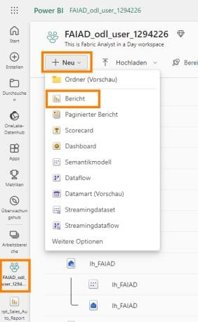

## Inhalt
Einführung
Power BI
  - Aufgabe 1: Bericht automatisch erstellen
  - Aufgabe 2: Hintergrund für einen neuen Bericht konfigurieren 
  - Aufgabe 3: Dem Bericht eine Kopfzeile hinzufügen 
  - Aufgabe 4: Dem Bericht KPIs hinzufügen
  - Aufgabe 5: Dem Bericht ein Liniendiagramm hinzufügen
  - Aufgabe 6: Den Bericht speichern
  - Aufgabe 7: Spalte „Year“ in der Tabelle „Date“ konfigurieren 
  - Aufgabe 8: Die Spalte „Short_Month_Name“ in der Tabelle „Date“ konfigurieren 
  - Aufgabe 9: Liniendiagramm formatieren 
  - Aufgabe 10: Neue Daten hinzufügen, um den Direct Lake-Modus zu simulieren 

Übungsumgebung bereinigen 

Referenzen 
## Einführung
Wir haben Daten aus verschiedenen Datenquellen in Lakehouse erfasst, eine Einführung in
Lakehouse erhalten, einen Aktualisierungsplan für die Datenquellen festgelegt und ein Datenmodell
erstellt. Jetzt erstellen wir einen Bericht.
Inhalt dieser Übung:
  - So erstellen Sie einen Bericht automatisch
  - So erstellen Sie einen Bericht von einem leeren Canvas ausgehend
  - So erkunden Sie den Direct Lake-Modus, in dem Daten automatisch aktualisiert werden

## Power BI
### Aufgabe 1: Bericht automatisch erstellen
Verwenden wir zunächst die Option „Bericht automatisch erstellen“. Und später in der Übung
werden wir den Bericht, den wir in Power BI haben, neu erstellen.
1. Wir navigieren zurück zum **Fabric-Arbeitsbereich**, den Sie in der vorherigen Übung erstellt haben.
2. Wählen Sie unten links das Symbol **Fabric-Funktionsbereichs-Auswahl** aus.
3. Das Dialogfeld „Fabric-Funktionsbereich“ wird geöffnet. Wählen Sie **Power BI** aus. Sie werden zur
**Power BI-Startseite** weitergeleitet.

   

4. Wählen Sie **Neuer Bericht** aus dem oberen Menü aus.

    

5. Sie werden zu **Erstellen Sie Ihren ersten Bericht** weitergeleitet. Dort sind Optionen verfügbar, um Daten manuell einzugeben und einen Bericht zu erstellen oder um ein veröffentlichtes semantisches Modell auszuwählen. In den vorherigen Übungen haben wir ein semantisches Modell erstellt. Lassen Sie uns das verwenden. Wählen Sie die Option **Veröffentlichtes Semantikmodell auswählen** aus.

    

6. Die Seite „Ein in Ihrem Bericht zu verwendendes DataSet auswählen“ wird geöffnet. Beachten
Sie, dass wir über vier Optionen verfügen. **Wählen Sie lh_FAIAD aus**:
a. **lh_FAIAD:** Dies ist das Lakehouse mit dem DataSet, den wir erstellt haben und für den
Bericht verwenden möchten.
b. **Units by Supplier:** Dies ist das DataSet, das wir mit T-SQL erstellt haben.
c. **DataflowsStagingWarehouse:** Dies ist das Staging Warehouse, das standardmäßig
erstellt wird. Wir haben es nicht verwendet, da wir keine Daten bereitgestellt haben.
d. **DataflowsStagingLakehouse:** Dies ist das Staging Lakehouse, das standardmäßig erstellt
wird. Wir haben es nicht verwendet, da wir keine Daten bereitgestellt haben.

7. Klicken Sie auf den **Pfeil neben der Schaltfläche „Bericht automatisch erstellen“**. Beachten Sie,
dass es zwei Optionen gibt: „Bericht automatisch erstellen“ und „Leeren **Bericht erstellen“.
Versuchen** wir es mit der automatischen Erstellung. Wählen Sie daher Bericht automatisch
erstellen aus.

    

8. Power BI beginnt mit der automatischen Erstellung des Berichts. Beachten Sie, dass bei
entsprechender Auswahl eine Option für die Vorauswahl verschiedener Daten vorhanden ist.
Sobald der Bericht fertig ist, wird oben rechts auf dem Bildschirm ein Dialogfeld angezeigt.
Wählen Sie **View report now** aus.

    

**Prüfpunkt:** Sie erhalten einen Bericht, der wie im folgenden Screenshot aussieht. Es gibt einige KPIs
und einige Trendvisualisierungen. Dies ist ein guter Ausgangspunkt, wenn Sie ein neues Modell
analysieren und sofort starten müssen.

**Hinweis:** Im oberen Menü haben Sie die Möglichkeit, den Bericht zu bearbeiten oder einige der
Daten als Tabellen anzuzeigen. Sehen Sie sich diese Optionen doch einmal genauer an.
9. Speichern wir diesen Bericht. Wählen Sie im oberen Menü **Speichern** aus.
10. Das Dialogfeld „Bericht speichern“ wird geöffnet. Geben Sie dem Bericht den Namen
**rpt_Sales_Auto_Report**.
**Hinweis:** Wir stellen dem Berichtsnamen das Präfix „rpt“ voran, was für „Bericht“ steht.

11. Stellen Sie sicher, dass der Bericht in Ihrem Arbeitsbereich **FAIAD_<Benutzername>** gespeichert wird.
12. Wählen Sie **Speichern** aus.

    

**Hinweis:** Der automatisch erstellte Bericht kann für Sie anders aussehen, da er „automatisch erstellt“
wird. Dies hängt auch von den Beziehungen und Kennzahlen ab, die Sie in der vorangegangenen
Übung (Übung 6) erstellt haben.

Der Screenshot oben zeigt, wie der automatisch erstellte Bericht aussehen **könnte**, wenn Sie alle
Beziehungen und Kennzahlen einschließlich der optionalen Beziehungen (Übung 6) erstellt haben.

Der Screenshot unten zeigt, wie der automatisch erstellte Bericht aussehen **könnte**, wenn Sie die
Erstellung der optionalen Beziehungen und Kennzahlen (Übung 6) übersprungen haben.


### Aufgabe 2: Hintergrund für einen neuen Bericht konfigurieren
Lassen Sie uns einen neuen Bericht mit einer leeren Canvas erstellen.
1. Wählen Sie im **linken Bereich** den Namen Ihres Arbeitsbereichs, **FAIAD_<Benutzername>**, aus,
um zum Arbeitsbereich zu gelangen.
2. Wählen Sie im oberen Menü **Neu -> Bericht** aus. Sie werden zur Seite „Erstellen Sie Ihren ersten
Bericht” weitergeleitet.

    

3. Wählen Sie **Veröffentlichtes Semantikmodell auswählen** aus, damit wir das von uns erstellte
Modell auswählen können.

   

4. Das Dialogfeld „Ein in Ihrem Bericht zu verwendendes Semantikmodell auswählen“ wird
geöffnet. Wählen Sie **lh_FAIAD** aus.
5. Klicken Sie auf den **Pfeil neben der Schaltfläche „Bericht automatisch erstellen“**. Wählen Sie
**Leeren Bericht erstellen** aus.

    

6. Öffnen Sie **FAIAD.pbix** im Ordner **C:\FAIAD\Reports** in Ihrer Übungsumgebung, falls dies noch
nicht erfolgt ist.

Wir werden diesen Bericht als Referenz verwenden. Wir fügen zunächst den Canvashintergrund
hinzu. Wir erstellen die Berichtskopfzeile, fügen einige KPIs hinzu und erstellen das Liniendiagramm
„Verkäufe im Laufe der Zeit“. Aus Zeitgründen und davon ausgehend, dass Sie bereits Erfahrung mit
der Erstellung von Visuals Power BI Desktop haben, werden wir nicht alle Visuals erstellen.

  

7. Navigieren Sie zurück zum **Power BI-Canvas** in Ihrem Browser.
8. Wählen Sie im Visualisierungsbereich das **Symbol** für die **Formatseite** aus.
9. Erweitern Sie den **Abschnitt „Canvas-Hintergrund“**.
10. Wählen Sie **Durchsuchen** über die Option **Bild** aus. Das Dialogfeld „Datei-Explorer“ wird geöffnet.
11. Navigieren Sie zum Ordner **C:\FAIAD\Reports** in Ihrer Übungsumgebung.
12. Wählen Sie **Summary Background.png** aus.
13. Wählen Sie im Dropdownmenü **Bild anpassen** den Eintrag **Anpassen** aus.
14. Legen Sie die Transparenz auf **0 %** fest.

    

### Aufgabe 3: Dem Bericht eine Kopfzeile hinzufügen
1. Wir fügen nun die Kopfzeile am oberen Rand hinzu. Wählen Sie im **Menü** die Option **Textfeld** aus.
2. Geben Sie **Fabrikam Company** als erste Zeile in das Textfeld ein.
3. Geben Sie als zweite Zeile **Sales Report** in das Textfeld ein.
4. Markieren Sie **Fabrikam Company**, und legen Sie **Schriftart** auf **Segoe UI** und **Schriftgröße** auf **18**,
**Fett** fest.
5. Markieren Sie **Sales Report**, und legen Sie **Schriftart** auf **Segoe UI** und **Schriftgröße** auf **14** fest.
6. Erweitern Sie bei **ausgewähltem Textfeld** im Bereich „Textfeldformat“ rechts die Option **Effekte**.
7. Verwenden Sie den Schieberegler **Hintergrund**, um ihn auf **Aus** festzulegen.
8. Passen Sie die Größe des **Textfelds so an, dass es in den oberen Rand passt**.

    

### Aufgabe 4: Dem Bericht KPIs hinzufügen
1. Fügen wir nun Verkauf-KPI hinzu. Wählen Sie den **Leerraum** im Canvas aus, um den Fokus vom
Textfeld zu entfernen.
2. Wählen Sie im **Abschnitt Visualisierungen** die Option **Mehrzeiliges Kartenvisual** aus.
3. Erweitern Sie im **Abschnitt „Daten“** die **Tabelle Sales**.
4. Wählen Sie **Kennzahl „Sales“** aus.

    

5. Wenn das **mehrzeilige Kartenvisual ausgewählt ist**, wählen Sie das **Symbol „Visual formatieren“**
im Abschnitt „Visualisierungen“ aus.
6. Erweitern Sie den Abschnitt **Kategoriebeschriftungen** aus.
7. Erhöhen Sie die **Schriftgröße** auf **14**.
8. Wählen Sie das **Dropdownmenü „Farbe“** aus. Das Dialogfeld „Farbpalette“ wird geöffnet.
9. Legen Sie den HEX-Wert auf **#004753** fest.

    

10. Erweitern Sie den Abschnitt **Karten**.
11. Verwenden Sie den Schieberegler **Akzentleiste**, um ihn **auf** Aus festzulegen.

    
12. Wählen Sie im Visualisierungsbereich **Allgemein** aus.
13. Erweitern Sie den **Abschnitt „Effekte“**.
14. Verwenden Sie den Schieberegler **Hintergrund**, um ihn auf **Aus** festzulegen.
15. Ändern Sie die Größe des **Visuals**, und verschieben Sie es in das **linke Feld, wie im Screenshot
dargestellt.**

    

16. Fügen wir nun einen weiteren KPI hinzu. Wählen Sie die soeben erstellte **mehrzeilige Sales-Karte**
aus. **Kopieren Sie** das Visual, indem Sie **STRG+C** auf Ihrer Tastatur auswählen.
17. **Fügen Sie** das Visual ein, indem Sie **STRG+V** auf Ihrer Tastatur auswählen. Beachten Sie, dass das
Visual in das Canvas eingefügt wird.
18. Wenn das **neue Visual hervorgehoben ist**, entfernen Sie im Abschnitt **Visualisierungsbereich ->
Visual erstellen -> Felder** die Kennzahl **Sales**.
19. Erweitern Sie im Abschnitt **Daten** die Tabelle **Sales**, und wählen Sie die Kennzahl **Units** aus.
20. Ändern Sie die Größe des **Visuals** und **platzieren Sie es im Feld unter dem Sales-Visual**.

    

### Aufgabe 5: Dem Bericht ein Liniendiagramm hinzufügen
Lassen Sie uns ein Liniendiagramm erstellen, um Sales im Zeitverlauf nach Reseller Company zu
visualisieren.
1. Wählen Sie den **Leerraum** im Canvas aus, um den Fokus vom mehrzeiligen Kartenvisual zu
entfernen.
2. Wählen Sie im **Abschnitt Visualisierungen** die Option **Liniendiagramm** aus.
3. Erweitern Sie im **Abschnitt „Daten“** die Tabelle **Date**.
4. Wählen Sie das Feld **Year** aus. Beachten Sie, dass „Year“ standardmäßig summiert und der Y-
Achse hinzugefügt wird. Lassen Sie uns dies korrigieren.

    

### Aufgabe 6: Den Bericht speichern
Speichern wir den Bericht, bevor wir ihn verlassen, um Änderungen am Modell vorzunehmen.
1. Wählen Sie im Menü **Datei -> Speichern** aus.
2. Das Dialogfeld „Bericht speichern“ wird geöffnet. Geben Sie dem Bericht den Namen
**rpt_Sales_Report**.

    **Hinweis:** Wir stellen dem Berichtsnamen das Präfix „rpt“ voran, was für „Bericht“ steht.

3. Stellen Sie sicher, dass der Bericht im Arbeitsbereich **FAIAD_<Benutzername>** gespeichert wird.
4. Wählen Sie **Speichern** aus.

    

### Aufgabe 7: Spalte „Year“ in der Tabelle „Date“ konfigurieren
1. Wählen Sie in der **linken Menüleiste lh_FAIAD** aus, um zum Lakehouse zu navigieren.
2. Erweitern Sie im linken Explorer-Bereich **lhFAIAD -> Schemas -> dbo -> Tables -> Date.**
3. Wählen Sie die Spalte **Year** aus.
4. Erweitern Sie im Bereich **Eigenschaften** rechts den Abschnitt **Erweitert**.
5. Wählen Sie aus der Dropdownliste **Zusammenfassen nach** den Eintrag **Keine** aus.

    

6. Kehren Sie zum Bericht zurück, indem Sie in der linken Menüleiste **rpt_Sales_Report** auswählen.
7. Wählen Sie im oberen Menü **Bearbeiten** aus.
8. Wählen Sie im oberen Menü **Aktualisieren** aus. Beachten Sie, dass „Year“ im Datenbereich kein
Summierungsfeld ist.
9. Wenn das **Visual „Liniendiagramm“ ausgewählt ist, entfernen Sie „Sum of Year“** von der Y-Achse.
10. Wählen Sie das Feld **Year** aus, sodass es der **X-Achse** hinzugefügt wird.
11. Erweitern Sie die Tabelle **Sales**, und wählen Sie die **Kennzahl „Sales“** aus.

    

### Aufgabe 8: Die Spalte „Short_Month_Name“ in der Tabelle „Date“ konfigurieren
1. Fügen wir diesem Diagramm „Monat“ hinzu. Ziehen Sie das Feld **Short_Month_Name** unter **Year**
aus der Tabelle „Date“ in die **X-Achse**. Beachten Sie dass das Visual nach „Sales“ sortiert ist. Nun
sortieren wir es nach Short_Month_Name.
2. Wählen Sie die **Auslassungspunkte (…)** oben rechts im Visual aus.
3. Wählen Sie **Sortierachse -> Year Short_Month_Name** aus.
4. Wählen Sie die **Auslassungspunkte (…)** oben rechts im Visual aus.
5. Wählen Sie **Sortierachse -> Aufsteigend sortieren** aus.

   


    **Hinweis:** Die Monate sind alphabetisch sortiert. Lassen Sie uns dieses Problem beheben.

    

6.	Wählen Sie in der **linken Menüleiste lh_FAIAD** aus, um zum Lakehouse zu navigieren.
7.	Das Dialogfeld **Ungespeicherte Änderungen** wird angezeigt. Wählen Sie **Speichern** aus, um Änderungen am Bericht zu speichern.

    

8.	Sie werden zum Lakehouse lh_FAIAD weitergeleitet. Erweitern Sie im linken Explorer-Bereich
**lhFAIAD -> Schemas -> dbo -> Tables -> Date**.
9.	Wählen Sie die Spalte **Short_Month_Name** aus.
10.	Erweitern Sie im Bereich **Eigenschaften** rechts den Abschnitt **Erweitert**.
11.	Wählen Sie im Dropdownmenü **Nach Spalte sortieren** den Eintrag **Monat** aus.

    

12.	Kehren Sie zum Bericht zurück, indem Sie in der linken Menüleiste **rpt_Sales_Report** auswählen.
13.	Wählen Sie im oberen Menü **Bearbeiten** aus.
 
14.	Wählen Sie im oberen Menü **Aktualisieren** aus. Beachten Sie, dass die Monate jetzt richtig sortiert sind.

    


### Aufgabe 9: Liniendiagramm formatieren
Beachten Sie, wie einfach es ist, das semantische Modell beim Erstellen der Berichte zu aktualisieren. Daraus ergibt sich eine nahtlose Interaktion wie Power BI Desktop.
1.	Wenn das **Visual „Liniendiagramm“ ausgewählt ist**, erweitern Sie im Abschnitt **Daten** die Tabelle
**Reseller**.
2.	Ziehen Sie das Feld **Reseller -> Reseller Company** in den Abschnitt **Legende**.

    

3.	Wenn das **Visual „Liniendiagramm“ ausgewählt ist**, wählen Sie im Abschnitt **Visualisierung** das
**Symbol „Visual formatieren“ -> Allgemein** aus.
4.	Erweitern Sie den Abschnitt **Titel**.
5.	Legen Sie den **Titeltext** auf **Verkäufe im Zeitverlauf** fest.
6.	Erweitern Sie den Abschnitt **Effekte**.
 
7.	Verwenden Sie den Schieberegler **Hintergrund**, um ihn auf **Aus** festzulegen.

    

8.	Wählen Sie im Abschnitt **Visualisierung Symbol „Visual formatieren“ -> Visual** aus.
9.	Erweitern Sie den Abschnitt **Linien**.
10.	Erweitern Sie den Abschnitt **Farben**.
11.	Legen Sie die Farbe von **Wingtip Toys** auf **#004753** fest.
12.	Legen Sie die Farbe von **Tailspin Toys** auf **#F17925** fest.
13.	Ändern Sie die Größe des Visuals, und verschieben Sie es in das **obere rechte Feld, wie im Screenshot dargestellt**.
14.	Scrollen Sie im Visual nach rechts und **beachten Sie, dass Daten bis April 2023 verfügbar sind**.

    

15.	Lassen Sie uns den Bericht speichern, indem wird im Menü **Datei -> Speichern** auswählen.

Wie bereits erwähnt, werden wir nicht alle Visuals in dieser Übung erstellen. Sie können nach Belieben weitere Visuals erstellen.


### Aufgabe 10: Neue Daten hinzufügen, um den Direct Lake-Modus zu simulieren
Normalerweise müssen wir im Import-Modus, sobald die Daten in der Quelle aktualisiert wurden, das Power BI-Modell aktualisieren, woraufhin die Daten im Bericht aktualisiert werden. Im Direct Query-Modus sind die Daten im Power BI-Bericht verfügbar, nachdem sie in der Quelle aktualisiert wurden. Der Direct Query-Modus ist in der Regel jedoch langsam. Um dieses Problem zu beheben, hat Microsoft Fabric den Direct Lake-Modus eingeführt. Direct Lake ermöglicht das schnelle Laden der Daten aus dem Lake direkt in das Power BI-Modul, wo sie für die Analyse bereit sind.
Untersuchen wir dies genauer.

In einem realen Szenario werden die Daten an der Quelle aktualisiert. Da wir uns in einer Trainingsumgebung befinden, simulieren wir dies, indem wir eine Verbindung mit einer Parquet- Datei mit Daten für Mai 2023 herstellen.
1.	Wählen Sie in der linken Menüleiste **FAIAD_<Benutzername>** aus, um zur Startseite des Arbeitsbereichs zu wechseln.
2.	Wählen Sie **df_Sales_ADFS** aus, damit wir den Dataflow bearbeiten können, indem wir die neue Parquet-Datei hinzufügen.

    
3.	Wählen Sie im Menüband **Start -> Daten abrufen -> Leere Abfrage** aus.
4.	Das Dialogfeld „Mit Datenquelle verbinden“ wird geöffnet. Wählen Sie **alle Zeilen im Editor aus und löschen Sie sie.**
 
5.	Kopieren Sie den folgenden Code und fügen Sie ihn im Editor ein.

    ```
    Let

        Source = #“ADLS Base Folder“,

        #“Filtered Rows“ = Table.SelectRows(Source, each Text.Contains([Folder Path], „Sales.Invoices_May“)),

        #“https://stvnextblobstorage dfs core windows net/fabrikam-sales/Delta-Parquet-Format/Sales Invoices_May/_0- 0ee085a3-716f-4833-a792-c3162c1de300-0 parquet“ = #“Filtered Rows“{[#“Folder
    Path“=“https://stvnextblobstorage.dfs.core.windows.net/fabrikam-sales/Delta-Parquet-
    Format/Sales.Invoices_May/“,Name=“0-0ee085a3-716f-4833-a792-c3162c1de300-0.parquet“]}[Content],

        #“Imported Parquet“ = Parquet.Document(#“https://stvnextblobstorage dfs core windows net/fabrikam-sales/Delta- Parquet-Format/Sales Invoices_May/_0-0ee085a3-716f-4833-a792-c3162c1de300-0 parquet“)
    in

        #“Imported Parquet“
    ```

6.	Wählen Sie **Weiter** aus.

    

7.	Eine neue Abfrage wird neu erstellt. Wir möchten sie **umbenennen**. Nennen Sie die Abfrage im rechten Bereich unter **Abfrageeinstellungen -> Eigenschaften -> Name in MayInvoice** um.

8.	Lassen Sie uns für die neue Abfrage das Staging deaktivieren. **Klicken Sie mit der rechten Maustaste** auf die MayInvoice-Abfrage und **deaktivieren Sie „Staging aktivieren“**.

    

9.	Fügen wir nun die Rechnungsdaten vom Mai an die Invoice-Tabelle an. Wählen Sie im Abschnitt
„Abfragen“ die Abfrage **„Invoice“** aus.
10.	Wählen Sie im Menüband **Start -> Anfragen anfügen** aus.
11.	Das Dialogfeld „Abfrage anfügen“ wird angezeigt. Wählen Sie aus der Dropdown-Liste
**Anzufügende Tabelle** den Eintrag **MayInvoice** aus.
12.	Wählen Sie **OK** aus.

    

13.	Wählen Sie in der unteren rechten Ecke **Veröffentlichen** aus, um die Änderungen zu speichern und zu veröffentlichen.

    

**Hinweis:** Nach der Veröffentlichung wird der Dataflow aktualisiert. Dies kann einige Minuten dauern.

14.	Wählen Sie in der linken Menüleiste **rpt_Sales_Report** aus, um zum Bericht zurückzukehren.
15.	Wählen Sie im oberen Menü **Aktualisieren** aus. Beachten Sie, dass im Liniendiagramm jetzt Daten für Mai 2023 vorhanden sind. Beachten Sie auch, dass der Betrag und die Einheiten gestiegen sind.


Die Dataflows, die wir in früheren Übungen erstellt haben, werden termingerecht aktualisiert, die Daten werden in Lakehouse erfasst. Das Datenmodell in Lakehouse wird aktualisiert und die Berichte werden aktualisiert. Wir müssen das Datenmodell und den Bericht nicht aktualisieren, wenn jeder Dataflow aktualisiert wird. Dies ist der Vorteil von Direct Lake.
Sehen wir uns noch einmal die Herausforderungen an, die in der Problemstellung aufgeführt sind:

- **Das Dataset muss mindestens dreimal täglich aktualisiert werden, um den verschiedenen Aktualisierungszeiten der Datenquellen Rechnung zu tragen.**

Wir haben dieses Problem mithilfe von Direct Lake gelöst. Jeder einzelne Dataflow wird nach seinem Zeitplan aktualisiert. Das DataSet und der Bericht müssen nicht aktualisiert werden.
- **Die Aktualisierungen dauern lange, weil die Daten jedes Mal komplett aktualisiert werden müssen, um alle Änderungen an den Daten in den Quellsystemen zu erfassen.**

Auch hier haben wir dieses Problem mithilfe von Direct Lake gelöst. Jeder einzelne Dataflow wird nach seinem Zeitplan aktualisiert. Das DataSet und der Bericht müssen nicht aktualisiert werden, sodass wir uns keine Sorgen über eine vollständige Aktualisierung machen müssen.

- **Tritt in den Datenquellen, aus denen die Daten abgerufen werden, ein Fehler auf, wird die DataSet-Aktualisierung abgebrochen. Oftmals wird die Mitarbeiterdatei nicht pünktlich hochgeladen, was ebenso zum Abbruch der DataSet-Aktualisierung führt.**

Die Datenpipeline hilft, dieses Problem zu lösen, indem es die Möglichkeit bietet, die Aktualisierung bei Fehlern und in verschiedenen Intervallen zu wiederholen.

- **Änderungen am Datenmodell nehmen sehr viel Zeit in Anspruch, weil Power Query aufgrund der großen Datenmenge und des aufwändigen Transformationsvorgangs sehr lange braucht, um die Vorschauversionen zu aktualisieren.**

Wir haben festgestellt, dass Dataflows effizient und einfach zu ändern sind. Das Laden der Vorschauversion in Dataflows dauert in der Regel nicht lange.
- **Für Power BI Desktop brauchen Sie einen PC mit Windows, auch wenn im Unternehmen Mac-Geräte genutzt werden.**

Microsoft Fabric ist ein SaaS-Angebot. Wir benötigen lediglich einen Browser, um auf den Dienst zuzugreifen. Wir müssen keine Software auf unseren Desktops installieren.

## Übungsumgebung bereinigen

Wenn Sie bereit sind, die Übungsumgebung zu bereinigen, führen Sie die folgenden Schritte aus.
1.	Wählen Sie im linken Bereich den Arbeitsbereich **FAIAD_<Benutzername>** aus, um zur Startseite des Arbeitsbereichs zu navigieren.
2.	Klicken Sie im oberen Menü auf die **Auslassungspunkte (…)** neben „Zugriff verwalten“, und wählen Sie **Arbeitsbereichseinstellungen** aus.

    

3.	Das Dialogfeld „Arbeitsbereichseinstellungen“ wird geöffnet. Wählen Sie im linken Menü **Weitere** aus.
4.	Wählen Sie **Diesen Arbeitsbereich entfernen** aus.
5.	Das Dialogfeld „Arbeitsbereich löschen“ wird angezeigt. Wählen Sie **Löschen** aus.
 

Dadurch werden der Arbeitsbereich und alle darin enthaltenen Elemente gelöscht.


### Referenzen
Bei Fabric Analyst in a Day (FAIAD) lernen Sie einige der wichtigsten Funktionen von Microsoft Fabric kennen. Im Menü des Dienstes finden Sie in der Hilfe (?) Links zu praktischen Informationen.


Nachfolgend finden Sie weitere Angebote zur weiteren Arbeit mit Microsoft Fabric.
  - Die vollständige [Ankündigung der allgemeinen Verfügbarkeit von Microsof t Fabric](https://aka.ms/Fabric-Hero-Blog-Ignite23) finden Sie im Blogbeitrag.
  - Fabric bei einer [interaktiven Vorstellung](https://aka.ms/Fabric-GuidedTour) kennenlernen
  - Zur [kostenlosen Testversion von Microsof t Fabric](https://aka.ms/try-fabric) anmelden
  - [Website von Microsof t Fabric](https://aka.ms/microsoft-fabric) besuchen
  - Mit Modulen von [Fabric Learning](https://aka.ms/learn-fabric) neue Qualifikationen erwerben
  - [Technische Dokumentation zu Fabric](https://aka.ms/fabric-docs) lesen
  - [Kostenloses E-Book zum Einstieg in Fabric](https://aka.ms/fabric-get-started-ebook) lesen
  - Mitglied der [Fabric-Community](https://aka.ms/fabric-community) werden, um Fragen zu stellen, Feedback zu geben und sich mit anderen auszutauschen

Lesen Sie die detaillierteren Blogs zur Ankündigung der Fabric-Umgebung:
  - [Blog zum Data Factory-Funktionsbereich in Fabric](https://aka.ms/Fabric-Data-Factory-Blog)
  - [Blog zum Data Engineering-Funktionsbereich von Synapse in Fabric](https://aka.ms/Fabric-DE-Blog)
  - [Blog zum Data Science-Funktionsbereich von Synapse in Fabric](https://aka.ms/Fabric-DS-Blog)
  - [Blog zum Data Warehousing-Funktionsbereich von Synapse in Fabric](https://aka.ms/Fabric-DW-Blog)
  - [Blog zum Real-Time Analytics-Funktionsbereich von Synapse in Fabric](https://aka.ms/Fabric-RTA-Blog)
  - [Blog zur Power BI-Ankündigung](https://aka.ms/Fabric-PBI-Blog)
  - [Blog zum Data Activator-Funktionsbereich in Fabric](https://aka.ms/Fabric-DA-Blog)
  - [Blog zu Verwaltung und Governance in Fabric](https://aka.ms/Fabric-Admin-Gov-Blog)
  - [Blog zu OneLake in Fabric](https://aka.ms/Fabric-OneLake-Blog)
  - [Blog zur Dataverse- und Microsof t Fabric-Integration](https://aka.ms/Dataverse-Fabric-Blog)


© 2023 Microsoft Corporation. Alle Rechte vorbehalten.


Durch die Verwendung der vorliegenden Demo/Übung stimmen Sie den folgenden Bedingungen zu: 

Die in dieser Demo/Übung beschriebene Technologie/Funktionalität wird von der Microsoft
Corporation bereitgestellt, um Feedback von Ihnen zu erhalten und Ihnen Wissen zu vermitteln. Sie dürfen die Demo/Übung nur verwenden, um derartige Technologiefeatures und Funktionen zu bewerten und Microsoft Feedback zu geben. Es ist Ihnen nicht erlaubt, sie für andere Zwecke zu verwenden. Es ist Ihnen nicht gestattet, diese Demo/Übung oder einen Teil derselben zu ändern, zu kopieren, zu verbreiten, zu übertragen, anzuzeigen, auszuführen, zu vervielfältigen, zu veröffentlichen, zu lizenzieren, zu transferieren oder zu verkaufen oder aus ihr abgeleitete Werke zu erstellen.

DAS KOPIEREN ODER VERVIELFÄLTIGEN DER DEMO/ÜBUNG (ODER EINES TEILS DERSELBEN)
AUF EINEN/EINEM ANDEREN SERVER ODER SPEICHERORT FÜR DIE WEITERE VERVIELFÄLTIGUNG ODER VERBREITUNG IST AUSDRÜCKLICH UNTERSAGT.

DIESE DEMO/ÜBUNG STELLT BESTIMMTE SOFTWARE-TECHNOLOGIE-/PRODUKTFEATURES UND FUNKTIONEN, EINSCHLIESSLICH POTENZIELLER NEUER FEATURES UND KONZEPTE, IN EINER SIMULIERTEN UMGEBUNG OHNE KOMPLEXE EINRICHTUNG ODER INSTALLATION FÜR DEN OBEN BESCHRIEBENEN ZWECK BEREIT. DIE TECHNOLOGIE/KONZEPTE IN DIESER DEMO/ÜBUNG ZEIGEN MÖGLICHERWEISE NICHT DAS VOLLSTÄNDIGE FUNKTIONSSPEKTRUM UND FUNKTIONIEREN MÖGLICHERWEISE NICHT WIE DIE ENDGÜLTIGE VERSION. UNTER UMSTÄNDEN VERÖFFENTLICHEN WIR AUCH KEINE ENDGÜLTIGE VERSION DERARTIGER FEATURES ODER KONZEPTE. IHRE ERFAHRUNG BEI DER VERWENDUNG DERARTIGER FEATURES UND FUNKTIONEN IN EINER PHYSISCHEN UMGEBUNG KANN FERNER ABWEICHEND SEIN.

**FEEDBACK.** Wenn Sie Feedback zu den Technologiefeatures, Funktionen und/oder Konzepten geben, die in dieser Demo/Übung beschrieben werden, gewähren Sie Microsoft das Recht, Ihr Feedback in jeglicher Weise und für jeglichen Zweck kostenlos zu verwenden, zu veröffentlichen
und gewerblich zu nutzen. Außerdem treten Sie Dritten kostenlos sämtliche Patentrechte ab, die erforderlich sind, damit deren Produkte, Technologien und Dienste bestimmte Teile einer
Software oder eines Dienstes von Microsoft, welche/welcher das Feedback enthält, verwenden oder eine Verbindung zu dieser/diesem herstellen können. Sie geben kein Feedback, das einem Lizenzvertrag unterliegt, aufgrund dessen Microsoft Drittparteien eine Lizenz für seine Software oder Dokumentation gewähren muss, weil wir Ihr Feedback in diese aufnehmen. Diese Rechte bestehen nach Ablauf dieser Vereinbarung fort.

DIE MICROSOFT CORPORATION LEHNT HIERMIT JEGLICHE GEWÄHRLEISTUNGEN UND GARANTIEN IN BEZUG AUF DIE DEMO/ÜBUNG AB, EINSCHLIESSLICH ALLER AUSDRÜCKLICHEN, KONKLUDENTEN ODER GESETZLICHEN GEWÄHRLEISTUNGEN UND GARANTIEN DER HANDELSÜBLICHKEIT, DER EIGNUNG FÜR EINEN BESTIMMTEN ZWECK, DES RECHTSANSPRUCHS UND DER NICHTVERLETZUNG VON RECHTEN DRITTER. MICROSOFT MACHT KEINERLEI ZUSICHERUNGEN BZW. ERHEBT KEINERLEI ANSPRÜCHE IM HINBLICK AUF DIE RICHTIGKEIT DER ERGEBNISSE UND DES AUS DER VERWENDUNG DER DEMO/ÜBUNG RESULTIERENDEN ARBEITSERGEBNISSES BZW. BEZÜGLICH DER EIGNUNG DER IN DER DEMO/ÜBUNG ENTHALTENEN INFORMATIONEN FÜR EINEN BESTIMMTEN ZWECK.

**HAFTUNGSAUSSCHLUSS**

Diese Demo/Übung enthält nur einen Teil der neuen Features und Verbesserungen in Microsoft Power BI. Einige Features können sich unter Umständen in zukünftigen Versionen des Produkts ändern. In dieser Demo/Übung erhalten Sie Informationen über einige, aber nicht über alle neuen Features.