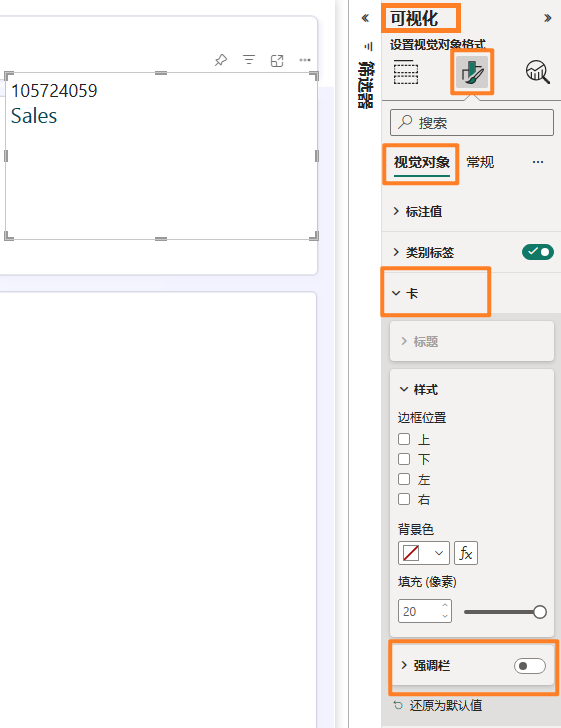
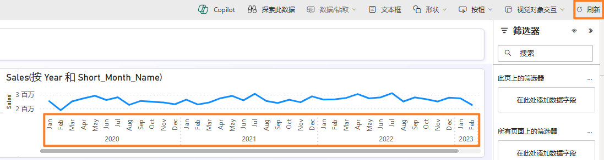
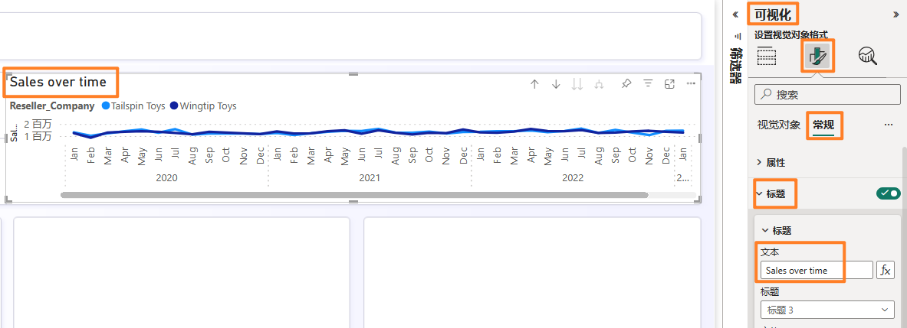

## Sumário
- Introdução
- Power BI
  - Tarefa 1: Criar relatório automaticamente
  - Tarefa 2: Configurar plano de fundo para um Novo relatório
  - Tarefa 3: Adicionar cabeçalho ao relatório
  - Tarefa 4: Adicionar KPIs ao relatório	
  - Tarefa 5: Adicionar gráfico de linhas ao  - relatório	
  - Tarefa 6: Salvar o relatório	
  - Tarefa 7: Configurar a coluna Year na tabela Date	
  - Tarefa 8: Configurar a coluna Short_Month_Name na tabela Date	
  - Tarefa 9: Formatar gráfico de linhas	
  - Tarefa 10: Adicionar novos dados para simular o modo Direct Lake	
- Limpar o ambiente do laboratório	
- Referências	

## Introdução
Ingerimos dados de diferentes fontes de dados no Lakehouse, fomos apresentados ao Lakehouse, definimos uma agenda de atualização para as fontes de dados e criamos um modelo de dados. Agora vamos criar um relatório.

Ao final deste laboratório, você terá aprendido:
  - Como criar um relatório automaticamente
  - Como criar um relatório a partir de uma tela em branco
  - Como experimentar o modo Direct Lake resultante da atualização automática de dados


## Power BI
### Tarefa 1: Criar relatório automaticamente
Vamos começar usando a opção de criação automática de relatório. E, mais adiante no laboratório, recriaremos o relatório que temos no Power BI.

1. Vamos voltar ao **workspace do Fabric** que você criou no laboratório anterior.
2. Na parte inferior esquerda da tela, selecione o ícone **Fabric experience selector.**
3. A caixa de diálogo de experiência do Fabric é aberta. Selecione **Power BI.** Você será direcionado a uma **Página Inicial do Power BI.**


   
 
4. No menu superior, selecione **Novo relatório.**


   

5. Você será direcionado para **Criar seu primeiro relatório.** Haverá opções para inserir dados manualmente e criar um relatório ou escolher um modelo semântico publicado. Criamos um modelo semântico nos laboratórios anteriores. Vamos usá-lo. Selecione a opção **Escolher um modelo semântico publicado.**


   

6. Escolha um conjunto de dados para usar quando a página do relatório é aberta. Observe que temos quatro opções. **Selecione lh_FAIAD:**<br>
**a. lh_FAIAD:** é o lakehouse com o conjunto de dados que criamos e queremos usar no relatório.<br>
**b. Units by Supplier:** é o conjunto de dados que criamos usando T-SQL.<br>
**c. DataflowsStagingWarehouse:** é o depósito temporário criado por padrão. Não usamos essa opção porque não preparamos dados.<br>
**d. DataflowsStagingLakehouse:** é o lakehouse temporário criado por padrão. Não usamos essa opção porque não preparamos dados.
 
7. Clique na **seta ao lado do botão Relatório de criação automática.** Existem duas opções: Criar relatório automaticamente e Criar um relatório em branco. Vamos tentar criar automaticamente. Selecione **Relatório de criação automática.**

   

8. O Power BI começará a criar automaticamente o relatório. Observe que há uma opção para pré- selecionar dados, se preferirmos. Quando o relatório estiver pronto, uma caixa de diálogo será exibida na parte superior direita da tela. Selecione **View report now.**

   

**Ponto de verificação:** você terá um relatório semelhante à captura de tela abaixo. Existem alguns KPIs e alguns visuais de tendências. Este é um bom começo se você estiver analisando um novo modelo e precisar de um impulso inicial.

**Observação:** No menu superior, você tem a opção de editar o relatório ou visualizar alguns dos dados como tabelas. Fique à vontade para explorar essas opções.

9. Vamos salvar este relatório. No menu superior, selecione **Salvar.**
10.	A caixa de diálogo Salvar seu relatório é aberta. Nomeie o relatório como **rpt_Sales_Auto_Report.**

**Observação:** estamos prefixando o nome do relatório com rpt, que é a abreviação de relatório.
 
11.	Verifique se o relatório está salvo no workspace, **FAIAD_<nome de usuário>.**
12.	Selecione **Salvar.**


**Observação:** A aparência do relatório criado automaticamente pode ser diferente para você, pois ele é "criado automaticamente". Depende também dos relacionamento e das medidas que você criou no laboratório anterior (Laboratório 6).

A captura de tela acima mostra como o relatório criado automaticamente poderá ser exibido se você tiver criado todos os relacionamentos e medidas, incluindo os relacionamentos opcionais
(Laboratório 6).

A captura de tela abaixo mostra como o relatório criado automaticamente poderá ser exibido se você tiver pulado a criação de relacionamentos e medidas opcionais (Laboratório 

   
 
### Tarefa 2: Configurar plano de fundo para um Novo relatório

Vamos criar um novo relatório usando uma tela em branco.
1. No **painel esquerdo,** selecione o nome do seu workspace, **FAIAD_<nome de usuário>** para ser direcionado para o workspace.
2. No menu superior, selecione **Novo -> Relatório.** Você será direcionado para criar sua primeira página de relatóri


   

3. Selecione **Escolher um modelo semântico publicado,** para que possamos escolher o modelo que criamo!

[](../Images/lab-07/image09.png)

4. Escolha um modelo semântico para usar quando a caixa de diálogo do relatório é aberta. Selecione **lh_FAIAD.**
5. Clique na **seta ao lado do botão Relatório de criação automática.** Selecione **Criar um relatório em branco.**

   

6. Se você ainda não tiver aberto, abra o arquivo **FAIAD.pbix** que está na pasta **C:\FAIAD\Reports** do seu ambiente de laboratório.

Usaremos este relatório como referência. Começaremos adicionando o plano de fundo da tela. Criaremos o cabeçalho do relatório, adicionaremos alguns KPIs e criaremos o gráfico de linhas Sales over time. Por uma questão de tempo e sabendo que você tem experiência com a criação de visuais no Power BI Desktop, não criaremos todos os visuais.

   

7. Volte para a **tela do Power BI** no seu navegador.
8. Selecione o **ícone Formatar página** no painel Visualizações.
9. Expanda a seção **Tela de fundo.**
10.	Selecione a opção **Procurar** na opção **Imagem.** A caixa de diálogo Explorador de Arquivos é aberta.
11.	Navegue até a pasta **C:\FAIAD\Reports** do seu ambiente de laboratório.
12.	Selecione **Summary Background.png.**
13.	Defina a lista suspensa **Ajuste da imagem** como **Ajuste.**
14.	Defina Transparência como **0%.*

   

### Tarefa 3: Adicionar cabeçalho ao relatório
1. Vamos adicionar o cabeçalho na margem superior. No **menu,** selecione **Caixa de texto.**
2. Insira **Fabrikam Company** como a primeira linha da caixa de texto.
3. Insira **Sales Report** como a segunda linha na caixa de texto.
4. Realce **Fabrikam Company** e defina a **fonte** como **Segoe UI** e **tamanho da fonte** como **18, negrito.**
5. Realce **Sales Report** e defina a **fonte** como **Segoe UI** e **tamanho da fonte** como **14.**
6. Com a **caixa de texto selecionada,** no painel Formatar caixa de texto à direita, **expanda Efeitos.**
7. Use o controle deslizante **Tela de fundo** para defini-lo como **Desativado.**
8. Redimensione a **caixa de texto para caber na margem superior.*

   

### Tarefa 4: Adicionar KPIs ao relatório
1. Vamos adicionar KPI de vendas. Selecione o **espaço em branco** na tela para tirar o foco da caixa de texto.
2. Na **seção Visualizações,** selecione o **visual de cartão de várias linhas.**
3. Na **seção Dados,** expanda a **tabela Sales.**
4. Selecione a **medida Sales.**

   

5. Com o **visual de cartão de várias linhas selecionado,** selecione o **ícone Formatar visual** na seção Visualizações.
6. Expanda a seção **Rótulos da categoria.**
7. Aumente o **tamanho da fonte** para **14.**
8. Selecione a **lista suspensa Cor.** A caixa de diálogo Paleta de cores é aberta.
9. Defina o valor Hex **#004753.**

   

10. Expanda a seção **Cartões.**
11.	Use o controle deslizante **Barra de destaque** para defini-lo como **Desativado.**

   

12.	Selecione **Geral** no painel Visualizações.
13.	Expanda a seção **Efeitos.**
14.	Use o controle deslizante **Tela de fundo** para defini-lo como **Desativado.**
15.	Redimensione o **visual** e mova-o para a **caixa esquerda como mostrado na captura de tela.**

   
 
16.	Vamos adicionar outro KPI. Selecione o **cartão de várias linhas Sales** que acabamos de criar. **Copie** o visual pressionando **Ctrl+C** no teclado.
17.	**Copie** o visual pressionando **Ctrl+V** no teclado. O visual é colado na tela.
18.	Com o **novo visual realçado,** no **painel Visualizações -> Criar visual -> seção Campos,** remova a medida **Sales.**
19.	Na seção **Dados,** expanda a tabela **Sales** e selecione a medida **Units.**
20.	Redimensione o **visual** e **coloque-o na caixa abaixo do visual Sales.**

   

### Tarefa 5: Adicionar gráfico de linhas ao relatório
Vamos criar um gráfico de linhas para visualizar Vendas ao longo do tempo por Reseller Company.
1. Selecione o **espaço em branco** na tela para tirar o foco do visual de cartão de várias linhas.
2. Na **seção Visualizações,** selecione **Gráfico de linhas.**
3.	Na seção **Dados,** expanda a tabela **Date.**
4. Selecione o campo **Year.** Observe que Year é somado por padrão e adicionado ao eixo Y. Vamos retificar isso.

   
 
### Tarefa 6: Salvar o relatório
Para fazer as alterações no modelo, salve o relatório antes de sair.
1. No menu, selecione **Arquivo -> Salvar.**
2. A caixa de diálogo Salvar seu relatório é aberta. Nomeie o relatório como **rpt_Sales_Report.**

    **Observação:** estamos prefixando o nome do relatório com rpt, que é a abreviação de relatório.
3. Verifique se o relatório está salvo no workspace **FAIAD_<nome de usuário>.**
4. Selecione **Salvar.**

   

### Tarefa 7: Configurar a coluna Year na tabela Date
1. Na **barra de menus à esquerda,** selecione **lh_FAIAD** para navegar até o lakehouse.
2. No painel esquerdo do Explorador, expanda **lhFAIAD -> Schemas -> dbo-> Tables -> Date.**
3. Selecione a coluna **Year.**
4. No painel **Propriedades,** à direita, expanda a seção **Avançado.**
5. Na lista suspensa **Resumir por,** selecione **Nenhum.**

   

6. Volte para o relatório selecionando **rpt_Sales_Report** na barra de menus à esquerda.
7. Selecione **Editar** no menu superior.
8. No menu superior, selecione **Atualizar.** Observe no painel Dados que Year não é campo de soma.
9. Com o **Visual de gráfico de linhas selecionado, remova Soma de Year** do eixo Y.
10.	Selecione o campo **Year** e ele será adicionado ao **Eixo X.**
11.	Expanda a tabela **Sales** e selecione a **medida Sales.**

   

### Tarefa 8: Configurar a coluna Short_Month_Name na tabela Date
1. Vamos adicionar Month a este gráfico. Na tabela Date, arraste o campo **Short_Month_Name** abaixo de **Year** no **Eixo X.** Observe que o visual é classificado por Sales. Vamos classificá-lo por Short_Month_Name.
2. Selecione as **reticências (…)** no canto superior direito do visual.
3. Selecione **Classificar eixo -> Year Short_Month_Name.**
4. Selecione as **reticências (…)** no canto superior direito do visual.
5. Selecione **Classificar eixo -> Classificar em ordem crescente.**

   

**Observação:** Os meses são classificados em ordem alfabética. Vamos corrigir isso.

   
 
6. Na **barra de menus à esquerda,** selecione **lh_FAIAD** para navegar até o lakehouse.
7. A caixa de diálogo **Alterações não salvas** é aberta. Selecione **Salvar** para salvar as alterações no relatório.

   

8. Você será direcionado ao lakehouse lh_FAIAD. No painel esquerdo do Explorador, expanda **lhFAIAD -> Schemas -> dbo-> Tables -> Date.**
9. Selecione a coluna **Short_Month_Name.**
10.	No painel **Propriedades,** à direita, expanda a seção **Avançado.**
11.	Na lista suspensa **Classificar por coluna,** selecione **Month.**

   

12.	Volte para o relatório selecionando **rpt_Sales_Report** na barra de menus à esquerda.
13.	Selecione **Editar** no menu superior.
14.	No menu superior, selecione **Atualizar.** Observe que agora os meses estão classificados corretamente.

   
 
### Tarefa 9: Formatar gráfico de linhas
Observe como é fácil atualizar o modelo semântico durante a criação dos relatórios. Isso proporciona uma interação perfeita, como Power BI Desktop.
1. Com o **Visual de gráfico de linhas selecionado,** na seção **Dados,** expanda a tabela **Reseller.**
2. Arraste o campo **Reseller -> Reseller Company** na seção **Legenda.**

   

3. Com o **Visual de gráfico de linhas selecionado,** na seção **Visualizações,** selecione o **ícone Formatar visual -> Geral.**
4. Expanda a seção **Título.**
5. Defina o texto de **Título** como **Sales over time.**
6. Expanda a seção **Efeitos.**
7. Use o controle deslizante **Tela de fundo** para defini-lo como **Desativado.**

   

8. Na seção **Visualizações,** selecione o **ícone Formatar visual -> Visual.**
9. Expanda a seção **Linhas.**
10.	Expanda a seção **Cores.**
11.	Defina a cor de **Wingtip Toys** como **#004753.**
12.	Defina a cor de **Tailspin Toys** como **#F17925.**
13.	Redimensione o **visual** e mova-o para a **caixa superior direita como mostrado na captura de tela.**
14.	Role para a direita no visual e **observe que temos dados até abril de 2023.**
 
   

15.	Vamos salvar o relatório. No menu, selecione **Arquivo > Salvar.**

Conforme mencionado anteriormente, não criaremos todos os visuais neste laboratório. Quando quiser, fique à vontade para criar mais visuais.


### Tarefa 10: Adicionar novos dados para simular o modo Direct Lake
Geralmente, no modo Import, depois que os dados são atualizados na fonte, precisamos atualizar o modelo do Power BI após o qual os dados no relatório são atualizados. Com o modo Direct Query, depois que os dados são atualizados na fonte, eles ficam disponíveis no relatório do Power BI. No entanto, o modo direct query geralmente é lento. Para resolver esse problema, o Microsoft Fabric introduziu o modo Direct Lake. Direct Lake é um caminho rápido para carregar os dados do lake diretamente para o mecanismo do Power BI, pronto para análise. Vamos explorar isso.

Em um cenário real, os dados são atualizados na fonte. Como estamos em um ambiente de treinamento, simularemos isso conectando-o a um arquivo parquet com dados de maio de 2023.
1. Selecione **FAIAD_<nome de usuário>** na barra de menus à esquerda a fim de navegar até a home page do workspace.
2. Selecione **df_Sales_ADFS** para que possamos editar o fluxo de dados adicionando o novo arquivo Parquet.
 
   

3. Na faixa de opções, selecione **Página Inicial -> Obter Dados -> Consulta em branco.**
4. A caixa de diálogo Conectar-se à fonte de dados é aberta. Selecione todas as linhas no editor e exclua-o.
5. Copie o código abaixo e cole-o no editor.

```
let 
Source = #"ADLS Base Folder",
#"Filtered Rows" = Table.SelectRows(Source, each Text.Contains([Folder Path], "Sales.Invoices_May")), 
#"https://stvnextblobstorage dfs core windows net/fabrikam-sales/Delta-Parquet-Format/Sales Invoices_May/_0- 0ee085a3-716f-4833-a792-c3162c1de300-0 parquet" = #"Filtered Rows"{[#"Folder 
Path"="https://stvnextblobstorage.dfs.core.windows.net/fabrikam-sales/Delta-Parquet-Format/Sales.Invoices_May/",Name="0-0ee085a3-716f-4833-a792-c3162c1de300-0.parquet"]}[Content], 
#"Imported Parquet" = Parquet.Document(#"https://stvnextblobstorage dfs core windows net/fabrikam-sales/Delta- Parquet-Format/Sales Invoices_May/_0-0ee085a3-716f-4833-a792-c3162c1de300-0 parquet") 
in 
#"Imported Parquet" 
```

6. Selecione **Próximo.**

   
 
7. Uma nova consulta é recriada. Vamos **renomeá-la.** Renomeie a consulta para **MayInvoice** no painel direito, em **Configurações de consulta -> Propriedades -> Nome.**
8.	Vamos desabilitar o preparo para a nova consulta. **Clique com o botão direito do mouse** na consulta MayInvoice e **desmarque Habilitar o preparo.**

   

9.	Agora, vamos acrescentar os dados da fatura de maio à tabela Invoice. Selecione a consulta **Invoice** na seção Consultas.
10.	Na faixa de opções, selecione **Página Inicial - Acrescentar** consultas.
11.	A caixa de diálogo Acrescentar consulta é exibida. Na lista suspensa **Tabela a ser acrescentada,** selecione **MayInvoice.**
12.	Selecione **OK.**

   

13.	Selecione **Publicar** no canto inferior direito para salvar e publicar as atualizações.

   

**Observação:** Depois de publicado, o fluxo de dados será atualizado. Isso pode levar alguns minutos.

14.	Selecione **rpt_Sales_Report** na barra de menus à esquerda para voltar para o relatório.
15.	No menu superior, selecione **Atualizar.** Observe agora no gráfico de linhas que há dados para maio de 2023. Observe também que o valor de Sales e Units aumentou.

   

Os Fluxos de Dados que criamos nos laboratórios anteriores são atualizados na agenda. Os dados são ingeridos no Lakehouse. O modelo de dados no Lakehouse e os relatórios são atualizados. Não
precisamos atualizar o modelo de dados e o relatório quando cada Fluxo de Dados é atualizado. Esta é a vantagem do Direct Lake.

Vamos verificar novamente os desafios listados na declaração do problema:
  - **Você precisa atualizar seu conjunto de dados pelo menos três vezes por dia para acomodar os diferentes horários de atualização para as diferentes fontes de dados.**<br> Resolvemos isso usando Direct Lake. Cada Fluxo de Dados individual é atualizado em sua agenda. O conjunto de dados e o relatório não precisam ser atualizados.
  - **As atualizações podem demorar, pois é sempre necessário fazer uma atualização completa para capturar tudo o que foi atualizado nos sistemas de origem.**<br> Novamente, resolvemos isso usando Direct Lake. Cada Fluxo de Dados individual é atualizado em sua agenda. O conjunto de dados e o relatório não precisam ser atualizados, portanto não precisamos nos preocupar com a atualização completa.
 - **Os erros detectados em qualquer uma das fontes das quais você está extraindo dados resultarão na interrupção da atualização do conjunto de dados. Muitas vezes o arquivo do funcionário não é carregado no prazo, resultando na interrupção da atualização do conjunto de dados.**<br> O Pipeline de Dados ajuda a resolver esse problema, oferecendo o recurso de tentar novamente a atualização em caso de falha e em intervalos diferentes.
  - **As alterações no modelo de dados demoram muito tempo, pois o Power Query leva tempo para atualizar as versões preliminares devido aos tamanhos de dados grandes e às transformações complexas.**<br> Percebemos que os Fluxos de Dados são eficientes e fáceis de fazer alterações. Geralmente, a pré-visualização de Fluxos de Dados não demora muito para carregar.
  - **Você precisa de um computador com Windows para usar o Power BI Desktop mesmo que o padrão corporativo seja Mac.**<br> O Microsoft Fabric é uma oferta de SaaS. Tudo o que precisamos é de um navegador para acessar o serviço. Não precisamos instalar nenhum software em nossos desktops.


### Limpar o ambiente do laboratório
Quando você estiver pronto para limpar o ambiente do laboratório, siga as etapas abaixo.
1.	Selecione o workspace **FAIAD_<nome de usuário>** no painel esquerdo para navegar até a home page do workspace.
2.	No menu superior, selecione as **reticências (…)** ao lado de Gerenciar acesso e selecione **Configurações de workspace.**

   

3.	A caixa de diálogo Configurações de workspace será aberta. Selecione **Outro** no menu à esquerda.
4.	Selecione **Remover este workspace.**
5.	A caixa de diálogo Excluir workspace será aberta. Selecione **Excluir.**
 
Isso excluirá o workspace e todos os itens nele contidos.

   

## Referências
O Fabric Analyst in a Day (FAIAD) apresenta algumas das principais funções disponíveis no Microsoft Fabric. No menu do serviço, a seção Ajuda (?) tem links para ótimos recursos.

   

Veja aqui mais alguns recursos que ajudarão você com as próximas etapas do Microsoft Fabric.
  - Veja a postagem do blog para ler o [anúncio completo de GA do Microsoft Fabric](https://aka.ms/Fabric-Hero-Blog-Ignite23)
  - Explore o Fabric por meio do [Tour Guiado](https://aka.ms/Fabric-GuidedTour)
  - Inscreva-se para a [avaliação gratuita do Microsoft Fabric](https://aka.ms/try-fabric)
  - Visite o [site do Microsoft Fabric](https://aka.ms/microsoft-fabric)
  - Aprenda novas habilidades explorando os [módulos de Aprendizagem do Fabric](https://aka.ms/learn-fabric)
  - Explore a [documentação técnica do Fabric](https://aka.ms/fabric-docs)
  - Leia o [livro eletrônico gratuito sobre como começar a usar o Fabric](https://aka.ms/fabric-get-started-ebook)
  - Participe da [comunidade do Fabric](https://aka.ms/fabric-community) para postar suas perguntas, compartilhar seus comentários e aprender com outras pessoas

Leia os blogs de comunicados de experiências do Fabric em mais detalhes:
  - [Experiência do Data Factory no blog do Fabric](https://aka.ms/Fabric-Data-Factory-Blog)
  - [Experiência do Synapse Data Engineering no blog do Fabric](https://aka.ms/Fabric-DE-Blog)
  - [Experiência do Synapse Data Science no blog do Fabric](https://aka.ms/Fabric-DS-Blog)
  - [Experiência do Synapse Data Warehousing no blog do Fabric](https://aka.ms/Fabric-DW-Blog)
  - [Experiência do Synapse Real-Time Analytics no blog do Fabric](https://aka.ms/Fabric-RTA-Blog)
  - [Blog de comunicado do Power BI](https://aka.ms/Fabric-PBI-Blog)
  - [Experiência do Data Activator no blog do Fabric](https://aka.ms/Fabric-DA-Blog)
  - [Administração e governança no blog do Fabric](https://aka.ms/Fabric-Admin-Gov-Blog)
  - [OneLake no blog do Fabric](https://aka.ms/Fabric-OneLake-Blog)
  - [Blog de integração do Dataverse e Microsoft Fabric](https://aka.ms/Dataverse-Fabric-Blog)

  © 2023 Microsoft Corporation. Todos os direitos reservados.

Ao usar esta demonstração/este laboratório, você concorda com os seguintes termos:

A tecnologia/funcionalidade descrita nesta demonstração/neste laboratório é fornecida pela
Microsoft Corporation para obter seus comentários e oferecer uma experiência de aprendizado.
Você pode usar a demonstração/o laboratório somente para avaliar tais funcionalidades e
recursos de tecnologia e fornecer comentários à Microsoft. Você não pode usá-los para nenhuma outra finalidade. Você não pode modificar, copiar, distribuir, transmitir, exibir, executar,
reproduzir, publicar, licenciar, criar obras derivadas, transferir nem vender esta demonstração/este laboratório ou qualquer parte deles.

A CÓPIA OU A REPRODUÇÃO DA DEMONSTRAÇÃO/DO LABORATÓRIO (OU DE QUALQUER PARTE DELES) EM QUALQUER OUTRO SERVIDOR OU LOCAL PARA REPRODUÇÃO OU REDISTRIBUIÇÃO ADICIONAL É EXPRESSAMENTE PROIBIDA.

ESTA DEMONSTRAÇÃO/ESTE LABORATÓRIO FORNECE DETERMINADOS RECURSOS E
FUNCIONALIDADES DE PRODUTO/TECNOLOGIA DE SOFTWARE, INCLUINDO NOVOS RECURSOS E CONCEITOS POTENCIAIS, EM UM AMBIENTE SIMULADO SEM CONFIGURAÇÃO NEM
INSTALAÇÃO COMPLEXA PARA A FINALIDADE DESCRITA ACIMA. A TECNOLOGIA/OS CONCEITOS REPRESENTADOS NESTA DEMONSTRAÇÃO/NESTE LABORATÓRIO PODEM NÃO REPRESENTAR A
FUNCIONALIDADE COMPLETA DOS RECURSOS E PODEM NÃO FUNCIONAR DA MESMA MANEIRA QUE UMA VERSÃO FINAL. ALÉM DISSO, PODEMOS NÃO LANÇAR UMA VERSÃO FINAL DE TAIS RECURSOS OU CONCEITOS. SUA EXPERIÊNCIA COM O USO DE TAIS RECURSOS E
FUNCIONALIDADES EM UM AMBIENTE FÍSICO TAMBÉM PODE SER DIFERENTE.

**COMENTÁRIOS.** Caso você forneça comentários sobre os recursos de tecnologia, as funcionalidades e/ou os conceitos descritos nesta demonstração/neste laboratório à Microsoft, você concederá à Microsoft, sem encargos, o direito de usar, compartilhar e comercializar seus comentários de qualquer forma e para qualquer finalidade. Você também concede a terceiros, sem encargos, quaisquer direitos de patente necessários para que seus produtos, suas tecnologias e seus serviços usem ou interajam com partes específicas de um software ou um
serviço da Microsoft que inclua os comentários. Você não fornecerá comentários que estejam sujeitos a uma licença que exija que a Microsoft licencie seu software ou sua documentação para terceiros em virtude da inclusão de seus comentários neles. Esses direitos continuarão em vigor após o término do contrato.

POR MEIO DESTE, A MICROSOFT CORPORATION SE ISENTA DE TODAS AS GARANTIAS E CONDIÇÕES REFERENTES À DEMONSTRAÇÃO/AO LABORATÓRIO, INCLUINDO TODAS AS
GARANTIAS E CONDIÇÕES DE COMERCIALIZAÇÃO, SEJAM ELAS EXPRESSAS, IMPLÍCITAS OU ESTATUTÁRIAS, E DE ADEQUAÇÃO A UMA FINALIDADE ESPECÍFICA, TÍTULO E NÃO VIOLAÇÃO.
A MICROSOFT NÃO DECLARA NEM GARANTE A PRECISÃO DOS RESULTADOS DERIVADOS DO USO DA DEMONSTRAÇÃO/DO LABORATÓRIO NEM A ADEQUAÇÃO DAS INFORMAÇÕES CONTIDAS NA DEMONSTRAÇÃO/NO LABORATÓRIO A QUALQUER FINALIDADE.

**AVISO DE ISENÇÃO DE RESPONSABILIDADE**

Esta demonstração/este laboratório contém apenas uma parte dos novos recursos e aprimoramentos do Microsoft Power BI. Alguns dos recursos podem ser alterados em versões futuras do produto. Nesta demonstração/neste laboratório, você aprenderá sobre alguns dos novos recursos, mas não todos.
