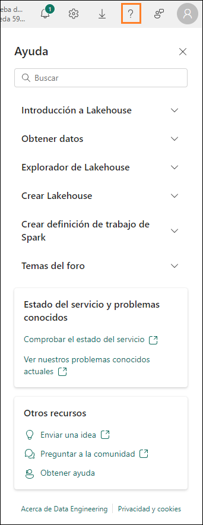

# Microsoft Fabric - Fabric Analyst in a Day - Laboratorio 2

## Contenido	
- Introducción	
- Licencia de Fabric	
  - Tarea 1: Habilitar una licencia de prueba de Microsoft Fabric	
- Información general de las experiencias de Fabric	
  - Tarea 2: Experiencia de Data Factory	
  - Tarea 3: Experiencia de Data Activator	
  - Tarea 4: Experiencia de Industry Solutions	
  - Tarea 5: Experiencia de Real-Time Intelligence	
  - Tarea 6: Experiencia de Synapse Data Engineering	
  - Tarea 7: Experiencia de Synapse Data Science	
  - Tarea 8: Experiencia de Synapse Data Warehouse	
- Área de trabajo de Fabric	
  - Tarea 9: Crear un área de trabajo de Fabric	
  - Tarea 10: Crear un Lakehouse	
- Referencias	

## Introducción 

Hoy tendrá ocasión de aprender diversas características clave de Microsoft Fabric. Este es un taller introductorio destinado a presentarle las diversas experiencias de productos y artículos disponibles en Fabric. Al final de este taller, habrá aprendido a utilizar almacenes de lago de datos, flujos de datos Gen2, canalizaciones de datos, DirectLake, etc.

Al final de este laboratorio, habrá aprendido:

- Cómo crear un área de trabajo de Fabric
- Cómo crear un lakehouse  

## Licencia de Fabric

### Tarea 1: Habilitar una licencia de prueba de Microsoft Fabric

1. Abra el **explorador** y vaya a https://app.powerbi.com/. Se le llevará a la página de inicio de sesión.

    **Nota:** Si no está utilizando el entorno de laboratorio y tiene una cuenta de Power BI existente, es posible que desee utilizar el explorador en modo privado/incógnito.

2. Introduzca el** Nombre de usuario** disponible en la pestaña **Variables de entorno** (al lado de la Guía de laboratorio) como **Email** y haga clic en **Send**.

   
 
3. Esto le llevará a la pantalla de **Contraseña**. Introduzca la **Contraseña** disponible en la pestaña **Variables de entorno** (al lado de la Guía de laboratorio) compartida con usted por el instructor. 

4. Haga clic en **Sign in** y siga las indicaciones para iniciar sesión en Fabric.

   

5. Se le dirigirá a la **página principal del servicio Power BI** que ya conoce.

6. Asumimos que está familiarizado con el diseño del servicio Power BI. Si tiene alguna pregunta, no dude en preguntar.

   Actualmente, está en Mi área de trabajo. Para trabajar con elementos de Fabric, necesitará una licencia de prueba y un área de trabajo que tenga una licencia de Fabric asignada.

7. En la esquina superior derecha de la pantalla, seleccione el **icono** del **usuario**.

8. Seleccione **Prueba gratuita**.

   
 
9. Se abre el cuadro de diálogo Actualizar a una prueba Microsoft Fabric gratuita. Seleccione **Iniciar período de prueba**.

   

10. Se abre el cuadro de diálogo Se ha actualizado con éxito a una Prueba de Microsoft Fabrica gratuita. Seleccione **Fabric Home Page**. 

    
 
11. Se le dirigirá a la **página Inicio de Microsoft Fabric**.

    
 
## Información general de las experiencias de Fabric

### Tarea 2: Experiencia de Data Factory

1. Seleccione el icono **Microsoft Fabric** (selector de experiencia de Fabric) en la parte inferior izquierda de la pantalla. Tenga en cuenta que Power BI, Data Factory, Data Activator, Industry Solutions y Real-Time Intelligence son experiencias independientes. Data Engineering, Data Science y Data Warehouse son experiencias de Synapse y estas cuatro experiencias funcionan con la tecnología de Synapse. Exploremos.

2. Seleccione **Data Factory**.

   
 
3. Se le dirigirá a la **Data Factory Home**. Esta página tiene tres secciones principales. 

   a. **Recomendado:** enumera los elementos disponibles en Data Factory: Flujo de datos Gen2, Canalización de datos, Flujo de trabajo de datos y API para GraphQL.

    - El flujo de datos de segunda generación es la nueva generación de flujos de datos.
    
    - La canalización de datos se utiliza para la orquestación de datos.
    
    - El flujo de trabajo de datos es el administrador de orquestación de flujo de trabajo.
    
    - API para GraphQL es una API para consultar múltiples orígenes de datos.

   b. **Aprender:** esta sección proporciona acceso a documentación de aprendizaje de inicio rápido.

   c. **Quick Access:** esta sección enumera los elementos favoritos o usados recientemente.

   
 
### Tarea 3: Experiencia de Data Activator

1. Seleccione el **icono Selector de experiencia de Fabric** (actualmente configurado en Data Factory) en la parte inferior izquierda de la pantalla. Se abre el cuadro de diálogo de experiencia de Fabric.

   
 
2. Seleccione **Data Activator** en el cuadro de diálogo. Se le dirigirá a la **página principal de Data Activator**. Data Activator es una experiencia sin código en Microsoft Fabric para tomar acciones automáticamente cuando se detectan patrones o condiciones en los datos cambiantes. Observe que las tres secciones son como la experiencia de Data Factory. En la sección Recomendado, observe los elementos:

    a. **Reflejo:** se utiliza para supervisar conjuntos de datos, consultas y flujos de eventos en busca de patrones.

    b. **Ejemplo de reflejo (versión preliminar):** solución de muestra.

    
 
### Tarea 4: Experiencia de Industry Solutions

1. Seleccione el **icono Selector de experiencia de Fabric** (actualmente configurado en Data Activator) en la parte inferior izquierda de la pantalla. Se abre el cuadro de diálogo de experiencia de Fabric.

2. Seleccione **Industry Solutions** en el cuadro de diálogo. Se le dirigirá a la página Inicio de **Industry Solutions**. Microsoft Fabric ofrece soluciones de datos específicas de sector que proporcionan una plataforma sólida para la administración de datos, el análisis y la toma de decisiones. Estas soluciones de datos abordan los desafíos únicos a los que se enfrentan diferentes sectores, lo cual permite a las empresas optimizar las operaciones, integrar datos de diferentes orígenes y utilizar análisis enriquecidos. Observe que las tres secciones son como las experiencias anteriores. En la sección Recomendado, observe los elementos:

    a. **Soluciones de sostenibilidad:** admiten la ingesta, la estandarización y el análisis de datos ambientales, sociales y de gobernanza (ASG).

    b. **Soluciones comerciales de datos:** ayudan a administrar grandes volúmenes de datos, a integrar datos de diversos orígenes y a proporcionar análisis en tiempo real para una toma de decisiones rápida. Los minoristas pueden utilizar estas soluciones para la optimización del inventario, la segmentación de clientes, la previsión de ventas, la fijación de precios dinámicos y la detección de fraude.

    c. **Las soluciones de atención sanitaria** están diseñadas estratégicamente para acelerar el tiempo de creación de valor para los clientes al abordar la necesidad crítica de transformar de manera eficiente los datos sanitarios en un formato adecuado para el análisis.

    
 
### Tarea 5: Experiencia de Real-Time Intelligence

1. Seleccione el **icono Selector de experiencia de Fabric** (actualmente configurado en Industry Solutions) en la parte inferior izquierda de la pantalla. Se abre el cuadro de diálogo de experiencia de Fabric.

2. Seleccione **Real-Time Intelligence**. Se le dirigirá a la **página principal de Real-Time Intelligence**. De nuevo, hay tres secciones. En la sección Recomendado, observe los elementos:

    a. **Eventhouse:** se utiliza para crear un área de trabajo de base de datos, que se puede compartir entre proyectos.

    b. **Conjunto de consultas KQL:** se utiliza para ejecutar consultas sobre los datos para producir tablas y objetos visuales que se pueden compartir.

    c. **Panel de información en tiempo real:** se utiliza para visualizar paneles de información en tiempo real en cuestión de segundos desde la ingesta de datos.

    d. **Eventstream:** se utiliza para capturar, transformar y enrutar el flujo de eventos en tiempo real.

    e. **Reflex:** se utiliza para supervisar conjuntos de datos, consultas y flujos de eventos en busca de patrones.

    f. **Usar una muestra:** solución de muestra.

    

   **Nota:** Reflex también está disponible en experiencias de Data Activator.
 
### Tarea 6: Experiencia de Synapse Data Engineering

1. Seleccione el **icono Selector de experiencia de Fabric** (actualmente configurado en Real-Time Intelligence) en la parte inferior izquierda de la pantalla. Se abre el cuadro de diálogo de experiencia de Fabric.

2. Seleccione **Data Engineering**. Se le dirigirá a la **Synapse Data Engineering Home**. De nuevo, la página tiene tres secciones principales. En la sección Recomendado, observe los elementos:

    a. **Lakehouse:** se utiliza para almacenar macrodatos para limpiar, consultar, generar informes y compartir.

    b. **Notebook:** se utiliza para la ingesta de datos, la preparación, el análisis y otras tareas relacionadas con los datos utilizando varios lenguajes como Python, R y Scala.

    c. **Environment:** se utiliza para configurar bibliotecas compartidas, configuraciones y recursos informáticos de Spark para portátiles y definiciones de trabajos de Spark.

    d. **Spark Job Definition:** se utiliza para definir, programar y administrar trabajos de Apache.

    e. **Data pipeline:** se usa para orquestar una solución de datos.

    f. **API para GraphQL:** es una API para consultar múltiples orígenes de datos.

    g. **Import notebook:** se usa para importar blocs de notas desde la máquina local.

    h. **Use a sample:** solución de muestra.

    
 

### Tarea 7: Experiencia de Synapse Data Science

1. Seleccione el **icono Selector de experiencia de Fabric** (actualmente configurado en Data Engineering) en la parte inferior izquierda de la pantalla. Se abre el cuadro de diálogo de experiencia de Fabric.

2. Seleccione **Data Science**. Se le dirigirá a la **Synapse Data Science Home**. De nuevo, hay tres secciones. En la sección Recomendado, observe los elementos:

    a. **ML model:** se usa para crear modelos de machine learning.
    b. Experiment: se utiliza para crear, ejecutar y hacer un seguimiento del desarrollo de múltiples modelos.

    c. **Notebook:** se utiliza para explorar datos y crear soluciones de machine learning.

    d. **Environment:** se utiliza para configurar bibliotecas compartidas, configuraciones y recursos informáticos de Spark para portátiles y definiciones de trabajos de Spark.

    e. **Capacidad de IA:** se utiliza para crear su propia experiencia de IA generativa.

    f. **Import notebook:** se usa para importar blocs de notas desde la máquina local.

    g. **Use a sample:** solución de muestra.

   **Nota:** los elementos como Bloc de notas, Entorno, Canalización de datos, etc. están disponibles en múltiples experiencias, ya que son relevantes en cada una de estas experiencias.

   
 
### Tarea 8: Experiencia de Synapse Data Warehouse

1. Seleccione el **icono Selector de experiencia de Fabric** (actualmente configurado en Data Science) en la parte inferior izquierda de la pantalla. Se abre el cuadro de diálogo de experiencia de Fabric.

2. Seleccione **Data Warehouse**. Se le dirigirá a la **página principal de Data Warehouse**. De nuevo, hay tres secciones. En la sección Nuevo, observe los elementos:

    a. **Almacén:** se usa para crear un Data Warehouse.

    b. **Canalización de datos:** se usa para orquestar una solución de datos.

    c. **Base de datos SQL reflejada:** se utiliza para reflejar Azure SQL Database.

    d. **Snowflake reflejado:** se utiliza para reflejar la base de datos de Snowflake.

    e. **Azure Cosmos DB reflejado:** se utiliza para reflejar Azure Cosmos DB.

    
 
## Área de trabajo de Fabric

### Tarea 9: Crear un área de trabajo de Fabric

1. Ahora creemos un área de trabajo con licencia de Fabric. Seleccione **Áreas de trabajo** en la barra de navegación de la izquierda. Se abre un cuadro de diálogo.

2. Seleccione **Nueva área de trabajo**.

   
 
3. **El cuadro de diálogo Crear un área de trabajo** se abre en el lado derecho del explorador.

4. En el campo **Nombre**, introduzca **FAIAD_<username>**

   **Nota:** El nombre del área de trabajo debe ser único. Sin embargo, el nombre de su área de trabajo debe ser diferente. Asegúrese de que aparezca una marca de verificación verde con "**Este nombre está disponible**" debajo del campo Nombre.

5. Si lo desea, puede escribir una **Descripción** para el área de trabajo. Este campo es opcional.

6. Haga clic para expandir la sección **Avanzado**.

   
 
7. En **License mode**, asegúrese de que **Trial** esté seleccionado. (Debería estar seleccionado de manera predeterminada).

8. Seleccione **Apply** para crear una nueva de trabajo.

   
 
   Se crea una nueva área de trabajo y se nos dirige hasta ella. Traeremos datos de los diferentes orígenes de datos a un Lakehouse y utilizaremos los datos del Lakehouse para crear nuestro modelo y generar informes en él. El primer paso es crear un Lakehouse.

### Tarea 10: Crear un Lakehouse

1. Seleccione el **icono Selector de experiencia de Fabric** (actualmente configurado en Data Warehouse) en la parte inferior izquierda de la pantalla. Se abre el cuadro de diálogo de experiencia de Fabric.

2. Seleccione **Data Engineering** para navegar a la página principal de Data Engineering.

   
 
3. Seleccione **Lakehouse**.

   
 
4. Se abre un nuevo cuadro de diálogo de lakehouse. Escriba **lh_FAIAD** en el cuadro de texto Nombre. 

   **Nota:** lh aquí se refiere a Lakehouse. Vamos a anteponer lh para que sea fácil de identificar y buscar.

5. Seleccione **Create**.

   
 
   En unos momentos, se crea un lakehouse y se le dirigirá a la interfaz del mismo. En el **panel izquierdo**, observe que debajo de su área de trabajo tendrá el icono del lakehouse. Puede navegar fácilmente hasta el lakehouse si hace clic en este icono en cualquier momento.

   Dentro del explorador del lakehouse, verá **Tables** y **Files**. Lakehouse podría exponer archivos Azure Data Lake Storage Gen2 en la sección de archivos o un flujo de datos podría cargar datos en las tablas del lakehouse. Existen varias opciones disponibles. Le mostraremos algunas de las opciones en las siguientes prácticas de laboratorio.

   
   
   En esta práctica de laboratorio, exploramos la interfaz de Fabric, creamos un área de trabajo de Fabric y un lakehouse. En el próximo laboratorio, aprenderemos a utilizar accesos directos en el almacén de lago de datos para conectarnos a los datos de ADLS Gen2 y a transformar estos datos mediante vistas.

## Referencias

Fabric Analyst in a Day (FAIAD) le presenta algunas funciones clave disponibles en Microsoft Fabric. En el menú del servicio, la sección Ayuda (?) tiene vínculos a algunos recursos excelentes.

Estos son algunos recursos más que podrán ayudarle a seguir avanzando con Microsoft Fabric.

- Vea la publicación del blog para leer el [anuncio de disponibilidad general de Microsoft Fabric](https://aka.ms/Fabric-Hero-Blog-Ignite23) completo.
- Explore Fabric a través de la [Visita guiada](https://aka.ms/Fabric-GuidedTour)
- Regístrese en la [prueba gratuita de Microsoft Fabric](https://aka.ms/try-fabric)
- Visite el [sitio web de Microsoft Fabric](https://aka.ms/microsoft-fabric)
- Adquiera nuevas capacidades mediante la exploración de los [módulos de aprendizaje de Fabric](https://aka.ms/learn-fabric)
- Explore la [documentación técnica de Fabric](https://aka.ms/fabric-docs)
- Lea el [libro electrónico gratuito sobre cómo empezar a usar Fabric](https://aka.ms/fabric-get-started-ebook)
- Únase a la [comunidad de Fabric](https://aka.ms/fabric-community) para publicar sus preguntas, compartir sus comentarios y aprender de otros.

Obtenga más información en los blogs de anuncios de la experiencia Fabric:

- [Experiencia de Data Factory en el blog de Fabric](https://aka.ms/Fabric-Data-Factory-Blog) 
- [Experiencia de Synapse Data Engineering en el blog de Fabric](https://aka.ms/Fabric-DE-Blog) 
- [Experiencia de Synapse Data Science en el blog de Fabric](https://aka.ms/Fabric-DS-Blog) 
- [Experiencia de Synapse Data Warehousing en el blog de Fabric](https://aka.ms/Fabric-DW-Blog) 
- [Experiencia de Synapse Real-Time Analytics en el blog de Fabric](https://aka.ms/Fabric-RTA-Blog)
- [Blog de anuncios de Power BI](https://aka.ms/Fabric-PBI-Blog)
- [Experiencia de Data Activator en el blog de Fabric](https://aka.ms/Fabric-DA-Blog) 
- [Administración y gobernanza en el blog de Fabric](https://aka.ms/Fabric-Admin-Gov-Blog)
- [OneLake en el blog de Fabric](https://aka.ms/Fabric-OneLake-Blog)
- [Blog de integración de Dataverse y Microsoft Fabric](https://aka.ms/Dataverse-Fabric-Blog)

© 2023 Microsoft Corporation. Todos los derechos reservados.

Al participar en esta demostración o laboratorio práctico, acepta las siguientes condiciones:

Microsoft Corporation pone a su disposición la tecnología o funcionalidad descrita en esta demostración/laboratorio práctico con el fin de obtener comentarios por su parte y de facilitarle una experiencia de aprendizaje. Esta demostración/laboratorio práctico solo se puede usar para evaluar las características de tal tecnología o funcionalidad y para proporcionar comentarios a Microsoft. No se puede usar para ningún otro propósito. Ninguna parte de esta demostración/laboratorio práctico se puede modificar, copiar, distribuir, transmitir, mostrar, realizar, reproducir, publicar, licenciar, transferir ni vender, ni tampoco crear trabajos derivados de ella.

LA COPIA O REPRODUCCIÓN DE ESTA DEMOSTRACIÓN/LABORATORIO PRÁCTICO (O PARTE DE ELLA) EN CUALQUIER OTRO SERVIDOR O UBICACIÓN PARA SU REPRODUCCIÓN O DISTRIBUCIÓN POSTERIOR QUEDA EXPRESAMENTE PROHIBIDA.

ESTA DEMOSTRACIÓN/LABORATORIO PRÁCTICO PROPORCIONA CIERTAS FUNCIONES Y CARACTERÍSTICAS DE PRODUCTOS O TECNOLOGÍAS DE SOFTWARE (INCLUIDOS POSIBLES NUEVOS CONCEPTOS Y CARACTERÍSTICAS) EN UN ENTORNO SIMULADO SIN INSTALACIÓN O CONFIGURACIÓN COMPLEJA PARA EL PROPÓSITO ARRIBA DESCRITO. LA TECNOLOGÍA/CONCEPTOS DESCRITOS EN ESTA DEMOSTRACIÓN/LABORATORIO PRÁCTICO NO REPRESENTAN LA FUNCIONALIDAD COMPLETA DE LAS CARACTERÍSTICAS Y, EN ESTE SENTIDO, ES POSIBLE QUE NO FUNCIONEN DEL MODO EN QUE LO HARÁN EN UNA VERSIÓN FINAL. ASIMISMO, PUEDE QUE NO SE PUBLIQUE UNA VERSIÓN FINAL DE TALES CARACTERÍSTICAS O CONCEPTOS. DE IGUAL MODO, SU EXPERIENCIA CON EL USO DE ESTAS CARACTERÍSTICAS Y FUNCIONALIDADES EN UN ENTORNO FÍSICO PUEDE SER DIFERENTE.

**COMENTARIOS**. Si envía comentarios a Microsoft sobre las características, funcionalidades o conceptos de tecnología descritos en esta demostración/laboratorio práctico, acepta otorgar a Microsoft, sin cargo alguno, el derecho a usar, compartir y comercializar sus comentarios de cualquier modo y para cualquier fin. También concederá a terceros, sin cargo alguno, los derechos de patente necesarios para que sus productos, tecnologías y servicios usen o interactúen con cualquier parte específica de un software o servicio de Microsoft que incluya los comentarios. No enviará comentarios que estén sujetos a una licencia que obligue a Microsoft a conceder su software o documentación bajo licencia a terceras partes porque incluyamos sus comentarios en ellos. Estos derechos seguirán vigentes después del vencimiento de este acuerdo.

MICROSOFT CORPORATION RENUNCIA POR LA PRESENTE A TODAS LAS GARANTÍAS Y CONDICIONES RELATIVAS A LA DEMOSTRACIÓN/LABORATORIO PRÁCTICO, INCLUIDA CUALQUIER GARANTÍA Y CONDICIÓN DE COMERCIABILIDAD (YA SEA EXPRESA, IMPLÍCITA O ESTATUTARIA), DE IDONEIDAD PARA UN FIN DETERMINADO, DE TITULARIDAD Y DE AUSENCIA DE INFRACCIÓN. MICROSOFT NO DECLARA NI GARANTIZA LA EXACTITUD DE LOS RESULTADOS, EL RESULTADO DERIVADO DE LA REALIZACIÓN DE LA DEMOSTRACIÓN/LABORATORIO PRÁCTICO NI LA IDONEIDAD DE LA INFORMACIÓN CONTENIDA EN ELLA CON NINGÚN PROPÓSITO.

**DECLINACIÓN DE RESPONSABILIDADES**

Esta demostración/laboratorio práctico contiene solo una parte de las nuevas características y mejoras realizadas en Microsoft Power BI. Puede que algunas de las características cambien en versiones futuras del producto. En esta demostración/laboratorio práctico, conocerá algunas de estas nuevas características, pero no todas.

