# Microsoft Fabric - Fabric Analyst in a Day - Laboratorio 4

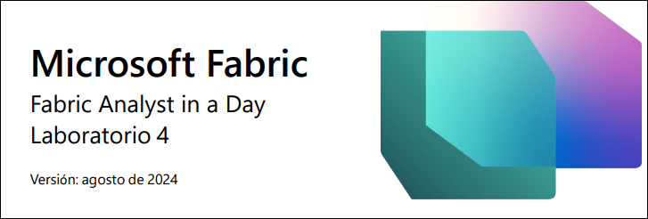

# Contenido 

- Presentación	
- Flujo de datos Gen2	
  - Tarea 1: Copiar consultas de SharePoint al flujo de datos	
  - Tarea 2: Crear una conexión a SharePoint	
  - Tarea 3: Configurar el destino de datos para la consulta People	
  - Tarea 4: Publicar y cambiar el nombre del flujo de datos deSharePoint	
  - Tarea 5: Copiar consultas de Snowflake al flujo de datos	
  - Tarea 6: Crear una conexión a Snowflake	
  - Tarea 7: Configurar el destino de datos para las consultas de Supplier y PO	
  - Tarea 8: Cambiar el nombre y publicar el flujo de datos de Snowflake	
- Acceso directo a ADLS Gen2	
  - Tarea 9: Cómo crear un acceso directo a Dataverse	
  - Tarea 6: Crear un acceso directo al almacén de lago de datos	
- Referencias	

# Presentación 

En nuestro escenario, los datos del proveedor están en Snowflake, los datos del cliente están en Dataverse y los datos de los empleados están en SharePoint. Todos estos orígenes de datos se actualizan en diferentes momentos. Para minimizar la cantidad de actualizaciones de datos de los flujos de datos, crearemos flujos de datos individuales para los orígenes de datos de Snowflake y SharePoint.

**Nota:** Se admiten varios orígenes de datos en un único flujo de datos.

El equipo de TI ya ha establecido un vínculo a Dataverse y aplicado las transformaciones de datos necesarias, reflejándolas en el archivo de Power BI Desktop. Han ingerido estos datos al almacén de lago de datos en el área de trabajo de administración y nos han dado acceso a las tablas. Vamos a crear un acceso directo para el almacén de lago de datos que ha creado el equipo de TI.

Al final de este laboratorio, habrá aprendido: 

- Cómo conectarse a SharePoint mediante el flujo de datos Gen2 e ingerir datos en el almacén de lago de datos
- Cómo conectarse a Snowflake mediante el flujo de datos Gen2 e ingerir datos en el almacén de lago de datos
- Cómo ingerir datos desde un almacén de lagos compartido

# Flujo de datos Gen2

## Tarea 1: Copiar consultas de SharePoint al flujo de datos

1. Volvamos al área de trabajo de Fabric, **FAIAD_<username>**, que creó en el Laboratorio 2, Tarea 9.

2. Seleccione el icono **Selector de experiencia de Fabric** en la parte inferior izquierda de su pantalla. Se abre el cuadro de diálogo de experiencia de Fabric

3. Seleccione **Data Factory** en el cuadro de diálogo. Navegará a la **página principal de Data Factory**.

   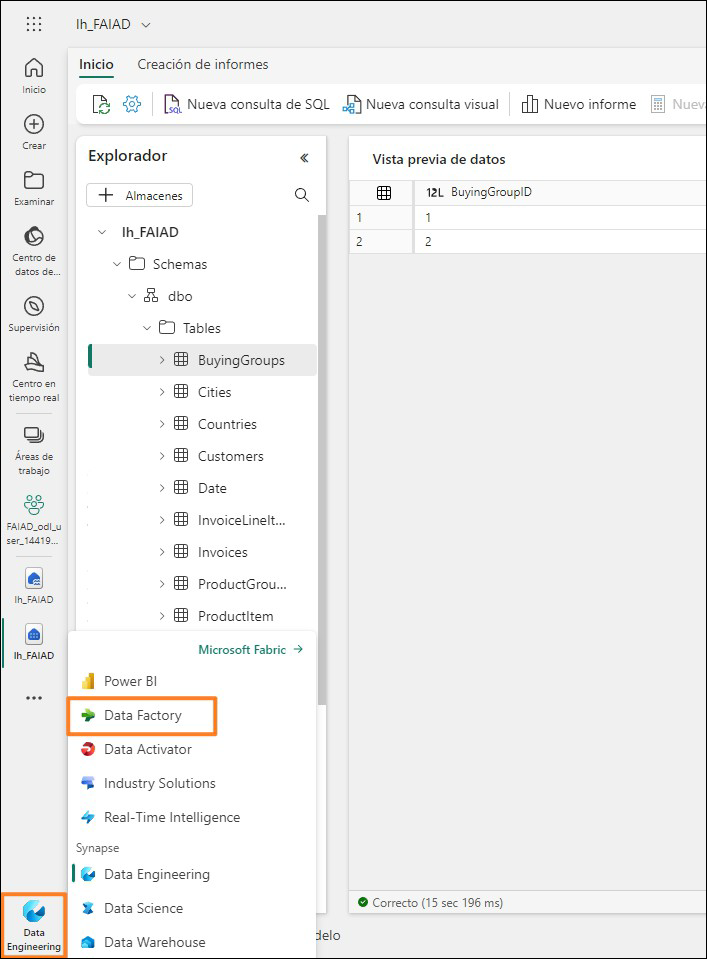
 
4. En Artículos recomendados, seleccione **Dataflow Gen2**.

   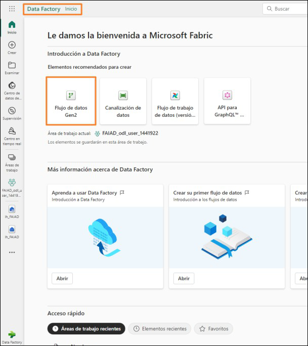
 
    Se le dirigirá de vuelta a la **página de del flujo de datos**. La interfaz del flujo de datos Gen2 es como Power Query en Power BI Desktop. Podemos copiar consultas desde el flujo de datos Gen2 de Power BI Desktop. Vamos a intentarlo.

5. Si todavía no lo ha abierto, abra **FAIAD.pbix** que se encuentra en la carpeta **Reports** del escritorio de su entorno de laboratorio. 

6. En la cinta de opciones, seleccione **Inicio -> Transformar datos**. Se abre la ventana de Power Query. Como habrá notado en la práctica de laboratorio anterior, las consultas en el panel izquierdo están organizadas por orígenes de datos.

7. En el panel izquierdo, en la carpeta SharepointData, **seleccione la** consulta **People**.

8. **Haga clic con el botón derecho** y seleccione Copiar.

   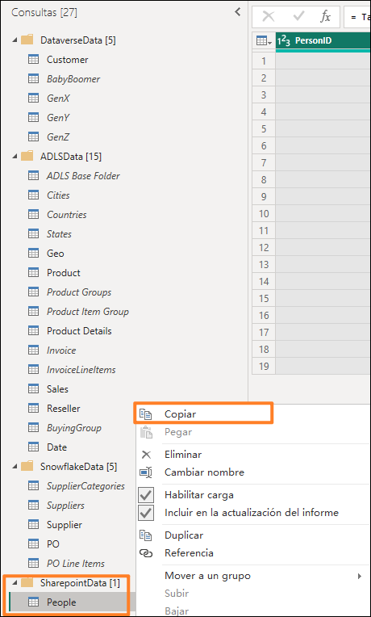
  
9. Vuelva a la **pantalla del flujo de datos** en el explorador.

10.	En el **panel del flujo de datos**, introduzca Ctrl+V (actualmente, hacer clic con el botón derecho en Pegar no es compatible). Si está utilizando un dispositivo MAC, utilice Cmd+V para pegar.

    **Nota:** Si está trabajando en el entorno de laboratorio, seleccione los puntos suspensivos en la parte superior derecha de la pantalla. Utilice el control deslizante para habilitar Portapapeles nativo de VM. Seleccione Aceptar en el cuadro de diálogo. Una vez que haya terminado de pegar las consultas, puede desactivar esta opción.

    Observe la consulta pegada y disponible en el panel izquierdo. Como no tenemos una conexión creada para SharePoint, verá un mensaje de advertencia que le solicitará que configure la conexión.

## Tarea 2: Crear una conexión a SharePoint

1. Seleccione **Configurar conexión**.

   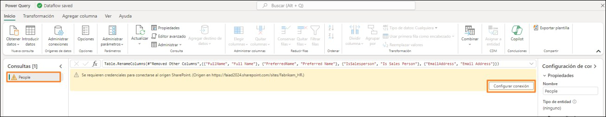
 
2. Se abre el cuadro de diálogo del origen de datos. En el menú desplegable **Conexión**, asegúrese de que **Crear nueva conexión** esté seleccionado.

3. **Tipo de autenticación** debería ser **Cuenta de organización**.

4. Seleccione **Conectar**.

**Nota:** Iniciará sesión con sus credenciales. Serán diferentes a la captura de pantalla siguiente.

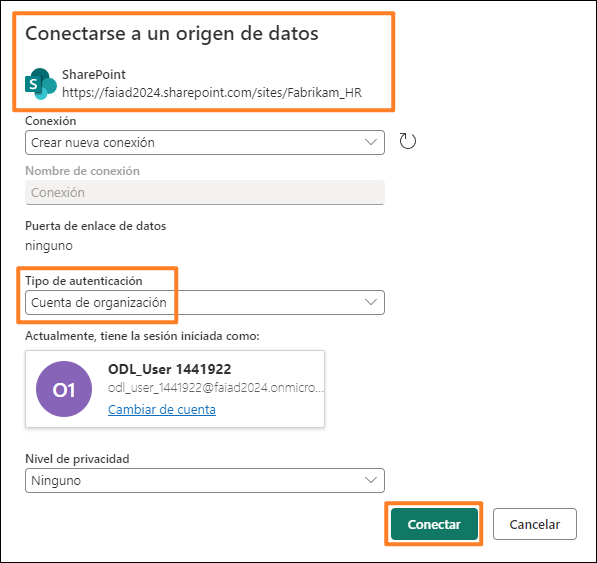
 
## Tarea 3: Configurar el destino de datos para la consulta People

Se establece la conexión y puede ver los datos en el panel de versión preliminar. Siéntase libre de navegar por los pasos aplicados de las consultas. Ahora necesitamos incorporar los datos de People en el almacén de lago de datos.

1. Seleccione la consulta **People**.

2. En la cinta de opciones, seleccione **Inicio -> Agregar destino de datos -> Lakehouse**.

   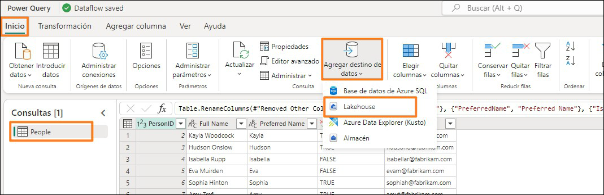
 
3. Se abre el cuadro de diálogo Conectarse al destino de datos. Necesitamos crear una nueva conexión con el almacén de lago de datos. Con **Crear nueva conexión** seleccionado en el **menú desplegable Conexión** y Tipo de autenticación configurado en **Cuenta de organización**, seleccione **Siguiente**.

   
 
4. Se abre el cuadro de diálogo de Elegir el objetivo de destino. Asegúrese de que el **botón de opción Nueva tabla** esté seleccionado, ya que estamos creando una nueva tabla.

5. Queremos crear la tabla en el lakehouse que creamos anteriormente. En el panel izquierdo, navegue hasta **Lakehouse -> FAIAD_<username>**. 

6. Seleccione **lh_FAIAD**.

7. Deje el nombre de la tabla como **People**

8. Seleccione **Siguiente**.

   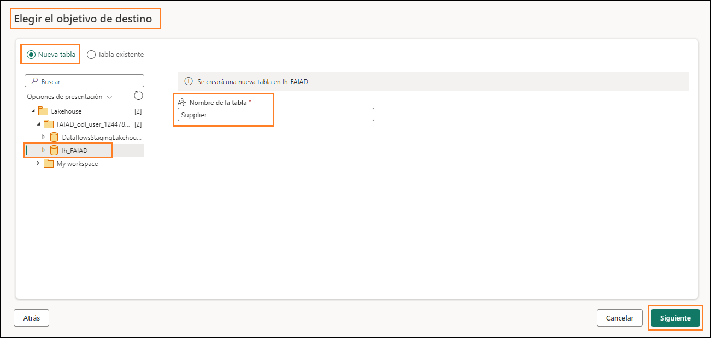
 
9. Se abre el cuadro de diálogo de Elegir la configuración de destino. Asegúrese de que la opción “**Usar configuración automática**” esté **habilitada**. 

    **Nota:** Puede deshabilitar la configuración automática y observe que tiene opciones para establecer las opciones Método de actualización y Esquema. Cuando haya finalizado la exploración, asegúrese de que la opción “**Usar configuración automática**” esté **habilitada**. 

10.	Seleccione **Guardar configuración**.

    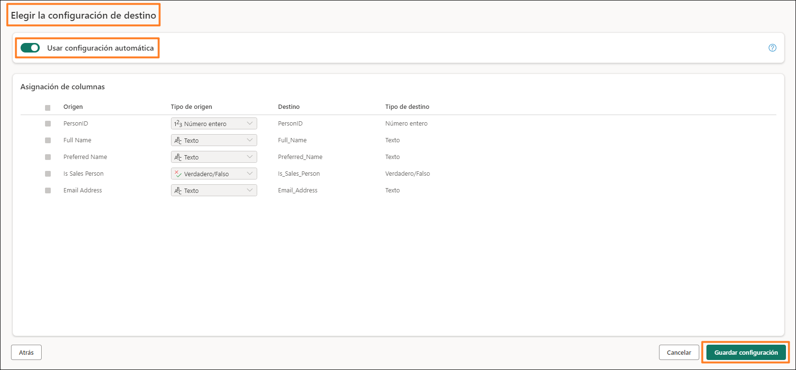
 

## Tarea 4: Publicar y cambiar el nombre del flujo de datos de SharePoint

1. Volverá a la **ventana de Power Query**. Observe que en la **esquina inferior derecha**, el destino de los datos está configurado en el **lakehouse**.

2. En la esquina inferior derecha, seleccione **Publicar**.

   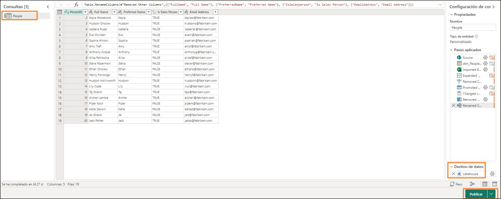
 
    **Nota:** Se le dirigirá de vuelta al área de trabajo **FAIAD_<username>**. Es posible que el flujo de datos tarde unos minutos en publicarse. 

3. Estamos trabajando con Dataflow 1. Cambiémosle el nombre antes de continuar. Haga clic en los **puntos suspensivos (…)** junto a Dataflow 1. Seleccione **Propiedades**.

   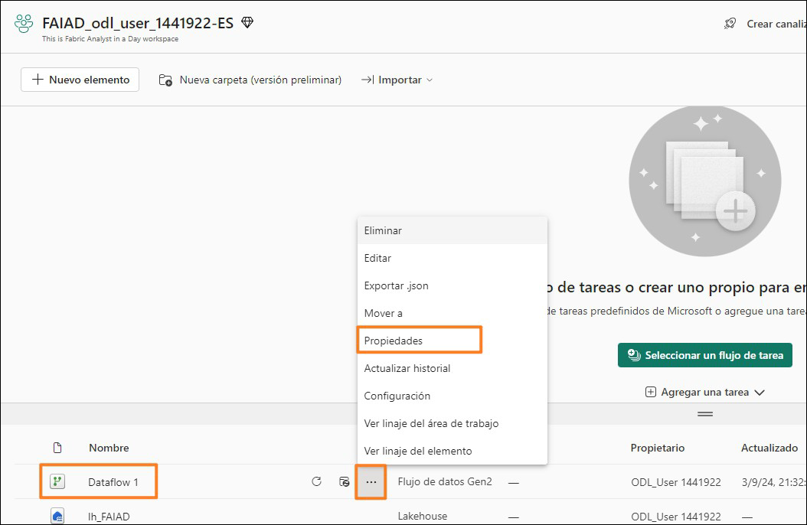
 
4. Se abre el cuadro de diálogo de propiedades del flujo de datos. Cambie el **nombre** a **df_People_SharePoint**.

5. En el cuadro de texto **Descripción**, agregue **Flujo de datos para ingerir datos** de People desde SharePoint a Almacén de lago de datos.

6. Seleccione **Guardar**.

   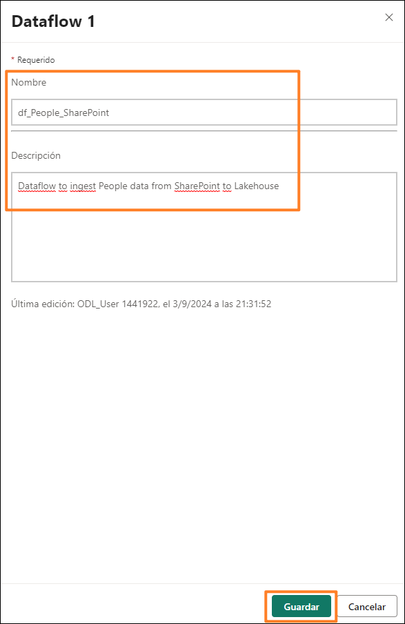
 
    Se le dirigirá de vuelta al **área de trabajo FAIAD_<username>**. 

7. Seleccione **lh_FAIAD** para ir al almacén de lago de datos.

8. Asegúrese de estar en la vista del almacén de lago de datos (no en el punto de conexión de análisis SQL).

9. Observe que la tabla **People** esté ahora disponible en el almacén de lago de datos.

    **Nota:** Si no ve las tablas recién creadas, seleccione los puntos suspensivos junto a Tables y seleccionar Actualizar para actualizar las tablas.

    Ahora hemos ingerido todos los datos en el almacén de lago de datos. En la próxima práctica de laboratorio, programaremos la actualización del flujo de datos.

## Tarea 5: Copiar consultas de Snowflake al flujo de datos

1. Volvamos al área de trabajo de Fabric, **FAIAD_<username>**

2. En el menú superior, seleccione **Nuevo -> Flujo de datos Gen2**.

   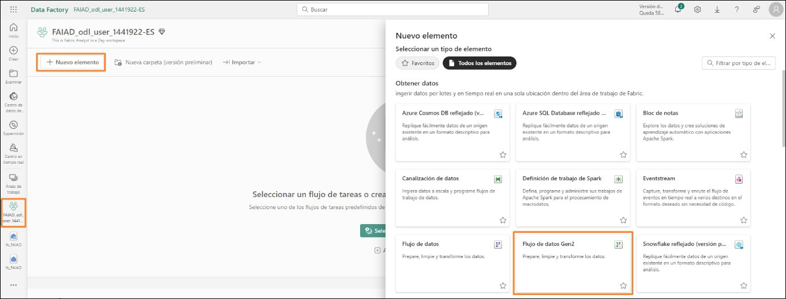
 
    Se le dirigirá de vuelta a la página de del flujo de datos. Ahora que estamos familiarizados con el flujo de datos, sigamos adelante y copiemos las consultas de Power BI Desktop en el flujo de datos.

3. Si todavía no lo ha abierto, abra **FAIAD.pbix** que se encuentra en la carpeta **Reports** del escritorio de su entorno de laboratorio. 

4. En la cinta de opciones, seleccione **Inicio -> Transformar datos**. Se abre la ventana de Power Query. Como habrá notado en la práctica de laboratorio anterior, las consultas en el panel izquierdo están organizadas por orígenes de datos.

5. Desde el panel izquierdo, en la carpeta SnowflakeData **Ctrl+Seleccionar** o Mayús+Seleccionar las siguientes consultas:

    a. SupplierCategories

    b. Suppliers

    c. Supplier

    d. PO

    e. PO Line Items

6. **Haga clic con el botón derecho** y seleccione **Copiar**.

   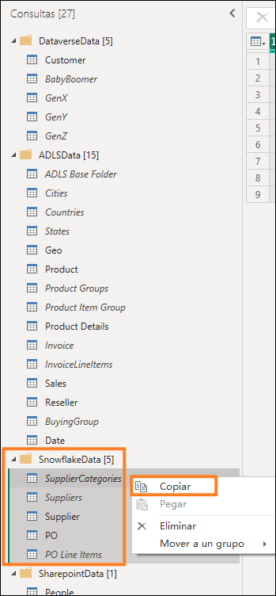
 
7. Vuelva al **explorador**.

8. En el **panel del flujo de datos**, seleccione el **panel central**, introduzca **Ctrl+V** (actualmente, hacer clic con el botón derecho en Pegar no es compatible). Si está utilizando un dispositivo MAC, utilice Cmd+V para pegar.

    **Nota:** Si está trabajando en el entorno de laboratorio, seleccione los puntos suspensivos en la parte superior derecha de la pantalla. Utilice el control deslizante para **habilitar Portapapeles nativo de VM**. Seleccione Aceptar en el cuadro de diálogo. Una vez que haya terminado de pegar las consultas, puede desactivar esta opción.

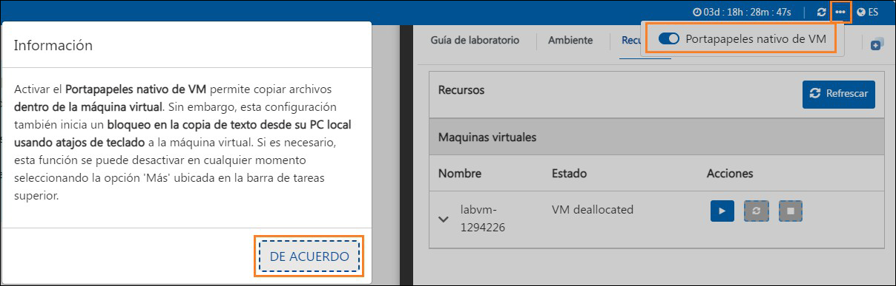
 
## Tarea 6: Crear una conexión a Snowflake

Observe que las cinco consultas están pegadas y ahora tiene el panel Consultas a la izquierda. Como no tenemos una conexión creada para Snowflake, verá un mensaje de advertencia que le solicitará que configure la conexión.

1. Seleccione **Configurar conexión**.
 
   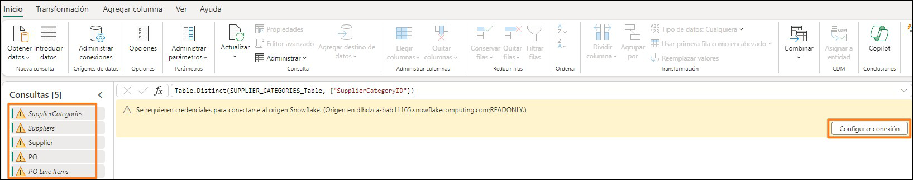

2. Se abre el cuadro de diálogo del origen de datos. En el menú desplegable **Conexión**, asegúrese de que **Crear nueva conexión** esté seleccionado.

3. **El tipo de autenticación** debe ser **Snowflake**.

4. Introduzca el **Nombre de usuario y contraseña de Snowflake** disponibles en la pestaña Variables de entorno (al lado de la pestaña Guía de laboratorio).

5. Seleccione **Conectar**.

   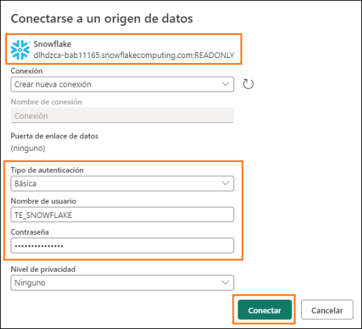
 
Se establece la conexión y puede ver los datos en el panel de versión preliminar. Siéntase libre de navegar por los pasos aplicados de las consultas. Básicamente, la consulta Suppliers tiene los detalles de los proveedores y SupplierCategories, como su nombre indica, tiene categorías de proveedores. Estas dos tablas se unen para crear la dimensión Supplier, con las columnas que necesitamos. De manera similar, tenemos PO Line Items combinada con pedidos de compra para crear el dato de PO. Ahora necesitamos incorporar los datos de Supplier y de PO en el almacén de lago de datos.

## Tarea 7: Configurar el destino de datos para las consultas de Supplier y PO

1.	Seleccione la consulta de **Supplier**.

2.	En la cinta de opciones, seleccione **Inicio -> Agregar destino de datos -> Lakehouse**.
 
    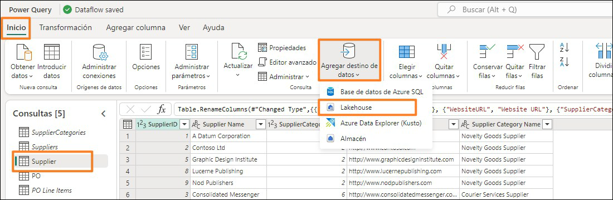

3.	Se abre el cuadro de diálogo Conectarse al destino de datos. Desde el **menú desplegable Conexión**, seleccione **Lakehouse (ninguno)**.

4.	Seleccione **Siguiente**.

    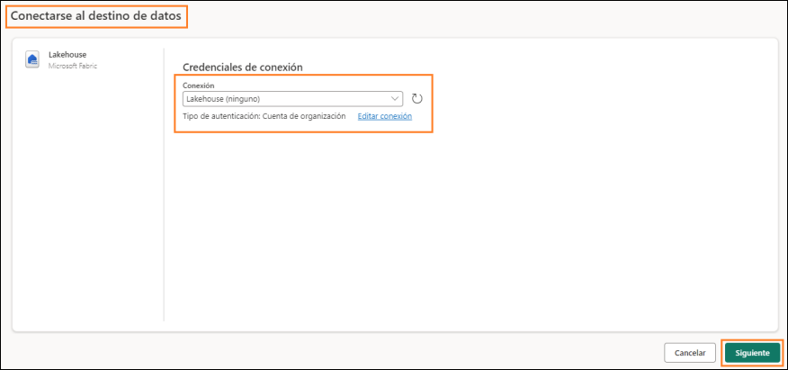

5.	Se abre el cuadro de diálogo de Elegir el objetivo de destino. Asegúrese de que el botón de opción **Nueva tabla** esté **seleccionado**, ya que estamos creando una nueva tabla.

6.	Queremos crear la tabla en el lakehouse que creamos anteriormente. En el panel izquierdo, navegue hasta **Lakehouse -> FAIAD_<username>**. 

7.	Seleccione **lh_FAIAD**.

8.	Deje el nombre de la tabla como **Supplier**

9.	Seleccione **Siguiente**.

    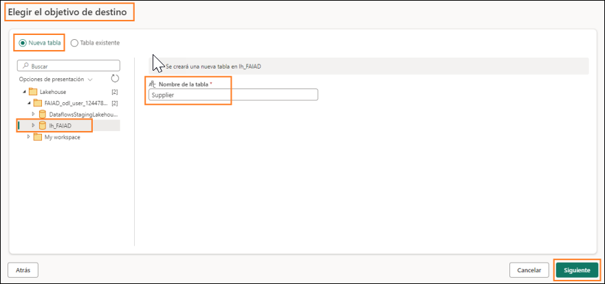

10.	Se abre el cuadro de diálogo de Elegir la configuración de destino. Usaremos la configuración automática, ya que esto realizará una actualización completa de los datos. Además, cambiará el nombre de las columnas según sea necesario. Seleccione **Guardar configuración**.
 
    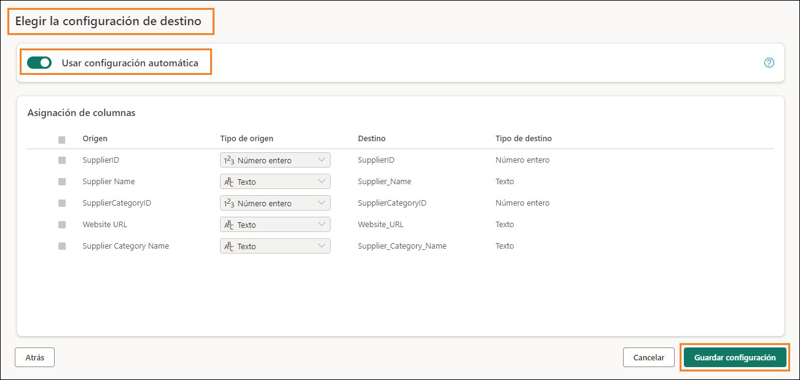

11.	Volverá a la **ventana de Power Query**. Observe que en la **esquina inferior derecha**, el destino de los datos está configurado en el lakehouse. De manera similar, **configure el destino de datos para la consulta de PO**. Una vez hecho esto, su consulta de PO debe tener **Destino de datos** establecido en **Almacén de lago de datos** como se muestra en la siguiente captura de pantalla.
 
    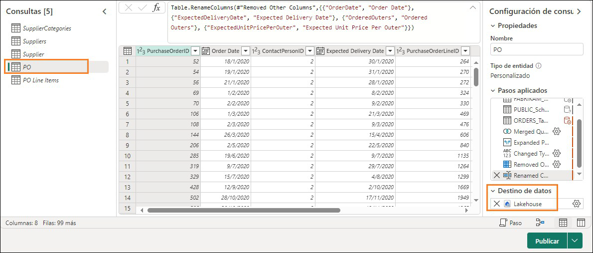

## Tarea 8: Cambiar el nombre y publicar el flujo de datos de Snowflake

1. En la parte superior de la pantalla, seleccione la **flecha junto a Dataflow 1** para cambiar el nombre.

2. En el cuadro de diálogo, cambie el nombre a **df_Supplier_Snowflake**.

3. Haga clic en **Introducir** para guardar el cambio de nombre.

    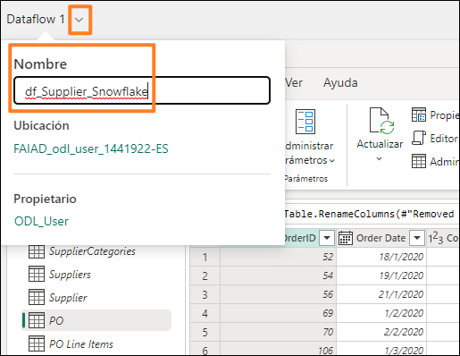

4. En la esquina inferior derecha, seleccione **Publicar**.

    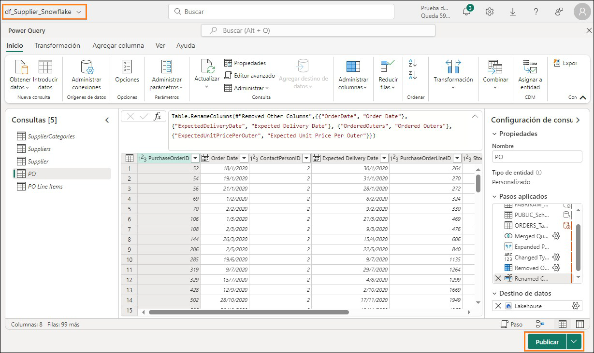

Se le dirigirá de vuelta al **área de trabajo FAIAD_<username>**. Es posible que el flujo de datos tarde unos minutos en publicarse. 

5. Seleccione **lh_FAIAD** para ir al almacén de lago de datos.

6.	Asegúrese de estar en la vista del almacén de lago de datos (no en el punto de conexión de análisis SQL).

7.	Observe que la tabla **PO** y **Supplier** ahora está disponible en el almacén de lago de datos.

**Nota:** Si no ve las tablas recién creadas, seleccione los puntos suspensivos junto a Tables y seleccionar Actualizar para actualizar las tablas.

Ahora creemos un acceso directo para traer datos de Dataverse.

# Acceso directo a ADLS Gen2

## Tarea 9: Cómo crear un acceso directo a Dataverse

Debe estar en el almacén de lago de datos lh_FAIAD. Asegúrese de estar en la vista del almacén de lago de datos (no en el punto de conexión de análisis SQL).
 
   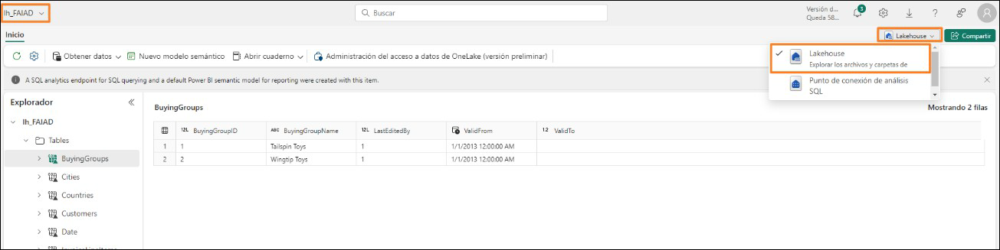

1. En el panel del **explorador** de la izquierda, seleccione los **puntos suspensivos** al lado de **Tables**.

2. Seleccione **Nuevo acceso directo**.

    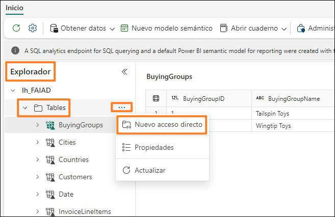

3. Se abre el cuadro de diálogo Nuevo acceso directo. En **Orígenes externos**, seleccione **Dataverse**.

   **Nota:** En la práctica de laboratorio anterior, seguimos pasos similares para crear un acceso directo a Azure Data Lake Storage Gen2. 

    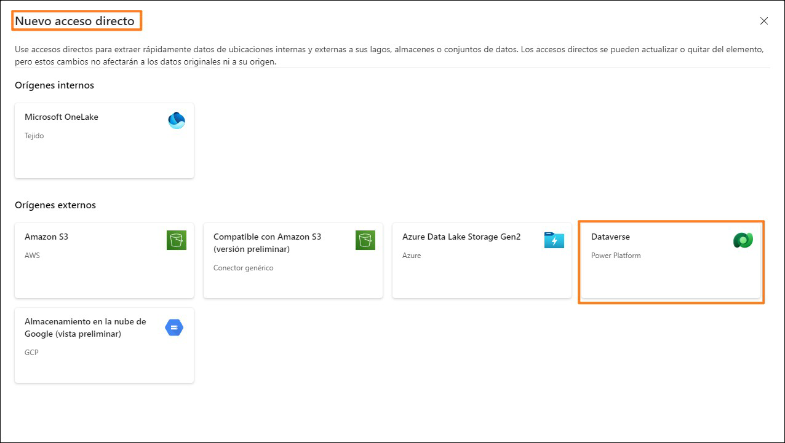

4. Se abre el cuadro de diálogo Configuración de conexión. Introduzca **org6c18814a.crm.dynamics.com** como **dominio del entorno**.

5. Deje **Tipo de autenticación** como **Cuenta de organización**.

6. Seleccione **Iniciar sesión**.

    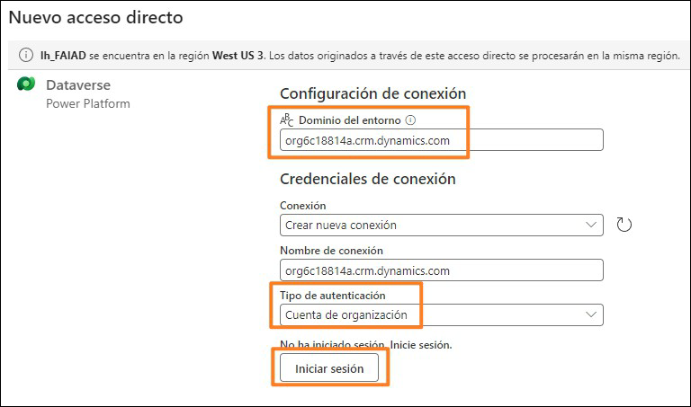

7. Se abre el cuadro de diálogo Iniciar sesión en su cuenta. **Elija su cuenta** para iniciar sesión.

   **Nota:** Su cuenta será diferente de la captura de pantalla siguiente.

    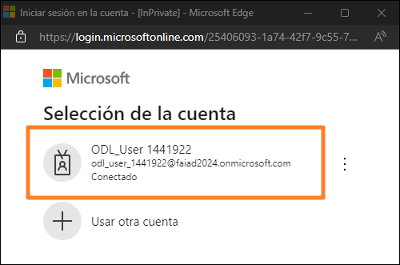

8. Seleccione **Siguiente** en el cuadro de diálogo Configuración de conexión.

   Se le dirigirá a un cuadro de diálogo de donde puede elegir el cubo/directorio diferente de Dataverse. Observe que hay una gran cantidad de cubos disponibles. Podríamos elegir los cubos que necesitamos y seguir el proceso del laboratorio 3 (usar la consulta visual para transformar datos y crear vistas). También podríamos usar el flujo de datos Gen2 como lo usamos anteriormente en este laboratorio para conectar SharePoint. Sin embargo, queremos informarle de otra opción que está disponible.

   En nuestro escenario, el equipo de TI ya ha establecido un vínculo a Dataverse y aplicado las transformaciones de datos necesarias, reflejándolas en el archivo de Power BI Desktop. Han ingerido estos datos al almacén de lago de datos en el área de trabajo de administración y nos han dado acceso a las tablas. Puesto que nuestro equipo informático ha hecho todo el trabajo duro, podemos crear un acceso directo a este almacén de lago de datos en el área de trabajo de administrador.

9. Seleccione **Cancelar** en el cuadro de diálogo Nuevo acceso directo para volver al almacén de lago de datos.

    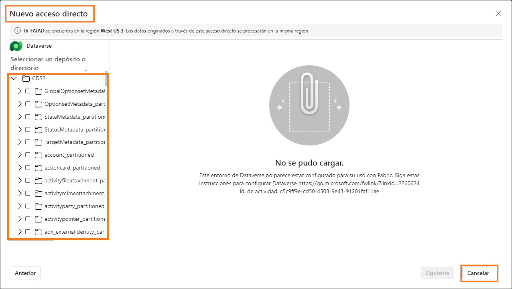

## Tarea 10: Crear un acceso directo al almacén de lago de datos

1. En el panel del **explorador** de la izquierda, seleccione los **puntos suspensivos** al lado de **Tables**.

2. Seleccione **Nuevo acceso directo**.

    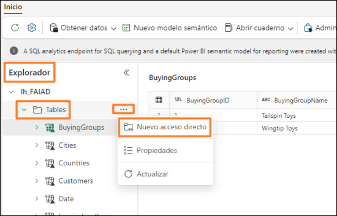

3. Se abre el cuadro de diálogo Nuevo acceso directo. Seleccione la opción **Microsoft OneLake** en orígenes internos.

    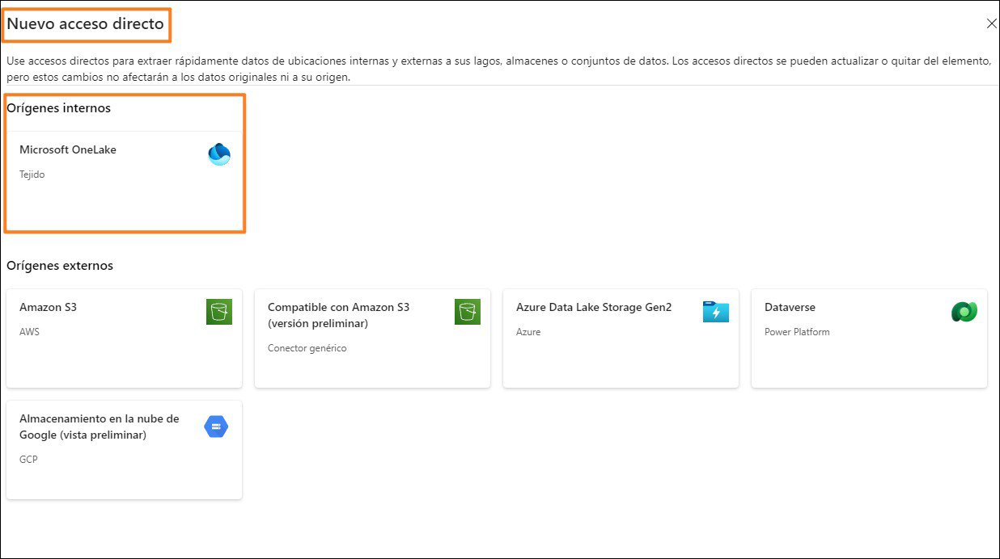

 
4. Se abrirá el cuadro de diálogo Seleccionar un tipo de origen de datos. Observe que tiene dos orígenes de datos.

    a. lh_FAIAD: este es el almacén de lago de datos que ha creado.

    b. lh_dataverse: este es el almacén de lago de datos que ha creado el administrador.

5. Seleccione **lh_dataverse**.

6. Seleccione **Siguiente**.

    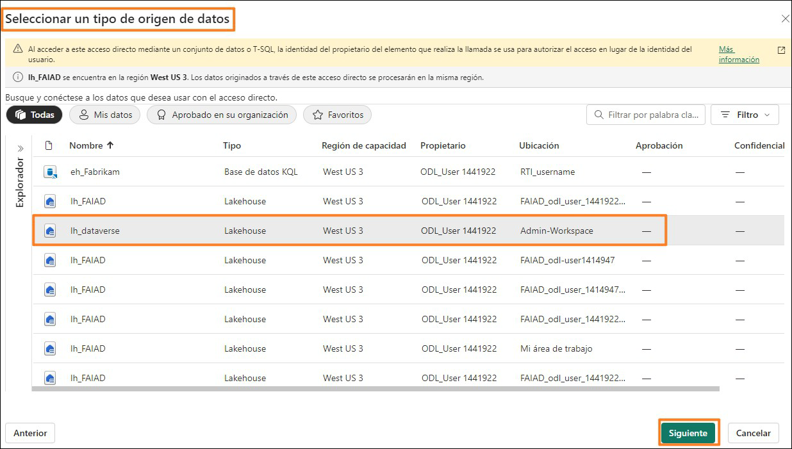

7. En el panel izquierdo, expanda **lh_dataverse -> Tables**. Observe que el administrador de TI ha proporcionado acceso a la tabla Cliente.

8.	Seleccione **Cliente**.

9.	Seleccione **Siguiente**.

    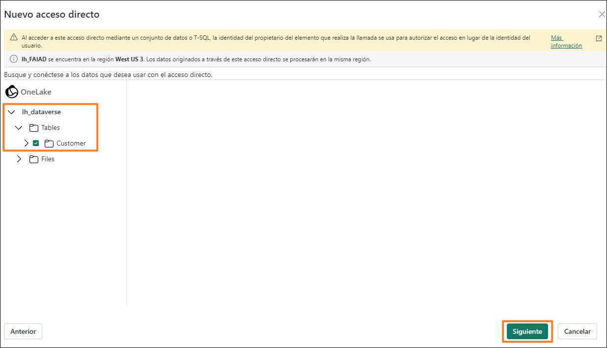

 
10.	Seleccione Crear en el siguiente cuadro de diálogo. Se le dirigirá de vuelta al almacén de lago de datos lh_FAIAD.

    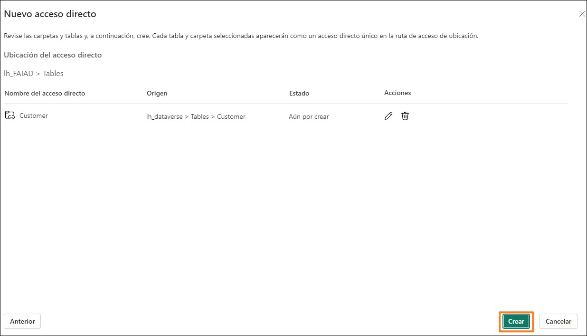

11.	En el panel Explorador de la izquierda, observe que se ha creado la nueva tabla Cliente.

12.	Seleccione la tabla Cliente para ver los datos en el panel de versión preliminar.

Hemos creado correctamente un acceso directo a otro almacén de lago de datos.

En la próxima práctica de laboratorio, configuraremos actualizaciones de programaciones.

# Referencias

Fabric Analyst in a Day (FAIAD) le presenta algunas funciones clave disponibles en Microsoft Fabric. En el menú del servicio, la sección Ayuda (?) tiene vínculos a algunos recursos excelentes.
 

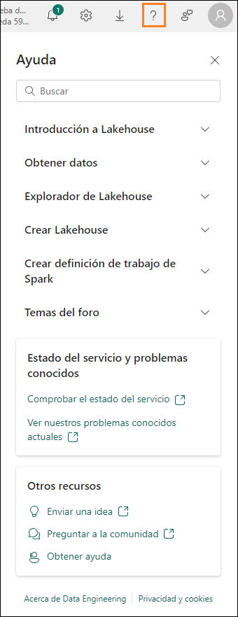

Estos son algunos recursos más que podrán ayudarle a seguir avanzando con Microsoft Fabric.

- Vea la publicación del blog para leer el [anuncio de disponibilidad general de Microsoft Fabric](https://aka.ms/Fabric-Hero-Blog-Ignite23) completo.
- Explore Fabric a través de la [Visita guiada](https://aka.ms/Fabric-GuidedTour)
- Regístrese en la [prueba gratuita de Microsoft Fabric](https://aka.ms/try-fabric)
- Visite el [sitio web de Microsoft Fabric](https://aka.ms/microsoft-fabric)
- Adquiera nuevas capacidades mediante la exploración de los [módulos de aprendizaje de Fabric](https://aka.ms/learn-fabric)
- Explore la [documentación técnica de Fabric](https://aka.ms/fabric-docs)
- Lea el [libro electrónico gratuito sobre cómo empezar a usar Fabric](https://aka.ms/fabric-get-started-ebook)
- Únase a la [comunidad de Fabric](https://aka.ms/fabric-community) para publicar sus preguntas, compartir sus comentarios y aprender de otros.

Obtenga más información en los blogs de anuncios de la experiencia Fabric:

- [Experiencia de Data Factory en el blog de Fabric](https://aka.ms/Fabric-Data-Factory-Blog) 
- [Experiencia de Synapse Data Engineering en el blog de Fabric](https://aka.ms/Fabric-DE-Blog) 
- [Experiencia de Synapse Data Science en el blog de Fabric](https://aka.ms/Fabric-DS-Blog) 
- [Experiencia de Synapse Data Warehousing en el blog de Fabric](https://aka.ms/Fabric-DW-Blog) 
- [Experiencia de Synapse Real-Time Analytics en el blog de Fabric](https://aka.ms/Fabric-RTA-Blog)
- [Blog de anuncios de Power BI](https://aka.ms/Fabric-PBI-Blog)
- [Experiencia de Data Activator en el blog de Fabric](https://aka.ms/Fabric-DA-Blog) 
- [Administración y gobernanza en el blog de Fabric](https://aka.ms/Fabric-Admin-Gov-Blog)
- [OneLake en el blog de Fabric](https://aka.ms/Fabric-OneLake-Blog)
- [Blog de integración de Dataverse y Microsoft Fabric](https://aka.ms/Dataverse-Fabric-Blog)

© 2023 Microsoft Corporation. Todos los derechos reservados.

Al participar en esta demostración o laboratorio práctico, acepta las siguientes condiciones:

Microsoft Corporation pone a su disposición la tecnología o funcionalidad descrita en esta demostración/laboratorio práctico con el fin de obtener comentarios por su parte y de facilitarle una experiencia de aprendizaje. Esta demostración/laboratorio práctico solo se puede usar para evaluar las características de tal tecnología o funcionalidad y para proporcionar comentarios a Microsoft. No se puede usar para ningún otro propósito. Ninguna parte de esta demostración/laboratorio práctico se puede modificar, copiar, distribuir, transmitir, mostrar, realizar, reproducir, publicar, licenciar, transferir ni vender, ni tampoco crear trabajos derivados de ella.

LA COPIA O REPRODUCCIÓN DE ESTA DEMOSTRACIÓN/LABORATORIO PRÁCTICO (O PARTE DE ELLA) EN CUALQUIER OTRO SERVIDOR O UBICACIÓN PARA SU REPRODUCCIÓN O DISTRIBUCIÓN POSTERIOR QUEDA EXPRESAMENTE PROHIBIDA.

ESTA DEMOSTRACIÓN/LABORATORIO PRÁCTICO PROPORCIONA CIERTAS FUNCIONES Y CARACTERÍSTICAS DE PRODUCTOS O TECNOLOGÍAS DE SOFTWARE (INCLUIDOS POSIBLES NUEVOS CONCEPTOS Y CARACTERÍSTICAS) EN UN ENTORNO SIMULADO SIN INSTALACIÓN O CONFIGURACIÓN COMPLEJA PARA EL PROPÓSITO ARRIBA DESCRITO. LA TECNOLOGÍA/CONCEPTOS DESCRITOS EN ESTA DEMOSTRACIÓN/LABORATORIO PRÁCTICO NO REPRESENTAN LA FUNCIONALIDAD COMPLETA DE LAS CARACTERÍSTICAS Y, EN ESTE SENTIDO, ES POSIBLE QUE NO FUNCIONEN DEL MODO EN QUE LO HARÁN EN UNA VERSIÓN FINAL. ASIMISMO, PUEDE QUE NO SE PUBLIQUE UNA VERSIÓN FINAL DE TALES CARACTERÍSTICAS O CONCEPTOS. DE IGUAL MODO, SU EXPERIENCIA CON EL USO DE ESTAS CARACTERÍSTICAS Y FUNCIONALIDADES EN UN ENTORNO FÍSICO PUEDE SER DIFERENTE.

**COMENTARIOS.** Si envía comentarios a Microsoft sobre las características, funcionalidades o conceptos de tecnología descritos en esta demostración/laboratorio práctico, acepta otorgar a Microsoft, sin cargo alguno, el derecho a usar, compartir y comercializar sus comentarios de cualquier modo y para cualquier fin. También concederá a terceros, sin cargo alguno, los derechos de patente necesarios para que sus productos, tecnologías y servicios usen o interactúen con cualquier parte específica de un software o servicio de Microsoft que incluya los comentarios. No enviará comentarios que estén sujetos a una licencia que obligue a Microsoft a conceder su software o documentación bajo licencia a terceras partes porque incluyamos sus comentarios en ellos. Estos derechos seguirán vigentes después del vencimiento de este acuerdo.

MICROSOFT CORPORATION RENUNCIA POR LA PRESENTE A TODAS LAS GARANTÍAS Y CONDICIONES RELATIVAS A LA DEMOSTRACIÓN/LABORATORIO PRÁCTICO, INCLUIDA CUALQUIER GARANTÍA Y CONDICIÓN DE COMERCIABILIDAD (YA SEA EXPRESA, IMPLÍCITA O ESTATUTARIA), DE IDONEIDAD PARA UN FIN DETERMINADO, DE TITULARIDAD Y DE AUSENCIA DE INFRACCIÓN. MICROSOFT NO DECLARA NI GARANTIZA LA EXACTITUD DE LOS RESULTADOS, EL RESULTADO DERIVADO DE LA REALIZACIÓN DE LA DEMOSTRACIÓN/LABORATORIO PRÁCTICO NI LA IDONEIDAD DE LA INFORMACIÓN CONTENIDA EN ELLA CON NINGÚN PROPÓSITO.

**DECLINACIÓN DE RESPONSABILIDADES**

Esta demostración/laboratorio práctico contiene solo una parte de las nuevas características y mejoras realizadas en Microsoft Power BI. Puede que algunas de las características cambien en versiones futuras del producto. En esta demostración/laboratorio práctico, conocerá algunas de estas nuevas características, pero no todas.
