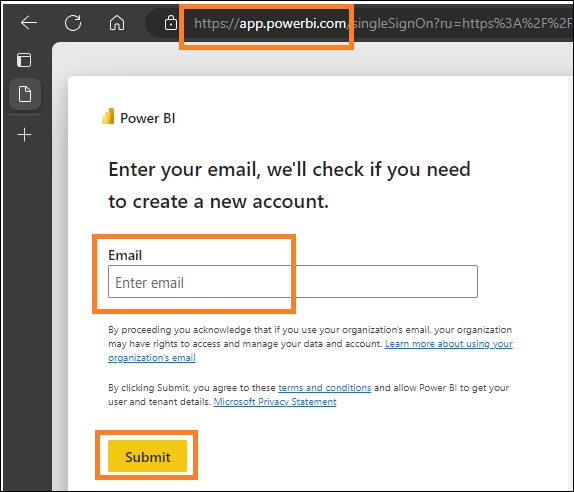

# Microsoft Fabric - Fabric Analyst in a Day - Lab 2

# Contents

- Introduction

- Fabric License

    - Task 1: Enable a Microsoft Fabric trial license

- Overview of Fabric Experiences:

    - Task 2: Data Factory Experience
  
    - Task 3: Data Activator Experience
     
    - Task 4: Industry Solutions Experience

    - Task 5: Real-Time Intelligence Experience

    - Task 6: Synapse Data Engineering Experience
  
    - Task 7: Synapse Data Science Experience
  
    - Task 8: Synapse Data Warehouse Experience

- Fabric Workspace

    - Task 9: Create a Fabric Workspace
  
    - Task 10: Create a Lakehouse

- References
 
# Introduction
Today you will learn about various key features of Microsoft Fabric. This is an introductory workshop intended to introduce you to the various product experiences and items available in Fabric. By the end of this workshop, you will learn how to use Lakehouse, Dataflow Gen2, Data Pipeline, DirectLake and more.

By the end of this lab, you will have learned:
- How to create a Fabric workspace
- How to create a Lakehouse

# Fabric License
## Task 1: Enable a Microsoft Fabric trial license
1. Open the **browser** and navigate to https://app.powerbi.com/. You will be navigated to the login page. 

    **Note:** If you are not using the lab environment and have an existing Power BI account, you may want to use the browser in private / incognito mode.

2. Enter the **Username** available in the **Environment Variables** tab (next to the Lab Guide) as the **Email**
and click **Submit**.

    

3. You will be navigated to the **Password** screen. Enter the **Password** available in the **Environment Variables** tab (next to the Lab Guide) shared with you by the instructor.
4. Click **Sign in** and follow the prompts to sign into Fabric.
 
    
 
5. You will be navigated to the familiar **Power BI Service Home page**.

6. We assume you are familiar with the layout of Power BI Service. If you have any questions, please do not hesitate to ask the instructor.

    Currently, you are in **My Workspace**. To work with Fabric items, you will need a trial license and a workspace that has Fabric license assigned. Let’s set this up.

7. On the top right corner of the screen, select the **user icon**.
8. Select **Free trial**.

    

9. Activate your 60-day free Fabric trail capacity. Select **Activate**.

    
 
10. Successfully upgraded to Microsoft Fabric dialog opens. Select **Fabric Home Page**.

    

11. You will be navigated to the **Microsoft Fabric Home page**.

    

# Overview of Fabric Experiences
## Task 2: Data Factory Experience
1. Select the **Microsoft Fabric** (fabric experience selector) icon on the bottom left of your screen. A dialog with the list of Fabric experiences will open. Notice that Power BI, Data Factory, Data Activator, Industry Solutions and Real-Time Intelligence are independent experiences. Data
Engineering, Data Science and Data Warehouse are Synapse experiences as these experiences are powered by Synapse. Let’s explore.
2. Select **Data Factory**.
 
    
 
3. You are navigated to the **Data Factory Home page**. The page contains three main sections.

    a. **Create a Workspace** : This section explains how to create a workspace using a predesigned template called a task flow, which helps keep your items organized in Microsoft Fabric.
   
    b. **Recommended:** This lists the items available in Data Factory – Dataflow Gen2, Data pipeline, Data workflow and API for GraphQL.
        
    i. Dataflow Gen2 is the next generation of Dataflow.
    
    ii. Data pipeline is used for data orchestration.
        
    iii. Apache Airflow job workflow is the workflow orchestration manager.
        
    iv. API for GraphQL is API to query multiple data sources.

    c. **Learn:** This section provides access to quick start learning documentation.
    
    d. **Quick Access:** This section lists the recently used or favorite items.

      
 
## Task 3: Data Activator Experience
1. Select **Fabric experience selector icon** (currently set to Data Factory) on the bottom left of your screen. Fabric experience dialog opens.

    

2. Select **Data Activator** from the dialog. You will be navigated to **Data Activator Home page**. Data Activator is a no-code experience in Microsoft Fabric for automatically taking actions when patterns or conditions are detected in changing data. Notice the four sections are like the Data Factory experience. In the Recommended section, notice the items:

    a. **Reflex:** Used to monitor datasets, queries, and event streams for patterns.

      

## Task 4: Industry Solutions Experience
1. Select **Fabric experience selector icon** (currently set to Data Activator) on the bottom left of your screen. Fabric experience dialog opens.

2. Select **Industry Solutions** from the dialog. You will navigate to **Industry Solutions Home page**. Microsoft Fabric offers industry-specific data solutions that provide a robust platform for data management, analytics, and decision-making. These data solutions address the unique challenges faced by different industries, enabling businesses to optimize operations, integrate data from different sources, and use rich analytics. Notice the four sections are like the previous experiences. In the Recommended section, notice the items:

    a. **Sustainability solutions:** supports the ingestion, standardization, and analysis of Environmental, Social, and Governance (ESG) data.

    b. **Retail solutions:** helps in managing large volumes of data, integrating data from various sources, and providing real-time analytics for prompt decision-making. Retailers can use these solutions for inventory optimization, customer segmentation, sales forecasting, dynamic pricing, and fraud detection.

    c. **Healthcare solutions:** are strategically designed to accelerate the time to value for customers by addressing the critical need to efficiently transform healthcare data into a suitable format for analysis.

    
 
## Task 5: Real-Time Intelligence Experience
1. Select **Fabric experience selector icon** (currently set to Industry Solutions) on the bottom left of your screen. Fabric experience dialog opens.
2. Select **Real-Time Intelligence**. You will navigate to **Real-Time Intelligence Home page**. Again, there are four sections. In the Recommended section, notice the items:

    a. **Eventhouse:** Used to create a workspace of database, which can be shared across projects.
    
    b. **KQL Queryset:** Used to run queries on the data to produce shareable tables and visuals.
    
    c. **Real-Time Dashboard:** Used to visualize real-time dashboards within seconds from data ingestion.
    
    d. **Eventstream:** Used to capture, transform, and route real-time event stream.
    
    e. **Reflex:** Used to monitor datasets, queries, and event streams for patterns.
    

    **Note:** Reflex is available in Data Activator experiences as well.

    
 
## Task 6: Synapse Data Engineering Experience
1. Select **Fabric experience selector icon** (currently set to Real-Time Intelligence) on the bottom left of your screen. Fabric experience dialog opens.

2. Select **Data Engineering**. You will be navigated to the **Data Engineering Home page**. Again, the page contains four main sections. In the Recommended section, notice the items:

    a. **Lakehouse:** Used to store big data for cleaning, querying, reporting, and sharing.

    b. **Notebook:** Used for data ingestion, preparation, analysis and other data-related tasks using various languages like Python, R and Scala.

    c. **Environment:** Used to set up shared libraries, spark compute settings and resources for notebooks and spark job definitions.

    d. **Spark Job Definition:** Used to define, schedule, and manage Apache jobs.

    e. **Data pipeline:** Used to orchestrate data solution.

    f. **API for GraphQL:** Is API to query multiple data sources.

    g. **Import notebook:** Used to import notebooks from local machine.

    
 
## Task 7: Synapse Data Science Experience
1. Select **Fabric experience selector icon** (currently set to Data Engineering) on the bottom left of your screen. Fabric experience dialog opens.
2. Select **Data Science**. You will be navigated to the **Data Science Home page**. Again, there are four sections. In the Recommended section, notice the items:

    a. **ML model:** Used to create machine learning models.
    
    b. **Experiment:** Used to create, run, and track development of multiple models.
    
    c. **Notebook:** Used to explore data and build machine learning solutions.
    
    d. **Environment:** Used to set up shared libraries, spark compute settings and resources for notebooks and spark job definitions.
    
    e. **AI Skill:** Used to build your own generative AI experience.
    
    f. **Import Notebook:** Used to import notebooks from local machine.

    **Note:** Items like Notebook, Environment, Data pipeline, etc. are available in multiple experiences as they are relevant in each of these experiences.

    
 
## Task 8: Synapse Data Warehouse Experience
1. Select **Fabric experience selector icon** (currently set to Data Science) on the bottom left of your screen. Fabric experience dialog opens.
2. Select **Data Warehouse**. You will be navigated to **Data Warehouse Home page**. Again, there are four sections. In the New section, notice the items:

    a. **Warehouse:** Used to create a Data Warehouse.

    b. **Sample Warehouse:** Used to explore and test data warehousing capabilities with pre-configured datasets and models.

    c. **Data pipeline:** Used to orchestrate data solution.
   
    d. **Notebook:** Used for creating and sharing interactive data analysis and visualization tasks

    e. **Mirrored SQL Database:** Used to mirror Azure SQL Database.

    f. **Mirrored Azure Databricks Catalog:** Used to mirror data from Azure Databricks for enhanced integration and analytics 

    g. **Mirrored Snowflake:** Used to mirror Snowflake Database.

    h. **Mirrored Azure Cosmos DB:** Used to mirror Azure Cosmos DB.

    
 
# Fabric Workspace

## Task 9: Create a Fabric Workspace
1. Now let’s create a workspace with Fabric license. Select **Workspaces** from the left navigation bar. A dialog opens.
2. Select **New workspace**.

    
 
3. **Create a workspace** dialog opens on the right side of the browser.
4. In the **Name** field enter **FAIAD_<username\>**

    **Note:** Workspace name must be unique. However, your workspace name must be different. Make sure a green check mark with **“This name is available”** is displayed below the Name field.

5. If you choose, you can enter a **Description** for the workspace. This is an optional field.
6. Click on **Advanced** to expand the section.

    
 
7. Under **License mode**, make sure **Trial** is selected. (It should be selected by default.)
8. Select **Apply** to create a new workspace.

    

A new workspace is created, and you will be navigated into this workspace. We will bring data from the different data sources into Lakehouse and use the data from the Lakehouse to build our model and report on it. The first step is to create a Lakehouse.

## Task 10: Create a Lakehouse
1. Select **Fabric experience selector icon** (currently set to Data Warehouse) on the bottom left of your screen. Fabric experience dialog opens.
2. Select **Data Engineering** to be navigated to Data Engineering Home page.

    

3. Select **Lakehouse**.

    
 
4. New lakehouse dialog opens. Type **lh_FAIAD** in the Name textbox.

    **Note:** lh here refers to Lakehouse. We are prefixing lh so that it is easy to identify and search.

5. Select **Create**.

    

Within a few moments, a Lakehouse is created, and you will be navigated to the Lakehouse interface. On the **left panel**, notice that below your workspace, you will have the Lakehouse icon. You can easily navigate to the Lakehouse by clicking on this icon at any time.

Within the Lakehouse explorer you will notice **Tables** and **Files**. Lakehouse could expose Azure Data Lake Storage Gen2 files under the files section, or a dataflow could load data to Lakehouse tables. There are various options available. We are going to show you some of the options in the following labs.

In this lab, we explored the Fabric interface, created a Fabric workspace, and a Lakehouse. In the next lab, we will learn how to use Shortcuts in Lakehouse to connect to ADLS Gen2 data and how to transform this data using views.

# References
Fabric Analyst in a Day (FAIAD) introduces you to some of the key functions available in Microsoft Fabric. In the menu of the service, the Help (?) section has links to some great resources.

 
Here are a few more resources that will help you with your next steps with Microsoft Fabric.

- See the blog post to read the full [Microsoft Fabric GA announcement](https://aka.ms/Fabric-Hero-Blog-Ignite23)
- Explore Fabric through the [Guided Tour](https://aka.ms/Fabric-GuidedTour)
- Sign up for the [Microsoft Fabric free trial](https://aka.ms/try-fabric)
- Visit the [Microsoft Fabric website](https://aka.ms/microsoft-fabric)
- Learn new skills by exploring the [Fabric Learning modules](https://aka.ms/learn-fabric)
- Explore the [Fabric technical documentation](https://aka.ms/fabric-docs)
- Read the [free e-book on getting started with Fabric](https://aka.ms/fabric-get-started-ebook)
- Join the [Fabric community ](https://aka.ms/fabric-community) to post your questions, share your feedback, and learn from others

Read the more in-depth Fabric experience announcement blogs:

- [Data Factory experience in Fabric blog](https://aka.ms/Fabric-Data-Factory-Blog) 
- [Synapse Data Engineering experience in Fabric blog](https://aka.ms/Fabric-DE-Blog) 
- [Synapse Data Science experience in Fabric blog](https://aka.ms/Fabric-DS-Blog) 
- [Synapse Data Warehousing experience in Fabric blog](https://aka.ms/Fabric-DW-Blog) 
- [Synapse Real-Time Analytics experience in Fabric blog](https://aka.ms/Fabric-RTA-Blog)
- [Power BI announcement blog](https://aka.ms/Fabric-PBI-Blog)
- [Data Activator experience in Fabric blog](https://aka.ms/Fabric-DA-Blog) 
- [Administration and governance in Fabric blog](https://aka.ms/Fabric-Admin-Gov-Blog)
- [OneLake](https://aka.ms/Fabric-OneLake-Blog)[ in Fabric blog](https://aka.ms/Fabric-OneLake-Blog)
- [Dataverse and Microsoft Fabric integration blog](https://aka.ms/Dataverse-Fabric-Blog)

© 2023 Microsoft Corporation. All rights reserved.

By using this demo/lab, you agree to the following terms:

The technology/functionality described in this demo/lab is provided by Microsoft Corporation for the purposes of obtaining your feedback and providing you with a learning experience. You may only use the demo/lab to evaluate such technology features and functionality and provide feedback to Microsoft. You may not use it for any other purpose. You may not modify, copy, distribute, transmit, display, perform, reproduce, publish, license, create derivative works from, transfer, or sell this demo/lab or any portion thereof.

COPYING OR REPRODUCTION OF THE DEMO/LAB (OR ANY PORTION OF IT) TO ANY OTHER SERVER OR LOCATION FOR FURTHER REPRODUCTION OR REDISTRIBUTION IS EXPRESSLY PROHIBITED.

THIS DEMO/LAB PROVIDES CERTAIN SOFTWARE TECHNOLOGY/PRODUCT FEATURES AND FUNCTIONALITY, INCLUDING POTENTIAL NEW FEATURES AND CONCEPTS, IN A SIMULATED ENVIRONMENT WITHOUT COMPLEX SET-UP OR INSTALLATION FOR THE PURPOSE DESCRIBED ABOVE. THE TECHNOLOGY/CONCEPTS REPRESENTED IN THIS DEMO/LAB MAY NOT REPRESENT FULL FEATURE FUNCTIONALITY AND MAY NOT WORK THE WAY A FINAL VERSION MAY WORK. WE ALSO MAY NOT RELEASE A FINAL VERSION OF SUCH FEATURES OR CONCEPTS. YOUR EXPERIENCE WITH USING SUCH FEATURES AND FUNCTIONALITY IN A PHYSICAL ENVIRONMENT MAY ALSO BE DIFFERENT.

**FEEDBACK**. If you give feedback about the technology features, functionality and/or concepts described in this demo/lab to Microsoft, you give to Microsoft, without charge, the right to use, share and commercialize your feedback in any way and for any purpose. You also give to third parties, without charge, any patent rights needed for their products, technologies and services to use or interface with any specific parts of a Microsoft software or service that includes the feedback. You will not give feedback that is subject to a license that requires Microsoft to license its software or documentation to third parties because we include your feedback in them. These rights survive this agreement.

MICROSOFT CORPORATION HEREBY DISCLAIMS ALL WARRANTIES AND CONDITIONS WITH REGARD TO THE DEMO/LAB, INCLUDING ALL WARRANTIES AND CONDITIONS OF MERCHANTABILITY, WHETHER EXPRESS, IMPLIED OR STATUTORY, FITNESS FOR A PARTICULAR PURPOSE, TITLE AND NON-INFRINGEMENT. MICROSOFT DOES NOT MAKE ANY ASSURANCES OR REPRESENTATIONS WITH REGARD TO THE ACCURACY OF THE RESULTS, OUTPUT THAT DERIVES FROM USE OF DEMO/ LAB, OR SUITABILITY OF THE INFORMATION CONTAINED IN THE DEMO/LAB FOR ANY PURPOSE.

**DISCLAIMER**

This demo/lab contains only a portion of new features and enhancements in Microsoft Power BI. Some of the features might change in future releases of the product. In this demo/lab, you will learn about some, but not all, new features.

