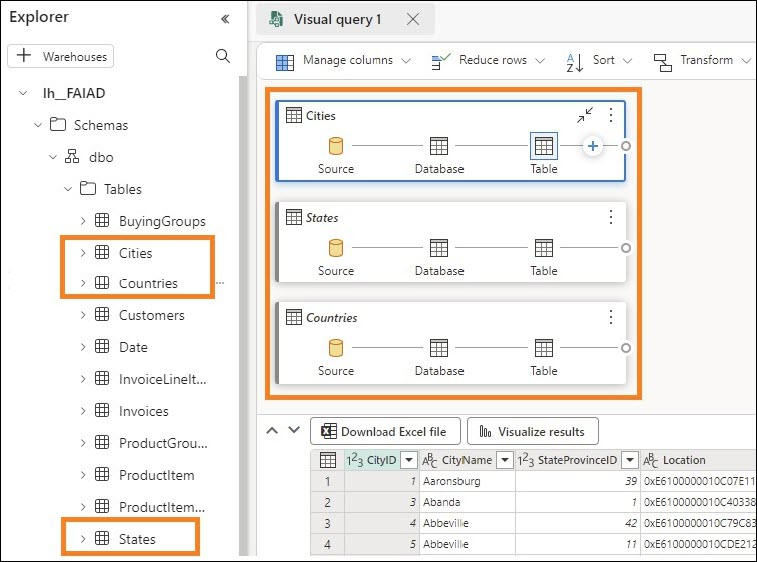
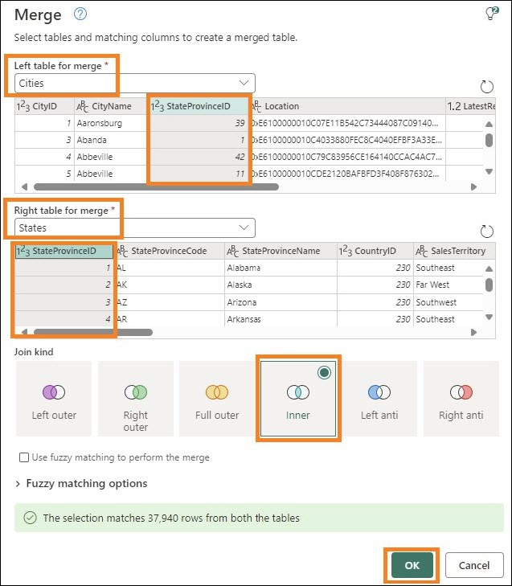
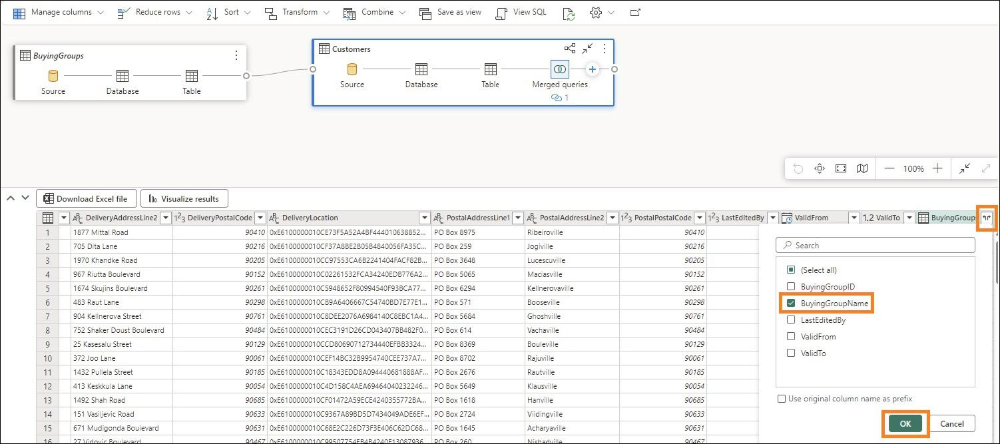
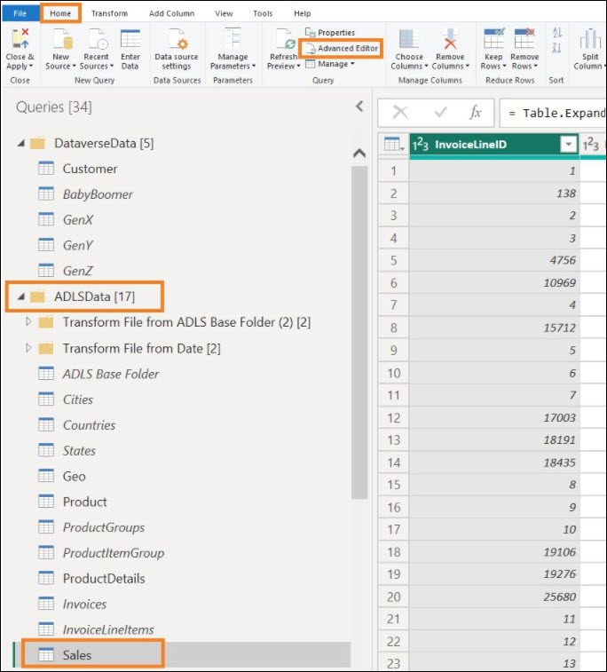

 	 


# Contents
- Introduction

- Shortcut to ADLS Gen2
    
    - Task 1: Create Shortcut

- Transform data using Visual Query
    
    - Task 2: Create Geo view using Visual Query
    
    - Task 3: Create Reseller view using Visual Query
    
    - Task 4: Create Sales view using Visual query
    
    - Task 5: Create Product view using Visual query

- References

# Introduction

In our scenario, Sales Data comes from the ERP system and is stored in an ADLS Gen2. It gets updated at noon / 12 PM every day. We need to transform and ingest this data into Lakehouse and use it in our model.

There are multiple ways to ingest this data.

- **Shortcuts:** This creates a link to the data, and we can use Visual query views to transform it. We are going to use Shortcuts in this lab.

- **Notebooks:** This requires us to write code. It is a developer friendly approach.

- **Dataflow Gen2:** You are probably familiar with Power Query or Dataflow Gen1. Dataflow Gen2, as the name indicates, is the newer version of Dataflow. It provides all the capabilities of Power Query / Dataflow Gen1 with the added ability to transform and ingest data into multiple data sources. We are going to introduce this in the next couple of labs.

- **Data Pipeline:** This is an orchestration tool. Activities can be orchestrated to extract, transform, and ingest data. We will be using Data Pipeline to execute Dataflow Gen2 activity which in turn will perform extraction, transformation, and ingestion.

We will start by creating a Shortcut to ingest data into Lakehouse from ADLS Gen2 data source. Once ingested, we are going to use Visual query views to transform it.

By the end of this lab, you will have learned:

- How to create Shortcut to Lakehouse

- How to transform data using Visual query

# Shortcut to ADLS Gen2

## Task 1: Create Shortcut
Shortcut is used to create a link to the target location. This is like creating shortcuts in Windows desktop.
1. Let’s navigate back to the **Fabric workspace** you created in the Lab 2, Task 9.
2. If you have not navigated away after the previous lab, you will be in the Lakehouse screen. If you have navigated away that is fine. Select **lh_FAIAD** to navigate to the Lakehouse.
3. In the **Explorer** panel, select the **ellipsis** next to **Tables**.
4. Select **New Shortcut**.

     
 
5. **New Shortcut** dialog opens. Under **External sources**, select **Azure Data Lake Storage Gen2**.

    

6. You need to create a connection to the ADLS Gen2 data source. Under Connection Settings -> URL enter this link `https://stvnextblobstorage.dfs.core.windows.net/fabrikam-sales`
7. Select **Account key** from the Authentication kind dropdown.
8. Copy the **Adls storage account Access Key** from the **Environment Variables** tab (next to the Lab Guide tab) and paste it in the **Account key text box**.
9. Select **Next** on the bottom right of the screen.

    
 
10. You will be connected to ADLS Gen2 with the directory structure displayed in the left panel. Expand
**Delta-Parquet-Format-FY25**.

11. **Select** the following directories:

    a. Application.Cities
    
    b. Application.Countries
    
    c. Application.StateProvinces
    
    d. DateDim
    
    e. Sales.BuyingGroups
    
    f. Sales.Customers
    
    g. Sales.Invoices
    
    h. Sales.InvoiceLines
    
    i. Warehouse.StockItems
    
    j. Warehouse.StockGroups
    
    k. Warehouse.StockItemStockGroups

    **Note:** Sales.Invoices_May is the only directory that is **not** selected.

12. Select **Next**.

    
 
13. You will be navigated to the next dialog where we can edit the names. Select the **Edit icon** under Actions for **Application.Cities**.
14. Rename **Application.Cities** to **Cities**.
15. Select the check mark next to the name to save the change.

    

16. Similarly, rename the Shortcut Names as below:
    
    a. Application.Countries to **Countries**
    
    b. Application.StateProvinces to **States**
    
    c. DateDim to **Date**
    
    d. Sales.BuyingGroups to **BuyingGroups**
    
    e. Sales.Customers to **Customers**
    
    f. Sales.InvoiceLines to **InvoiceLineItems**
    
    g. Sales.Invoices to **Invoices**
    
    h. Warehouse.StockGroups to **ProductGroups**
    
    i. Warehouse.StockItemStockGroups to **ProductItemGroup**
    
    j. Warehouse.StockItems to **ProductItem**

    **Note:** Double check the names. A typo may cause errors during the lab.

17. Select **Create** to create the Shortcut.

    

18. Notice all the Shortcuts are created as Tables. Select **BuyingGroups** table and notice we can see a preview of the data in the data panel.

    
 
 
The next step is to transform the data, so we can create a semantic model. We are going to create views to transform the data.

# Transform data using Visual Query

## Task 2: Create Geo view using Visual Query

1. We can access the lakehouse using a SQL endpoint. This provides the ability to query the data and create views. On the **top right** of the screen, select **Lakehouse -> SQL analytics endpoint**.

    

    You will be navigated to SQL analytics endpoint. Notice the Explorer panel has changed. You now can create views, stored procedures, queries and more. We are going to create a visual query as it provides a Power Query like interface and save this as a view.

    We will start by creating Geo view. We need to merge data from Cities, States and Countries query to create Geo.

2. From the top menu, select **New visual query**.

    
 
3. We need to drag tables to the Visual query panel to build a query. Let’s drag, Cities, States and Countries query into the visual query panel.

    
 
    We need to merge these queries. And visual query comes with the option to use Power Query editor. Let’s use this, since we are familiar with this.

4. From the menu in Visual query editor, select the **Focus mode** icon (towards the right). You will be navigated to Power Query editor.

    

5. With Cities query selected, from the Power Query editor ribbon, select **Home - > Merge queries -> Merge queries as new**. Merge queries dialog opens.

    

6. In the **left table to merge**, select **Cities**.
7. In the **right table to merge**, select **States**.
8. Select **StateProvinceID** columns from both the tables. We are going to join using this column.
9. Select Inner as the **Join kind**.
10. Select **OK**.

    
 
    Notice a new query called Merge has been created. We need a few columns from States.

11. In the **Data view** (bottom panel), click on the **double arrow** next to the **States** column (last column to the right).
12. A panel opens. **Select** following columns:

    a. StateProvinceCode
    
    b. StateProvinceName
    
    c. CountryID
    
    d. SalesTerritory

13. Select **OK**.
 
    

    We need to merge Countries query now.

14. With Merge query selected, select **Home -> Merge queries -> Merge queries** from the ribbon.

    

15. Merge query dialog opens. In the **right table to merge**, select **Countries**.
16. Select **CountryID** columns from both the tables. We are going to join using this column.
17. Select **Inner** as the **Join kind**.
18. Select **OK**.

    
 
    We need a few columns from Countries.

19. In the **Data view** (bottom panel), click on the **double arrow** next to the **Countries** column.
20. A panel opens. Select following columns:

    a. CountryName
    
    b. FormalName
    
    c. IsoAlpha3Code
    
    d. IsoNumericCode
    
    e. CountryType
    
    f. Continent
    
    g. Region
    
    h. Subregion

21. Select **OK**.

    
 
    We do not need all the columns. Let’s select only those we need.

22. With Merge query selected, from the ribbon select **Home -> Choose columns -> Choose columns**.

    

23. Choose columns dialog opens. **Uncheck** the following columns.

    a. StateProvinceID
    
    b. Location
    
    c. LastEditedBy
    
    d. ValidFrom
    
    e. ValidTo
    
    f. CountryID

24. Select **OK**.

    
 
    Notice the process is like Power Query, we have all the steps recorded both in the Applied Steps panel on the right and the visual view. Let’s rename Merge query and Enable load, so that the data is loaded from this query.

25. **Right click on Merge** query in the Queries (left) panel. Select **Rename** and rename the query to **Geo**.
26. **Right click on Geo** query in the Queries (left) panel. Select **Enable Load** to enable this query.
27. Make sure that Cities, States and Countries queries are **disabled**.
28. Select **Save**.

    

    We will be navigated to Visual query editor. Let’s now save this query as a view.
    
    **Note:** All the steps we performed using Power Query editor can be performed using Visual query editor as well.

29. From the Visual query editor menu select **Save as view**.

    

    Save as view dialog opens. Notice the SQL query is available. You can review it, if you choose it.

30. Enter **Geo** as **View name**.
31. Select **OK** to save the view.

    

    You will get an alert once the view is saved.

32. In the Explorer (left) panel, expand **Views**. We have the newly created Geo view.
 
    
 
## Task 3: Create Reseller view using Visual Query
Let’s create Reseller view which is created by merging Customers table with BuyingGroups table. This time around we will create the view using Visual query.

1. From the Lakehouse menu bar, select **Home -> New visual query**. A new visual query opens.
2. From Explorer section, drag Customers and BuyingGroups tables to the visual query section.

    
 
3. **Select Customers** query. When selected, Customers will have a blue border and there is a “+” sign
after Table (this indicates we are adding a step after Table. If you do not see the “+” sign after table, you may have selected a different step. Select Table and you will be good to go).
4. From the Visual query menu, select **Combine -> Merge queries**.

    

    Merge dialog opens with Customers selected as the top table.

5. In the **right table to merge**, select **BuyingGroups**.
6. Select **BuyingGroupID** columns from both the tables. We are going to join using this column.
7. Select **Inner** as the **Join kind**.
8. Select **OK**.

    

9. In the **Data view** (bottom panel), click on the **double arrow** next to the **BuyingGroups** column (last column to the right) to select the columns we need from BuyingGroups.
 
10. A panel opens. Select **BuyingGroupName** column.
11. Select **OK**.

    

    We do not need all the columns. Let’s select only those we need.

12. From the Visual query menu, select **Manage columns -> Choose columns**.

    

13. Choose columns dialog opens. **Select** the following columns.

    a. ResellerID
    
    b. ResellerName
    
    c. PostalCityID
    
    d. PhoneNumber
    
    e. FaxNumber
    
    f. WebsiteURL
    
    g. DeliveryAddressLine1
    
    h. DeliveryAddressLine2
    
    i. DeliveryPostalCode
    
    j. PostalAddressLine1
    
    k. PostalAddressLine2
    
    l. PostalPostalCode
    
    m. BuyingGroupName

14. Select **OK**.

    
 
15. Let’s rename BuyingGroupName column. In the **Data view, double click on BuyingGroupName** column header to make it editable.
16. **Rename** the column to **ResellerCompany**.

    

    Notice the Customer table has all the steps documented. Now let’s save this view.

17. We need to save the Customer query as it has all the steps. We need to Enable load. Select the **ellipsis** in the **Customer** query box.
18. Make sure **Enable load** is checked.

    
 
    **Note: Customer box** should have a blue border if enable load is checked.

19. From the Visual query menu, select **Save as view**.

    

    Save as view dialog opens. Notice the SQL query is available. You can review it, if you choose it.

20. Enter **Reseller** as **View name**.
21. Select **OK** to save the view.
 
    
 
    You will get an alert once the view is saved.

22. In the Explorer (left) panel, expand **Views**. We have the newly created Reseller view.

    

## Task 4: Create Sales view using Visual query
Let’s create Sales view, which is created by merging InvoiceLineItems and Invoices table and Reseller
view. We have this query in Power BI Desktop. We will copy the code from Advanced Editor. But before copying the code, we need to create a merge table using Visual query as creating a blank query is not possible in Visual query. Let’s give this method a try.

1. From the Lakehouse menu bar, select **Home -> New visual query**. A new visual query opens.
2. From **Explorer -> Table** section, drag **InvoiceLineItems, Invoices** tables to the visual query section
3. From **Explorer -> Views** section, drag **Reseller** view to the visual query section
4. From the Visual query editor, select the **Focus mode icon** to open Power Query editor.

    

5. With InvoiceLineItems query selected, from the ribbon select **Home - > Merge queries - > Merge queries as new**.

    
 
    Merge dialog opens.

6. In the **left table to merge**, select **InvoiceLineItems**.
7. In the **right table to merge**, select **Invoices**.
8. Select **InvoiceID** columns from both the tables. We are going to join using this column.
9. Select **Inner** as the **Join kind**.
10. Select **OK**.

    

    We are going to copy code from Power BI Desktop and paste it using Advanced Editor.

11. If you have not already opened it, open **FAIAD.pbix** located in the **Reports** folder on the desktop of your lab environment.
12. From the ribbon select **Home -> Transform data**. Power Query window opens. As you have noticed in the earlier lab, queries in the left panel are organized by data source.

    
 
13. From the left panel, under the ADLSData folder, select **Sales** query.
14. From the ribbon select **Home - > Advanced Editor**. Advanced Editor dialog opens.

    

15. **Select code from Line 3** (#"Expanded Invoice" …) all the way through to the last line of code.
16. **Right click** and select **Copy**.
17. Select **Cancel** to close Advanced Editor.

    
 
18. **Navigate back to the browser** where you have the Power Query Editor open.
19. Make sure you have **Merge** query selected.
20. From the ribbon select **Home -> Advanced Editor**. Advanced Editor dialog opens.

    

21. At the **end of line 2 add a comma** (Source = Table.NestedJoin(InvoiceLineItems, {"InvoiceID"}, Invoices, {"InvoiceID"}, "Invoices", JoinKind.Inner)
22. Click **Enter** to start a new line.
23. Enter **Ctrl+V** on your keyboard to paste the code you copied from Power BI Desktop.

    **Note:** If you are working in the lab environment, please select the ellipsis on the top right of the screen. Use the slider to **enable VM Native Clipboard**. Select OK in the dialog. Once done pasting the queries you can disable this option.

    
 
24. Highlight the last two lines of code ( in Source) and **delete** it.
25. Select **OK** to save the changes.

    

    If it is easier, delete all the code in the Advanced Editor and paste the below code into Advanced Editor.

    ```
    let
    Source = Table.NestedJoin(InvoiceLineItems, {"InvoiceID"}, Invoices, {"InvoiceID"}, "Invoices", JoinKind.Inner),
    #"Expanded Invoice" = Table.ExpandTableColumn(Source, "Invoices", {"CustomerID",
    "BillToCustomerID", "SalespersonPersonID", "InvoiceDate"}, {"CustomerID", "BillToCustomerID", "SalespersonPersonID", "InvoiceDate"}),
    #"Removed Other Columns" = Table.SelectColumns(#"Expanded Invoice",{"InvoiceLineID", "InvoiceID", "StockItemID", "Quantity", "UnitPrice", "TaxRate", "TaxAmount", "LineProfit", "ExtendedPrice", "CustomerID", "SalespersonPersonID", "InvoiceDate"}),
    #"Renamed Columns" = Table.RenameColumns(#"Removed Other Columns",{{"CustomerID", "ResellerID"}}),
    
    #"Merged Queries" = Table.NestedJoin(#"Renamed Columns", {"ResellerID"}, Reseller,
    {"ResellerID"}, "Customer", JoinKind.Inner),
    #"Added Custom" = Table.AddColumn(#"Merged Queries", "Sales Amount", each [ExtendedPrice] - [TaxAmount]),
    #"Changed Type" = Table.TransformColumnTypes(#"Added Custom",{{"Sales Amount", type number}}),
    #"Removed Columns" = Table.RemoveColumns(#"Changed Type",{"Customer"}) in
    #"Removed Columns"
    ```

26. You will be navigated back to Power Query Editor. In the left, Queries panel, **double click on Merge** query to rename it.
27. **Rename** Merge query to **Sales**.
28. Right click on Sales query and select **Enable load** to enable the query to be loaded.

    

29. Select **Save** to Save and Close the Power Query dialog. You will be navigated to Visual query.
30. From the Visual query menu, select **Save as view**. Save as view dialog opens. Notice the SQL query is available. You can review it, if you choose it.
31. Enter **Sales** as **View name**.
32. Select **OK** to save the view.

    
 
    You will get an alert once the view is saved.

33. In the Explorer (left) panel, expand **Views**. We have the newly created Sales view.

    
 
## Task 5: Create Product view using Visual query
Let’s create Product view, which is created by merging ProductItem, ProductItemGroup and ProductGroups tables. To move things along, we are going to copy code into Advanced Editor.
1. From the Lakehouse menu bar, select **Home -> New visual query**. A new visual query opens.
2. From Explorer section, drag **ProductItem**, **ProductItemGroup** and **ProductGroups** tables to the visual query section
3. From the Visual query editor, select the **Focus mode icon** to open Power Query editor.

    

4. With **ProductItem** query selected, from the ribbon select **Home -> Merge queries -> Merge queries as new**. Merge dialog opens.

    

5. In the **left table to merge**, select **ProductItem**.
6. In the **right table to merge**, select **ProductItemGroup**.
7. Select **StockItemID** columns from both the tables. We are going to join using this column.
8. Select **Left outer** as the **Join kind**.
9. Select **OK**. New Merge query is created.

    
 
10. With Merge query selected, from the ribbon, select **Home -> Advanced editor**. Advanced editor dialog opens.

    

11. **Select all the code** in Advanced editor and **delete** it.
12. **Paste** the below code into Advanced editor. 

    ```
    let
    Source = Table.NestedJoin(ProductItem, {"StockItemID"}, ProductItemGroup, {"StockItemID"}, "ProductItemGroup", JoinKind.LeftOuter),
    #"Expanded ProductItemGroup" = Table.ExpandTableColumn(Source, "ProductItemGroup",
    {"StockGroupID"}, {"StockGroupID"}),
    #"Merged queries" = Table.NestedJoin(#"Expanded ProductItemGroup", {"StockGroupID"}, ProductGroups, {"StockGroupID"}, "ProductGroups", JoinKind.LeftOuter),
    #"Expanded ProductGroups" = Table.ExpandTableColumn(#"Merged queries", "ProductGroups", {"StockGroupName"}, {"StockGroupName"}),
    
    #"Choose columns" = Table.SelectColumns(#"Expanded ProductGroups", {"StockItemID", "StockItemName", "SupplierID", "Size", "IsChillerStock", "TaxRate", "UnitPrice",
    "RecommendedRetailPrice", "TypicalWeightPerUnit", "StockGroupName"})
    in
    #"Choose columns"
    ```

13. Select **OK** to close Advanced Editor. You will be navigated back to Power Query editor.

    

14. In the left, Queries panel, **double click on Merge** query to rename it.
15. **Rename** Merge query to **Product**.
16. Right click on Product query and select **Enable load** to enable the query to be loaded.
17. Select **Save** to Save and Close the Power Query dialog. You will be navigated to Visual query.

    
 
18. From the Visual query menu, select **Save as view**. Save as view dialog opens. Notice the SQL query is available. You can review it, if you choose it.
19. Enter **Product** as **View name**.
20. Select **OK** to save the view.

    

    You will get an alert once the view is saved.

21. In the Explorer (left) panel, expand **Views**. We have the newly created Product view.

    
 
We have transformed the data from ADLS Gen2 data source. In this lab, we learned how to create shortcuts and explored various options for using visual query views to transform data.

In the next lab, we will learn how to use Dataflow Gen2 and create Shortcut to another Lakehouse.

# References
Fabric Analyst in a Day (FAIAD) introduces you to some of the key functions available in Microsoft Fabric. In the menu of the service, the Help (?) section has links to some great resources.


 
Here are a few more resources that will help you with your next steps with Microsoft Fabric.

- See the blog post to read the full [Microsoft Fabric GA announcement](https://aka.ms/Fabric-Hero-Blog-Ignite23)
- Explore Fabric through the [Guided Tour](https://aka.ms/Fabric-GuidedTour)
- Sign up for the [Microsoft Fabric free trial](https://aka.ms/try-fabric)
- Visit the [Microsoft Fabric website](https://aka.ms/microsoft-fabric)
- Learn new skills by exploring the [Fabric Learning modules](https://aka.ms/learn-fabric)
- Explore the [Fabric technical documentation](https://aka.ms/fabric-docs)
- Read the [free e-book on getting started with Fabric](https://aka.ms/fabric-get-started-ebook)
- Join the [Fabric community ](https://aka.ms/fabric-community) to post your questions, share your feedback, and learn from others

Read the more in-depth Fabric experience announcement blogs:

- [Data Factory experience in Fabric blog](https://aka.ms/Fabric-Data-Factory-Blog) 
- [Synapse Data Engineering experience in Fabric blog](https://aka.ms/Fabric-DE-Blog) 
- [Synapse Data Science experience in Fabric blog](https://aka.ms/Fabric-DS-Blog) 
- [Synapse Data Warehousing experience in Fabric blog](https://aka.ms/Fabric-DW-Blog) 
- [Synapse Real-Time Analytics experience in Fabric blog](https://aka.ms/Fabric-RTA-Blog)
- [Power BI announcement blog](https://aka.ms/Fabric-PBI-Blog)
- [Data Activator experience in Fabric blog](https://aka.ms/Fabric-DA-Blog) 
- [Administration and governance in Fabric blog](https://aka.ms/Fabric-Admin-Gov-Blog)
- [OneLake](https://aka.ms/Fabric-OneLake-Blog)[ in Fabric blog](https://aka.ms/Fabric-OneLake-Blog)
- [Dataverse and Microsoft Fabric integration blog](https://aka.ms/Dataverse-Fabric-Blog)

© 2023 Microsoft Corporation. All rights reserved.

By using this demo/lab, you agree to the following terms:

The technology/functionality described in this demo/lab is provided by Microsoft Corporation for the purposes of obtaining your feedback and providing you with a learning experience. You may only use the demo/lab to evaluate such technology features and functionality and provide feedback to Microsoft. You may not use it for any other purpose. You may not modify, copy, distribute, transmit, display, perform, reproduce, publish, license, create derivative works from, transfer, or sell this demo/lab or any portion thereof.

COPYING OR REPRODUCTION OF THE DEMO/LAB (OR ANY PORTION OF IT) TO ANY OTHER SERVER OR LOCATION FOR FURTHER REPRODUCTION OR REDISTRIBUTION IS EXPRESSLY PROHIBITED.

THIS DEMO/LAB PROVIDES CERTAIN SOFTWARE TECHNOLOGY/PRODUCT FEATURES AND FUNCTIONALITY, INCLUDING POTENTIAL NEW FEATURES AND CONCEPTS, IN A SIMULATED ENVIRONMENT WITHOUT COMPLEX SET-UP OR INSTALLATION FOR THE PURPOSE DESCRIBED ABOVE. THE TECHNOLOGY/CONCEPTS REPRESENTED IN THIS DEMO/LAB MAY NOT REPRESENT FULL FEATURE FUNCTIONALITY AND MAY NOT WORK THE WAY A FINAL VERSION MAY WORK. WE ALSO MAY NOT RELEASE A FINAL VERSION OF SUCH FEATURES OR CONCEPTS. YOUR EXPERIENCE WITH USING SUCH FEATURES AND FUNCTIONALITY IN A PHYSICAL ENVIRONMENT MAY ALSO BE DIFFERENT.

**FEEDBACK**. If you give feedback about the technology features, functionality and/or concepts described in this demo/lab to Microsoft, you give to Microsoft, without charge, the right to use, share and commercialize your feedback in any way and for any purpose. You also give to third parties, without charge, any patent rights needed for their products, technologies and services to use or interface with any specific parts of a Microsoft software or service that includes the feedback. You will not give feedback that is subject to a license that requires Microsoft to license its software or documentation to third parties because we include your feedback in them. These rights survive this agreement.

MICROSOFT CORPORATION HEREBY DISCLAIMS ALL WARRANTIES AND CONDITIONS WITH REGARD TO THE DEMO/LAB, INCLUDING ALL WARRANTIES AND CONDITIONS OF MERCHANTABILITY, WHETHER EXPRESS, IMPLIED OR STATUTORY, FITNESS FOR A PARTICULAR PURPOSE, TITLE AND NON-INFRINGEMENT. MICROSOFT DOES NOT MAKE ANY ASSURANCES OR REPRESENTATIONS WITH REGARD TO THE ACCURACY OF THE RESULTS, OUTPUT THAT DERIVES FROM USE OF DEMO/ LAB, OR SUITABILITY OF THE INFORMATION CONTAINED IN THE DEMO/LAB FOR ANY PURPOSE.

**DISCLAIMER**

This demo/lab contains only a portion of new features and enhancements in Microsoft Power BI. Some of the features might change in future releases of the product. In this demo/lab, you will learn about some, but not all, new features.
