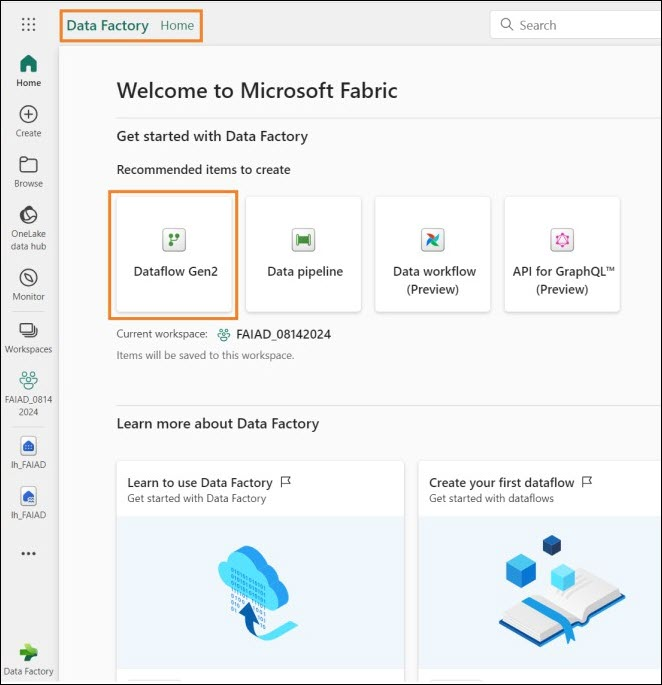
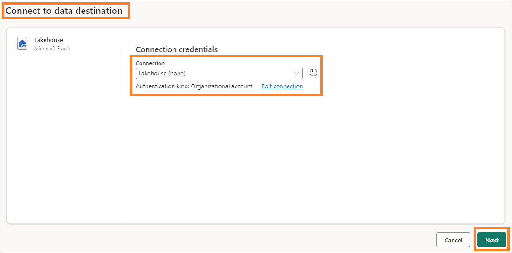
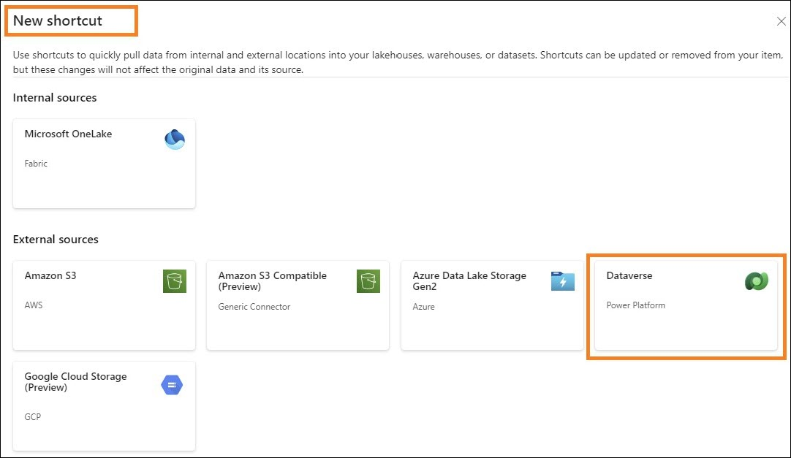

# Microsoft Fabric - Fabric Analyst in a Day - Lab 4

 
 
# Contents
- Introduction

- Dataflow Gen2
    
    - Task 1: Copy SharePoint queries to Dataflow
    
    - Task 2: Create a SharePoint connection
    
    - Task 3: Configure Data destination for People query
    
    - Task 4: Publish and Rename SharePoint Dataflow
    
    - Task 5: Copy Snowflake queries to Dataflow
    
    - Task 6: Create a connection to Snowflake
    
    - Task 7: Configure Data Destination for Supplier and PO queries
    
    - Task 8: Rename and Publish Snowflake Dataflow

- Shortcut to ADLS Gen2
    
    - Task 9: How to create a Shortcut to Dataverse
    
    - Task 10: Create a Shortcut to Lakehouse

- References

# Introduction
In our scenario, Supplier Data is in Snowflake, Customer Data is in Dataverse, and Employee Data is in SharePoint. All these data sources are updated at different times. To minimize the number of data
refreshes of Dataflows, we are going to create individual Dataflows for Snowflake and SharePoint data sources.

**Note:** Multiple data sources are supported in a single Dataflow.

IT team has already established a link to Dataverse and applied the necessary data transformations, mirroring those in the Power BI Desktop file. They have ingested this data to Lakehouse in the Admin workspace and have given us access to the table(s). We are going to create a Shortcut for the Lakehouse IT team.

By the end of this lab, you will have learned:

- How to connect to SharePoint using Dataflow Gen2 and ingest data into Lakehouse

- How to connect to Snowflake using Dataflow Gen2 and ingest data into Lakehouse

- How to ingest data from a Shared Lakehouse

# Dataflow Gen2
## Task 1: Copy SharePoint queries to Dataflow
1. Let’s navigate back to the Fabric workspace, **FAIAD_<username\>** you created in Lab 2, Task 9.
2. Select the **Fabric experience selector icon** on the bottom left of your screen. Fabric experience dialog opens
3. Select **Data Factory** from the dialog. You will navigate to the **Data Factory Home page**.

    
 
4. Under Recommended items, select **Dataflow Gen2**.

    

    You will be navigated to the **Dataflow page**. The Dataflow Gen2 interface is like Power Query in Power BI Desktop. We can copy queries from Power BI Desktop into Dataflow Gen2. Let’s give this a try.

5. If you have not already opened it, open the **FAIAD.pbix** located in the **Reports** folder on the desktop of your lab environment.
6. From the ribbon select **Home -> Transform data**. The power Query window opens. As you have noticed in the earlier lab, queries in the left panel are organized by the data source.
7. From the left panel, under the SharepointData folder select **People** query.
8. **Right click** and select **Copy**.

    

9. Navigate back to the **Dataflow screen** in the browser.
10. In the **Dataflow pane**, enter **Ctrl+V** (currently right click Paste is not supported). If you are using a MAC device, please use Cmd+V to paste.

    **Note:** If you are working in the lab environment, please select the ellipsis on the top right of the screen. Use the slider to **FILE_TRANSFER**. Select OK in the dialog. Once done pasting the queries you can disable this option.

    

    Notice the query is pasted and is available in the left panel. Since we do not have a connection created to SharePoint, you will see a warning message requesting you to configure the connection.

## Task 2: Create a SharePoint connection
1. Select **Configure connection**.

    
 
2. Connect to data source dialog opens. In the **Connection** dropdown make sure **Create new connection** is selected.
3. **Authentication kind** should be **Organizational Account**.
4. Select **Connect**.

    **Note**: You will be signed in using your credentials. They will be different from the screenshot below.

    

## Task 3: Configure Data destination for People query
Connection is established and you can view the data in the preview panel. Feel free to navigate through the Applied Steps of the queries. Now we need to ingest People data into Lakehouse.

1. Select **People** query.
 
2. From the ribbon select **Home -> Query -> Add data destination -> Lakehouse**.

    .png)

3. Connect to data destination dialog opens. We need to create a new Connection to the Lakehouse. With **Create new connection** selected in the **Connection dropdown** and **Authentication kind** set to **Organizational account**, select **Next**.

    

4. Choose destination target dialog opens. Make sure the **New table radio button** is selected, since we are creating a new table.
5. We want to create the table in the Lakehouse we created earlier. In the left panel, navigate to **Lakehouse -> FAIAD_<username\>**.
6. Select **lh_FAIAD**
7. Leave the table name as **People**
8. Select **Next**.

    
 
9. Choose destination settings dialog opens. Make sure **“Use automatic settings”** is **enabled**.

    **Note**: You can disable automatic settings and notice you have options to set Update method and Schema options. Once done exploring, make sure **“Use automatic settings”** is **enabled**.

10. Select **Save settings**.

    

## Task 4: Publish and Rename SharePoint Dataflow
1. You will be navigated back to the **Power Query window**. Notice on the bottom **right corner**, Data destination is set to **Lakehouse**.
2. On the bottom right corner, select **Publish**.

    

    **Note:** You will be navigated back to **FAIAD_<username\> workspace**. It may take a few moments for the Dataflow to Publish.

3. Dataflow 1 is the dataflow we were working on. Let’s rename it before we continue. Click on the **ellipsis (…)** next to Dataflow 1. Select **Properties**.

    
 
4. Dataflow properties dialog opens. Change the **name** to **df_People_SharePoint**
5. In the **Description** text box add **Dataflow to ingest People data from SharePoint to Lakehouse**.
6. Select **Save**.

    

    You will be navigated back to **FAIAD_<username\> workspace**.

7. Select **lh_FAIAD** to navigate to the lakehouse.
8. Make sure you are in Lakehouse view (not SQL analytics endpoint).
9. Notice **People** table is now available in the Lakehouse.

    **Note**: If you do not see the newly created tables, select the ellipsis next to Tables and select Refresh to refresh the Tables.

    We have now ingested all the data into Lakehouse. In the next lab, we will schedule a Dataflow refresh.

## Task 5: Copy Snowflake queries to Dataflow
1. Let’s navigate back to the Fabric workspace, **FAIAD_<username\>**
2. From the top menu, select **+ New item -> Dataflow Gen2**.

    
 
    You will be navigated to the **Dataflow page**. Now that we are familiar with Dataflow, let’s go ahead and copy the queries from Power BI Desktop into Dataflow.

3. If you have not already opened it, open the **FAIAD.pbix** located in the **Reports** folder on the desktop of your lab environment.
4. From the ribbon select **Home -> Transform data**. The power Query window opens. As you have noticed in the earlier lab, queries in the left panel are organized by the data source.
5. From the left panel, under the SnowflakeData folder **Ctrl+Select** or Shift+Select the following queries:

    a. SupplierCategories
    
    b. Suppliers
    
    c. Supplier
    
    d. PO
    
    e. PO Line Items

6. **Right click** and select **Copy**.

    
 
7. Navigate back to the **browser**.
8. In the **Dataflow pane** select the **center pane**, enter **Ctrl+V** (currently right click Paste is not supported). If you are using a MAC device, please use Cmd+V to paste.

    **Note**: If you are working in the lab environment, please select the ellipsis on the top right of the screen. Use the slider to **FILE_TRANSFER**. Select OK in the dialog. Once done pasting the queries you can disable this option.

    
 
## Task 6: Create a connection to Snowflake
Notice the five queries are pasted and now you have the Queries panel on the left. Since we do not have a connection created for Snowflake, you will see a warning message requesting you to configure the connection.
1. Select **Configure connection**.

    

2. Connect to data source dialog opens. In the **Connection** dropdown make sure, **Create new connection** is selected.
3. **Authentication kind** should be **Snowflake**.
4. Enter the **Snowflake Username and Password** available in the Environment Variables tab (next to the Lab Guide tab).
5. Select **Connect**.

    
 
    Connection is established and you can view the data in the preview panel. Feel free to navigate through the Applied Steps of the queries. Basically, the Suppliers query has the details of suppliers and SupplierCategories as the name implies have supplier categories. These two tables are joined to create the Supplier dimension, with the columns we need. Similarly, we have PO Line Items merged with PO to create the PO fact. Now we need to ingest the Supplier and PO data into Lakehouse.

## Task 7: Configure Data Destination for Supplier and PO queries
1. Select the **Supplier** query.
2. From the ribbon select **Home -> Query -> Add data destination -> Lakehouse**.

    .png)

3. Connect to data destination dialog opens. From the **Connection dropdown** select **Lakehouse (none)**.
4. Select **Next**.

    
 
5. Choose destination target dialog opens. Make sure the **New table radio button** is **selected**, since we are creating a new table.
6. We want to create the table in the Lakehouse we created earlier. In the left panel, navigate to **Lakehouse -> FAIAD_<username\>**.

7. Select **lh_FAIAD**
8. Leave the table name as **Supplier**
9. Select **Next**.

    

10. Choose destination settings dialog opens. We will use the automatic settings as this will do a full update of the data. Also, it will rename the columns as needed. Select **Save settings**.

    
 
11. You will be navigated back to the **Power Query window**. Notice on the bottom **right corner, Data destination** is set to **Lakehouse**. Similarly, **set up the Data Destination for PO query**. Once it is done, your PO query should have **Data Destination** set to **Lakehouse** as shown in the screenshot below.

    

## Task 8: Rename and Publish Snowflake Dataflow
1. From the top of the screen, select the **arrow next to Dataflow 1** to rename.
2. In the dialog, change the name to **df_Supplier_Snowflake**
3. Click on **Enter** to save the name change.

    
 
4. On the bottom right corner, select **Publish**.

    

    You will be navigated back to **FAIAD_<username\> workspace**. It may take a few moments for the Dataflow to Publish.

5. Select **lh_FAIAD** to navigate to the lakehouse.
6. Make sure you are in Lakehouse view (not SQL analytics endpoint).
7. Notice **PO** and **Supplier** table is now available in the Lakehouse.

    **Note:** If you do not see the newly created tables, select the ellipsis next to Tables and select Refresh to refresh the Tables.
    
    Now let’s create a shortcut to bring in data from Dataverse.

# Shortcut to ADLS Gen2

## Task 9: How to create a Shortcut to Dataverse
You should be in the Lakehouse **lh_FAIAD**. Make sure you are in Lakehouse view (not SQL analytics endpoint).

1. In **Explorer** panel, select the **ellipsis** next to **Tables**.
2. Select **New Shortcut**.

    

3. New shortcut dialog opens. Under **External sources**, select **Dataverse**.

    **Note:** In the previous lab, we followed similar steps to create a shortcut to Azure Data Lake Storage Gen2.

    
 
4. Connection settings dialog opens. Enter **org6c18814a.crm.dynamics.com** as **Environment domain**.
5. Leave **Authentication kind** as **Organizational account**.
6. Select **Sign in**.

    

7. Sign in to your account dialog opens. **Pick your account** to sign in.

    **Note:** Your account will be different than the screenshot below.

    
 
8. Select **Next** in Connection settings dialog.

    You will be navigated to a dialog where you can pick the different buckets/directories from Dataverse. Notice there are a lot of different buckets available. We could pick the bucket(s) we need and follow the process like Lab 3 (use Visual query to transform data and create views). We could also use Dataflow Gen2 like we used earlier in this lab to connect to SharePoint. However, we do not have access to these buckets/directories.

    In our scenario, the IT team has already established a link to Dataverse and applied the necessary data
    transformations, mirroring those in the Power BI Desktop file. They have ingested this data to Lakehouse in the Admin workspace and have given us access to the table(s). Since our IT team has done all the hard work, we can create a shortcut to this Lakehouse in the Admin workspace.

9. Select **Cancel** in the New shortcut dialog to be navigated back to the Lakehouse.

    
 
## Task 10: Create a Shortcut to Lakehouse
1. In **Explorer** panel, select the **ellipsis** next to **Tables**.
2. Select **New Shortcut**.

    

3. New shortcut dialog opens. Select the **Microsoft OneLake** option under Internal sources.

    
 
4. Select a data source type dialog opens. Notice you have two data sources.

    a. lh_FAIAD – this is the Lakehouse you have created.
    
    b. lh_dataverse – this is the Lakehouse admin has created.

5. Select **lh_dataverse**.
6. Select **Next**.

    

7. In the left panel, expand **lh_dataverse -> Tables**. Notice the IT admin has provided access to the Customer table.
8. Select **Customer**.
9. Select **Next**.

    
 
10. Select **Create** on the next dialog. You will be navigated back to lh_FAIAD lakehouse.

    

11. In the **Explorer** panel on the left, notice the new Customer table has been created.
12. Select the **Customer** table to view the data in the preview panel. 

We have successfully created a shortcut to another Lakehouse. 

In the next lab, we will set up schedule refreshes.
 
# References
Fabric Analyst in a Day (FAIAD) introduces you to some of the key functions available in Microsoft Fabric. In the menu of the service, the Help (?) section has links to some great resources.

 
Here are a few more resources that will help you with your next steps with Microsoft Fabric.

- See the blog post to read the full [Microsoft Fabric GA announcement](https://aka.ms/Fabric-Hero-Blog-Ignite23)
- Explore Fabric through the [Guided Tour](https://aka.ms/Fabric-GuidedTour)
- Sign up for the [Microsoft Fabric free trial](https://aka.ms/try-fabric)
- Visit the [Microsoft Fabric website](https://aka.ms/microsoft-fabric)
- Learn new skills by exploring the [Fabric Learning modules](https://aka.ms/learn-fabric)
- Explore the [Fabric technical documentation](https://aka.ms/fabric-docs)
- Read the [free e-book on getting started with Fabric](https://aka.ms/fabric-get-started-ebook)
- Join the [Fabric community ](https://aka.ms/fabric-community) to post your questions, share your feedback, and learn from others

Read the more in-depth Fabric experience announcement blogs:

- [Data Factory experience in Fabric blog](https://aka.ms/Fabric-Data-Factory-Blog) 
- [Synapse Data Engineering experience in Fabric blog](https://aka.ms/Fabric-DE-Blog) 
- [Synapse Data Science experience in Fabric blog](https://aka.ms/Fabric-DS-Blog) 
- [Synapse Data Warehousing experience in Fabric blog](https://aka.ms/Fabric-DW-Blog) 
- [Synapse Real-Time Analytics experience in Fabric blog](https://aka.ms/Fabric-RTA-Blog)
- [Power BI announcement blog](https://aka.ms/Fabric-PBI-Blog)
- [Data Activator experience in Fabric blog](https://aka.ms/Fabric-DA-Blog) 
- [Administration and governance in Fabric blog](https://aka.ms/Fabric-Admin-Gov-Blog)
- [OneLake](https://aka.ms/Fabric-OneLake-Blog)[ in Fabric blog](https://aka.ms/Fabric-OneLake-Blog)
- [Dataverse and Microsoft Fabric integration blog](https://aka.ms/Dataverse-Fabric-Blog)

© 2023 Microsoft Corporation. All rights reserved.

By using this demo/lab, you agree to the following terms:

The technology/functionality described in this demo/lab is provided by Microsoft Corporation for the purposes of obtaining your feedback and providing you with a learning experience. You may only use the demo/lab to evaluate such technology features and functionality and provide feedback to Microsoft. You may not use it for any other purpose. You may not modify, copy, distribute, transmit, display, perform, reproduce, publish, license, create derivative works from, transfer, or sell this demo/lab or any portion thereof.

COPYING OR REPRODUCTION OF THE DEMO/LAB (OR ANY PORTION OF IT) TO ANY OTHER SERVER OR LOCATION FOR FURTHER REPRODUCTION OR REDISTRIBUTION IS EXPRESSLY PROHIBITED.

THIS DEMO/LAB PROVIDES CERTAIN SOFTWARE TECHNOLOGY/PRODUCT FEATURES AND FUNCTIONALITY, INCLUDING POTENTIAL NEW FEATURES AND CONCEPTS, IN A SIMULATED ENVIRONMENT WITHOUT COMPLEX SET-UP OR INSTALLATION FOR THE PURPOSE DESCRIBED ABOVE. THE TECHNOLOGY/CONCEPTS REPRESENTED IN THIS DEMO/LAB MAY NOT REPRESENT FULL FEATURE FUNCTIONALITY AND MAY NOT WORK THE WAY A FINAL VERSION MAY WORK. WE ALSO MAY NOT RELEASE A FINAL VERSION OF SUCH FEATURES OR CONCEPTS. YOUR EXPERIENCE WITH USING SUCH FEATURES AND FUNCTIONALITY IN A PHYSICAL ENVIRONMENT MAY ALSO BE DIFFERENT.

**FEEDBACK**. If you give feedback about the technology features, functionality and/or concepts described in this demo/lab to Microsoft, you give to Microsoft, without charge, the right to use, share and commercialize your feedback in any way and for any purpose. You also give to third parties, without charge, any patent rights needed for their products, technologies and services to use or interface with any specific parts of a Microsoft software or service that includes the feedback. You will not give feedback that is subject to a license that requires Microsoft to license its software or documentation to third parties because we include your feedback in them. These rights survive this agreement.

MICROSOFT CORPORATION HEREBY DISCLAIMS ALL WARRANTIES AND CONDITIONS WITH REGARD TO THE DEMO/LAB, INCLUDING ALL WARRANTIES AND CONDITIONS OF MERCHANTABILITY, WHETHER EXPRESS, IMPLIED OR STATUTORY, FITNESS FOR A PARTICULAR PURPOSE, TITLE AND NON-INFRINGEMENT. MICROSOFT DOES NOT MAKE ANY ASSURANCES OR REPRESENTATIONS WITH REGARD TO THE ACCURACY OF THE RESULTS, OUTPUT THAT DERIVES FROM USE OF DEMO/ LAB, OR SUITABILITY OF THE INFORMATION CONTAINED IN THE DEMO/LAB FOR ANY PURPOSE.

**DISCLAIMER**

This demo/lab contains only a portion of new features and enhancements in Microsoft Power BI. Some of the features might change in future releases of the product. In this demo/lab, you will learn about some, but not all, new features.
