# Microsoft Fabric - Fabric Analyst in a Day - Lab 6

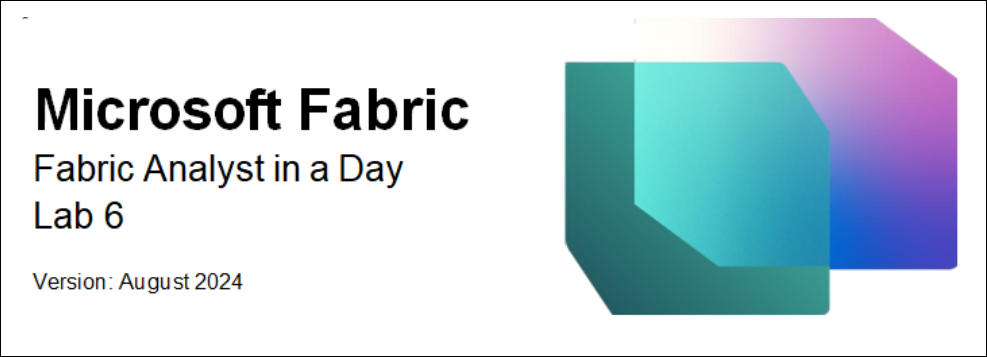

# Contents

* Introduction

* Lakehouse – Analyzing data

    * Task 1: Query data using SQL

    * Task 2: Visualize T-SQL result

* Lakehouse – Semantic Modeling

    * Task 3: Create Semantic model

    * Task 4: Create Relationships

    * Task 5: Create Measures

    * Task 6: Optional section – Create Relationships

    * Task 7: Optional section – Create Measures

* References

# Introduction

We have data from various sources ingested into the Lakehouse. In this lab, you will work with the semantic model. Typically, we performed modeling activities like creating relationships, adding measures, etc. in Power BI Desktop. Here we will learn how to perform these modeling activities in the service.

By the end of this lab, you will have learned:

- Using SQL view in SQL analytics endpoint
- Create a semantic model

# Lakehouse – Analyzing data

## Task 1: Query data using SQL

1. Let’s navigate back to the Fabric workspace, **FAIAD_<username\>** you created in Lab 2, Task 9.
  
2. If you choose to, **Minimize the task flow** to view the entire list of items.
   
3. You will see three types of lh\_FAIAD – Lakehouse, Semantic model and SQL endpoint. We explored Lakehouse and created visual queries using SQL analytics endpoint in an earlier lab. Select **lh\_FAIAD SQL analytics endpoint** option to continue to explore this option. You will be navigated to the **SQL view** of the explorer.

   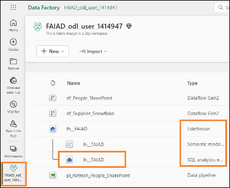

   If you would like to explore the data before creating a data model, you can use SQL to do so. There are two options to use SQL. Option one is visual query, which we used in the earlier lab. Option 2 is writing TSQL code. This is a developer friendly option. Let’s explore this.

   Let’s assume you want to quickly find out the Units sold by Supplier using SQL.

   In the Lakehouse, SQL analytics endpoint, notice on the left panel, you can view the Tables. If you expand the tables, you can view the Columns that make up the table. Also, there are options to create SQL

   Views, Functions, and Stored Procedures. If you have a SQL background, feel free to explore these options. Let’s try to write a simple SQL query.

4. From the **top menu** select **New SQL query** or from the **bottom of the left panel** select **Query**. You will be navigated to SQL query view.

   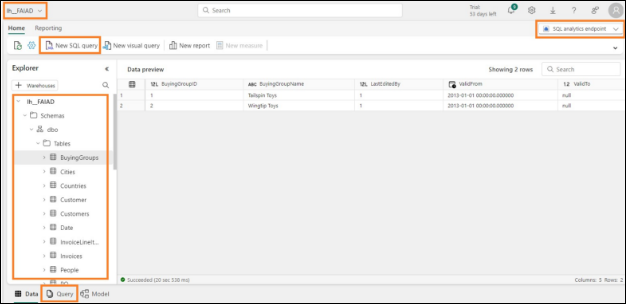

5. Paste the **below SQL query** into the **query window**. This query will return the units by Supplier Name. It is joining the Sales table with the Product and Supplier tables to achieve this.

    ```
    SELECT su.SupplierName, SUM(Quantity) as Units
    FROM dbo.Sales s
    JOIN dbo.Product p on p.StockItemID = s.StockItemID
    JOIN dbo.Supplier su on su.SupplierID = p.SupplierID
    GROUP BY su.SupplierName
    ```

6. Click **Run** in the SQL editor menu to view the results.
   
7. Notice there is an option to save this query as a View by selecting **Save as view**.
   
8. On the **left Explorer** panel, under **Queries** section notice this query is saved under **My queries** as **SQL query 1**. This provides an option to rename the query and save it for future use. There is also an option to view queries that are shared with you using the **Shared queries** folder.

   **Note**: Visual queries you had created in earlier labs are also available under My queries folder.

   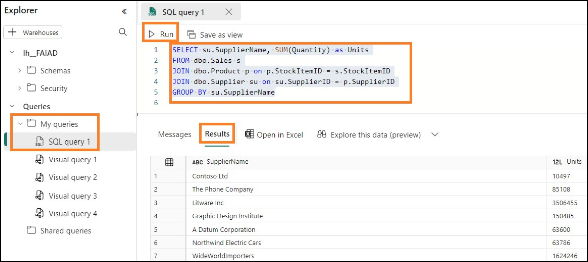

## Task 2: Visualize T-SQL result

1. We can also visualize the result of this query. **Highlight the query** in the query pane
   
2. In the Results pane menu, select **Explore this data (preview) -> Visualize results**.

   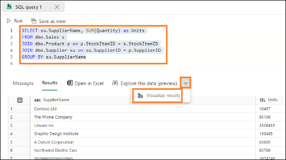

3. **Visualize results** dialog opens. Select **Continue**.

   **Visualize results** dialog opens and looks like Power BI Desktop report view. This has all the features available in Power BI Desktop report view, you can format the page, select different visuals, format visuals, add filters, etc. We will not be exploring these options on this course.

4. Expand **Data** pane and expand **SQL query 1**.
   
5. Select **Supplier\_Name** and **Units fields**. Table visual is created.

   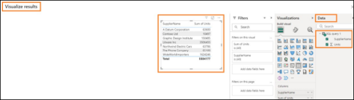

6. From the **Visualization** section, change the visual type by selecting the **Stacked column chart**.
   
7. Select **Save as report** on the bottom right of the screen.

   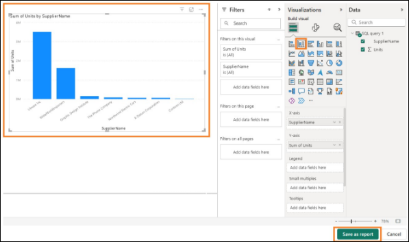

8. Save your report dialog opens. Type **Units by Supplier** in the **Enter a name for your report textbox**.
   
9. Make sure the destination workspace is your Fabric workspace, **FAIAD<username\>**.
   
10. Select **Save.**

     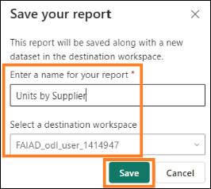

You will be navigated to back to the SQL query screen.

# Lakehouse – Semantic Modeling

## Task 3: Create Semantic model

1. From the **bottom panel** select **Model**. You will notice the center pane looks like the Model view we see in Power BI Desktop.

   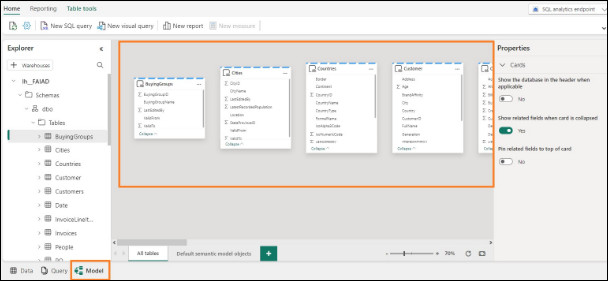

   This is the default model the Lakehouse creates. However, there are some limitations with the default model (like ability to format measures, etc). Also, we need only a subset of the tables in our model. So we will create a new semantic model.

2. From the menu **,** on the top right **select the arrow next to SQL analytics endpoint**.
   
3. Select **Lakehouse** to be navigated to the Lakehouse view.

   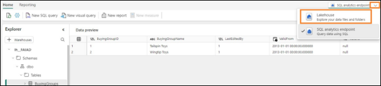

4. From the menu select **Home -> New semantic model.**
   
5. New semantic model dialog opens. Enter **sm\_FAIAD** as the Direct Lake semantic model name.
   
6. We have the option to select a subset of the tables by default. Remember, we created views in the earlier lab. We want to include these views in the model. **Click** on the **icon** in the **Search bar** and select **Show views**. Now we have the option to view and select views.

   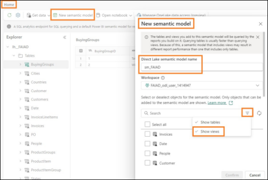

7. **Select** the following tables/views:
   
   a. **Date**
   
   b. **People**

   c. **Customer**

   d. **PO**

   e. **Supplier**

   f. **Geo**
   
   g. **Reseller**

   h. **Sales**

   i. **Product**

9. Select **Confirm.**

   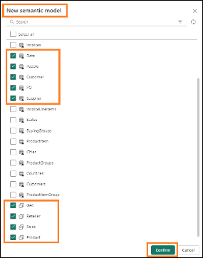

## Task 4: Create Relationships

You will navigate to the new semantic model with the selected tables. Feel free to **rearrange** the tables as needed. Notice that some of the tables (Geo, Reseller, Sales and Product) have a warning sign on the top right of the table. This is because these are views. Any visuals created with fields from these views will be in direct query mode and not direct lake mode.

**Note**: Direct lake mode is faster than direct query mode.

   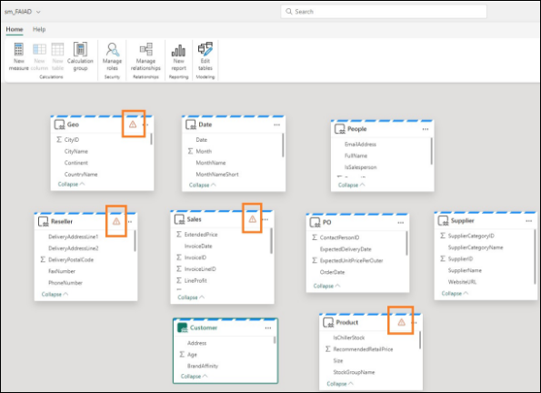

   The first step is to create relationships between these tables.

1. Let’s create a relationship between Sales and Reseller tables. Select **ResellerID** from the **Sales** table and drag it over to **ResellerID** in the **Reseller** table.

   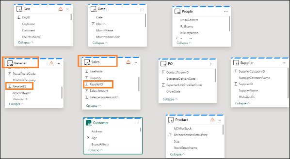

2. New relationship dialog opens. Make sure **From table** is **Sales** and **Column** is **ResellerID.**

3. Make sure **To table** is **Reseller** and **Column** is **ResellerID.**

4. Make sure **Cardinality** is **Many to one (\*:1)**.

5. Make sure **Cross filter direction** is **Single**.

6. Select **Save**.

   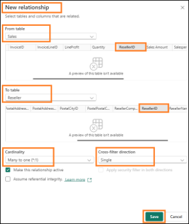

7. Similarly, create a relationship between Sales and Date tables. Select **InvoiceDate** from the **Sales** table and drag it over to **Date** in the **Date** table.

8. New relationship dialog opens. Make sure **From table** is **Sales** and **Column** is **InvoiceDate.**
   
9. Make sure **To table** is **Date** and **Column** is **Date.**
    
10. Make sure **Cardinality** is **Many to one (\*:1)**.

11. Make sure **Cross filter direction** is **Single**.

12. Select **Save**.

     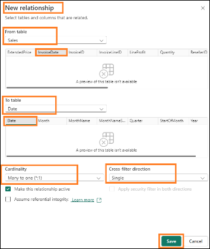

13. Similarly, create a **many-to-one** relationship between **Sales** and **Product** tables. Select **StockItemID** from the **Sales** table and **StockItemID** from the **Product** table.

    **Note:** All our updates are automatically saved.

    **Checkpoint:** Your model should have the three relationships between Sales and Reseller tables, Sales and Date and Sales and Product tables as shown in the below screenshot:

    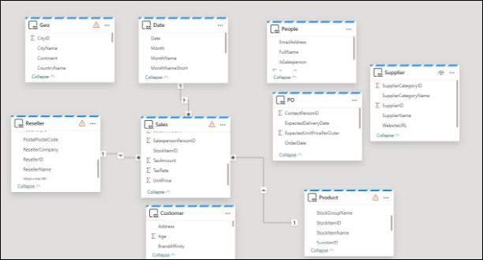

    In the interest of time, we will not be creating all the relationships. If time permits, you can complete the optional section at the end of the lab. The optional section walks through the steps to create the remaining relationships.

## Task 5: Create Measures

Let’s add a few measures we need to create the Sales dashboard.

1. Select **Sales table** from the model view. We want to add the measures to the Sales table.

2. From the top menu, select **Home -> New Measure**. Notice the formula bar is displayed.

3. Enter **Sales = SUM(Sales[Sales Amount])** in the **formula bar**.

4. Click the **check mark** left of the formula bar or click the **Enter** button.

5. Expand the Properties panel on the right.

6. Expand the **Formatting** section.

7. From the **Format** dropdown select **Currency**.

8. Set Decimal places to **0**.

   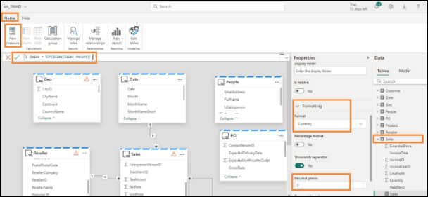

9. With the **Sales table** selected from the top menu, select **Home -> New Measure**. Notice the formula bar is displayed.

10. Enter **Units = SUM(Sales[Quantity])** in the **formula bar.**

11. Click the **check mark** left of the formula bar or click the **Enter** button.

12. In the Properties panel on the right, expand the **Formatting** section (it may take a few moments for the Properties panel to load).

13. From the **Format** dropdown select **Whole number**.

14. Use the slider to set **Thousands separator** to **Yes**.

     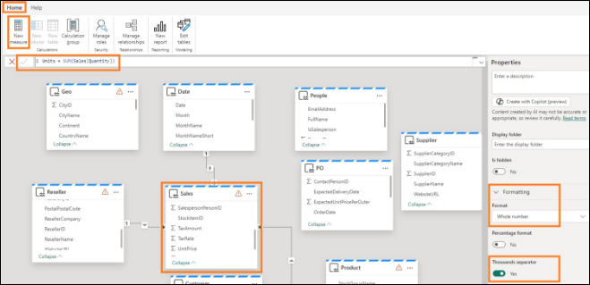

15. With the **Sales table** selected from the top menu, select **Home -> New Measure**. Notice the formula bar is displayed.

16. Enter **Sales Orders = DISTINCTCOUNT(Sales[InvoiceID])** in the **formula bar.**

17. Click the **check mark** left of the formula bar or click the **Enter** button.

18. In the Properties panel on the right, expand the **Formatting** section.

19. From the **Format** dropdown select **Whole number**.

20. Use the slider to set **Thousands separator** to **Yes**.

    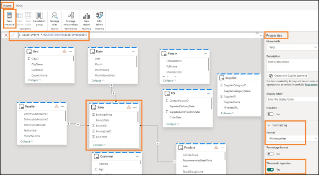

21. In the **Data panel** (on the right), select **Model**. Notice this provides a view that will help organize all the items in the semantic model.

22. Expand **Semantic model -> Measures** to view all the measures you just created.

23. You can also **expand individual Tables** to view the Columns, Hierarchies and Measures in each one of them.

    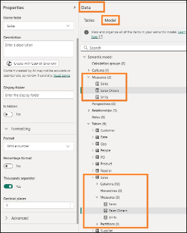

    Again, in the interest of time, we will not be creating all the measures. If time permits, you can complete the optional section at the end of the lab. The optional section walks through the steps to create the remaining measures.

    We have created a semantic model, the next step is to create a report. We will do it in the next lab.

## Task 6: Optional section – Create Relationships

Let’s add the remaining relationships.

1. From the menu, select Home -> Manage relationships.

2. Manage relationships dialog opens. Select New relationship.

   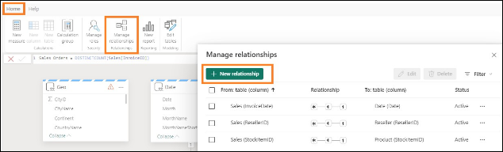

3. New relationship dialog opens. Make sure **From table** is **Sales** and **Column** is **SalespersonPersonID.**

4. Make sure **To table** is **People** and **Column** is **PersonID.**

5. Make sure **Cardinality** is **Many to one (\*:1)**.

6. Make sure **Cross filter direction** is **Single**.

7. Select **Save**. Manage relationships dialog opens with the new relationship added.

   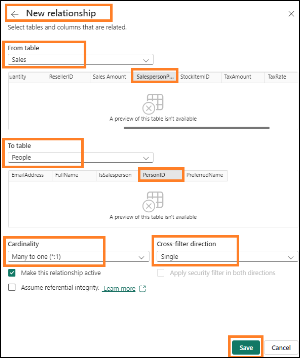

8. Now let’s create a relationship between Product and Supplier. Select **New relationship**.

9. Make sure **From table** is **Product** and **Column** is **SupplierID.**

10. Make sure **To table** is **Supplier** and **Column** is **SupplierID.**

11. Make sure **Cardinality** is **Many to one (\*:1)**.

12. Make sure **Cross filter direction** is **Both**.

13. Select **Save**.

     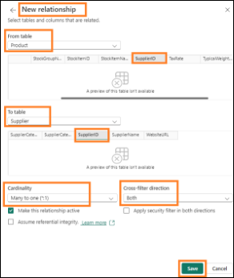

14. Now let’s create a relationship between Reseller and Geo. Select **New relationship**.

15. New relationship dialog opens. Make sure **From table** is **Reseller** and **Column** is **PostalCityID.**

16. Make sure **To table** is **Geo** and **Column** is **CityID.**

17. Make sure **Cardinality** is **Many to one (\*:1)**.

18. Make sure **Cross filter direction** is **Both**.

19. Select **Save**.

     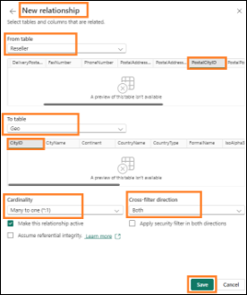

20. Similarly, create a relationship between Customer and Reseller. Select **New relationship**.

21. New relationship dialog opens. Make sure **From table** is **Customer** and **Column** is **ResellerID.**

22. Make sure **To table** is **Reseller** and **Column** is **ResellerID.**

23. Make sure **Cardinality** is **Many to one (\*:1)**.

24. Make sure **Cross filter direction** is **Single**.

25. Select **Save**.

    **Checkpoint:** Manage relationships should look like screenshot below.

    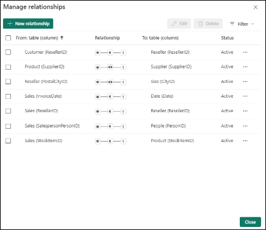

26. Similarly, create a **many to one** relationship between **PO** and **Date**. Select **Order\_Date** from **PO** and **Date** from **Date**.

27. Similarly, create a **many to one** relationship between **PO** and **Product**. Select **StockItemID** from **PO** and **StockItemID** from **Product**.

28. Similarly, create a **many to one** relationship between **PO** and **People**. Select **ContactPersonID** from **PO** and **PersonID** from **People**.

29. Select **Close** to close Manage relationships dialog. We are done creating all the relationships.

    **Checkpoint:** Your model should look like the screenshot below.

    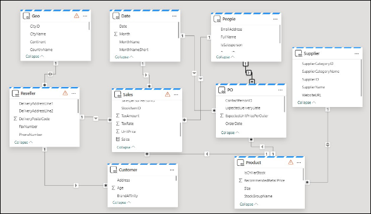

## Task 7: Optional section – Create Measures

Let’s add the remaining measures.

1. Select **Sales** table and from the top menu select **Home -> New Measure**.

2. Enter **Avg Order = DIVIDE([Sales], [Sales Orders])** in the formula bar.

3. Click the **check mark** in the formula bar or click Enter button.

4. Expand the Properties panel on the right.

5. Expand the **Formatting** section.

6. From the **Format** dropdown select **Currency**.

7. Set Decimal places to 0.

   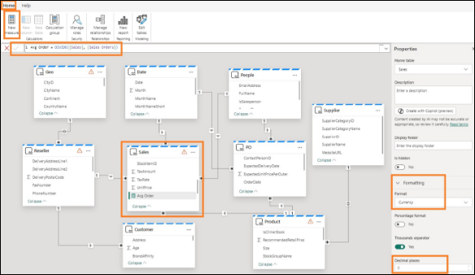

8. Follow similar steps to add the following measures:

   a. In **Sales** table, **GM = SUM(Sales[LineProfit])** formatted as **Currency with 0 decimal places.**

   b. In **Sales** table, **GM% = DIVIDE([GM], [Sales])** formatted as **Percentage with 0 decimal places.**

   c. In **Customer** table **, No of Customers = COUNTROWS(Customer)** formatted as **Whole Number with Thousands separator enabled.**

# References

Fabric Analyst in a Day (FAIAD) introduces you to some of the key functions available in Microsoft Fabric. In the menu of the service, the Help (?) section has links to some great resources.


 
Here are a few more resources that will help you with your next steps with Microsoft Fabric.

- See the blog post to read the full [Microsoft Fabric GA announcement](https://aka.ms/Fabric-Hero-Blog-Ignite23)
- Explore Fabric through the [Guided Tour](https://aka.ms/Fabric-GuidedTour)
- Sign up for the [Microsoft Fabric free trial](https://aka.ms/try-fabric)
- Visit the [Microsoft Fabric website](https://aka.ms/microsoft-fabric)
- Learn new skills by exploring the [Fabric Learning modules](https://aka.ms/learn-fabric)
- Explore the [Fabric technical documentation](https://aka.ms/fabric-docs)
- Read the [free e-book on getting started with Fabric](https://aka.ms/fabric-get-started-ebook)
- Join the [Fabric community ](https://aka.ms/fabric-community) to post your questions, share your feedback, and learn from others

Read the more in-depth Fabric experience announcement blogs:

- [Data Factory experience in Fabric blog](https://aka.ms/Fabric-Data-Factory-Blog) 
- [Synapse Data Engineering experience in Fabric blog](https://aka.ms/Fabric-DE-Blog) 
- [Synapse Data Science experience in Fabric blog](https://aka.ms/Fabric-DS-Blog) 
- [Synapse Data Warehousing experience in Fabric blog](https://aka.ms/Fabric-DW-Blog) 
- [Synapse Real-Time Analytics experience in Fabric blog](https://aka.ms/Fabric-RTA-Blog)
- [Power BI announcement blog](https://aka.ms/Fabric-PBI-Blog)
- [Data Activator experience in Fabric blog](https://aka.ms/Fabric-DA-Blog) 
- [Administration and governance in Fabric blog](https://aka.ms/Fabric-Admin-Gov-Blog)
- [OneLake](https://aka.ms/Fabric-OneLake-Blog)[ in Fabric blog](https://aka.ms/Fabric-OneLake-Blog)
- [Dataverse and Microsoft Fabric integration blog](https://aka.ms/Dataverse-Fabric-Blog)

© 2023 Microsoft Corporation. All rights reserved.

By using this demo/lab, you agree to the following terms:

The technology/functionality described in this demo/lab is provided by Microsoft Corporation for the purposes of obtaining your feedback and providing you with a learning experience. You may only use the demo/lab to evaluate such technology features and functionality and provide feedback to Microsoft. You may not use it for any other purpose. You may not modify, copy, distribute, transmit, display, perform, reproduce, publish, license, create derivative works from, transfer, or sell this demo/lab or any portion thereof.

COPYING OR REPRODUCTION OF THE DEMO/LAB (OR ANY PORTION OF IT) TO ANY OTHER SERVER OR LOCATION FOR FURTHER REPRODUCTION OR REDISTRIBUTION IS EXPRESSLY PROHIBITED.

THIS DEMO/LAB PROVIDES CERTAIN SOFTWARE TECHNOLOGY/PRODUCT FEATURES AND FUNCTIONALITY, INCLUDING POTENTIAL NEW FEATURES AND CONCEPTS, IN A SIMULATED ENVIRONMENT WITHOUT COMPLEX SET-UP OR INSTALLATION FOR THE PURPOSE DESCRIBED ABOVE. THE TECHNOLOGY/CONCEPTS REPRESENTED IN THIS DEMO/LAB MAY NOT REPRESENT FULL FEATURE FUNCTIONALITY AND MAY NOT WORK THE WAY A FINAL VERSION MAY WORK. WE ALSO MAY NOT RELEASE A FINAL VERSION OF SUCH FEATURES OR CONCEPTS. YOUR EXPERIENCE WITH USING SUCH FEATURES AND FUNCTIONALITY IN A PHYSICAL ENVIRONMENT MAY ALSO BE DIFFERENT.

**FEEDBACK**. If you give feedback about the technology features, functionality and/or concepts described in this demo/lab to Microsoft, you give to Microsoft, without charge, the right to use, share and commercialize your feedback in any way and for any purpose. You also give to third parties, without charge, any patent rights needed for their products, technologies and services to use or interface with any specific parts of a Microsoft software or service that includes the feedback. You will not give feedback that is subject to a license that requires Microsoft to license its software or documentation to third parties because we include your feedback in them. These rights survive this agreement.

MICROSOFT CORPORATION HEREBY DISCLAIMS ALL WARRANTIES AND CONDITIONS WITH REGARD TO THE DEMO/LAB, INCLUDING ALL WARRANTIES AND CONDITIONS OF MERCHANTABILITY, WHETHER EXPRESS, IMPLIED OR STATUTORY, FITNESS FOR A PARTICULAR PURPOSE, TITLE AND NON-INFRINGEMENT. MICROSOFT DOES NOT MAKE ANY ASSURANCES OR REPRESENTATIONS WITH REGARD TO THE ACCURACY OF THE RESULTS, OUTPUT THAT DERIVES FROM USE OF DEMO/ LAB, OR SUITABILITY OF THE INFORMATION CONTAINED IN THE DEMO/LAB FOR ANY PURPOSE.

**DISCLAIMER**

This demo/lab contains only a portion of new features and enhancements in Microsoft Power BI. Some of the features might change in future releases of the product. In this demo/lab, you will learn about some, but not all, new features.
