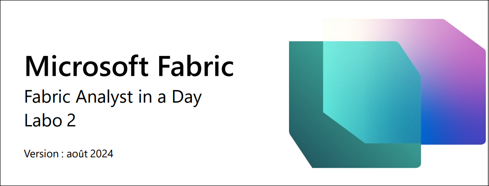
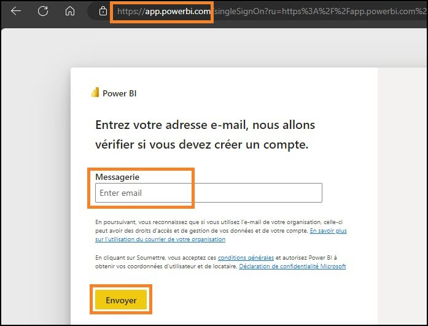
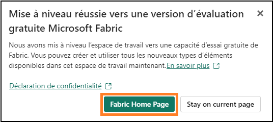
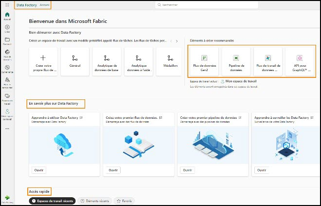
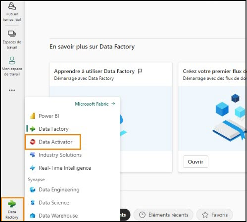
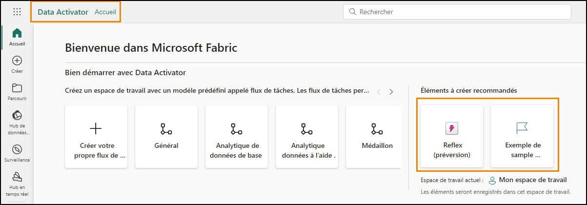
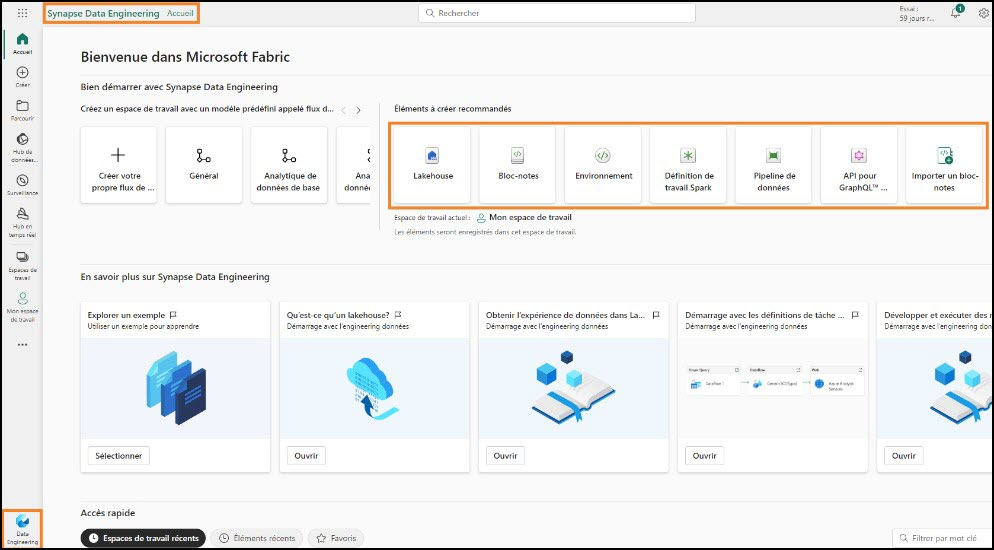
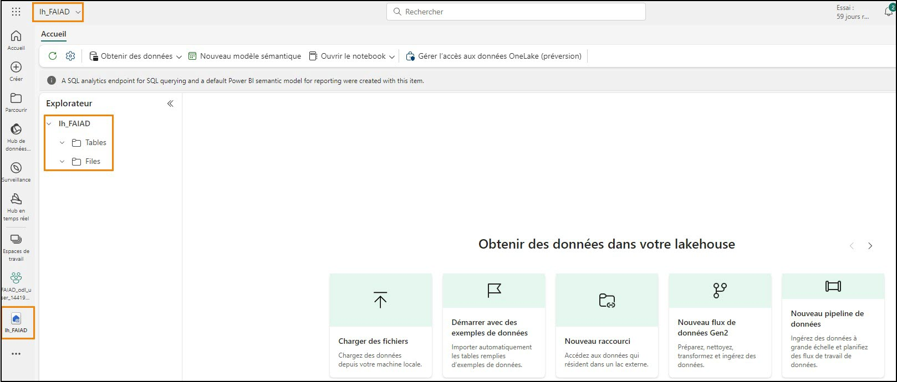

# Microsoft Fabric - Fabric Analyst in a Day - Labo 2 ##

# Sommaire 

- Introduction	

- Licence Fabric	

    - Tâche 1 : activer une licence d’essai 
    Microsoft Fabric	

- Présentation des expériences Fabric	

    - Tâche 2 : expérience Data Factory	

    - Tâche 3 : expérience Data Activator	

    - Tâche 4 : expérience Industry Solutions	
    
    - Tâche 5 : expérience Real-Time Intelligence	
    - Tâche 6 : expérience Synapse Data Engineering	

    - Tâche 7 : expérience Synapse Data Science

    - Tâche 8 : expérience Synapse Data Warehouse	

- Espace de travail Fabric	

    - Tâche 9 : créer un espace de travail Fabric	

    - Tâche 10 : créer une lakehouse

- Références	

# Introduction 

Aujourd’hui, vous allez découvrir diverses fonctionnalités clés de Microsoft Fabric. Ils’agit d’un atelierd’introduction destiné à vous présenter les différentes expériences produit et les divers éléments disponibles dans Fabric. À la fin de cet atelier, vous saurez comment utiliser Lakehouse, Dataflow Gen2, un pipeline de données, Direct Lake et plus encore.

À la fin de ce labo, vous saurez : 

- comment créer un espace de travail Fabric

- comment créer une lakehouse. 

# Licence Fabric

## Tâche 1 : activer une licence d’essai Microsoft Fabric
1. Ouvrez le **navigateur** et accédez à https://app.powerbi.com/. Vous êtes alors redirigé vers la page de connexion.

   **Remarque** : si vous n’utilisez pas l’environnement de labo et que vous disposez d’un compte Power BI existant, vous pouvez utiliser le navigateur en mode privé/incognito.

2. Saisissez le **Nom d’utilisateur** disponible dans l’onglet **Variables d’environnement** (en regard du Guide de labo) dans le champ **E-mail** et cliquez sur **Envoyer.**

   

3. Vous êtes alors redirigé vers l’écran **Mot de passe**. Saisissez le **Mot de passe** disponible dans l’onglet **Variables d’environnement** (en regard du Guide de labo) qui vous a été communiqué par le formateur.

4. Cliquez sur **Se connecter** et suivez les invites pour vous connecter à Fabric.

   

5. Vous êtes alors redirigé vers la **page d’accueil Service Power BI** familière.

6. Nous supposons que vous connaissez la disposition du service Power BI. Si vous avez une 
question, n’hésitez pas à la poser au formateur.

   Vous êtes actuellement dans **Mon espace de travail**. Pour utiliser des éléments Fabric, vous avez besoin d’une licence d’essai et d’un espace de travail doté d’une licence Fabric. En avant pour la configuration.

7. Dans le coin supérieur droit de l’écran, cliquez sur l’**icône utilisateur.**

8. Cliquez sur **Essai gratuit.**

   

9. La boîte de dialogue Mettre à niveau vers un essai gratuit Microsoft Fabric s’ouvre alors. Cliquez sur **Démarrer l’évaluation.**

    

10. La boîte de dialogue Mise à niveau réussie vers Microsoft Fabric s’ouvre alors. Cliquez sur **Page d’accueil Fabric.**

    

11. Vous êtes alors redirigé vers la **page d’accueil Microsoft Fabric.**

    

# Présentation des expériences Fabric

## Tâche 2 : expérience Data Factory

1. Sélectionnez l’icône **Microsoft Fabric** (sélecteur de l’expérience Fabric) en bas à gauche de votre écran. Une boîte de dialogue avec la liste des expériences Fabric s’ouvre alors. Notez que Power BI, Data Factory, Data Activator, Industry Solutions et Real-Time Intelligence sont des expériences indépendantes. Data Engineering, Data Science et Data Warehouse sont des expériences Synapse, car ces expériences sont optimisées par Synapse. Explorons.

2. Cliquez sur **Data Factory.**

   

3. **Éléments recommandés** : cette section répertorie les éléments disponibles dans Data Factory : Dataflow Gen2, pipeline de données, flux de travail de données et API pour GraphQL.

    a. **Nouveau** : cette section répertorie les éléments disponibles dans Data Factory - Dataflow Gen2 et le pipeline de données.

    i. Dataflow Gen2 est la nouvelle génération de Dataflow.

    ii. Le pipeline de données est utilisé pour l’orchestration des données.

    iii. Le flux de travail de données est le gestionnaire de flux de travail.

    iv. L’API pour GraphQL est une API permettant d’interroger plusieurs sources de données.

    b. **Découvrir** : cette section donne accès à la documentation d’apprentissage de démarrage rapide.

    c. **Accès rapide** : cette section répertorie les éléments récemment utilisés ou favoris.

   

## Tâche 3 : expérience Data Activator

1. Sélectionnez l’icône du **sélecteur de l’expérience Fabric** (actuellement défini sur Data Factory) en bas à gauche de votre écran. La boîte de dialogue Expérience Fabric s’ouvre alors.

    

2. Cliquez sur **Data Activator** dans la boîte de dialogue. Vous êtes alors redirigé vers la **page d’accueil de Data Activator**. Data Activator est une expérience no-code dans Microsoft Fabric permettant d’entreprendre automatiquement des actions lorsque des modèles ou conditions sont détecté(e)s dans des données changeantes. Notez que les trois sections ressemblent à l’expérience Data Factory. Dans la section Éléments recommandés, notez les éléments suivants :

    a. **Reflex** : permet de surveiller les jeux de données, les requêtes et les flux d’événements à la recherche de modèles.

    b. **Exemple Reflex** : exemple de solution.

    

## Tâche 4 : expérience Industry Solutions

1. Sélectionnez l’icône **Sélecteur de l’expérience Fabric** (actuellement défini sur Data Activator) en bas à gauche de l’écran. La boîte de dialogue Expérience Fabric s’ouvre alors.

2. Cliquez sur **Industry Solutions** dans la boîte de dialogue. Vous allez accéder à la page d’accueil **Industry Solutions**. Microsoft Fabric propose des solutions de données spécifiques à l’industrie qui fournissent une plateforme robuste pour la gestion des données, l’analyse et la prise de décision. Ces solutions de données répondent aux défis uniques auxquels sont confrontés différents secteurs, permettant aux entreprises d’optimiser leurs opérations, d’intégrer des données provenant de différentes sources et d’utiliser des analyses riches. Notez que les trois sections ressemblent aux expériences précédentes. Dans la section Éléments recommandés, notez les éléments suivants :

    a. **Solutions Sustainability** : prennent en charge l’ingestion, la standardisation et l’analyse des données environnementales, sociales et de gouvernance (ESG).

    b. **Solutions Retail** : aident à gérer de grands volumes de données, à intégrer des données provenant de diverses sources et à fournir des analyses en temps réel pour une prise de décision rapide. Les détaillants peuvent utiliser ces solutions pour l’optimisation des stocks, la segmentation des clients, la prévision des ventes, la tarification dynamique et la détection des fraudes.

    c. **Solutions Healthcare** : sont stratégiquement conçues pour accélérer le délai de création de valeur ajoutée pour les clients en répondant au besoin crucial visant à transformer efficacement les données de santé dans un format approprié pour l’analyse.

    

## Tâche 5 : expérience Real-Time Intelligence

1. Sélectionnez l’icône **Sélecteur de l’expérience Fabric** (actuellement défini sur Industry Solutions) en bas à gauche de l’écran. La boîte de dialogue Expérience Fabric s’ouvre alors.

2. Cliquez sur **Real-Time Intelligence**. Vous accédez alors à la **page d’accueil Real-Time Intelligence**. Encore une fois, il y a trois sections. Dans la section Éléments recommandés, notez les éléments suivants :

    a. **Eventhouse** : permet de créer un espace de travail de base de données, qui peut être partagé entre les projets.

    b. **Jeu de requêtes KQL** : permet d’exécuter des requêtes sur les données afin de produire des tables et visuels partageables.

    c. **Tableau de bord en temps réel** : permet de visualiser des tableaux de bord en temps réel dans les secondes qui suivent l’ingestion des données.

    d. **Eventstream** : permet de capturer, de transformer et d’acheminer un flux d’événements en temps réel.

    e. **Reflex** : permet de surveiller les jeux de données, les requêtes et les flux d’événements à la recherche de modèles.

    f. **Utiliser un exemple** : exemple de solution.

    **Remarque** : Reflex est également disponible dans les expériences Data Activator.

    

## Tâche 6 : expérience Synapse Data Engineering

1. Cliquez sur l’icône **Sélecteur de l’expérience Fabric** (actuellement défini sur Real-Time Intelligence) en bas de l’écran à gauche. La boîte de dialogue Expérience Fabric s’ouvre alors.

2. Cliquez sur **Data Engineering**. Vous êtes alors redirigé vers la **page d’accueil Data Engineering**. Encore une fois, la page comporte trois sections principales. Dans la section Éléments recommandés, notez les éléments suivants :

    a. **Lakehouse** : permet de stocker le Big Data à des fins de nettoyage, d’interrogation, de reporting et de partage.

    b. **Notebook** : utilisé pour l’ingestion de données, la préparation, l’analyse et d’autres tâches liées aux données à l’aide de divers langages tels que Python, R et Scala.

    c. **Environnement** : Utilisé pour configurer les bibliothèques partagées, les paramètres de calcul Spark et les ressources pour les notebooks et les définitions de tâche Spark.

    d. **Définition de travail Spark** : permet de définir, planifier et gérer des tâches Apache.

    e. **Pipeline de données** : permet d’orchestrer la solution de données.

    f. **API pour GraphQL** : est une API permettant d’interroger plusieurs sources de données.

    g. **Importer un notebook** : permet d’importer des notebooks à partir d’une machine locale.

    h. **Utiliser un échantillon** : exemple de solution.

    

## Tâche 7 : expérience Synapse Data Science

1. Sélectionnez l’icône **Sélecteur de l’expérience Fabric** (actuellement défini sur Data Engineering) en bas à gauche de l’écran. La boîte de dialogue Expérience Fabric s’ouvre alors.

2. Cliquez sur **Data Science**. Vous êtes alors redirigé vers la **page d’accueil Data Science**. Encore une 
fois, il y a trois sections. Dans la section Éléments recommandés, notez les éléments suivants :

    a. **Modèle ML** : permet de créer des modèles Machine Learning.

    b. **Expérience** : permet de créer, d’exécuter et de suivre le développement de plusieurs 
    modèles.

    c. **Notebook** : permet d’explorer des données et de créer des solutions de Machine 
    Learning.

    d. **Environnement** : Utilisé pour configurer les bibliothèques partagées, les paramètres de calcul Spark et les ressources pour les notebooks et les définitions de tâche Spark.

    e. **Compétence d’IA** : vous permet de créer votre propre expérience d’IA générative.

    f. **Importer un Notebook** : permet d’importer des notebooks à partir d’une machine locale.

    g. **Utiliser un échantillon** : exemple de solution.

    **Remarque** : des éléments tels que le Notebook, Environnement, Pipeline de données, etc. sont disponibles dans plusieurs expériences car ils sont pertinents dans chacune d’elles.

    

## Tâche 8 : expérience Synapse Data Warehouse

1. Sélectionnez l’icône **Sélecteur de l’expérience Fabric** (actuellement défini sur Data Science) en bas à gauche de l’écran. La boîte de dialogue Expérience Fabric s’ouvre alors.

2. Cliquez sur **Data Warehouse**. Vous êtes alors redirigé vers la **page d’accueil Data Warehouse**. Encore une fois, il y a trois sections. Dans la section Nouveau, notez les éléments suivants :

    a. **Warehouse** : utilisé pour créer un Data Warehouse.

    b. **Pipeline de données** : permet d’orchestrer la solution de données.

    c. **SQL Database en miroir** : permet de mettre en miroir la base de données 
    Azure SQL Database.

    d. **Snowflake en miroir** : permet de mettre en miroir la base de données Snowflake.

    e. **Azure Cosmos DB en miroir** : permet de mettre en miroir Azure Cosmos DB.

    

# Espace de travail Fabric

## Tâche 9 : créer un espace de travail Fabric

1. Créons maintenant un espace de travail avec la licence Fabric. Cliquez sur **Espaces de travail** dans la barre de navigation gauche. Une boîte de dialogue s’ouvre alors.

2. Cliquez sur **Nouvel espace de travail.**

   

3. La boîte de dialogue **Créer un espace de travail** s’ouvre alors sur le côté droit du navigateur.

4. Dans le champ **Nom**, saisissez **FAIAD_\<username>**.

    **Remarque** : le nom de l’espace de travail doit être unique. Cependant, le nom de votre espace de travail doit être différent. Assurez-vous qu’une coche verte avec « **Ce nom est disponible** » s’affiche sous le champ Nom.

5. Si vous le souhaitez, vous pouvez saisir une **Description** pour l’espace de travail. Il s’agit d’un champ facultatif.

6. Cliquez sur **Options avancées** pour développer la section.

    

7. Sous **Modèle de Licence**, assurez-vous que la case **Essai** est cochée. (Elle devrait l’être par défaut.)

8. Cliquez sur **Appliquer** pour créer un espace de travail.

    

   Un espace de travail est alors créé et vous êtes redirigé vers cet espace de travail. Nous allons importer les données des différentes sources de données dans la lakehouse et créer notre modèle à l’aide des données de la lakehouse et en rendre compte. La première étape consiste à créer une lakehouse.

# Tâche 10 : créer une lakehouse

1. Cliquez sur l’icône **Sélecteur de l’expérience Fabric** (actuellement défini sur Data Warehouse) en bas de l’écran à gauche. Expérience Fabric s’ouvre alors.

2. Cliquez sur **Data Engineering** pour être redirigé vers la page d’accueil Data Engineering.

   

3. Cliquez sur **Lakehouse.**

    

4. La boîte de dialogue Nouvelle lakehouse s’ouvre alors. Tapez **lh_FAIAD** dans la zone de texte Nom.

   **Remarque** : lh fait ici référence à la fonctionnalité Lakehouse. Nous ajoutons le préfixe lh afin de faciliter l’identification et la recherche.

5. Cliquez sur **Créer.**

   

   Quelques instants après, une lakehouse est créée et vous êtes redirigé vers l’interface Lakehouse. Dans le **volet gauche**, notez l’icône Lakehouse sous votre espace de travail. Vous pouvez facilement accéder à la lakehouse en cliquant sur cette icône à tout moment.

   Dans l’explorateur Lakehouse, notez des **tables** et **fichiers**. Lakehouse peut exposer des fichiers Azure Data Lake Storage Gen2 sous la section Fichiers ou un flux de données peut charger des données dans des tables Lakehouse. Diverses options sont disponibles. Nous allons vous montrer certaines des options dans les labos suivants.

   

    Dans ce labo, nous avons exploré l’interface Fabric, créé un espace de travail Fabric et une lakehouse. Dans le prochain labo, nous allons découvrir comment les raccourcis dans Lakehouse permettent de se connecter aux données ADLS Gen2 et comment transformer ces données à l’aide de vues.

# Références

Fabric Analyst in a Day (FAIAD) vous présente certaines des fonctions clés de Microsoft Fabric. Dans le menu du service, la section Aide (?) comporte des liens vers d’excellentes ressources.

Voici quelques autres ressources qui vous aideront lors de vos prochaines étapes avec Microsoft Fabric :
- Consultez le billet de blog pour lire l’intégralité de l’[annonce de la GA de Microsoft Fabric.](https://aka.ms/Fabric-Hero-Blog-Ignite23) 
- Explorez Fabric grâce à la [visite guidée.](https://aka.ms/Fabric-GuidedTour)
- Inscrivez-vous pour bénéficier d’un [essai gratuit de Microsoft Fabric.](https://aka.ms/try-fabric)
- Rendez-vous sur le [site web Microsoft Fabric.](https://aka.ms/microsoft-fabric)
- Acquérez de nouvelles compétences en explorant les [modules d’apprentissage Fabric.](https://aka.ms/learn-fabric)
- Explorez la [documentation technique Fabric.](https://aka.ms/fabric-docs)
- Lisez le [livre électronique gratuit sur la prise en main de Fabric.](https://aka.ms/fabric-get-started-ebook)
- Rejoignez la [communauté Fabric](https://aka.ms/fabric-community) pour publier vos questions, partager vos commentaires et 
apprendre des autres.

Lisez les blogs d’annonces plus détaillés sur l’expérience Fabric :
- [Blog Expérience Data Factory dans Fabric](https://aka.ms/Fabric-Data-Factory-Blog)
- [Blog Expérience Synapse Data Engineering dans Fabric](https://aka.ms/Fabric-DE-Blog)
- [Blog Expérience Synapse Data Science dans Fabric](https://aka.ms/Fabric-DS-Blog)
- [Blog Expérience Synapse Data Warehousing dans Fabric](https://aka.ms/Fabric-DW-Blog)
- [Blog Expérience Synapse Real-Time Analytics dans Fabric](https://aka.ms/Fabric-RTA-Blog)
- [Blog Annonce Power BI](https://aka.ms/Fabric-PBI-Blog)
- [Blog Expérience Data Activator dans Fabric](https://aka.ms/Fabric-DA-Blog)
- [Blog Administration et gouvernance dans Fabric](https://aka.ms/Fabric-Admin-Gov-Blog)
- [Blog OneLake dans Fabric](https://aka.ms/Fabric-OneLake-Blog)
- [Blog Intégration de Dataverse et Microsoft Fabric](https://aka.ms/Dataverse-Fabric-Blog)

© 2023 Microsoft Corporation. Tous droits réservés.

En effectuant cette démonstration/ce labo, vous acceptez les conditions suivantes :

La technologie/fonctionnalité décrite dans cette démonstration/ces travaux pratiques est fournie par Microsoft Corporation en vue d’obtenir vos commentaires et de vous fournir une expérience d’apprentissage. Vous pouvez utiliser cette démonstration/ces ateliers uniquement pour évaluer ces technologies et fonctionnalités, et pour fournir des commentaires à Microsoft. Vous ne pouvez pas l’utiliser à d’autres fins. Vous ne pouvez pas modifier, copier, distribuer, transmettre, afficher, effectuer, reproduire, publier,accorder une licence, créer des œuvres dérivées, transférer ou vendre tout ou une partie de cette démonstration/ces ateliers.

LA COPIE OU LA REPRODUCTION DE CETTE DÉMONSTRATION/CES TRAVAUX PRATIQUES (OU DE TOUTE PARTIE DE CEUX-CI) SUR TOUT AUTRE SERVEUR OU AUTRE EMPLACEMENT EN VUE D’UNE AUTRE REPRODUCTION OU REDISTRIBUTION EST EXPRESSÉMENT INTERDITE.

CETTE DÉMONSTRATION/CES TRAVAUX PRATIQUES FOURNISSENT CERTAINES FONCTIONNALITÉS DE PRODUIT/TECHNOLOGIES LOGICIELLES, NOTAMMENT D’ÉVENTUELS NOUVEAUX CONCEPTS ET FONCTIONNALITÉS, DANS UN ENVIRONNEMENT SIMULÉ SANS INSTALLATION OU CONFIGURATION COMPLEXE AUX FINS DÉCRITES CI-DESSUS. LES TECHNOLOGIES/CONCEPTS REPRÉSENTÉS DANS CETTE DÉMONSTRATION/CES TRAVAUX PRATIQUES PEUVENT NE PAS REPRÉSENTER LES FONCTIONNALITÉS COMPLÈTES ET PEUVENT NE PAS FONCTIONNER DE LA MÊME MANIÈRE QUE DANS UNE VERSION FINALE. IL EST ÉGALEMENT POSSIBLE QUE NOUS NE PUBLIIONS PAS DE VERSION FINALE DE CES FONCTIONNALITÉS OU CONCEPTS. VOTRE EXPÉRIENCE D’UTILISATION DE CES FONCTIONNALITÉS DANS UN ENVIRONNEMENT PHYSIQUE PEUT ÉGALEMENT ÊTRE DIFFÉRENTE.

**COMMENTAIRES**. Si vous envoyez des commentaires sur les fonctionnalités, technologies et/ou concepts décrits dans ces ateliers/cette démonstration à Microsoft, vous accordez à Microsoft, sans frais, le droit d’utiliser, de partager et de commercialiser vos commentaires de quelque manière et à quelque fin que ce soit. Vous accordez également à des tiers, sans frais, les droits de brevet nécessaires pour leurs produits, technologies et services en vue de l’utilisation ou de l’interface avec des parties spécifiques d’un logiciel ou d’un service Microsoft incluant les commentaires. Vous n’enverrez pas de commentaires soumis à une licence exigeant que Microsoft accorde une licence pour son logiciel ou sa documentation à des tiers du fait que nous y incluons vos commentaires. Ces droits survivent à ce contrat.

MICROSOFT CORPORATION DÉCLINE TOUTES LES GARANTIES ET CONDITIONS EN CE QUI CONCERNE 
CETTE DÉMONSTRATION/CES TRAVAUX PRATIQUES, Y COMPRIS TOUTES LES GARANTIES ET CONDITIONS DE QUALITÉ MARCHANDE, QU’ELLES SOIENT EXPLICITES, IMPLICITES OU LÉGALES, D’ADÉQUATION À UN USAGE PARTICULIER, DE TITRE ET D’ABSENCE DE CONTREFAÇON. MICROSOFT N’OFFRE AUCUNE GARANTIE OU REPRÉSENTATION EN CE QUI CONCERNE LA PRÉCISION DES RÉSULTATS, LA CONSÉQUENCE QUI DÉCOULE DE L’UTILISATION DE CETTE DÉMONSTRATION/CES ATELIERS, OU L’ADÉQUATION DES INFORMATIONS CONTENUES DANS CETTE DÉMONSTRATION/CES ATELIERS À QUELQUE FIN QUE CE SOIT.

### CLAUSE D’EXCLUSION DE RESPONSABILITÉ

Cette démonstration/Ce labo comporte seulement une partie des nouvelles fonctionnalités et 
améliorations disponibles dans Microsoft Power BI. Certaines fonctionnalités sont susceptibles de changer dans les versions ultérieures du produit. Dans ce labo/cette démonstration, vous allez découvrir comment utiliser certaines nouvelles fonctionnalités, mais pas toutes
