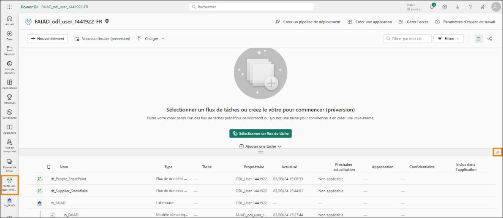
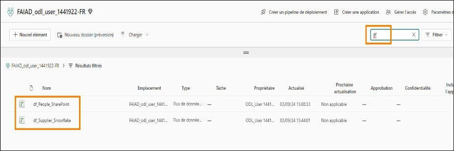
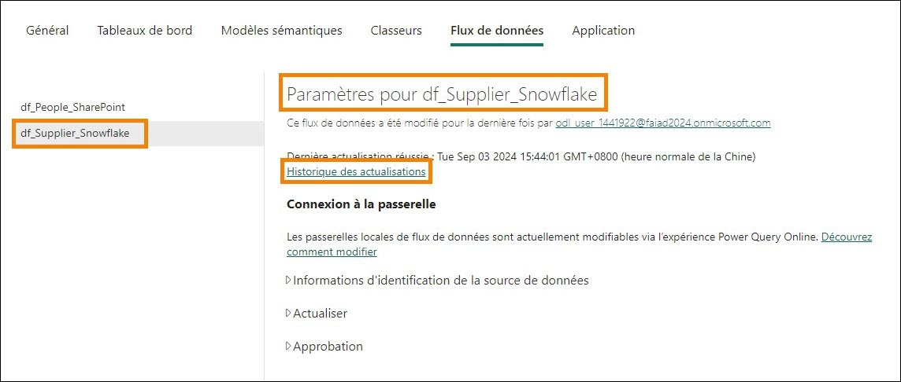
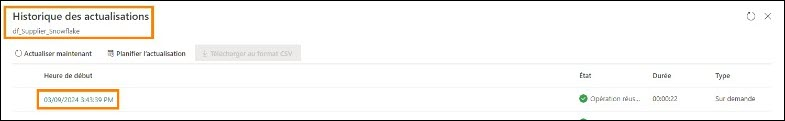
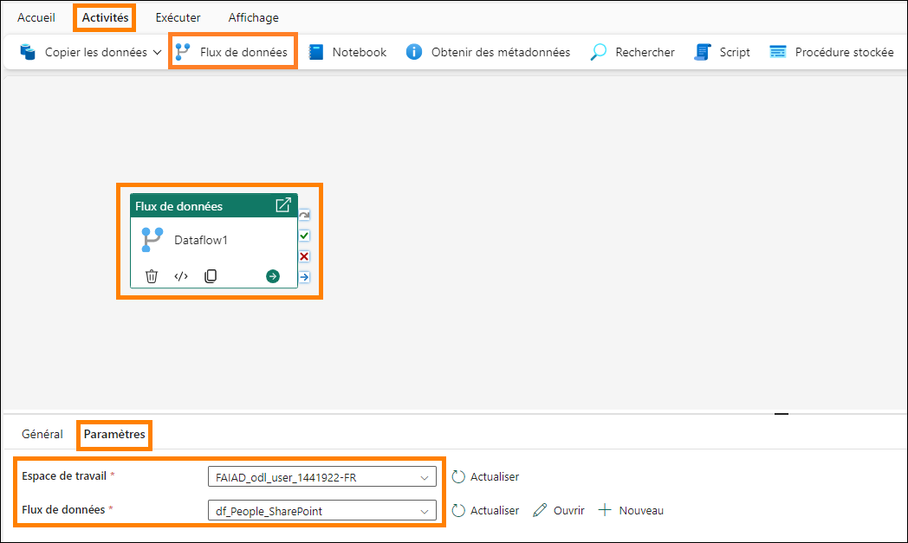
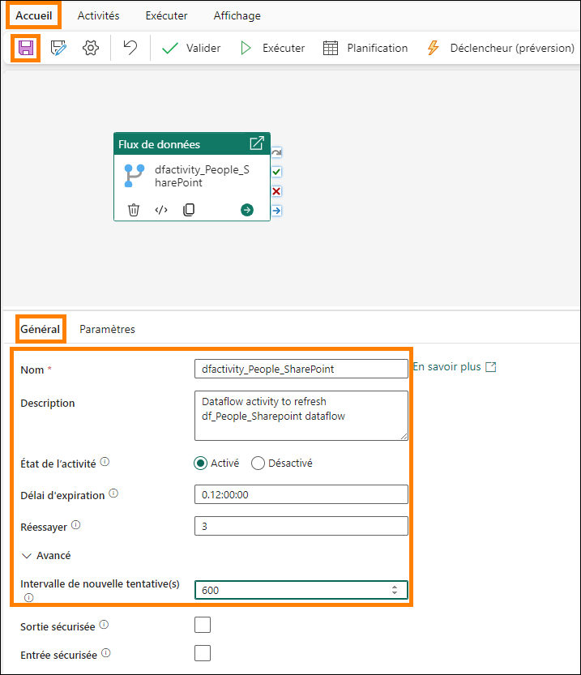

# Microsoft Fabric - Fabric Analyst in a Day - Labo 5 #

## Sommaire ##
-   Introduction	
-   Dataflow Gen2	
        -   Tâche 1 : configurer l’actualisation planifiée pour le flux de données Fournisseur	
-   Pipeline de données	
        -   Tâche 2 : créer un pipeline de données	
        -   Tâche 3 : créer un pipeline de données simple	
        -   Tâche 4 : créer un pipeline de données	
        -   Tâche 5 : créer une activité Until	
        -   Tâche 6 : créer des variables	
        -   Tâche 7 : configurer l’activité Until	
        -   Tâche 8 : configurer l’activité Flux de données	
        -   Tâche 9 : configurer une 1re activité Définir une variable	
        -   Tâche 10 : configurer une 2e activité Définir une variable	
        -   Tâche 11 : configurer une 3e activité Définir une variable	
        -   Tâche 12 : configurer l’activité Attente	
        -   Tâche 13 : configurer l’actualisation planifiée pour le pipeline de données	
-   Références	

## Introduction ##
Nous avons ingéré des données provenant de différentes sources de données dans Lakehouse. Dans ce labo, vous allez configurer un calendrier d’actualisation pour les sources de données. Voici un résumé du besoin :

-   Données fournisseur : stockées dans Snowflake et mises à jour au quotidien à minuit.
-   Données collaborateur : stockées dans SharePoint et mises à jour au quotidien à 9 h. Cependant, nous avons remarqué qu’il y a parfois un retard de 5 à 15 minutes. Nous devons créer un calendrier d’actualisation pour en tenir compte.
-   Données client : stockées dans Dataverse et systématiquement à jour. Auparavant, nous les actualisions quatre fois par jour : à minuit, 6 h, midi et 18 h. À présent, l’équipe informatique a créé un lien vers Dataverse permettant d’ingérer ces données dans une lakehouse d’administration. Elle a également transformé ces données. Nous n’avons pas besoin de  
configurer l’actualisation, car nous nous connectons à la lakehouse fournie par l’équipe informatique.
-   Données Sales : stockées dans ADLS et mises à jour au quotidien à midi. Nous n’avons pas besoin de configurer l’actualisation pour cela puisque nous avons créé un raccourci. Dès que les données sont mises à jour dans ADLS, elles sont disponibles.

À la fin de ce labo, vous saurez :
-   comment configurer une actualisation planifiée de Dataflow Gen2 ;
-   comment créer un pipeline de données ;
-   comment configurer une actualisation planifiée d’un pipeline de données.

## Dataflow Gen2 ##

### Tâche 1 : configurer l’actualisation planifiée pour le flux de données Fournisseur ###
Commençons par configurer une actualisation planifiée du flux de données Fournisseur.

1.	Revenons à l’espace de travail Fabric **FAIAD_<username>** en cliquant sur l’espace de travail dans le volet gauche.
2.	Pour agrandir le volet avec la liste des artefacts, cliquez sur la double flèche en haut du volet à droite.
    

3.	Tous les artefacts que vous avez créés sont répertoriés ici. Sur le côté droit de l’écran, saisissez df
dans la zone de recherche. Les artefacts sont alors filtrés vers les flux de données.
    

4.	Survolez la ligne **df_Supplier_Snowflake**. Notez que les icônes familières Actualiser et Planifier l’actualisation sont disponibles. Cliquez sur les **points de suspension (…)**.
5.	Notez qu’une option permet de supprimer, de modifier et d’exporter le flux de données. Nous pouvons mettre à jour le nom et la description du flux de données à l’aide des propriétés. Nous allons examiner prochainement l’historique des actualisations. Cliquez sur **Paramètres**.
    

**_Remarque_** : la page Paramètres s’ouvre alors. Tous les flux de données sont répertoriés dans le volet gauche.

6.	Dans le volet central, cliquez sur le lien **Historique des actualisations**.
    

7.	La boîte de dialogue Historique des actualisations s’ouvre alors. Une actualisation est alors répertoriée. Il s’agit de l’actualisation qui s’est produite lors de la publication du flux de données. Cliquez sur le lien **Heure de début**.
 
    **_Remarque_** : l’heure de début est différente pour vous.
        

    L’écran Détails s’ouvre alors. Il vous fournit des détails sur l’actualisation et répertorie l’heure de début, l’heure de fin et la durée. Il répertorie également les tables/activités actualisées. En cas d’échec, vous pouvez cliquer sur le nom de la table/l’activité pour l’examiner plus en détail.
        

8.	Quittons cet écran en cliquant sur le X dans le coin supérieur droit. Vous êtes alors redirigé vers la **page des paramètres du flux de données**.
9.	Sous Connexion à la passerelle, développez **Informations d’identification de la source de
données**. Une liste des connexions utilisées dans le flux de données s’affiche alors, Dans ce cas, il s’agit de Lakehouse et Snowflake.
    -	**Lakehouse** : il s’agit de la connexion permettant d’ingérer des données depuis Dataflow.
    -	**Snowflake** : il s’agit de la connexion aux données sources Snowflake.
        
10.	Développez **Actualiser**.
11.	Réglez le curseur **Configurer une planification d’actualisation** sur **Activé**.
12.	Définissez la **liste déroulante Fréquence d’actualisation** sur **Tous les jours**. Notez que vous pouvez également la définir sur Toutes les semaines.
13.	Définissez le champ **Fuseau horaire** sur votre fuseau horaire préféré.
 
    **_Remarque_** : comme il s’agit d’un environnement de labo, vous pouvez définir le fuseau horaire sur votre fuseau horaire préféré. Dans un scénario réel, vous définissez le fuseau horaire en fonction de l’emplacement de votre source de données.

14.	Cliquez sur le lien **Ajouter un autre horaire**. Notez que l’option **Heure** s’affiche alors.
15.	Définissez le champ **Heure** sur **minuit/0 h**. Notez que vous pouvez définir l’actualisation sur une heure pile ou une demi-heure.
16.	Cliquez sur Appliquer pour enregistrer ce paramètre.
    **_Remarque_** : en cliquant sur le lien Ajouter un autre horaire, vous pouvez ajouter plusieurs heures d’actualisation.

    Vous pouvez également envoyer des notifications d’échec au propriétaire du flux de données et à d’autres contacts.
        

Comme indiqué précédemment, nous devons créer une logique personnalisée pour gérer le scénario dans lequel le fichier collaborateur dans SharePoint n’est pas livré à temps. Résolvons ce problème à l’aide d’un pipeline de données.

## Pipeline de données ##

### Tâche 2 : créer un pipeline de données ###
1.	Sélectionnez l’icône du **sélecteur de l’expérience Fabric** en bas à gauche de votre écran.
2.	La boîte de dialogue Microsoft Fabric s’ouvre alors. Cliquez sur **Data Factory**. Vous êtes alors redirigé vers la page d’accueil de Data Factory.
    
3.	Dans le volet supérieur, cliquez sur Pipeline de données pour créer un pipeline.
4.	La boîte de dialogue Nouveau pipeline s’ouvre alors. Nommez le pipeline
**pl_Refresh_People_SharePoint**.
5.	Cliquez sur **Créer**.
    

    Vous êtes alors redirigé vers la **page Pipeline de données**. Si vous avez utilisé Azure Data Factory, cet écran vous est familier. Présentons rapidement la disposition.

    Vous vous trouvez sur l’écran d’**Accueil**. Le menu supérieur comporte des options permettant

    d’ajouter les activités couramment utilisées : valider et exécuter un pipeline, et afficher l’historique d’exécution. De plus, le volet central comporte des options rapides permettant de commencer à

    créer le pipeline.
    

6.	Dans le menu supérieur, cliquez sur **Activités**. Le menu comporte désormais une liste des activités couramment utilisées.
7.	Cliquez sur les **points de suspension (…)** à droite dans le menu pour afficher toutes les autres activités disponibles. Nous allons utiliser certaines de ces activités dans le labo.
    

8.	Dans le menu supérieur, cliquez sur **Exécuter**. Des options vous permettent d’exécuter et de
planifier l’exécution du pipeline. Vous pouvez également afficher l’historique d’exécution à l’aide de l’option Afficher l’historique de l’exécution.
9.	Dans le menu supérieur, cliquez sur **Affichage**. Ici, des options vous permettent d’afficher le code au format JSON. En outre, des options vous permettent de mettre en forme les activités.

    **_Remarque_** : Si vous disposez d’un arrière-plan JSON à la fin du labo, n’hésitez pas à cliquer sur
Afficher le code JSON. Ici, notez que toute l’orchestration que vous effectuez à l’aide de la vue de conception peut également être écrite au format JSON.

    

## Tâche 3 : créer un pipeline de données simple ##
Commençons à créer le pipeline. Nous avons besoin d’une activité pour actualiser le flux de données. Trouvons une activité que nous pouvons utiliser.
1.	Dans le menu supérieur, cliquez sur **Activités -> Flux de données**. L’activité Flux de données est alors ajoutée au volet de conception central. Notez que le volet inférieur comporte désormais des options de configuration de l’activité Flux de données.
2.	Nous allons configurer l’activité pour se connecter à l’activité df_People_SharePoint. Dans le
**volet inférieur**, cliquez sur **Paramètres**.
3.	Assurez-vous que le champ **Espace de travail** est défini sur votre espace de travail Fabric
**FAIAD_<username>**.
4.	Dans la **liste déroulante Flux de données**, sélectionnez **df_People_SharePoint**. Lorsque cette activité Flux de données est exécutée, elle va actualiser **df_People_SharePoint**. C’était facile, non ? v¨●

    Dans notre scénario, les données collaborateur ne sont pas mises à jour dans les délais. Parfois, il y a un retard. Voyons si nous pouvons nous adapter à cela.

    
5.	Dans le **volet inférieur**, cliquez sur **Général**. Donnons un nom et une description à l’activité.
6.	Dans le champ **Nom**, saisissez **dfactivity_People_SharePoint**.
7.	Dans le champ **Description**, saisissez **Dataflow activity to refresh df_People_Sharepoint dataflow**.
8.	Notez qu’une option permet de désactiver une activité. Cette fonctionnalité est utile lors de tests ou d’un débogage. Laissez-la définie sur **Activé**.
9.	Une option permet de définir le **Délai d’expiration**. Laissons la valeur par défaut telle quelle, ce qui devrait laisser suffisamment de temps au flux de données pour s’actualiser.

    **_Remarque_** : si les données ne sont pas disponibles dans les délais, définissons l’activité afin qu’elle se réexécute toutes les 10 minutes, trois fois. Si elle échoue également à la troisième tentative, un échec est signalé.
10.	Définissez le champ **Nombre de nouvelles tentatives** sur **3**.
11.	Développer la section **Avancé**.
 
12.	Définissez le champ **Intervalle de nouvelle tentative(s)** sur **600**.
13.	Dans le menu, cliquez sur l’icône **Accueil -> Enregistrer** pour enregistrer le pipeline.

    

Notez les avantages d’utiliser le pipeline de données par rapport à la définition du flux de données sur une actualisation planifiée (comme nous l’avons fait pour les flux de données précédents) :
-   Le pipeline permet d’effectuer plusieurs tentatives avant l’échec de l’actualisation.
-   Le pipeline permet d’effectuer une actualisation en quelques secondes, alors qu’avec le flux de données, l’actualisation planifiée a lieu toutes les 30 minutes.

