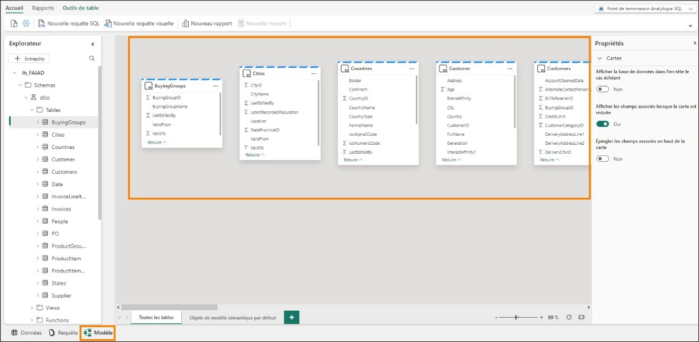
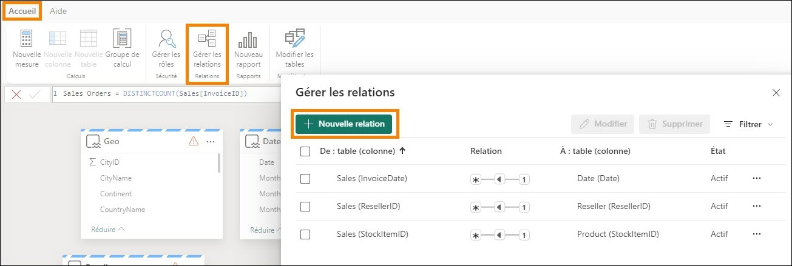
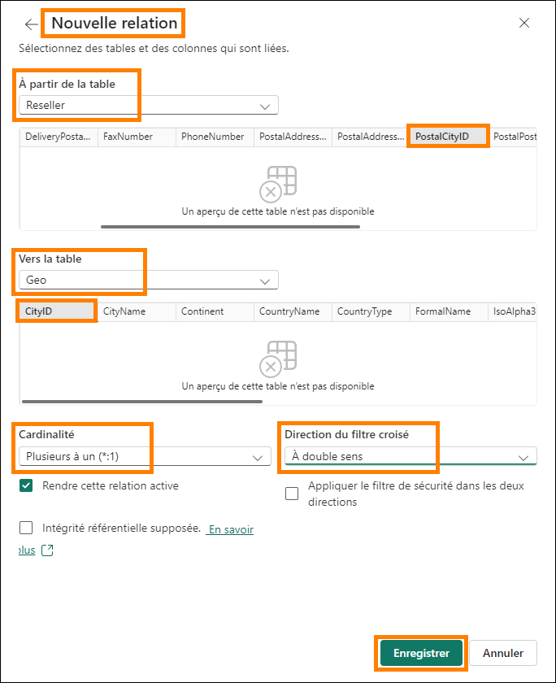

# Microsoft Fabric - Analyste Fabric en un jour - Laboratoire 6


# Sommaire

- Introduction

- Lakehouse : analyse des données	

    - Tâche 1 : interroger des données à l’aide de SQL

    - Tâche 2 : visualiser le résultat T-SQL	

-   Lakehouse : modélisation sémantique	

    -   Tâche 3 : créer un modèle sémantique	

    -   Tâche 4 : créer des relations	

    -   Tâche 5 : créer des mesures	

    -   Tâche 6 : section facultative - Créer des relations	

    -   Tâche 7 : section facultative - Créer des mesures	

-   Références	

 
# Introduction

Nous avons des données provenant de différentes sources ingérées dans la lakehouse. Dans ce labo, vous allez utiliser le modèle sémantique. Nous avons généralement effectué des activités de
modélisation telles que la création de relations, l’ajout de mesures, etc. dans Power BI Desktop. Ici, nous allons découvrir comment effectuer ces activités de modélisation dans le service.

À la fin de ce labo, vous saurez :

-   comment utiliser la vue SQL dans le point de terminaison analytique SQL ;

-   comment créer un modèle sémantique.

# Lakehouse : analyse des données

## Tâche 1 : interroger des données à l’aide de SQL

1.	Revenons à l’espace de travail Fabric **FAIAD_\<username>** que vous avez créé dans le labo 2, tâche 9.

2.	Si vous le souhaitez, **réduisez le flux de tâches** pour afficher la liste complète des éléments.

3.	Vous voyez trois types d’lh_FAIAD : Lakehouse, Modèle sémantique et Point de terminaison SQL. Nous avons exploré Lakehouse et créé des requêtes visuelles à l’aide du point de terminaison analytique SQL dans un labo précédent. Sélectionnez l’option **Point de terminaison Analytique SQL lh_FAIAD** pour continuer à explorer cette option. Vous êtes alors redirigé vers la vue SQL de l’explorateur.

    

    Vous pouvez explorer les données avant de créer un modèle de données à l’aide de SQL.
    Deux options permettent d’utiliser SQL. La première option est une requête visuelle, que nous avons utilisée dans le labo précédent. L’option 2 consiste à écrire du code TSQL. Il s’agit d’une option
    conviviale pour les développeurs. Explorons cela.

    Supposons que vous souhaitiez connaître rapidement les unités (Units) vendues par fournisseur (Supplier) à l’aide de SQL.
 
    Dans le point de terminaison analytique SQL de la lakehouse, notez que vous pouvez afficher les tables dans le volet gauche. Si vous développez les tables, vous pouvez afficher les colonnes qui composent la table. En outre, des options permettent de créer des vues, fonctions et procédures
    stockées SQL. Si vous avez une expérience SQL, n’hésitez pas à explorer ces options. Essayons d’écrire une requête SQL simple.

4.	Dans le **menu supérieur**, cliquez sur **Nouvelle requête SQL** ou en bas **du volet gauche**, cliquez sur **Requête**. Vous êtes alors redirigé vers la vue Requête SQL.


5.	Collez la **requête SQL ci-dessous** dans la **fenêtre Requête**. Cette requête renvoie les unités par nom de fournisseur. Pour y parvenir, elle joint la table Sales avec les tables Product et Supplier.

    ```
    SELECT su.SupplierName, SUM(Quantity) as Units
    FROM dbo.Sales s
    JOIN dbo.Product p on p.StockItemID = s.StockItemID
    JOIN dbo.Supplier su on su.SupplierID = p.SupplierID
    GROUP BY su.SupplierName
    ```

6.	Cliquez sur **Run** dans le menu de l’éditeur SQL pour afficher les résultats.

7.	Notez qu’une option permet d’enregistrer cette requête en tant que vue en cliquant sur
**Enregistrer en tant que vue**.

8.	Dans le **volet gauche** Explorateur, sous la section **Queries**, cette requête est enregistrée sous **Mes requêtes** comme **SQL query 1**. Cela permet de renommer la requête et de l’enregistrer pour une utilisation ultérieure. En outre, une option permet d’afficher les requêtes partagées avec vous à l’aide du dossier **Requêtes partagées**.

    **Remarque** : les requêtes visuelles que vous avez créées dans les labos précédents sont également disponibles sous le dossier Mes requêtes.

    

## Tâche 2 : visualiser le résultat T-SQL

1.	Nous pouvons également visualiser le résultat de cette requête. **Mettez en surbrillance la requête** dans le volet de requête.

2.	Dans le menu du volet Résultats, cliquez sur **Explorer ces données (préversion) -> Visualiser les résultats**.

    

3.	La boîte de dialogue **Visualiser les résultats** s’ouvre alors. Cliquez sur **Continuer**.

    La boîte de dialogue **Visualiser les résultats** s’ouvre alors et ressemble à la vue d’état Power BI Desktop. Elle affiche toutes les fonctionnalités disponibles dans la vue d’état Power BI Desktop : vous pouvez mettre en forme la page, sélectionner différents visuels, mettre en forme des visuels, ajouter des filtres, etc. Nous n’allons pas explorer ces options dans ce cours.

4.	Développez le volet **Données**, puis **SQL query 1**.
 
5.	Sélectionnez les **champs Supplier_Name** et **Units**. Un visuel de table est créé.

    

6.	Dans la section **Visualisations**, changez le type de visuel en sélectionnant l’**Histogramme empilé**.

7.	Cliquez sur **Enregistrer en tant que rapport** en bas de l’écran à droite.

    

8.	La boîte de dialogue Enregistrer votre rapport s’ouvre alors. Tapez **Units by Supplier** dans la zone de texte **Entrez un nom pour votre rapport**.

9.	Assurez-vous que l’espace de travail de destination est votre espace de travail Fabric
**FAIAD\<username>**.
 
10.	Cliquez sur **Enregistrer**.

    

    Vous êtes alors redirigé vers l’écran de requête SQL.

# Lakehouse : modélisation sémantique

## Tâche 3 : créer un modèle sémantique

1.	Dans le **volet inférieur**, cliquez sur **Modèle**. Notez que le volet central ressemble à la vue Modèle que nous voyons dans Power BI Desktop.

    

    Il s’agit du modèle par défaut créé par la lakehouse. Cependant, le modèle par défaut présente certaines limitations (comme la possibilité de mettre en forme les mesures, etc.). De plus, nous n’avons besoin que d’un sous-ensemble des tables de notre modèle. Nous allons donc créer un modèle sémantique.

2.	Dans le menu, en haut à droite, **cliquez sur la flèche en regard de Point de terminaison Analytique SQL**.
 
3.	Sélectionnez **Lakehouse** pour accéder à la vue Lakehouse.

    

4.	Dans le menu, cliquez sur **Accueil -> Nouveau modèle sémantique**.

5.	La boîte de dialogue Nouveau modèle sémantique s’ouvre alors. Saisissez **sm_FAIAD** comme nom du modèle sémantique Direct Lake.

6.	Nous pouvons sélectionner un sous-ensemble des tables par défaut. N’oubliez pas que nous avons créé des vues dans le labo précédent. Nous souhaitons inclure ces vues dans le modèle. **Cliquez** sur l’**icône** dans la **barre de recherche** et sélectionnez **Afficher les vues**. Nous pouvons maintenant afficher et sélectionner des vues.

    

7.	**Sélectionnez** les tables/vues suivantes :

    **a.	Date**

    **b.	People**

    **c.	Customer**

    **d.	PO**

    **e.	Supplier**

    **f.	Geo**

    **g.	Reseller**

    **h.	Sales**
    
    **i.	Product**
 
8.	Cliquez sur **Confirmer**.

    

## Tâche 4 : créer des relations

Vous allez accéder au nouveau modèle sémantique avec les tables sélectionnées. N’hésitez pas à **réorganiser** les tables si nécessaire. Notez que certaines tables (Geo, Reseller, Sales et Product) comportent un symbole d’avertissement en haut de la table à droite. En effet, il s’agit de vues. Tous
les visuels créés avec des champs provenant de ces vues sont en mode DirectQuery et non en mode Direct Lake.

**Remarque** : le mode Direct Lake est plus rapide que le mode DirectQuery.


 
La première étape consiste à créer des relations entre ces tables.

1.	Créons une relation entre les tables Sales et Reseller. Sélectionnez la valeur **ResellerID** dans la table **Sales** et faites-la glisser vers la valeur **ResellerID** dans la table **Reseller**.

    

2.	La boîte de dialogue Nouvelle relation s’ouvre alors. Assurez-vous que le champ **À partir de la table** est défini sur **Sales** et le paramètre **Colonne** sur **ResellerID**.

3.	Assurez-vous que le champ **Vers la table** est défini sur **Reseller** et le paramètre **Colonne** sur
**ResellerID**.

4.	Assurez-vous que le champ **Cardinalité** est défini sur **Plusieurs à un (*:1)**.

5.	Assurez-vous que le champ **Direction du filtre croisé** est défini sur **À sens unique**.
 
6.	Cliquez sur **Enregistrer**.

    

7.	De même, créez une relation entre les tables Sales et Date. Sélectionnez la valeur **InvoiceDate**
dans la table **Sales** et faites-la glisser vers la valeur **Date** dans la table **Date**.

8.	La boîte de dialogue Nouvelle relation s’ouvre alors. Assurez-vous que le champ **À partir de la table** est défini sur **Sales** et le paramètre **Colonne** sur **InvoiceDate**.

9.	Assurez-vous que le champ **Table de destination** est défini sur **Date** et le paramètre **Colonne** sur **Date**.

10.	Assurez-vous que le champ **Cardinalité** est défini sur **Plusieurs à un (*:1)**.

11.	Assurez-vous que le champ **Direction du filtre croisé** est défini sur **À sens unique**.

12.	Cliquez sur **Enregistrer**.

    

13.	De même, créez une relation **plusieurs-à-un** entre les tables **Sales** et **Product**. Sélectionnez la valeur **StockItemID** dans la table **Sales** et la valeur **StockItemID** dans la table **Product**.

    **Remarque** : toutes nos mises à jour sont enregistrées automatiquement.

    **Point de contrôle** : votre modèle devrait comporter les trois relations entre les tables Sales et Reseller, les tables Sales et Date, et les tables Sales et Product, comme illustré dans la capture d’écran ci-dessous :

    

    Pour gagner du temps, nous n’allons pas créer toutes les relations. Si le temps le permet, vous pouvez suivre la section facultative à la fin du labo. La section facultative passe en revue les étapes permettant de créer les relations restantes.

## Tâche 5 : créer des mesures

Ajoutons quelques mesures dont nous avons besoin pour créer le tableau de bord Sales.

1.	Cliquez sur la table **Sales** dans la vue de modèle. Nous souhaitons ajouter les mesures à la table Sales.

2.	Dans le menu supérieur, cliquez sur **Accueil -> Nouvelle mesure**. Notez que la barre de formule s’affiche.

3.	Saisissez **Sales = SUM(Sales[Sales Amount])** dans la **barre de formule**.

4.	Cliquez sur la **coche** à gauche de la barre de formule ou appuyez sur la touche **Entrée**.

5.	Développez le volet Propriétés à droite.

6.	Développez la section **Mise en forme**.

7.	Dans la liste déroulante **Format**, sélectionnez **Devise**.
 
8.	Définissez le champ Nombre de décimales sur **0**.

    

9.	Une fois la table **Sales** sélectionnée dans le menu supérieur, cliquez sur **Accueil -> Nouvelle mesure**. Notez que la barre de formule s’affiche.

10.	Saisissez **Units = SUM(Sales[Quantity])** dans la **barre de formule**.

11.	Cliquez sur la **coche** à gauche de la barre de formule ou appuyez sur la touche **Entrée**.

12.	Dans le volet Propriétés à droite, développez la section **Mise en forme**. (Le chargement du volet Propriétés peut prendre quelques instants.)

13.	Dans la liste déroulante **Format**, sélectionnez **Nombre entier**.

14.	Réglez le curseur **Séparateur de milliers** sur **Oui**.

    
 
15.	Une fois la table **Sales** sélectionnée dans le menu supérieur, cliquez sur **Accueil -> Nouvelle mesure**. Notez que la barre de formule s’affiche.

16.	Saisissez **Sales Orders = DISTINCTCOUNT(Sales[InvoiceID])** dans la **barre de formule**.

17.	Cliquez sur la **coche** à gauche de la barre de formule ou appuyez sur la touche **Entrée**.

18.	Dans le volet Propriétés à droite, développez la section **Mise en forme**.

19.	Dans la liste déroulante **Format**, sélectionnez **Nombre entier**.

20.	Réglez le curseur **Séparateur de milliers** sur **Oui**.

    

21.	Dans le volet **Données** (à droite), cliquez sur **Modèle**. Notez que cela fournit une vue qui aide à organiser tous les éléments du modèle sémantique.

22.	Développez **Modèle sémantique -> Mesures** pour afficher toutes les mesures que vous venez de créer.
 
23.	Vous pouvez également **développer des tables individuelles** pour afficher les colonnes, hiérarchies et mesures dans chacune d’elles.

    

    Encore une fois, pour gagner du temps, nous n’allons pas créer toutes les mesures. Si le temps le permet, vous pouvez suivre la section facultative à la fin du labo. La section facultative passe en revue les étapes permettant de créer les mesures restantes.

    Nous avons créé un modèle sémantique et l’étape suivante consiste à créer un état. Nous allons le faire dans le prochain labo.

## Tâche 6 : section facultative - Créer des relations
Ajoutons les relations restantes.

1.	Dans le menu, cliquez sur Accueil -> Gérer les relations.

2.	La boîte de dialogue Gérer les relations s’ouvre alors. Cliquez sur Nouvelle relation.

    

3.	La boîte de dialogue Nouvelle relation s’ouvre alors. Assurez-vous que le champ **À partir de la table** est défini sur **Sales** et le paramètre **Colonne** sur **SalespersonPersonID**.

 
4.	Assurez-vous que le champ **Vers la table** est défini sur **People** et le paramètre **Colonne** sur
**PersonID**.

5.	Assurez-vous que le champ **Cardinalité** est défini sur **Plusieurs à un (*:1)**.

6.	Assurez-vous que le champ **Direction du filtre** croisé est défini sur **À sens unique**.

7.	Cliquez sur **Enregistrer**. La boîte de dialogue Gérer les relations s’ouvre alors avec la nouvelle relation ajoutée.

    

8.	Créons maintenant une relation entre les tables Product et Supplier. Cliquez sur **Nouvelle relation**.

9.	Assurez-vous que le champ **À partir de la table** est défini sur **Product** et le paramètre **Colonne**
sur **SupplierID**.

10.	Assurez-vous que le champ **Vers la table** est défini sur **Supplier** et le paramètre **Colonne** sur
**SupplierID**.

11.	Assurez-vous que le champ **Cardinalité** est défini sur **Plusieurs à un (*:1)**.

12.	Assurez-vous que le champ **Direction du filtre croisé** est défini sur **À double sens**.

13.	Cliquez sur **Enregistrer**.

    

14.	Créons maintenant une relation entre les tables Reseller et Geo. Cliquez sur **Nouvelle relation**.

15.	La boîte de dialogue Nouvelle relation s’ouvre alors. Assurez-vous que le champ **À partir de la table** est défini sur **Reseller** et le paramètre **Colonne** sur **PostalCityID**.

16.	Assurez-vous que le champ **Vers la table** est défini sur **Geo** et le paramètre **Colonne** sur **CityID**.

17.	Assurez-vous que le champ **Cardinalité** est défini sur **Plusieurs à un (*:1)**.

18.	Assurez-vous que le champ **Direction du filtre croisé** est défini sur **À double sens**.

19.	Cliquez sur **Enregistrer**.

    

20.	De même, créez une relation entre les tables Customer et Reseller. Cliquez sur **Nouvelle relation**.

21.	La boîte de dialogue Nouvelle relation s’ouvre alors. Assurez-vous que le champ **À partir de la table** est défini sur **Customer** et le paramètre **Colonne** sur **ResellerID**.
22.	Assurez-vous que le champ **Vers la table** est défini sur **Reseller** et le paramètre **Colonne** sur
**ResellerID**.

23.	Assurez-vous que le champ **Cardinalité** est défini sur **Plusieurs à un (*:1)**.

24.	Assurez-vous que le champ **Direction du filtre croisé** est défini sur **À sens unique**.

25.	Cliquez sur **Enregistrer**.

    **Point de contrôle :** la boîte de dialogue Gérer les relations devrait ressembler à la capture d’écran ci- dessous.

    

26.	De même, créez une relation **plusieurs-à-un** entre les tables **PO** et **Date**. Sélectionnez la valeur
**Order_Date** dans la table **PO** et la valeur **Date** dans la table **Date**.

27.	De même, créez une relation **plusieurs-à-un** entre les tables **PO** et Product. Sélectionnez la valeur **StockItemID** dans la table **PO** et la valeur **StockItemID** dans la table **Product**.

28.	De même, créez une relation **plusieurs-à-un** entre les tables **PO** et **People**. Sélectionnez la valeur
**ContactPersonID** dans la table **PO** et la valeur **PersonID** dans la table **People**.

29.	Cliquez sur **Fermer** pour fermer la boîte de dialogue Gérer les relations. 

    Nous avons fini de créer toutes les relations.

    **Point de contrôle :** votre modèle devrait ressembler à la capture d’écran ci-dessous.
 
    

## Tâche 7 : section facultative - Créer des mesures
Ajoutons les mesures restantes.

1.	Sélectionnez la table **Sales**, puis cliquez sur **Accueil -> Nouvelle mesure** dans le menu supérieur.

2.	Saisissez **Avg Order = DIVIDE([Sales], [Orders])** dans la barre de formule.

3.	Cliquez sur la **coche** dans la barre de formule ou appuyez sur la touche Entrée.

4.	Développez le volet Propriétés à droite.

5.	Développez la section **Mise en forme**.

6.	Dans la liste déroulante **Format**, sélectionnez **Devise**.

7.	Définissez le champ Nombre de décimales sur 0.

    
 
8.	Procédez de même pour ajouter les mesures suivantes :

    a.	Dans la table **Sales, GM = SUM(Sales[LineProfit])** au format **Devise avec 0 décimale**.

    b.	Dans la table **Sales, GM% = DIVIDE([GM], [Sales])** au format **Pourcentage avec 0 décimale**.

    c.	Dans la table **Sales, Sales YoY% =
    VAR   PREV_YEAR = CALCULATE([Sales], DATEADD('Date'[Date].[Date], -1, YEAR)) RETURN DIVIDE([Sales] -     PREV_YEAR,  PREV_YEAR)**
    au format **Pourcentage avec 2 décimales**.

    d.	Dans la table **Customer, No of Customers = COUNTROWS(Customer)** au format **Nombre entier avec l’option Séparateur de milliers activée**.
 
# Références

Fabric Analyst in a Day (FAIAD) vous présente certaines des fonctions clés de Microsoft Fabric. Dans le menu du service, la section Aide (?) comporte des liens vers d’excellentes ressources.


Voici quelques autres ressources qui vous aideront lors de vos prochaines étapes avec Microsoft Fabric :

-   Consultez le billet de blog pour lire l’intégralité de l’[annonce de la GA de Microsof t Fabric](https://www.microsoft.com/en-us/microsoft-fabric/blog/2023/11/15/prepare-your-data-for-ai-innovation-with-microsoft-fabric-now-generally-available/).

-   Explorez Fabric grâce à la [visite guidée](https://guidedtour.microsoft.com/en-us/guidedtour/microsoft-fabric/microsoft-fabric/1/1).

-   Inscrivez-vous pour bénéficier d’un [essai gratuit de Microsof t Fabric](https://www.microsoft.com/en-us/microsoft-fabric/getting-started).

-   Rendez-vous sur le [site web Microsof t Fabric](https://www.microsoft.com/en-in/microsoft-fabric).

-	Acquérez de nouvelles compétences en explorant les [modules d’apprentissage Fabric](https://learn.microsoft.com/en-us/training/browse/?products=fabric&resource_type=module).

-	Explorez la [documentation technique Fabric](https://learn.microsoft.com/en-us/fabric/).

-	Lisez le [livre électronique gratuit sur la prise en main de Fabric](https://info.microsoft.com/ww-landing-unlocking-transformative-data-value-with-microsoft-fabric.html).

-	Rejoignez la [communauté Fabric](https://community.fabric.microsoft.com/) pour publier vos questions, partager vos commentaires et apprendre des autres.

Lisez les blogs d’annonces plus détaillés sur l’expérience Fabric :

-	[Blog Expérience Data Factory dans Fabric](https://blog.fabric.microsoft.com/en-us/blog/introducing-data-factory-in-microsoft-fabric/)
-	[Blog Expérience Synapse Data Engineering dans Fabric](https://blog.fabric.microsoft.com/en-us/blog/introducing-synapse-data-engineering-in-microsoft-fabric/)
-	[Blog Expérience Synapse Data Science dans Fabric](https://blog.fabric.microsoft.com/en-us/blog/introducing-synapse-data-science-in-microsoft-fabric/)
-	[Blog Expérience Synapse Data Warehousing dans Fabric](https://blog.fabric.microsoft.com/en-us/blog/introducing-synapse-data-warehouse-in-microsoft-fabric/)
-	[Blog Expérience Synapse Real-Time Analytics dans Fabric](https://blog.fabric.microsoft.com/en-us/blog/sense-analyze-and-generate-insights-with-synapse-real-time-analytics-in-microsoft-fabric/)
-	[Blog Annonce Power BI](https://powerbi.microsoft.com/en-us/blog/empower-power-bi-users-with-microsoft-fabric-and-copilot/)
-	[Blog Expérience Data Activator dans Fabric](https://blog.fabric.microsoft.com/en-us/blog/driving-actions-from-your-data-with-data-activator/)
 
-	[Blog Administration et gouvernance dans Fabric](https://blog.fabric.microsoft.com/en-us/blog/administration-security-and-governance-in-microsoft-fabric/)

-	[Blog OneLake dans Fabric](https://blog.fabric.microsoft.com/en-us/blog/microsoft-onelake-in-fabric-the-onedrive-for-data/)

-  	[Blog Intégration de Dataverse et Microsoft Fabric](https://www.microsoft.com/en-us/dynamics-365/blog/it-professional/2023/05/24/new-dataverse-enhancements-and-ai-powered-productivity-with-microsoft-365-copilot/)


© 2023 Microsoft Corporation. Tous droits réservés.

En effectuant cette démonstration/ce labo, vous acceptez les conditions suivantes :

La technologie/fonctionnalité décrite dans cette démonstration/ces travaux pratiques est fournie par Microsoft Corporation en vue d’obtenir vos commentaires et de vous fournir une expérience d’apprentissage. Vous pouvez utiliser cette démonstration/ces ateliers uniquement pour évaluer ces technologies et fonctionnalités, et pour fournir des commentaires à Microsoft. Vous ne
pouvez pas l’utiliser à d’autres fins. Vous ne pouvez pas modifier, copier, distribuer, transmettre, afficher, effectuer, reproduire, publier, accorder une licence, créer des œuvres dérivées,
transférer ou vendre tout ou une partie de cette démonstration/ces ateliers.

LA COPIE OU LA REPRODUCTION DE CETTE DÉMONSTRATION/CES TRAVAUX PRATIQUES (OU DE TOUTE PARTIE DE CEUX-CI) SUR TOUT AUTRE SERVEUR OU AUTRE EMPLACEMENT EN VUE D’UNE AUTRE REPRODUCTION OU REDISTRIBUTION EST EXPRESSÉMENT INTERDITE.

CETTE DÉMONSTRATION/CES TRAVAUX PRATIQUES FOURNISSENT CERTAINES FONCTIONNALITÉS DE PRODUIT/TECHNOLOGIES LOGICIELLES, NOTAMMENT D’ÉVENTUELS NOUVEAUX CONCEPTS ET FONCTIONNALITÉS, DANS UN ENVIRONNEMENT SIMULÉ SANS INSTALLATION OU
CONFIGURATION COMPLEXE AUX FINS DÉCRITES CI-DESSUS. LES TECHNOLOGIES/CONCEPTS REPRÉSENTÉS DANS CETTE DÉMONSTRATION/CES TRAVAUX PRATIQUES PEUVENT NE PAS REPRÉSENTER LES FONCTIONNALITÉS COMPLÈTES ET PEUVENT NE PAS FONCTIONNER DE
LA MÊME MANIÈRE QUE DANS UNE VERSION FINALE. IL EST ÉGALEMENT POSSIBLE QUE NOUS NE PUBLIIONS PAS DE VERSION FINALE DE CES FONCTIONNALITÉS OU CONCEPTS. VOTRE EXPÉRIENCE D’UTILISATION DE CES FONCTIONNALITÉS DANS UN ENVIRONNEMENT PHYSIQUE PEUT ÉGALEMENT ÊTRE DIFFÉRENTE.

**COMMENTAIRES**. Si vous envoyez des commentaires sur les fonctionnalités, technologies et/ou concepts décrits dans ces ateliers/cette démonstration à Microsoft, vous accordez à Microsoft, sans frais, le droit d’utiliser, de partager et de commercialiser vos commentaires de quelque
manière et à quelque fin que ce soit. Vous accordez également à des tiers, sans frais, les droits de brevet nécessaires pour leurs produits, technologies et services en vue de l’utilisation ou
de l’interface avec des parties spécifiques d’un logiciel ou d’un service Microsoft incluant les commentaires. Vous n’enverrez pas de commentaires soumis à une licence exigeant que Microsoft accorde une licence pour son logiciel ou sa documentation à des tiers du fait que nous y incluons vos commentaires. Ces droits survivent à ce contrat.
 
MICROSOFT CORPORATION DÉCLINE TOUTES LES GARANTIES ET CONDITIONS EN CE
QUI CONCERNE CETTE DÉMONSTRATION/CES TRAVAUX PRATIQUES, Y COMPRIS TOUTES LES GARANTIES ET CONDITIONS DE QUALITÉ MARCHANDE, QU’ELLES SOIENT EXPLICITES,
IMPLICITES OU LÉGALES, D’ADÉQUATION À UN USAGE PARTICULIER, DE TITRE ET D’ABSENCE
DE CONTREFAÇON. MICROSOFT N’OFFRE AUCUNE GARANTIE OU REPRÉSENTATION EN CE QUI CONCERNE LA PRÉCISION DES RÉSULTATS, LA CONSÉQUENCE QUI DÉCOULE DE L’UTILISATION
DE CETTE DÉMONSTRATION/CES ATELIERS, OU L’ADÉQUATION DES INFORMATIONS CONTENUES DANS CETTE DÉMONSTRATION/CES ATELIERS À QUELQUE FIN QUE CE SOIT.

**CLAUSE D’EXCLUSION DE RESPONSABILITÉ**

Cette démonstration/Ce labo comporte seulement une partie des nouvelles fonctionnalités et améliorations disponibles dans Microsoft Power BI. Certaines fonctionnalités sont susceptibles
de changer dans les versions ultérieures du produit. Dans ce labo/cette démonstration, vous allez découvrir comment utiliser certaines nouvelles fonctionnalités, mais pas toutes.

