# Microsoft Fabric - Fabric Analyst in a Day - ラボ 1

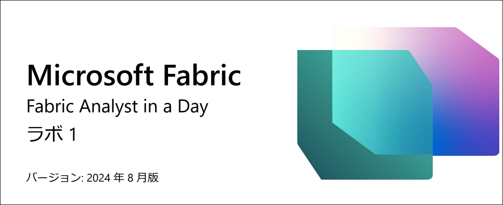

# ​目次

- ドキュメントの構造
- シナリオ / 問題の説明
- Power BI Desktop レポート要

   - タスク1: ラボ環境で Power BI Desktop を設定する
   - タスク 2: Power BI Desktop レポートを分析する
   - タスク 3: Power Query を確認する.
   
- リファレンス

# ドキュメントの構造 

このラボでは、実行する手順だけでなく、視覚的にわかりやすいように、手順に関連するスクリーンショットも提示されます。各スクリーンショットでは、ユーザーが注目する必要のある領域が、オレンジのボックスで強調表示されて示されます。 

**注:** 製品の更新が現在進行中であるため、一部のスクリーンショットは最新の画像ではない場合があ す。 

# シナリオ / 問題の説明 

Fabrikam, Inc. は、ノベルティ商品の卸売業者です。卸売業者である Fabrikam の顧客のほとんどは、個人に再販する会社です。Fabrikam は、専門店、スーパーマーケット、コンピューター販売店、観光名所の店など、アメリカ合衆国全土の小売顧客に販売しています。また、Fabrikam では、Fabrikam に代わって製品の販売促進を行う代理店のネットワークを通じて、他の卸売業者にも販売しています。現在、Fabrikam の顧客はすべてアメリカ合衆国に拠点を置いていますが、同社では他の国や地域への拡大を推進しようと考えています。 

あなたは営業チームのデータ アナリストです。データ セットの収集、クリーンアップ、解釈を行ってビジネス上の問題を解決します。また、チャートやグラフなどの視覚エフェクトを  
まとめたり、レポートを作成したり、それらを組織の意思決定者にプレゼンしたりもします。 

データから貴重な分析情報を引き出すには、さまざまなシステムからデータを取得し、クリーンアップして、まとめてマッシュアップする必要があります。データは次のソースから取得できます。 

- **販売データ:** ERP システムから取得します。データは ADLS Gen2 データベースに格納されます。毎日正午 (午後 0 時) に更新されます。 

- **仕入先データ:** さまざまな仕入先から取得します。データは Snowflake データベースに格納されます。毎日真夜中 (午前 0 時) に更新されます。 

- **顧客データ:** Customer Insights から取得します。データは Dataverse に格納されます。データは常に最新の状態です。 

- **従業員データ:** 人事システムから取得します。エクスポート ファイルとして SharePoint フォルダーに格納されます。毎朝午前 9 時に更新されます。 

  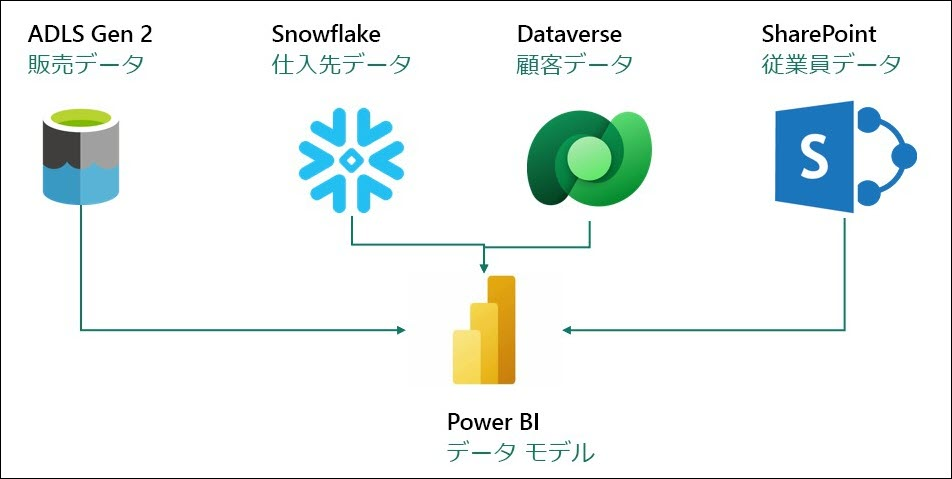

あなたは現在、Power BI Premium で上記のソース システムからデータを取得するデータセットを構築しています。その目的は、自分のレポート作成のニーズを満たし、エンド ユーザーにセルフサービス機能を提供することです。モデルの更新には Power Query を使います。 

# 直面している課題: 

- 各種データ ソースごとに異なる更新時間に対応するには、1 日に少なくとも 3 回はデータセットを更新する必要があります。 

- ソース システムで発生したすべての更新を取得するために毎回完全な更新を行う必要があるため、更新に長い時間がかかります。 

- 取得元のデータ ソースでエラーが発生すると、データセットの更新が中断されます。従業員ファイルが時間どおりにアップロードされず、データセットの更新が中断されてしまうことが何度もあります。 

- データ モデルに変更を加えるのに非常に長い時間がかかります。データ サイズが大きくて変換が複雑だと、Power Query によるプレビューの更新に時間がかかるためです。 

- 社内標準は Mac ですが、Power BI Desktop を使用するには Windows PC が必要です。 

Microsoft Fabric について聞いたあなたは、それを使って課題に対処できるかどうかを見てみることにしました。 

# Power BI Desktop レポートの概要 

Fabric の説明を始める前に、変換とモデルについて理解するために現在の Power BI Desktop のレポートを見てみましょう。 

## タスク1: ラボ環境で Power BI Desktop を設定する 

1. お使いのラボ環境の**デスクトップ**にある 
   **Reports** フォルダー内の **FAIAD.pbix** 
   を開きます。Power BI Desktop でファイルが開かれます。 

   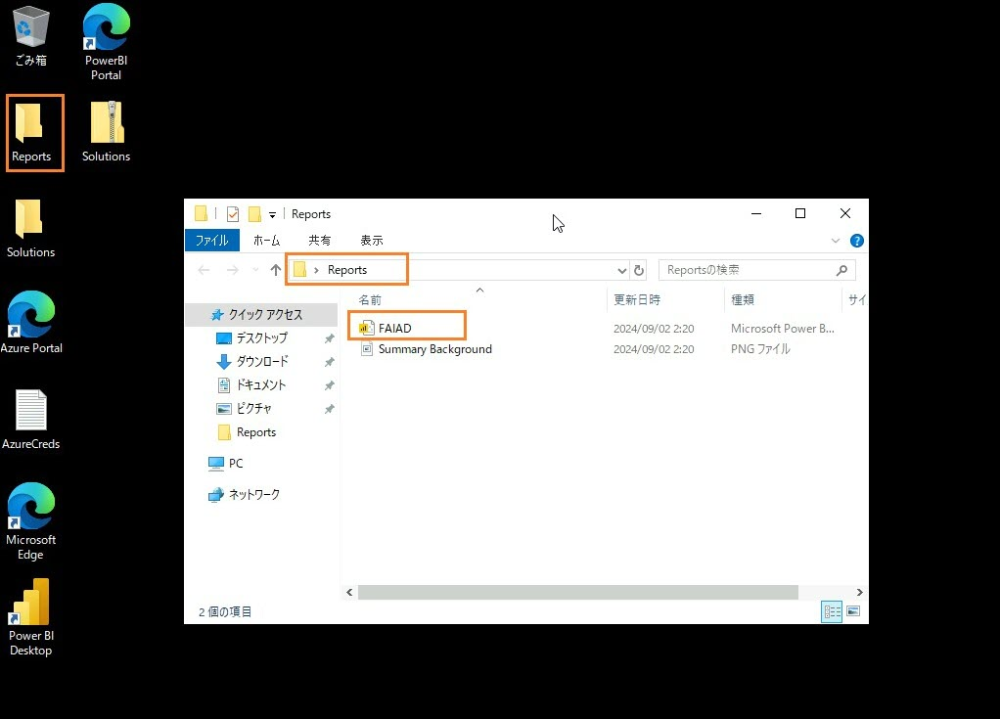

2. [メール アドレスの入力] ダイアログが開きます。ラボ環境の右パネルにある**環境の詳細**タブに移動します。 

3. **ユーザー名**をコピーし、ダイアログの [電子メール] テキストボックスに貼り付けます。 

4. **続行**を選択します。 
   
    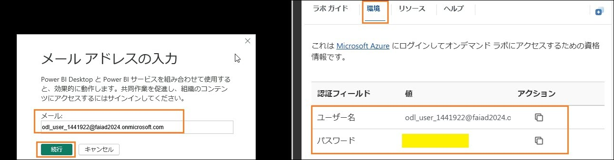
 
5. [サインイン] ダイアログが開きます。**ユーザー名を環境の詳細**タブからコピーしてもう一度入力します。 

6. **次へ**を選択します。 

7. 次のダイアログで、**パスワードの資格情報を環境の詳細**タブからコピーして入力します。 

8. **サインイン**を選択します。
 
   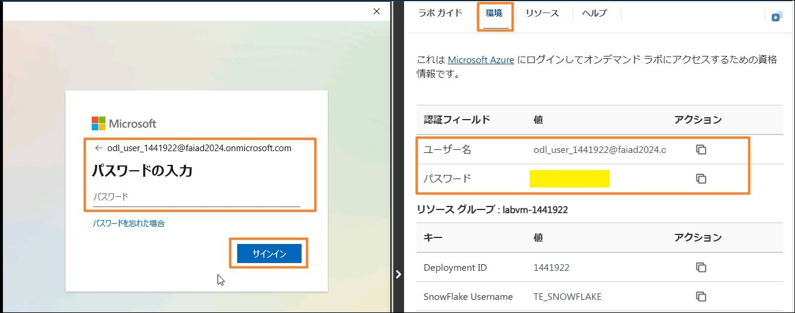

9. **すべてのアプリのサインイン状態を維持する**ダイアログが開きます。**OK** を選択します。

   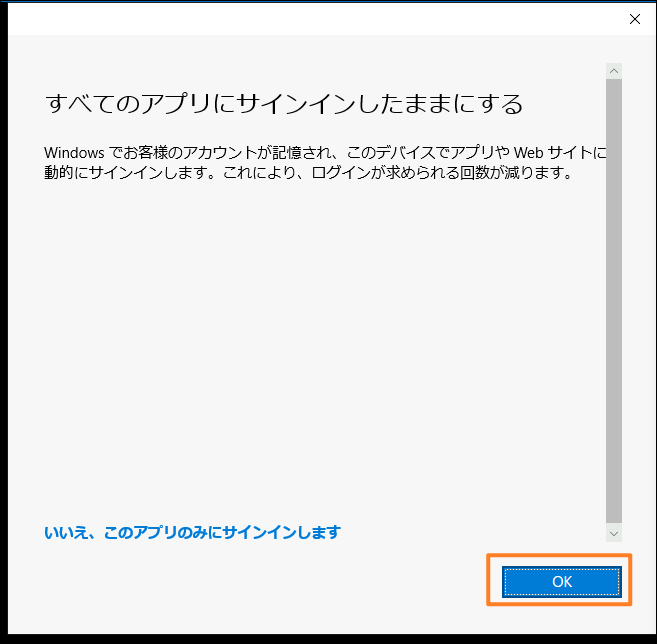
 
10. **準備が完了しました**ダイアログが開きます。**完了**を選択します。これで Power BI Desktop が開きます。 

 

## タスク 2: Power BI Desktop レポートを分析する 

以下のレポートでは、Fabrikam の売上を分析しています。ページの左上に KPI が一覧表示されています。残りのビジュアルは、担当地域、製品グループ、リセラー会社ごとの時系列に沿った売上を強調しています。 

   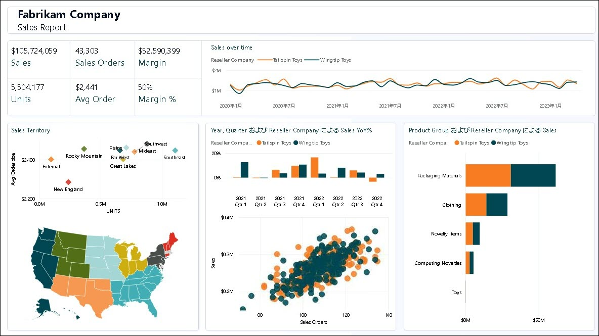

**注:** このトレーニングでは、Fabric で利用できるツールを使ったデータの取得、変換、モデリングに焦点を当てています。レポートの作成やナビゲーションには焦点を当てません。 
数分かけてレポートを理解してから、次のステップに進みましょう。 

1. 営業担当地域別にデータを分析してみましょう。**Sales Territory の New England** (散布図) ビジュアルを選択します。売上の推移からわかるように、New England ではリセラー Tailspin Toys が Wingtip Toys よりも多くの売上をあげています。Sales YoY% の縦棒グラフを見ると、過去 1 年間の Wingtip Toys の売上成長率が低く、四半期ごとに減少していることがわかります。第 3 四半期で少し回復したものの、第 4 四半期で再び下がりました。 

   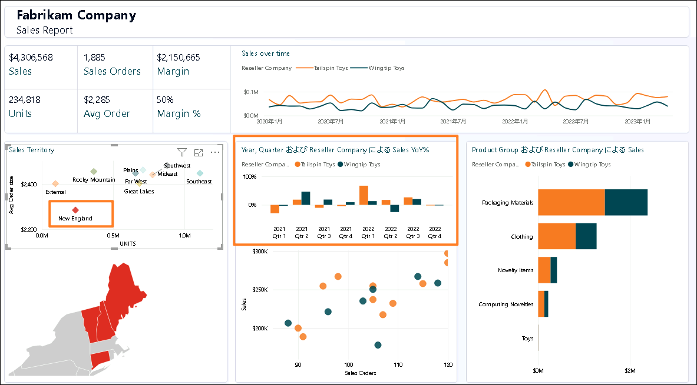

2. これを Rocky Mountain の担当地域と比較してみましょう。**Sales Territory の Rocky Mountain** (散布図) ビジュアルを選択します。Sales YoY% の縦棒グラフを見ると、Wingtip Toys の売上は、2 回の四半期で低かった後 2022 年の第 4 四半期で急激に増えていることがわかります。 
    
    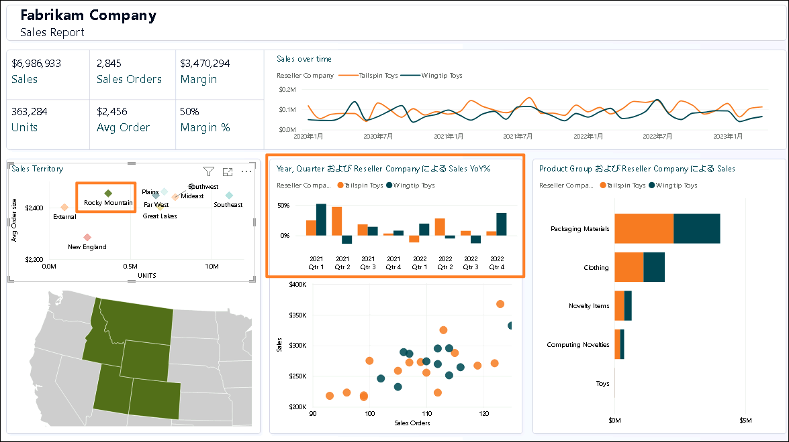

3. **Sales Territory の Rocky Mountain** を選択して、フィルターを外します。 
   

4. 画面の下部中央にある散布図ビジュアル (Sales 別の Sales Orders) から、右上の外れ値を選択します (第 4 象限)。Margin % は 52% であり、平均の 50% を上回っていることがわかります。また、2023 年の最後 2 回の四半期では、Sales YoY% が増加しています。 

    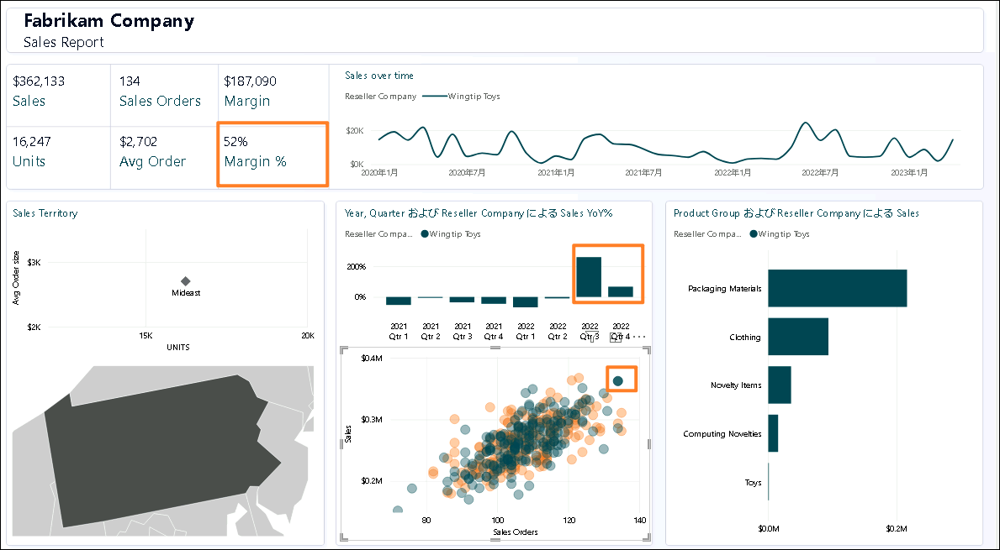

5. 散布図ビジュアルで外れ値のリセラーを選択して、**フィルターを外します。** 

6. 製品グループとリセラー別に製品の詳細を取得してみましょう。製品グループおよびリセラー会社ごとの売上の横棒グラフのビジュアルから、**Tailspin Toys の Packaging Materials バーを右クリック**し、ダイアログから**ドリルスルー -> 製品の詳細**を選択します。 

    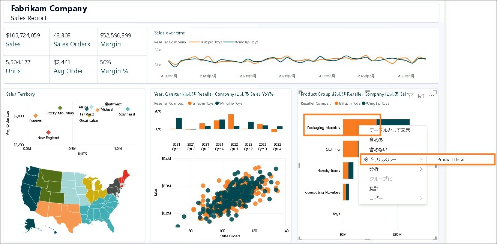

   製品の詳細を提供するページに移動します。今後の注文もいくつかあることがわかります。 

7. このページの確認が完了したら、ページの右上にある Ctrl + 戻る矢印をクリックして売上レポートに戻ります。 

    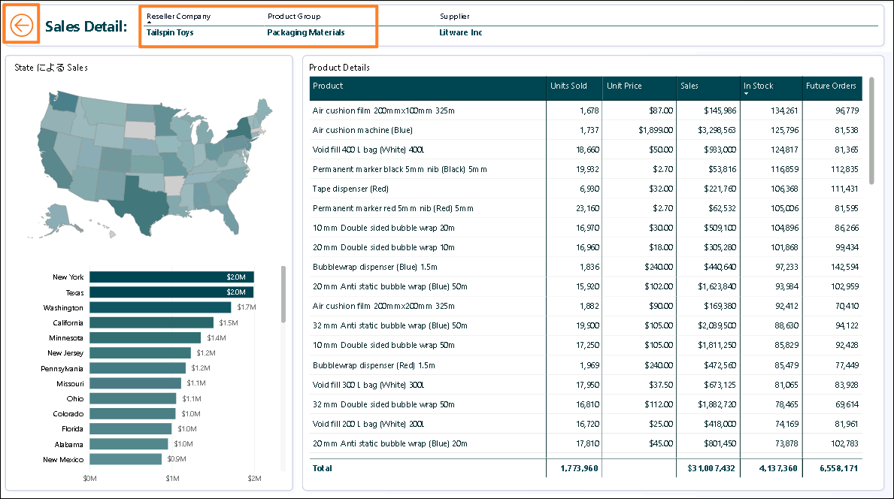

8. 自由にレポートをさらに分析してみてください。準備ができたら、モデル ビューを見てみましょう。左パネルで、**モデル ビュー アイコン**を選択します。Sales と PO という 2 つのファクト テーブルがあることがわかります。 

    a. Sales データの粒度は、Date、Reseller、Product、People によって提供されています。Date、Reseller、Product、People が Sales につながっています。 

    b. PO データの粒度は、Date、Product、People によって提供されています。Date、Product、People が PO につながっています。 

    c. Product ごとの Supplier データがあります。Supplier は Product につながってい 
    ます。 

    d. Geo による Reseller の場所データがあります。Geo は Reseller につながってい 
    ます。 

    e. Reseller ごとの Customer 情報があります。Customer は Reseller につながってい 
    ます。 

 

## タスク 3: Power Query を確認する 

1. Power Query を調べてデータ ソースについて理解しましょう。リボンから**ホーム -> データの変換**を選択します。 

   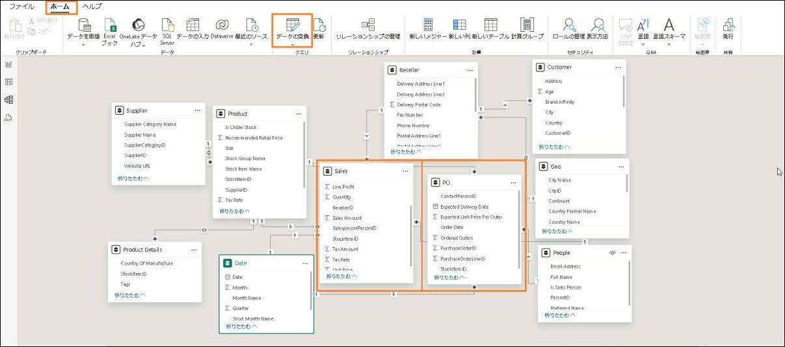

2. Power Query ウィンドウが開きます。リボンから**ホーム -> データ ソース設定**を選択します。[データ ソース設定] ダイアログが開きます。一覧をスクロールしていくと、問題の説明で述べたように 4 つのデータ ソースがあることがわかります。 

    a Snowflake 

    b SharePoint 

    c ADLS Gen2 

    d Dataverse 

3. **閉じる**を選択して [データ ソース設定] ダイアログを閉じます。 
 
    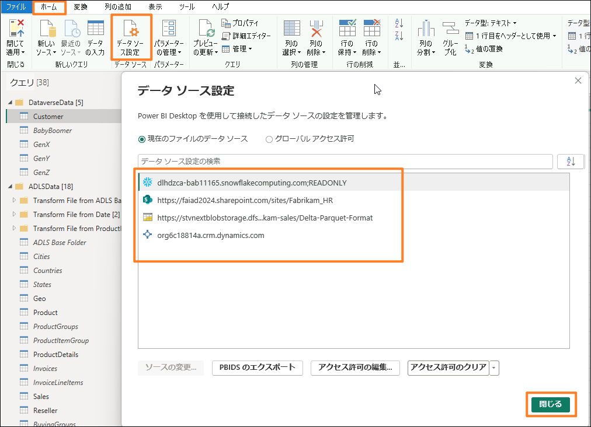
 
4. 左側の [クエリ] パネルでは、各クエリがデータ ソースごとにグループ化されていることがわかります。 

5. **DataverseData** フォルダーには、BabyBoomer、GenX、GenY、GenZ という 4 つの異なるクエリで使用できる Customer データが含まれています。これら 4 つのクエリをアペンドして、Customer クエリを作成します。 

6. Dataverse データ ソースの資格情報を入力するには、**環境変数**タブ ([ラボ ガイド] の隣) で確認できる**ユーザー名とパスワード**を入力します。Microsoft アカウントのオプションを選択してください。 

   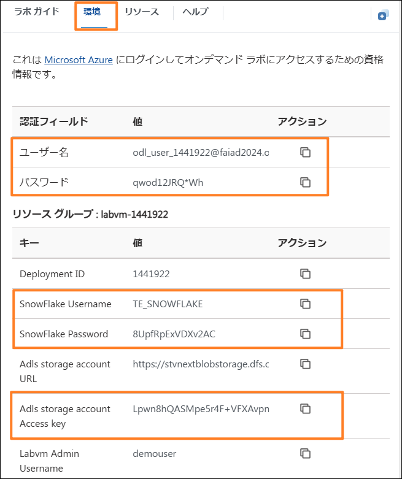

7. ADLS データ ソースの場合は、**アカウント キー** オプションを使用し、**環境変数**タブ ([ラボ ガイド] の隣) で確認できる **ADLS ストレージ アカウントのアクセス キー**を入力します。 

8. **ADLSData** フォルダーには複数のディメンション (Geo、Product、Reseller、Date) があることがわかります。Sales ファクトもあります。 

    a. **Geo ディメンション**は、Cities、Countries、States の各クエリからのデータをマージすることで作成されます。 

    b. **Product ディメンション**は、Product Groups と Product Item Group のクエリからのデータをマージすることで作成されます。 

    c. **Reseller ディメンション**は、BuyingGroup クエリを使ってフィルター処理されます。 

    d. **Sales ファクト**は、InvoiceLineItems と Invoice のクエリをマージすることで作成されます。 

9. Snowflake データ ソースの場合は、**環境変数**タブ ([ラボ ガイド] の隣) で確認できる **Snowflake ユーザー名**と **Snowflake パスワード**を使用します。 

10. **SnowflakeData** フォルダーには、Supplier ディメンションと PO (Order / Spend) ファクトが含まれていることがわかります。 

    a. Supplier ディメンションは、Suppliers クエリと SupplierCategories クエリをマージすることで作成されます。 

    b. PO ファクトは、PO と PO Line Items のクエリをマージすることで作成されます。 

11. SharePoint データ ソースの場合は、**環境変数**タブ ([ラボ ガイド] の隣) で確認できる 
**ユーザー名とパスワード**を入力します。Microsoft アカウントのオプションを選択してください。 

12. **SharepointData** フォルダーには People ディメンションが含まれていることがわかります。 

    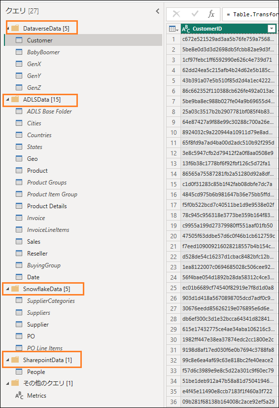

    これで、私たちが何を扱っているかがわかりました。以降のラボでは、Dataflow Gen2 を使って同様の Power Query を作成し、Lakehouse を使ってモデルを作成します。 

# リファレンス

Fabric Analyst in a Day (FAIAD) では、Microsoft Fabric で使用できる主要な機能の一部をご紹介します。サービスのメニューにあるヘルプ (?) セクションには、いくつかの優れたリソースへのリンクがあります。

 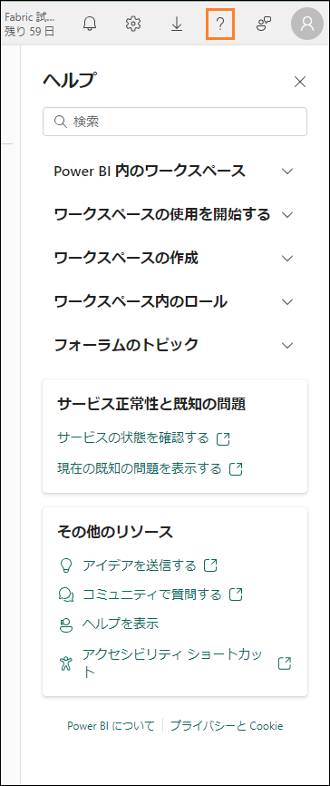 

Microsoft Fabric の次のステップに役立つリソースをいくつか以下に紹介します。

- ブログ記事で [Microsoft-Fabric-のGA-に関するお知らせ](https://aka.ms/Fabric-Hero-Blog-Ignite23) の全文を確認する
- [ガイド付きツアー](https://aka.ms/Fabric-GuidedTour) を通じて Fabric を探索する
- [Microsoft Fabric の無料試用版](https://www.microsoft.com/en-us/microsoft-fabric/getting-started) にサインアップする
- [Microsoft Fabric のWeb サイト](https://www.microsoft.com/en-in/microsoft-fabric) にアクセスする
- [Fabric の学習モジュール](https://learn.microsoft.com/en-us/training/browse/?products=fabric&resource_type=module)で新しいスキルを学ぶ
- [Fabric の技術ドキュメント](https://learn.microsoft.com/en-us/fabric/) を参照する
- [Fabric 入門編の無料のe-book](https://info.microsoft.com/ww-landing-unlocking-transformative-data-value-with-microsoft-fabric.html) を読む
- [Fabric コミュニティ](https://community.fabric.microsoft.com/)に参加し、質問の投稿やフィードバックの共有を行い、他のユーザーから学びを得る

より詳しい Fabric  エクスペリエンスのお知らせに関するブログを参照してください。

- [Fabric の Data Factory エクスペリエンスに関するブログ](https://blog.fabric.microsoft.com/en-us/blog/introducing-data-factory-in-microsoft-fabric/)
- [Fabric のSynapse Data Engineering エクスペリエンスに関するブログ](https://blog.fabric.microsoft.com/en-us/blog/introducing-synapse-data-engineering-in-microsoft-fabric/)
- [Fabric のSynapse Data Science エクスペリエンスに関するブログ](https://blog.fabric.microsoft.com/en-us/blog/introducing-synapse-data-science-in-microsoft-fabric/)
- [Fabric のSynapse Data Warehousing エクスペリエンスに関するブログ](https://blog.fabric.microsoft.com/en-us/blog/introducing-synapse-data-warehouse-in-microsoft-fabric/)
- [Fabric のSynapse Real-Time Analytics エクスペリエンスに関するブログ](https://blog.fabric.microsoft.com/en-us/blog/sense-analyze-and-generate-insights-with-synapse-real-time-analytics-in-microsoft-fabric/)
- [Power BI のお知らせに関するブログ](https://powerbi.microsoft.com/en-us/blog/empower-power-bi-users-with-microsoft-fabric-and-copilot/)
- [Fabric の Data Activator エクスペリエンスに関するブログ](https://blog.fabric.microsoft.com/en-us/blog/driving-actions-from-your-data-with-data-activator/)
- [Fabric の管理とガバナンスに関するブログ](https://blog.fabric.microsoft.com/en-us/blog/administration-security-and-governance-in-microsoft-fabric/)
- [Fabric の OneLake に関するブログ](https://blog.fabric.microsoft.com/en-us/blog/microsoft-onelake-in-fabric-the-onedrive-for-data/) 
- [Dataverse とMicrosof t Fabric の統合に関するブログ](https://cloudblogs.microsoft.com/dynamics365/it/2023/05/24/new-dataverse-enhancements-and-ai-powered-productivity-with-microsoft-365-copilot/)

© 2023 Microsoft Corporation. All rights reserved.

このデモ/ラボを使用すると、次の条件に同意したことになります。

このデモ/ラボで説明するテクノロジまたは機能は、ユーザーのフィードバックを取得 し、学習エクスペリエンスを提供するために、Microsoft Corporation によって提供されます。ユーザーは、このようなテクノロジおよび機能を評価し、Microsoft にフィードバックを提供するためにのみデモ/ラボを使用できます。それ以外の目的には使用できませ ん。このデモ/ラボまたはその一部を、変更、コピー、配布、送信、表示、実行、再現、 発行、ライセンス、著作物の作成、転送、または販売することはできません。 

複製または再頒布のために他のサーバーまたは場所にデモ/ラボ (またはその一部) をコピーまたは複製することは明示的に禁止されています。
 
このデモ/ラボは、前に説明した目的のために複雑なセットアップまたはインストールを 必要としないシミュレーション環境で潜在的な新機能や概念などの特定のソフトウェアテクノロジ/製品の機能を提供します。
このデモ/ラボで表されるテクノロジ/概念は、フル機能を表していない可能性があり、最終バージョンと動作が異なることがあります。また、そのような機能や概念の最終版がリリースされない場合があります。物理環境でこのような機能を使用するエクスペリエンスが異なる場合もあります。 

**フィードバック**。このデモ/ラボで説明されているテクノロジ、機能、概念に関する フィードバックをMicrosoft に提供する場合、ユーザーは任意の方法および目的でユー
ザーのフィードバックを使用、共有、および商品化する権利を無償で Microsoft に提供するものとします。また、ユーザーは、フィードバックを含む Microsoft のソフトウェアまたはサービスの特定部分を使用したり特定部分とインターフェイスを持ったりする製 品、テクノロジ、サービスに必要な特許権を無償でサード パーティに付与します。ユーザーは、フィードバックを含めるために Microsoft がサード パーティにソフトウェアま たはドキュメントをライセンスする必要があるライセンスの対象となるフィードバックを提供しません。これらの権限は、本契約の後も存続します。 

Microsoft Corporation は、明示、黙示、または法律上にかかわらず、商品性のすべての保証および条件、特定の目的、タイトル、非侵害に対する適合性など、デモ/ラボに関する すべての保証および条件を拒否します。Microsoft は、デモ/ラボから派生する結果、出力の正確さ、任意の目的に対するデモ/ラボに含まれる情報の適合性に関して、いかなる 保証または表明もしません。

**免責事項**

このデモ/ラボには、Microsoft Power BI の新機能と機能強化の一部のみが含まれています。一部の機能は、製品の将来のリリースで変更される可能性があります。このデモ/ラ ボでは、新機能のすべてではなく一部について学習します。