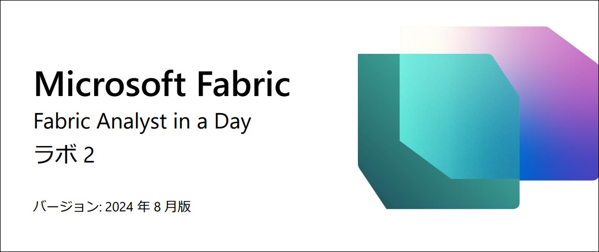

## ​目次	
概要

Fabric ライセンス

- タスク 1: Microsoft Fabric 試用版ライセンスを有効にる

Fabric のエクスペリエンスの概要
- タスク 2: Data Factory のエクスペリエンス
- タスク 3: Data Activator のエクスペリエンス
- タスク 4: Industry Solutions のエクスペリエンス
- タスク 5: Real-Time Intelligence エクスペリエンス	
- タスク 6: Synapse Data Engineering エクスペリエンス
- タスク 7: Synapse Data Science エクスペリエンス
- タスク 8: Synapse Data Warehouse エクスペリエンス

Fabric ワークスペース
- タスク 9: Fabric ワークスペースを作成する
- タスク 10: レイクハウスを作成する

リファレンス
 

## 概要 

今日は、Microsoft Fabric のさまざまな主要機能について学習します。この入門ワークショップでは、Fabric で利用できる製品のさまざまなエクスペリエンスやアイテムを紹介します。このワークショップを終了すると、レイクハウス、Dataflow Gen2、データ パイプライン、DirectLake などの使い方がわかります。 

このラボを終了すると、次のことが学べます。 

- Fabric ワークスペースの作成方法 
- Lakehouse の作成方法 

## Fabric ライセンス 

#### タスク 1: Microsoft Fabric 試用版ライセンスを有効にする 

1. **ブラウザー**を開いて、https://app.powerbi.com/ に移動します。ログイン ページが表示されます。 

 **注:** ラボ環境を使用しておらず、Power BI アカウントを既にお持ちの場合は、ブラウザーをプライベート モードやシークレット モードで使用することをお勧めします。 

2. **環境変数**タブ ([ラボ ガイド] タブの横) で確認できる**ユーザー名を電子メール**として入力して、**Submit** をクリックします。 

	 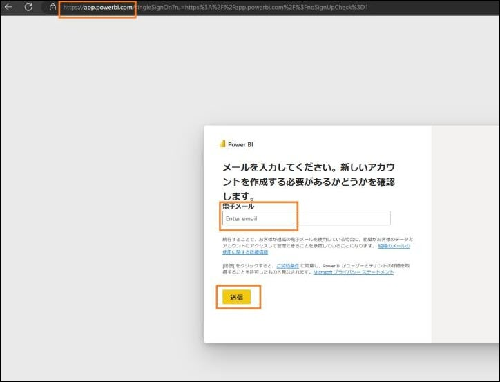

3. **パスワード**画面が表示されます。**環境変数**タブ ([ラボ ガイド] タブの横) で確認できる、講師から提供された**パスワード**を入力します。 

4. **Sign in** をクリックし、プロンプトに従って Fabric にサインインします。 
     
     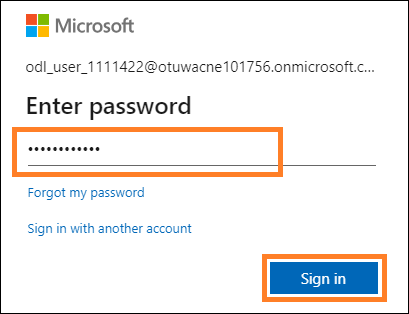

5. 見慣れた **Power BI サービスのホーム ページ**が表示されます。 

6. このラボは、Power BI サービスのレイアウトに精通していることを前提に進めます。不明な点がある場合は、講師に遠慮なく質問してください。 

現在、**マイ ワークスペース**が表示されています。Fabric のアイテムを操作するには、試用版ライセンスが必要になります。また、ワークスペースに Fabric ライセンスが割り当てられている必要があります。設定を始めましょう。 

7. 画面右上の**ユーザー アイコン**を選択します。 

8. **無料試用版**を選択します。 

    

9. [Microsoft Fabric の無料試用版へのアップグレード] ダイアログが開きます。**無料体験する**を選択します。 

    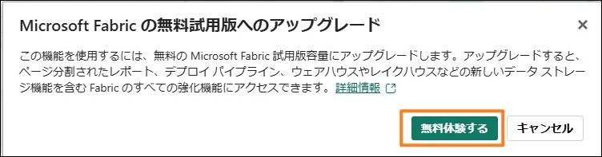

10. Microsoft Fabric に正常にアップグレードされたことを示すダイアログが開きます。**Fabric Home Page** を選択します。 
  
     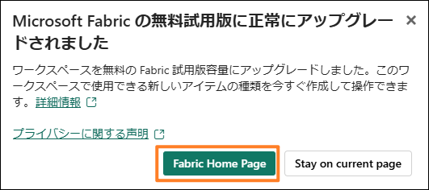

11.**Microsoft Fabric のホーム ページ**が開きます。 

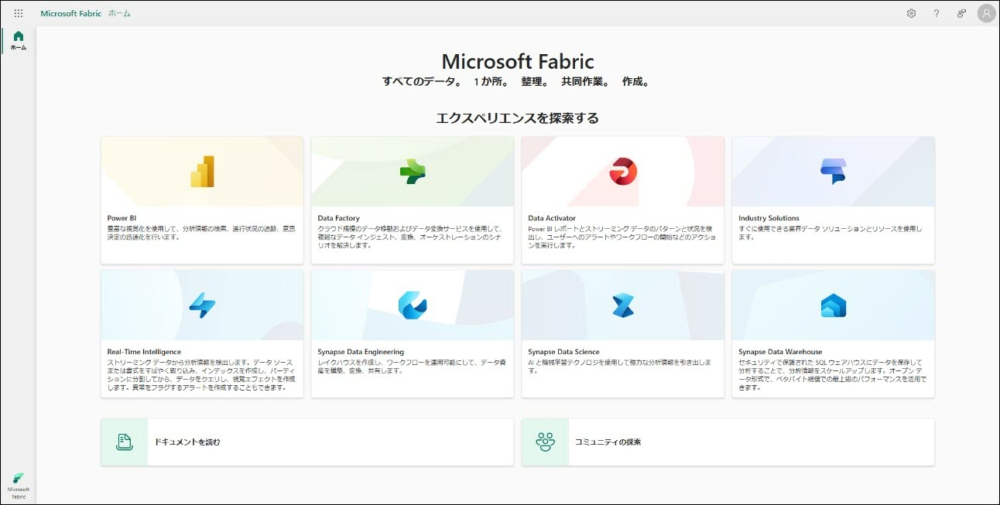

## Fabric のエクスペリエンスの概要 

#### タスク 2: Data Factory のエクスペリエンス 

1. 画面左下の **Microsoft Fabric** (Fabric エクスペリエンス セレクター) アイコンを選択します。ダイアログが開き、Fabric のエクスペリエンスの一覧が表示されます。Power BI、Data Factory、Data Activator、Industry Solutions、および Real-Time Intelligence は独立したエクスペリエンスであることに注意してください。Data Engineering、Data Science、Data Warehouse は Synapse のエクスペリエンスであり、これら 4 つのエクスペリエンスは Synapse を利用します。詳しく見て行きましょう。 

2. **Data Factory** を選択します。 
   
   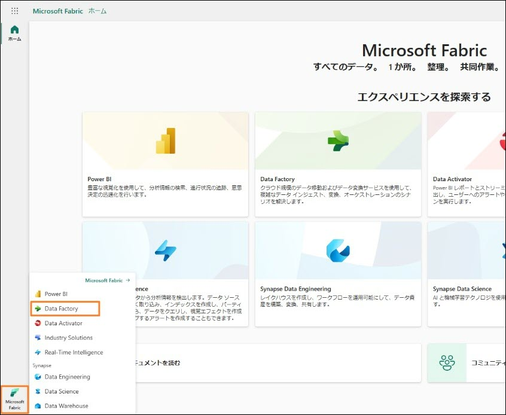

3. **Data Factory のホーム ペ**ージが表示されます。このページは 3 つのメイン セクションに分かれています。 

    a. **推奨:** Data Factory で利用できるアイテムの一覧 (Dataflow Gen2、データ パイプライン、データ ワークフロー、および GraphQL 用 API) が表示されます。 

    - Dataflow Gen2 とは、次世代の Dataflow のことです。 

    - データ パイプラインはデータのオーケストレーションに使用されます。 

    - データ ワークフローはワークフロー オーケストレーション マネージャーです。 

    - GraphQL 用 API は、複数のデータ ソースに対してクエリを実行する API です。 

    b. **詳細情報:** このセクションからクイック スタート学習ドキュメントにアクセスできます。 

    c. **Quick access:** このセクションには、最近使用したアイテムやお気に入りのアイテムの一覧が表示されます。 

     

#### タスク 3: Data Activator のエクスペリエンス 

1. 画面の左下にある **Fabric エクスペリエンス セレクター アイコン** (現在は Data Factory に設定されています) を選択します。Fabric エクスペリエンスのダイアログが開きます。 

   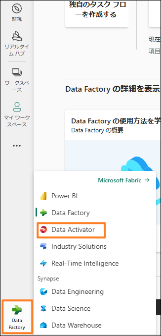

2. ダイアログで **Data Activator** を選択します。**Data Activator のホーム ページ**が表示されます。Data Activator は、変化するデータからパターンや条件が検出されたときに自動的にアクションを実行する、Microsoft Fabric のノーコード エクスペリエンスです。3 つのセクションは Data Factory のエクスペリエンスと似ています。推奨セクションには次のアイテムがあります。 

    a. **Reflex:** データセット、クエリ、イベント ストリームのパターンを監視するために使用されます。 

    b.**Reflex サンプル:** サンプル ソリューション。 

    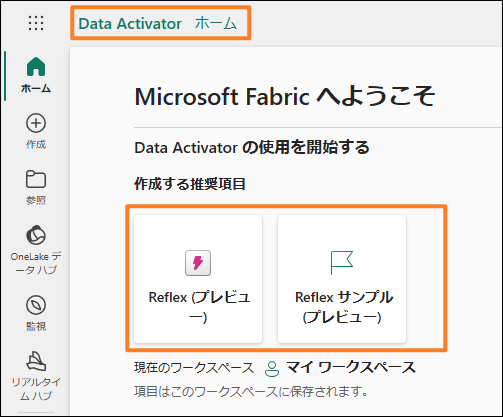

#### タスク 4: Industry Solutions のエクスペリエンス 

1. 画面の左下にある **Fabric エクスペリエンス セレクター アイコン** (現在は Data Activator に設定されています) を選択します。Fabric エクスペリエンスのダイアログが開きます。 

2. ダイアログで **Industry Solutions** を選択します。**Industry Solutions** ホーム ページが表示されます。Microsoft Fabric は業界に特化したデータ ソリューションを提供し、その堅牢なプラットフォームはデータ管理、分析、意思決定に役立ちます。これらのデータ ソリューションを利用すると、さまざまな業界が直面する特有の課題に対処して企業の業務を最適化し、さまざまなソースのデータを統合して効果的に分析できます。3 つのセクションはこれまでのエクスペリエンスと似ていることに注意してください。[推奨] セクションには次のアイテムがあります。 

    a. **持続可能性ソリューション:** 環境、社会、ガバナンス (ESG) に関するデータの、 
        取り込み、標準化、分析をサポートします。 

    b. **小売ソリューション:** 膨大なデータの管理、さまざまなソースのデータ統合、意思決定を加速させるリアルタイム分析の提供に役立ちます。小売業者は、在庫の最適化、顧客のセグメント化、売上予測、動的な価格、不正の検出に、これらのソリューションを使用できます。 

    c. Healthcare ソリューション: 医療データを分析に適した形式に効率的に変換するという重要なニーズに対処し、顧客が価値を実現するまでの時間を短縮するように戦略的に設計されています。 

   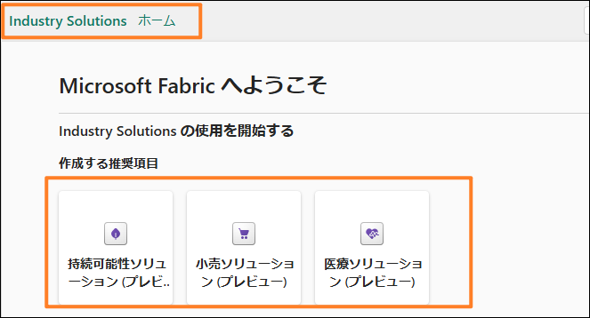

#### タスク 5: Real-Time Intelligence エクスペリエンス 

1. 画面の左下にある **Fabric エクスペリエンス セレクター アイコン** (現在は Industry Solutions に設定されています) を選択します。Fabric エクスペリエンスのダイアログが開きます。 

2. **Real-Time Intelligence** を選択します。**Real-Time Intelligence ホーム ページ**が表示されます。ここも 3 つのセクションに分かれています。[推奨] セクションには次のアイテムがあります。 

    a. **Eventhouse:** データベースのワークスペースを作成するために使用されます。これはプロジェクト間で共有できます。 

    b. **KQL クエリセット:** データに対してクエリを実行し、共有可能なテーブルとビジュアルを生成するために使用されます。 

    c. **リアルタイム ダッシュボード:** データ インジェストから数秒以内にリアルタイム ダッシュボードを視覚化するために使用されます。 

    d. **Eventstream:** リアルタイム イベント ストリームのキャプチャ、変換、ルーティングに使用されます。 

    e. **Reflex:** データセット、クエリ、イベント ストリームのパターンを監視するために使用されます。 

    f. **サンプルを使用する:** サンプル ソリューション。 

    **注:** Reflex は、Data Activator エクスペリエンスでも利用できます。 

    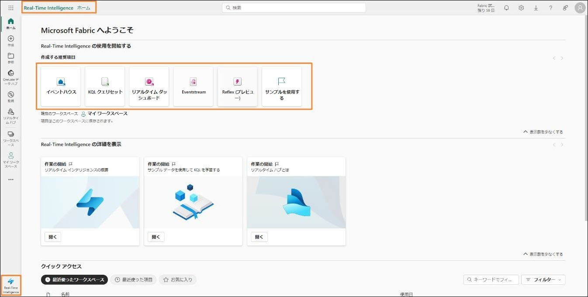

#### タスク 6: Synapse Data Engineering エクスペリエンス 

1. 画面の左下にある Fabric **エクスペリエンス セレクター アイコン** (現在は Real-Time Intelligence に設定されています) を選択します。Fabric エクスペリエンスのダイアログが開きます。 

2. **Data Engineering** を選択します。**Data Engineering のホーム ページ**が表示されます。このページも 3 つのメイン セクションに分かれています。[推奨] セクションには次のアイテムがあります。 

    a. **Lakehouse:** クリーニング、クエリ実行、レポート作成、共有対象のビッグ データを格納するために使用されます。 

    b. **Notebook:** Python、R、Scala などのさまざまな言語を使用した、データの取り込み、準備、分析、その他のデータ関連タスクに使用されます。 

    c. **Environment:** 共有ライブラリ、Spark コンピューティングの設定、ノートブックと Spark ジョブ定義のリソースを設定するために使用されます。 

    d. **Spark Job Definition:** Apache ジョブの定義、スケジュール、管理に使用されます。 

    e. **Data pipeline:** データ ソリューションのオーケストレーションに使用されます。 

    f. **GraphQL 用 API:** 複数のデータ ソースに対してクエリを実行する API です。 

    g. **Import notebook:** ローカル マシンからノートブックをインポートするために使用されます。 

    h. **Use a sample:** サンプル ソリューション。 

    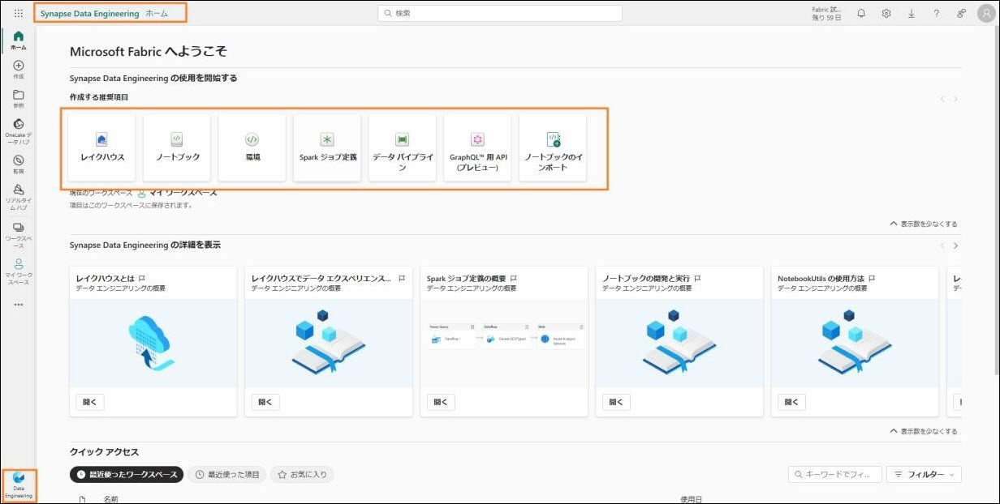

#### タスク 7: Synapse Data Science エクスペリエンス 

1. 画面の左下にある **Fabric エクスペリエンス セレクター アイコン** (現在は Data Engineering に設定されています) を選択します。Fabric エクスペリエンスのダイアログが開きます。 

2. **Data Science** を選択します。**Data Science のホーム ページ**が表示されます。ここも 3 つのセクションに分かれています。[推奨] セクションには次のアイテムがあります。 

    a. **ML model:** 機械学習モデルの作成に使用されます。 

    b. **Experiment:** 複数のモデルの作成、実行、開発の追跡に使用されます。 

    c. **Notebook:** データを調査し、機械学習ソリューションを構築するために使用されます。 

    d. **Environment:** 共有ライブラリ、Spark コンピューティングの設定、ノートブックと Spark ジョブ定義のリソースを設定するために使用されます。 

    e. **AI スキル:** 独自の生成 AI エクスペリエンスを構築するために使用されます。 

    f. **Import notebook:** ローカル マシンからノートブックをインポートするために使用されます。 

    g. **Use a sample:** サンプル ソリューション。 

**注:** ノートブック、環境、データ パイプラインなどのアイテムは、これらの各エクスペリエンスで関連しているので、複数のエクスペリエンスで使用できます。 

  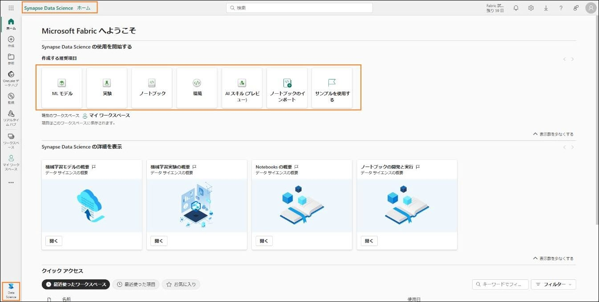

#### タスク 8: Synapse Data Warehouse エクスペリエンス 

1. 画面の左下にある **Fabric エクスペリエンス セレクター アイコン** (現在は Data Science に設定されています) を選択します。Fabric エクスペリエンスのダイアログが開きます。 

2. **Data Warehouse** を選択します。**Data Warehouse のホーム ページ**が表示されます。ここも 3 つのセクションに分かれています。[新規] セクションには次のアイテムがあります。 

    a. **ウェアハウス:** Data Warehouse の作成に使用されます。 

    b. **データ パイプライン:** データ ソリューションのオーケストレーションに使用されます。 

    c. **ミラーリングされる SQL Database:** Azure SQL Database をミラーリングするために使用されます。 

    d. **ミラーリングされる Snowflake:** Snowflake データベースをミラーリングするために使用されます。 

    e. **ミラーリングされる Azure Cosmos DB:** Azure Cosmos DB をミラーリングするために使用されます。 

    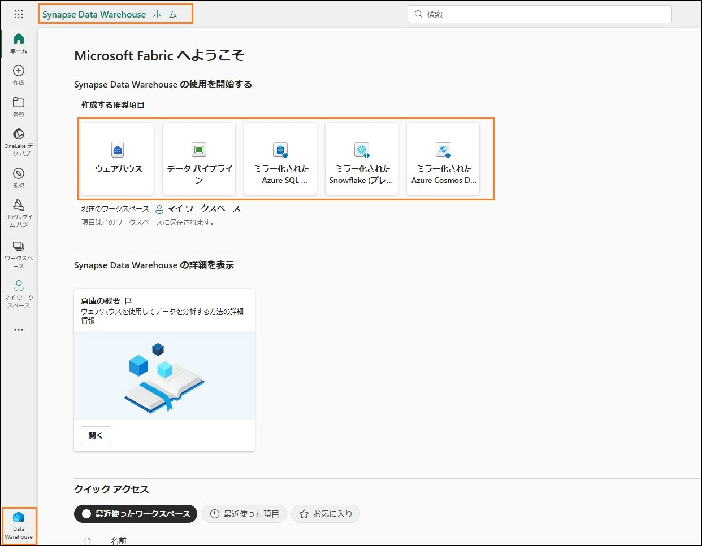

## Fabric ワークスペース 

#### タスク 9: Fabric ワークスペースを作成する 

1. 次は、Fabric ライセンスを使用してワークスペースを作成しましょう。左ナビゲーション バーから**ワークスペース**を選択します。ダイアログが開きます。 

2. **新しいワークスペース**を選択します。 

   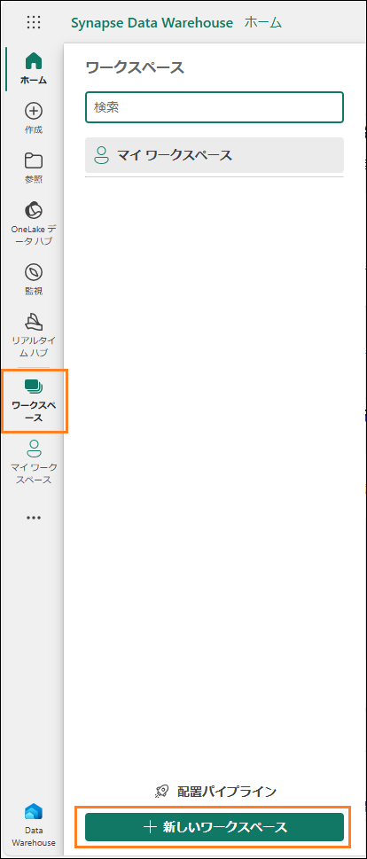

3. **ワークスペースの作成**ダイアログがブラウザーの右側に開きます。 

4. **名前**フィールドに **FAIAD_<ユーザー名>** と入力します。 

   **注:** ワークスペース名は一意である必要があります。ただし、自分のワークスペース名は異なるものにする必要があります。[名前] フィールドの下に、**この名前は使用できます**という緑色のチェック マークが表示されていることを確認してください。 

5. 必要に応じて、ワークスペースの**説明**を入力できます。このフィールドはオプション 
です。 

6. **詳細**をクリックしてセクションを展開します。 

    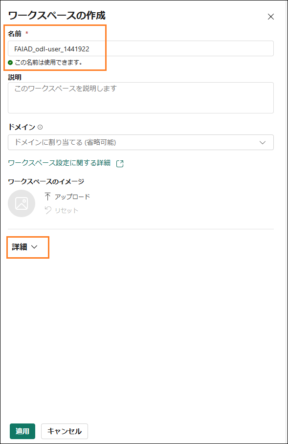

7. **License mode** で、**Trial** が選択されていることを確認します (既定で選択されています)。 

8. **Apply** を選択して新しいワークスペースを作成します。  

    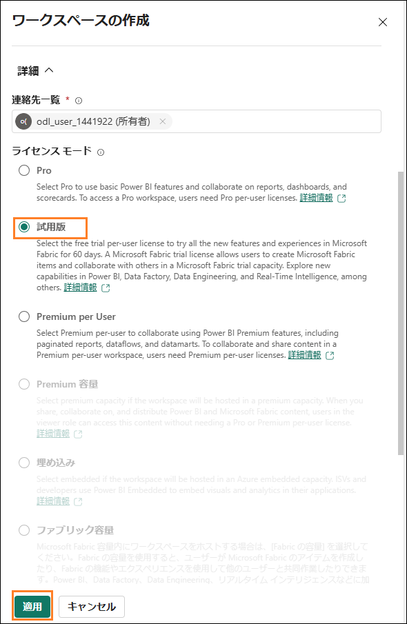

   新しくワークスペースが作成され、そのワークスペースが表示されます。さまざまなデータ ソースからレイクハウスにデータを取り込み、そのレイクハウスからのデータを使用してモデルを構築し、レポートを作成します。最初のステップでは、レイクハウスを作成します。 

### タスク 10: レイクハウスを作成する 

1. 画面の左下にある **Fabric エクスペリエンス セレクター アイコン** (現在は Data Warehouse に設定されています) を選択します。Fabric エクスペリエンスのダイアログが開きます。 

2. **Data Engineering** を選択すると、Data Engineering のホーム ページが表示されます。 
 
    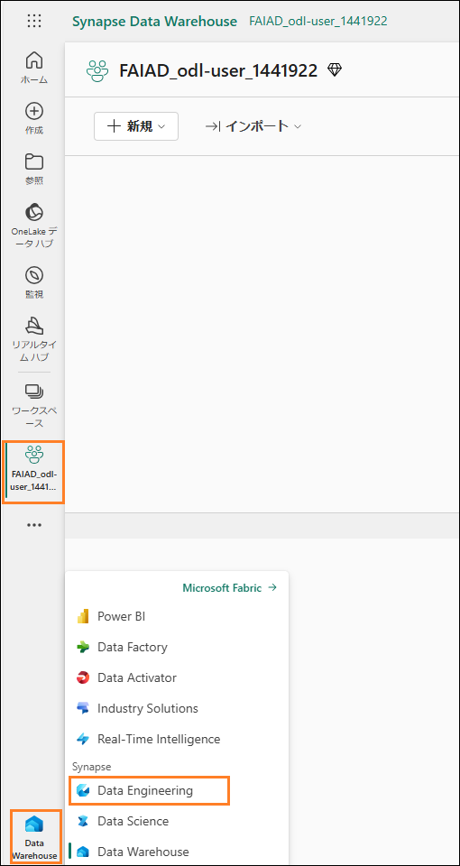
  
3. **レイクハウス**を選択します。 
    
    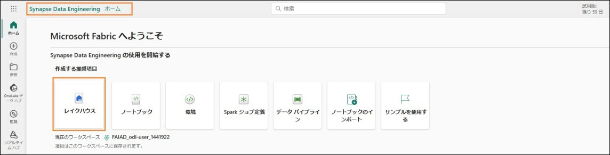
    
4. [New lakehouse] ダイアログが開きます。[Name] テキストボックスに **lh_FAIAD** と入力します。 

   **注:** ここでの lh は Lakehouse を指します。識別と検索を容易にするために、接頭辞として lh を付けています。 

5. **Create** を選択します。 

   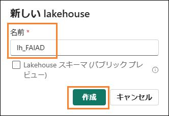

しばらくすると Lakehouse が作成され、Lakehouse のインターフェイスが表示されます。**左パネル**の自分のワークスペースの下に Lakehouse のアイコンが表示されます。このアイコンをクリックすると、いつでも簡単にその Lakehouse に移動できます。 

Lakehouse エクスプローラーには **Tables** と **Files** があります。レイクハウスで [Files] セクションの下に Azure Data Lake Storage Gen2 のファイルを公開することも、データフローでデータを Lakehouse の [Tables] に読み込むこともできます。さまざまなオプションを利用できます。以降のラボでそのオプションをいくつか紹介します。 
  
   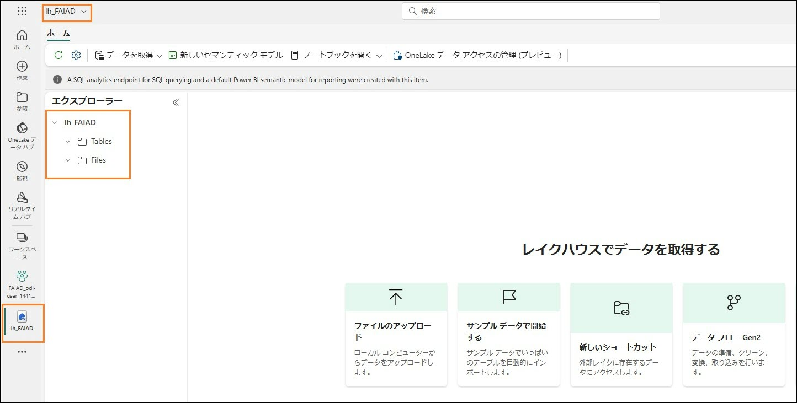

このラボでは、Fabric インターフェイスの中を探索し、Fabric ワークスペースと Lakehouse を作成しました。次のラボでは、レイクハウスでショートカットを使用して ADLS Gen2 データに接続する方法、およびビューを使用してこのデータを変換する方法を学習します。 

## リファレンス

Fabric Analyst in a Day (FAIAD) では、Microsoft Fabric で使用できる主要な機能の一部をご紹介します。サービスのメニューにあるヘルプ (?) セクションには、いくつかの優れたリソースへのリンクがあります。

 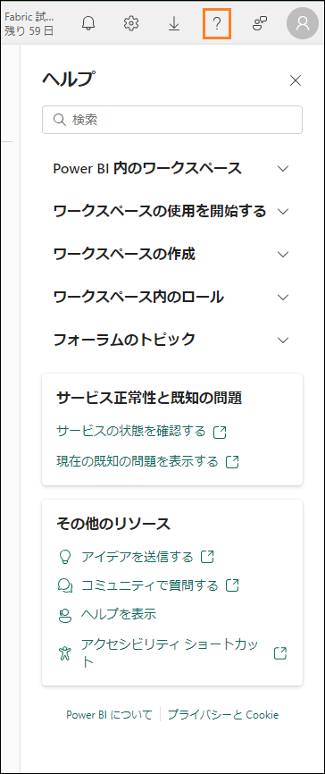 

Microsoft Fabric の次のステップに役立つリソースをいくつか以下に紹介します。

- ブログ記事で [Microsoft-Fabric-のGA-に関するお知らせ](https://aka.ms/Fabric-Hero-Blog-Ignite23) の全文を確認する
- [ガイド付きツアー](https://aka.ms/Fabric-GuidedTour) を通じて Fabric を探索する
- [Microsoft Fabric の無料試用版](https://www.microsoft.com/en-us/microsoft-fabric/getting-started) にサインアップする
- [Microsoft Fabric のWeb サイト](https://www.microsoft.com/en-in/microsoft-fabric) にアクセスする
- [Fabric の学習モジュール](https://learn.microsoft.com/en-us/training/browse/?products=fabric&resource_type=module)で新しいスキルを学ぶ
- [Fabric の技術ドキュメント](https://learn.microsoft.com/en-us/fabric/) を参照する
- [Fabric 入門編の無料のe-book](https://info.microsoft.com/ww-landing-unlocking-transformative-data-value-with-microsoft-fabric.html) を読む
- [Fabric コミュニティ](https://community.fabric.microsoft.com/)に参加し、質問の投稿やフィードバックの共有を行い、他のユーザーから学びを得る

より詳しい Fabric  エクスペリエンスのお知らせに関するブログを参照してください。

- [Fabric の Data Factory エクスペリエンスに関するブログ](https://blog.fabric.microsoft.com/en-us/blog/introducing-data-factory-in-microsoft-fabric/)
- [Fabric のSynapse Data Engineering エクスペリエンスに関するブログ](https://blog.fabric.microsoft.com/en-us/blog/introducing-synapse-data-engineering-in-microsoft-fabric/)
- [Fabric のSynapse Data Science エクスペリエンスに関するブログ](https://blog.fabric.microsoft.com/en-us/blog/introducing-synapse-data-science-in-microsoft-fabric/)
- [Fabric のSynapse Data Warehousing エクスペリエンスに関するブログ](https://blog.fabric.microsoft.com/en-us/blog/introducing-synapse-data-warehouse-in-microsoft-fabric/)
- [Fabric のSynapse Real-Time Analytics エクスペリエンスに関するブログ](https://blog.fabric.microsoft.com/en-us/blog/sense-analyze-and-generate-insights-with-synapse-real-time-analytics-in-microsoft-fabric/)
- [Power BI のお知らせに関するブログ](https://powerbi.microsoft.com/en-us/blog/empower-power-bi-users-with-microsoft-fabric-and-copilot/)
- [Fabric の Data Activator エクスペリエンスに関するブログ](https://blog.fabric.microsoft.com/en-us/blog/driving-actions-from-your-data-with-data-activator/)
- [Fabric の管理とガバナンスに関するブログ](https://blog.fabric.microsoft.com/en-us/blog/administration-security-and-governance-in-microsoft-fabric/)
- [Fabric の OneLake に関するブログ](https://blog.fabric.microsoft.com/en-us/blog/microsoft-onelake-in-fabric-the-onedrive-for-data/) 
- [Dataverse とMicrosof t Fabric の統合に関するブログ](https://cloudblogs.microsoft.com/dynamics365/it/2023/05/24/new-dataverse-enhancements-and-ai-powered-productivity-with-microsoft-365-copilot/)

© 2023 Microsoft Corporation. All rights reserved.

このデモ/ラボを使用すると、次の条件に同意したことになります。

このデモ/ラボで説明するテクノロジまたは機能は、ユーザーのフィードバックを取得 し、学習エクスペリエンスを提供するために、Microsoft Corporation によって提供されます。ユーザーは、このようなテクノロジおよび機能を評価し、Microsoft にフィードバックを提供するためにのみデモ/ラボを使用できます。それ以外の目的には使用できませ ん。このデモ/ラボまたはその一部を、変更、コピー、配布、送信、表示、実行、再現、 発行、ライセンス、著作物の作成、転送、または販売することはできません。 

複製または再頒布のために他のサーバーまたは場所にデモ/ラボ (またはその一部) をコピーまたは複製することは明示的に禁止されています。
 
このデモ/ラボは、前に説明した目的のために複雑なセットアップまたはインストールを 必要としないシミュレーション環境で潜在的な新機能や概念などの特定のソフトウェアテクノロジ/製品の機能を提供します。
このデモ/ラボで表されるテクノロジ/概念は、フル機能を表していない可能性があり、最終バージョンと動作が異なることがあります。また、そのような機能や概念の最終版がリリースされない場合があります。物理環境でこのような機能を使用するエクスペリエンスが異なる場合もあります。 

**フィードバック。**このデモ/ラボで説明されているテクノロジ、機能、概念に関する フィードバックをMicrosoft に提供する場合、ユーザーは任意の方法および目的でユー
ザーのフィードバックを使用、共有、および商品化する権利を無償で Microsoft に提供するものとします。また、ユーザーは、フィードバックを含む Microsoft のソフトウェアまたはサービスの特定部分を使用したり特定部分とインターフェイスを持ったりする製 品、テクノロジ、サービスに必要な特許権を無償でサード パーティに付与します。ユーザーは、フィードバックを含めるために Microsoft がサード パーティにソフトウェアま たはドキュメントをライセンスする必要があるライセンスの対象となるフィードバックを提供しません。これらの権限は、本契約の後も存続します。 

Microsoft Corporation は、明示、黙示、または法律上にかかわらず、商品性のすべての保証および条件、特定の目的、タイトル、非侵害に対する適合性など、デモ/ラボに関する すべての保証および条件を拒否します。Microsoft は、デモ/ラボから派生する結果、出力の正確さ、任意の目的に対するデモ/ラボに含まれる情報の適合性に関して、いかなる 保証または表明もしません。

**免責事項**

このデモ/ラボには、Microsoft Power BI の新機能と機能強化の一部のみが含まれています。一部の機能は、製品の将来のリリースで変更される可能性があります。このデモ/ラ ボでは、新機能のすべてではなく一部について学習します。