## 目次
概要

ADLS Gen2 へのショートカット

- タスク 1: ショートカットを作成する

ビジュアル クエリを使用してデータを変換する

- タスク 2: ビジュアル クエリを使用して Geo ビューを作成する
- タスク 3: ビジュアル クエリを使用して Reseller ビューを作成する
- タスク 4: ビジュアル クエリを使用して Sales ビューを作成する
- タスク 5: ビジュアル クエリを使用して Product ビューを作成する

参考資料

## 概要 

このシナリオでは、ERP システムから取得された販売データが ADLS Gen2 に格納されています。毎日正午 (午後 12 時) に更新されます。このデータを変換してレイクハウスに取り込み、モデルで使用する必要があります。 

このデータは複数の方法で取り込むことができます。 

- **ショートカット:** データへのリンクが作成されます。ビジュアル クエリ ビューを使用して、データを変換できます。このラボではショートカットを使用します。 

- **Notebooks:** この方法ではコードを記述する必要があります。これは、開発者にとって使いやすい方法です。 

- **データフロー (Gen2) を使用する。**Power Query や データフロー (Gen1) についてはおそらくなじみがあることと思います。データフロー (Gen2) はその名前が示すように、新しいバージョンの データフローです。Power Query と データフロー (Gen1) のすべての機能に加え、データを変換して複数のデータ ソースに取り込む機能が追加されています。これについては以降のラボで紹介します。 

- **データ パイプラインを使用する。**データ パイプラインはオーケストレーション ツールです。アクティビティに調整を加え、データを抽出、変換して取り込むことができます。ここではデータ パイプラインを使用してデータフロー (Gen2) のアクティビティを実行し、抽出、変換、取り込みを行います。 

まず、ショートカットを作成して、ADLS Gen2 データ ソースからレイクハウスにデータを取り込みます。データを取り込んだら、ビジュアル クエリ ビューを使用して、データを変換します。 

このラボを終了すると、次のことが学べます。 

- レイクハウスへのショートカットの作成方法 

- ビジュアル クエリを使用したデータの変換方法 

## ADLS Gen2 へのショートカット 

#### タスク 1: ショートカットを作成する 

ショートカットは、ターゲットとなる場所へのリンクを作成するために使用されます。これは、Windows デスクトップでのショートカットの作成に似ています。 

1. ラボ 2 のタスク 9 で作成した **Fabric ワークスペース**に戻ります。 

2. 前のラボの終了後に別の場所に移動していない場合は、レイクハウスの画面が表示されています。別の場所に移動した場合でも問題ありません。**lh_FAIAD** を選択して、レイクハウスに移動します。 

3. **エクスプローラー** パネルで、**Tables** の横にある**省略記号**を選択します。 

4. **新しいショートカット**を選択します。 

   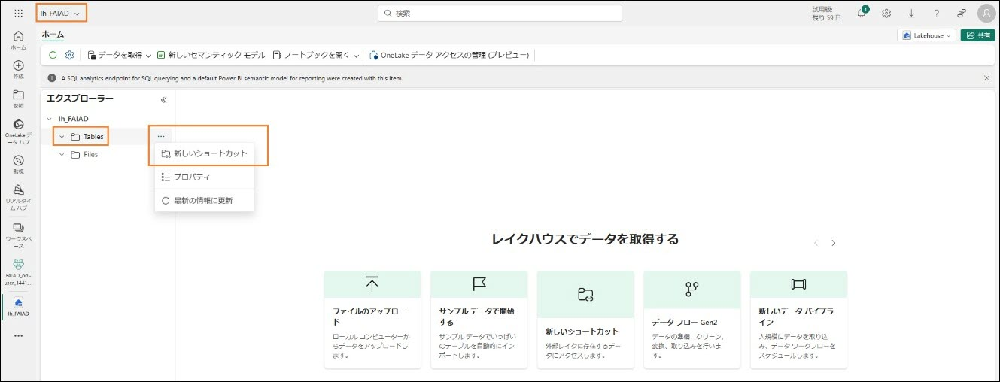

5. **新しいショート**カット ダイアログが開きます。**外部ソース**で、**Azure Data Lake Storage Gen2** を選択します。 

   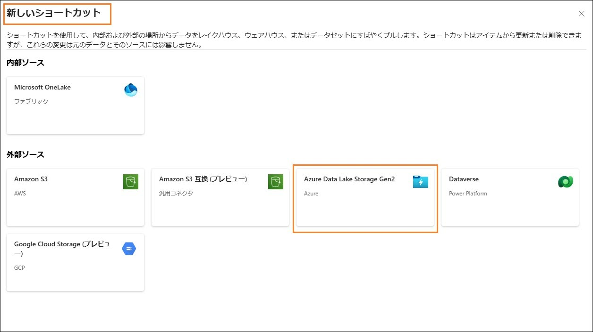

6. ADLS Gen2 データ ソースへの接続を作成する必要があります。**接続設定 -> URL** に、リンク https://stvnextblobstorage.dfs.core.windows.net/fabrikam-sales を入力します。 

7. [認証の種類] ドロップダウンから、**アカウント キー**を選択します。 

8. **環境変数**タブ ([ラボ ガイド] タブの横) から **ADLS ストレージ アカウントのアクセス キー**をコピーし、**アカウント キー** テキスト ボックスに貼り付けます。 

9. 画面右下の**次へ**を選択します。  

   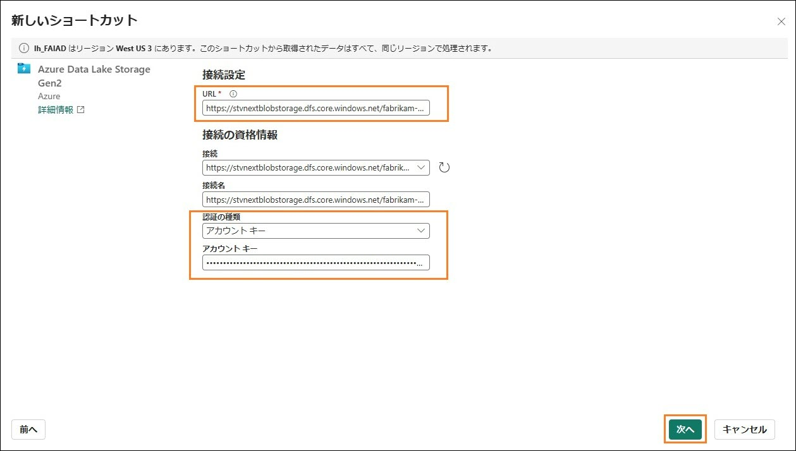

10. ADLS Gen2 に接続され、左パネルにディレクトリ構造が表示されます。**Delta-Parquet-Format-FY25** を展開します。 

11. 次のディレクトリを**選択**します。 

    a. Application.Cities 

    b. Application.Countries 

    c. Application.StateProvinces 

    d. DateDim 

    e. Sales.BuyingGroups 

    f. Sales.Customers 

    g. Sales.Invoices 

    h. Sales.InvoiceLines 

    i. Warehouse.StockItems 

    j. Warehouse.StockGroups 

    k. Warehouse.StockItemStockGroups 

  **注:** Sales.Invoices_May だけが、**選択されない**ディレクトリです。 

12. 次へを選択します。 

    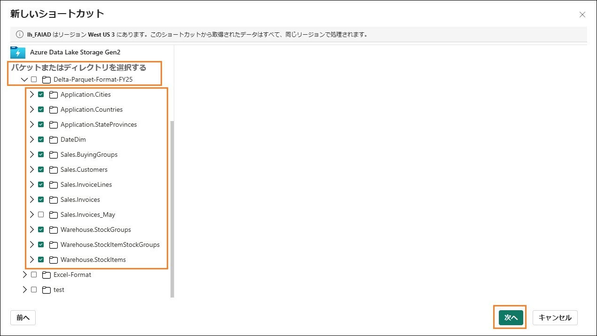

13. 名前を編集できる次のダイアログが表示されます。 **Application.Cities** の [アクション] の下にある**編集アイコン**を選択します。 

14. 名前を **Application.Cities から Cities に**変更します。 

15. 名前の横にあるチェック マークを選択して、変更を保存します。 

    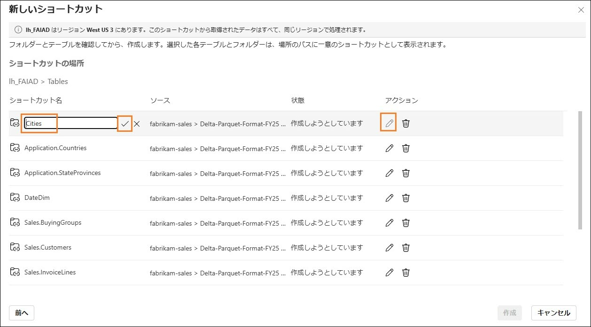

16. 同様に、ショートカット名を次のように変更します。 

      a. Application.Countries から Countries へ 

      b. Application.StateProvinces から States へ 

      c. DateDim から Date へ 

      d. Sales.BuyingGroups から BuyingGroups へ 

      e. Sales.Customers から Customers へ 

      f. Sales.InvoiceLines から InvoiceLineItems へ 

      g. Sales.Invoices から Invoices へ 

      h. Warehouse.StockGroups から ProductGroups へ 

      i. Warehouse.StockItemStockGroups から ProductItemGroup へ 

      j. Warehouse.StockItems から ProductItem へ 

  **注:** 名前をもう一度確認してください。入力ミスがあると、ラボでエラーが発生する可能性があります。 

17. **作成**を選択して、ショートカットを作成します。 

    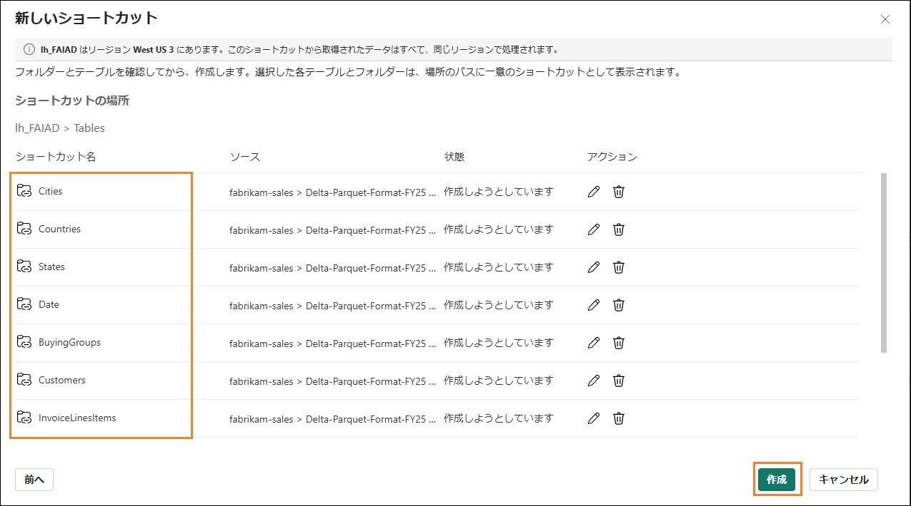

18. すべてのショートカットがテーブルとして作成されていることに注意してください。**BuyingGroups** テーブルを選択し、データ パネルにデータのプレビューが表示されることを確認してください。 

    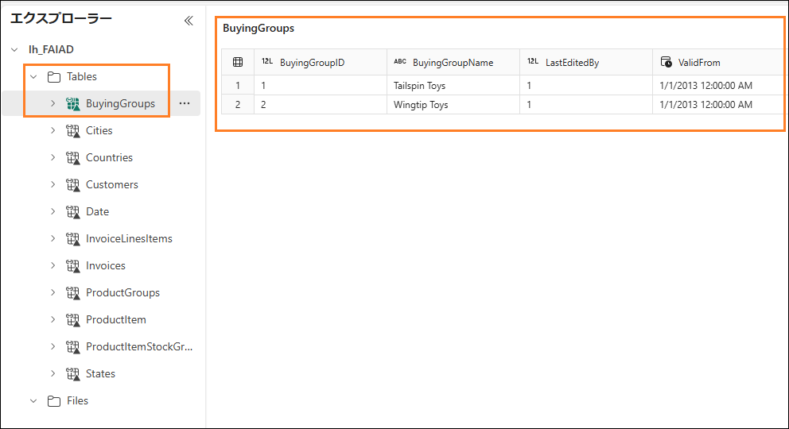

次の手順では、セマンティック モデルを作成するために、データを変換します。データを変換するためのビューを作成します。 

## ビジュアル クエリを使用してデータを変換する 

#### タスク 2: ビジュアル クエリを使用して Geo ビューを作成する 

1. SQL エンドポイントを使用して、レイクハウスにアクセスできます。これにより、データに対するクエリの実行や、ビューの作成が可能になります。画面の**右上**で、**レイクハウス -> SQL 分析エンドポイント**を選択します。 

   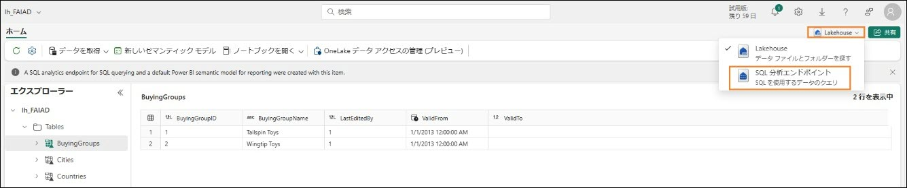

    SQL 分析エンドポイントが表示されます。[エクスプローラー]パネルが変更されていることを確認してください。ビュー、ストアド プロシージャ、クエリなどを作成することができます。ここでは、Power Query のようなインターフェイスを提供するビジュアル・クエリを作成し、これをビューとして保存します。 

    最初に、Geo ビューを作成します。Geo を作成するには、Cities、States、Countries の各クエリからのデータをマージする必要があります。 

2. 上部のメニューから**新規のビジュアル クエリ**を選択します。 

   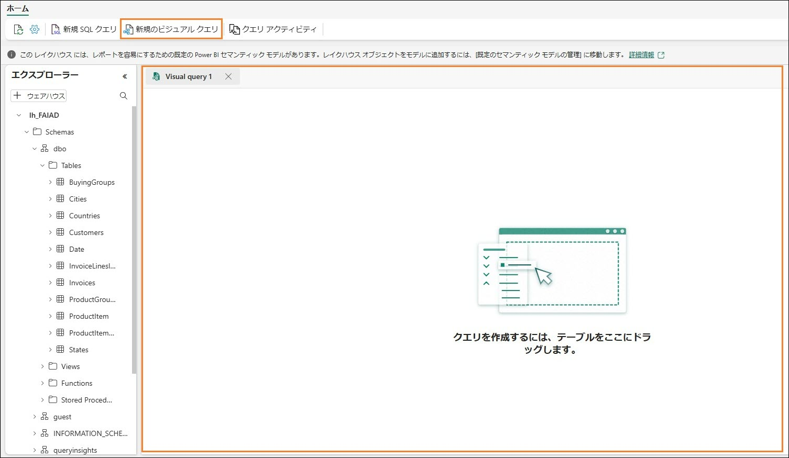

3. クエリを作成するには、テーブルを [ビジュアル クエリ] パネルにドラッグする必要があります。Cities、States、Countries の各クエリを [ビジュアル クエリ] パネルにドラッグしてください。 

   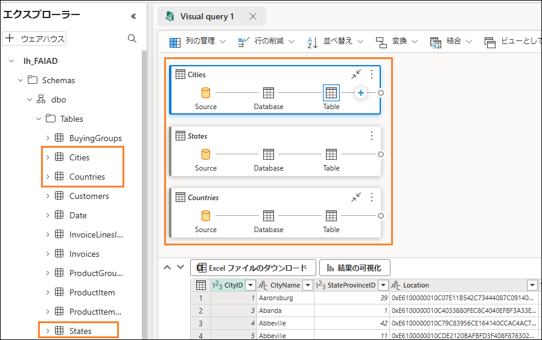

   これらのクエリをマージする必要があります。また、ビジュアル クエリには、Power Query エディターを使用するためのオプションがあります。このエディターに慣れているので、これを使用しましょう。 

4. ビジュアル クエリ エディターのメニューから**フォーカス モード** アイコンを選択します (右側にあります)。Power Query エディターが表示されます。 

   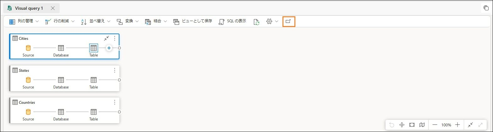

5. Cities クエリを選択した状態で、Power Query エディターのリボンから**ホーム -> クエリのマージ -> 新規としてクエリをマージ**を選択します。[マージ] ダイアログが開きます。 

    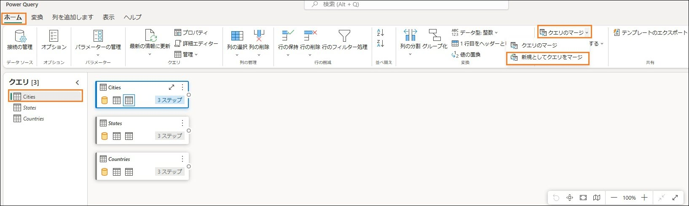

6. **マージ用の左テーブル**で **Cities** を選択します。 

7. **マージ用の右テーブル**で **States** を選択します。 

8. 両方のテーブルから **StateProvinceID** 列を選択します。この列を使用して結合を実行します。 

9. **結合の種類**として**内部**を選択します。 

10. **OK** を選択します。 

   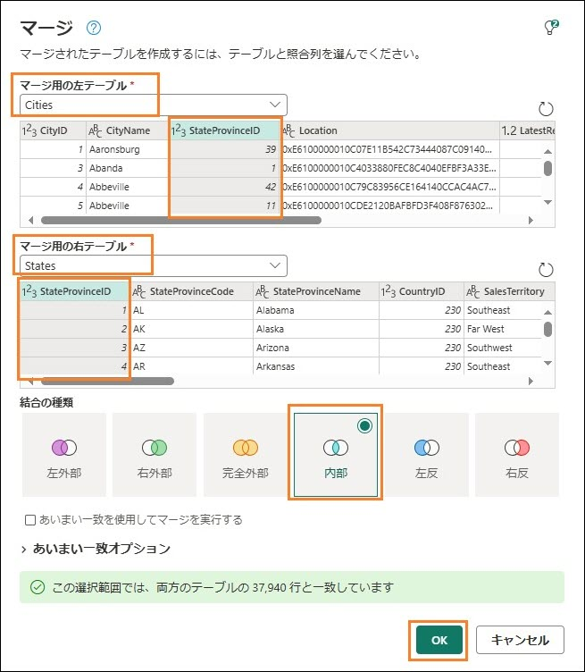

マージという名前の新しいクエリが作成されたことを確認してください。States の列がいくつか必要になります。 

11. **データ ビュー** (下部のパネル) で、**States** 列 (右端の列) の横にある**二重矢印**をクリックします。 

12. パネルが開きます。次の列を**選択**します。 

    a. StateProvinceCode 

    b. StateProvinceName 

    c. CountryID 

    d. SalesTerritory 

13. **OK** を選択します。 

    

    次に、Countries クエリをマージする必要があります。 

14. マージクエリを選択した状態で、リボンから **ホーム - > クエリのマージ -> クエリのマージ**を選択します。 

    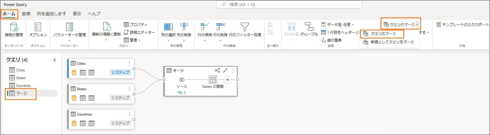

15. [マージ] クエリ ダイアログが開きます。**マージ用の右テーブル**で **Countries** を選択します。 

16. 両方のテーブルから **CountryID** 列を選択します。この列を使用して結合を実行します。 

17. **結合の種類**として**内部**を選択します。 

18. **OK** を選択します。 

    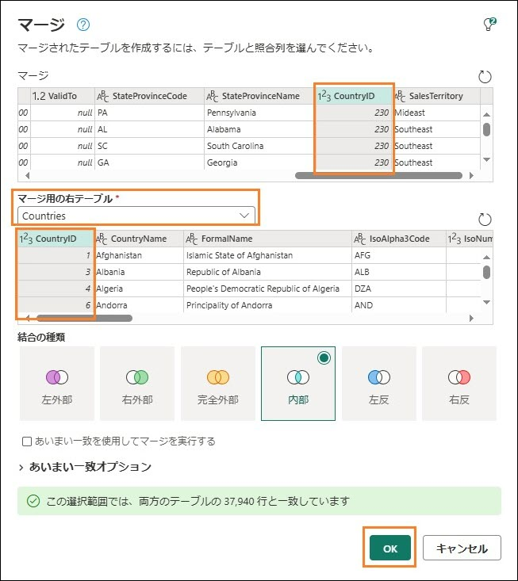

    Countries の列がいくつか必要になります。 

19. **データ ビュー** (下部のパネル) で、**Countries** 列の横にある**二重矢印**をクリックします。 

20. パネルが開きます。次の列を**選択**します。 

    a. CountryName 

    b. FormalName 

    c. IsoAlpha3Code 

    d. IsoNumericCode 

    e. CountryType 

    f. Continent 

    g. Region 

    h. Subregion 

21. **OK** を選択します。 

    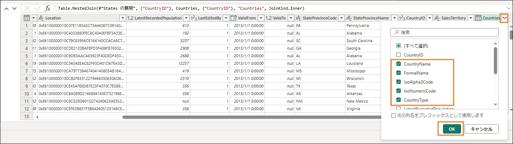

    すべての列が必要になるわけではありません。必要な列だけを選択してください。 

22. マージクエリを選択した状態で、リボンから **ホーム - > 列の選択 -> 列の選択**を選択します。 

 
      
 

23. [列の選択] ダイアログが開きます。次の列を**オフにします。** 

    a. StateProvinceID 

    b. Location 

    c. LastEditedBy 

    d. ValidFrom 

    e. ValidTo 

    f. CountryID 

24. **OK** を選択します。 

    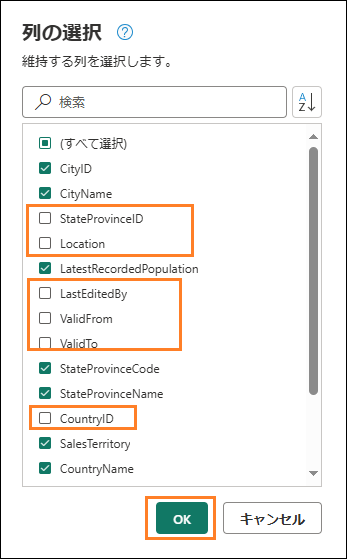

    プロセスは Power Query と類似しており、すべてのステップが、右側の [適用されたステップ] パネルとビジュアル ビューの両方に記録されていることを確認してください。Merge クエリの名前を変更し、読み込みを有効にして、このクエリからデータを読み込みましょう。 

25. [クエリ] パネル (左) で、**マージクエリを右クリック**します。**名前の変更**を選択し、クエリの名前を Geo に変更します。 

26. [クエリ] パネル (左) で、**Geo クエリを右クリック**します。**読み込みを有効にする**を選択し、このクエリを有効にします。 

27. Cities、States、Countries の各クエリが**無効になっている**ことを確認してください。 

28. **保存**を選択します。 

    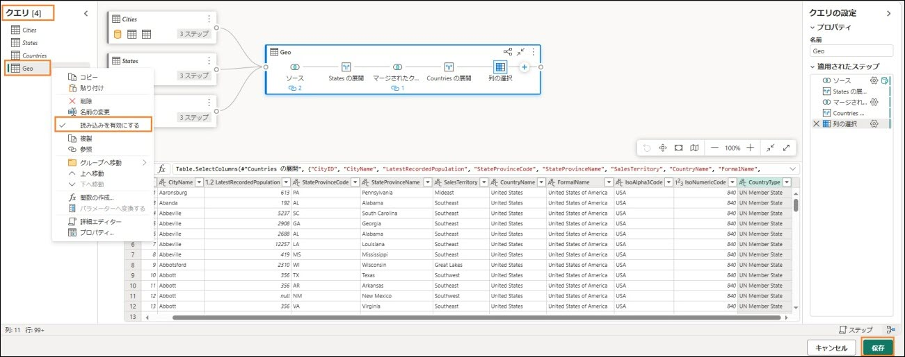

    ビジュアル クエリ エディターが表示されます。ここでは、このクエリをビューとして保存します。 

    **注:** Power Query エディターを使用して実行したすべてのステップは、ビジュアル クエリ エディターを使用して実行することもできます。 

29. ビジュアル クエリ エディターのメニューから**ビューとして保存**を選択します。 

     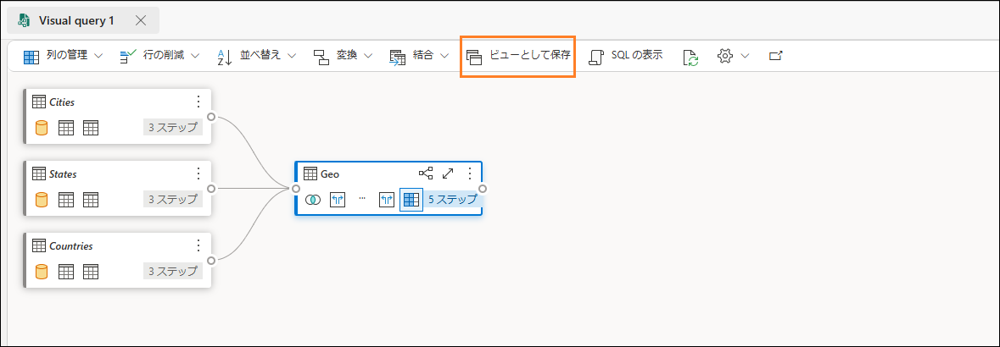

    [ビューとして保存] ダイアログが開きます。SQL クエリが使用可能になっていることに注目してください。選択すれば、そのクエリを確認することができます。 

30. **ビュー名**に **Geo** と入力します。 

31. **OK** を選択してビューを保存します。 

     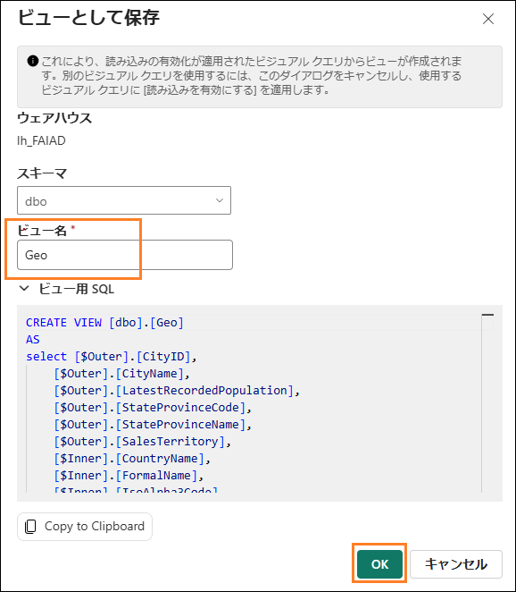

    ビューが保存されると、アラートが表示されます。 

32. [エクスプローラー]パネル (左) で、**Views** を展開します。新しく作成された Geo ビューがあります。 

     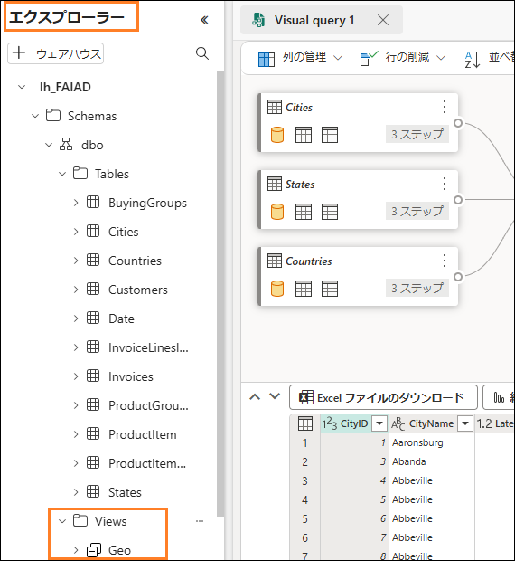

## タスク 3: ビジュアル クエリを使用して Reseller ビューを作成する 

Customers テーブルと BuyingGroups テーブルをマージして、Reseller ビューを作成しましょう。今回は、ビジュアル クエリを使用してビューを作成します。 

1. レイクハウスのメニュー バーから**ホーム -> 新規のビジュアル クエリ**を選択します。新しいビジュアル クエリが開きます。 

2. [エクスプローラー] セクションから、Customers テーブルと BuyingGroups テーブルを [ビジュアル クエリ] セクションにドラッグします。 

    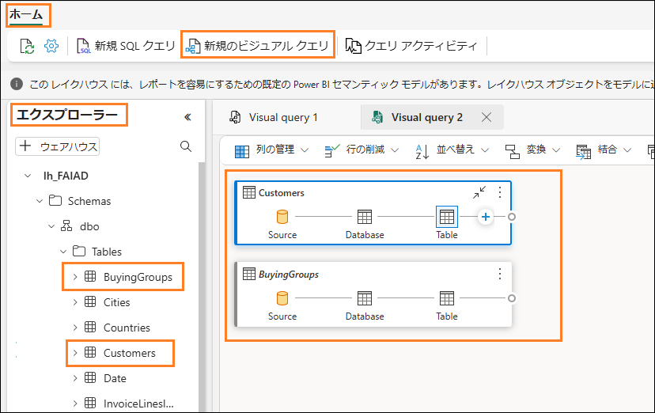
 

3. **Customers** クエリを選択します。選択すると、Customers の周りに青の境界線が表示され、テーブルの後に "+" 記号が表示されます (これは、テーブルの後にステップを追加することを示しています。テーブルの後に "+" 記号が表示されない場合は、別のステップを選択している可能性があります。[テーブル] を選択すれば、続行できます)。 

4. ビジュアル クエリのメニューから**結合 -> クエリのマージ**を選択します。 

   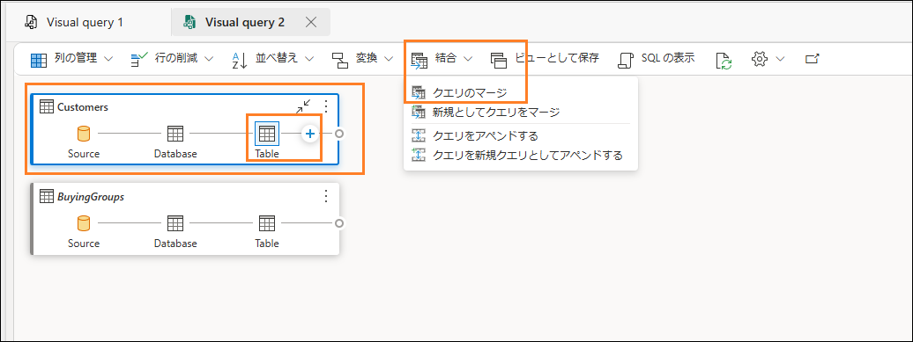  

   [マージ] ダイアログが開き、Customers が最上位のテーブルとして選択されています。 

5. **マージ用の右テーブル**で **BuyingGroups** を選択します。 

6. 両方のテーブルから **BuyingGroupID** 列を選択します。この列を使用して結合を実行します。 

7. **結合の種類**として**内部**を選択します。 

8. **OK** を選択します。 

    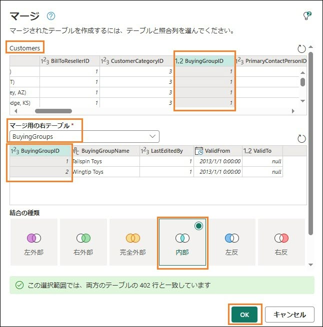

9. **データ ビュー** (下部のパネル) で、**BuyingGroups** 列 (右端の列) の横にある**二重矢印**をクリックして、BuyingGroups から必要な列を選択します。 

10. パネルが開きます。**BuyingGroupName** 列を**選択**します。 

11. **OK** を選択します。 

    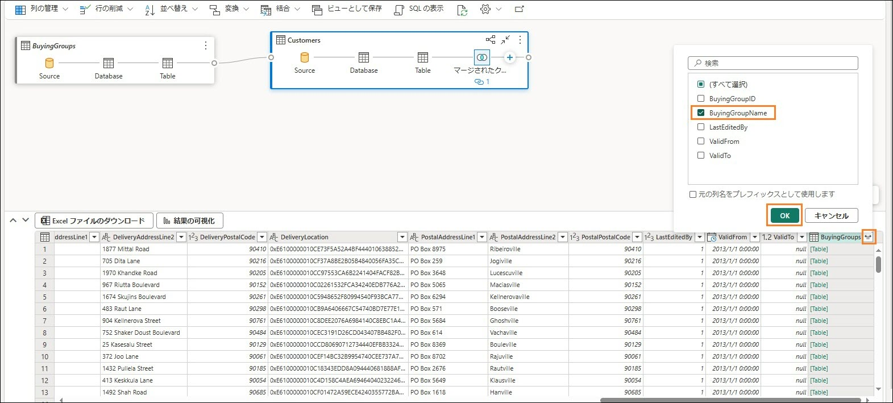

    すべての列が必要になるわけではありません。必要な列だけを選択してください。 

12. ビジュアル クエリのメニューから**列の管理 -> 列の選択**を選択します。 
 
    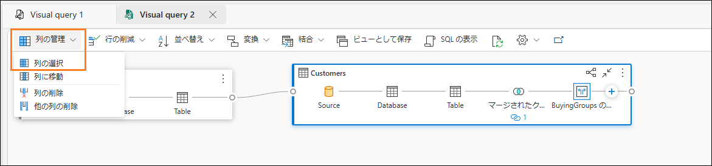

13. [列の選択] ダイアログが開きます。次の列を**選択**します。 

    a. ResellerID 

    b. ResellerName 

    c. PostalCityID 

    d. PhoneNumber 

    e. FaxNumber 

    f. WebsiteURL 

    g. DeliveryAddressLine1 

    h. DeliveryAddressLine2 

    i. DeliveryPostalCode 

    j. PostalAddressLine1 

    k. PostalAddressLine2 

    l.PostalPostalCode 

    m. BuyingGroupName 

14. **OK** を選択します。 

    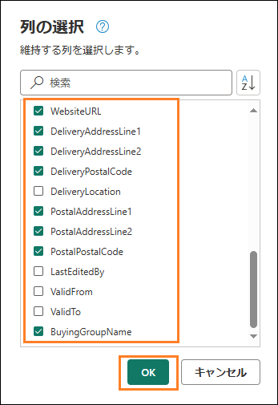

15. BuyingGroupName 列の名前を変更しましょう。**データ ビューで BuyingGroupName 列ヘッダーをダブルクリックして、**編集可能にします。 

16. 列を **ResellerCompany** という**名前に変更**します。 

    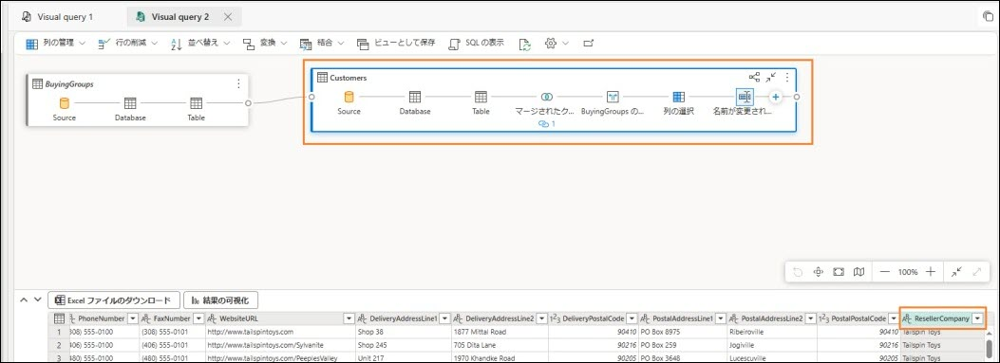

    Customer テーブルには、すべてのステップが記録されていることを確認してください。次に、このビューを保存しましょう。 

17. ビジュアル クエリ エディターのメニューから**ビューとして保存**を選択します。 

    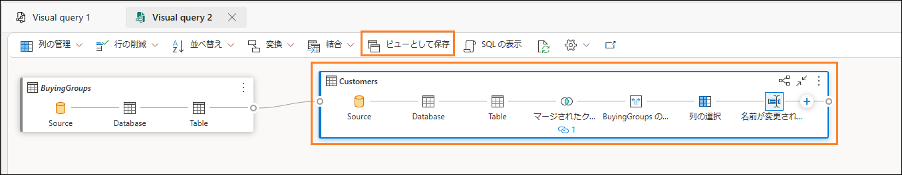

    [ビューとして保存] ダイアログが開きます。SQL クエリが使用可能になっていることに注目してください。選択すれば、そのクエリを確認することができます。 

18. **ビュー名**に **Reseller** と入力します。 

19. **OK** を選択してビューを保存します。 

     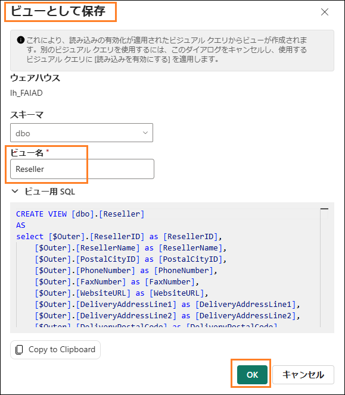

    ビューが保存されると、アラートが表示されます。 

20. [エクスプローラー]パネル (左) で、**Views** を展開します。新しく作成された Reseller ビューがあります。 

     

## タスク 4: ビジュアル クエリを使用して Sales ビューを作成する 

InvoiceLineItems テーブルと Invoices テーブル、および Reseller ビューをマージして、Sales ビューを作成しましょう。このクエリは Power BI Desktop にあります。詳細エディターからコードをコピーします。ただし、コードをコピーする前に、ビジュアル クエリを使用してマージ テーブルを作成する必要があります。これは、ビジュアル クエリでは空のクエリを作成できないためです。この方法を試してみましょう。 

1. レイクハウスのメニュー バーから**ホーム -> 新規のビジュアル クエリ**を選択します。新しいビジュアル クエリが開きます。 

2. **エクスプローラー -> Tables** セクションから、**InvoiceLineItems と Invoices** の各テーブルを [ビジュアル クエリ] セクションにドラッグします。 

3. **エクスプローラー -> Views** セクションから、**Reseller** ビューを [ビジュアル クエリ] セクションにドラッグします。 

4. ビジュアル クエリ エディターで、**フォーカス モード** アイコンを選択して Power Query エディターを開きます。 

   

5. InvoiceLineItems クエリを選択した状態で、リボンから**ホーム -> クエリのマージ -> 新規としてクエリをマージ**を選択します。 

    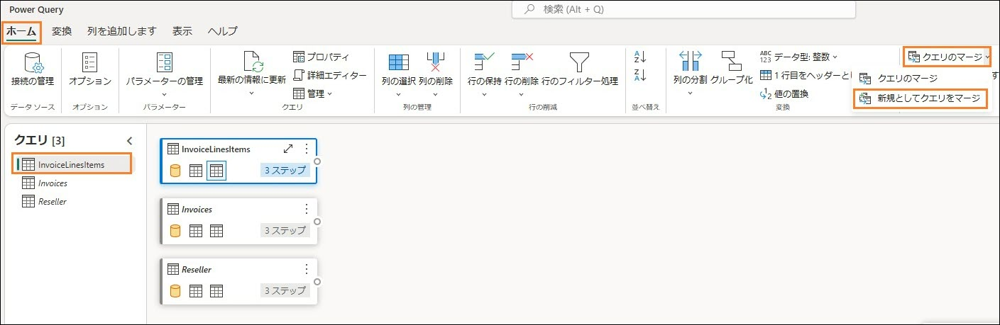

   [マージ] ダイアログボックスが開きます。 

6. **マージ用の左テーブル**で **InvoiceLineItems** を選択します。 

7. **マージ用の右テーブル**で **Invoices** を選択します。 

8. 両方のテーブルから **InvoiceID** 列を選択します。この列を使用して結合を実行します。 

9. **結合の種類**として**内部**を選択します。 

10. **OK** を選択します。 

    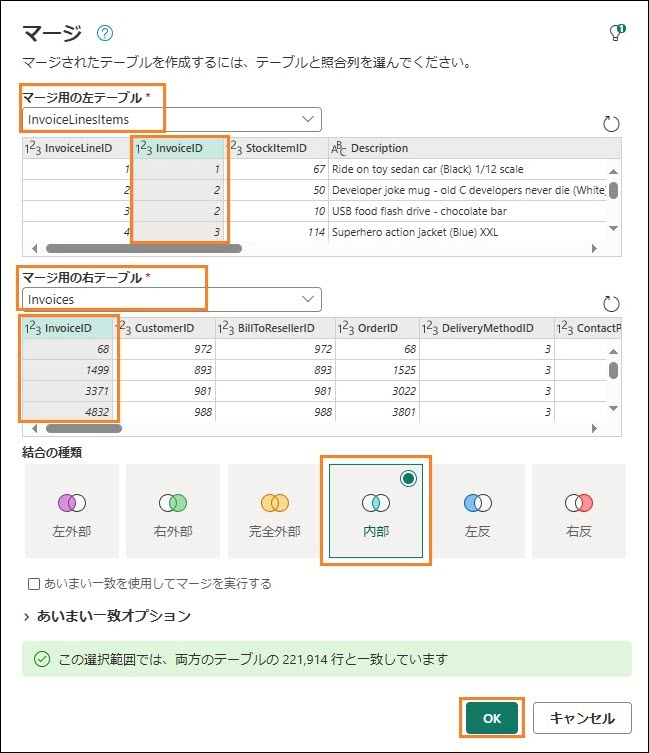

    Power BI Desktop からコードをコピーし、詳細エディターを使用して、これを貼り付けます。 

11. まだ開いていない場合は、お使いのラボ環境のデスクトップにある **Reports** フォルダー内の **FAIAD.pbix** を開きます。 

12. リボンから**ホーム -> データの変換**を選択します。Power Query ウィンドウが開きます。前のラボで確認したように、左パネルのクエリはデータ ソースごとに整理されています。 

    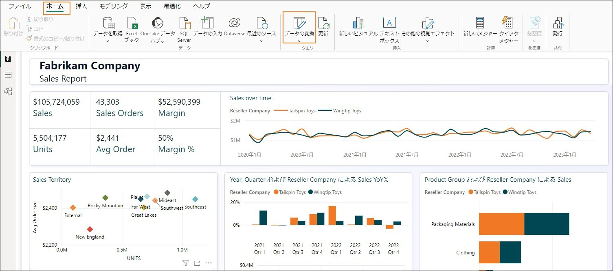

13. 左パネルの ADLSData フォルダーにある **Sales** クエリを選択します。 

14. リボンから**ホーム -> 詳細エディター**を選択します。[詳細エディター] ダイアログが開きます。 

    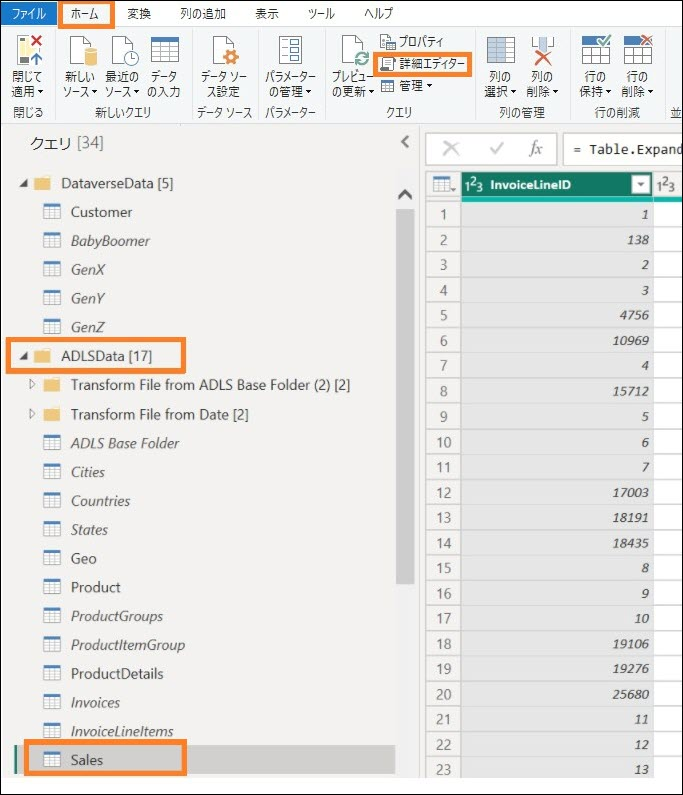

15. **3 行目 (#"Expanded Invoice" …)** から最後のコード行までのコードを選択します。 

16. **右クリック**して**コピー**を選択します。 

17. **キャンセル**を選択して詳細エディターを閉じます。 

    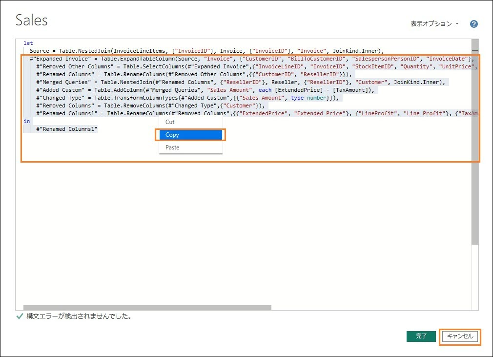

18. Power Query エディターが開いている**ブラウザーに戻ります。** 

19. **マージ**クエリが選択されていることを確認してください。 

20. リボンから**ホーム -> 詳細エディター**を選択します。[詳細エディター] ダイアログが開きます。 

    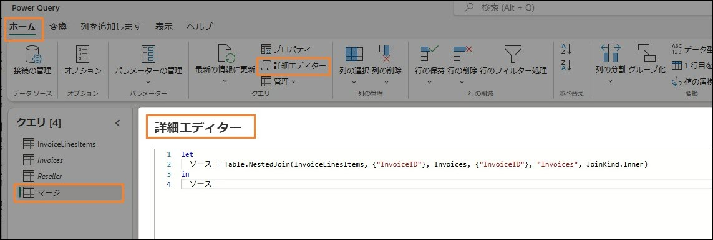

21. **2 行目 (Source = Table.NestedJoin(InvoiceLineItems, {"InvoiceID"}, Invoices, {"InvoiceID"}, "Invoices", JoinKind.Inner) の末尾にコンマを追加します。** 

22. **Enter** を押して、新しい行を開始します。 

23. キーボードで **Ctrl+V** を押して、Power BI Desktop からコピーしたコードを貼り付けます。 

    **注:** ラボ環境で作業している場合は、画面の右側にある省略記号を選択してください。スライダーを使用して **VM ネイティブ クリップボードを有効**にします。ダイアログで [OK] を選択します。クエリの貼り付けが済んだら、このオプションを無効にしてかまいません。 

    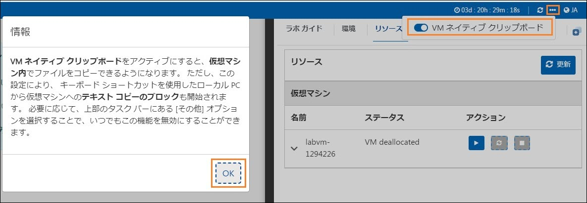

24. コードの最後の 2 行 (ソース内) を強調表示して**削除**します。 

25. **OK** をクリックして変更を保存します。 

    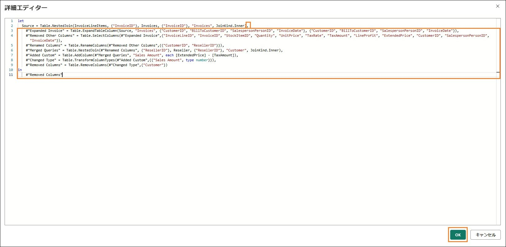

    簡単に行うには、詳細エディターですべてのコードを削除し、次のコードを詳細エディターに貼り付けます。 

  let 
  
  Source = Table.NestedJoin(InvoiceLineItems, {"InvoiceID"}, Invoices, {"InvoiceID"}, "Invoices", JoinKind.Inner), 

   #"Expanded Invoice" = Table.ExpandTableColumn(Source, "Invoices", {"CustomerID", "BillToCustomerID", "SalespersonPersonID", "InvoiceDate"}, {"CustomerID", "BillToCustomerID", "SalespersonPersonID", "InvoiceDate"}), 

   #"Removed Other Columns" = Table.SelectColumns(#"Expanded Invoice",{"InvoiceLineID", "InvoiceID", "StockItemID", "Quantity", "UnitPrice", "TaxRate", "TaxAmount", "LineProfit", "ExtendedPrice", "CustomerID", "SalespersonPersonID", "InvoiceDate"}), 

   #"Renamed Columns" = Table.RenameColumns(#"Removed Other Columns",{{"CustomerID", "ResellerID"}}), 

   #"Merged Queries" = Table.NestedJoin(#"Renamed Columns", {"ResellerID"}, Reseller, {"ResellerID"}, "Customer", JoinKind.Inner), 

   #"Added Custom" = Table.AddColumn(#"Merged Queries", "Sales Amount", each [ExtendedPrice] - [TaxAmount]), 

   #"Changed Type" = Table.TransformColumnTypes(#"Added Custom",{{"Sales Amount", type number}}), 

   #"Removed Columns" = Table.RemoveColumns(#"Changed Type",{"Customer"}) 

  in 
   
  #"Removed Columns" 

 

26. Power Query エディターに戻ります。左側の [クエリ] パネルで、**マージクエリをダブルクリックして、**名前を変更します。 

27. Merge クエリを **Sales** という**名前に変更**します。 

28. Sales クエリを右クリックし、**読み込みを有効にする**を選択して、クエリが読み込まれるようにします。 

    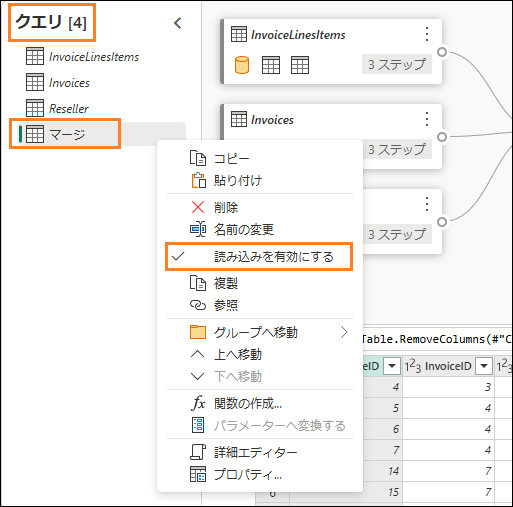

29. **保存**を選択してクエリを保存し、Power Query ダイアログを閉じます。ビジュアル クエリが表示されます。 

30. ビジュアル クエリ エディターのメニューから**ビューとして保存**を選択します。[ビューとして保存] ダイアログが開きます。SQL クエリが使用可能になっていることに注目してください。選択すれば、そのクエリを確認することができます。 

31. **ビュー名**に **Sales** と入力します。 

32. **OK** を選択してビューを保存します。 

    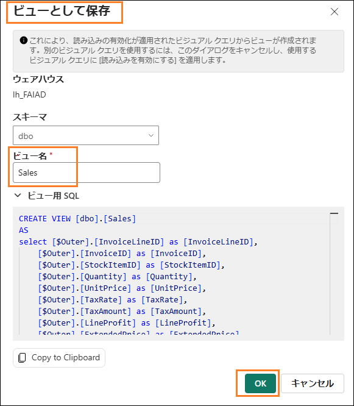

    ビューが保存されると、アラートが表示されます。 

33. [エクスプローラー]パネル (左) で、**Views** を展開します。新しく作成された Sales ビューがあります。 

 
    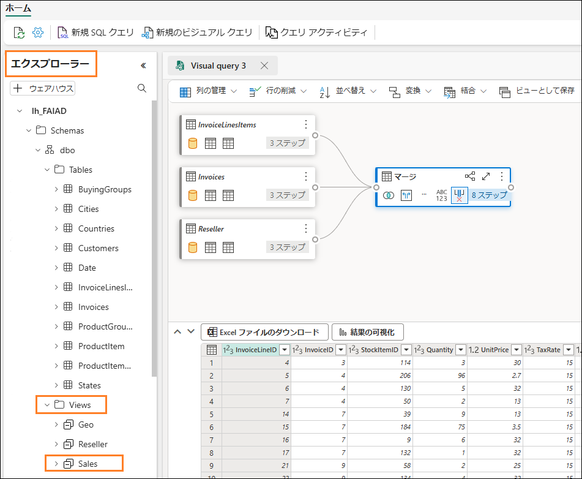
 

## タスク 5: ビジュアル クエリを使用して Product ビューを作成する 

ProductItem、ProductItemGroup、および ProductGroups の各テーブルをマージして、Product ビューを作成しましょう。作業を進めるために、コードを詳細エディターにコピーします。 

1. レイクハウスのメニュー バーから**ホーム -> 新規のビジュアル クエリ**を選択します。新しいビジュアル クエリが開きます。 

2. [エクスプローラー] セクションから、**ProductItem、ProductItemGroup、および ProductGroups** の各テーブルを [ビジュアル クエリ] セクションにドラッグします。 

3. ビジュアル クエリ エディターで、**フォーカス モード** アイコンを選択して Power Query エディターを開きます。 

   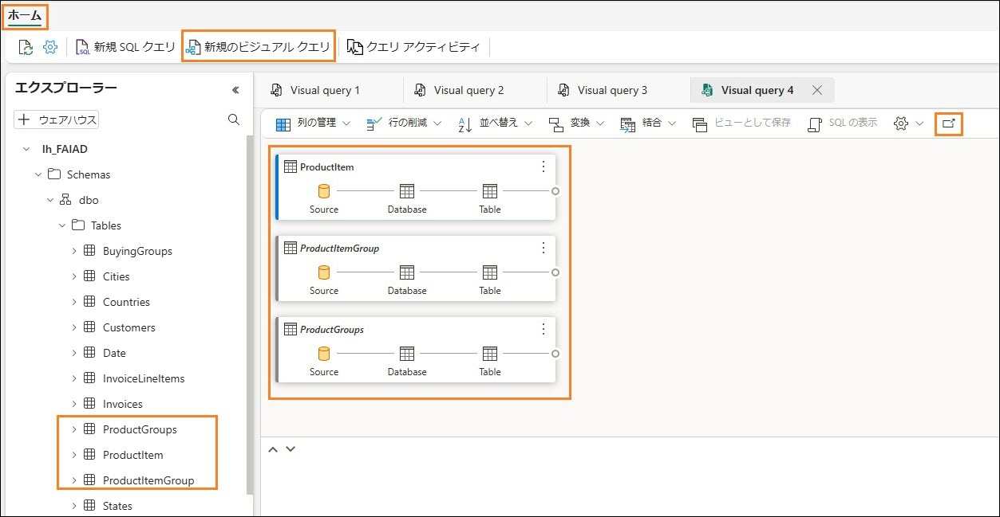

4. **ProductItem** クエリを選択した状態で、リボンから**ホーム -> クエリのマージ -> 新規としてクエリをマージ**を選択します。[マージ] ダイアログボックスが開きます。 

   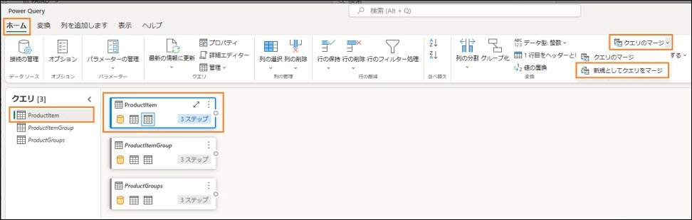

5. **マージ用の左テーブル**で **ProductItem** を選択します。 

6. **マージ用の右テーブル**で **ProductItemGroup** を選択します。 

7. 両方のテーブルから **StockItemID** 列を選択します。この列を使用して結合を実行します。 

8. **結合の種類で左外部**を選択します。 

9. **[OK] を選択します。**新しい Merge クエリが作成されます。 

   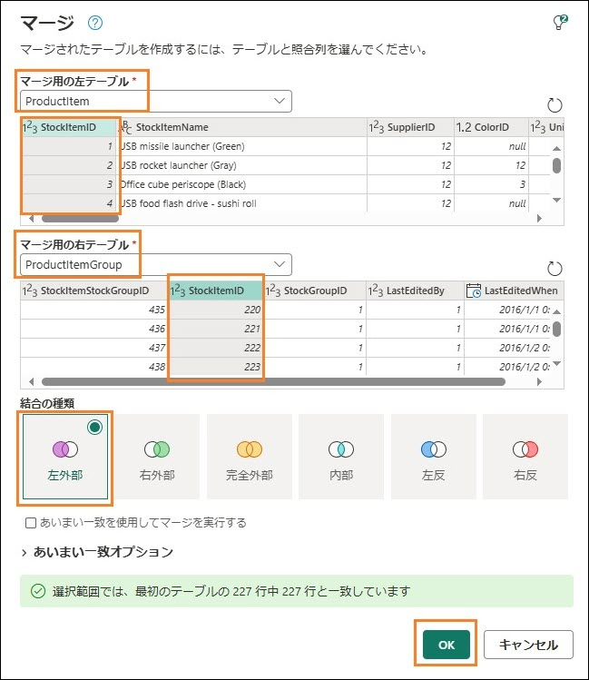

10. Merge クエリを選択した状態で、リボンから**ホーム -> 詳細エディター**を選択します。[詳細エディター] ダイアログが開きます。 

    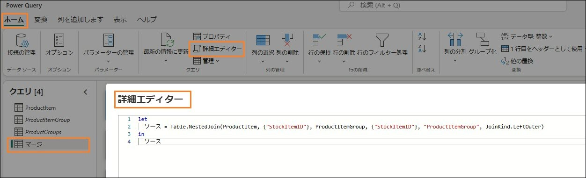

11. **詳細エディターのコードをすべて選択し、削除します。** 

12. 次のコードを詳細エディターに**貼り付けます。** 

   let

   Source = Table.NestedJoin(ProductItem, {"StockItemID"}, ProductItemGroup, {"StockItemID"}, "ProductItemGroup", JoinKind.LeftOuter), 

   #"Expanded ProductItemGroup" = Table.ExpandTableColumn(Source, "ProductItemGroup", {"StockGroupID"}, {"StockGroupID"}), 

   #"Merged queries" = Table.NestedJoin(#"Expanded ProductItemGroup", {"StockGroupID"}, ProductGroups, {"StockGroupID"}, "ProductGroups", JoinKind.LeftOuter), 

   #"Expanded ProductGroups" = Table.ExpandTableColumn(#"Merged queries", "ProductGroups", {"StockGroupName"}, {"StockGroupName"}), 

   #"Choose columns" = Table.SelectColumns(#"Expanded ProductGroups", {"StockItemID", "StockItemName", "SupplierID", "Size", "IsChillerStock", "TaxRate", "UnitPrice", "RecommendedRetailPrice", "TypicalWeightPerUnit", "StockGroupName"}) 

 in 

  #"Choose columns" 

13. **OK** を選択して詳細エディターを閉じます。Power Query エディターに戻ります。 

      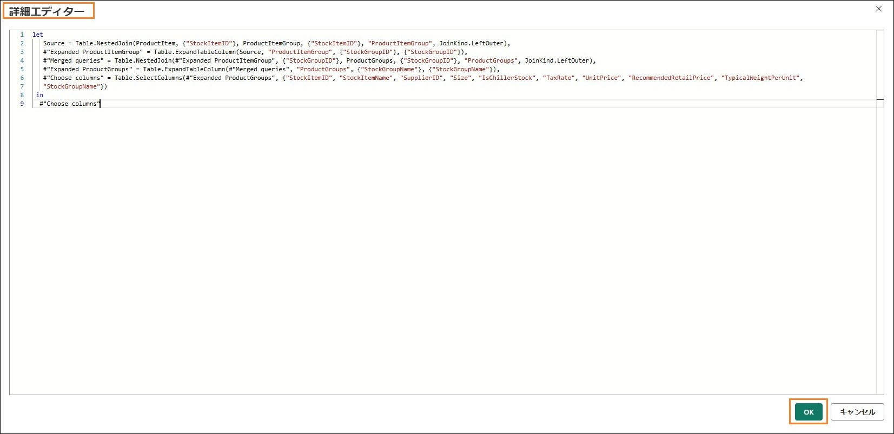

14. 左側の [クエリ] パネルで、**マージクエリをダブルクリックして、**名前を変更します。 

15. マージクエリを **Product** という**名前に変更**します。 

16. Product クエリを右クリックし、**読み込みを有効にする**を選択して、クエリが読み込まれるようにします。 

17. **保存**を選択してクエリを保存し、Power Query ダイアログを閉じます。ビジュアル クエリが表示されます。 

    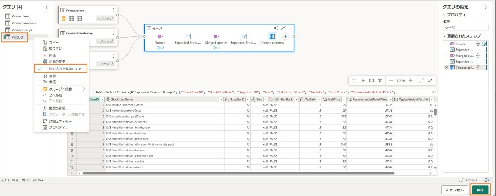

18. ビジュアル クエリ エディターのメニューから**ビューとして保存**を選択します。[ビューとして保存] ダイアログが開きます。SQL クエリが使用可能になっていることに注目してください。選択すれば、そのクエリを確認することができます。 

19. **ビュー名**に **Product** と入力します。 

20. **OK** を選択してビューを保存します。 

    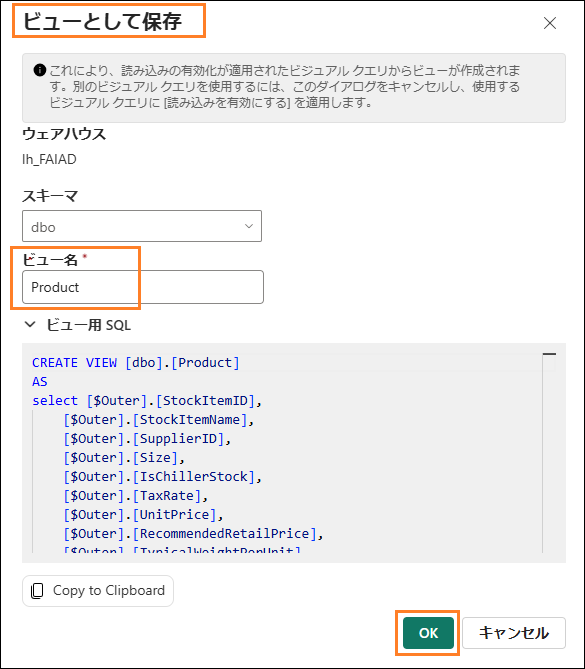

   ビューが保存されると、アラートが表示されます。 

21. [エクスプローラー]パネル (左) で、**Views** を展開します。新しく作成された Product ビューがあります。 

    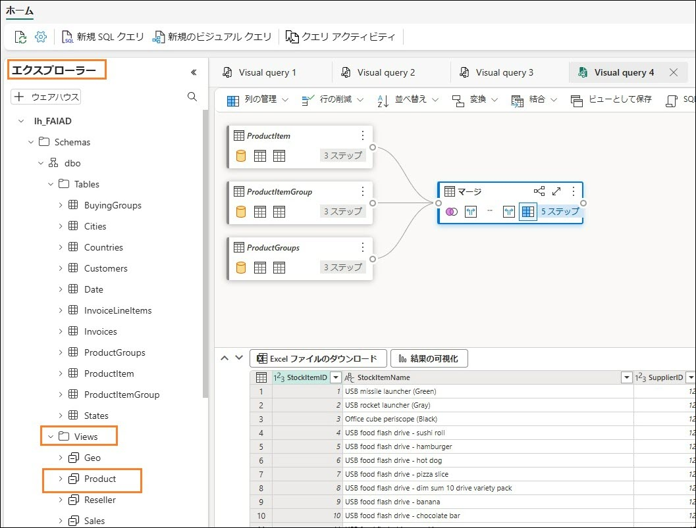
   
ADLS Gen2 データソースからデータを変換しました。このラボでは、ショートカットの作成方法を学習し、ビジュアル クエリ ビューを使用してデータを変換するためのさまざまなオプションを確認しました。 

次のラボでは、データフロー (Gen2) の使用方法と別のレイクハウスへのショートカットの作成方法を学習します。 

## リファレンス

Fabric Analyst in a Day (FAIAD) では、Microsoft Fabric で使用できる主要な機能の一部をご紹介します。サービスのメニューにあるヘルプ (?) セクションには、いくつかの優れたリソースへのリンクがあります。

  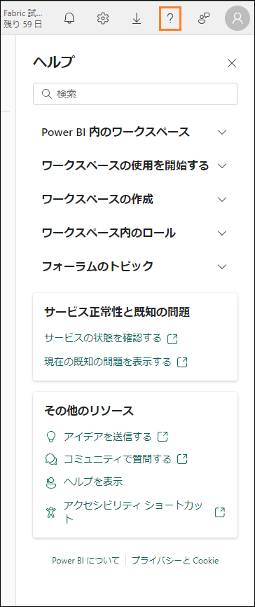

Microsoft Fabric の次のステップに役立つリソースをいくつか以下に紹介します。

- ブログ記事で [Microsoft-Fabric-のGA-に関するお知らせ](https://aka.ms/Fabric-Hero-Blog-Ignite23) の全文を確認する
- [ガイド付きツアー](https://aka.ms/Fabric-GuidedTour) を通じて Fabric を探索する
- [Microsoft Fabric の無料試用版](https://www.microsoft.com/en-us/microsoft-fabric/getting-started) にサインアップする
- [Microsoft Fabric のWeb サイト](https://www.microsoft.com/en-in/microsoft-fabric) にアクセスする
- [Fabric の学習モジュール](https://learn.microsoft.com/en-us/training/browse/?products=fabric&resource_type=module)で新しいスキルを学ぶ
- [Fabric の技術ドキュメント](https://learn.microsoft.com/en-us/fabric/) を参照する
- [Fabric 入門編の無料のe-book](https://info.microsoft.com/ww-landing-unlocking-transformative-data-value-with-microsoft-fabric.html) を読む
- [Fabric コミュニティ](https://community.fabric.microsoft.com/)に参加し、質問の投稿やフィードバックの共有を行い、他のユーザーから学びを得る

より詳しい Fabric  エクスペリエンスのお知らせに関するブログを参照してください。

- [Fabric の Data Factory エクスペリエンスに関するブログ](https://blog.fabric.microsoft.com/en-us/blog/introducing-data-factory-in-microsoft-fabric/)
- [Fabric のSynapse Data Engineering エクスペリエンスに関するブログ](https://blog.fabric.microsoft.com/en-us/blog/introducing-synapse-data-engineering-in-microsoft-fabric/)
- [Fabric のSynapse Data Science エクスペリエンスに関するブログ](https://blog.fabric.microsoft.com/en-us/blog/introducing-synapse-data-science-in-microsoft-fabric/)
- [Fabric のSynapse Data Warehousing エクスペリエンスに関するブログ](https://blog.fabric.microsoft.com/en-us/blog/introducing-synapse-data-warehouse-in-microsoft-fabric/)
- [Fabric のSynapse Real-Time Analytics エクスペリエンスに関するブログ](https://blog.fabric.microsoft.com/en-us/blog/sense-analyze-and-generate-insights-with-synapse-real-time-analytics-in-microsoft-fabric/)
- [Power BI のお知らせに関するブログ](https://powerbi.microsoft.com/en-us/blog/empower-power-bi-users-with-microsoft-fabric-and-copilot/)
- [Fabric の Data Activator エクスペリエンスに関するブログ](https://blog.fabric.microsoft.com/en-us/blog/driving-actions-from-your-data-with-data-activator/)
- [Fabric の管理とガバナンスに関するブログ](https://blog.fabric.microsoft.com/en-us/blog/administration-security-and-governance-in-microsoft-fabric/)
- [Fabric の OneLake に関するブログ](https://blog.fabric.microsoft.com/en-us/blog/microsoft-onelake-in-fabric-the-onedrive-for-data/) 
- [Dataverse とMicrosof t Fabric の統合に関するブログ](https://cloudblogs.microsoft.com/dynamics365/it/2023/05/24/new-dataverse-enhancements-and-ai-powered-productivity-with-microsoft-365-copilot/)

© 2023 Microsoft Corporation. All rights reserved.

このデモ/ラボを使用すると、次の条件に同意したことになります。

このデモ/ラボで説明するテクノロジまたは機能は、ユーザーのフィードバックを取得 し、学習エクスペリエンスを提供するために、Microsoft Corporation によって提供されます。ユーザーは、このようなテクノロジおよび機能を評価し、Microsoft にフィードバックを提供するためにのみデモ/ラボを使用できます。それ以外の目的には使用できませ ん。このデモ/ラボまたはその一部を、変更、コピー、配布、送信、表示、実行、再現、 発行、ライセンス、著作物の作成、転送、または販売することはできません。 

複製または再頒布のために他のサーバーまたは場所にデモ/ラボ (またはその一部) をコピーまたは複製することは明示的に禁止されています。
 
このデモ/ラボは、前に説明した目的のために複雑なセットアップまたはインストールを 必要としないシミュレーション環境で潜在的な新機能や概念などの特定のソフトウェアテクノロジ/製品の機能を提供します。
このデモ/ラボで表されるテクノロジ/概念は、フル機能を表していない可能性があり、最終バージョンと動作が異なることがあります。また、そのような機能や概念の最終版がリリースされない場合があります。物理環境でこのような機能を使用するエクスペリエンスが異なる場合もあります。 

**フィードバック**。このデモ/ラボで説明されているテクノロジ、機能、概念に関する フィードバックをMicrosoft に提供する場合、ユーザーは任意の方法および目的でユー
ザーのフィードバックを使用、共有、および商品化する権利を無償で Microsoft に提供するものとします。また、ユーザーは、フィードバックを含む Microsoft のソフトウェアまたはサービスの特定部分を使用したり特定部分とインターフェイスを持ったりする製 品、テクノロジ、サービスに必要な特許権を無償でサード パーティに付与します。ユーザーは、フィードバックを含めるために Microsoft がサード パーティにソフトウェアま たはドキュメントをライセンスする必要があるライセンスの対象となるフィードバックを提供しません。これらの権限は、本契約の後も存続します。 

Microsoft Corporation は、明示、黙示、または法律上にかかわらず、商品性のすべての保証および条件、特定の目的、タイトル、非侵害に対する適合性など、デモ/ラボに関する すべての保証および条件を拒否します。Microsoft は、デモ/ラボから派生する結果、出力の正確さ、任意の目的に対するデモ/ラボに含まれる情報の適合性に関して、いかなる 保証または表明もしません。

**免責事項**

このデモ/ラボには、Microsoft Power BI の新機能と機能強化の一部のみが含まれています。一部の機能は、製品の将来のリリースで変更される可能性があります。このデモ/ラ ボでは、新機能のすべてではなく一部について学習します。
 
