目次

概要

データフロー (Gen2)

- タスク 1: SharePoint のクエリをデータフローにコピーする	
- タスク 2: SharePoint への接続を作成する	
- タスク 3: People クエリのデータのコピー先を構成する
- タスク 4: SharePoint の データフローを公開して名前を変更する	
- タスク 5: Snowflake のクエリをデータフローにコピーする	
- タスク 6: Snowflake への接続を作成する	
- タスク 7: Supplier クエリと PO クエリのデータのコピー先を構成する	
- タスク 8: Snowflake のデータフローの名前を変更して公開する

ADLS Gen2 へのショートカット	
- タスク 9: Dataverse へのショートカットの作成方法	
- タスク 6: レイクハウスへのショートカットを作成する

参考資料	

## 概要 

このシナリオでは、Supplier データが Snowflake に、Customer データが Dataverse に、Employee データが SharePoint にあります。これらのデータ ソースはすべて、異なるタイミングで更新されます。データフローのデータ更新回数を最小限に抑えるために、Snowflake や SharePoint のデータ ソースごとに個別のデータフローを作成します。 

**注:** 1 つのデータフローは複数のデータ ソースに対応します。 

IT チームは、既に Dataverse へのリンクを確立しており、必要なデータ変換を適用して、その変換を Power BI Desktop ファイルにミラーリングしています。このデータは管理者ワークスペースのレイクハウスに取り込まれており、テーブルへのアクセスが許可されています。ここでは、IT チームが作成したレイクハウス用のショートカットを作成します。 

このラボを終了すると、次のことが学べます。 

- データフロー (Gen2) を使用して SharePoint に接続し、データをレイクハウスに取り込む方法 

- データフロー (Gen2) を使用して Snowflake に接続し、データをレイクハウスに取り込む方法 

- 共有されているレイクハウスからデータを取り込む方法 

## データフロー (Gen2) 

#### タスク 1: SharePoint のクエリをデータフローにコピーする 

1. ラボ 2 のタスク 9 で作成した Fabric ワークスペース **FAIAD_<ユーザー名>** に戻りましょう。 

2. 画面左下にある **Fabric エクスペリエンス セレクター アイコン**を選択します。Fabric エクスペリエンスのダイアログが開きます。 

3. ダイアログで **Data Factory** を選択します。**Data Factory のホーム ページ**に移動します。 

   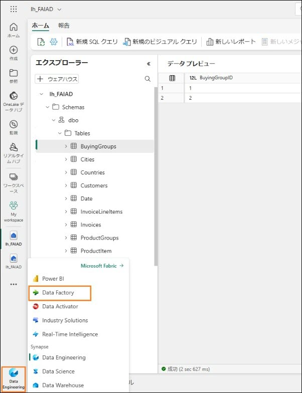

4. [推奨アイテム] で、**データフロー (Gen2)** を選択します。 

   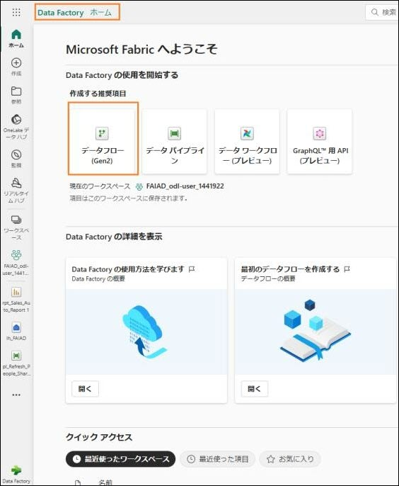

   **データフローのページ**が表示されます。データフロー (Gen2) のインターフェイスは、Power BI Desktop の Power Query に似ています。クエリは、Power BI Desktop から データフロー (Gen2) にコピーすることができます。これを試してみましょう。 

 

5. まだ開いていない場合は、お使いのラボ環境のデスクトップにある **Reports** フォルダー内の **FAIAD.pbix** を開きます。 

6. リボンから**ホーム -> データの変換**を選択します。Power Query ウィンドウが開きます。前のラボで確認したように、左パネルのクエリはデータ ソースごとに整理されています。 

7. 左パネルの SharepointData フォルダーにある **People** クエリを**選択**します。 

8. **右クリック**して**コピー**を選択します。 

   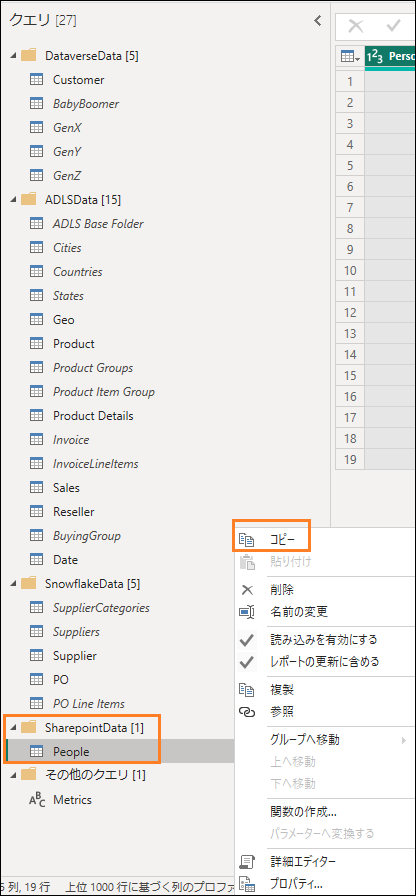

9. ブラウザーの **データフローの画面**に戻ります。 

10. **データフローのペイン**で、**Ctrl+V** を押します (現時点では右クリックの貼り付けには対応していません)。MAC デバイスを使用している場合は、Cmd+V キーを使用して貼り付けてください。 

    **注:** ラボ環境で作業している場合は、画面の右側にある省略記号を選択してください。スライダーを使用して VM ネイティブ クリップボードを有効にします。ダイアログで [OK] を選択します。クエリの貼り付けが済んだら、このオプションを無効にしてかまいません。 

    クエリが貼り付けられ、左パネルで使用できます。SharePoint への接続が作成されていないため、接続を構成するよう求める警告メッセージが表示されます。 

## タスク 2: SharePoint への接続を作成する 

1. **接続の構成**を選択します。 

    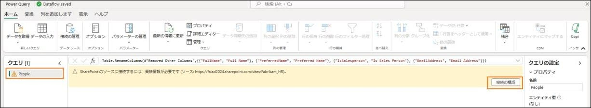

2. [データ ソースへの接続] ダイアログが開きます。**接続**ドロップダウンで、**新しい接続の作成**が選択されていることを確認します。 

3. **認証の種類は組織アカウント**にします。 

4. **接続**を選択します。 

   **注:** サインインは、資格情報を使用して行われます。資格情報は、次のスクリーンショットとは異なります。 

   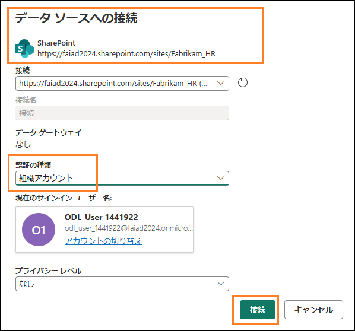

## タスク 3: People クエリのデータのコピー先を構成する 

接続が確立され、プレビュー パネルにデータが表示されます。クエリの [適用されたステップ] を自由に見て回ってみましょう。次は、People のデータをレイクハウスに取り込む必要があります。 

1. **People** クエリを選択します。 

2. リボンから**ホーム -> データの同期先の追加 -> レイクハウス**を選択します。 

   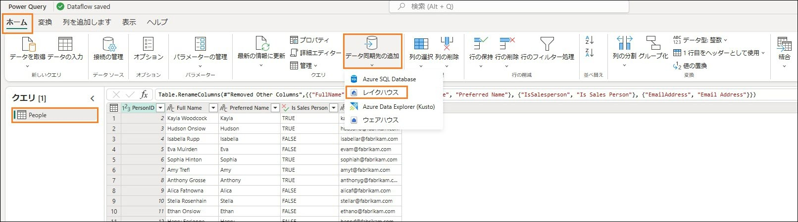

3. データ変換先に接続ダイアログが開きます。レイクハウスへの新しい接続を作成する必要があります。接続ドロップダウンで新しい接続の作成を選択し、認証の種類を組織アカウントに設定して、次へを選択します。 

   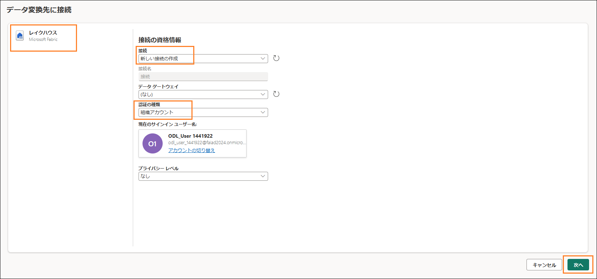

4. 宛先ターゲットの選択ダイアログが開きます。新しいテーブルを作成しているため、**新しいテーブル ラジオ ボタン**がオンになっていることを確認してください。 

5. 先ほど作成したレイクハウスにテーブルを作成する必要があります。左パネルで、**レイクハウス -> FAIAD_<ユーザー名>** に移動します。 

6. **lh_FAIAD** を選択します。 

7. テーブル名は **People** のままにします。 

8. **次へ**を選択します。 

   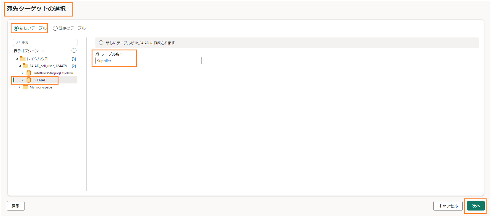

9. 宛先の設定を選択するダイアログが開きます。**自動設定を使用するが有効になっている**ことを確認してください。 

   **注:** 自動設定は無効にすることができます。また、更新方法を設定するオプションやスキーマに関するオプションがあります。これらのオプション確認したら、**自動設定を使用するが有効になっている**ことを確認してください。 

10. **設定の保存**を選択します。 

    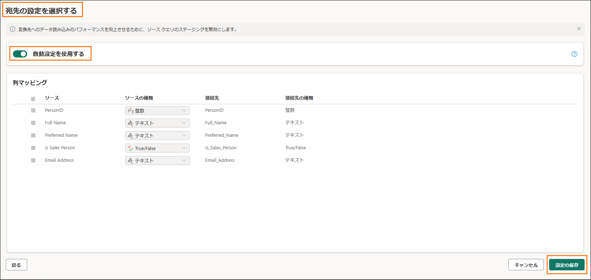 

## タスク 4: SharePoint の データフローを公開して名前を変更する 

1. **Power Query のウィンドウ**が表示されます。**右下隅**を見ると、[データ同期先]が**レイクハウス**に設定されています。 

2. 右下隅の**公開**を選択します。 

   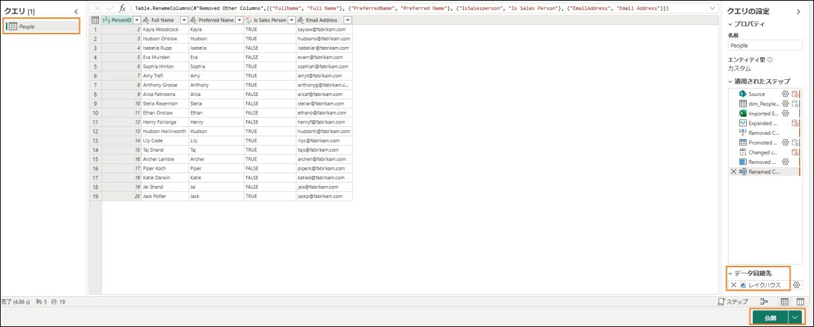

**注: FAIAD_<ユーザー名>** ワークスペースが表示されます。データフローが公開されるまで、しばらくかかる場合があります。 

3. ここで操作しているデータフローは Dataflow 1 です。先に進む前に名前を変更しましょう。Dataflow 1 の横にある**省略記号 (…)** をクリックします。**プロパティ**を選択します。 

   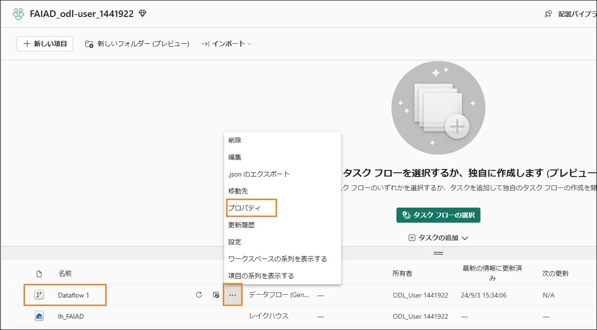
 
4. データフローのプロパティ ダイアログが開きます。**名前を df_People_SharePoint** に変更します。 

5. **説明**テキスト ボックスに、**Dataflow to ingest People data from SharePoint to Lakehouse** と入力します。 

6. **保存**を選択します。 

   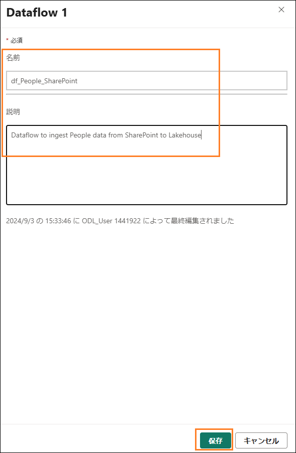

   **FAIAD_<ユーザー名> ワークスペース**が表示されます。 

7. **lh_FAIAD** を選択して、レイクハウスに移動します。 

8. レイクハウス ビューが表示されていることを確認してください (SQL 分析エンドポイントではありません)。 

9. 現在、**People** テーブルがレイクハウスで使用可能になっていることを確認してください。 

   **注:** 新しく作成されたテーブルが表示されない場合は、テーブルの横にある省略記号を選択し、[更新] を選択してテーブルを更新してください。 

   これで、すべてのデータがレイクハウスに取り込まれました。次のラボでは、データフローの更新スケジュールを設定します。 

## タスク 5: Snowflake のクエリをデータフローにコピーする 

1. Fabric ワークスペース **FAIAD_<ユーザー名>** に戻りましょう。 

2. 上部のメニューから**新しい項目 -> データフロー (Gen2)** を選択します。 

    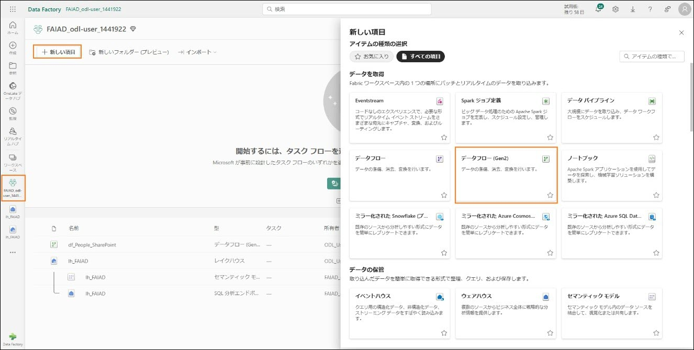

**データフローのページ**が表示されます。ここまでデータフローについて説明してきました。次は、Power BI Desktop からデータフローにクエリをコピーしましょう。 

3. まだ開いていない場合は、お使いのラボ環境のデスクトップにある **Reports** フォルダー内の **FAIAD.pbix** を開きます。 

4. リボンから**ホーム -> データの変換**を選択します。Power Query ウィンドウが開きます。前のラボで確認したように、左パネルのクエリはデータ ソースごとに整理されています。 

5. 左パネルで、SnowflakeData フォルダーにある次のクエリを **Ctrl+Select**または Shift+Select を押しながら選択します。 

    a. SupplierCategories 

    b. Suppliers 

    c. Supplier 

    d. PO 

    e. PO Line Items 

6. **右クリックしてコピー**を選択します。 

   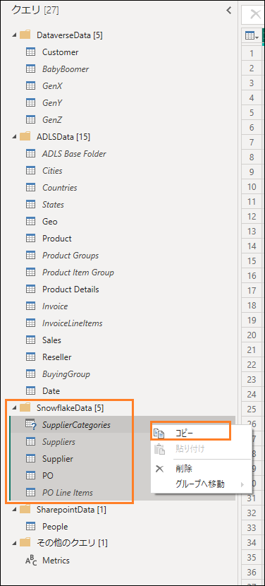

7. **ブラウザー**に戻ります。 

8. **データフローのペインで中央のペイン**を選択し、**Ctrl+V** を押します (現時点では右クリックの貼り付けには対応していません)。MAC デバイスを使用している場合は、Cmd+V キーを使用して貼り付けてください。 

**注:** ラボ環境で作業している場合は、画面の右側にある省略記号を選択してください。スライダーを使用して **VM ネイティブ クリップボードを有効**にします。ダイアログで [OK] を選択します。クエリの貼り付けが済んだら、このオプションを無効にしてかまいません。 

  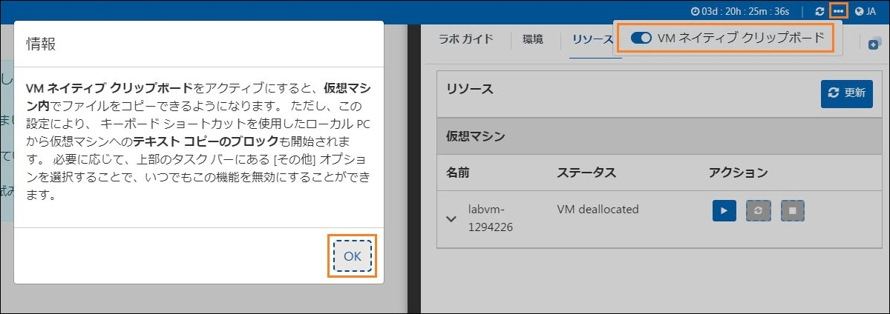

## タスク 6: Snowflake への接続を作成する 

5 つのクエリが貼り付けられ、左側に [クエリ] パネルが表示されています。Snowflake 用の接続が作成されていないため、接続を構成するよう求める警告メッセージが表示されます。 

1. **接続の構成**を選択します。 

   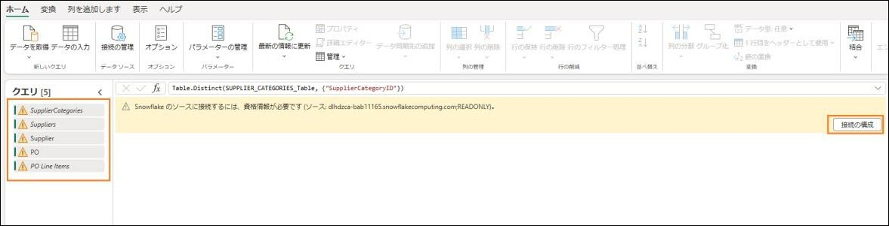

2. [データ ソースへの接続] ダイアログが開きます。**接続**ドロップダウンで、**新しい接続の作成**が選択されていることを確認します。 

3. **認証の種類**は **Snowflake** にします。 

4. [環境変数] タブ ([ラボ ガイド] タブの横) で確認できる **Snowflake のユーザー名とパスワード**を入力します。 

5. **接続**を選択します。 

    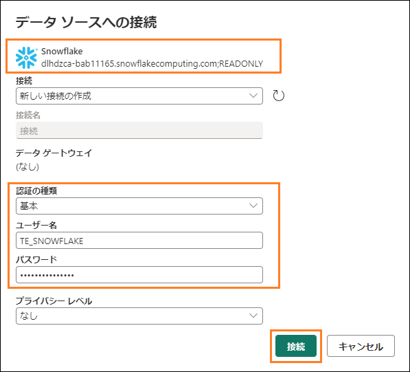 

   接続が確立され、プレビュー パネルにデータが表示されます。クエリの [適用されたステップ] を自由に見て回ってみましょう。基本的に、Suppliers クエリには仕入先の詳細が、SupplierCategories にはその名前が示すように仕入先のカテゴリがあります。これら 2 つのテーブルを結合され、必要な列がある Supplier ディメンションが作成されます。同様に、PO Line Items と PO がマージされ、PO ファクトが作成されます。次は、Supplier と PO のデータをレイクハウスに取り込む必要があります。 

## タスク 7: Supplier クエリと PO クエリのデータのコピー先を構成する 

1. **Supplier** クエリを選択します。 

2. リボンから**ホーム -> データの同期先の追加 -> レイクハウス**を選択します。 

   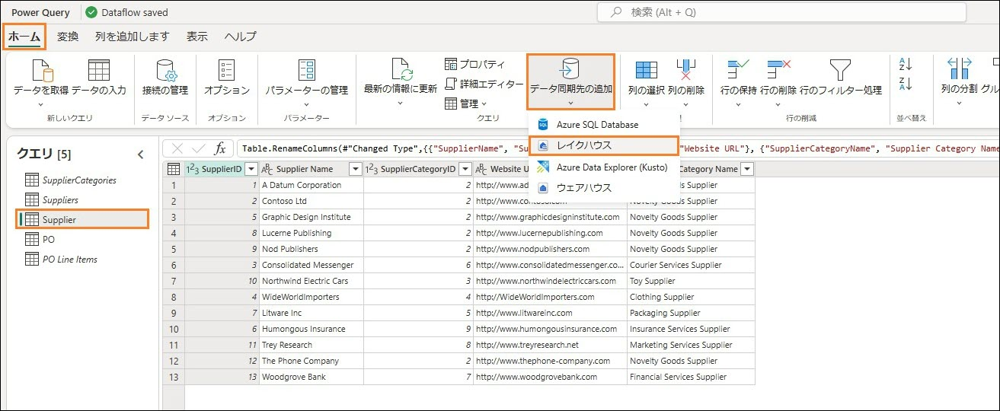

3. データ変換先に接続ダイアログが開きます。**接続ドロップダウン**から **Lakehouse (なし)**を選択します。 

4. **次へ**を選択します。 

    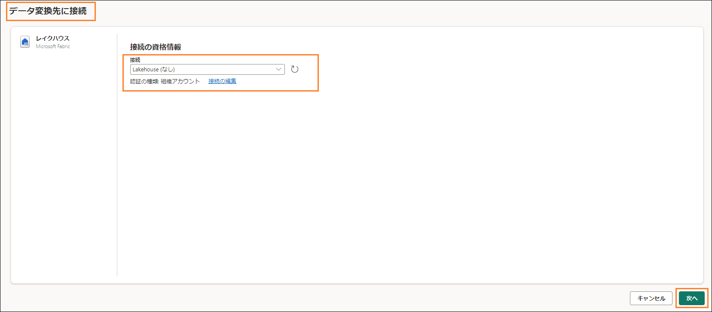

5. 宛先ターゲットの選択ダイアログが開きます。新しいテーブルを作成しているため、**新しいテーブル ラジオ ボタンがオン**になっていることを確認してください。 

6. 先ほど作成したレイクハウスにテーブルを作成する必要があります。左パネルで、**レイクハウス -> FAIAD_<ユーザー名>** に移動します。 

7. lh_FAIAD を選択します。 

8. テーブル名は **Supplier** のままにします。 

9. **次へ**を選択します。 

10. 宛先の設定を選択するダイアログが開きます。自動設定を使用します。これによりデータの完全な更新が行われます。また、必要に応じて列の名前も変更されます。**設定の保存**を選択します。 

    

Power Query のウィンドウが表示されます。右下隅を見ると、[データ同期先]がレイクハウスに設定されています。同様に、PO クエリのデータのコピー先を設定します。完了すると、以下のスクリーンショットに示すように、PO クエリのデータ同期先がレイクハウスに設定されます。 

 

 

タスク 8: Snowflake のデータフローの名前を変更して公開する 

画面上部で、Dataflow 1 の横にある矢印を選択して名前を変更します。 

ダイアログで、名前を df_Supplier_Snowflake に変更します。 

Enter キーを押して名前の変更を保存します。 

 

右下隅の公開を選択します。 

 

FAIAD_<ユーザー名> ワークスペースが表示されます。データフローが公開されるまで、しばらくかかる場合があります。 

lh_FAIAD を選択して、レイクハウスに移動します。 

レイクハウス ビューが表示されていることを確認してください (SQL 分析エンドポイントではありません)。 

現在、PO テーブルと Supplier テーブルがレイクハウスで使用可能になっていることを確認してください。 

注: 新しく作成されたテーブルが表示されない場合は、テーブルの横にある省略記号を選択し、[更新] を選択してテーブルを更新してください。 

次は、Dataverse からデータを取り込むショートカットを作成しましょう。 

ADLS Gen2 へのショートカット 

タスク 9: Dataverse へのショートカットの作成方法 

レイクハウス lh_FAIAD が表示されているはずです。レイクハウス ビューが表示されていることを確認してください (SQL 分析エンドポイントではありません)。 

 

エクスプローラー パネルで、Tables の横にある省略記号を選択します。 

新しいショートカットを選択します。 

 

[新しいショートカット] ダイアログが開きます。外部ソースで、Dataverse を選択します。 

注: 前のラボでは、同様の手順に従って、Azure Data Lake Storage Gen2 へのショートカットを作成しました。 

 

[接続設定] ダイアログが開きます。環境のドメインに org6c18814a.crm.dynamics.com と入力します。 

認証の種類は組織アカウントのままにします。 

サインインを選択します。 

 

[アカウントにサインインする] ダイアログが開きます。ご自身のアカウントを選択して、サインインします。 

注: 使用するアカウントは、次のスクリーンショットとは異なります。 

 

[接続設定] ダイアログで、次へを選択します。 

Dataverse からさまざまなバケット/ディレクトリを選択できるダイアログが表示されます。数多くの多様なバケットを使用できることを確認してください。必要なバケットを選択して、ラボ 3 と同様のプロセスに従います (ビジュアル クエリを使ってデータを変換し、ビューを作成します)。また、このラボの前の手順と同様に、データフロー (Gen2) を使用して SharePoint に接続することもできます。ただし、使用できるオプションは他にもあることを覚えておいてください。 

このシナリオでは、IT チームは、既に Dataverse へのリンクを確立しており、必要なデータ変換を適用して、その変換を Power BI Desktop ファイルにミラーリングしています。このデータは管理者ワークスペースのレイクハウスに取り込まれており、テーブルへのアクセスが許可されています。IT チームの貢献によってすべての作業が完了しているので、管理者ワークスペースでこのレイクハウスへのショートカットを作成することができます。 

[新しいショートカット] ダイアログでキャンセルを選択して、レイクハウスに戻ります。 

 

タスク 6: レイクハウスへのショートカットを作成する 

エクスプローラー パネルで、Tables の横にある省略記号を選択します。 

新しいショートカットを選択します。 

 

[新しいショートカット] ダイアログが開きます。[内部ソース] から Microsoft OneLake を選択します。 

 

データ ソースの種類を選択ダイアログが開きます。2 つのデータ ソースがあることに注意してください。 

lh_FAIAD - これは、作成したレイクハウスです。 

lh_dataverse - これは、作成したレイクハウス管理です。 

lh_dataverse を選択します。 

次へを選択します。 

 

左パネルで、lh_dataverse -> Tables を展開します。IT 管理者が Customer テーブルへのアクセスを許可していることを確認してください。 

Customer を選択します。 

次へを選択します。 

 

次のダイアログで、作成を選択します。lh_FAIAD レイクハウスに戻ります。 

 

左側のエクスプローラー パネルで、新しい Customer テーブルが作成されていることを確認してください。 

Customer テーブルを選択すると、プレビュー パネルにデータが表示されます。 

別のレイクハウスへのショートカットが正常に作成されました。 

次のラボでは、更新スケジュールを設定します。 

 

 
