# Microsoft Fabric - Fabric Analyst in a Day - ラボ 6

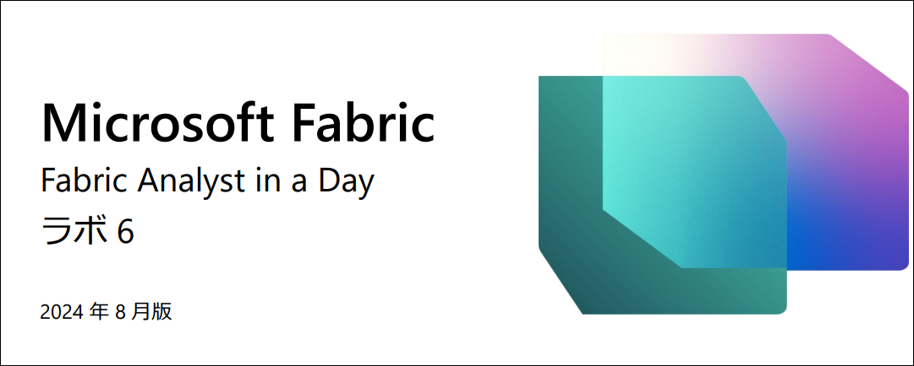 

# 目次
- 概要	

- レイクハウス– データの分析	

    - タスク 1: SQL を使用してデータをクエリする	
    - タスク 2: T-SQL 結果を視覚化する	

- レイクハウス– セマンティックモデリング	
    - タスク 3: セマンティックモデルを作成する	
    - タスク 4: リレーションシップを作成する	
    - タスク 5: メジャーを作成する	
    - タスク 6: オプションセクション– リレーションシップを作成する	
    - タスク 7: オプションセクション– メジャーを作成する	

- 参考資料	
 
# 概要

さまざまなソースからのデータがレイクハウスに取り込まれています。このラボでは、セマンティック  モデルを操作します。通常、リレーションシップの作成やメジャーの追加などのモデリングアクティビティはPower BI Desktop で実行していました。ここでは、サービス内でこれらのモデリングアクティビティを実行する方法を学びます。

このラボを終了すると、次のことが学べます。

- SQL 分析エンドポイントでの SQL ビューの使用
- セマンティックモデルを作成する

# レイクハウス– データの分析
## タスク 1: SQL を使用してデータをクエリする
1. ラボ 2 のタスク 9 で作成した Fabric ワークスペース **FAIAD_<ユーザー名\>** に戻りましょう。
2. 選択する場合、**タスクフローを最小化して**項目のリスト全体を表示します。
3. レイクハウス、セマンティックモデル、SQL エンドポイントという 3 種類の lh_FAIAD が表示されます。前のラボでは、レイクハウスについて説明し、SQL 分析エンドポイントを使用してビジュアル クエリを作成しました。引き続きこのオプションについて確認するためには、**lh_FAIAD SQL 分析エンドポイント** オプションを選択します。エクスプローラーの **SQL ビュー**が表示されます。
 
   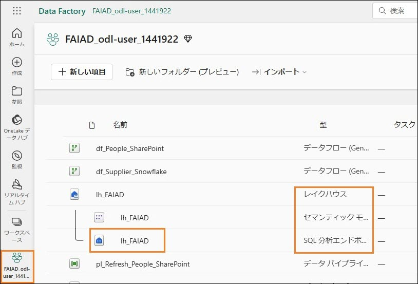 

   データ モデルを作成する前にデータを調べたい場合は、SQL  を使用して行うことができま す。SQL を使用するには 2 つのオプションがあります。オプション 1 は、前のラボで使用したビジュアルクエリです。オプション 2 はTSQL コードの書き込みです。これは、開発者向けのオプションです。これについて詳しく説明します。

   たとえば、SQL を使用して、サプライヤーが販売した Units  をすばやく調べたいとします。

   レイクハウス内の SQL 分析エンドポイントで、左側のパネルに [Tables] が表示されています。[Tables] を展開すると、テーブルを構成する列を表示できます。また、SQL ビュー、関数、ス トアド プロシージャを作成するオプションもあります。SQL の知識がある場合は、これらのオプションを自由に検討してください。では、簡単な SQL クエリを記述してみましょう。

4. **上部のメニュー**で**新規 SQL クエリ**を選択するか、**左側のパネルの下部**で**クエリ**を選択します。SQL クエリ ビューが表示されます。
 
   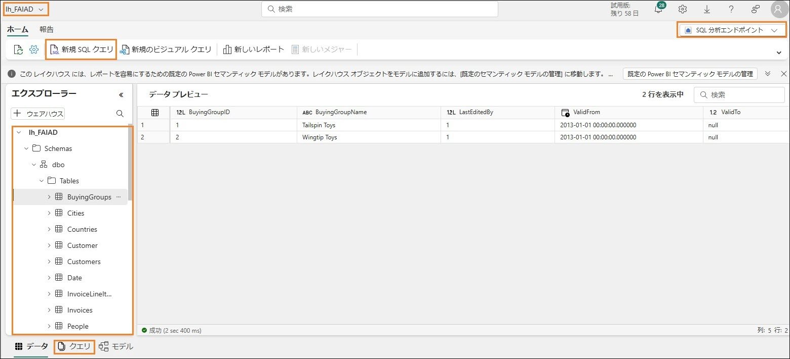 

5. **以下の SQL クエリ**を**クエリ ウィンドウ**に貼り付けます。このクエリは、サプライヤー名ごとに単位数を返します。Sales テーブルをProduct テーブルおよび Supplier テーブルと
結合して、これを実現します。

   ```
   SELECT su.SupplierName, SUM(Quantity) as Units
   FROM dbo.Sales s
   JOIN dbo.Product p on p.StockItemID = s.StockItemID
   JOIN dbo.Supplier su on su.SupplierID = p.SupplierID
   GROUP BY su.SupplierName
   ```

6. 結果を見るには、SQL エディター メニューで **Run** をクリックします。
7. **ビューとして保存**を選択すると、このクエリをビューとして保存できます。
8. **左側のエクスプローラー** パネルの **Queries** セクションで、このクエリが**マイ クエリ**の下に **SQL query 1** として保存されています。ここで、クエリの名前を変更し、将来使用す るために保存することができます。また、**共有クエリ**  フォルダーを使用して、共有されているクエリを表示することもできます。

   **注記:** 前のラボで作成したビジュアル クエリは、[マイ クエリ] フォルダでも使用できます。
 
   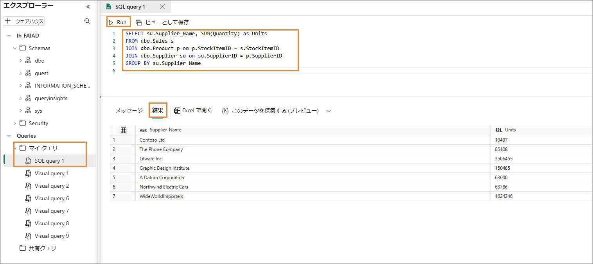  

## タスク 2: T-SQL 結果を視覚化する
1. このクエリの結果を視覚化することもできます。クエリペインで**クエリを強調表示**します。
2. [結果]  ペインメニューで、**このデータを探索する(プレビュー)->  結果の視覚化**を選択します。

   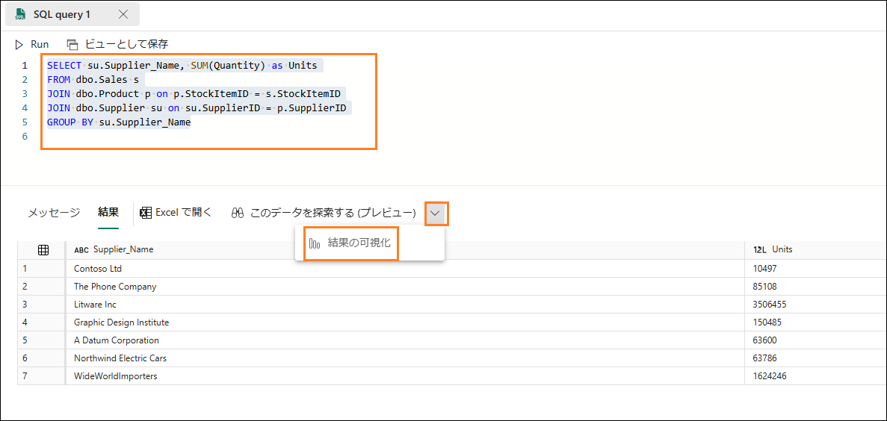 

3. **結果の視覚化**ダイアログが開きます。続行を選択します。

    結果の視覚化ダイアログが開き、Power BI Desktop レポートビューのように見えます。これには、Power BI Desktop レポート ビューで使用できるすべての機能があります。ページの書 式を設定したり、さまざまなビジュアルを選択したり、フィルタを追加したりなどです。こ のコースでは、これらのオプションについては触れません。

4. **データ** ペインを展開し、**SQL クエリ 1** を展開します。
 
5. **Supplier_Name** および **Units フィールド**を選択します。テーブル ビジュアルが作成されます。

   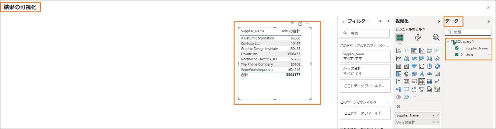 

6. **視覚化**セクションで、**積み上げ縦棒グラフ**を選択して視覚化タイプを変更します。
7. 画面右下の**レポートとして保存**を選択します。

   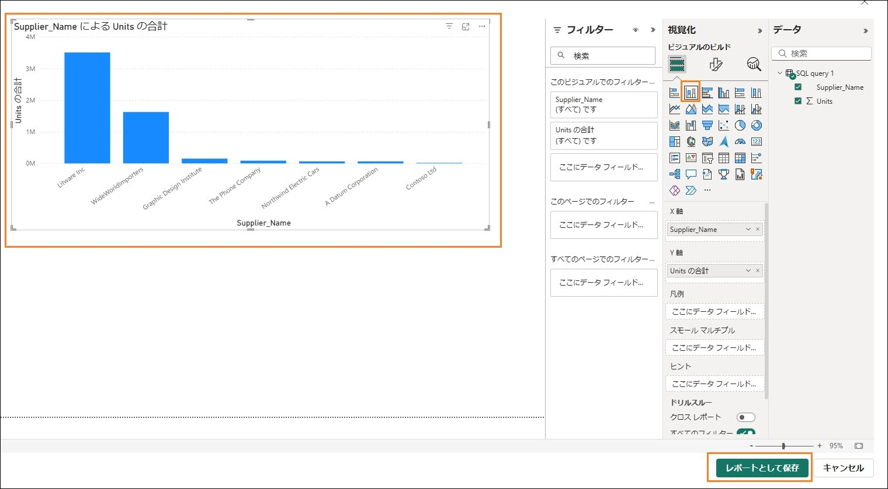 

8. [レポートの保存] ダイアログが開きます。**Units by Supplier** を**レポートの名前を入力テキストボックス**に入力します。
9. 保存先のワークスペースがご自身の Fabric ワークスペース **FAIAD<ユーザー名>** であることを確認します
10. **保存**を選択します。
 
    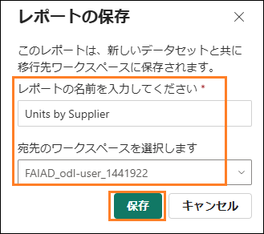  

    SQL クエリの画面に戻ります。

# レイクハウス– セマンティックモデリング
## タスク 3: セマンティックモデルを作成する

1. **下部パネル**から、**モデル**を選択します。中央のペインが、Power BI Desktop に表示されるモデル ビューと似ていることがわかります。

   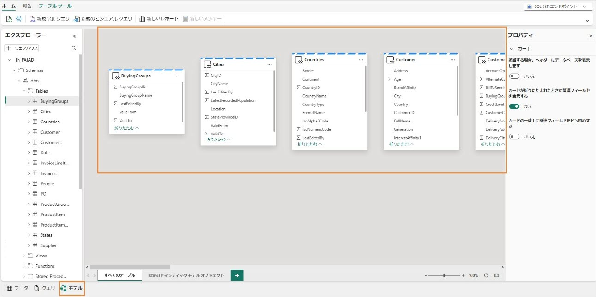 

   これは、レイクハウスによって作成されるデフォルト モデルです。ただし、デフォルトモデルにはいくつかの制限があります (測定の形式を設定する機能など)。また、モデルで必要なのはテーブルのサブセットのみです。そのため、新しいセマンティック モデルを作成します。
 
2. 右上のメニューから、**SQL    分析エンドポイントの横の矢印を選択**します。
3. **レイクハウス**を選択して、レイクハウス ビューに移動します。

   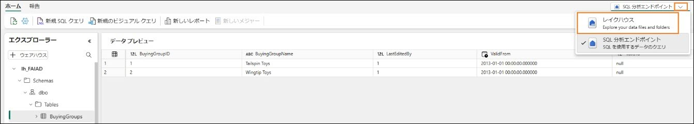 

4. メニューから、**ホーム ->  新しいセマンティックモデル**を選択します。
5. [新しいセマンティック モデル] ダイアログが開きます。Direct Lake セマンティック モデル名として **sm_FAIAD** を入力します。

6. 既定でテーブルのサブセットを作成するオプションがあります。前のラボでビューを作 成したことを思い出してください。これらのビューをモデルに含めます。**検索バー**の**アイコン**を**クリック**し、**Views**    を選択します。現在、ビューを表示および選択するオプ ションがあります。

    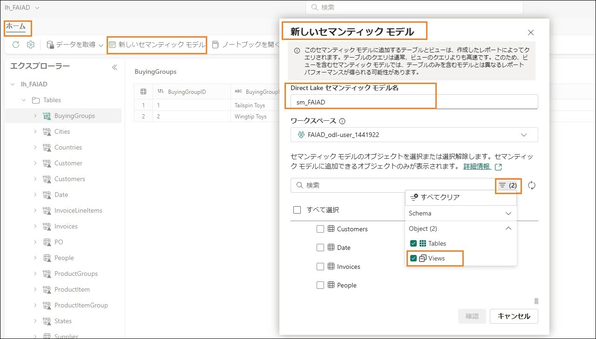 

7. 次のテーブル/ビューを**選択**します。

    a. **Date**

    b. **People**

    c. **Customer**

    d. **PO**

    e. **Supplier**

    f. **Geo**
    
    g. **Reseller**

    h. **Sales**

    i. **Product**

8. **確認**を選択します。

   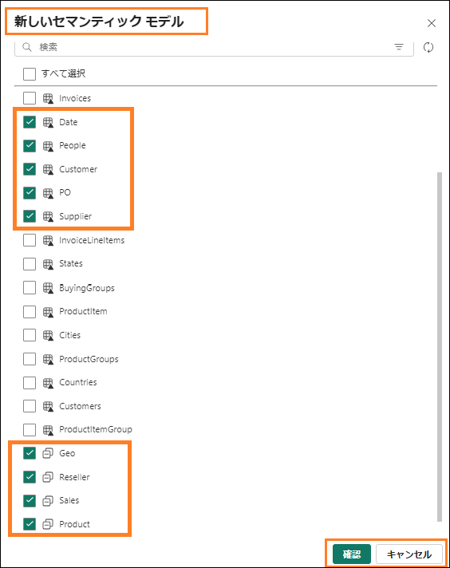 

## タスク 4: リレーションシップを作成する
選択したテーブルを使用して、新しいセマンティック モデルに移動します。必要に応じて、自由にテーブルの**配置を変更**してください。一部のテーブル (Geo、Reseller、Sales、Product) では、テーブルの右側に警告記号が付いていることに注意してください。これらがビューだからです。これらのビューのフィールドを使用して作成されたビジュアルは、Direct Query モードになります。Direct Lake モードではありません。

**注記:** Direct Lake モードの方が Direct Query モードより高速です。
 
   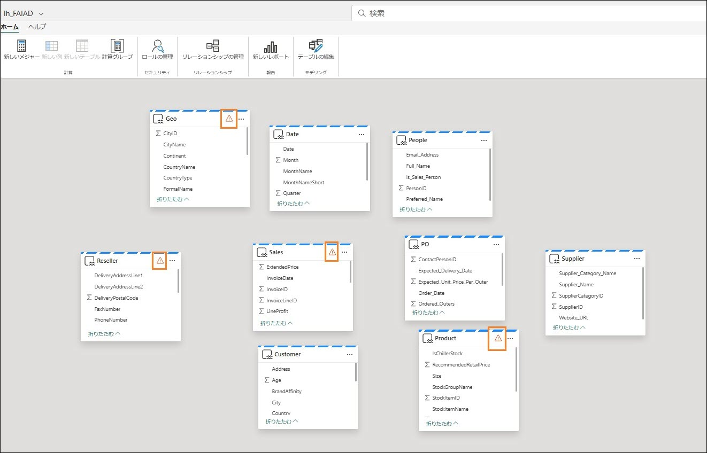  

最初の手順では、これらのテーブル間にリレーションシップを作成します。

1. Sales テーブルとReseller テーブルの間にリレーションシップを作成しましょう。**Sales** テーブルで **ResellerID** を選択して、**Reseller** テーブルの **ResellerID** までドラッグします。

   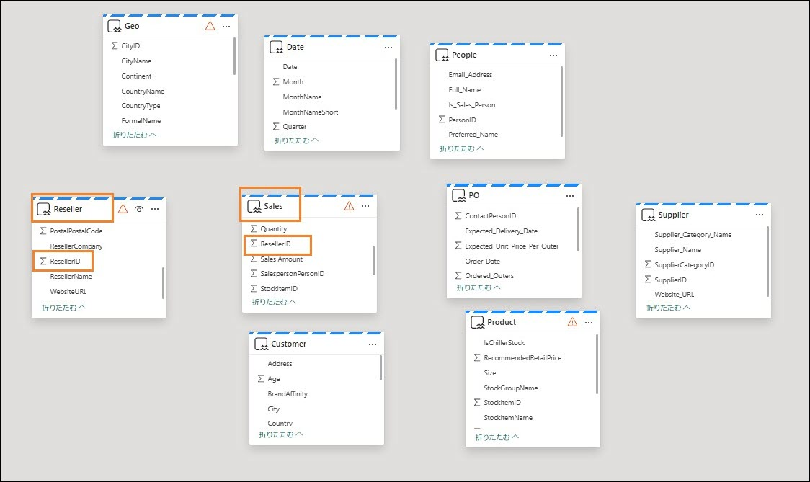 
 
2. [新しいリレーションシップ] ダイアログが開きます。**テーブルから**が **Sales**、**列**が**ResellerID** であることを確認します。
3. **テーブル表示**が **Reseller**、**列**が **ResellerID** であることを確認します。
4. **カーディナリティ**が**多対一(*:1)** であることを確認します。
5. **クロス  フィルターの方向が単一**であることを確認します。
6. **保存**を選択します。

   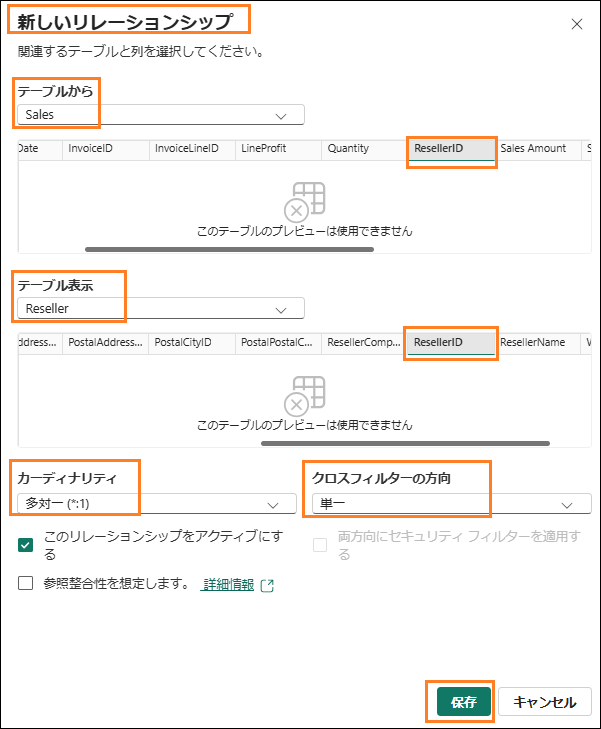 

7.	同様に、Sales テーブルと Date テーブルの間にリレーションシップを作成しましょう。**Sales** テーブルで **InvoiceDate** を選択して、**Date** テーブルの **Date** までドラッグします。

8. [新しいリレーションシップ] ダイアログが開きます。**テーブルから**が **Sales、** **列**が**InvoiceDate** であることを確認します。

9. **テーブル表示**が **Date、** **列**が **Date** であることを確認します。

10. **カーディナリティ**が**多対一(*:1)** であることを確認します。

11. **クロス  フィルターの方向**が**単一**であることを確認します。

12. **保存**を選択します。
 
    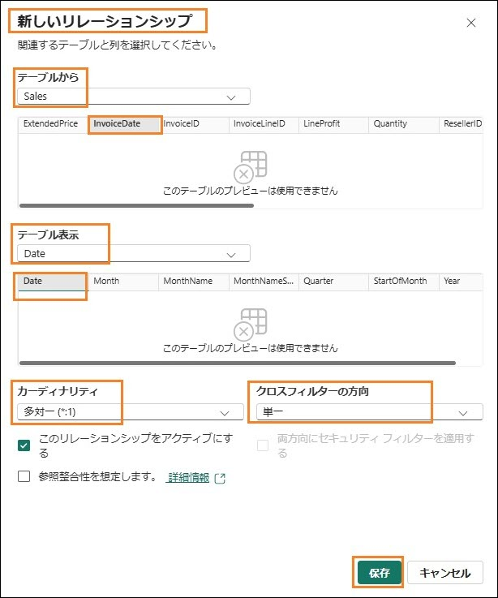  

13. 同じようにして、**Sales** テーブルと **Product** テーブルの間の**多対一**リレーションシップを作成します。**Sales** テーブルの **StockItemID** と **Product** テーブルの **StockItemID** を選択します。
    **注記:** 更新はすべて自動的に保存されます。

    **チェックポイント:** 以下のスクリーンショットに示すように、このモデルには 3 つのリレーションシップ(Sales とReseller テーブルの間、Sales と Date テーブルの間、Sales とProduct テーブルの間) が必要です。
    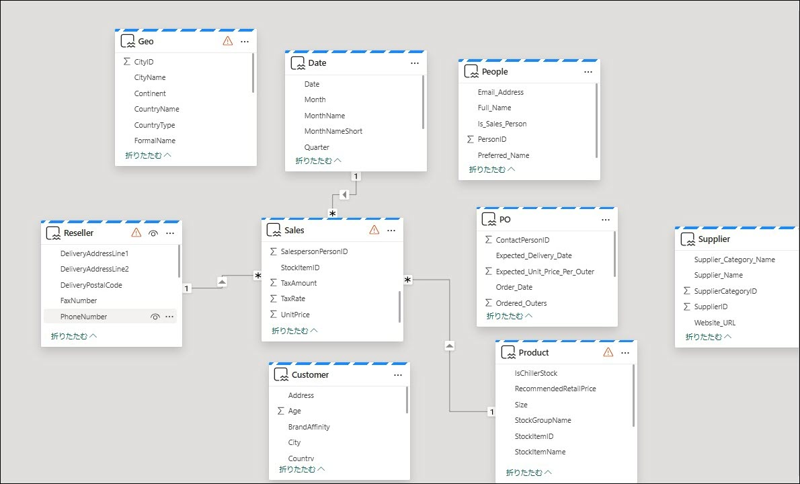  

    時間の都合上、すべてのリレーションシップの作成は行いません。時間があれば、ラボの最 後にあるオプション セクションを完了してください。オプション セクションでは、残りの リレーションシップを作成するステップについて説明しています。

## タスク 5: メジャーを作成する
Sales ダッシュボードを作成するために必要ないくつかのメジャーを追加しましょう。
1. モデル ビューで **Sales テーブル** を選択します。Sales テーブルにメジャーを追加するためです。
2. 上部のメニューから、**ホーム-> 新しいメジャー**を選択します。数式バーが表示されます。
3. **数式バー**に **Sales = SUM(Sales[Sales Amount])** と入力します。
4. 数式バーの左側の**チェック   マーク**をクリックするか、**入力**ボタンをクリックします。
5. 右側にプロパティ パネルを展開します。
6. **書式設定**セクションを展開します。
7. **書式**ドロップダウンで**通貨**を選択します。
8. 小数点以下表示桁数を **0** に設定します。
 
   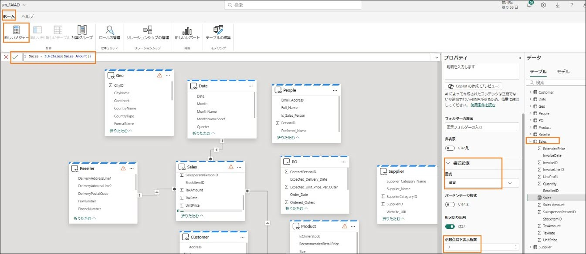  

9. 上部のメニューで **Sales テーブル**を選択した状態で、**ホーム -> 新しいメジャー**を選択します。数式バーが表示されます。
10. **数式バー**に **Units = SUM(Sales[Quantity])** と入力します。
11. 数式バーの左側の**チェック   マーク**をクリックするか、**入力**ボタンをクリックします。
12. 右側の [プロパティ] パネルで**書式設定**セクションを展開します ([プロパティ] パネルが読み込むまでに少し時間がかかる場合があります)。
13. **書式**ドロップダウンで**整数**を選択します。
14. スライダーを使用して、**桁区切り記号**を**はい**に設定します。

    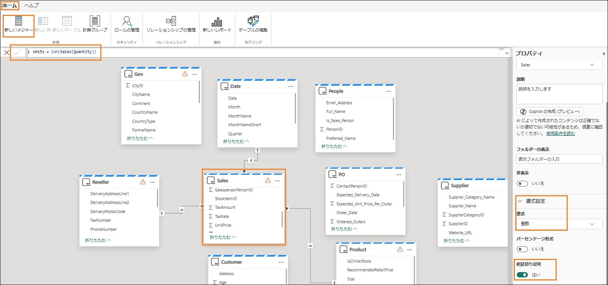 
 
15. 上部のメニューで **Sales テーブル**を選択した状態で、**ホーム -> 新しいメジャー**を選択します。数式バーが表示されます。
16. **数式バー**に **Sales Orders = DISTINCTCOUNT(Sales[InvoiceID])** と入力します。
17. 数式バーの左側の**チェック   マーク**をクリックするか、**入力**ボタンをクリックします。
18. 右側の [プロパティ]  パネルで、**書式設定**セクションを展開します。
19. **書式**ドロップダウンで**整数**を選択します。
20. スライダーを使用して、**桁区切り記号**を**はい**に設定します。

     

21. **データ パネル** (右側) で、**モデル**を選択します。これにより、セマンティック モデルのすべての品目を整理するのに役立つビューが提供されます。
22. 作成したすべてのメジャーを表示するには、**セマンティック モデル-> メジャー**を選択します。
23. また、**個々のテーブルを展開**して、各テーブルの列、階層、メジャーを表示することも できます。
 
    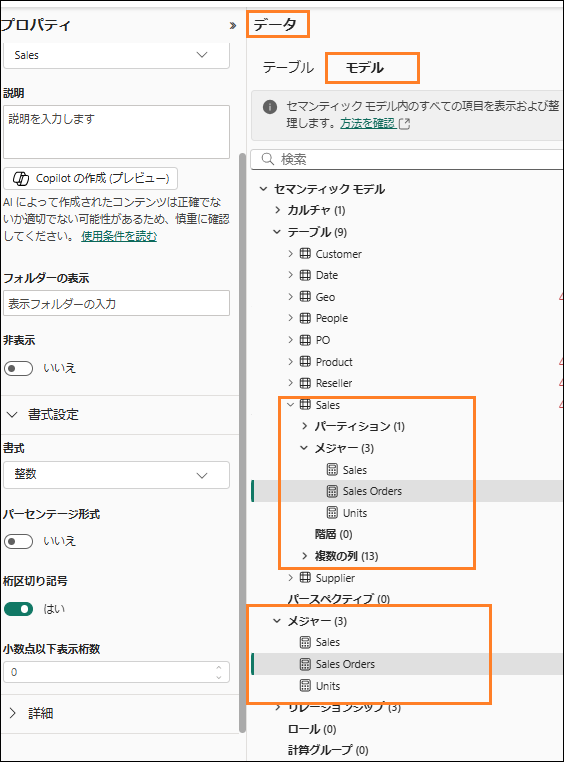  

    これについても、時間の都合上、すべてのメジャーの作成は行いません。時間があれば、ラ ボの最後にあるオプション セクションを完了してください。このオプションセクションでは、残りのメジャーを作成するステップについて説明しています。

    セマンティックモデルを作成しましたが、次のステップではレポートを作成します。これ は次のラボで行います。

## タスク 6: オプションセクション– リレーションシップを作成する

残りのリレーションシップを追加しましょう。

1. メニューから、[ホーム] -> [リレーションシップの管理] の順に選択します。
2. [リレーションシップの管理] ダイアログが開きます。[新しいリレーションシップ] を選択します。
 
   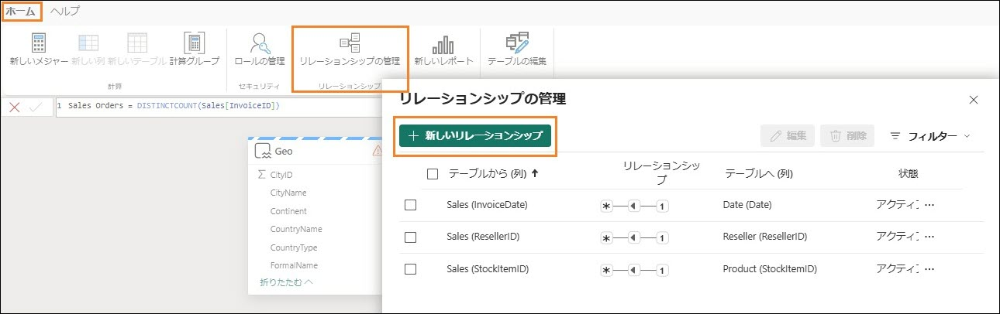  

3. [新しいリレーションシップ] ダイアログが開きます。**テーブルから**が **Sales、** **列**が**SalespersonPersonID** であることを確認します。
4. **テーブル表示**が **People、** **列**が **PersonID** であることを確認します。
5. **カーディナリティ**が**多対一(*:1)** であることを確認します。
6. **クロス  フィルターの方向**が**単一**であることを確認します。
7. **保存**を選択します。[リレーションシップの管理]  ダイアログボックスが開き、新しいリレーションシップが追加されます。

   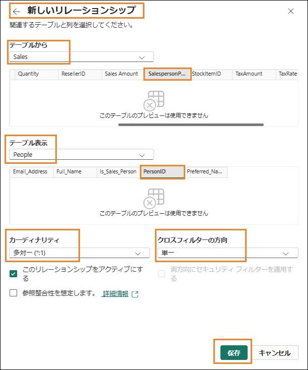 

8. 次は、Product とSupplier の間にリレーションシップを作成しましょう。**新しいリレーションシップ**を選択します。
9. **テーブルから**が **Product、** **列**が **SupplierID** であることを確認します。
 
10. **テーブル表示**が **Supplier、** **列**が **SupplierID** であることを確認します。
11. **カーディナリティ**が**多対一(*:1)** であることを確認します。
12. **クロス  フィルターの方向**が**双方向**であることを確認します。
13. **保存**を選択します。

    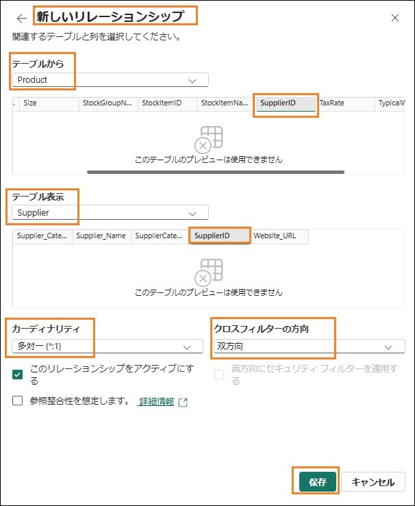 

14. 次は、Reseller とGeo の間にリレーションシップを作成しましょう。**新しいリレーションシップ**を選択します。
15. [新しいリレーションシップ] ダイアログが開きます。**テーブルから**が **Reseller、** **列**が**PostalCityID** であることを確認します。
16. **テーブル表示**が **Geo、** **列**が **CityID** であることを確認します。
17. **カーディナリティ**が**多対一(*:1)** であることを確認します。
18. **クロス  フィルターの方向**が**双方向**であることを確認します。
19. **保存**を選択します。
 
    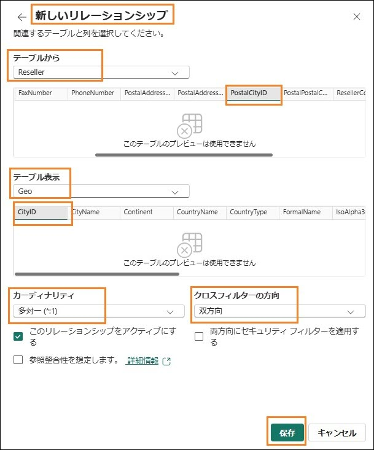  

20. 同じように、Customer とReseller の間にリレーションシップを作成しましょう。**新しいリレーションシップ**を選択します。
21. [新しいリレーションシップ] ダイアログが開きます。**テーブルから**が **Customer、** **列**が**ResellerID** であることを確認します。
22. **テーブル表示**が **Reseller、** **列**が **ResellerID** であることを確認します。
23. **カーディナリティ**が**多対一(*:1)** であることを確認します。
24. **クロス  フィルターの方向**が**単一**であることを確認します。
25. **保存**を選択します。

    **チェックポイント:** [リレーションシップの管理] は下のスクリーンショットのようになっているはずです。
 
    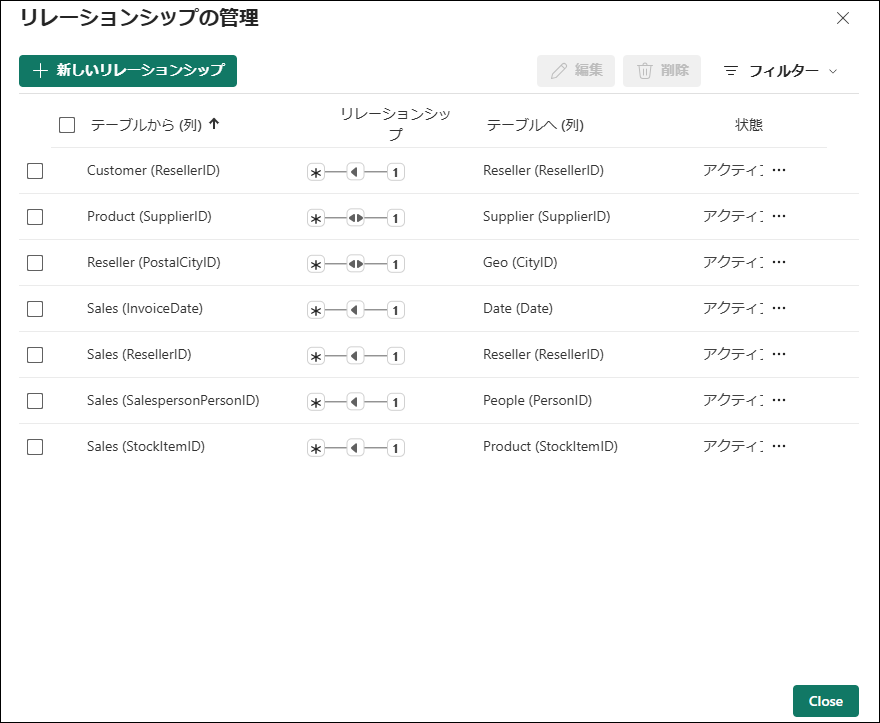  

26. 同様に、**PO** と **Date** の間の**多対一**リレーションシップを作成します。**PO** で **Order_Date** を選択し、**Date** で **Date** を選択します。
27. 同様に、**PO** と **Product** の間の**多対一**リレーションシップを作成します。**PO** の **StockItemID** と **Product** の **StockItemID** を選択します。
28. 同様に、**PO** と **People** の間の**多対一**リレーションシップを作成します。**PO** の **ContactPersonID** と **People** の **PersonID** を選択します。
29. **閉じる**を選択して [リレーションシップの管理] ダイアログを閉じます。すべてのリレーションシップの作成が完了しました。

    **チェックポイント:**    モデルは下のスクリーンショットのようになっているはずです。
 
    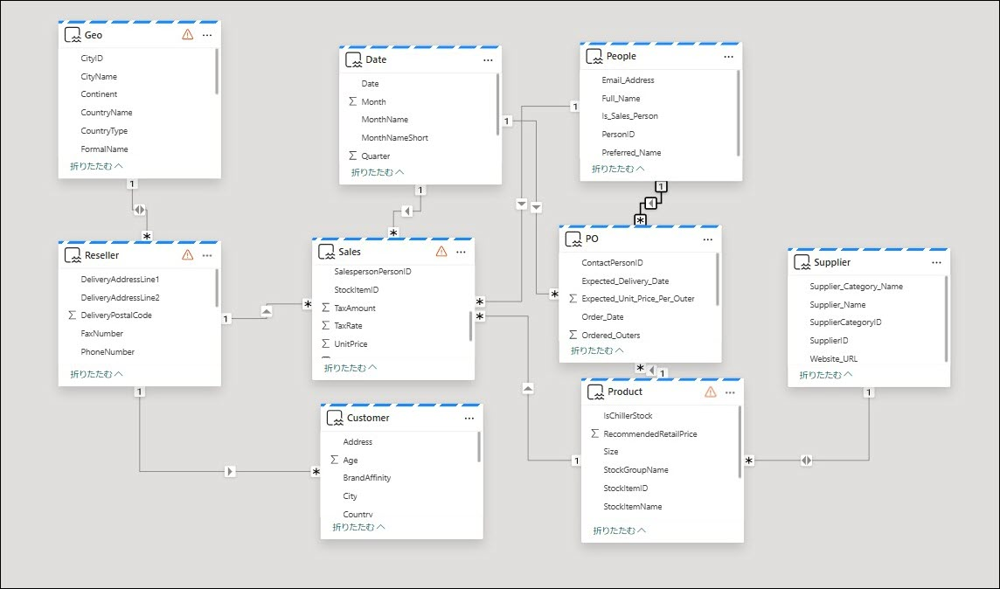  

## タスク 7: オプションセクション– メジャーを作成する

残りのメジャーを追加しましょう。

1. 上部のメニューで **Sales** テーブルを選択し、**ホーム -> 新しいメジャー**を選択します。
2. 数式バーに **Avg Order = DIVIDE([Sales], [Orders])** と入力します。
3. 数式バーの**チェック マーク**をクリックするか、[入力]  ボタンをクリックします。
4. 右側にプロパティ パネルを展開します。
5. **書式設定**セクションを展開します。
6. **書式**ドロップダウンで**通貨**を選択します。
7. 小数点以下表示桁数を 0 に設定します。
 
   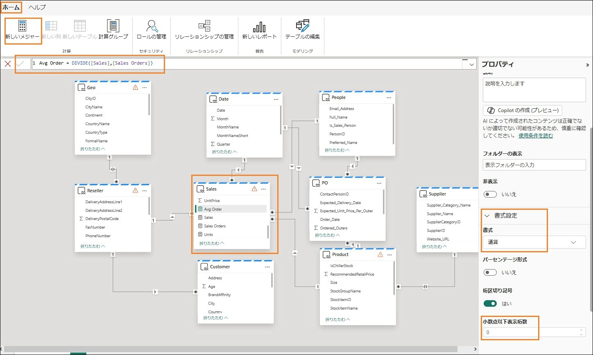  

8. 同様のステップを実行して、次のメジャーを追加します。

    a. **Sales** テーブルに **GM = SUM(Sales[LineProfit])** (書式設定は**通貨、** **小数点以下表示桁数 0)。**

    b. **Sales** テーブルに、**GM% = DIVIDE([GM], [Sales])** (書式設定は**パーセンテージ、小数点以下表示桁数 0)。**

    c. **Sales** テーブルに、**Sales YoY% = VAR   PREV_YEAR = CALCULATE([Sales], DATEADD('Date'[Date].[Date], -1, YEAR)) RETURN DIVIDE([Sales] - PREV_YEAR,  PREV_YEAR)** 
    
    (書式設定は**パーセンテージ、小数点以下表示桁数 2**)

    d. **Customer** テーブル**に、No of Customers = COUNTROWS(Customer)** (書式設定は**整数、桁区切り記号あり)。**

# 参考資料

Fabric Analyst in a Day (FAIAD) では、Microsoft Fabric で使用できる主要な機能の一部をご紹介します。サービスのメニューにあるヘルプ (?) セクションには、いくつかの優れたリソースへのリンクがあります。

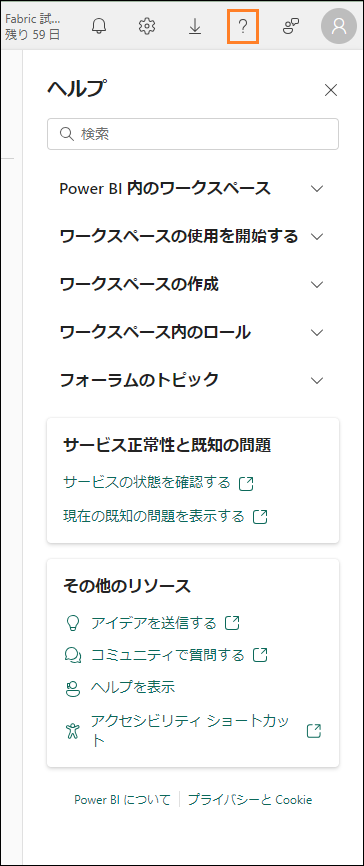

Microsoft Fabric の次のステップに役立つリソースをいくつか以下に紹介します。

- ブログ記事で [Microsoft-Fabric-のGA-に関するお知らせ](https://aka.ms/Fabric-Hero-Blog-Ignite23) の全文を確認する
- [ガイド付きツアー](https://aka.ms/Fabric-GuidedTour) を通じて Fabric を探索する
- [Microsoft Fabric の無料試用版](https://www.microsoft.com/en-us/microsoft-fabric/getting-started) にサインアップする
- [Microsoft Fabric のWeb サイト](https://www.microsoft.com/en-in/microsoft-fabric) にアクセスする
- [Fabric の学習モジュール](https://learn.microsoft.com/en-us/training/browse/?products=fabric&resource_type=module)で新しいスキルを学ぶ
- [Fabric の技術ドキュメント](https://learn.microsoft.com/en-us/fabric/) を参照する
- [Fabric 入門編の無料のe-book](https://info.microsoft.com/ww-landing-unlocking-transformative-data-value-with-microsoft-fabric.html) を読む
- [Fabric コミュニティ](https://community.fabric.microsoft.com/)に参加し、質問の投稿やフィードバックの共有を行い、他のユーザーから学びを得る

より詳しい Fabric  エクスペリエンスのお知らせに関するブログを参照してください。

- [Fabric の Data Factory エクスペリエンスに関するブログ](https://blog.fabric.microsoft.com/en-us/blog/introducing-data-factory-in-microsoft-fabric/)
- [Fabric のSynapse Data Engineering エクスペリエンスに関するブログ](https://blog.fabric.microsoft.com/en-us/blog/introducing-synapse-data-engineering-in-microsoft-fabric/)
- [Fabric のSynapse Data Science エクスペリエンスに関するブログ](https://blog.fabric.microsoft.com/en-us/blog/introducing-synapse-data-science-in-microsoft-fabric/)
- [Fabric のSynapse Data Warehousing エクスペリエンスに関するブログ](https://blog.fabric.microsoft.com/en-us/blog/introducing-synapse-data-warehouse-in-microsoft-fabric/)
- [Fabric のSynapse Real-Time Analytics エクスペリエンスに関するブログ](https://blog.fabric.microsoft.com/en-us/blog/sense-analyze-and-generate-insights-with-synapse-real-time-analytics-in-microsoft-fabric/)
- [Power BI のお知らせに関するブログ](https://powerbi.microsoft.com/en-us/blog/empower-power-bi-users-with-microsoft-fabric-and-copilot/)
- [Fabric の Data Activator エクスペリエンスに関するブログ](https://blog.fabric.microsoft.com/en-us/blog/driving-actions-from-your-data-with-data-activator/)
- [Fabric の管理とガバナンスに関するブログ](https://blog.fabric.microsoft.com/en-us/blog/administration-security-and-governance-in-microsoft-fabric/)
- [Fabric の OneLake に関するブログ](https://blog.fabric.microsoft.com/en-us/blog/microsoft-onelake-in-fabric-the-onedrive-for-data/) 
- [Dataverse とMicrosof t Fabric の統合に関するブログ](https://cloudblogs.microsoft.com/dynamics365/it/2023/05/24/new-dataverse-enhancements-and-ai-powered-productivity-with-microsoft-365-copilot/)

© 2023 Microsoft Corporation. All rights reserved.

このデモ/ラボを使用すると、次の条件に同意したことになります。

このデモ/ラボで説明するテクノロジまたは機能は、ユーザーのフィードバックを取得 し、学習エクスペリエンスを提供するために、Microsoft Corporation によって提供されます。ユーザーは、このようなテクノロジおよび機能を評価し、Microsoft にフィードバックを提供するためにのみデモ/ラボを使用できます。それ以外の目的には使用できませ ん。このデモ/ラボまたはその一部を、変更、コピー、配布、送信、表示、実行、再現、 発行、ライセンス、著作物の作成、転送、または販売することはできません。

複製または再頒布のために他のサーバーまたは場所にデモ/ラボ (またはその一部) をコピーまたは複製することは明示的に禁止されています。
このデモ/ラボは、前に説明した目的のために複雑なセットアップまたはインストールを 必要としないシミュレーション環境で潜在的な新機能や概念などの特定のソフトウェアテクノロジ/製品の機能を提供します。
このデモ/ラボで表されるテクノロジ/概念は、フル機能を表していない可能性があり、最終バージョンと動作が異なることがあります。また、そのような機能や概念の最終版がリリースされない場合があります。物理環境でこのような機能を使用するエクスペリエンスが異なる場合もあります。

**フィードバック**。このデモ/ラボで説明されているテクノロジ、機能、概念に関する フィードバックをMicrosoft に提供する場合、ユーザーは任意の方法および目的でユー
ザーのフィードバックを使用、共有、および商品化する権利を無償で Microsoft に提供するものとします。また、ユーザーは、フィードバックを含む Microsoft のソフトウェアまたはサービスの特定部分を使用したり特定部分とインターフェイスを持ったりする製 品、テクノロジ、サービスに必要な特許権を無償でサード パーティに付与します。ユーザーは、フィードバックを含めるために Microsoft がサード パーティにソフトウェアま たはドキュメントをライセンスする必要があるライセンスの対象となるフィードバックを提供しません。これらの権限は、本契約の後も存続します。

Microsoft Corporation は、明示、黙示、または法律上にかかわらず、商品性のすべての保証および条件、特定の目的、タイトル、非侵害に対する適合性など、デモ/ラボに関する すべての保証および条件を拒否します。Microsoft は、デモ/ラボから派生する結果、出力の正確さ、任意の目的に対するデモ/ラボに含まれる情報の適合性に関して、いかなる 保証または表明もしません。

**免責事項**

このデモ/ラボには、Microsoft Power BI の新機能と機能強化の一部のみが含まれています。一部の機能は、製品の将来のリリースで変更される可能性があります。このデモ/ラ ボでは、新機能のすべてではなく一部について学習します。
