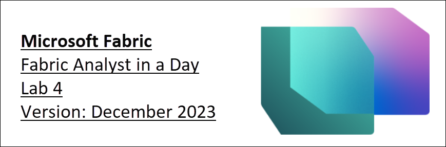

# Microsoft Fabric - Fabric Analyst in a Day - Lab 4

# 

# Contents
- Introduction
  
- Dataflow Gen2

   - Task 1: Copy Snowflake queries to Dataflow
   
   - Task 2: Create connection to Snowflake
   
   - Task 3: Configure Data Destination for Supplier and PO queries
   
   - Task 4: Rename and Publish Snowflake Dataflow
   
   - Task 5: Copy Dataverse queries to Dataflow
   
   - Task 6: Create connection to Dataverse
   
   - Task 7: Create Data destination for Customer query
   
   - Task 8: Publish and Rename Dataverse Dataflow
   
   - Task 9: Copy SharePoint queries to Dataflow
   
   - Task 10: Create SharePoint connection
   
   - Task 11: Configure Data destination for People query
   
   - Task 12: Publish and Rename SharePoint Dataflow

- References

# **Introduction** 

In our scenario, Supplier Data is in Snowflake, Customer Data is in Dataverse, and Employee Data is in SharePoint. All these data sources are updated at different times. To minimize the number of data refreshes of Dataflows, we are going to create individual Dataflows for each of these data sources.

**Note:** Multiple data sources are supported in a single Dataflow.

By the end of this lab, you will have learned: 

- How to connect to Snowflake using Dataflow Gen2 and ingest data into Lakehouse
- How to connect to SharePoint using Dataflow Gen2 and ingest data into Lakehouse
- How to connect to Dataverse using Dataflow Gen2 and ingest data into Lakehouse

# **Dataflow Gen 2**
### Task 1: Copy Snowflake queries to Dataflow

1. Let’s navigate back to the Fabric workspace, **FAIAD_username** you created in the earlier Lab 2, Task 8.
1. From the top menu, select **New -> Dataflow Gen2**.

      

      You will be navigated to **Dataflow page**. Now that we are familiar with Dataflow, let’s go ahead and copy the queries from Power BI Desktop into Dataflow.

3. If you have not already opened it, open the **FAIAD.pbix** located in the **Report** folder on the **Desktop** of your lab environment.

4. From the ribbon select **Home -> Transform data**. Power Query window opens. As you have noticed in the earlier lab, queries in the left panel are organized by data source.

5. Power Query window opens. From the left panel, under SnowflakeData folder **Ctrl+Select** or Shift+Select the following queries:
   1. SupplierCategories
   2. Suppliers
   3. Supplier
   4. PO
   5. PO Line Items

6. **Right click** and select **Copy**.

      

7. Navigate back to the **browser**.
8. In the **Dataflow pane** select the **center pane**, enter **Ctrl+V** (currently right click Paste is not supported).

### Task 2: Create connection to Snowflake

Notice the five queries are pasted and now you have the Queries panel on the left. Since we do not have a connection created for Snowflake, you will see a warning message requesting you to configure the connection.

1. Select **Configure connection**.

      

2. Connect to data source dialog opens. In the **Connection** dropdown make sure, **Create new connection** is selected.
3. **Authentication kind** should be **Snowflake**.
4. **Username** should be **Teams**
5. **Password** should be **fxv7xKp7B93isr7**
6. Select **Connect**.

      

      Connection is established and you can view the data in the preview panel. Feel free to navigate through the Applied Steps of the queries. Basically, the Suppliers query has the details of suppliers and SupplierCategories as the name implies has supplier categories. These two tables are joined to create Supplier dimension, with the columns we need. Similarly, we have PO Line Items merged with PO to create the PO fact. Now we need to ingest Supplier and PO data into Lakehouse.

7. As mentioned earlier, we are not Staging any of this data. So **right click** on **Supplier** query in the Queries pane and select **Enable staging** to remove the check mark.

      

8. Similarly, right click on **PO** query. Select **Enable staging** to remove the check mark.

   **Note:** We do not have to disable staging for the other three queries because Enable Load was disabled in Power BI Desktop (from where these queries were copied from).
   
### Task 3: Configure Data Destination for Supplier and PO queries

1. Select the **Supplier** query.
2. On the bottom right corner select “+” next to **Data destination**.
3. Select **Lakehouse** from the dialog.

      

4. Connect to data destination dialog opens. From the **Connection dropdown** select **Lakehouse (none)**.
5. Select **Next**.

      

6. Choose destination target dialog opens. Make sure the **New table radio button** is **selected**, since we are creating a new table.
7. We want to create the table in the Lakehouse we created earlier. In the left panel, navigate to **Lakehouse -> your workspace name.** 
8. Select **lh_FAIAD**
9. Leave the table name as **Supplier**.
10. Select **Next**.

      

11. Choose destination settings dialog opens. Every time Dataflow Gen2 is refreshed we would like to perform a full load. Make sure **Update method** is set to **Replace**.
12. Notice there is a warning, “Some column names contain unsupported characters. Should we fix them for you?”. Lakehouse does not support column names with space in it. Select **Fix it**, to remove the warning.
13. Column mapping can be used to map dataflow columns to existing columns. In our case, it is a New Table. Hence, we can use the defaults. Select **Save settings**.

      

14. You will be navigated back to **Power Query window**. Notice on the bottom **right corner, Data destination** is set to **Lakehouse**. Similarly, **set up the Data Destination for PO query**. Once it is done, your PO query should have **Data Destination** set to **Lakehouse** as shown in the screenshot below.

      

### Task 4: Rename and Publish Snowflake Dataflow

1. From the top of the screen, select the **arrow next to Dataflow1** to rename.
2. In the dialog, change the name to **df_Supplier_Snowflake**
3. Click on **Enter** to save the name change.

      

4. On the bottom right corner, select **Publish**.

      

      You will be navigated back to **Data Factory screen**. It may take a few moments for the Dataflow to Publish. 

      **Note:** Sometimes, the Dataflow name does not get updated. In this case, follow the steps below. If Dataflow is renamed, you can move to the next task.

5. Once Dataflow 1 is finished publishing, let’s rename it. Click on the **ellipsis (…)** next to Dataflow 1. Select **Properties**.

      

6. Dataflow properties dialog opens. Change the **name** to **df_Supplier_Snowflake**
7. In **Description** text box add **Dataflow to ingest Supplier data from Snowflake to Lakehouse**.
8. Select **Save**.

      

You will be navigated back to the **Data Factory screen**. Now let’s create a dataflow to bring in data from Dataverse.

### Task 5: Copy Dataverse queries to Dataflow

1. From the top menu, select **New -> Dataflow Gen2**.

      

      You will be navigated to **Dataflow page.** Now that we are familiar with Dataflow, let’s go ahead and copy the queries from Power BI Desktop into Dataflow.

2. If you have not already opened it, open the **FAIAD.pbix** located in the **Report** folder on the **Desktop** of your lab environment. 
3. From the ribbon select **Home -> Transform data**. Power Query window opens. As you have noticed in the earlier lab, queries in the left panel are organized by data source.
4. Power Query window opens. From the left panel, under DataverseData folder **Ctrl+Select** the following queries:
   1. BabyBoomer
   1. GenX
   1. GenY
   1. GenZ
   1. Customer
5. **Right click** and select **Copy**.

      

6. Navigate back to the **Dataflow page** in your browser.
7. In the **Dataflow pane**, enter **Ctrl+V** (currently right click Paste is not supported).

   Notice the five queries are pasted and now you have the Queries panel on the left. Since we do not have a connection created for Dataverse, you will see a warning message requesting you to configure the connection.

### Task 6: Create connection to Dataverse

1. Select **Configure connection**.

      

2. Connect to data source dialog opens. In the **Connection** dropdown make sure, **Create new connection** is selected.
3. **Authentication kind** should be **Organizational Account.**.

      
   
4. Select **Connect**.

### Task 7: Create Data destination for Customer query

Connection is established and you can view the data in the preview panel. Feel free to navigate through the Applied Steps of the queries. Customer data is available by Category, BabyBoomer, GenX, GenY, and GenZ. These four queries are appended to create the Customer query. Now we need to ingest Customer data into Lakehouse.

1. As mentioned earlier, we are not staging any of this data. So **right click** on **Customer** query in the Queries pane and select **Enable staging** to remove the check mark.

      

2. Select **Customer** query.
3. On the bottom right corner select “+” next to **Data destination**.
4. Select **Lakehouse** from the dialog.

      

5. Connect to data destination dialog opens. From the **Connection dropdown** select **Lakehouse (none)**.
6. Select **Next**.

      

7. Choose destination target dialog opens. Make sure the **New table radio button** is selected, since we are creating a new table.
8. We want to create the table in the Lakehouse we created earlier. In the left panel, navigate to **Lakehouse -> your workspace name.** 
9. Select **lh_FAIAD**
10. Leave the table name as **Customer**
11. Select **Next**.

      

12. Choose destination settings dialog opens. Every time Dataflow Gen2 is refreshed we would like to perform a full load. Make sure **Update method** is set to **Replace**.
13. Notice there is a warning, “Some column names contain unsupported characters. Should we fix them for you?”. Lakehouse does not support column names with space in it. Select **Fix it**, to remove the warning.
14. Column mapping can be used to map dataflow columns to existing columns. In our case, it is a New Table. Hence, we can use the defaults. Select **Save settings**.

    

### Task 8: Publish and Rename Dataverse Dataflow

1. You will be navigated back to **Power Query window**. Notice on the bottom **right corner**, **Data destination** is set to **Lakehouse**.
2. On the bottom right corner, select **Publish**.

      

      **Note:** You will be navigated back to **Data Factory screen**. It may take a few moments for the Dataflow to Publish. 

1. Dataflow 1 is the dataflow we were working in. Let’s rename it before we continue. Click on the **ellipsis (…)** next to Dataflow 1. Select **Properties**.

      

2. Dataflow properties dialog opens. Change the **Name** to **df\_Customer\_Dataverse**
3. In the **Description** text box add **Dataflow to ingest Customer data from Dataverse to Lakehouse**.
4. Select **Save**.

      

      You will be navigated back to the **Data Factory screen**. Now let’s create a dataflow to bring in data from SharePoint.

### Task 9: Copy SharePoint queries to Dataflow

1. From the top menu, select **New -> Dataflow Gen2**.

      

      You will be navigated to **Dataflow page**. Now that we are familiar with Dataflow, let’s go ahead and copy the queries from Power BI Desktop into Dataflow.

2. If you have not already opened it, open the **FAIAD.pbix** located in the **Report** folder on the **Desktop** of your lab environment. 
3. From the ribbon select **Home -> Transform data**. Power Query window opens. As you have noticed in the earlier lab, queries in the left panel are organized by data source.
4. Power Query window opens. From the left panel, under SharepointData folder **select** the **People** query.
5. **Right click** and select **Copy**.

      

6. Navigate back to the **Dataflow screen** in the browser.
7. In the **Dataflow pane**, enter **Ctrl+V** (currently right click Paste is not supported).

   Notice the query pasted and is available in the left panel. Since we do not have a connection created to SharePoint, you will see a warning message requesting you to configure the connection.

### Task 10: Create SharePoint connection
1. Select **Configure connection**.

      

2. Connect to data source dialog opens. In the **Connection** dropdown make sure, **Create new connection** is selected.
3. **Authentication kind** should be **Organizational Account**.
4. Select **Connect**.

      

### Task 11: Configure Data destination for People query
Connection is established and you can view the data in the preview panel. Feel free to navigate through the Applied Steps of the queries. Now we need to ingest People data into Lakehouse.

1. As mentioned earlier, we are not staging any of this data. So **right click** on the **People** query in the Queries pane and select **Enable staging** to remove the check mark.

      

2. Select **People** query.
3. On the bottom right corner select “+” next to **Data destination**.
4. Select **Lakehouse** from the dialog.

      

5. Connect to data destination dialog opens. From the **Connection dropdown** select **Lakehouse (none)**.
6. Select **Next**.

      

7. Choose destination target dialog opens. Make sure the **New table radio button** is selected, since we are creating a new table.
8. We want to create the table in the Lakehouse we created earlier. In the left panel, navigate to **Lakehouse-> your workspace name.**
9. Select **lh_FAIAD**
10. Leave the table name as **People**
11. Select **Next**.

      

12. Choose destination settings dialog opens. Every time Dataflow Gen2 is refreshed we would like to perform a full load. Make sure **Update method** is set to **Replace**.
13. Notice there is a warning, “Some column names contain unsupported characters. Should we fix them for you?”. Lakehouse does not support column names with space in it. Select **Fix it**, to remove the warning.
14. Column mapping can be used to map dataflow columns to existing columns. In our case, it is a New Table. Hence, we can use the defaults. Select **Save settings**.

      

### Task 12: Publish and Rename SharePoint Dataflow
1. You will be navigated back to **Power Query window**. Notice on the bottom **right corner**, Data destination is set to **Lakehouse**.
2. On the bottom right corner, select **Publish**.

      

      **Note:** You will be navigated back to **Data Factory screen**. It may take a few moments for the Dataflow to Publish. 

3. Dataflow 1 is the dataflow we were working in. Let’s rename it before we continue. Click on the **ellipsis (…)** next to Dataflow 1. Select **Properties**.

      

4. Dataflow properties dialog opens. Change the **name** to **df_People_SharePoint**
5. In the **Description** text box add **Dataflow to ingest People data from SharePoint to Lakehouse**.
6. Select **Save**.

      

You will be navigated back to the **Data Factory screen**. We have now ingested all the data into Lakehouse. In the next lab, we will work with Lakehouse.

# **References**
Fabric Analyst in a Day (FAIAD) introduces you to some of the key functions available in Microsoft Fabric. In the menu of the service, the Help (?) section has links to some great resources.

   

Here are a few more resources that will help you with your next steps with Microsoft Fabric.

- See blog post to read the full [Microsoft Fabric GA announcement](https://aka.ms/Fabric-Hero-Blog-Ignite23)
- Explore Fabric through the [Guided Tour](https://aka.ms/Fabric-GuidedTour)
- Sign up for the [Microsoft Fabric free trial](https://aka.ms/try-fabric)
- Visit the [Microsoft Fabric website](https://aka.ms/microsoft-fabric)
- Learn new skills by exploring the [Fabric Learning modules](https://aka.ms/learn-fabric)
- Explore the [Fabric technical documentation](https://aka.ms/fabric-docs)
- Read the [free e-book on getting started with Fabric](https://aka.ms/fabric-get-started-ebook)
- Join the [Fabric community](https://aka.ms/fabric-community) to post your questions, share your feedback, and learn from others

Read the more in-depth Fabric experience announcement blogs:

- [Data Factory experience in Fabric blog](https://aka.ms/Fabric-Data-Factory-Blog) 
- [Synapse Data Engineering experience in Fabric blog](https://aka.ms/Fabric-DE-Blog) 
- [Synapse Data Science experience in Fabric blog](https://aka.ms/Fabric-DS-Blog) 
- [Synapse Data Warehousing experience in Fabric blog](https://aka.ms/Fabric-DW-Blog) 
- [Synapse Real-Time Analytics experience in Fabric blog](https://aka.ms/Fabric-RTA-Blog)
- [Power BI announcement blog](https://aka.ms/Fabric-PBI-Blog)
- [Data Activator experience in Fabric blog](https://aka.ms/Fabric-DA-Blog) 
- [Administration and governance in Fabric blog](https://aka.ms/Fabric-Admin-Gov-Blog)
- [OneLake](https://aka.ms/Fabric-OneLake-Blog)[ in Fabric blog](https://aka.ms/Fabric-OneLake-Blog)
- [Dataverse and Microsoft Fabric integration blog](https://aka.ms/Dataverse-Fabric-Blog)

[A screenshot to Connect to data destination]: Aspose.Words.76514971-fec6-4d06-9b79-6109687c7a81.008.png
[A screenshot to select Properties for Dataflow1]: Aspose.Words.76514971-fec6-4d06-9b79-6109687c7a81.014.png
[A screenshot to select New -> Dataflow Gen2]: Aspose.Words.76514971-fec6-4d06-9b79-6109687c7a81.016.png
[A screenshot to select Dataflow1 -> Properties]: Aspose.Words.76514971-fec6-4d06-9b79-6109687c7a81.025.png

© 2023 Microsoft Corporation. All rights reserved.

By using this demo/lab, you agree to the following terms:

The technology/functionality described in this demo/lab is provided by Microsoft Corporation for purposes of obtaining your feedback and to provide you with a learning experience. You may only use the demo/lab to evaluate such technology features and functionality and provide feedback to Microsoft. You may not use it for any other purpose. You may not modify, copy, distribute, transmit, display, perform, reproduce, publish, license, create derivative works from, transfer, or sell this demo/lab or any portion thereof.

COPYING OR REPRODUCTION OF THE DEMO/LAB (OR ANY PORTION OF IT) TO ANY OTHER SERVER OR LOCATION FOR FURTHER REPRODUCTION OR REDISTRIBUTION IS EXPRESSLY PROHIBITED.

THIS DEMO/LAB PROVIDES CERTAIN SOFTWARE TECHNOLOGY/PRODUCT FEATURES AND FUNCTIONALITY, INCLUDING POTENTIAL NEW FEATURES AND CONCEPTS, IN A SIMULATED ENVIRONMENT WITHOUT COMPLEX SET-UP OR INSTALLATION FOR THE PURPOSE DESCRIBED ABOVE. THE TECHNOLOGY/CONCEPTS REPRESENTED IN THIS DEMO/LAB MAY NOT REPRESENT FULL FEATURE FUNCTIONALITY AND MAY NOT WORK THE WAY A FINAL VERSION MAY WORK. WE ALSO MAY NOT RELEASE A FINAL VERSION OF SUCH FEATURES OR CONCEPTS. YOUR EXPERIENCE WITH USING SUCH FEATURES AND FUNCITONALITY IN A PHYSICAL ENVIRONMENT MAY ALSO BE DIFFERENT.

**FEEDBACK**. If you give feedback about the technology features, functionality and/or concepts described in this demo/lab to Microsoft, you give to Microsoft, without charge, the right to use, share and commercialize your feedback in any way and for any purpose. You also give to third parties, without charge, any patent rights needed for their products, technologies and services to use or interface with any specific parts of a Microsoft software or service that includes the feedback. You will not give feedback that is subject to a license that requires Microsoft to license its software or documentation to third parties because we include your feedback in them. These rights survive this agreement.

MICROSOFT CORPORATION HEREBY DISCLAIMS ALL WARRANTIES AND CONDITIONS WITH REGARD TO THE DEMO/LAB, INCLUDING ALL WARRANTIES AND CONDITIONS OF MERCHANTABILITY, WHETHER EXPRESS, IMPLIED OR STATUTORY, FITNESS FOR A PARTICULAR PURPOSE, TITLE AND NON-INFRINGEMENT. MICROSOFT DOES NOT MAKE ANY ASSURANCES OR REPRESENTATIONS WITH REGARD TO THE ACCURACY OF THE RESULTS, OUTPUT THAT DERIVES FROM USE OF DEMO/ LAB, OR SUITABILITY OF THE INFORMATION CONTAINED IN THE DEMO/LAB FOR ANY PURPOSE.

**DISCLAIMER**

This demo/lab contains only a portion of new features and enhancements in Microsoft Power BI. Some of the features might change in future releases of the product. In this demo/lab, you will learn about some, but not all, new features.
