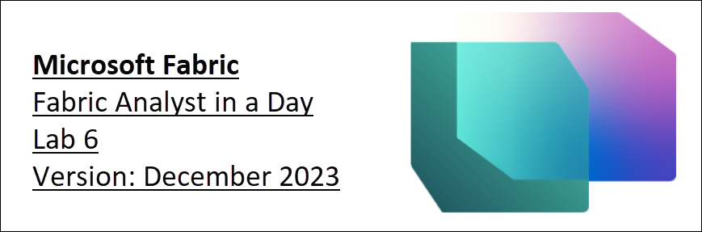

# Microsoft Fabric - Fabric Analyst in a Day - Lab 6

# 

# Contents
* Introduction

* Dataflow Gen2

  * Task 1: Configure scheduled refresh for Sales Dataflow
  
  * Task 2: Configure Scheduled refresh for Supplier and Customer Dataflow

* Data Pipeline

  * Task 3: Create Data Pipeline
  
  * Task 4: Build simpler Data Pipeline
        
  * Task 5: Create new Data Pipeline
        
  * Task 6: Create Until Activity
        
  * Task 7: Create Variables
        
  * Task 8: Configure Until Activity
        
  * Task 9: Configure Dataflow Activity
        
  * Task 10: Configure 1st Set variable Activity
        
  * Task 11: Configure 2nd Set variable Activity
        
  * Task 12: Configure 3rd Set variable Activity
        
  * Task 13: Configure Wait Activity
        
  * Task 14: Configure Schedule refresh for Data Pipeline
      
* References

# **Introduction** 

We have ingested data from different data sources into Lakehouse. In the previous lab, you were introduced to Lakehouse and created a data model. In this lab, you will set up a refresh schedule for the data sources. Just to recap the requirements:

- **Sales Data:** in ADLS is updated at noon / 12 PM every day.
- **Supplier Data:** in Snowflake is updated at midnight / 12 AM every day.
- **Customer Data:** in Dataverse is always up to date. We need to refresh this four times a day, at midnight / 12 AM, 6 AM, noon / 12 PM, and 6 PM.
- **Employee Data:** in SharePoint is updated at 9 AM every day. However, we have noticed that sometimes there is a 15 – 30 minute delay. We need to create a refresh schedule to accommodate this.

By the end of this lab, you will have learned: 

- How to configure a scheduled refresh of Dataflow Gen2
- How to create a Data Pipeline
- How to configure a scheduled refresh of a Data Pipeline

# **Dataflow Gen2**

### Task 1: Configure scheduled refresh for Sales Dataflow

Let’s start by configuring a scheduled refresh of Sales Dataflow.

1. Let’s navigate back to the Fabric workspace **FAIAD_username** you created in Lab 2, Task 8.

2. All the artifacts you have created are listed here. On the right of the screen, in the **Search box** enter **df**. This will filter the artifacts to Dataflows.

      

3. Hover on the **df_Sales_ADLS** row. Notice that the familiar **Refresh** and **Schedule Refresh icons** are available. Select the **ellipsis (…)**.
4. Notice there is an option to Delete, Edit, and Export the Dataflow. We can use Properties to update the name and description of the Dataflow. We will look at Refresh history shortly. Select **Settings**.

      

     >**Note:** Settings page opens. In the left panel, you will find all the Dataflows listed. 

5. In the center pane, select the **Refresh history** link.

      

6. Refresh history dialog opens. You will have at least one refresh listed. This is the refresh which occurred when the dataflow was published. Select the **Start time** link.

   >**Note:** Start time will be different for you.

     

      Details screen will open. This will provide details of the refresh, it lists the start, end time, and duration. It also lists the tables/activities that were refreshed. In case there is a failure, you can click on the name of the table/activity to investigate further.
      
      

7. Let’s navigate away by clicking on the **X** on the top right corner. You will be navigated back to the **dataflow settings page**.
8. Under Gateway connection, expand **Data source credentials**. A list of connections used in the dataflow is displayed. In this case, Lakehouse and ADLS. 
   1. **Lakehouse:** This is the connection to ingest data from Dataflow.
   1. **ADLS:** This is the connection to the ADLS source data.

      

9. Expand **Refresh.**
10. Set **Configure a refresh** **schedule** slider to **On**.
11. Set **Refresh frequency** dropdown to **Daily**. Notice there is an option to set it to Weekly as well.
12. Set **Time Zone** to your preferred time zone.

    **Note**: Since this is a lab environment, you can set the time zone to your preferred time zone. In a real scenario, you will be setting the time zone based on your / data source location.

13. Click **Add another time** link. Notice the Time option is displayed.
14. Set **Time** to **noon**. Notice that you can set refresh on the top of the hour or half hour.
15. Select **Apply** to save this setting.

    **Note:** By clicking on Add another time link, you can add multiple refresh times. 

    You can also send failure notifications to the dataflow owner and other contacts.

      

### Task 2: Configure Scheduled refresh for Supplier and Customer Dataflow

1. In the left panel, select **df_Supplier_Snowflake**.
1. Configure the refresh schedule to refresh **every day at midnight / 12 AM**. 
1. Select **Apply** to save this setting.

      

1. In the left panel, select **df_Customer_Dataverse**.
1. Configure refresh schedule to four times a day: **midnight / 12 AM, 6 AM, noon / 12 PM, and 6 PM**.
1. Select **Apply** to save this setting.

      

      As mentioned earlier, we need to build custom logic to handle the scenario where the Employee file in SharePoint is not delivered on time. Let’s use Data Pipeline to solve this.

# **Data Pipeline**

### Task 3: Create Data Pipeline

1. On the **bottom left** of your browser window, select **Power BI**.
2. Microsoft Fabric dialog opens. Select **Data Factory**. You will navigate to the Data Factory Home page.

     

3. From the top panel, select **Data pipeline** to create a new pipeline.
4. New pipeline dialog opens. **Name** the pipeline as **pl_Refresh_People_SharePoint**
5. Select **Create**.

     

   You are navigated to the **Data Pipeline page**. If you have worked with Azure Data Factory, this screen will be familiar. Let’s get a quick overview of the layout.
   
   You are on the **Home** screen. If you look at the top menu, you will find options to add the commonly used activities, validate and run a pipeline, and view the run history. Also, in the center pane, you will find quick options to start building the pipeline.
   
      
 
6. From the top menu select **Activities**. Now in the menu, you will find a list of commonly used Activities. 
7. Select the **ellipsis (…)** on the right of the menu to view all the other available Activities. We are going to use a few of these Activities in the lab.

      

8. From the top menu click **Run**. You will find options to run and schedule the pipeline execution. You will also find the option to view execution history by using View Run History.
9. From the top menu select **View**. Here you will find options to view the code in JSON format. You will also find options to format the activities.

     **Note:** If you have a JSON background at the end of the lab, feel free to select View JSON code. Here you will notice all the orchestration you are doing using the design view can also be written in JSON. 
   
      
  
### Task 4: Build simpler Data Pipeline

Let’s start building the pipeline. We need an activity to refresh the Dataflow. Let’s find an activity which we can use.

1. From the top menu select **Activities -> Dataflow**. Dataflow activity is added to the center design pane. Notice the bottom pane now has configuration options for the Dataflow activity.
2. We are going to configure the activity to connect to df_People_SharePoint activity. From the **bottom** **pane**, select **Settings**.
3. Make sure **Workspace** is set to **your workspace name.**
4. From the **Dataflow dropdown** select **df_People_SharePoint**. When this Dataflow activity is executed, it is going to refresh **df_People_SharePoint.** That was easy, right? 😊

      **Note:** The Notification Option is currently greyed out. This feature will be enabled shortly. You will be able to configure notifications on the success and failure of this activity. 

   In our scenario, Employee Data is not updated on schedule. Sometimes there is a delay. Let’s see if we can accommodate this.
   
      

5. From the **bottom** **pane**, select **General**. Let’s give the activity a name and description.
6. In the **Name** field, enter **dfactivity_People_SharePoint**
7. In the **Description** field, enter **Data flow activity to refresh df_People_Sharepoint dataflow.**
8. Notice there is an option to Deactivate an activity. This feature is useful during testing or debugging. Leave it as **Activated**.
9. There is an option to set **Timeout**. Let’s leave the **default value** which should give enough time for the dataflow to refresh.

     **Note:** If the data is not available on schedule, let’s set the activity to re-execute every 10 minutes, three times. If it fails on the third attempt as well, then it will report a failure.

10. Set **Retry** to **3**. 
11. Expand **Advanced** section.
12. Set **Retry interval (sec)** to **600**. 
13. From the menu select **Home -> Save** icon to save the pipeline.

      
   
     Notice the advantage of using the data pipeline compared to setting the data flow on scheduled refresh (like we did for the earlier data flows):
   
   - Pipeline provides the option to retry multiple times before failing the refresh.
   - Pipeline provides the ability to refresh within seconds whereas with data flow, scheduled refresh is every 30 minutes.

### Task 5: Create new Data Pipeline

Let’s add a little more complexity to our scenario. We have noticed that if the data is not available at 9 AM, then typically it is available within five minutes. If this window is missed, then it takes 15 minutes for the file to be available. We want to schedule the retries at five and 15 minutes. Let’s see how this can be achieved by creating a new Data Pipeline.

1. From the left panel, click **your workspace name**, and then you will be navigated to the Data Factory Home page.
1. From the top menu, click **New** and from the dropdown, click **Data pipeline**.
1. New pipeline dialog opens. **Name** the pipeline as **pl_Refresh_People_SharePoint_Option2**
1. Select **Create**.

      

### Task 6: Create Until Activity

1. You will be navigated to the Data Pipeline screen. From the menu, select **Activities**.
1. Click the **ellipsis(…)** on the right.
1. From the activity list, click **Until**. 

   **Until**: is an activity that is used to iterate until a condition is satisfied. 

    In our scenario, we are going to iterate and refresh the dataflow until it is successful, or we have tried three times.

      

### Task 7: Create Variables

1. We need to create variables which will be used to iterate and set status. Select the **blank area** in the pipeline design pane.
1. Notice the menu in the bottom pane changes. Select **Variables**.
1. Select **New** to add a new variable.
1. Notice a row appears. Enter **varCounter** as **Name**. We will use this variable to iterate three times.
1. From **Type** drop down select **Integer**.
1. Enter **Default value** of **0**.

   **Note:** We are prepending variable names with var, so it is easy to find them, and it is a good practice.

      

1. Select **New** to add another new variable.
1. Notice a row appears. Enter **Name** as **varTempCounter**. We are going to use this variable increment varCounter variable.
1. From **Type** drop down select **Integer**.
1. Enter **Default value** of **0**.
1. Follow similar steps to add three more variables.
   1. **varIsSuccess** of type **String** and default value **No**. This variable will be used to indicate if the dataflow refresh was successful.
   1. **varSuccess** of type **String** and default value **Yes**. This variable will be used to set the value of varIsSuccess if the dataflow refresh is successful.
   1. **varWaitTime** of type **Integer** and default value **60**. This variable will be used to set the wait time if dataflow fails. (Either 5 minutes/300 seconds or 15 minutes/900 seconds.)

### Task 8: Configure Until Activity

1. Select **Until activity**. 
1. From the **bottom pane**, select **General**.
1. Enter **Name** as **Iterator**
1. Enter **Description** as **Iterator to refresh dataflow. It will retry up to 3 times**. 

     

1. From the bottom pane, select **Settings**.
1. Select the **Expression text box**. We need to enter an expression in this text box that will evaluate to true or false. Until activity iterators while this expression evaluates to false. Once the expression evaluates to true the activity stops the iteration.
1. Select the **Add dynamic content** link that appears below the text box.

     

     We need to write an expression which would execute until either the value of **varCounter is 3 or** value **varIsSuccess is Yes.** (varCounter and varIsSuccess are the variables we just created.)

1. **Pipeline expression builder** dialog opens. In the bottom half of the dialog, you will have a menu:
   1. **Parameters:** Are constants across a data factory that can be consumed by a pipeline in any expression.
   1. **System variables:** These variables can be used in expressions when defining entities within either service. E.g., pipeline id, pipeline name, trigger name, etc.
   1. **Functions:** You can call functions within expressions. Functions are categorized into Collection, Conversion, Date, Logical, Math, and String functions. E.g., concat is a String function, add is a Math function, etc.
   1. **Variables:** Pipeline variables are values that can be set and modified during a pipeline run. Unlike pipeline parameters, which are defined at the pipeline level and cannot be changed during a pipeline run, pipeline variables can be set and modified within a pipeline using a Set Variable activity. We are going to use the Set Variable activity shortly.

     

1. Click **Functions** from the bottom menu.
1. Expand the **Logical Functions** section.
1. Select **or function**. Notice **@or()** is added to the dynamic expression text box. The or function takes two parameters. We are working on the first parameter now.

     

1. Place the cursor **in between the parentheses** of **@or** function.
1. From the **Logical Functions** section, select **equals** function. Notice this is added to the dynamic expression text box. 

   **Note:** Your function should look like **@or(equals())**. The equals function also takes three parameters. We will be checking if the variable varCounter is equal to 3.
   
     

1. Now place cursor **in between the parentheses** of **@equals** function to add the parameters.
1. From the bottom menu, select **Variables**.
1. Select the **varCounter** variable which will be the first parameter.
1. Enter **3** as the second parameter of the equals function. Your expression will be **@or(equals(variables('varCounter'),3))** as shown in the screenshot below.
  
     

1. We need to add the second parameter to the **or** function. **Add a comma** in between the ending two parentheses. This time we will try typing in the function name. Start typing **equ** and you will get a drop-down of available functions (this is called IntelliSense). Select the **equals** function.

     

1. The first parameter of the equals function is a variable. Place **cursor before the comma**.
1. Start typing **variables(**
1. With the help of intellisense select **variables('varIsSuccess')**.
1. After the comma, let’s enter the second parameter. Start typing **variables(**
1. With the help of intellisense select **variables('varSuccess')**. Here we are comparing the value of varIsSuccess to the value of varSuccess. (varSuccess is defaulted to Yes.)

     

1. Your expression should be:

   **@or(equals(variables('varCounter'),3),equals(variables('varIsSuccess'), variables('varSuccess')))**

1. Select **OK**.

     

### Task 9: Configure Dataflow Activity
1. You will be navigated back to the design screen. With **Until activity selected**, from the **bottom pane**, select **Activities**. We will now add the activities that need to be executed.
2. Select the **Edit icon** in the first row. You will be navigated to a blank iterator design screen.

     

3. From the top menu, select **Activities -> Dataflow**. Dataflow activity is added to the design pane.
4. With **Dataflow activity selected**, in the bottom pane select **General**. Let’s give the activity a name and description.
5. In the **Name** field, enter **dfactivity_People_SharePoint**
6. In the **Description** field, enter **Data flow activity to refresh df_People_Sharepoint dataflow.**

     

7. Select **Settings** from the bottom pane.
8. Make sure **Workspace** is set to **your workspace name.**
9. From the **Dataflow dropdown** select **df_People_SharePoint**. When this Dataflow activity is executed, it is going to refresh **df_People_SharePoint.**

     

### Task 10: Configure 1st Set variable Activity

We have configured Dataflow activity like we did earlier in the lab. Now we will add new logic. If the dataflow refresh is successful, we need to exist out of the Until iterator. Remember one of the conditions to exist the iterator is to set the value of the varIsSuccess variable to Yes.

1. From the top menu, select **Activities -> Set variable**. Set variable activity is added to the design canvas.
2. With **Set variable activity selected**, in the bottom pane select **General**. Let’s give the activity a name and description.
3. In the **Name** field, enter **set_varIsSuccess**
4. In the **Description** field, enter **Set variable varIsSuccess to Yes.**

   **Note:** Hover over **Dataflow activity**. To the right of the activity box, there are four icons. These can be used to connect to the next activity based on the result of the activity:

  1. **Grey curved arrow** icon is used to skip the activity
  1. **Green check mark** icon is used on the success of the activity
  1. **Red x-mark** icon is used on the failure of the activity
  1. **Blue straight arrow** icon is used on completion of the activity

5. Click the **green check mark** and drag to connect to **Dataflow activity** to **Set variable activity**. So on the success of the data flow refresh we want to execute the Set variable activity.

     

6. With **Set variable activity selected**, select **Settings** from the bottom menu.
7. In the bottom pane, make sure **Variable type** is **Pipeline variable**.
8. In the **Name** field, select **varIsSuccess**
9  This is the variable whose value we are going to set.
10. In the **Value** field, select the **text box**. Select **Add dynamic content link**.
   
     

11. Pipeline expression builder dialog opens. Select the **Add dynamic content below text area**.
12. From the bottom menu select **Variables -> varSuccess**. Notice @variables('varSuccess') is entered in the Add dynamic content below text area. Remember when we created variables, we had preset the value of the varSuccess variable to Yes. So we are assigning the value of Yes to the varIsSuccess variable.
13. Select **OK**. You will be navigated back to the **iterator design pane**.

     

Now we need to set the counter if the dataflow activity fails. In Data Pipeline, we cannot self-reference a variable. This means we cannot increment the counter variable varCounter by adding one to its value (varCounter = varCounter + 1). So we make use of the varTempCounter variable.

### Task 11: Configure 2nd Set variable Activity

1. From the top menu, select **Activities -> Set variable**. Set variable activity is added to the design canvas.
2. With **Set variable activity selected**, in the bottom pane select **General**. Let’s give the activity a name and description.
3. In the **Name** field, enter **set_varTempCounter**
4. In the **Description** field, enter **Increment variable varTempCounter.**
5. Click the **red x-mark** from the Dataflow activity to the new Set variable activity. So, on failure of data flow refresh we want to execute this Set variable activity.

     

6. With **Set variable activity selected**, select **Settings** from the bottom menu.
7. In the bottom pane, make sure **Variable type** is **Pipeline variable**.
8. In the **Name** field, select **varTempCounter**
   This is the variable whose value we are going to set.
9. In the **Value** field, select the **text box**. Select **Add dynamic content link**.
10. Pipeline expression builder dialog opens. Enter **@add(variables('varCounter'),1)**.

    **Note:** Feel free to type this expression in or use the menu to select the functions or paste it in. 

    **Note:** This function sets the value of variable varTempCounter to the value of variable varCounter plus 1 (varTempCounter = varCounter + 1).

     

      Now we need to set the value of varCounter variable to the value of varTempCounter. 

### Task 12: Configure 3rd Set variable Activity

1. From the top menu, select **Activities -> Set variable**. Set variable activity is added to the design canvas.
1. With **Set variable activity selected**, in the bottom pane select **General**. Let’s give the activity a name and description.
1. In the **Name** field, enter **set_varCounter**
1. In the **Description** field, enter **Increment variable varCounter.**
1. Select the **green check mark** from set_varTempCounter Set variable activity to the new Set variable activity. 

     

1. With **set_varCounter Set variable activity selected**, select **Settings** from the bottom menu.
1. In the bottom pane, make sure **Variable type** is **Pipeline variable**.
1. In the **Name** field, select **varCounter**. This is the variable whose value we are going to set.
1. In the **Value** field, select the **text box**. Select **Add dynamic content link**.
1. Pipeline expression builder dialog opens. Enter **@variables('varTempCounter')**. Feel free to type this expression in or use the menu to select the functions or paste it in. 

     **Note:** This function is setting the value of variable varCounter to the value of variable varTempCounter  (varCounter = varTempCounter). At the end of each iteration, both varCounter and varTempCounter have the same value.
   
     

### Task 13: Configure Wait Activity

Next, we need to wait for 5 minutes/300 seconds if the data flow refresh fails the first time before trying again. If the data flow refresh fails for the second time, we need to wait 15 minutes/900 seconds and try again. We are going to use the Wait activity and variable varWaitTime to set the wait time.

1. From the top menu, select **Activities -> ellipsis (…)-> Wait**. Wait activity is added to the design canvas.
2. With **Wait activity selected**, in the bottom pane select **General**. Let’s give the activity a name and description.
3. In the **Name** field, enter **wait_onFailure**
4. In the **Description** field, enter **Wait for 300 seconds on 2nd try and 900 seconds on 3rd try.**
5. Select the **green check mark** from set_varCounter Set variable activity to the new Wait activity. 

     

6. With the Wait activity selected, select **Settings** from the bottom menu.
7. In the **Wait time in seconds** field, select the text box. Select **Add dynamic content link**.
8. Pipeline expression builder dialog opens. Enter 
  
       @if(
          greater(variables('varCounter'), 1),
          if(equals(variables('varCounter'), 2),
          mul(variables('varWaitTime'),15 ),
          mul(variables('varWaitTime'), 0)
          ),
          mul(variables('varWaitTime'),5 )
          )
     
     Feel free to type this expression in or use the menu to select the functions or paste it in. 

      

We are using two new functions here:

- **greater:** Takes two numbers as parameters and compares which one is greater.
- **mul:** This is a multiply function. Takes in two parameters to multiply. 

The expression is a nested if statement. It checks if the value of the varCounter variable is greater than 1. If it is true, it checks if the value of the varCounter variable is 2. If it is true, it sets the wait time to varWaitTime times 15. Remember, we had defaulted the varWaitTime value to 60. That would be 60\*15 = 900 seconds. If the value of the varCounter variable is not 2 (it is greater than 2, which means data flow refresh has failed 3 times we are done iterating. We don’t have to wait anymore), the wait time is set to varWaitTime \* 0. So, to 0. If the value of the varCounter variable is 1, then we multiply the varWaitTime \* 5. That would be 60\*5 = 300 seconds.

9. Select **OK**. 

    **Checkpoint:** You’re Until Iterator should look like the screenshot below.

      

10. From the top left of the design canvas **select pl_refresh_people_Sharepoint_option2** to be navigated out of the Until iterator. 

      

11. We are done creating the data pipeline. From the top menu, select **Home -> Save icon** to save the data pipeline.

      

### Task 14: Configure Schedule refresh for Data Pipeline

1. We can test the data pipeline, by selecting **Home -> Run.** 
      **Note:** It may take a few minutes for the data pipeline to complete refresh. This is a training environment, so the file in SharePoint is always available. Hence, your data pipeline will never fail.
2. We can set the data pipeline to execute on a schedule. From the top menu, select **Home -> Schedule**. The schedule dialog opens.
3. Set **Scheduled run** radio button to **On**.
4. Set **Repeat dropdown** to **Daily**.
5. Set **Time** to **9 AM**.
6. Set **Start date and time** to **Today**.
7. Set **End date and time** to a **future date**.
8. Set your **Time zone**.

    **Note**: Since this is a lab environment, you can set the time zone to your preferred time zone. In a real scenario, you will be setting the time zone based on your / data source location.

9. Select **Apply**.
10. Select the **X** mark on the top right of the dialog to close it.

       

11. Select **your workspace name** in the left panel to navigate to the Data Factory home screen.

  **Note**: In the Schedule screen, there is no option to notify on success or failure (like Dataflow Schedule). Notification can be done by adding an activity in the Data Pipeline. We are not doing it in this lab as it is a lab environment.

  We have scheduled refreshes of the various data sources. We will be creating reports in the next lab.

# **References**

Fabric Analyst in a Day (FAIAD) introduces you to some of the key functions available in Microsoft Fabric. In the menu of the service, the Help (?) section has links to some great resources.

   

Here are a few more resources that will help you with your next steps with Microsoft Fabric.

- See blog post to read the full [Microsoft Fabric GA announcement](https://aka.ms/Fabric-Hero-Blog-Ignite23)
- Explore Fabric through the [Guided Tour](https://aka.ms/Fabric-GuidedTour)
- Sign up for the [Microsoft Fabric free trial](https://aka.ms/try-fabric)
- Visit the [Microsoft Fabric website](https://aka.ms/microsoft-fabric)
- Learn new skills by exploring the [Fabric Learning modules](https://aka.ms/learn-fabric)
- Explore the [Fabric technical documentation](https://aka.ms/fabric-docs)
- Read the [free e-book on getting started with Fabric](https://aka.ms/fabric-get-started-ebook)
- Join the [Fabric community](https://aka.ms/fabric-community) to post your questions, share your feedback, and learn from others

Read the more in-depth Fabric experience announcement blogs:

- [Data Factory experience in Fabric blog](https://aka.ms/Fabric-Data-Factory-Blog) 
- [Synapse Data Engineering experience in Fabric blog](https://aka.ms/Fabric-DE-Blog) 
- [Synapse Data Science experience in Fabric blog](https://aka.ms/Fabric-DS-Blog) 
- [Synapse Data Warehousing experience in Fabric blog](https://aka.ms/Fabric-DW-Blog) 
- [Synapse Real-Time Analytics experience in Fabric blog](https://aka.ms/Fabric-RTA-Blog)
- [Power BI announcement blog](https://aka.ms/Fabric-PBI-Blog)
- [Data Activator experience in Fabric blog](https://aka.ms/Fabric-DA-Blog) 
- [Administration and governance in Fabric blog](https://aka.ms/Fabric-Admin-Gov-Blog)
- [OneLake](https://aka.ms/Fabric-OneLake-Blog)[ in Fabric blog](https://aka.ms/Fabric-OneLake-Blog)
- [Dataverse and Microsoft Fabric integration blog](https://aka.ms/Dataverse-Fabric-Blog)

© 2023 Microsoft Corporation. All rights reserved.

By using this demo/lab, you agree to the following terms:

The technology/functionality described in this demo/lab is provided by Microsoft Corporation for the purposes of obtaining your feedback and providing you with a learning experience. You may only use the demo/lab to evaluate such technology features and functionality and provide feedback to Microsoft. You may not use it for any other purpose. You may not modify, copy, distribute, transmit, display, perform, reproduce, publish, license, create derivative works from, transfer, or sell this demo/lab or any portion thereof.

COPYING OR REPRODUCTION OF THE DEMO/LAB (OR ANY PORTION OF IT) TO ANY OTHER SERVER OR LOCATION FOR FURTHER REPRODUCTION OR REDISTRIBUTION IS EXPRESSLY PROHIBITED.

THIS DEMO/LAB PROVIDES CERTAIN SOFTWARE TECHNOLOGY/PRODUCT FEATURES AND FUNCTIONALITY, INCLUDING POTENTIAL NEW FEATURES AND CONCEPTS, IN A SIMULATED ENVIRONMENT WITHOUT COMPLEX SET-UP OR INSTALLATION FOR THE PURPOSE DESCRIBED ABOVE. THE TECHNOLOGY/CONCEPTS REPRESENTED IN THIS DEMO/LAB MAY NOT REPRESENT FULL FEATURE FUNCTIONALITY AND MAY NOT WORK THE WAY A FINAL VERSION MAY WORK. WE ALSO MAY NOT RELEASE A FINAL VERSION OF SUCH FEATURES OR CONCEPTS. YOUR EXPERIENCE WITH USING SUCH FEATURES AND FUNCTIONALITY IN A PHYSICAL ENVIRONMENT MAY ALSO BE DIFFERENT.

**FEEDBACK**. If you give feedback about the technology features, functionality and/or concepts described in this demo/lab to Microsoft, you give to Microsoft, without charge, the right to use, share and commercialize your feedback in any way and for any purpose. You also give to third parties, without charge, any patent rights needed for their products, technologies and services to use or interface with any specific parts of a Microsoft software or service that includes the feedback. You will not give feedback that is subject to a license that requires Microsoft to license its software or documentation to third parties because we include your feedback in them. These rights survive this agreement.

MICROSOFT CORPORATION HEREBY DISCLAIMS ALL WARRANTIES AND CONDITIONS WITH REGARD TO THE DEMO/LAB, INCLUDING ALL WARRANTIES AND CONDITIONS OF MERCHANTABILITY, WHETHER EXPRESS, IMPLIED OR STATUTORY, FITNESS FOR A PARTICULAR PURPOSE, TITLE AND NON-INFRINGEMENT. MICROSOFT DOES NOT MAKE ANY ASSURANCES OR REPRESENTATIONS WITH REGARD TO THE ACCURACY OF THE RESULTS, OUTPUT THAT DERIVES FROM USE OF DEMO/ LAB, OR SUITABILITY OF THE INFORMATION CONTAINED IN THE DEMO/LAB FOR ANY PURPOSE.

**DISCLAIMER**

This demo/lab contains only a portion of new features and enhancements in Microsoft Power BI. Some of the features might change in future releases of the product. In this demo/lab, you will learn about some, but not all, new features.
