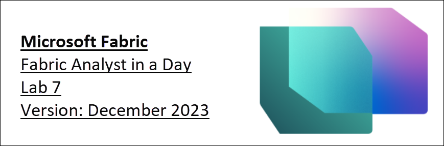

# Microsoft Fabric - Fabric Analyst in a Day - Lab 7

# 

# Contents
   * Introduction

   * Power BI

     * Task 1: Auto-Create Report
         
      * Task 2: Hide default (metrics) tables
         
      * Task 3: Configure background for New report
         
      * Task 4: Add Header to the report
         
      * Task 5: Add KPIs to the report
         
      * Task 6: Add Line chart to the report
         
      * Task 7: Configure Year column in Date table
         
      * Task 8: Configure Short_Month_Name column in Date table
         
      * Task 9: Format Line chart
         
      * Task 10: Add new data to simulate Direct Lake Mode
         
   * Clean up Lab environment

   * References

#
# **Introduction** 

We have ingested data from different data sources into Lakehouse, were introduced to Lakehouse, created a data model, and set a refresh schedule for the data sources. Now we are going to create a report.

By the end of this lab, you will have learned: 

- How to auto-create a report
- How to build a report starting from a blank canvas
- How to experience Direct Lake mode resulting in data automatically refreshing

# **Power BI**

### Task 1: Auto-Create Report

Let’s start by using the auto-create report option. And later in the lab, we will re-create the report we have in Power BI.

1. Let’s navigate back to the **Fabric workspace** you created in the earlier lab.
1. You will probably be on the Data Factory home page. From the bottom of the left panel, select **Data Factory icon**.
1. Fabric experience dialog opens. Select **Power BI**. You will be navigated to the **Power BI Home page**.

      

1. Select **New Report** from the top menu.

      

1. You will be navigated to **Build your first report screen**. There will be options to enter data manually and build a report or to pick a published semantic model. We have created a semantic model in the previous labs. Let’s use that. Select **Pick a published semantic model** option.

      

1. Pick a dataset to use in your report page opens. Notice we have four options. **Select lh_FAIAD**:
   1. **lh_FAIAD:** This is the lakehouse with the dataset we created and want to use for the report.
   1. **Units by Supplier:** This is the dataset we created using T-SQL.
   1. **DataflowsStagingWarehouse:** This is the staging warehouse which is created by default since we did not use this as we did not stage data.
   1. **DataflowsStagingLakehouse:** This is the staging lakehouse which is created by default since we did not use this as we did not stage data.

1. Click the **arrow next to Auto-create report button**. Notice there are two options, Auto-create report and Create a blank report. Let’s try auto-creating, so select **Auto-create report**.

      

1. Power BI will start auto-creating the report. Notice there is an option to Pre-select data if we choose. Once the report is ready, a dialog appears on the top right of the screen. Select **View report now**.

      

      **Checkpoint:** You will have a report which looks like the screenshot below. There are a few KPIs and some trend visuals. This is a good start if you are analyzing a new model and need a jumpstart.
      
      **Note:** Notice on the top menu, that you have the option to Edit the report or view some of the data as tables. Feel free to explore these options.

1. Once you are ready, **collapse** all the tables in the **Data** section on the right. Notice we have five new tables which are not part of the model we created. These are default tables added to help analyze performance. We will remove these from the report view shortly.
1. Let’s save this report. From the top menu, select **Save**.
1. Save your report dialog opens. Name the report as **rpt\_Sales\_Auto\_Report** 
   **Note:** We are prefixing the report name with rpt which is short for report.
1. Make sure the report is saved in **<your workspace name>.**
1. Select **Save.**

      

### Task 2: Hide default (metrics) tables

Let’s create a report like the one we have in Power BI Desktop. We are going to do this by starting with a blank canvas. Before we start creating a report, let’s remove the default tables (above screenshot) from the report view. This is done in the modeling section of the Lakehouse.

1. From the bottom of the left panel, select **Power BI icon**. Fabric dialog opens.
2. Select **Data Engineering**. You will be navigated to the Data Engineering Home page.

      

3. Scroll down to **Quick Access** section.
4. Select **lh_FAIAD -> SQL analytics endpoint**. We will be in the Data view of the Lakehouse.
5. From the **bottom of the left panel**, select **Model** to be navigated to the Model view.

    Notice on the design canvas, you will find the default tables. (You may have to scroll to the right or bottom to view them)

     

6. Right click on the table **long_running_queries** and select **Hide in report view**.

      

7. Similarly, select **Hide in report view** option for the following tables:
   1. fabric_query_starting
   1. fabric_query_completed
   1. exec_requests_history
   1. frequently_run_queries

### Task 3: Configure background for a New report

1. We can start creating a new report from the model view. From the top menu, select **Home -> New report**. You will be navigated to the Power BI report canvas in a new window/tab in your browser.

      

1. If you have not already opened it, open the **FAIAD.pbix** located in the **Report** folder on the **Desktop** of your lab environment. 

    We are going to use this report as a reference. We will start by adding the canvas background. We will create the report header, add a couple of KPIs, and create the Sales over a line chart. In the interest of time and with the understanding that you have experience with building visuals in Power BI Desktop, we will not be creating all the visuals. 
      
     

1. Navigate back to **Power BI canvas** in your browser.
1. Select **Format page** **icon** in Visualization pane.
1. Expand **Canvas background section**.
1. Select **Browse** from **Image** option. File explorer dialog opens.
1. Navigate to **Report** folder on the **Desktop** of your lab environment. 
1. Select **Summary Background.png.**
1. Set **Image fit** dropdown to **Fit**.
1. Set Transparency to **0%**.

     

### Task 4: Add Header to the report

1. Let’s add the header in the top margin. From the **menu**, select **Text box**.
1. Enter **Fabrikam Company** as the first line in the text box.
1. Enter **Sales Report** as the second line in the text box.
1. Highlight **Fabrikam Company** and set **Font** to **Segoe UI** and **font size** to **18, bold**.
1. Highlight **Sales Report** and set **Font** to **Segoe UI** and **font size** to **14.**
1. With the **text box selected**, in the Format pane on the right, **expand Effects**.
1. Use **Background** slider to set it to **Off**.
1. Resize the **text box to fit in the top margin**.

     

### Task 5: Add KPIs to the report

1. Let’s add Sales KPI. Select the **white space** in the canvas to take the focus off the text box.
1. From the **Visualizations** **section** select **Multi-row card visual**.
1. From the **Data section** expand **Sales** **table**.
1. Select **Sales measure**.

     

1. With **multi-row card visual selected**, select **Format visual** **icon** from Visualizations section.
1. Expand **Category labels** section.
1. Increase **font size** to **14**.
1. Select **Color drop down**. Color palette dialog opens.
1. Set Hex value to **#004753**.

     

1. Expand **Cards** section.
1. Use **Accent bar** slider to set it to **Off**.

     

1. Select **General** in the Visualizations pane.
1. Expand **Effects section**.
1. Use **Background** slider to set it to **Off**.
1. Resize the **visual** and move it to the **left box as shown in the screenshot**.

     

1. Let’s add another KPI. Select the **Sales multi-row card** we just created. **Copy** the visual by selecting **Ctrl+C** from your keyboard.
1. **Paste** the visual by selecting **Ctrl+V** from your keyboard. Notice the visual is pasted onto the canvas.
1. With the **new visual highlighted**, in the **Visualization pane -> Build visual -> Fields** section remove **Sales** measure.
1. From the **Data** section, expand **Sales** table and select **Units** measure.
1. Resize the **visual** and **place it in the box below the Sales visual**.

     

### Task 6: Add Line chart to the report

Let’s create a line chart to visualize Sales over time by Reseller Company.

1. Select the **white space** in the canvas to take the focus off the multi-row card visual.
1. From the **Visualizations** **section** select **Line chart**.
1. From the **Data section** expand **Date** table.
1. Select **Year** field. Notice Year is summed by default and added to the Y-axis. Let’s rectify this.

      

### Task 7: Configure Year column in Date table

1. Navigate to the tab of the browser with **model view of the Lakehouse**.
1. From the left Explorer pane, expand **lhFAIAD -> Schemas -> dbo -> Tables -> Date**.
1. Select **Year** column.
1. In the **Properties** pane on the right, expand **Advanced** section.
1. In the **Summarize by** drop down select **None**.

     

1. Navigate back to the tab of the browser with **Power BI canvas**.
1. From the top menu select **Refresh**. Notice now Year is not a summation field. 
1. With the **Line chart visual selected**, **remove Sum of Year** from the Y-axis.
1. Select **Year** field and it will be added to the **X-axis**.
1. Expand **Sales** table and select **Sales measure**.

     

### Task 8: Configure Short_Month_Name column in Date table

1. Let’s add a Month to this chart. From the Date table, drag the **Short_Month_Name** field below **Year** in the **X-axis**. Notice the visual is sorted by Sales. Let’s sort it by Short_Month_Name.
1. Select the **ellipsis (…)** on the top right corner of the visual.
1. Select **Sort axis -> Year Short_Month_Name**.
1. Select the **ellipsis (…)** on the top right corner of the visual.
1. Select **Sort axis -> Sort ascending**.

     

     **Note:** The months are sorted alphabetically. Let’s fix this.

      

1. Navigate to the tab of the browser with **model view of the Lakehouse**.
1. From the left Explorer pane, expand **lhFAIAD -> Schemas -> dbo -> Tables -> Date**.
1. Select **Short_Month_Name** column.
1. In the **Properties** pane on the right, expand **Advanced** section.
1. In the **Sort by column** drop down select **Month**.

     

1. Navigate back to the tab of the browser with **Power BI canvas**.
1. From the top menu select **Refresh**. Notice now months are sorted properly.

      

### Task 9: Format Line chart

Notice how easy it is to update the semantic model while building the reports. This gives a seamless interaction like Power BI Desktop.

1. With the **Line chart visual selected**, in the **Data section** expand **Reseller** table.
1. Drag **Reseller -> Reseller Company** field to the **Legend** section.

      

1. With the **Line chart visual selected**, from the **Visualization** section select **Format visual icon -> General**.
1. Expand **Title** section.
1. Set **Title** text to **Sales over time**.
1. Expand **Effects** section.
1. Use **Background** slider to set it to **Off**.

     

1. From the **Visualization** section select **Format visual icon -> Visual**.
1. Expand **X-axis** section.
1. Use **Title** slider to set it to **Off**.
1. Expand **Lines** section.
1. Expand **Colors** section.
1. Set **Wingtip Toys** color to **#004753.**
1. Set **Tailspin Toys** color to **#F17925.**
1. Resize the **visual** and move it to the **top right box as shown in the screenshot**.
1. Scroll to the right on the visual and **notice we have data through April 2023**.

     

1. Let’s save the report, from the menu select **File -> Save**.
1. Save your report dialog opens. Name the report as **rpt_Sales_Report**

     **Note:** We are prefixing the report name with rpt which is short for report.
   
1. Make sure the report is saved in **your workspace name.**
1. Select **Save.**

     

As mentioned earlier, we will not build all the visuals in this lab. At your leisure, feel free to build more visuals. 

### Task 10: Add new data to simulate Direct Lake Mode

Typically, in Import mode, once data in the source is refreshed, we need to refresh the Power BI model after which the data in the report is updated. With Direct Query mode, once data is refreshed in the source, it is available in the Power BI report. However direct query mode is typically slow. To solve this problem, Microsoft Fabric has introduced Direct Lake mode. Direct Lake is a fast path to load the data from the lake straight into the Power BI engine, ready for analysis. Let’s explore this.

In a real scenario, data is updated at the source. Since we are in a training environment, we will simulate this by connecting it to a parquet file with data for May 2023. 

1. Navigate to the tab of the browser with **model view of the Lakehouse**.
1. Select **your workspace name** from the left panel.
1. Select **df_Sales_ADFS** so we can edit the dataflow by adding the new Parquet file.

     

1. If you have not already opened it, open the **FAIAD.pbix** located in the **Report** folder on the **Desktop** of your lab environment. 
1. From the ribbon select **Home -> Transform data**. The power Query window opens.
1. From the left panel, under **DirectLake** folder select **MayInvoice** query.
1. **Right click** and select **Copy.** 

      

1. Navigate back to the **Dataflow screen** in the browser.
1. In the Dataflow pane, enter **Ctrl+V** (currently right-click Paste is not supported).

   Now let’s remove the reference to ADLS Base Folder (2) and use ADLS Base Folder.

1. Select **MayInvoice** query.
1. From the right panel, under **Applied Steps**, select **Source**.
1. In the formula bar, change from **#"ADLS Base Folder (2)"** to **#"ADLS Base Folder"**
1. Select the **check mark** next to the formula bar or hit Enter.

     

1. In the left panel, under Queries section **right click ADLS Base Folder (2)** query and select **Delete**.
1. Delete query dialog appears. Select **Delete** to confirm.

     

1. Now, let’s append the May invoice data to the Invoice table. Select the **Invoice** query from the Queries section.
1. From the ribbon, select **Home -> Append** queries.
1. Append query dialog appears. From the **Table to append** dropdown select **MayInvoice**.
1. Select **OK**.

     

1. Select **Publish** in the bottom right corner to save and publish the updates. 

     

   **Note:** Once published the dataflow will refresh. This may take a few minutes.

1. Navigate back to the tab of the browser with **Power BI canvas.**
1. From the top menu select **Refresh**. Notice how in the Line chart there is data for May 2023. Also, notice the Sales dollar has increased.

     

As each data flow, we have created in earlier labs is refreshed on schedule, data is ingested into the Lakehouse. The data model in the Lakehouse is updated and the reports are refreshed. We do not have to refresh the data model and report when each of the data flows refreshes. This is the advantage of Direct Lake.

Let’s revisit the challenges that are listed in the problem statement:

- **You need to refresh your dataset at least three times a day to accommodate the different update times for the different data sources.**

  We solved this using Direct Lake. Each individual data flow is refreshed on its schedule. The dataset and report do not have to be refreshed.

- **Your refreshes take a long time as you need to do a full refresh every time to capture any updates that happened to the source systems.**

  Again, we solved this using Direct Lake. Each individual data flow is refreshed on its schedule. The dataset and report do not have to be refreshed, so we do not have to worry about full refresh. 

- **Any errors in any of the data sources that you are pulling from will result in your dataset refresh breaking. A lot of times the employee file doesn’t upload on time resulting in your dataset refresh breaking.** 

  Data Pipeline helps to solve this problem, by providing the ability to retry refresh on failure and at different intervals.

- **It takes a very long time to make any changes to your data model as Power Query takes a long time to refresh your previews, given the large data sizes and complex transformations.** 

  We noticed Data Flows are efficient and easy to make changes. Typically, previews in Data Flows do not take long to load.

- **You need a Windows PC to use Power BI Desktop even though the corporate standard is Mac.**

  Microsoft Fabric is a SaaS offering. All we need is a browser to access the service. We do not have to install any software on our desktops.

# **Clean up Lab environment**

Once you are ready to clean up the lab environment, follow the steps below.

1. Navigate back to the tab of the browser with **Power BI canvas**. **Closeout this tab**.
1. Navigate to the tab with **model view of the** **Lakehouse**.
1. Select **your workspace name** from the left panel to navigate to the home page.

     

1. From the top menu, select the **ellipsis (…)** next to Manage access and select **Workspace settings**.

     

1. Workspace settings dialog opens. Select **Other** from the left menu.
1. Select **Remove this workspace**.
1. Delete workspace dialog opens. Select **Delete**.

This will delete the workspace and all the items that were contained in the workspace.

   

# **References**

Fabric Analyst in a Day (FAIAD) introduces you to some of the key functions available in Microsoft Fabric. In the menu of the service, the Help (?) section has links to some great resources.

   

Here are a few more resources that will help you with your next steps with Microsoft Fabric.

- See blog post to read the full [Microsoft Fabric GA announcement](https://aka.ms/Fabric-Hero-Blog-Ignite23)
- Explore Fabric through the [Guided Tour](https://aka.ms/Fabric-GuidedTour)
- Sign up for the [Microsoft Fabric free trial](https://aka.ms/try-fabric)
- Visit the [Microsoft Fabric website](https://aka.ms/microsoft-fabric)
- Learn new skills by exploring the [Fabric Learning modules](https://aka.ms/learn-fabric)
- Explore the [Fabric technical documentation](https://aka.ms/fabric-docs)
- Read the [free e-book on getting started with Fabric](https://aka.ms/fabric-get-started-ebook)
- Join the [Fabric community](https://aka.ms/fabric-community) to post your questions, share your feedback, and learn from others

Read the more in-depth Fabric experience announcement blogs:

- [Data Factory experience in Fabric blog](https://aka.ms/Fabric-Data-Factory-Blog) 
- [Synapse Data Engineering experience in Fabric blog](https://aka.ms/Fabric-DE-Blog) 
- [Synapse Data Science experience in Fabric blog](https://aka.ms/Fabric-DS-Blog) 
- [Synapse Data Warehousing experience in Fabric blog](https://aka.ms/Fabric-DW-Blog) 
- [Synapse Real-Time Analytics experience in Fabric blog](https://aka.ms/Fabric-RTA-Blog)
- [Power BI announcement blog](https://aka.ms/Fabric-PBI-Blog)
- [Data Activator experience in Fabric blog](https://aka.ms/Fabric-DA-Blog) 
- [Administration and governance in Fabric blog](https://aka.ms/Fabric-Admin-Gov-Blog)
- [OneLake](https://aka.ms/Fabric-OneLake-Blog)[ in Fabric blog](https://aka.ms/Fabric-OneLake-Blog)
- [Dataverse and Microsoft Fabric integration blog](https://aka.ms/Dataverse-Fabric-Blog)

© 2023 Microsoft Corporation. All rights reserved.

By using this demo/lab, you agree to the following terms:

The technology/functionality described in this demo/lab is provided by Microsoft Corporation for the purposes of obtaining your feedback and providing you with a learning experience. You may only use the demo/lab to evaluate such technology features and functionality and provide feedback to Microsoft. You may not use it for any other purpose. You may not modify, copy, distribute, transmit, display, perform, reproduce, publish, license, create derivative works from, transfer, or sell this demo/lab or any portion thereof.

COPYING OR REPRODUCTION OF THE DEMO/LAB (OR ANY PORTION OF IT) TO ANY OTHER SERVER OR LOCATION FOR FURTHER REPRODUCTION OR REDISTRIBUTION IS EXPRESSLY PROHIBITED.

THIS DEMO/LAB PROVIDES CERTAIN SOFTWARE TECHNOLOGY/PRODUCT FEATURES AND FUNCTIONALITY, INCLUDING POTENTIAL NEW FEATURES AND CONCEPTS, IN A SIMULATED ENVIRONMENT WITHOUT COMPLEX SET-UP OR INSTALLATION FOR THE PURPOSE DESCRIBED ABOVE. THE TECHNOLOGY/CONCEPTS REPRESENTED IN THIS DEMO/LAB MAY NOT REPRESENT FULL FEATURE FUNCTIONALITY AND MAY NOT WORK THE WAY A FINAL VERSION MAY WORK. WE ALSO MAY NOT RELEASE A FINAL VERSION OF SUCH FEATURES OR CONCEPTS. YOUR EXPERIENCE WITH USING SUCH FEATURES AND FUNCTIONALITY IN A PHYSICAL ENVIRONMENT MAY ALSO BE DIFFERENT.

**FEEDBACK**. If you give feedback about the technology features, functionality and/or concepts described in this demo/lab to Microsoft, you give to Microsoft, without charge, the right to use, share and commercialize your feedback in any way and for any purpose. You also give to third parties, without charge, any patent rights needed for their products, technologies and services to use or interface with any specific parts of a Microsoft software or service that includes the feedback. You will not give feedback that is subject to a license that requires Microsoft to license its software or documentation to third parties because we include your feedback in them. These rights survive this agreement.

MICROSOFT CORPORATION HEREBY DISCLAIMS ALL WARRANTIES AND CONDITIONS WITH REGARD TO THE DEMO/LAB, INCLUDING ALL WARRANTIES AND CONDITIONS OF MERCHANTABILITY, WHETHER EXPRESS, IMPLIED OR STATUTORY, FITNESS FOR A PARTICULAR PURPOSE, TITLE AND NON-INFRINGEMENT. MICROSOFT DOES NOT MAKE ANY ASSURANCES OR REPRESENTATIONS WITH REGARD TO THE ACCURACY OF THE RESULTS, OUTPUT THAT DERIVES FROM USE OF DEMO/ LAB, OR SUITABILITY OF THE INFORMATION CONTAINED IN THE DEMO/LAB FOR ANY PURPOSE.

**DISCLAIMER**

This demo/lab contains only a portion of new features and enhancements in Microsoft Power BI. Some of the features might change in future releases of the product. In this demo/lab, you will learn about some, but not all, new features.
Version: 11.15.2023                                Copyright 2023 Microsoft   	                                                         29|Page 

Maintained by:  Microsoft Corporation 
