# Microsoft Fabric - Fabric Analyst in a Day - Lab 3

# 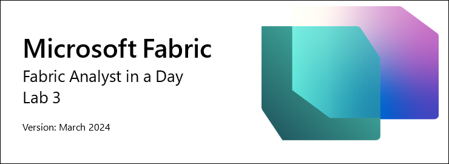

# Contents
   * Introduction	3

   * Dataflow Gen2

     * Task 1: Create Dataflow Gen2

     * Task 2: Create a connection to ADLS Gen2

     * Task 3: Create Base ADLS Gen2 folder query

     * Task 4: Create Cities query

     * Task 5: Create Countries query	

     * Task 6: Create States using Copy – Option 1	

     * Task 7: Create Geo query by Copy – Option 2	

     * Task 8: Configure Data Destination for Geo query

     * Task 9: Publish Dataflow	

     * Task 10: Rename Dataflow

     * Task 11: Build remaining queries in Dataflow

     * Task 12: Configure Data destination for remaining queries

   * References	

# **Introduction** 
In our scenario, Sales Data comes from the ERP system and is stored in an ADLS Gen2 database. It gets updated at noon / 12 PM every day. We need to transform and ingest this data into Lakehouse and use it in our model. 

There are multiple ways to ingest this data. 

- **Shortcuts:** This does not provide a way to transform data. 
- **Notebooks:** This requires us to write code. It is a developer-friendly approach.
- **Dataflow Gen2:** You are probably familiar with Power Query or Dataflow Gen1. Dataflow Gen2, as the name indicates, is the newer version of Dataflow. It provides all the capabilities of Power Query / Dataflow Gen1 with the added ability to transform and ingest data into multiple data sources. We are going to introduce this in the next couple of labs.
- **Data Pipeline:** This is an orchestration tool. Activities can be orchestrated to extract, transform, and ingest data. We will be using Data Pipeline to execute Dataflow Gen2 activity which in turn will perform extraction, transformation, and ingestion. 

We will start with Dataflow Gen2 to create the connection to the data source and the necessary transformations. Then we will use Data Pipeline to orchestrate/execute the Dataflow Gen2.

By the end of this lab, you will have learned: 

- How to create Dataflow Gen2
- How to connect to ADLS Gen2 using Dataflow Gen2 and transform data
- How to ingest data into Lakehouse


# **Dataflow Gen2**

### Task 1: Create Dataflow Gen2

1. Let’s navigate back to the **Fabric workspace** you created in the earlier Lab 2, Task 9.
1. If you have not navigated away after the previous lab, you will be in the Lakehouse screen. If you have navigated away that is fine. Select the **Fabric experience selector** icon from the bottom left of your screen.
1. Select **Data Factory** from the open Fabric experience dialog. Data Factory has workloads needed to extract, transform, and ingest data.

   

1. You will be navigated to the Data Factory Home page. Under New, select **Dataflow Gen2**. 

   

You will be navigated to the **Dataflow page**. This screen will look familiar as it is like Dataflow Gen1 or Power Query. You will notice the options to connect to various data sources are available, along with the ability to transform data. Let’s connect to the ADLS Gen2 data source and perform some transformations.

### Task 2: Create a connection to ADLS Gen2

1. From the ribbon, select **Home -> Get data -> More…** 

   

1. You'll be directed to the  **Get data Choose data source** dialog where you can search for your data source using the search box. On the left panel, you'll see options for **Blank table**, **Blank query**, and **Upload files** (to be explored in a later lab). For now, click **View more ->** in the top-right corner of the screen.

   

   Now you can view all the available data sources. You have the option to filter the data sources by File, Database, Microsoft Fabric, Power Platform, Azure, etc.

    

1. Select **Azure** from the top to filter down to Azure data sources. 
1. Select **Azure Data Lake Storage Gen2**.

   

1. You will be navigated to the Connect to Data Source dialog. You need to create a connection to the ADLS Gen2 data source. Under **Connection Settings -> URL** enter
   ```
   https://stvnextblobstorage.dfs.core.windows.net/fabrikam-sales/Delta-Parquet-Format
   ```
   

1. Select **Account Key** from the Authentication kind dropdown.
1. Copy the **Adls storage account Access Key** from the **Environment Variables** tab (next to the Lab Guide tab) and paste it in the **Account key text box**.

   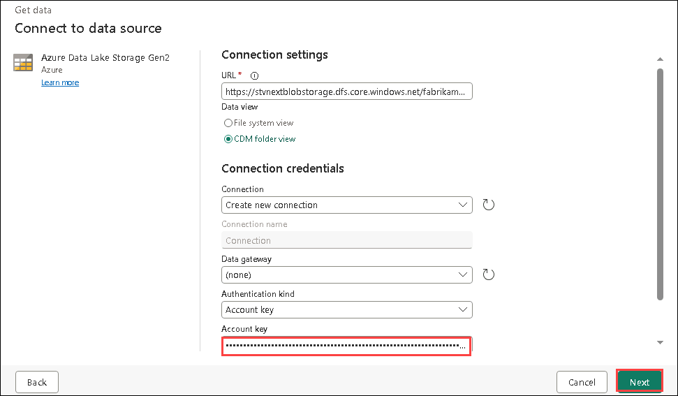

1. Select **Next** on the bottom right of the screen.

### Task 3: Create Base ADLS Gen2 folder query

1. Once the connection is established, you will be navigated to the **Preview folder data** screen. There are a lot of files in the ADLS Gen2 folder. We need data from a few of them. Select **Create** to create a connection to the folder.

   

1. You are back in the **Power Query** dialog. This will be the connection to the root folder of ADLS Gen2. We will reference this query in subsequent queries. Let’s rename the query. In the right panel, under **Query settings -> Properties -> Name**, change the name to **ADLS Base Folder**.
1. All queries from Dataflow Gen2 are loaded to a Staging Lakehouse by default. As part of this lab, we will not be staging data. To disable this load, in the **left panel, right-click on ADLS Base Folder** query. 

   >**Note:** Staging is used when we need to stage data to be used in further transformation before it is ready for consumption. 

1. **Uncheck Enable Staging** option.

   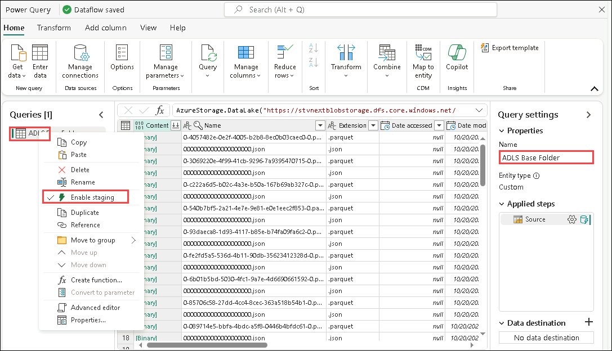

   Notice there are two file formats in the folder, **json** and **parquet**.
   
   - **Parquet:** is an open-source file format built to handle flat columnar storage data formats. Parquet operates well with complex data in large volumes and is known for its both performant data compression and its ability to handle a wide variety of encoding types.
   
   - **Json:** file contains metadata like schema, and data type of the parquet file.

1. We need only the parquet file as this has the data we need. Select the **Extension column dropdown arrow**.

1. **Uncheck .json** so it is filtered down to .parquet files.
1. Select **OK**.

   

Now we have the Base query set up. We can reference this query for all the Geo queries.

### Task 4: Create Cities query
Sales Data is available by Geography, Product, salesperson, and Date granularity. Let’s first create a query to get the Geo dimension. Geo data is available in three different files located in the following subfolders:

- **Cities:** Application.Cities
- **Countries:** Application.Countries
- **State:** Application.StateProvinces

We need to combine City, State, and Country data from these three files to create the Geo dimension.

1. Let’s start with City. On the left panel, right-click on **ADLS Base Folder**. Select **Reference** to create a new query that references the ADLS Base Folder.

   

1. Select the **Folder Path column dropdown arrow(1)**.
1. Select **Text filters(2) -> Contains...(3)**.

   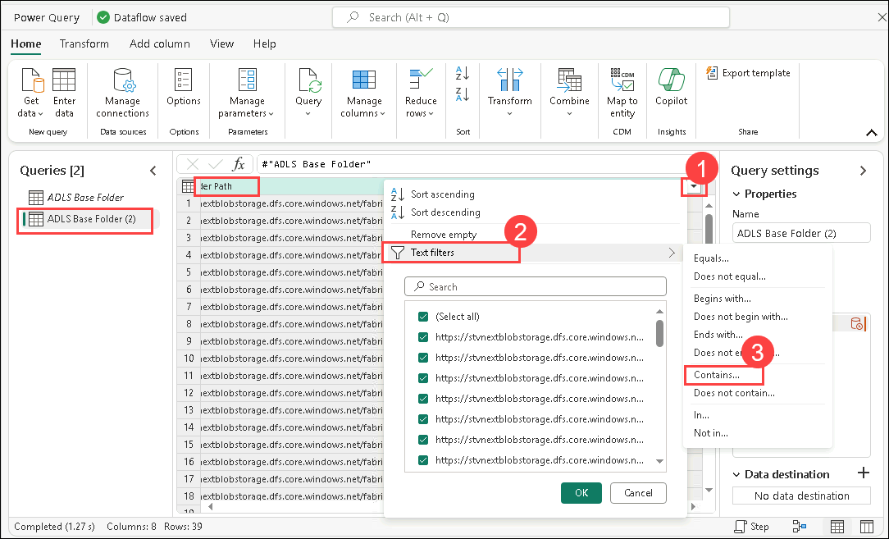

1. In the **Filter rows** dialog enter **Application.Cities** 
   
   >**Note:** This is case-sensitive

1. Select **OK**.

   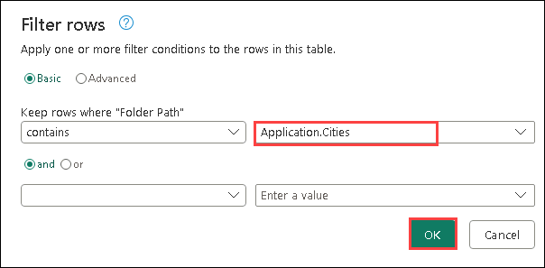

1. Data will be filtered to a single row. Select **Binary** under the **Content** column.

   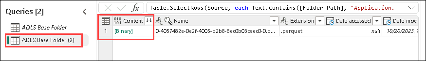

1. Notice you will see all the City details. In the **right panel**, under **Query settings -> Properties -> Name**, change the name to **Cities**.

    >**Note:** In the bottom right corner of the screenshot please make sure the query has four steps and wait for the query to finish loading. It may take a few minutes.
   
      

In the right panel, under **Applied steps** notice all the steps are registered. This behavior is like Power Query. Now let’s follow a similar process to create a **Country** query.

### Task 5: Create Countries query

1. On the left panel, right-click on **ADLS Base Folder**. Select **Reference** to create a new query that references the ADLS Base Folder.

   

1. Select the **Folder Path column dropdown(1)**.

1. Select **Text filters(2) -> Contains...(3)**

   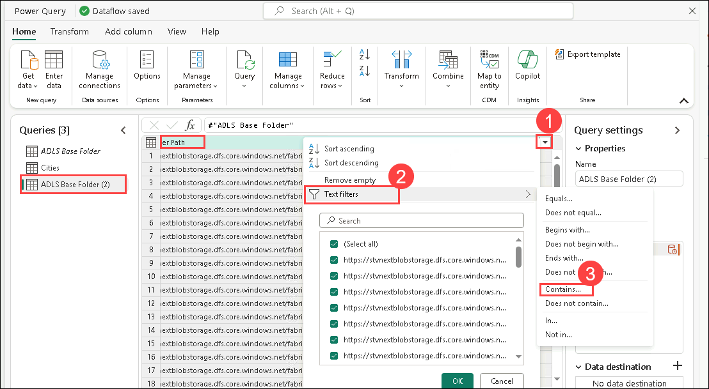

1. In the **Filter rows dialog** enter **Application.Countries** 

   >**Note:** This is case-sensitive.

1. Select **OK**.

   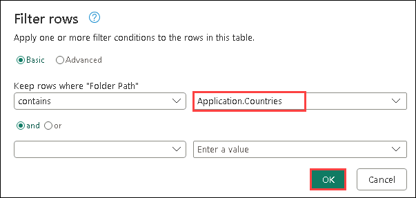

1. Data will be filtered to a single row. Select **Binary** under the **Content column**.

   

1. Notice you will see all the Country details. In the **right panel**, under **Query settings -> Properties -> Name**, change the name to **Countries**

    >**Note:** In the bottom right corner of the screenshot please make sure the query has four applied steps and wait for the query to finish loading. It may take a few minutes

    

We need to bring in State next, but the steps are getting repetitive. We already have the queries in the Power BI Desktop file. Let’s see if we can copy over the queries from there.

### Task 6: Create States using Copy – Option 1

1. If you have not already opened it, open the **FAIAD.pbix** located in the **Report** folder on the **Desktop** of your lab environment. The file will open in Power BI Desktop.

       
   
1. From the ribbon select **Home -> Transform data**. The power Query window opens. As you have noticed in the earlier lab, queries in the left panel are organized by the data source.

   

1. From the left panel, under the ADLSData folder, **right-click on the States** query and select **Copy**.

   

1. Navigate back to the **browser**. You should be in the Dataflow we were working on.
1. On the left panel select the **Queries** panel and enter **Ctrl+V** (currently right click Paste is not supported). If you are using **MAC device**, please use **Cmd+V** to paste.

   >**Note**: If you are working in the lab environment, please select the ellipsis on the top right of the screen. Use the slider to enable **VM Native Clipboard**. Select OK in the dialog. Once done pasting the query you can disable this option.
   
      

       

       

      Notice that **ADLS Base Folder** is copied as well. This is because States refers to the ADLS Base Folder in Power BI Desktop, but we already have the ADLS Base Folder. Let’s resolve this.

1. Select the **States** query.
1. From the **right panel**, under **Applied** **steps**, select **Source**.
1. In the formula bar, change from #”ADLS Base Folder (2)” to **#”ADLS Base Folder”**.

    

1. Click the **check mark** next to the formula bar or hit **Enter**.

   

1. Now we can remove the ADLS Base Folder (2). In the left panel, under **Queries** section, **right click** **ADLS Base Folder** query and select **Delete**.

   

1. Delete query dialog appears. Select **Delete** to confirm.

   >**Note:** Please make sure the query has four applied steps and wait for the query to finish loading. It may take a few minutes.

### Task 7: Create Geo query by Copy – Option 2

Now we need to merge these queries to create the Geo dimension. Let’s copy the query again from the Power BI Desktop file. This time let’s copy the code from Advanced Editor.

1. Navigate back to the **Power Query window** of the Power BI Desktop file.
1. From the left panel, under **Queries** select **Geo** query in ADLSData folder.
1. From the ribbon select **Home -> Advanced Editor**.

   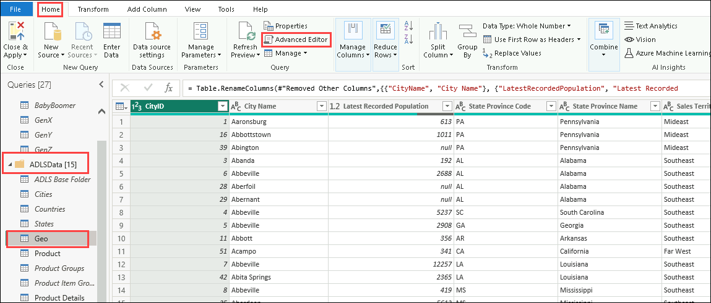

1. Advanced Editor window open. **Highlight all the text** in Advanced Editor.
1. **Right click** and select **Copy**.

   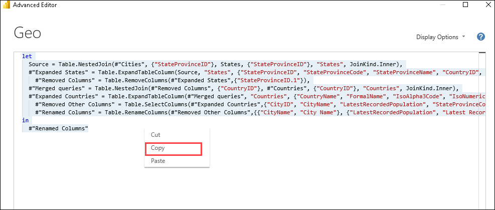

1. Select **X** on the top right corner of the window or select **Done** to close the Advanced Editor window.
1. Navigate back to the **Dataflow** window in the browser. 
1. From the ribbon **Get data -> Blank query**.

   

1. Get data, Connect to the data source Advanced Editor dialog opens. **Highlight all the text** in the editor.
1. Select **Delete** on your keyboard to delete all the text
1. Advanced Editor should be blank. Now enter **Ctrl+V** to paste the content you had copied from the Power BI Desktop’s Advanced Editor.
1. Select **Next**.

   

1. Now we have the Geo dimension. Let’s rename the query. In the **right panel**, under **Query settings -> Properties -> Name**, change the name to **Geo**.

   >**Note:** Please wait for the query to finish loading. It may take a few minutes.

Let’s walk through the steps to understand how Geo was created. From the right panel, under Applied Steps, select **Source**. If you look at the formula bar or click on Settings, you will notice that the Source of this query is a join between Cities and States. As you walk through the steps, you will notice the result of the first join is in turn joined with Countries. So, all three queries are used to create a Geo dimension.

   

### Task 8: Configure Data Destination for Geo query

Now we have a dimension, let’s ingest this data into Lakehouse. This is the new feature available in Dataflow Gen2.

1. As mentioned earlier, we are not staging any of this data. So **right-click** on the **Cities** query and select **Enable staging** to remove the check mark.

   

1. Follow the same steps for **Countries and Geo** queries **to remove the check mark next to Enable staging**.

1. Select **Geo** query.

1. On the bottom right corner select **+** next to **Data destination**.

1. Select **Lakehouse** from the dialog.

   

1. Connect to data destination dialog opens. We need to create a new Connection to the Lakehouse.From the Connection dropdown select **Lakehouse (none)** and then select **Next**.

   

1. Once the connection is created, the choose destination target dialog opens. Make sure the **New table radio button** is selected, since we are creating a new table.
1. We want to create the table in the Lakehouse we created earlier. In the left panel, navigate to **Lakehouse -> FAIAD_username**.
1. Select **lh\_FAIAD**
1. Leave the table name as **Geo**
1. Select **Next**.

   

1. Choose destination settings dialog opens. Use the **slider** to **disable automatic settings**. Let’s check out the options.
   Notice there are options to **Append data** to an existing table or **Replace** it. 
   Also, notice there are Schema options on publish. You have the option of keeping the schema fixed, or if it is going to change over time there is a dynamic schema option.

1. Notice there is a warning that "Some column names contain unsupported characters. Should we fix them for you?" Lakehouse does not support column names with space in it. If you choose to select Fix it, it will add underscores to replace space in column names.

   >**Note:** The check box to the right of the Source column lets you pick only those columns you want to load to the Lakehouse.  

1. In our scenario, we are going to use automatic settings. **Enable Use automatic settings** slider. Notice it automatically fixes destination column names with an underscore.

1. Column mapping can be used to map dataflow columns to existing columns. In our case, it is a New Table. Hence, we can use the defaults. Select **Save settings**.

   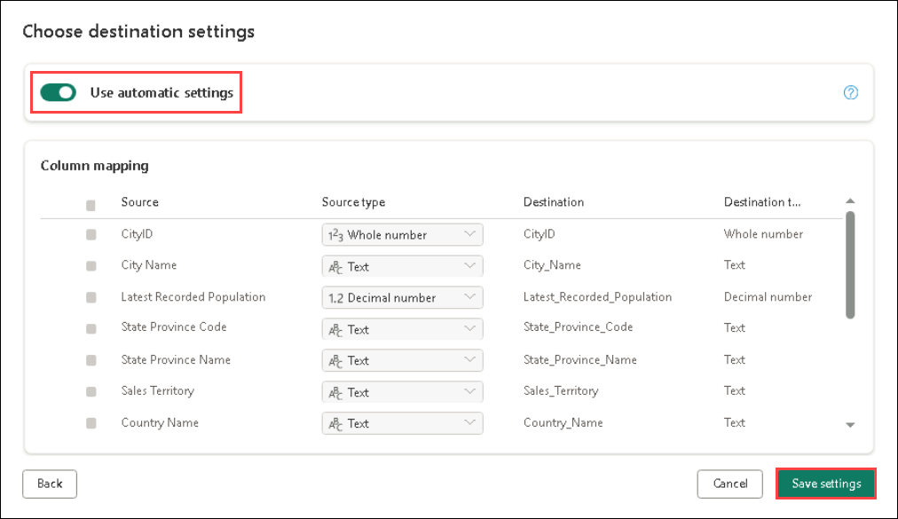

### Task 9: Publish Dataflow

1. You will be navigated back to the **Power Query window**. Notice on the bottom right corner, **Data destination is set to Lakehouse**.

1. Let’s Publish these queries so we can review the Lakehouse. We will come back to add more queries. On the bottom right corner, select **Publish**.

   

1. You will be navigated back to the **FAIAD_username workspace**. It may take a few moments for the Dataflow to Publish. Once done, select **lh_FAIAD Lakehouse** either from the center pane or the left panel.

   

1. You will be navigated to the **Lakehouse Explorer screen**. In the left panel, expand **lh\_FAIAD -> Tables**.

1. Notice we have a Geo table in the Lakehouse now. Expand **Geo** and notice all the columns.

1. Select the **Geo** table and the data preview will open in the right panel.

   

There is a SQL Endpoint as well, which can be used to query this table. We will look at this option in a later lab. Now that we know Geo data landed in Lakehouse, let’s bring the rest of the data from ADLS Gen2.

### Task 10: Rename Dataflow

1. In the left menu bar, select **FAIAD_username** to be navigated back to the **workspace**.

1. We are working with Dataflow 1. Let’s rename it before we continue. Click on the **ellipsis (…)** next to Dataflow 1. Select **Properties**.

   

1. Dataflow properties dialog opens. Change the name to **df_Sales_ADLS**. 

   >**Note:** We are prepending Dataflow name with **df**. This will make it easy to search and sort.
   
1. In **Description** text box add, **Dataflow to ingest Sales Data from ADLS to Lakehouse**.
1. Select **Save**.

   

### Task 11: Build remaining queries in Dataflow

1. You will be navigated back to the **FAIAD_username workspace**. Select the Dataflow **df_Sales_ADLS** to navigate back into the dataflow.

   

   To make things easy, let’s see if we can copy over the queries from Power BI Desktop.

1. If you have not already opened it, open the **FAIAD.pbix** located in the **Report** folder on the **Desktop** of your lab environment. The file will open in Power BI Desktop.

      

1. From the ribbon select **Home -> Transform**. The power Query window opens.
1. From the **Queries** panel on the left, **Ctrl+Select** following queries from **ADLSData**.
   
   a. Product
   
   b. Product Groups
   
   c. Product Item Group
   
   d. Product Details
   
   e. Invoice
   
   f. InvoiceLineItems
   
   g. Sales
   
   h. BuyingGroup
   
   i. Reseller
   
   j. Date

      

1. **Right-click** and select **Copy**.

   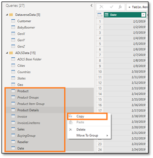
   
1. Navigate back to **df\_Sales\_ADLS** Dataflow window of the browser.

1. On the left panel under select **Queries** panel and enter **Ctrl+V** (currently right click Paste is not supported). If you are using **MAC device**, please use **Cmd+V** to paste.

   >**Note**: If you are working in the lab environment, please select the ellipsis on the top right of the screen. Use the slider to **enable VM Native Clipboard**. Select OK in the dialog. Once done pasting the queries you can disable this option.

   
   
   

1. As mentioned earlier, we are not Staging any of this data. So **right click** on the following queries and select **Enable staging** to remove the check mark.
   
   a. Product
   
   b. Product Details
   
   c. Reseller
   
   d. Date
   
   e. Sales

   >**Note:** If load is disabled in Power BI Desktop, we do not have to disable staging in Dataflow. Hence, we do not have to disable staging for Product Item Groups, Product Groups, etc.

   

   Make sure **all the queries are processed**. Once done, let’s ingest this data into Lakehouse. 

### Task 12: Configure Data destination for remaining queries

1. Select the **Product** query.
1. From the ribbon select **Home -> Add data destination -> Lakehouse**.

   

1. Connect to data destination dialog opens. From the **Connection dropdown** select **Lakehouse (none)**.
1. Select **Next**.

   

1. Choose destination target dialog opens. Make sure the **New table radio button** is selected, since we are creating a new table.
1. We want to create the table in the Lakehouse we created earlier. In the left panel, navigate to **Lakehouse -> FAIAD_username**.
1. Select **lh\_FAIAD**
1. Leave the table name as **Product**.
1. Select **Next**.

   

1. Choose destination settings dialog opens. This time around we will use the automatic settings as this will do a full update of the data. Also, it will rename the columns as needed. Select **Save settings**.

   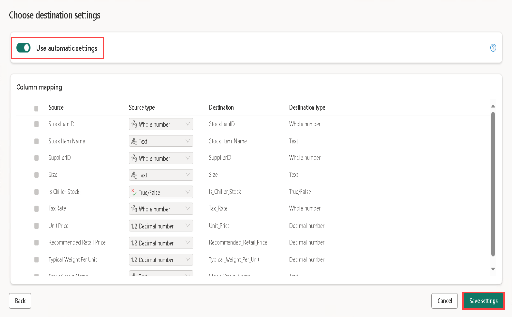

1. You will be navigated back to the **Power Query window**. Notice on the bottom right corner, **Data destination** is set to **Lakehouse**
1. Similarly, set the **Data Destination** for the following queries:
      
      a.	Product Details
      
      b.	Reseller
      
      c.	Sales
      
      d.	Date

1. We have a data flow that ingests data from ADLS into Lakehouse. Let’s go ahead and publish this data flow. Select **Publish** in the bottom right corner.

   

   You will be navigated back to the **FAIAD_username** workspace. It will take a few minutes for the dataflow to refresh.

   In the next lab, we will ingest data from the other data sources.

# **References**
Fabric Analyst in a Day (FAIAD) introduces you to some of the key functions available in Microsoft Fabric. In the menu of the service, the Help (?) section has links to some great resources.

   

Here are a few more resources that will help you with your next steps with Microsoft Fabric.

- See blog post to read the full [Microsoft Fabric GA announcement](https://aka.ms/Fabric-Hero-Blog-Ignite23)
- Explore Fabric through the [Guided Tour](https://aka.ms/Fabric-GuidedTour)
- Sign up for the [Microsoft Fabric free trial](https://aka.ms/try-fabric)
- Visit the [Microsoft Fabric website](https://aka.ms/microsoft-fabric)
- Learn new skills by exploring the [Fabric Learning modules](https://aka.ms/learn-fabric)
- Explore the [Fabric technical documentation](https://aka.ms/fabric-docs)
- Read the [free e-book on getting started with Fabric](https://aka.ms/fabric-get-started-ebook)
- Join the [Fabric community](https://aka.ms/fabric-community) to post your questions, share your feedback, and learn from others

Read the more in-depth Fabric experience announcement blogs:

- [Data Factory experience in Fabric blog](https://aka.ms/Fabric-Data-Factory-Blog) 
- [Synapse Data Engineering experience in Fabric blog](https://aka.ms/Fabric-DE-Blog) 
- [Synapse Data Science experience in Fabric blog](https://aka.ms/Fabric-DS-Blog) 
- [Synapse Data Warehousing experience in Fabric blog](https://aka.ms/Fabric-DW-Blog) 
- [Synapse Real-Time Analytics experience in Fabric blog](https://aka.ms/Fabric-RTA-Blog)
- [Power BI announcement blog](https://aka.ms/Fabric-PBI-Blog)
- [Data Activator experience in Fabric blog](https://aka.ms/Fabric-DA-Blog) 
- [Administration and governance in Fabric blog](https://aka.ms/Fabric-Admin-Gov-Blog)
- [OneLake](https://aka.ms/Fabric-OneLake-Blog)[ in Fabric blog](https://aka.ms/Fabric-OneLake-Blog)
- [Dataverse and Microsoft Fabric integration blog](https://aka.ms/Dataverse-Fabric-Blog)

© 2023 Microsoft Corporation. All rights reserved.

By using this demo/lab, you agree to the following terms:

The technology/functionality described in this demo/lab is provided by Microsoft Corporation for the purposes of obtaining your feedback and providing you with a learning experience. You may only use the demo/lab to evaluate such technology features and functionality and provide feedback to Microsoft. You may not use it for any other purpose. You may not modify, copy, distribute, transmit, display, perform, reproduce, publish, license, create derivative works from, transfer, or sell this demo/lab or any portion thereof.

COPYING OR REPRODUCTION OF THE DEMO/LAB (OR ANY PORTION OF IT) TO ANY OTHER SERVER OR LOCATION FOR FURTHER REPRODUCTION OR REDISTRIBUTION IS EXPRESSLY PROHIBITED.

THIS DEMO/LAB PROVIDES CERTAIN SOFTWARE TECHNOLOGY/PRODUCT FEATURES AND FUNCTIONALITY, INCLUDING POTENTIAL NEW FEATURES AND CONCEPTS, IN A SIMULATED ENVIRONMENT WITHOUT COMPLEX SET-UP OR INSTALLATION FOR THE PURPOSE DESCRIBED ABOVE. THE TECHNOLOGY/CONCEPTS REPRESENTED IN THIS DEMO/LAB MAY NOT REPRESENT FULL FEATURE FUNCTIONALITY AND MAY NOT WORK THE WAY A FINAL VERSION MAY WORK. WE ALSO MAY NOT RELEASE A FINAL VERSION OF SUCH FEATURES OR CONCEPTS. YOUR EXPERIENCE WITH USING SUCH FEATURES AND FUNCTIONALITY IN A PHYSICAL ENVIRONMENT MAY ALSO BE DIFFERENT.

**FEEDBACK**. If you give feedback about the technology features, functionality and/or concepts described in this demo/lab to Microsoft, you give to Microsoft, without charge, the right to use, share and commercialize your feedback in any way and for any purpose. You also give to third parties, without charge, any patent rights needed for their products, technologies and services to use or interface with any specific parts of a Microsoft software or service that includes the feedback. You will not give feedback that is subject to a license that requires Microsoft to license its software or documentation to third parties because we include your feedback in them. These rights survive this agreement.

MICROSOFT CORPORATION HEREBY DISCLAIMS ALL WARRANTIES AND CONDITIONS WITH REGARD TO THE DEMO/LAB, INCLUDING ALL WARRANTIES AND CONDITIONS OF MERCHANTABILITY, WHETHER EXPRESS, IMPLIED OR STATUTORY, FITNESS FOR A PARTICULAR PURPOSE, TITLE AND NON-INFRINGEMENT. MICROSOFT DOES NOT MAKE ANY ASSURANCES OR REPRESENTATIONS WITH REGARD TO THE ACCURACY OF THE RESULTS, OUTPUT THAT DERIVES FROM USE OF DEMO/ LAB, OR SUITABILITY OF THE INFORMATION CONTAINED IN THE DEMO/LAB FOR ANY PURPOSE.

**DISCLAIMER**

This demo/lab contains only a portion of new features and enhancements in Microsoft Power BI. Some of the features might change in future releases of the product. In this demo/lab, you will learn about some, but not all, new features.
