# Microsoft Fabric - Fabric Analyst in a Day - Lab 6

# 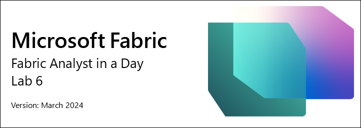
 
# Contents

- Introduction	

- Lakehouse

    - Task 1: Query data using SQL

    - Task 2: Visualize T-SQL result

    - Task 3: Create Visual query

    - Task 4: Visualize query results

    - Task 5: Create Relationships

    - Task 6: Create Measures

    - Task 7: Optional section – Create Relationships
        
    - Task 8: Optional section – Create Measures

- References

# Introduction 

We have data from various sources ingested into the Lakehouse. In this lab, you will work with the data model. Typically, we performed modeling activities like creating relationships, adding measures, etc. in Power BI Desktop. Here we will learn how to perform these modeling activities in the service. 

By the end of this lab, you will have learned: 

- How to explore Lakehouse

- How to explore SQL view of Lakehouse

- How to explore Data modeling in Lakehouse

# Lakehouse

## Task 1: Query data using SQL

1. Let’s navigate back to the Fabric workspace, **FAIAD_<username>** you created in Lab 2, Task 9.

2. You will see three types of lh_FAIAD – Lakehouse, Semantic model and SQL endpoint. We explored the Lakehouse option in an earlier lab. Select the **lh_FAIAD SQL analytics endpoint** option to explore the SQL option. You will be navigated to the **SQL view** of the explorer.

    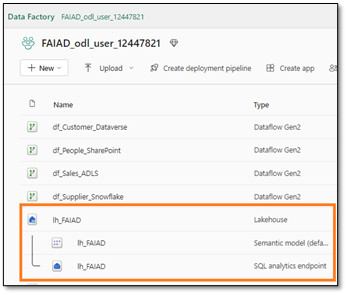
    
If you would like to explore the data before creating a data model, you can use SQL to do so. Let’s look at two options for using SQL, the first one is developer-friendly, and the second option is for analysts. 

Let’s assume you want to quickly find out the Units sold by Supplier using SQL. We have two options, writing a SQL statement or using a visual to create the SQL statement.

Notice on the left panel, you can view the Tables. If you expand the tables, you can view the Columns that make up the table. Also, there are options to create SQL Views, Functions, and Stored Procedures. If you have a SQL background, feel free to explore these options. Let’s try to write a simple SQL query.

3. From the **top menu** select **New SQL query** or from the **bottom of the left panel** select **Query**. You will be navigated to the SQL query view.

    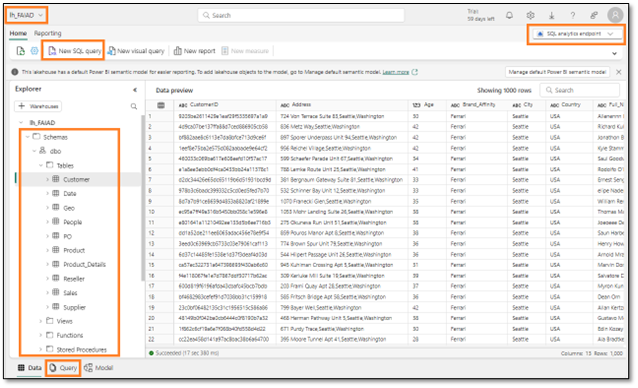
 
4. Paste the **below SQL query** into the **query window**. This query will return the units by Supplier Name. It is joining the Sales table with the Product and Supplier tables to achieve this.

    ```
    SELECT su.SupplierName, SUM(Quantity) as Units
    FROM dbo.Sales s
    JOIN dbo.Product p on p.StockItemID = s.StockItemID
    JOIN dbo.Suppliers su on su.SupplierID = p.SupplierID
    GROUP BY su.SupplierName
    ```

5. Click **Run** to view the results.

6. Notice there is an option to save this query as a View by selecting **Save as view**.

7. On the **left Explorer** panel, under **Queries** section notice this query is saved under **My queries** as **SQL query 1**. This provides an option to rename the query and save it for future use. There is also an option to view queries that are shared with you using the **Shared queries** folder.

    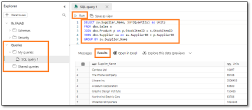

## Task 2: Visualize T-SQL result

1. We can also visualize the result of this query. **Highlight the query** in the query pane and select the **Results pane** then select **Explore this data**.

    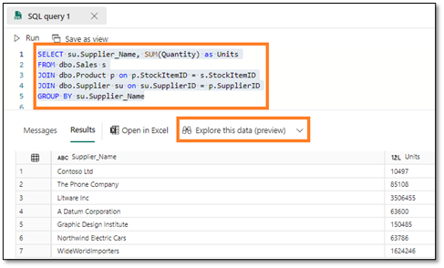
   
2. **Explore SQL query** dialog opens. From the **Data** pane, expand **SQL query 1**.

3. Select **Supplier_Name** and **Units fields**. A clustered bar chart is created.

4. From the **Visualization** section, change the visual type by selecting the **Stacked column chart**.

    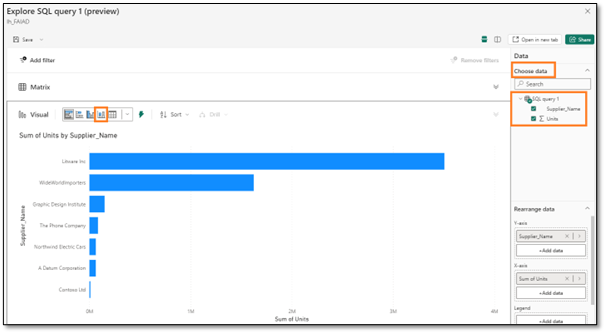
 
5. **Expand Matrix** to view the data as a matrix. 

    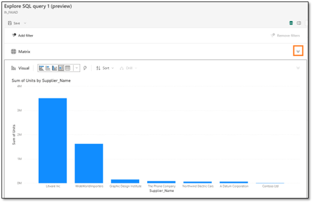
 
6. Select **Save - > Save as report** on the top right of the screen.

    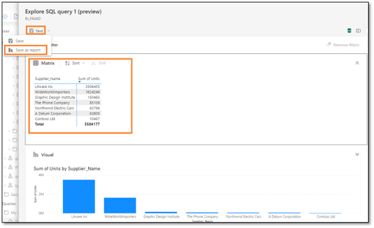
 
7. Save your report dialog opens. Type **Units by Supplier** in the **Enter a name for your report textbox**.

8. Make sure the destination workspace is your Fabric workspace, **FAIAD<username>**

9. Select **Save**.

    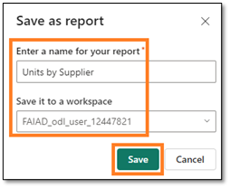
   
    You will be navigated to the full report experience. You have options to format the visuals. We will look at these options in the next lab.

10. From the left panel, select **lh_FAIAD**.

    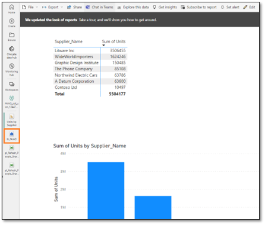
 
## Task 3: Create Visual query

You will be navigated back to the **SQL analytics endpoint view**. If you are not familiar with SQL, you can execute a similar query using a visual query.

1. From the top menu select **New visual query**. A visual query pane opens.

2. From the **Explorer** pane, expand **Schemas -> dbo -> Tables**.

3. Drag **Sales, Product, and Supplier** tables to the visual query pane.

    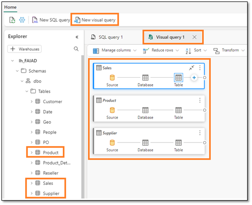
 
4. With the **Sales** table selected, from the Visual query pane menu, select **Combine -> Merge queries**.

    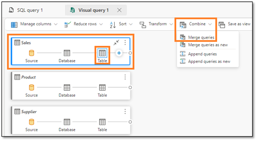
     
5. Merge dialog opens. From the **Right table for merge dropdown** select **Product**.

6. Select **StockItemID** from both **Sales** and **Product** table. This is to merge the Product and Sales tables.

7. From the **Join kind**, select **Left outer**.

8. Select **OK**.

    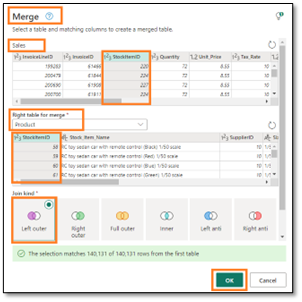
 
9. In the **results** pane, click on the **double arrow** next to the **Product** column.

10. Dialog opens, select **SupplierID** from the dialog.

11. Select **OK**. Notice that **Merged queries** and **Expanded Product** steps are created in the **Sales** table.

    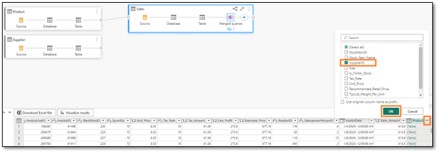
 
12. Similarly, let’s merge the Supplier table. Within the **Sales** table select “**+**” (located after Expanded Product) to add a new step. Dialog opens.

13. Select **Combine -> Merge queries**.

    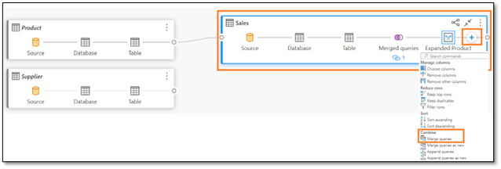
 
14. Merge dialog opens. From the **Right table for merge dropdown** select **Suppliers**.

15. Select **SupplierID** from both **Sales** and **Supplier** table. This is to merge the Supplier and Sales tables.

16. From the **Join kind**, select **Left outer**.

17. Select **OK**.

    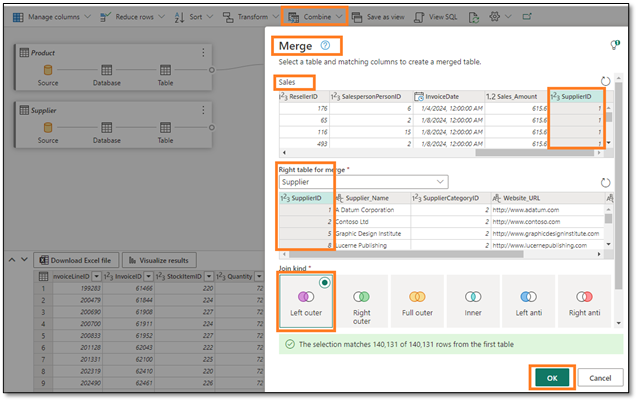
 
18. In the **results** pane, click on the **double arrow** next to **Supplier** column.

19. Dialog opens, select **Supplier_Name** from the dialog.

20. Select **OK**. Notice in the Sales table, that **Merged queries** is added and the **steps are recorded**.  

    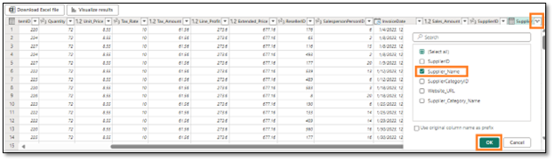
 
21. Let’s now group by Supplier name to get quantity by Supplier. Within the **Sales** table select “**+**” (located after Expanded Supplier) to add a new step. Dialog opens.

22. Select **Transform table -> Group by**. Group by dialog opens.
 
    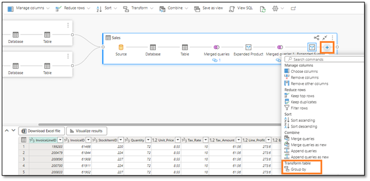

23. From the **Group by** dropdown select **SupplierName**.

24. Enter **Units** in the **New column name**.

25. Set **Operation** to **Sum**

26. Select **Quantity** from **Column** dropdown.

27. Select **OK**.

    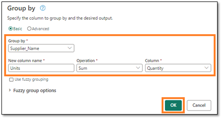
 
Notice all the steps are recorded in the Sales block. (Reference the first screenshot under Task 4.)

## Task 4: Visualize query results

1. Now that we have the query ready, let’s view the result. Select **Visualize results** from the results pane.

   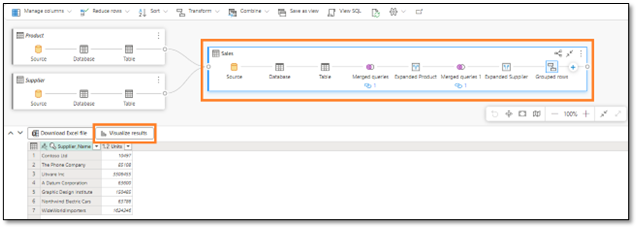
 
2. Visualize results dialog opens. From the **Data** pane on the right, **expand Visual query1**.

3. Select **Supplier_Name** and **Units** fields.

4. Notice the result is like the SQL query result from earlier. If you choose to, you can Save this report. Since we saved a similar report earlier, we are going to select **Cancel**.

   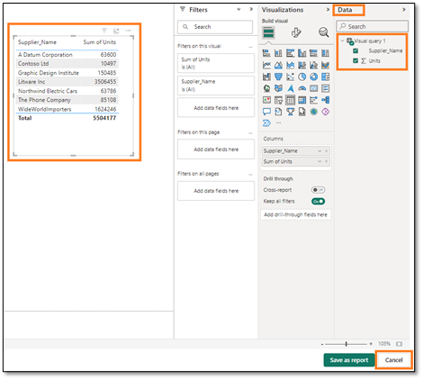
 

## Task 5: Create Relationships

Ok, now we are ready to build the model, build relationships between tables, and create measures.

1. From the **bottom panel** select **Model**. You will notice the center pane looks like the Model view we see in Power BI Desktop.

2. **Resize and rearrange** the tables as needed.

3. Let’s create a relationship between Sales and Reseller tables. Select **ResellerID** from the **Sales** table and drag it over to **ResellerID** in the **Reseller** table.

    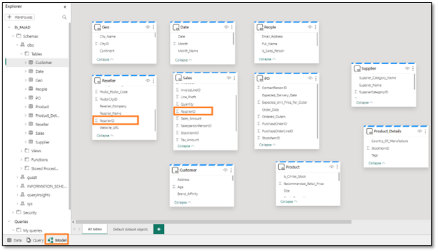
 
4. New relationship dialog opens. Make sure **Table 1** is **Sales** and **Column** is **ResellerID**.

5. Make sure **Table 2** is **Reseller** and **Column** is **ResellerID**.

6. Make sure **Cardinality** is **Many to one (*:1)**.

7. Make sure **Cross filter direction** is **Single**.

8. Select **Save**.
 
    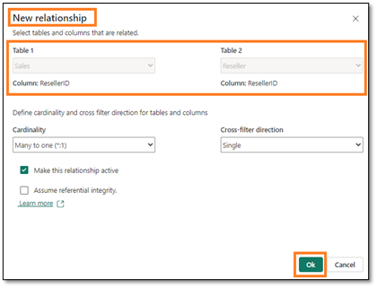

9. Similarly, create a relationship between the Sales and Date tables. Select **InvoiceDate** from the **Sales** table and drag it over to **Date** in the **Date** table.

10. New relationship dialog opens. Make sure **Table 1** is **Sales** and **Column** is **InvoiceDate**.

11. Make sure **Table 2** is **Date** and **Column** is **Date**.

12. Make sure **Cardinality** is **Many to one (*:1)**.

13. Make sure **Cross filter direction** is **Single**.

14. Select **Save**.

    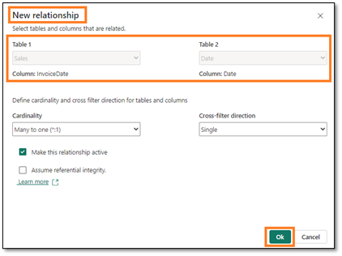
 
15. Similarly, create a **many-to-one** relationship between **Sales** and **Product** tables. Select **StockItemID** from the **Sales** table and drag it over to **StockItemID** in the **Product** table.

16. From the top menu select **Reporting -> Automatically update semantic model** to save and update the model. 

    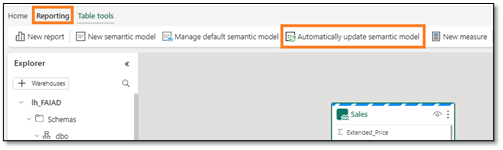
 
    **Checkpoint**: Your model should have the three relationships between Sales and Reseller tables, Sales and Date and Sales and Product tables as shown in the below screenshot:

    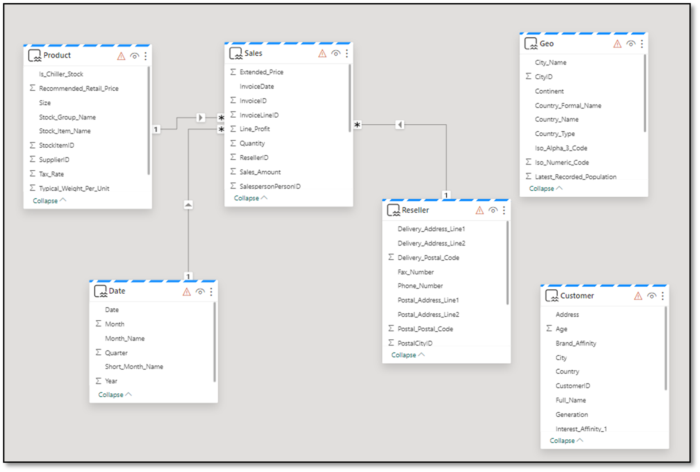
 
    For the sake of time, we will not be creating all the relationships. If time permits, you can complete the optional section at the end of the lab. The optional section walks through the steps to create the remaining relationships.

## Task 6: Create Measures

Let’s add a few measures which we need to create the Sales dashboard.

1. Select **Sales table** from the model view. We want to add the measures to the Sales table.

2. From the top menu, select **Home -> New Measure**. Notice the formula bar is displayed.  

3. Enter **Sales = SUM(Sales[Sales_Amount])** in the **formula bar**.

4. Click the **check mark** left of the formula bar or click the **Enter** button.

5. In the Properties panel on the right, expand the **Formatting** section.

6. From the **Format** dropdown select **Whole number**.

    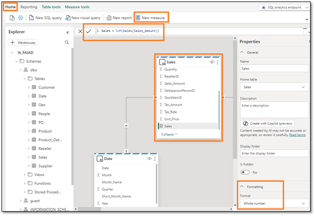
 
7. With the **Sales table** selected from the top menu, select **Home -> New Measure**. Notice the formula bar is displayed.

8. Enter **Units = SUM(Sales[Quantity])** in the **formula bar**.

9. Click the **check mark** left of the formula bar or click the **Enter** button.

10. In the Properties panel on the right, expand the **Formatting** section (it may take a few moments for the Properties panel to load).

11. From the **Format** dropdown select **Whole number**.

    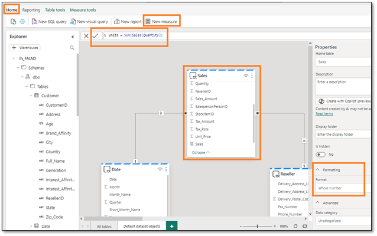
 
12. With the **Sales table** selected from the top menu, select **Home -> New Measure**. Notice the formula bar is displayed.

13. Enter **Orders = DISTINCTCOUNT(Sales[InvoiceID])** in the **formula bar**.

14. Click the **check mark** left of the formula bar or click the **Enter** button.

15. In the Properties panel on the right, expand the **Formatting** section.

16. From the Format dropdown select **Whole number**.

    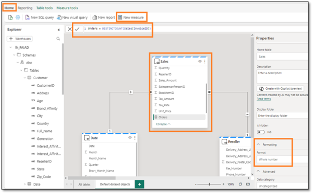
 
    Again, for the sake of time, we will not be creating all the measures. If time permits, you can complete the optional section at the end of the lab. The optional section walks through the steps to create the remaining measures.
  
    We have created a data model, the next step is to create a report. We will do that in the next lab.

## Task 7: Optional section – Create Relationships

Let’s add the remaining relationships.

1. Similarly, create a **many-to-one** relationship between **Sales** and **People**. Select **SalespersonPersonID** from **Sales** and **PersonID** from **People**. 

    **Checkpoint**: Your model should look like the screenshot below.

    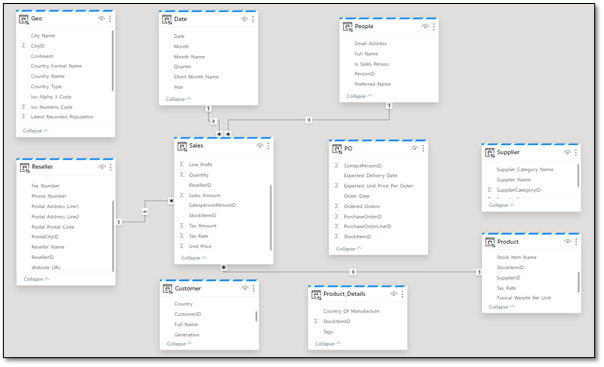
 
2. Now let’s create a relationship between the Product and the Supplier. Select **SupplierID** from the **Product** table and drag it over **SupplierID** in the **Supplier** table.

3. New relationship dialog opens. Make sure **Table 1** is **Product** and **Column** is **SupplierID**.

4. Make sure **Table 2** is **Supplier** and **Column** is **SupplierID**.

5. Make sure **Cardinality** is **Many to one (*:1)**.

6. Make sure **Cross filter direction** is **Both**.

7. Select **Ok**.

    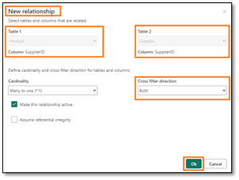

8. Similarly, create a **many to one** relationship with **Cross filter direction** as **Both** between **Product_Details** and **Product**. Select **StockItemID** from **Product_Details** and **StockItemID** from **Product**.

9. Now let’s create a relationship between Reseller and Geo. Select **PostalCityID** from the **Reseller** table and drag it over **CityID** in the **Geo** table.

10. New relationship dialog opens. Make sure **Table 1** is **Reseller** and **Column** is **PostalCityID**.

11. Make sure **Table 2** is **Geo** and **Column** is **CityID**.

12. Make sure **Cardinality** is **Many to one (*:1)**.

13. Make sure **Cross filter direction** is **Both**.

14. Select **Ok**.

    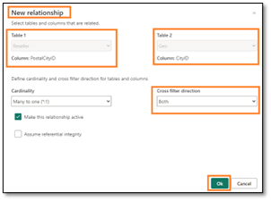
 
15. Now let’s create a relationship between the Customer and the Reseller. Select **ResellerID** from the **Customer** table and drag it over **ResellerID** in the **Reseller** table.

16. New relationship dialog opens. Make sure **Table 1** is **Customer** and **Column** is **ResellerID**.

17. Make sure **Table 2** is **Reseller** and **Column** is **ResellerID**.

18. Make sure **Cardinality** is **Many to one (*:1)**.

19. Make sure **Cross filter direction** is **Single**.

20. Select **Ok**.  

    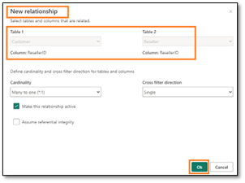
 	
    **Checkpoint**: Your model should look like the screenshot below.

    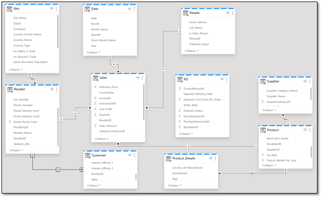
 
21. Now let’s create a relationship between PO and Date. Select **Order_Date** from the **PO** table and drag it over **Date** in the **Date** table.

22. New relationship dialog opens. Make sure **Table 1** is **PO** and **Column** is **Order_Date**.

23. Make sure **Table 2** is **Date** and **Column** is **Date**.

24. Make sure **Cardinality** is **Many to one (*:1)**.

25. Make sure **Cross filter direction** is **Single**.

26. Select **OK**.

    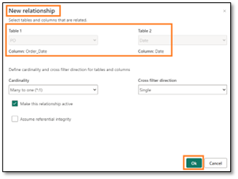
 
27. Similarly, create a **many to one** relationship between **PO** and **Product**. Select **StockItemID** from **PO** and **StockItemID** from **Product**.

28. Similarly, create a **many to one** relationship between **PO** and **People**. Select **ContactPersonID** from **PO** and **PersonID** from **People**. 

    We are done creating all the relationships. 

    **Checkpoint**: Your model should look like the screenshot below.

    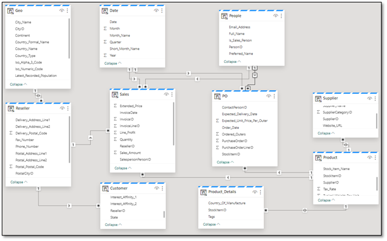
 
## Task 8: Optional section – Create Measures

Let’s add the remaining measures.

1. Select **Sales** table and from the top menu select **Table tools -> New Measure**.

2. Enter **Avg Order = DIVIDE([Sales], [Orders])** in the formula bar.

3. Click the **check mark** in the formula bar or click the Enter button.

4. Once the measure is saved, notice the Measure tools option on the top menu. Click **Measure tools**.

5. From the Format drop-down, click **Decimal Number**.

    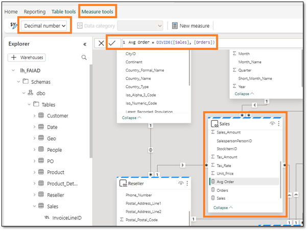
 
6. Follow similar steps to add the following measures:

    a. **GM = SUM(Sales[Line_Profit])** formatted as **Decimal number**.

    b. **GM% = DIVIDE([GM], [Sales])** formatted as **Percentage**.

    c. **No of Customers = COUNTROWS(Customer)** formatted as **Whole Number**

## References
Fabric Analyst in a Day (FAIAD) introduces you to some of the key functions available in Microsoft Fabric. In the menu of the service, the Help (?) section has links to some great resources.

    
 
Here are a few more resources that will help you with your next steps with Microsoft Fabric.

- See the blog post to read the full [Microsoft Fabric GA announcement](https://aka.ms/Fabric-Hero-Blog-Ignite23)
- Explore Fabric through the [Guided Tour](https://aka.ms/Fabric-GuidedTour)
- Sign up for the [Microsoft Fabric free trial](https://aka.ms/try-fabric)
- Visit the [Microsoft Fabric website](https://aka.ms/microsoft-fabric)
- Learn new skills by exploring the [Fabric Learning modules](https://aka.ms/learn-fabric)
- Explore the [Fabric technical documentation](https://aka.ms/fabric-docs)
- Read the [free e-book on getting started with Fabric](https://aka.ms/fabric-get-started-ebook)
- Join the [Fabric community ](https://aka.ms/fabric-community) to post your questions, share your feedback, and learn from others

Read the more in-depth Fabric experience announcement blogs:

- [Data Factory experience in Fabric blog](https://aka.ms/Fabric-Data-Factory-Blog) 
- [Synapse Data Engineering experience in Fabric blog](https://aka.ms/Fabric-DE-Blog) 
- [Synapse Data Science experience in Fabric blog](https://aka.ms/Fabric-DS-Blog) 
- [Synapse Data Warehousing experience in Fabric blog](https://aka.ms/Fabric-DW-Blog) 
- [Synapse Real-Time Analytics experience in Fabric blog](https://aka.ms/Fabric-RTA-Blog)
- [Power BI announcement blog](https://aka.ms/Fabric-PBI-Blog)
- [Data Activator experience in Fabric blog](https://aka.ms/Fabric-DA-Blog) 
- [Administration and governance in Fabric blog](https://aka.ms/Fabric-Admin-Gov-Blog)
- [OneLake](https://aka.ms/Fabric-OneLake-Blog)[ in Fabric blog](https://aka.ms/Fabric-OneLake-Blog)
- [Dataverse and Microsoft Fabric integration blog](https://aka.ms/Dataverse-Fabric-Blog)

© 2023 Microsoft Corporation. All rights reserved.

By using this demo/lab, you agree to the following terms:

The technology/functionality described in this demo/lab is provided by Microsoft Corporation for the purposes of obtaining your feedback and providing you with a learning experience. You may only use the demo/lab to evaluate such technology features and functionality and provide feedback to Microsoft. You may not use it for any other purpose. You may not modify, copy, distribute, transmit, display, perform, reproduce, publish, license, create derivative works from, transfer, or sell this demo/lab or any portion thereof.

COPYING OR REPRODUCTION OF THE DEMO/LAB (OR ANY PORTION OF IT) TO ANY OTHER SERVER OR LOCATION FOR FURTHER REPRODUCTION OR REDISTRIBUTION IS EXPRESSLY PROHIBITED.

THIS DEMO/LAB PROVIDES CERTAIN SOFTWARE TECHNOLOGY/PRODUCT FEATURES AND FUNCTIONALITY, INCLUDING POTENTIAL NEW FEATURES AND CONCEPTS, IN A SIMULATED ENVIRONMENT WITHOUT COMPLEX SET-UP OR INSTALLATION FOR THE PURPOSE DESCRIBED ABOVE. THE TECHNOLOGY/CONCEPTS REPRESENTED IN THIS DEMO/LAB MAY NOT REPRESENT FULL FEATURE FUNCTIONALITY AND MAY NOT WORK THE WAY A FINAL VERSION MAY WORK. WE ALSO MAY NOT RELEASE A FINAL VERSION OF SUCH FEATURES OR CONCEPTS. YOUR EXPERIENCE WITH USING SUCH FEATURES AND FUNCTIONALITY IN A PHYSICAL ENVIRONMENT MAY ALSO BE DIFFERENT.

**FEEDBACK**. If you give feedback about the technology features, functionality and/or concepts described in this demo/lab to Microsoft, you give to Microsoft, without charge, the right to use, share and commercialize your feedback in any way and for any purpose. You also give to third parties, without charge, any patent rights needed for their products, technologies and services to use or interface with any specific parts of a Microsoft software or service that includes the feedback. You will not give feedback that is subject to a license that requires Microsoft to license its software or documentation to third parties because we include your feedback in them. These rights survive this agreement.

MICROSOFT CORPORATION HEREBY DISCLAIMS ALL WARRANTIES AND CONDITIONS WITH REGARD TO THE DEMO/LAB, INCLUDING ALL WARRANTIES AND CONDITIONS OF MERCHANTABILITY, WHETHER EXPRESS, IMPLIED OR STATUTORY, FITNESS FOR A PARTICULAR PURPOSE, TITLE AND NON-INFRINGEMENT. MICROSOFT DOES NOT MAKE ANY ASSURANCES OR REPRESENTATIONS WITH REGARD TO THE ACCURACY OF THE RESULTS, OUTPUT THAT DERIVES FROM USE OF DEMO/ LAB, OR SUITABILITY OF THE INFORMATION CONTAINED IN THE DEMO/LAB FOR ANY PURPOSE.

**DISCLAIMER**

This demo/lab contains only a portion of new features and enhancements in Microsoft Power BI. Some of the features might change in future releases of the product. In this demo/lab, you will learn about some, but not all, new features.
