# Microsoft Fabric - Fabric Analyst in a Day - Lab 7

# 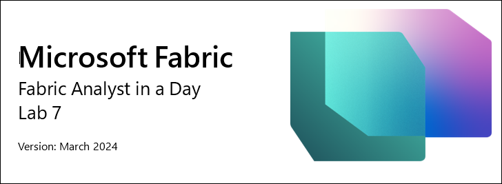


# Contents
* Introduction

* Power BI

    * Task 1: Auto-Create Report

    * Task 2: Configure background for a New report

    * Task 3: Add Header to the report	

    * Task 4: Add KPIs to the report	

    * Task 5: Add Line chart to the report

    * Task 6: Save the report	

    * Task 7: Configure Year column in Date table

    * Task 8: Configure Short_Month_Name column in Date table

    * Task 9: Format Line chart	

    * Task 10: Add new data to simulate Direct Lake Mode

* Clean up Lab environment

* References

#
# <a name="_toc152166234"></a>**Introduction** 

We have ingested data from different data sources into Lakehouse, were introduced to Lakehouse, set a refresh schedule for the data sources and created a data model. Now we are going to create a report.

By the end of this lab, you will have learned: 
-	How to auto-create a report
-	How to build a report starting from a blank canvas
-	How to experience Direct Lake mode resulting in data automatically refreshing

# <a name="_toc152166235"></a>**Power BI**

### <a name="_toc152166236"></a>Task 1: Auto-Create Report

Let’s start by using the auto-create report option. And later in the lab, we will re-create the report we have in Power BI.

1. Let’s navigate back to the **Fabric workspace** you created in the earlier lab.
2. From the bottom of the left panel select the **Fabric experience selector** icon.
3. Fabric experience dialog opens. Select **Power BI**. You will be navigated to the **Power BI Home page**.

    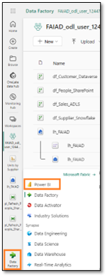
 
4. Select **New Report** from the top menu. 

    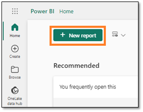

5. You will be navigated to **Build your first report screen**. There will be options to enter data manually and build a report or to pick a published semantic model. We have created a semantic model in the previous labs. Let’s use that. Select **Pick a published semantic model** option.

    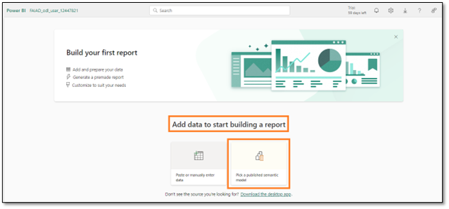
 
6. Pick a dataset to use in your report page opens. Notice we have four options. **Select lh_FAIAD:**

    a. **lh_FAIAD:** This is the lakehouse with the dataset we created and want to use for the report.

    b. **Units by Supplier:** This is the dataset we created using T-SQL.

    c. **DataflowsStagingWarehouse:** This is the staging warehouse which is created by default. We did not use this as we did not stage data.

    d. **DataflowsStagingLakehouse:** This is the staging lakehouse which is created by default. We did not use this as we did not stage data.

7. Click the **arrow next to the Auto-create report button**. Notice there are two options, Auto-create report and Create a blank report. Let’s try auto-creating, so select **Auto-create report**.

    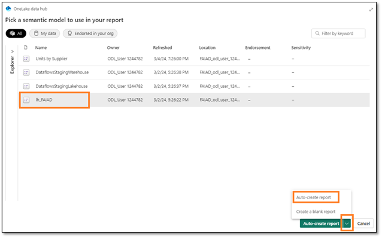

8. Power BI will start auto-creating the report. Notice there is an option to Pre-select data if we choose to. Once the report is ready, a dialog appears on the top right of the screen. Select **View report now**.

    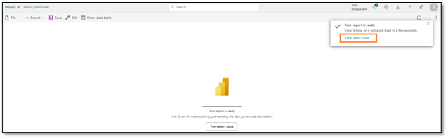
 
   >**Checkpoint:** You will have a report which looks like the screenshot below. There are a few KPIs and some trend visuals. This is a good start if you are analyzing a new model and need a jumpstart.

   >**Note:** Notice on the top menu, that you have the option to Edit the report or view some of the data as tables. Feel free to explore these options.

9. Let’s save this report. From the top menu, select **Save**.

10. Save your report dialog opens. Name the report as **rpt_Sales_Auto_Report**
    
    >**Note:** We are prefixing the report name with rpt which is short for the report.

11. Make sure the report is saved in your workspace, **FAIAD_<username>**.

12. Select **Save**.

    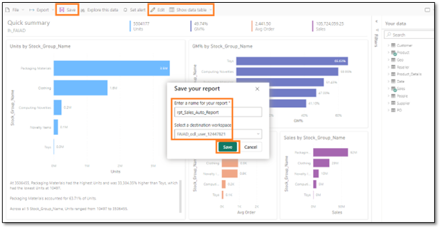
 
    >**Note:** Auto-created report may look different for you as it is “auto-created”. It also depends on the relationships and measures you created in the previous lab (Lab 6). 
    
    The above screenshot is how the auto-created report **may** look if you created all the relationships and measures including the optional relationships (Lab 6).

    The below screenshot is how the auto-created report **may** look if you skipped creating the optional relationships and measures (Lab 6).

    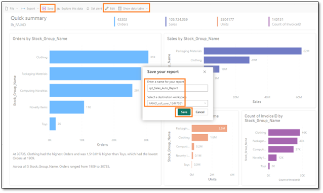
 
### <a name="_toc152166237"></a>Task 2: Configure background for a New report

Let’s create a new report using a blank canvas.

1. In the **left panel,** select your workspace name, **FAIAD_<username>** to be navigated to the workspace.

2. From the top menu, select **New -> Report**. You will be navigated to build your first report page.

    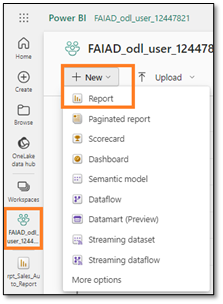
 
3. Select **Pick a published semantic model,** so we can pick the model we have created.

   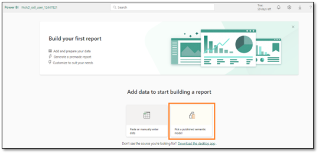
 
4. Pick a semantic model to use in your report dialog opens. Select **lh_FAIAD**.

5. Click the **arrow next to Auto-create report button**. Select **Create a blank report**.

    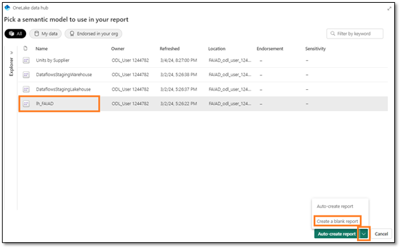
 
6. If you have not already opened it, open the **FAIAD.pbix** located in the **C:\FAIAD\Reports** folder of your lab environment. 

    We are going to use this report as a reference. We will start by adding the canvas background. We will create the report header, add a couple of KPIs, and create the Sales over a line chart. In the interest of time and with the understanding that you have experience with building visuals in Power BI Desktop, we will not be creating all the visuals. 

    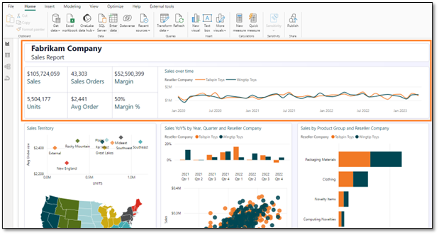
 
7. Navigate back to **Power BI canvas** in your browser.

8. Select **Format page icon** in Visualization pane.

9. Expand **Canvas background section**.

10. Select **Browse** from **Image** option. File explorer dialog opens.

11. Navigate to **C:\FAIAD\Reports** folder of your lab environment. 

12. Select **Summary Background.png**.

13. Set **Image fit** dropdown to Fit.

14. Set Transparency to **0%**

    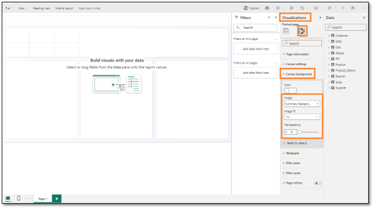
 
### <a name="_toc152166238"></a>Task 3: Add Header to the report

1. Let’s add the header in the top margin. From the **menu,** select **Text box**.

2. Enter **Fabrikam Company** as the first line in the text box.

3. Enter **Sales Report** as the second line in the text box.

4. Highlight **Fabrikam Company** and set **Font** to **Segoe UI** and **font size** to **18, bold**.

5. Highlight **Sales Report** and set **Font** to **Segoe UI** and **font size** to **14**.

6. With the **text box selected,** in the Format text box pane on the right, **expand Effects**.

7. Use **Background** slider to set it to **Off**.

8. Resize the **text box to fit in the top margin**.
 
    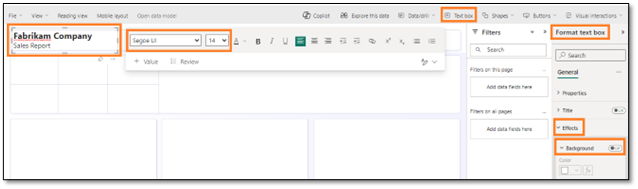

### <a name="_toc152166239"></a><a name="_hlk152165928"></a>Task 4: Add KPIs to the report

1. Let’s add Sales KPI. Select the **white space** in the canvas to take the focus off the text box.

2. From the **Visualizations section** select **Multi-row card visual**.

3. From the **Data section** expand **Sales table**.

4. Select **Sales measure**.

    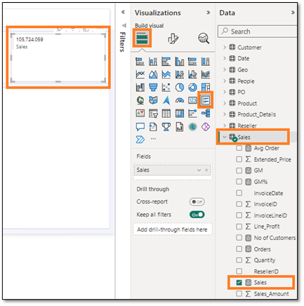
 
5. With **multi-row card visual selected,** select **Format visual icon** from Visualizations section.

6. Expand **Category labels** section.

7. Increase **font size** to **14**

8. Select **Color drop down** Color palette dialog opens.

9. Set Hex value to **004753**.

    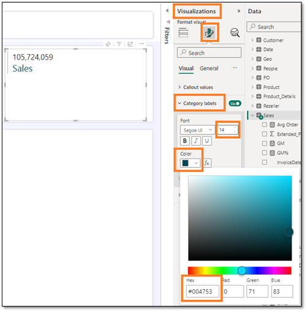
 
10. Expand **Cards** section.

11. Use **Accent bar** slider to set it to **Off**.

    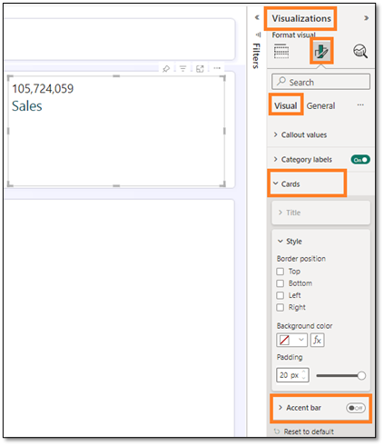
 
12. Select **General** in the Visualizations pane.

13. Expand **Effects section**.

14. Use **Background** slider to set it to **Off**.

15. Resize the **visual** and move it to the **left box as shown in the screenshot**.

    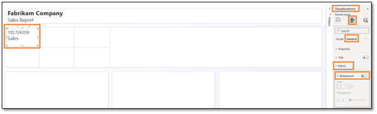
 
16. Let’s add another KPI. Select the **Sales multi-row card** we just created. **Copy** the visual by selecting **Ctrl+C** from your keyboard.

17. **Paste** the visual by selecting **Ctrl+V** from your keyboard. Notice the visual is pasted onto the canvas.

18. With the **new visual highlighted,** in the **Visualization pane -> Build visual -> Fields** section remove **Sales** measure.

19. From the **Data** section, expand **Sales** table and select **Units** measure.

20. Resize the **visual** and **place it in the box below the Sales visual**.

    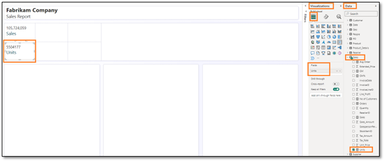
 
### <a name="_toc152166240"></a>Task 5: Add Line chart to the report
Let’s create a line chart to visualize Sales over time by Reseller Company.
1. Select the **white space** in the canvas to take the focus off the multi-row card visual.

2. From the **Visualizations section** select **Line chart**.

3. From the **Data section** expand **Date** table.

4. Select **Year** field. Notice Year is summed by default and added to the Y-axis. Let’s rectify this.

    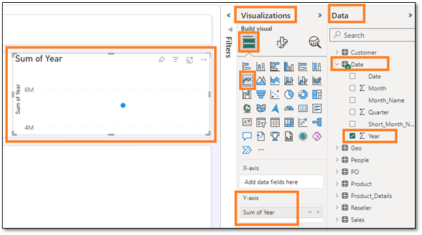
 
### <a name="_toc152166241"></a>Task 6: Save the report

Let’s save the report before we navigate away from the report to make changes to the model. 
1. From the menu select **File -> Save**.

2. Save your report dialog opens. Name the report as **rpt_Sales_Report**

    >**Note:** We are prefixing the report name with rpt which is short for the report.

3. Make sure the report is saved in **FAIAD_<username>** workspace.

4. Select **Save**.

    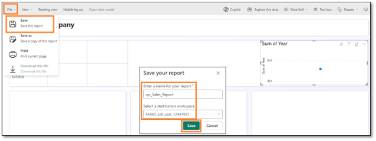


### <a name="_toc152166242"></a>Task 7: Configure Year column in Date table

1. From the **left menu bar,** select **lh_FAIAD** to navigate to the lakehouse.

2. From the left Explorer pane, expand **lhFAIAD -> Schemas -> dbo -> Tables -> Date**.

3. Select **Year** column.

4. In the **Properties** pane on the right, expand **Advanced** section.

5. In the Summarize by drop down select **None**.

    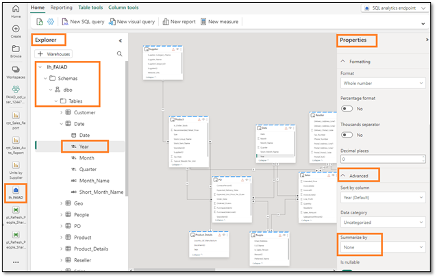
 
6. Navigate back to report by selecting **rpt_Sales_Report** from the left menu bar.

7. Select **Edit** from the top menu.

8. From the top menu select **Refresh**. Notice in the Data panel the year is not a summation field. 

9. With the **Line chart visual selected, remove Sum of Year** from the Y-axis.

10. Select **Year** field and it will be added to the **X-axis**.

11. Expand **Sales** table and select **Sales measure**.

    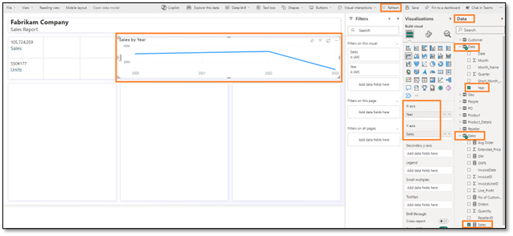
 
### <a name="_toc152166243"></a>Task 8: Configure Short_Month_Name column in Date table

1. Let’s add a Month to this chart. From the Date table, drag the **Short_Month_Name** field below **Year** in the **X-axis**. Notice the visual is sorted by Sales. Let’s sort it by Short_Month_Name.

2. Select the **ellipsis (…)** on the top right corner of the visual.

3. Select **Sort axis -> Year Short_Month_Name**.

4. Select the **ellipsis (…)** on the top right corner of the visual.

5. Select **Sort axis -> Sort ascending**.

    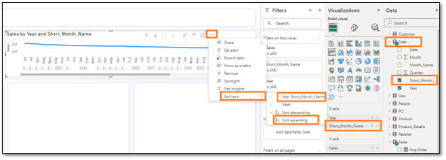
 
    >**Note**: The months are sorted alphabetically. Let’s fix this.

    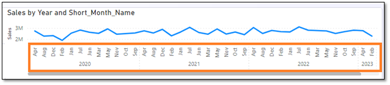
 
6. From the **left menu bar,** select **lh_FAIAD** to navigate to the lakehouse.

7. **Unsaved changes** dialog opens. Select **Save** to save the changes to the report.

    
 
8. You will be navigated to lh_FAIAD lakehouse. From the left Explorer pane, expand **lhFAIAD -> Schemas -> dbo -> Tables -> Date**.

9. Select **Short_Month_Name** column.

10. In the **Properties** pane on the right, expand **Advanced** section.

11. In the **Sort by column** drop-down select **Month**.

    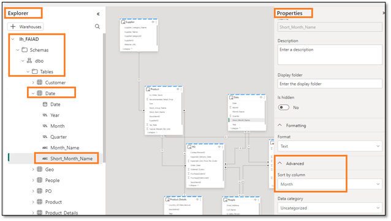
 
12. Navigate back to report by selecting **rpt_Sales_Report** from the left menu bar.

13. Select **Edit** from the top menu.

14. From the top menu select **Refresh** Notice now months are sorted properly.

    
 
### <a name="_toc152166244"></a>Task 9: Format Line chart

Notice how easy it is to update the semantic model while building the reports. This gives a seamless interaction like Power BI Desktop.

1. With the **Line chart visual selected,** in the **Data section** expand **Reseller** table.
2. Drag **Reseller -> Reseller Company** field to the **Legend** section.

    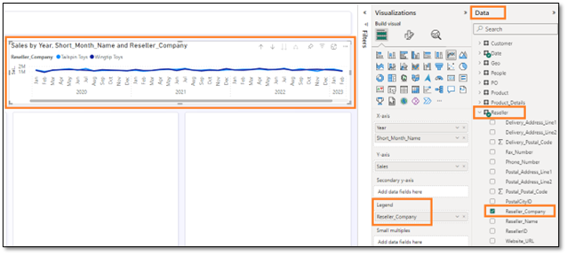
 
3. With the **Line chart visual selected,** from the **Visualization** section select **Format visual icon -> General**.
4. Expand **Title** section.
5. Set **Title** text to **Sales over time**.
6. Expand **Effects** section.
7. Use **Background** slider to set it to **Off**.

    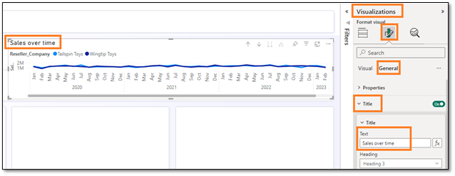
 
8. From the **Visualization** section select **Format visual icon -> Visual**.
9. Expand **Lines** section.
10. Expand **Colors** section.
11. Set **Wingtip Toys** color to **#004753**
12. Set **Tailspin Toys** color to **#F17925**
13. Resize the **visual** and move it to the **top right box as shown in the screenshot**.
14. Scroll to the right on the visual and **notice we have data through April 2023**.

    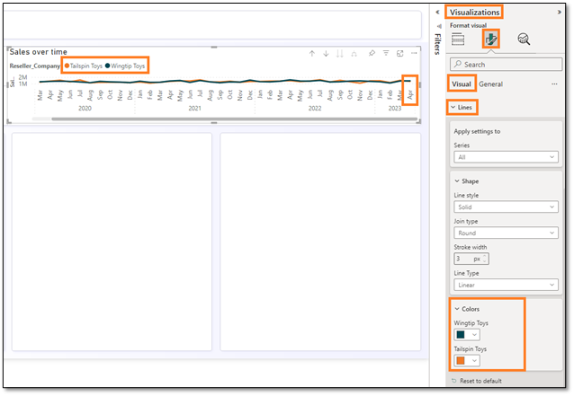
 
15. Let’s save the report, from the menu select **File -> Save**.
As mentioned earlier, we will not build all the visuals in this lab. At your leisure, feel free to build more visuals. 

### <a name="_toc152166245"></a>Task 10: Add new data to simulate Direct Lake Mode

Typically, in Import mode, once data in the source is refreshed, we need to refresh the Power BI model after which the data in the report is updated. With Direct Query mode, once data is refreshed in the source, it is available in the Power BI report. However direct query mode is typically slow. To solve this problem, Microsoft Fabric has introduced Direct Lake mode. Direct Lake is a fast path to load the data from the lake straight into the Power BI engine, ready for analysis. Let’s explore this.

In a real scenario, data is updated at the source. Since we are in a training environment, we will simulate this by connecting it to a parquet file with data for May 2023. 

1. Select **FAIAD_<username>**  from the left menu bar to navigate to workspace home.
2. Select **df_Sales_ADFS** so we can edit the dataflow by adding the new Parquet file.

   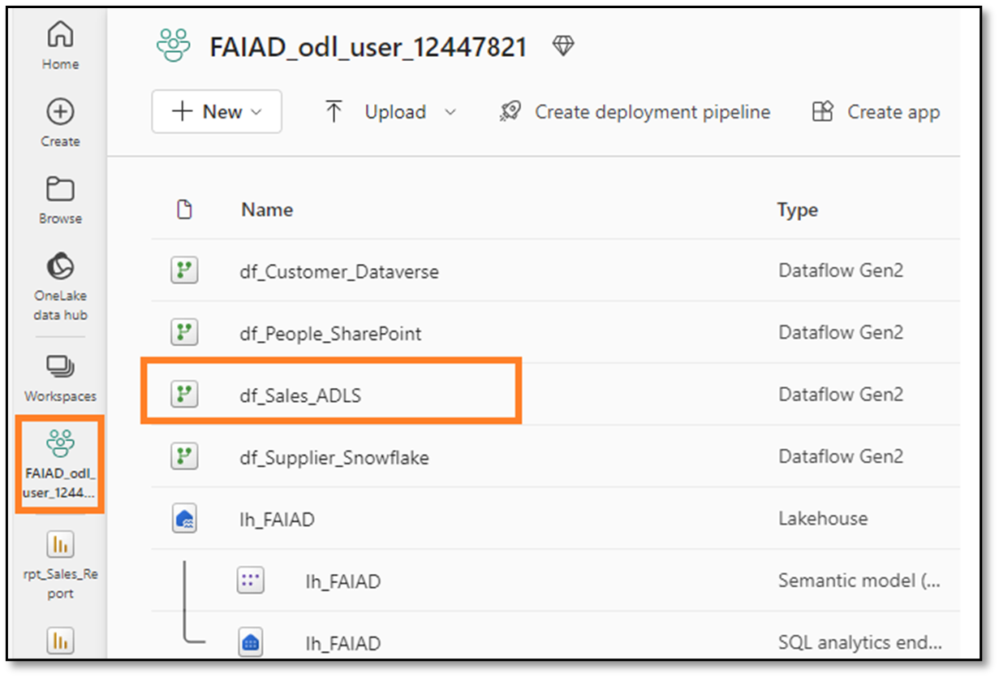

3. From the ribbon, select **Home -> Get data -> Blank query**.
4. Connect to data source dialog opens. Select **all the rows in the editor and delete it**.
5. Copy the below code and paste it into the editor.

    ```
    let
       Source = #"ADLS Base Folder",
       #"Filtered Rows" = Table.SelectRows(Source, each Text.Contains([Folder Path], "Sales.Invoices_May")),
       #"https://stvnextblobstorage dfs core windows net/fabrikam-sales/Delta-Parquet-Format/Sales Invoices_May/_0-0ee085a3-716f-4833-a792-c3162c1de300-0 parquet" = #"Filtered Rows"{[#"Folder Path"="https://stvnextblobstorage.dfs.core.windows.net/fabrikam-sales/Delta-Parquet-Format/Sales.Invoices_May/",Name="0-0ee085a3-716f-4833-a792-c3162c1de300-0.parquet"]}[Content],
       #"Imported Parquet" = Parquet.Document(#"https://stvnextblobstorage dfs core windows net/fabrikam-sales/Delta-Parquet-Format/Sales Invoices_May/_0-0ee085a3-716f-4833-a792-c3162c1de300-0 parquet")
    in
       #"Imported Parquet"
    ```

7. Select **Next**.

   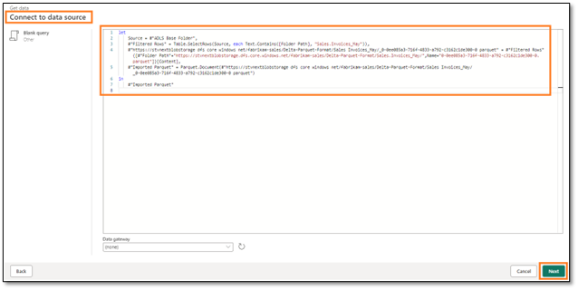
 
8. A new query is recreated. Let’s **rename** it. Rename the query to **MayInvoice** in the right panel, under **Query settings -> Properties -> Name**.

9. Let’s disable staging for the new query. **Right click** on MayInvoice query and **uncheck Enable staging**.

   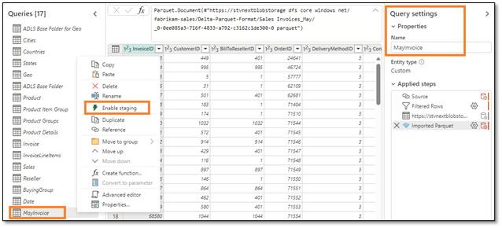
 
10. Now, let’s append the May invoice data with the Invoice table. Select **Invoice** query from the Queries section.

11. From the ribbon, select **Home -> Append** queries.

12. Append query dialog appears. From the **Table to append** dropdown select **MayInvoice**.

13. Select **OK**.

    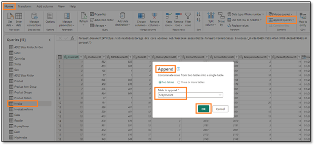
 
14. Select **Publish** in the bottom right corner to save and publish the updates. 

    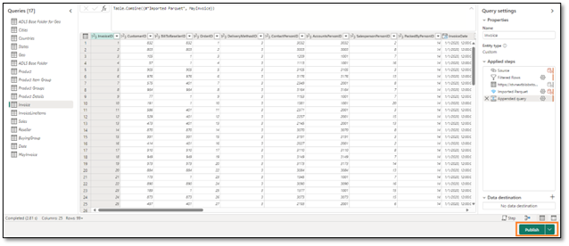
 
>**Note:** Once published the dataflow will refresh. This may take a few minutes.

14. Select **rpt_Sales_Report** from the left menu bar to navigate back to the report.
15. From the top menu select **Refresh**. Notice how in the Line chart there is data for May 2023. Also, notice the Sales amount and Units have increased.

    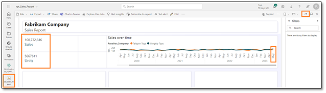
 
The Dataflows we have created in earlier labs are refreshed on schedule, data is ingested into the Lakehouse. The data model in the Lakehouse is updated and the reports are refreshed. We do not have to refresh the data model and report when each of the Dataflow refreshes. This is the advantage of Direct Lake.
Let’s revisit the challenges that are listed in the problem statement:

- **You need to refresh your dataset at least three times a day to accommodate the different update times for the different data sources**.
We solved this using Direct Lake. Each individual data flow is refreshed on its schedule. The dataset and report do not have to be refreshed.
- **Your refreshes take a long time as you need to do a full refresh every time to capture any updates that happened to the source systems**.
Again, we solved this using Direct Lake. Each individual data flow is refreshed on its schedule. The dataset and report do not have to be refreshed, so we do not have to worry about full refresh. 
- **Any errors in any of the data sources that you are pulling from will result in your dataset refresh breaking. A lot of times the employee file doesn’t upload on time resulting in your dataset refresh breaking**.
Data Pipeline helps to solve this problem, by providing the ability to retry refresh on failure and at different intervals.
- **It takes a very long time to make any changes to your data model as Power Query takes a long time to refresh your previews, given the large data sizes and complex transformations.** 
We noticed Dataflows are efficient and easy to make changes. Typically, previews in Dataflows do not take long to load.
- **You need a Windows PC to use Power BI Desktop even though the corporate standard is Mac**.
Microsoft Fabric is a SaaS offering. All we need is a browser to access the service. We do not have to install any software on our desktops.

# <a name="_toc152166246"></a>Clean up Lab environment

Once you are ready to clean up the lab environment, follow the steps below.

1. Select **FAIAD_<username>** workspace from the left panel to navigate to the workspace home.
2. From the top menu, select the **ellipsis (…)** next to Manage access and select **Workspace settings**.

   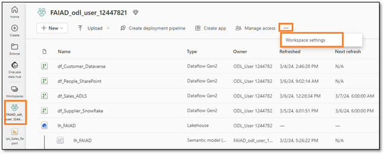
 
3. Workspace settings dialog opens. Select **General** from the left menu.
4. Select **Remove this workspace**.

    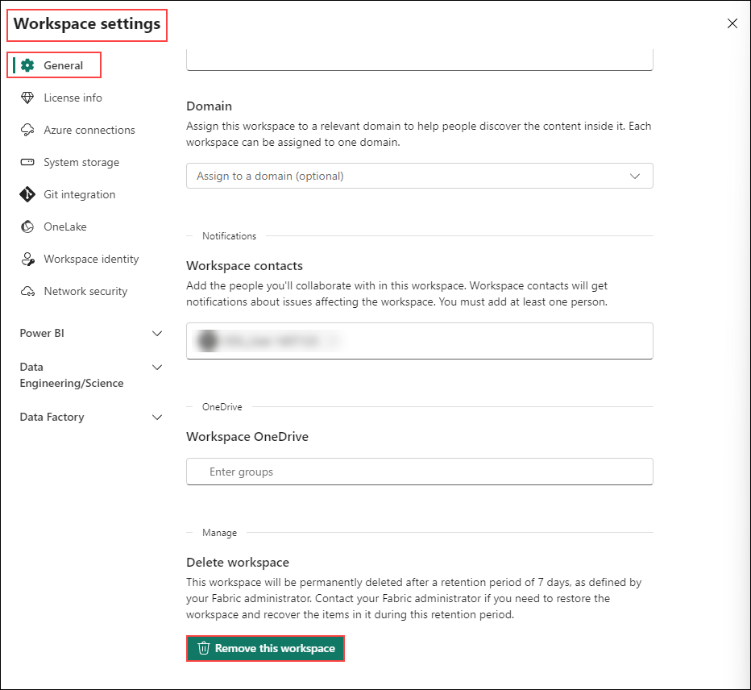

5. Delete workspace dialog opens. Select **Delete**.
This will delete the workspace and all the items that were contained in the workspace.
 
# <a name="_toc150777627"></a><a name="_toc150779083"></a><a name="_toc152166247"></a>References

Fabric Analyst in a Day (FAIAD) introduces you to some of the key functions available in Microsoft Fabric. In the menu of the service, the Help (?) section has links to some great resources.

    
 
Here are a few more resources that will help you with your next steps with Microsoft Fabric.

-	See blog post to read the full [Microsoft Fabric GA announcement](https://www.microsoft.com/en-us/microsoft-fabric/blog/2023/11/15/prepare-your-data-for-ai-innovation-with-microsoft-fabric-now-generally-available/)
-	Explore Fabric through the [Guided Tour](https://guidedtour.microsoft.com/en-us/guidedtour/microsoft-fabric/microsoft-fabric/1/1)
-	Sign up for the [Microsoft Fabric free trial](https://app.powerbi.com/home?experience=power-bi)
-	Visit the [Microsoft Fabric website](https://www.microsoft.com/en-in/microsoft-fabric)
-	Learn new skills by exploring the [Fabric Learning modules](https://aka.ms/learn-fabric)
-	Explore the [Fabric technical documentation](https://aka.ms/fabric-docs)
-	Read the [free e-book on getting started with Fabric](https://aka.ms/fabric-get-started-ebook)
-	Join the [Fabric community]https://aka.ms/fabric-community) to post your questions, share your feedback, and learn from others

Read the more in-depth Fabric experience announcement blogs:

-	[Data Factory experience in Fabric blog](https://aka.ms/Fabric-Data-Factory-Blog)
-	[Synapse Data Engineering experience in Fabric blog](https://aka.ms/Fabric-DE-Blog) 
-	[Synapse Data Science experience in Fabric blog](https://aka.ms/Fabric-DS-Blog) 
-	[Synapse Data Warehousing experience in Fabric blog](https://aka.ms/Fabric-DW-Blog) 
-	[Synapse Real-Time Analytics experience in Fabric blog](https://aka.ms/Fabric-RTA-Blog)
-	[Power BI announcement blog](https://aka.ms/Fabric-PBI-Blog)
-	[Data Activator experience in Fabric blog](https://aka.ms/Fabric-DA-Blog)
-	[Administration and governance in Fabric blog](https://aka.ms/Fabric-Admin-Gov-Blog)
-	[OneLake in Fabric blog](https://aka.ms/Fabric-OneLake-Blog)
-	[Dataverse and Microsoft Fabric integration blog](https://aka.ms/Dataverse-Fabric-Blog)

© 2023 Microsoft Corporation. All rights reserved.

By using this demo/lab, you agree to the following terms:

The technology/functionality described in this demo/lab is provided by Microsoft Corporation for the purposes of obtaining your feedback and providing you with a learning experience. You may only use the demo/lab to evaluate such technology features and functionality and provide feedback to Microsoft. You may not use it for any other purpose. You may not modify, copy, distribute, transmit, display, perform, reproduce, publish, license, create derivative works from, transfer, or sell this demo/lab or any portion thereof.

COPYING OR REPRODUCTION OF THE DEMO/LAB (OR ANY PORTION OF IT) TO ANY OTHER SERVER OR LOCATION FOR FURTHER REPRODUCTION OR REDISTRIBUTION IS EXPRESSLY PROHIBITED.

THIS DEMO/LAB PROVIDES CERTAIN SOFTWARE TECHNOLOGY/PRODUCT FEATURES AND FUNCTIONALITY, INCLUDING POTENTIAL NEW FEATURES AND CONCEPTS, IN A SIMULATED ENVIRONMENT WITHOUT COMPLEX SET-UP OR INSTALLATION FOR THE PURPOSE DESCRIBED ABOVE. THE TECHNOLOGY/CONCEPTS REPRESENTED IN THIS DEMO/LAB MAY NOT REPRESENT FULL FEATURE FUNCTIONALITY AND MAY NOT WORK THE WAY A FINAL VERSION MAY WORK. WE ALSO MAY NOT RELEASE A FINAL VERSION OF SUCH FEATURES OR CONCEPTS. YOUR EXPERIENCE WITH USING SUCH FEATURES AND FUNCTIONALITY IN A PHYSICAL ENVIRONMENT MAY ALSO BE DIFFERENT.

**FEEDBACK**. If you give feedback about the technology features, functionality and/or concepts described in this demo/lab to Microsoft, you give to Microsoft, without charge, the right to use, share and commercialize your feedback in any way and for any purpose. You also give to third parties, without charge, any patent rights needed for their products, technologies and services to use or interface with any specific parts of a Microsoft software or service that includes the feedback. You will not give feedback that is subject to a license that requires Microsoft to license its software or documentation to third parties because we include your feedback in them. These rights survive this agreement.

MICROSOFT CORPORATION HEREBY DISCLAIMS ALL WARRANTIES AND CONDITIONS WITH REGARD TO THE DEMO/LAB, INCLUDING ALL WARRANTIES AND CONDITIONS OF MERCHANTABILITY, WHETHER EXPRESS, IMPLIED OR STATUTORY, FITNESS FOR A PARTICULAR PURPOSE, TITLE AND NON-INFRINGEMENT. MICROSOFT DOES NOT MAKE ANY ASSURANCES OR REPRESENTATIONS WITH REGARD TO THE ACCURACY OF THE RESULTS, OUTPUT THAT DERIVES FROM USE OF DEMO/ LAB, OR SUITABILITY OF THE INFORMATION CONTAINED IN THE DEMO/LAB FOR ANY PURPOSE.

**DISCLAIMER**

This demo/lab contains only a portion of new features and enhancements in Microsoft Power BI. Some of the features might change in future releases of the product. In this demo/lab, you will learn about some, but not all, new features. 
