# Microsoft Fabric - Fabric Analyst in a Day - Laboratório 1

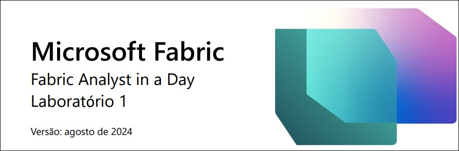
 
# Sumário
- Estrutura do documento
- Cenário/Declaração do problema
- Visão geral do relatório do Power BI Desktop
  - Tarefa 1: Configurar o Power BI Desktop no ambiente de laboratório
  - Tarefa 2: Analisar relatório do Power BI Desktop
  - Tarefa 3: Revisar Power Queries
- Referências

# Estrutura do documento

O laboratório inclui etapas a serem seguidas pelo usuário juntamente com as capturas de tela associadas que fornecem auxílio visual. Em cada captura de tela, as seções estão destacadas com caixas laranjas para indicar as áreas nas quais o usuário deve se concentrar.

**Observação**: Algumas capturas de tela podem estar desatualizadas devido às atualizações contínuas do produto.

# Cenário/Declaração do problema

A Fabrikam, Inc. é distribuidora atacadista de produtos inovadores. Como atacadista, os clientes da Fabrikam são principalmente empresas que revendem para pessoas físicas. A Fabrikam vende para clientes de varejo nos Estados Unidos, incluindo lojas especializadas, supermercados, lojas de informática e lojas de atrações turísticas. A Fabrikam também vende para outros atacadistas por meio de uma rede de agentes que promovem os produtos em nome da Fabrikam. Embora todos os clientes da Fabrikam estejam atualmente nos Estados Unidos, a empresa pretende impulsionar a expansão para outros países/regiões.

Você é um Analista de Dados na equipe de Vendas. Você coleta, limpa e interpreta conjuntos de dados para resolver problemas de negócios. Você também reúne visualizações, como tabelas e gráficos, escreve relatórios e os apresenta aos tomadores de decisão na organização.

Para obter insights valiosos dos dados, você extrai dados de vários sistemas, limpa-os e combina-os. Você extrai dados das seguintes fontes:

- **Dados de Venda:** são obtidos do sistema ERP e armazenados em um banco de dados ADLS Gen2. Eles são atualizados ao meio-dia/12h, todos os dias.

- **Dados do Fornecedor:** são obtidos de diferentes fornecedores e armazenados em um banco de dados Snowflake. São atualizados à meia-noite/24h, todos os dias.

- **Dados do Cliente:** são obtidos do Customer Insights e armazenados no Dataverse. Os dados estão sempre atualizados.

- **Dados do Funcionário:** são obtidos do sistema de RH e armazenados como um arquivo de exportação em uma pasta do SharePoint. São atualizados todas as manhãs, às 9h.

    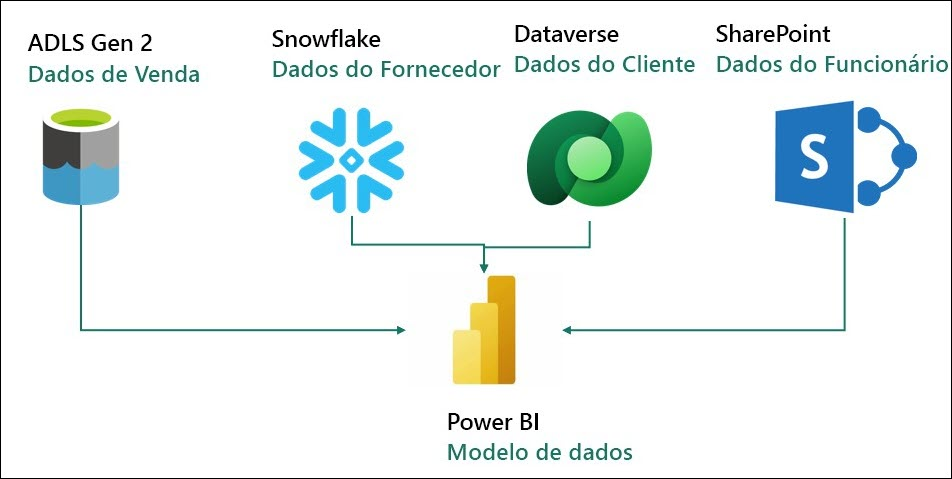
 
No momento, você está criando um conjunto de dados no Power BI Premium que extrai os dados dos sistemas de origem acima para gerar relatórios e fornecer aos usuários finais o recurso de autoatendimento. Você usa o Power Query para atualizar seu modelo.

**Você está enfrentando os seguintes desafios:**

- Você precisa atualizar seu conjunto de dados pelo menos três vezes por dia para acomodar os diferentes horários de atualização para as diferentes fontes de dados.

- As atualizações podem demorar, pois é sempre necessário fazer uma atualização completa para capturar tudo o que foi atualizado nos sistemas de origem.

- Os erros detectados em qualquer uma das fontes das quais você está extraindo dados
resultarão na interrupção da atualização do conjunto de dados. Muitas vezes o arquivo do funcionário não é carregado no prazo, resultando na interrupção da atualização do conjunto de dados.

- As alterações no modelo de dados demoram muito tempo, pois o Power Query leva tempo para atualizar as versões preliminares devido aos tamanhos de dados grandes e às transformações complexas.

- Você precisa de um computador com Windows para usar o Power BI Desktop mesmo que o padrão corporativo seja Mac.

Você ouviu falar do Microsoft Fabric e decidiu tentar ver se ele resolverá seus desafios.

# Visão geral do relatório do Power BI Desktop

Antes de começarmos com o Fabric, vamos dar uma olhada no Relatório atual no Power BI Desktop para entender as transformações e o modelo.

## Tarefa 1: Configurar o Power BI Desktop no ambiente de laboratório

1. Abra o arquivo **FAIAD.pbix** que está na pasta **Reports** na **área de trabalho** do seu ambiente de laboratório. O arquivo será aberto no Power BI Desktop.

    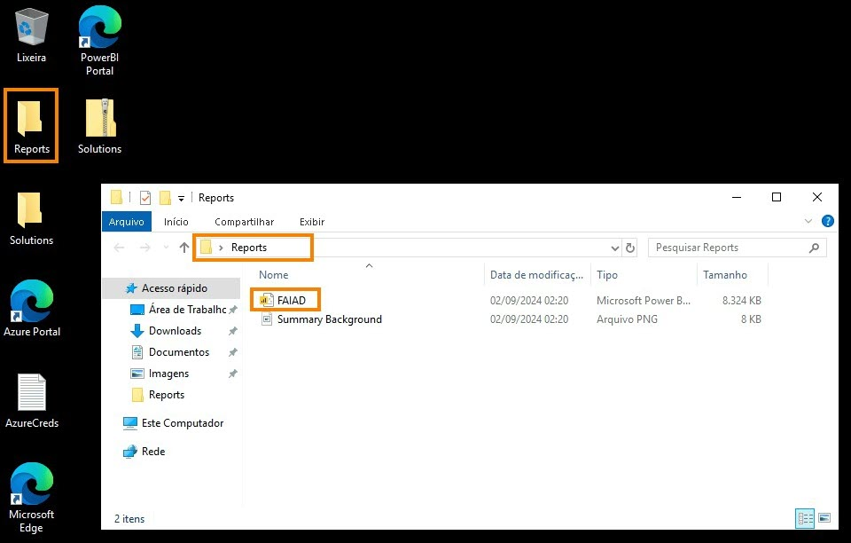
 
2. Insira seu endereço de email na caixa de diálogo aberta. Navegue até a guia **Environment Details** no painel direito do ambiente de laboratório.

3. Copie os dados de **Username** e cole na caixa de texto Email da caixa de diálogo.

4. Selecione **Continue**.

    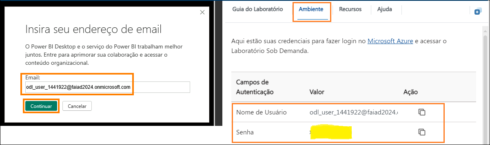

5. A caixa de diálogo Sign in é aberta. Insira novamente os dados de **Username** copiando-os da guia **Environment Details**.

6. Selecione **Next**.

7. Na próxima caixa de diálogo, insira os dados de **Password Credentials** copiando-os da guia **Environment Details**.

8. Selecione **Sign in**.

    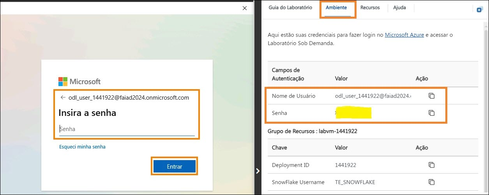
 
9. A caixa de diálogo **Manter-se conectado a todos os seus aplicativos** é aberta. Selecione **OK**.

    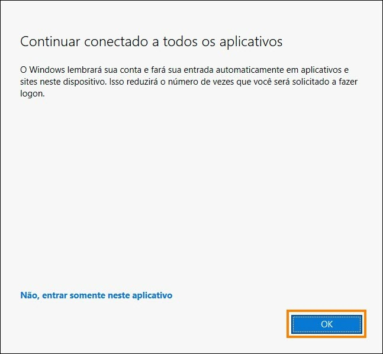

10. A caixa de diálogo **Tudo pronto!** é aberta. Selecione **Concluído**. 

    O Power BI Desktop será aberto.

## Tarefa 2: Analisar relatório do Power BI Desktop

O relatório abaixo analisa as Sales da Fabrikam. Os KPIs estão listados no canto superior esquerdo da página. Os visuais restantes destacam as Sales over time, por Territory, Product Group e Reseller Company.

  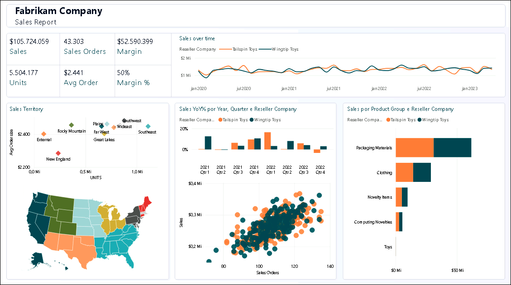 

**Observação:** Neste treinamento, estamos nos concentrando na aquisição, transformação e modelagem de dados usando as ferramentas disponíveis no Fabric. Não nos concentraremos no desenvolvimento ou na navegação de relatórios. Vamos reservar alguns minutos para entender o relatório e passar para as próximas etapas.

1. Vamos analisar os dados por Sales Territory. Selecione o visual **New England from the Sales Territory** (gráfico de dispersão). Observe que em Sales over time, Reseller Tailspin Toys tem mais vendas em comparação com Wingtip Toys em New England. Se você olhar o gráfico de colunas Sales YoY%, notará que o crescimento das vendas da Wingtip Toys foi baixo e diminuiu trimestre após trimestre durante o ano passado. Depois de uma pequena recuperação no terceiro trimestre, caiu novamente no quarto.

    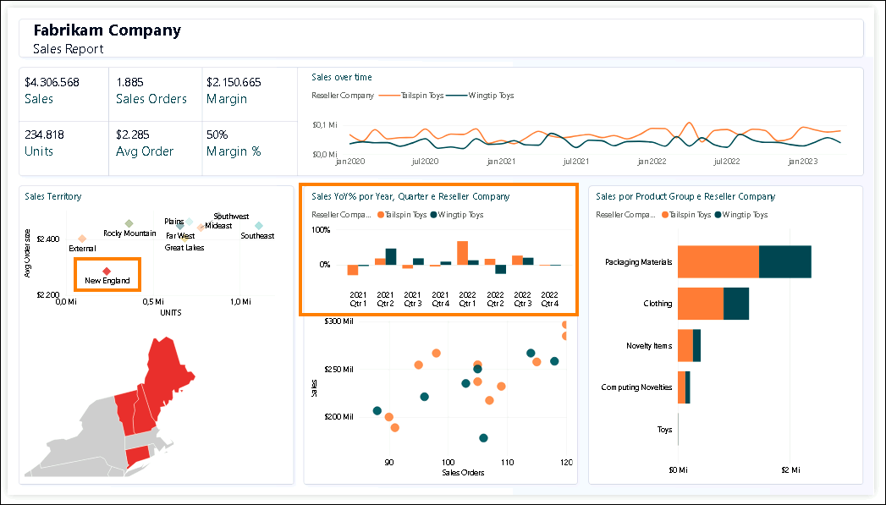

2. Vamos comparar isso com a região Rocky Mountain. Selecione o visual **Rocky Mountain from Sales Territory** (gráfico de dispersão). Observe no gráfico de colunas Sales YoY% que as vendas da Wingtip Toys aumentaram drasticamente no quarto trimestre de 2022, depois de terem sido baixas nos dois trimestres anteriores.

    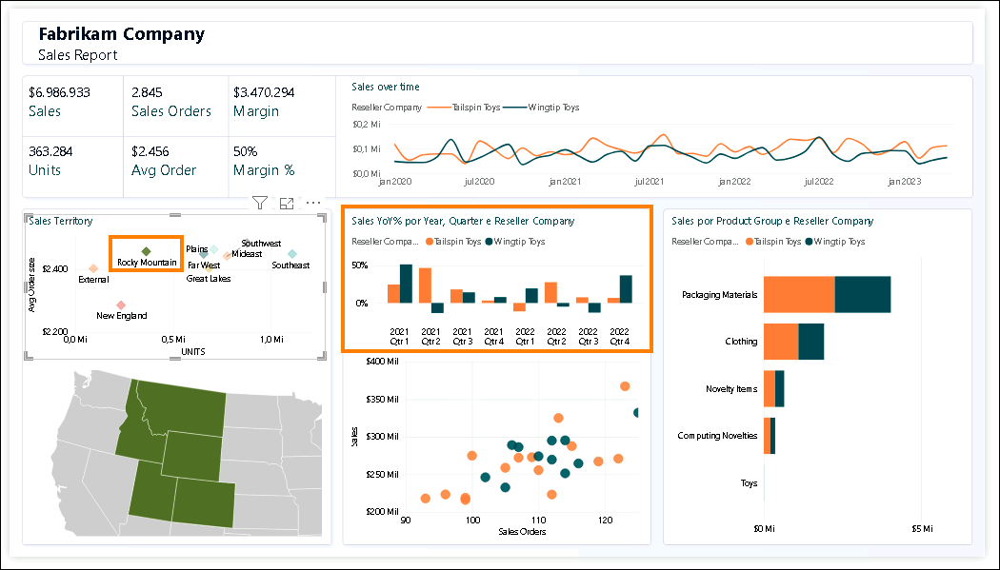

3. Selecione o visual **Rocky Mountain from Sales Territory** para remover o filtro.

4. No visual Gráfico de dispersão, na parte inferior central da tela (Sales Orders por Sales), selecione a exceção no canto superior direito (4º quadrante). Observe que a margem percentual é de 52%, estando acima da média de 50%. Além disso, o Sales YoY% aumentou últimos dois trimestres de 2023.

    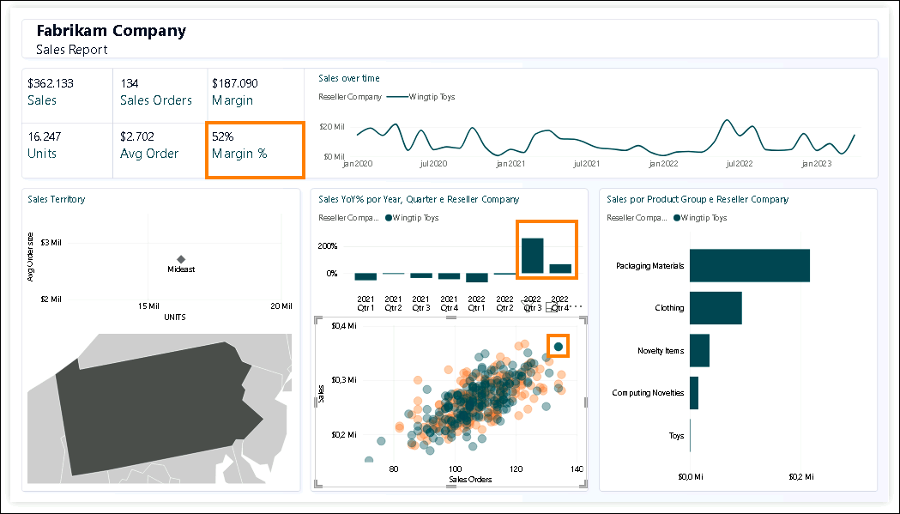

5. Selecione a exceção Reseller no visual Gráfico de dispersão para **remover o filtro**.

6. Vamos obter os detalhes de Product por Product Group e Reseller. No visual do gráfico de barras Sales por Product Group e Reseller Company, **clique com o botão direito na barra Packaging Materials para Tailspin Toys** e, na caixa de diálogo, selecione **Drill through -> Product Detail**.

    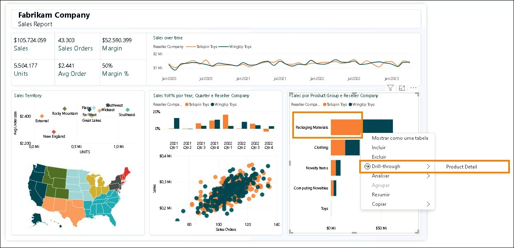
 
    Você será direcionado para a página que fornece os Product Details. Observe que também existem algumas ordens futuras em andamento.
    
7. Quando terminar de revisar esta página, selecione **Ctrl+seta para voltar** na parte superior direita da página para "voltar ao Sales Report.

    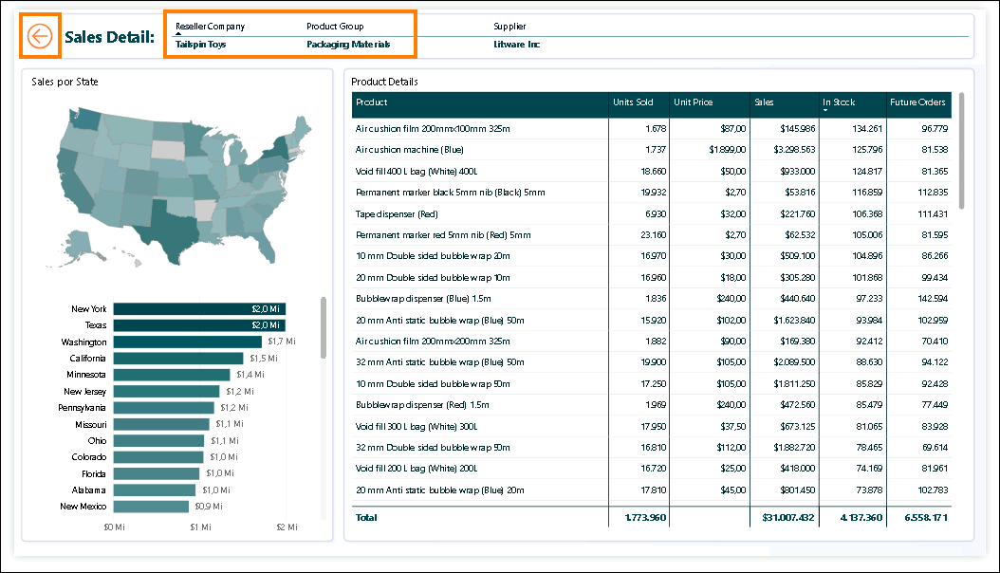

8. Fique à vontade para analisar o relatório posteriormente. Quando estiver pronto, vamos dar uma olhada na exibição do modelo. No painel esquerdo, selecione o **Ícone de exibição do modelo**. Observe que existem duas tabelas de fatos, Sales e PO.

    a. A granularidade dos dados de Sales é por Date, Reseller, Product e People. Date, Reseller, Product e People conectam-se a Sales.

    b. A granularidade dos dados de PO é por Date, Product e People. Date, Product e People conectam-se a PO.

    c. Temos dados de Supplier por Product. Supplier conecta-se a Product.

    d. Temos os dados de localização de Reseller por Geo. Geo conecta-se a Reseller.

    e. Temos informações de Customer por Reseller. Customer conecta-se a Reseller.
 
## Tarefa 3: Revisar Power Queries

1. Vamos analisar o Power Query para entender as fontes de dados. Na faixa de opções, selecione **Página Inicial -> Transformar dados**.

      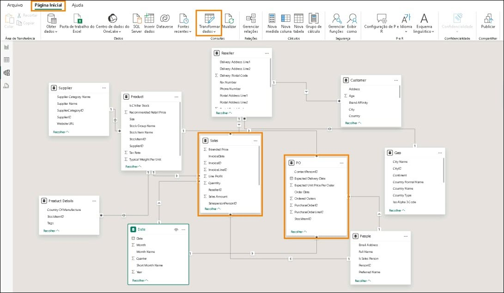

2. A janela do Power Query é aberta. Na faixa de opções, selecione **Página Inicial -> Configuração da fonte de dados**. A caixa de diálogo Configuração da fonte de dados é aberta. Ao percorrer a lista, você notará que existem quatro fontes de dados, conforme mencionado na declaração do problema:
    
    a. Snowflake

    b. SharePoint

    c. ADLS Gen2

    d. Dataverse

3. Selecione **Fechar** para fechar a caixa de diálogo Configuração da fonte de dados.

    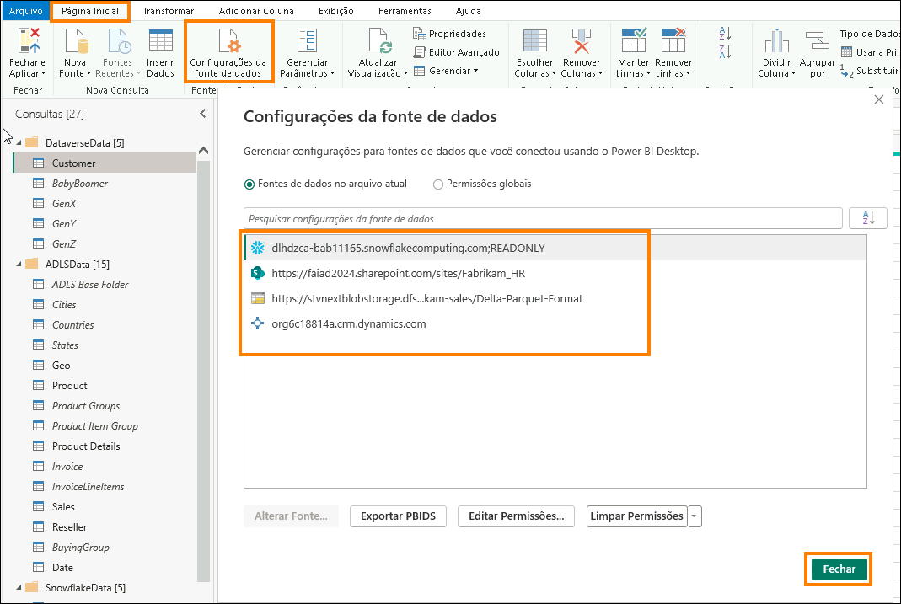

4. No painel esquerdo Consultas, observe que as consultas estão agrupadas por fonte de dados.

5. Observe que a pasta **DataverseData** tem os dados de Customer disponíveis em quatro consultas diferentes: BabyBoomer, GenX, GenY e GenZ. Essas quatro consultas são acrescentadas para criar a consulta Customer.

6. Você pode inserir as credenciais para a fonte de dados Dataverse inserindo o **Username** e a **Password** disponíveis na guia **Environment Variables** (ao lado do Guia de Laboratório). Selecione a opção Conta Microsoft.

    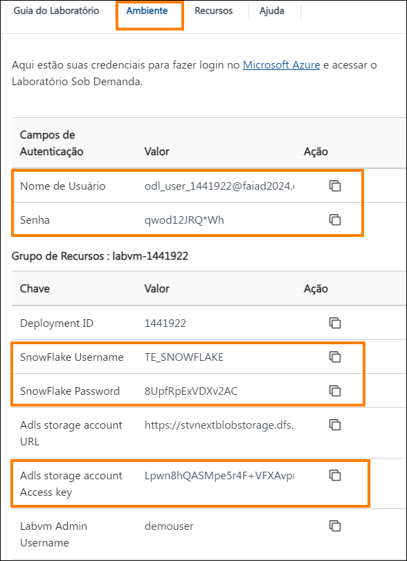

7. Para a fonte de dados ADLS, use a opção **Account Key** e insira os valores de **Adls storage account e Access key** que estão disponíveis na guia **Environment Variables** (ao lado do Guia de Laboratório).

8. Observe que a pasta **ADLSData** tem múltiplas dimensões: Geo, Product, Reseller e Date. Também tem o fato Sales.
    
    a. A **dimensão Geo** é criada mesclando dados da consulta Cities, Countries e States.

    b. A **dimensão Product** é criada mesclando dados da consulta Product Groups e Product Item Group.

    c. A **dimensão Reseller** é filtrada usando a consulta BuyingGroup.

    d. O **fato Sales** é criado mesclando InvoiceLineItems com a consulta Invoice.

9. Para a fonte de dados Snowflake, use o **SnowFlake Username** e a **SnowFlake Password** que estão disponíveis na guia **Environment Variables** (ao lado do Guia de Laboratório).

10. Observe que a pasta **SnowflakeData** tem a dimensão Supplier e o fato PO (Oder/Spend).

    a. A **dimensão Supplier** é criada mesclando a consulta Suppliers com a consulta SupplierCategories.

    b. O **fato PO** é criado mesclando PO com a consulta PO Line Items.
 
11.	Para a fonte de dados SharePoint, insira o **Username** e a **Password** disponíveis na guia **Environment Variables** (ao lado do Guia de Laboratório). Selecione a opção Conta Microsoft.

12. Observe que a pasta **SharepointData** tem a dimensão People.

    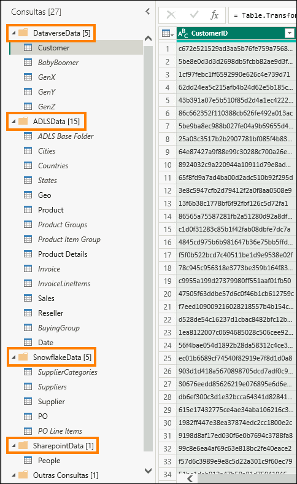

    Agora sabemos com o que estamos lidando. Nos laboratórios a seguir, criaremos um Power Query semelhante usando o Fluxo de Dados Gen2 e um modelo usando Lakehouse.
 
# Referências
O Fabric Analyst in a Day (FAIAD) apresenta algumas das principais funções disponíveis no Microsoft Fabric. No menu do serviço, a seção Ajuda (?) tem links para ótimos recursos.

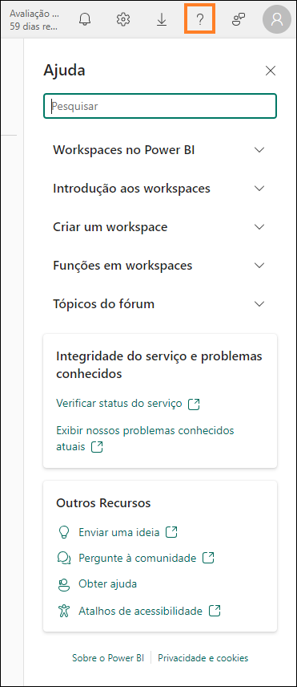

Veja aqui mais alguns recursos que ajudarão você com as próximas etapas do Microsoft Fabric.

- Veja a postagem do blog para ler o [anúncio completo de GA do Microsof t Fabric](https://www.microsoft.com/en-us/microsoft-fabric/blog/2023/11/15/prepare-your-data-for-ai-innovation-with-microsoft-fabric-now-generally-available/)

- Explore o Fabric por meio do [Tour Guiado](https://guidedtour.microsoft.com/en-us/guidedtour/microsoft-fabric/microsoft-fabric/1/1)

- Inscreva-se para a [avaliação gratuita do Microsof t Fabric](https://www.microsoft.com/en-us/microsoft-fabric/getting-started)

- Visite o [site do Microsof t Fabric](https://www.microsoft.com/en-in/microsoft-fabric)

- Aprenda novas habilidades explorando os [módulos de Aprendizagem do Fabric](https://learn.microsoft.com/en-us/training/browse/?products=fabric&resource_type=module)

- Explore a [documentação técnica do Fabric](https://learn.microsoft.com/en-us/fabric/)

- Leia o [livro eletrônico gratuito sobre como começar a usar o Fabric](https://info.microsoft.com/ww-landing-unlocking-transformative-data-value-with-microsoft-fabric.html)

- Participe da [comunidade do Fabric](https://community.fabric.microsoft.com/) para postar suas 
perguntas, compartilhar seus comentários e aprender com outras pessoas

Leia os blogs de comunicados de experiências do Fabric em mais detalhes:

- [Experiência do Data Factory no blog do Fabric](https://blog.fabric.microsoft.com/en-us/blog/introducing-data-factory-in-microsoft-fabric/)
- [Experiência do Synapse Data Engineering no blog do Fabric](https://blog.fabric.microsoft.com/en-us/blog/introducing-synapse-data-engineering-in-microsoft-fabric/)
- [Experiência do Synapse Data Science no blog do Fabric](https://blog.fabric.microsoft.com/en-us/blog/introducing-synapse-data-science-in-microsoft-fabric/)
- [Experiência do Synapse Data Warehousing no blog do Fabric](https://blog.fabric.microsoft.com/en-us/blog/introducing-synapse-data-warehouse-in-microsoft-fabric/)
- [Experiência do Synapse Real-Time Analytics no blog do Fabric](https://blog.fabric.microsoft.com/en-us/blog/sense-analyze-and-generate-insights-with-synapse-real-time-analytics-in-microsoft-fabric/)
- [Blog de comunicado do Power BI](https://powerbi.microsoft.com/en-us/blog/empower-power-bi-users-with-microsoft-fabric-and-copilot/)
- [Experiência do Data Activator no blog do Fabric](https://blog.fabric.microsoft.com/en-us/blog/driving-actions-from-your-data-with-data-activator/)
- [Administração e governança no blog do Fabric](https://blog.fabric.microsoft.com/en-us/blog/administration-security-and-governance-in-microsoft-fabric/)
- [OneLake no blog do Fabric](https://blog.fabric.microsoft.com/en-us/blog/microsoft-onelake-in-fabric-the-onedrive-for-data/)
- [Blog de integração do Dataverse e Microsof t Fabric](https://www.microsoft.com/en-us/dynamics-365/blog/it-professional/2023/05/24/new-dataverse-enhancements-and-ai-powered-productivity-with-microsoft-365-copilot/)

© 2023 Microsoft Corporation. Todos os direitos reservados.

Ao usar esta demonstração/este laboratório, você concorda com os seguintes termos:

A tecnologia/funcionalidade descrita nesta demonstração/neste laboratório é fornecida pela Microsoft Corporation para obter seus comentários e oferecer uma experiência de aprendizado. Você pode usar a demonstração/o laboratório somente para avaliar tais funcionalidades e recursos de tecnologia e fornecer comentários à Microsoft. Você não pode usá-los para nenhuma outra finalidade. Você não pode modificar, copiar, distribuir, transmitir, exibir, executar,
reproduzir, publicar, licenciar, criar obras derivadas, transferir nem vender esta demonstração/este laboratório ou qualquer parte deles.

A CÓPIA OU A REPRODUÇÃO DA DEMONSTRAÇÃO/DO LABORATÓRIO (OU DE QUALQUER PARTE DELES) EM QUALQUER OUTRO SERVIDOR OU LOCAL PARA REPRODUÇÃO OU REDISTRIBUIÇÃO ADICIONAL É EXPRESSAMENTE PROIBIDA.

ESTA DEMONSTRAÇÃO/ESTE LABORATÓRIO FORNECE DETERMINADOS RECURSOS E FUNCIONALIDADES DE PRODUTO/TECNOLOGIA DE SOFTWARE, INCLUINDO NOVOS RECURSOS E CONCEITOS POTENCIAIS, EM UM AMBIENTE SIMULADO SEM CONFIGURAÇÃO NEM INSTALAÇÃO COMPLEXA PARA A FINALIDADE DESCRITA ACIMA. A TECNOLOGIA/OS CONCEITOS REPRESENTADOS NESTA DEMONSTRAÇÃO/NESTE LABORATÓRIO PODEM NÃO REPRESENTAR A FUNCIONALIDADE COMPLETA DOS RECURSOS E PODEM NÃO FUNCIONAR DA MESMA MANEIRA QUE UMA VERSÃO FINAL. ALÉM DISSO, PODEMOS NÃO LANÇAR UMA VERSÃO FINAL DE TAIS
RECURSOS OU CONCEITOS. SUA EXPERIÊNCIA COM O USO DE TAIS RECURSOS E FUNCIONALIDADES EM UM AMBIENTE FÍSICO TAMBÉM PODE SER DIFERENTE.

**COMENTÁRIOS**. Caso você forneça comentários sobre os recursos de tecnologia, as funcionalidades e/ou os conceitos descritos nesta demonstração/neste laboratório à Microsoft, você concederá à Microsoft, sem encargos, o direito de usar, compartilhar e comercializar seus comentários de qualquer forma e para qualquer finalidade. Você também concede a terceiros, sem encargos, quaisquer direitos de patente necessários para que seus produtos, suas
tecnologias e seus serviços usem ou interajam com partes específicas de um software ou um serviço da Microsoft que inclua os comentários. Você não fornecerá comentários que estejam sujeitos a uma licença que exija que a Microsoft licencie seu software ou sua documentação para terceiros em virtude da inclusão de seus comentários neles. Esses direitos continuarão em vigor após o término do contrato.

POR MEIO DESTE, A MICROSOFT CORPORATION SE ISENTA DE TODAS AS GARANTIAS E CONDIÇÕES REFERENTES À DEMONSTRAÇÃO/AO LABORATÓRIO, INCLUINDO TODAS AS GARANTIAS E CONDIÇÕES DE COMERCIALIZAÇÃO, SEJAM ELAS EXPRESSAS, IMPLÍCITAS OU ESTATUTÁRIAS, E DE ADEQUAÇÃO A UMA FINALIDADE ESPECÍFICA, TÍTULO E NÃO VIOLAÇÃO. A MICROSOFT NÃO DECLARA NEM GARANTE A PRECISÃO DOS RESULTADOS DERIVADOS DO USO DA DEMONSTRAÇÃO/DO LABORATÓRIO NEM A ADEQUAÇÃO DAS INFORMAÇÕES CONTIDAS NA DEMONSTRAÇÃO/NO LABORATÓRIO A QUALQUER FINALIDADE.
 
**AVISO DE ISENÇÃO DE RESPONSABILIDADE**
Esta demonstração/este laboratório contém apenas uma parte dos novos recursos e aprimoramentos do Microsoft Power BI. Alguns dos recursos podem ser alterados em versões futuras do produto. Nesta demonstração/neste laboratório, você aprenderá sobre alguns dos novos recursos, mas não todos.
