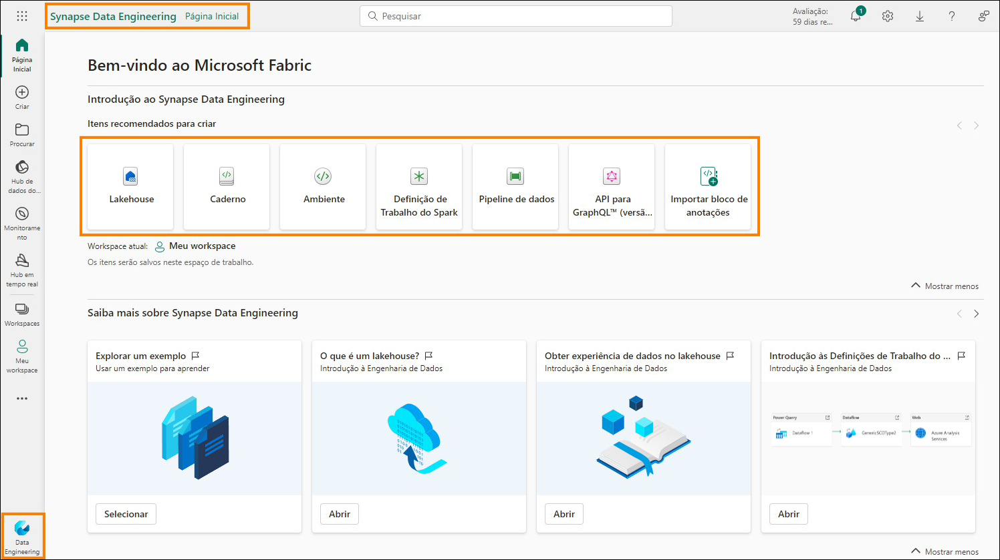
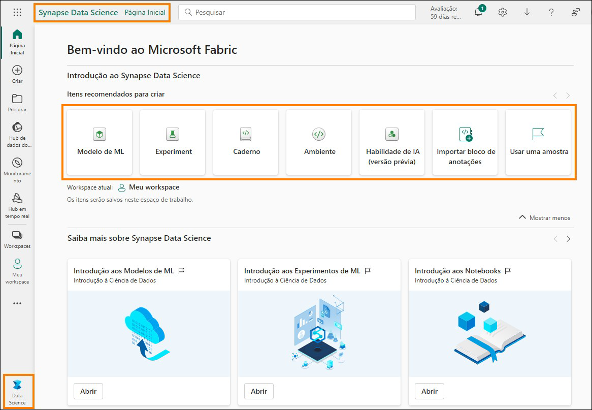

# Microsoft Fabric - Fabric Analyst in a Day - Laboratório 2 	 
 

# Sumário

- Introdução	

- Licença do Fabric	

   - Tarefa 1: Habilitar uma licença de avaliação do Microsoft Fabric	

- Visão geral das experiências do Fabric	

   - Tarefa 2: Experiência do Data Factory	

   - Tarefa 3: Experiência do Data Activator	

   - Tarefa 4: Experiência do Industry Solutions	

   - Tarefa 5: Experiência do Real-Time Intelligence
   
   - Tarefa 6: Experiência do Synapse Data Engineering

   - Tarefa 7: Experiência do Synapse Data Science	

   - Tarefa 8: Experiência do Synapse Data Warehouse

- Workspace do Fabric	

   - Tarefa 9: Criar um workspace do Fabric	

   - Tarefa 10: Criar um Lakehouse	

- Referências
 
# Introdução

Hoje você aprenderá sobre vários recursos importantes do Microsoft Fabric. Este é um workshop introdutório destinado a apresentar as diversas experiências de produtos e os vários itens disponíveis no Fabric. Ao final deste workshop, você saberá como usar os recursos Lakehouse, Fluxo de Dados

Gen2, Pipeline de Dados, DirectLake, entre outros. Ao final deste laboratório, você terá aprendido:

- Como criar um workspace do Fabric
- Como criar um Lakehouse

# Licença do Fabric

## Tarefa 1: Habilitar uma licença de avaliação do Microsoft Fabric

1. Abra o **navegador** e acesse https://app.powerbi.com/. Você será direcionado para a página de logon.

    **Observação:** Se você não estiver usando o ambiente de laboratório e já tiver uma conta do Power BI, talvez queira usar o navegador no modo privado/anônimo.

2. Insira o **Nome de usuário** disponível na guia **Variáveis de Ambiente** (ao lado do Guia de Laboratório) como o **Email** e clique em **Enviar**.

    

3. Você será direcionado à tela **Senha**. Insira a **Senha** disponível na guia **Variáveis de Ambiente** (ao lado do Guia de Laboratório), que o instrutor compartilhou com você.

4. Clique em **Entrar** e siga as instruções para entrar no Fabric.

    

5. Você será direcionado à conhecida **Página Inicial de Serviço do Power BI**.

6. Presumimos que você esteja familiarizado com o layout do Serviço do Power BI. Se você tiver alguma dúvida, não hesite em perguntar ao instrutor.

    Atualmente, você está em **Meu workspace**. Para trabalhar com itens do Fabric, você precisará de uma licença de avaliação e de um espaço de trabalho que tenha a licença do Fabric atribuída.

7. No canto superior direito da tela, selecione o **ícone de usuário**.

8. Selecione **Avaliação gratuita**.

    

9. A caixa de diálogo Atualizar para uma avaliação gratuita do Microsoft Fabric é aberta. Selecione **Iniciar avaliação**.

    
 
10. A caixa de diálogo Atualizado com êxito para o Microsoft Fabric é aberta. Selecione **Fabric Home Page**.

    

11. Você será direcionado à **Página Inicial do Microsoft Fabric**.

    

# Visão geral das experiências do Fabric

## Tarefa 2: Experiência do Data Factory

1. Selecione o ícone **Microsoft Fabric** (fabric experience selector) na parte inferior esquerda da tela. Uma caixa de diálogo com a lista de experiências do Fabric será aberta. Observe que o Power BI, o Data Factory, Data Activator, o Industry Solutions e o Real-Time Intelligence são experiências independentes. Data Engineering, Data Science e Data Warehouse são experiências do Synapse, e essas experiências são da plataforma Synapse. Vamos explorar.
 
2. Selecione **Data Factory**.

    

3. Você é direcionado para a **Página Inicial do Data Factory**. A página contém três seções principais.

    a. **Recomendado**: lista os itens disponíveis no Data Factory – Fluxo de Dados Gen2. Pipeline de Dados, Fluxo de trabalho de dados e API for GraphQL.
        
    i. Dataflow Gen2 é a próxima geração de Fluxo de Dados.

    ii. Data pipeline é usado para orquestração de dados.

    iii. O fluxo de trabalho de dados é o gerenciador de orquestração de fluxo de trabalho.

    iv. API for GraphQL é a API para consultar várias fontes de dados.
        
    b. **Learn:** esta seção fornece acesso à documentação de aprendizagem de início rápido.

    c. **Quick access:** esta seção lista os itens favoritos ou usados recentemente.

    
 
## Tarefa 3: Experiência do Data Activator

1. Selecione o **ícone Fabric experience selector** (atualmente definido como Data Factory) na parte inferior esquerda da tela. A caixa de diálogo de experiência do Fabric é aberta.

    

2. Selecione **Data Activator** na caixa de diálogo. Você será direcionado para a **Página Inicial do Data Activator**. O Data Activator é uma experiência no-code no Microsoft Fabric para executar ações automaticamente quando padrões ou condições são detectados em dados alterados. Observe que as três seções são como a experiência do Data Factory. Na seção Recomendado, observe os itens:

    a. **Reflex:** usado para monitorar conjuntos de dados, consultas e fluxos de eventos para padrões.

    b. **Exemplo do Reflex:** solução de exemplo.

    
 
## Tarefa 4: Experiência do Industry Solutions

1. Selecione o **ícone Fabric experience selector** (atualmente definido como Data Activator) na parte inferior esquerda da tela. A caixa de diálogo de experiência do Fabric é aberta.

2. Selecione **Industry Solutions** na caixa de diálogo. Você acessará a **Página Inicial do** Industry Solutions. O Microsoft Fabric oferece soluções de dados específicas do setor que fornecem uma plataforma robusta para gerenciamento de dados, análise e tomada de decisões. Essas soluções de dados abordam os desafios exclusivos enfrentados por diferentes setores, permitindo que as empresas otimizem as operações, integrem dados de diferentes fontes e usem análises avançadas. Observe que as três seções são como as experiências anteriores. Na seção Recomendado, observe os itens:

   a. **Soluções de sustentabilidade:** oferece suporte à ingestão, padronização e análise de dados de ESG (governança ambiental, social e corporativa).

   b. **Soluções de varejo:** ajuda no gerenciamento de grandes volumes de dados, integrando dados de várias fontes e fornecendo análises em tempo real para tomada rápida de decisões. Os varejistas podem usar essas soluções para otimização de estoque, segmentação de clientes, previsão de vendas, preços dinâmicos e detecção de fraudes.

   c. **Soluções do Healthcare:** são estrategicamente projetadas para acelerar o tempo de retorno para os clientes, atendendo à necessidade crítica de transformar com eficiência os dados de saúde em um formato adequado para análise.

   
 
## Tarefa 5: Experiência do Real-Time Intelligence

1. Selecione o **ícone Fabric experience selector** (atualmente definido como Industry Solutions) na parte inferior esquerda da tela. A caixa de diálogo de experiência do Fabric é aberta.
2. Selecione **Real-Time Intelligence**. Você acessará a **página inicial do Real-Time Intelligence**. Novamente, existem três seções. Na seção Recomendado, observe os itens:

    a. **Eventhouse:** usado para criar um workspace de banco de dados, que pode ser compartilhado entre projetos.

    b. **Conjunto de Consultas KQL:** usado para executar consultas nos dados para produzir tabelas e visuais compartilháveis.

    c. **Painel em tempo real:** usado para visualizar dashboards em tempo real em segundos após a ingestão de dados.

    d. **Eventstream:** usado para capturar, transformar e rotear fluxo de eventos em tempo real.

    e. **Reflex:** usado para monitorar conjuntos de dados, consultas e fluxos de eventos para padrões.
    
    f. **Usar um exemplo:** solução de exemplo.

    **Observação:** o Reflex também está disponível nas experiências do Data Activator.

    
 
## Tarefa 6: Experiência do Synapse Data Engineering

1. Selecione o **ícone Fabric experience selector** (atualmente definido como Real-Time Intelligence) na parte inferior esquerda da tela. A caixa de diálogo de experiência do Fabric é aberta.

2. Selecione **Data Engineering**. Você será direcionado para a **Página Inicial do Data Engineering**. Novamente, a página contém três seções principais. Na seção Recomendado, observe os itens:

    a**.Lakehouse:** usado para armazenar Big Data para limpeza, consulta, geração de relatórios e compartilhamento.

    b. **Notebook:** usado para ingestão, preparação, análise e outras tarefas relacionadas a dados usando várias linguagens, como Python, R e Scala.

    c. **Environment:** usado para configurar bibliotecas compartilhadas, configurações de computação do Spark e recursos para notebooks e definições de trabalho do Spark.

    d. **Spark Job Definition:** usada para definir, agendar e gerenciar trabalhos do Apache.

    e. **Data pipeline:** usado para orquestrar a solução de dados.

    f. **API for GraphQL:** é a API para consultar várias fontes de dados.

    g. **Import notebook:** usado para importar notebooks da máquina local.

    h. **Use a sample:** solução de exemplo.

    
 
## Tarefa 7: Experiência do Synapse Data Science

1. Selecione o **ícone Fabric experience selector** (atualmente definido como Data Engineering) na parte inferior esquerda da tela. A caixa de diálogo de experiência do Fabric é aberta.

2. Selecione Data Science. Você será direcionado para a **Página Inicial do Data Science**. Novamente, existem três seções. Na seção Recomendado, observe os itens:

    a. **ML model:** usado para criar modelos de machine learning.

    b. **Experiment:** usado para criar, executar e acompanhar o desenvolvimento de vários modelos.

    c. **Notebook:** usado para explorar dados e criar soluções de machine learning.

    d. **Environment:** usado para configurar bibliotecas compartilhadas, configurações de computação do Spark e recursos para notebooks e definições de trabalho do Spark.

    e. **Habilidade de IA:** usada para criar sua própria experiência de IA generativa.

    f. **Import notebook:** usado para importar notebooks da máquina local.

    g. **Use a sample:** solução de exemplo.

    **Observação:** itens como Notebook, Environmente, Data pipeline estão disponíveis em várias experiências, pois são relevantes em cada uma dessas experiências.

    
 
## Tarefa 8: Experiência do Synapse Data Warehouse

1. Selecione o **ícone Fabric experience selector** (atualmente definido como Data Science) na parte inferior esquerda da tela. A caixa de diálogo de experiência do Fabric é aberta.

2. Selecione Data Warehouse. Você será direcionado para a **Página Inicial do Data Warehouse**. Novamente, existem três seções. Na seção Novo, observe os itens:

    a. **Warehouse:** usado para criar um Data Warehouse.

    b. **Pipeline de dados:** usado para orquestrar a solução de dados.

    c. **Banco de Dados SQL espelhado**: usado para espelhar o Banco de Dados SQL do Azure.

    d. **Snowflake espelhado:** usado para espelhar o banco de dados Snowflake.

    e. **Azure Cosmos DB espelhado:** usado para espelhar o Azure Cosmos DB.

    
 
# Workspace do Fabric

## Tarefa 9: Criar um workspace do Fabric

1. Agora vamos criar um workspace com a licença do Fabric. Selecione **Workspaces** na barra de navegação esquerda. Uma caixa de diálogo é aberta.

2. Selecione **Novo workspace**.

    

3. A caixa de diálogo **Criar um workspace** é aberta no lado direito do navegador.

4. No campo Nome, insira **FAIAD_\<nome de usuário>**.

   **Observação:** O nome do workspace deve ser exclusivo. No entanto, o nome do seu workspace deve ser diferente. Verifique se há uma marca de seleção verde em "Este nome está disponível", abaixo do campo Nome.

5. Se preferir, você pode inserir uma **Descrição** para o workspace. Esse campo é opcional.
 
6. Clique em **Avançado** para expandir a seção.

    

7. Em **License mode**, verifique se **Trial** está selecionada. (Essa opção deve estar selecionada por padrão.)

8. Selecione **Apply** para criar um novo workspace.

    

    Um novo workspace é criado e você será direcionado para ele. Traremos dados de diferentes fontes de dados para o Lakehouse e usaremos os dados do Lakehouse para criar nosso modelo e relatá-lo. A primeira etapa é criar um Lakehouse.
 
## Tarefa 10: Criar um Lakehouse

1. Selecione o **ícone Fabric experience selector** (atualmente definido como Data Warehouse) na parte inferior esquerda da tela. A caixa de diálogo de experiência do Fabric é aberta.

2. Selecione **Data Engineering** para ser direcionado para a Página Inicial do Data Engineering.

    

3. Selecione **Lakehouse**.

    

4. A caixa de diálogo New lakehouse é aberta. Digite **lh_FAIAD** na caixa de texto Nome.

   **Observação:** "lh" aqui se refere a Lakehouse. Estamos usando o prefixo "lh" para facilitar a identificação e a pesquisa.
 
5. Selecione **Create**.

    

Em alguns instantes, um Lakehouse será criado e você será direcionado para a interface do Lakehouse. No **painel esquerdo**, observe que abaixo do seu workspace você terá o ícone Lakehouse. Você pode navegar facilmente até o Lakehouse clicando neste ícone a qualquer momento.

No explorador do Lakehouse, você observará **Tables** e **Files**. O Lakehouse poderá expor arquivos do Azure Data Lake Storage Gen2 na seção de arquivos, ou um fluxo de dados poderá carregar dados para as tabelas do Lakehouse. Existem várias opções disponíveis. Mostraremos algumas das opções nos laboratórios a seguir.

Neste laboratório, exploramos a interface do Fabric, criamos um workspace do Fabric e um Lakehouse. No próximo laboratório, aprenderemos como usar atalhos no Lakehouse para se conectar aos dados do ADLS Gen2 e como transformar esses dados usando exibições.
 
# Referências
O Fabric Analyst in a Day (FAIAD) apresenta algumas das principais funções disponíveis no Microsoft Fabric. No menu do serviço, a seção Ajuda (?) tem links para ótimos recursos.

Veja aqui mais alguns recursos que ajudarão você com as próximas etapas do Microsoft Fabric.

- Veja a postagem do blog para ler o [anúncio completo de GA do Microsof t Fabric](https://www.microsoft.com/en-us/microsoft-fabric/blog/2023/11/15/prepare-your-data-for-ai-innovation-with-microsoft-fabric-now-generally-available/)
- Explore o Fabric por meio do [Tour Guiado](https://guidedtour.microsoft.com/en-us/guidedtour/microsoft-fabric/microsoft-fabric/1/1)
- Inscreva-se para a [avaliação gratuita do Microsof t Fabric](https://www.microsoft.com/en-us/microsoft-fabric/getting-started)
- Visite o [site do Microsof t Fabric](https://www.microsoft.com/en-in/microsoft-fabric)
- Aprenda novas habilidades explorando os [módulos de Aprendizagem do Fabric](https://learn.microsoft.com/en-us/training/browse/?products=fabric&resource_type=module)
- Explore a [documentação técnica do Fabric](https://learn.microsoft.com/en-us/fabric/)
- Leia o [livro eletrônico gratuito sobre como começar a usar o Fabric](https://info.microsoft.com/ww-landing-unlocking-transformative-data-value-with-microsoft-fabric.html)
- Participe da [comunidade do Fabric](https://community.fabric.microsoft.com/) para postar suas 
perguntas, compartilhar seus comentários e aprender com outras pessoas

Leia os blogs de comunicados de experiências do Fabric em mais detalhes:

- [Experiência do Data Factory no blog do Fabric](https://blog.fabric.microsoft.com/en-us/blog/introducing-data-factory-in-microsoft-fabric/)
- [Experiência do Synapse Data Engineering no blog do Fabric](https://blog.fabric.microsoft.com/en-us/blog/introducing-synapse-data-engineering-in-microsoft-fabric/)
- [Experiência do Synapse Data Science no blog do Fabric](https://blog.fabric.microsoft.com/en-us/blog/introducing-synapse-data-science-in-microsoft-fabric/)
- [Experiência do Synapse Data Warehousing no blog do Fabric](https://blog.fabric.microsoft.com/en-us/blog/introducing-synapse-data-warehouse-in-microsoft-fabric/)
- [Experiência do Synapse Real-Time Analytics no blog do Fabric](https://blog.fabric.microsoft.com/en-us/blog/sense-analyze-and-generate-insights-with-synapse-real-time-analytics-in-microsoft-fabric/)
- [Blog de comunicado do Power BI](https://powerbi.microsoft.com/en-us/blog/empower-power-bi-users-with-microsoft-fabric-and-copilot/)
- [Experiência do Data Activator no blog do Fabric](https://blog.fabric.microsoft.com/en-us/blog/driving-actions-from-your-data-with-data-activator/)
- [Administração e governança no blog do Fabric](https://blog.fabric.microsoft.com/en-us/blog/administration-security-and-governance-in-microsoft-fabric/)
- [OneLake no blog do Fabric](https://blog.fabric.microsoft.com/en-us/blog/microsoft-onelake-in-fabric-the-onedrive-for-data/)
- [Blog de integração do Dataverse e Microsof t Fabric](https://www.microsoft.com/en-us/dynamics-365/blog/it-professional/2023/05/24/new-dataverse-enhancements-and-ai-powered-productivity-with-microsoft-365-copilot/)

© 2023 Microsoft Corporation. Todos os direitos reservados.

Ao usar esta demonstração/este laboratório, você concorda com os seguintes termos:

A tecnologia/funcionalidade descrita nesta demonstração/neste laboratório é fornecida pela
Microsoft Corporation para obter seus comentários e oferecer uma experiência de aprendizado.
Você pode usar a demonstração/o laboratório somente para avaliar tais funcionalidades e
recursos de tecnologia e fornecer comentários à Microsoft. Você não pode usá-los para nenhuma outra finalidade. Você não pode modificar, copiar, distribuir, transmitir, exibir, executar,
reproduzir, publicar, licenciar, criar obras derivadas, transferir nem vender esta demonstração/este laboratório ou qualquer parte deles.

A CÓPIA OU A REPRODUÇÃO DA DEMONSTRAÇÃO/DO LABORATÓRIO (OU DE QUALQUER PARTE DELES) EM QUALQUER OUTRO SERVIDOR OU LOCAL PARA REPRODUÇÃO OU REDISTRIBUIÇÃO
ADICIONAL É EXPRESSAMENTE PROIBIDA.

ESTA DEMONSTRAÇÃO/ESTE LABORATÓRIO FORNECE DETERMINADOS RECURSOS E FUNCIONALIDADES DE PRODUTO/TECNOLOGIA DE SOFTWARE, INCLUINDO NOVOS RECURSOS E CONCEITOS POTENCIAIS, EM UM AMBIENTE SIMULADO SEM CONFIGURAÇÃO NEM
INSTALAÇÃO COMPLEXA PARA A FINALIDADE DESCRITA ACIMA. A TECNOLOGIA/OS CONCEITOS REPRESENTADOS NESTA DEMONSTRAÇÃO/NESTE LABORATÓRIO PODEM NÃO REPRESENTAR A FUNCIONALIDADE COMPLETA DOS RECURSOS E PODEM NÃO FUNCIONAR DA MESMA MANEIRA QUE UMA VERSÃO FINAL. ALÉM DISSO, PODEMOS NÃO LANÇAR UMA VERSÃO FINAL DE TAIS
RECURSOS OU CONCEITOS. SUA EXPERIÊNCIA COM O USO DE TAIS RECURSOS E FUNCIONALIDADES EM UM AMBIENTE FÍSICO TAMBÉM PODE SER DIFERENTE.

**COMENTÁRIOS**. Caso você forneça comentários sobre os recursos de tecnologia, as funcionalidades e/ou os conceitos descritos nesta demonstração/neste laboratório à Microsoft, você concederá à Microsoft, sem encargos, o direito de usar, compartilhar e comercializar seus comentários de qualquer forma e para qualquer finalidade. Você também concede a terceiros, sem encargos, quaisquer direitos de patente necessários para que seus produtos, suas
tecnologias e seus serviços usem ou interajam com partes específicas de um software ou um serviço da Microsoft que inclua os comentários. Você não fornecerá comentários que estejam sujeitos a uma licença que exija que a Microsoft licencie seu software ou sua documentação para terceiros em virtude da inclusão de seus comentários neles. Esses direitos continuarão em vigor após o término do contrato.

POR MEIO DESTE, A MICROSOFT CORPORATION SE ISENTA DE TODAS AS GARANTIAS E CONDIÇÕES REFERENTES À DEMONSTRAÇÃO/AO LABORATÓRIO, INCLUINDO TODAS AS
GARANTIAS E CONDIÇÕES DE COMERCIALIZAÇÃO, SEJAM ELAS EXPRESSAS, IMPLÍCITAS OU ESTATUTÁRIAS, E DE ADEQUAÇÃO A UMA FINALIDADE ESPECÍFICA, TÍTULO E NÃO VIOLAÇÃO.
A MICROSOFT NÃO DECLARA NEM GARANTE A PRECISÃO DOS RESULTADOS DERIVADOS DO USO DA DEMONSTRAÇÃO/DO LABORATÓRIO NEM A ADEQUAÇÃO DAS INFORMAÇÕES CONTIDAS NA DEMONSTRAÇÃO/NO LABORATÓRIO A QUALQUER FINALIDADE.
 
**AVISO DE ISENÇÃO DE RESPONSABILIDADE**

Esta demonstração/este laboratório contém apenas uma parte dos novos recursos e aprimoramentos do Microsoft Power BI. Alguns dos recursos podem ser alterados em versões futuras do produto. Nesta demonstração/neste laboratório, você aprenderá sobre alguns dos novos recursos, mas não todos.