# Microsoft Fabric - Fabric Analyst in a Day - Laboratório 4

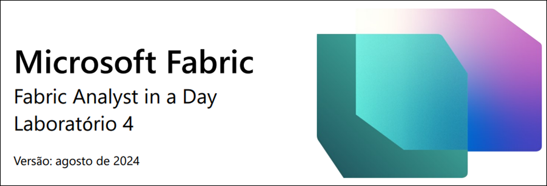

# Sumário 

- Introdução

- Fluxo de dados Gen2

    - Tarefa 1: Copiar consultas do SharePoint para o Fluxo de dados 

    - Tarefa 2: Criar conexão do SharePoint

    - Tarefa 3: Configurar destino de dados para a consulta People

    - Tarefa 4: Publicar e renomear o Fluxo de Dados do SharePoint

    - Tarefa 5: Copiar consultas do Snowflake para o Fluxo de Dados

    - Tarefa 6: Criar conexão com o Snowflake 

    - Tarefa 7: Configurar destino de dados para as consultas Supplier e PO

    - Tarefa 8: Renomear e publicar o fluxo de dados do Snowflake 

- Atalho para o ADLS Gen2 

    - Tarefa 9: Como criar um atalho para Dataverse

    - Tarefa 6: Criar um atalho para o Lakehouse

- Referências

# Introdução 

Em nosso cenário, os Dados do Fornecedor estão no Snowflake, os Dados do Cliente no Dataverse e os Dados do Funcionário no SharePoint. Todas essas fontes de dados são atualizadas em momentos diferentes. Para minimizar o número de atualizações de dados de Fluxos de Dados, criaremos fluxos de dados individuais para as fontes de dados Snowflake e SharePoint.

**Observação**: Várias fontes de dados são suportadas em um único Fluxo de Dados.

A equipe de TI já estabeleceu um link para o Dataverse e aplicou as transformações de dados necessárias, espelhando-as no arquivo do Power BI Desktop. Eles ingeriram esses dados para Lakehouse no workspace Admin e nos deram acesso às tabelas. Vamos criar um atalho para o Lakehouse que a equipe de TI criou.

Ao final deste laboratório, você terá aprendido: 

- Como conectar ao SharePoint usando o Fluxo de dados Gen2 e ingerir dados no Lakehouse

- Como conectar ao Snowflake usando o Fluxo de dados Gen2 e ingerir dados no Lakehouse

- Como ingerir dados de um Lakehouse compartilhado

# Fluxo de dados Gen2

## Tarefa 1: Copiar consultas do SharePoint para o Fluxo de dados

1. Vamos voltar ao workspace do Fabric, **FAIAD_\<nome de usuário>**, que você criou no Laboratório 2, Tarefa 9.

2. Selecione o ícone **Fabric experience selector na** parte inferior esquerda da tela. A caixa de diálogo de experiência do Fabric é aberta

3. Selecione **Data Factory** na caixa de diálogo. Você irá à **Página Inicial do Data Factory**.

    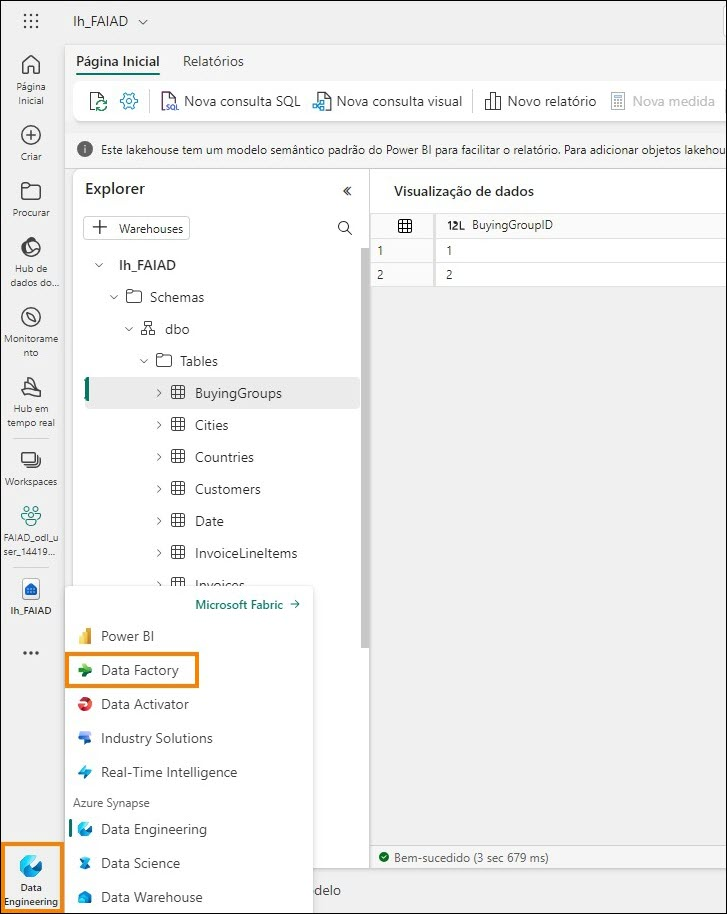

4. Em Itens recomendados, selecione **Fluxo de dados Gen2**.

    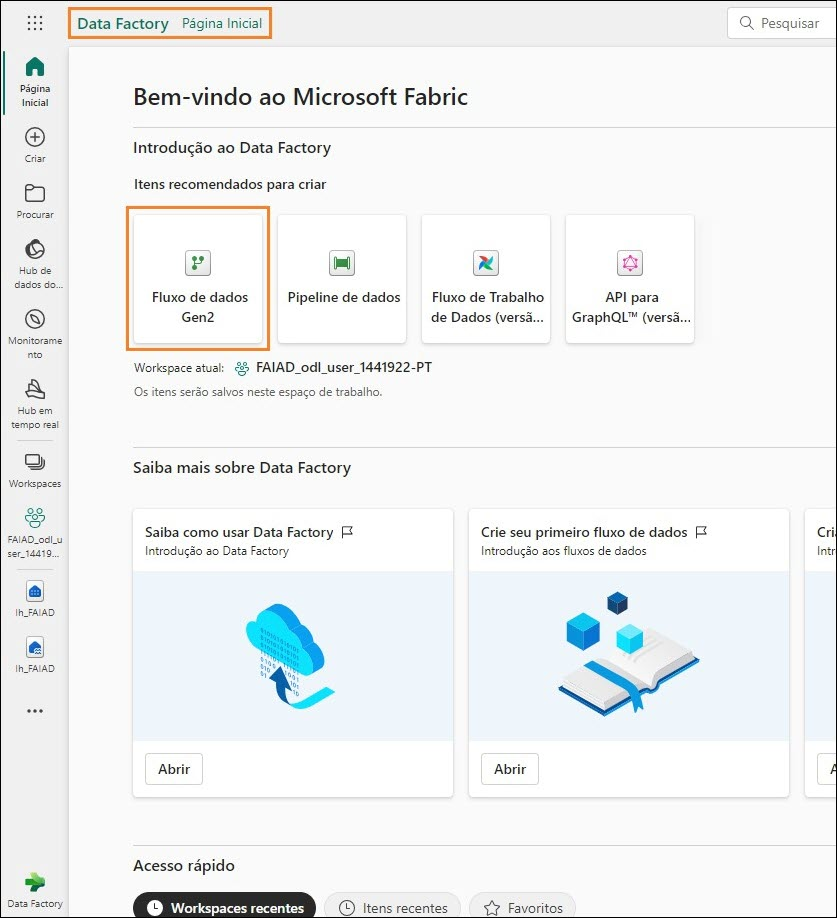

Você será direcionado para a **página do Fluxo de Dados**. A interface do Fluxo de dados Gen2 é como a do Power Query no Power BI Desktop. Podemos copiar consultas do Power BI Desktop para o Fluxo de dados Gen2. Vamos testar.

5. Se você ainda não tiver aberto, abra o arquivo **FAIAD.pbix** que está na pasta **Reports** na área de trabalho do seu ambiente de laboratório. 

6. Na faixa de opções, selecione **Página Inicial -> Transformar dados**. A janela do Power Query é aberta. Como você observou no laboratório anterior, as consultas no painel esquerdo são organizadas por fonte de dados.

7. No painel esquerdo, na pasta SharepointData, **selecione** a consulta **People**.

8. **Clique com o botão direito do mouse** e selecione **Copiar**.

    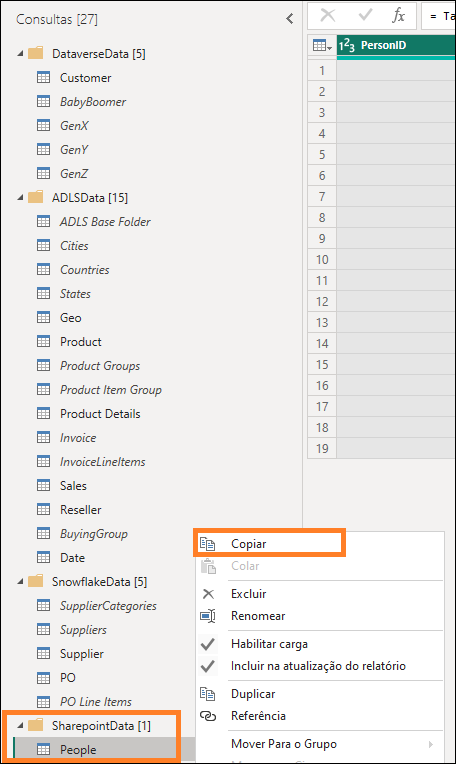

9. Volte para a tela **Fluxo de Dados** no navegador.

10. No **painel Fluxo de dados**, pressione **Ctrl+V** (no momento, não é possível clicar com o botão direito do mouse em Colar). Se você estiver usando o dispositivo MAC, use Cmd+V para colar.

**Observação**: se você estiver trabalhando no ambiente de laboratório, selecione as reticências no canto superior direito da tela. Use o controle deslizante para **habilitar VM Native Clipboard**. Selecione OK na caixa de diálogo. Depois que terminar de colar as consultas, você poderá desabilitar essa opção.

Observe se a consulta foi colada e se está disponível no painel esquerdo. Como não temos uma conexão criada para o SharePoint, você verá uma mensagem de aviso solicitando que configure a conexão.

## Tarefa 2: Criar conexão do SharePoint

1. Selecione **Configurar conexão**.

    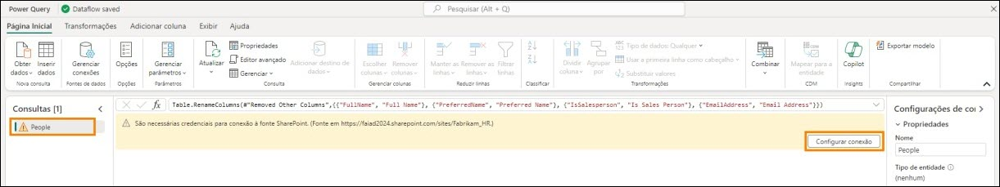

2. A caixa de diálogo Conectar-se à fonte de dados é aberta. Na lista suspensa **Conexão**, verifique se **Criar nova conexão** está selecionada.

3. O **Tipo de autenticação** deve ser **Conta organizacional**.

4. Selecione **Conectar**.

    **Observação**: você vai se conectar usando suas credenciais. Elas serão diferentes da captura de tela abaixo.

    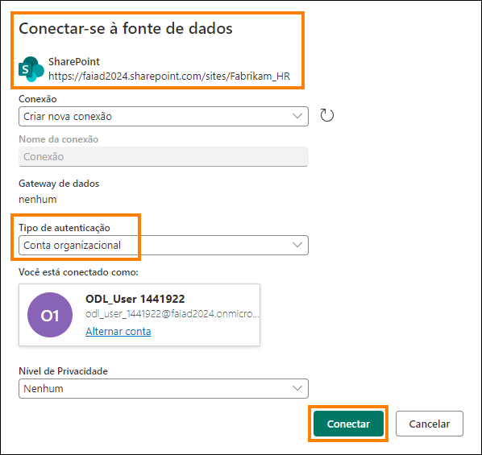

## Tarefa 3: Configurar destino de dados para a consulta People

A conexão é estabelecida e você pode exibir os dados no painel de visualização. Fique à vontade para navegar pelas Etapas aplicadas das consultas. Agora precisamos ingerir os dados de People no Lakehouse.

1. Selecione a consulta **People**.

2. Na faixa de opções, selecione **Página Inicial -> Adicionar destino de dados -> Lakehouse**.

    

3. A caixa de diálogo Conectar ao destino de dados é aberta. Precisamos criar uma nova Conexão com o Lakehouse. Com a opção **Criar nova conexão** selecionada na **lista suspensa Conexão** e **Tipo de autenticação** definido como **Conta organizacional**, selecione **Próximo**.

    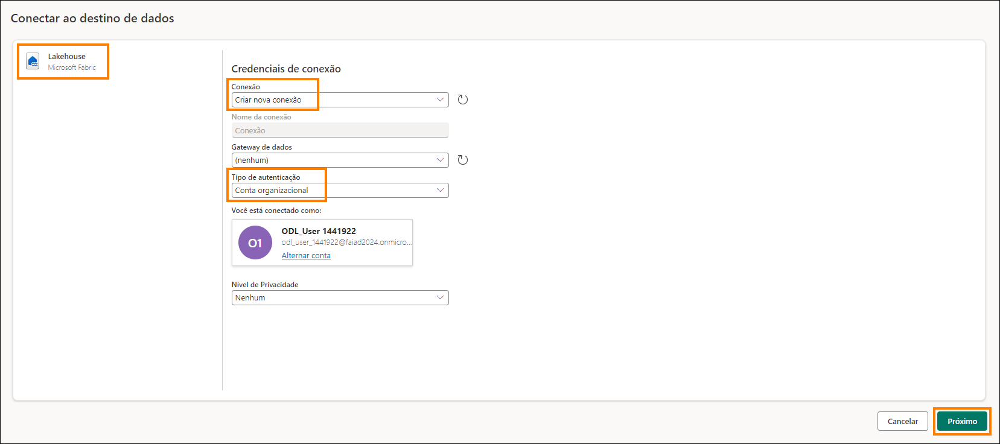

4. A caixa de diálogo Escolher alvo de destino é aberta. Verifique se o botão de opção **Nova tabela** está selecionado, pois estamos criando uma nova tabela.

5. Queremos criar a tabela no Lakehouse que criamos anteriormente. No painel esquerdo, navegue para **Lakehouse -> FAIAD_\<nome de usuário>**.

6. Selecione **lh_FAIAD**.

7. Deixe o nome da tabela como **People**.

8. Selecione **Próximo**.

    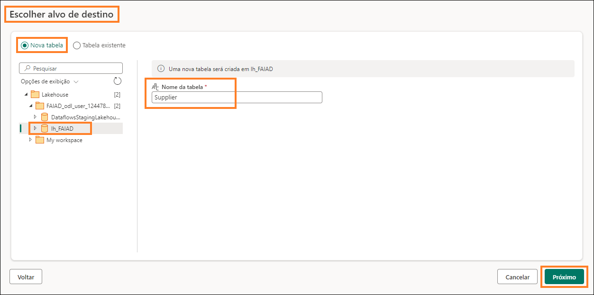

9. A caixa de diálogo Escolher configurações de destino é aberta. Habilite **"Usar configurações automáticas"**. 

**Observação**: você pode desativar as configurações automáticas e notar que tem opções para definir o método Update e as opções de esquema. Depois de explorar, habilite **"Usar configurações automáticas"**.

10. Selecione **Salvar configurações**.

    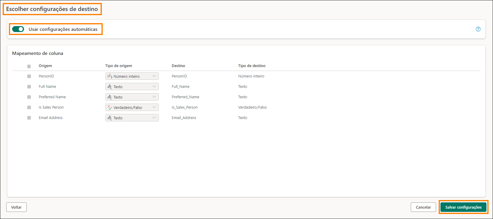

## Tarefa 4: Publicar e renomear o Fluxo de Dados do SharePoint

1. Você será direcionado de volta à **janela Power Query**. No **canto inferior direito**, Destino de dados está definido como Lakehouse.

2. No canto inferior direito, selecione **Publicar**.

    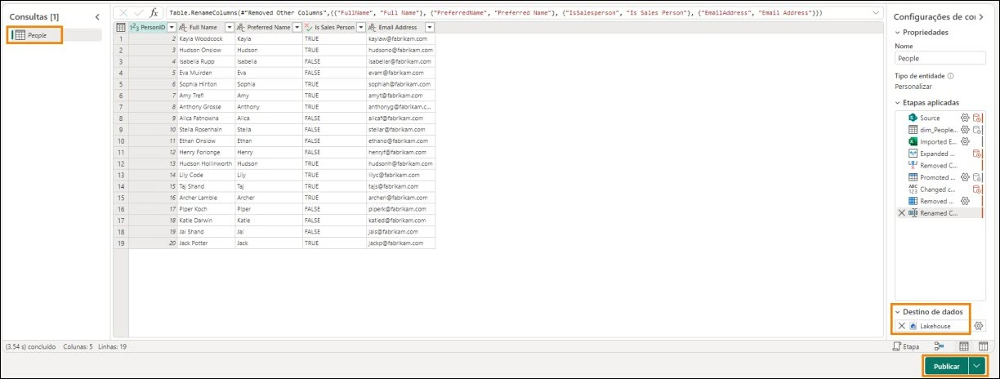

    **Observação**: você será direcionado de volta para o workspace **FAIAD_\<nome de usuário>**. Pode levar alguns instantes para que Fluxo de Dados seja publicado. 

3. Estamos trabalhando com o Fluxo de dados 1. Vamos renomeá-lo antes de continuar. Clique nas **reticências (…)** ao lado de Dataflow 1. Selecione **Propriedades**.

    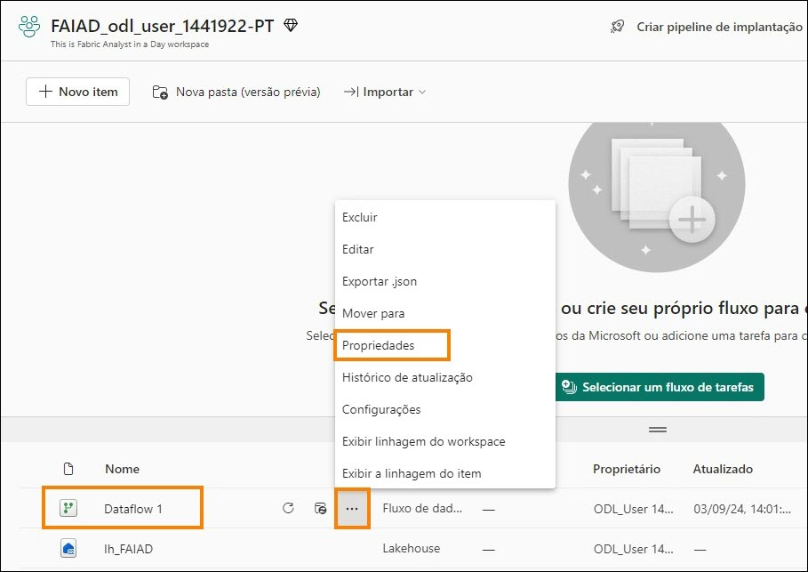

4. A caixa de diálogo Propriedades do fluxo de dados é aberta. Altere o **nome** para **df_People_SharePoint**.

5. Na caixa de texto **Descrição**, adicione **Dataflow to ingest People data from SharePoint to Lakehouse**.

6. Selecione **Salvar**.

    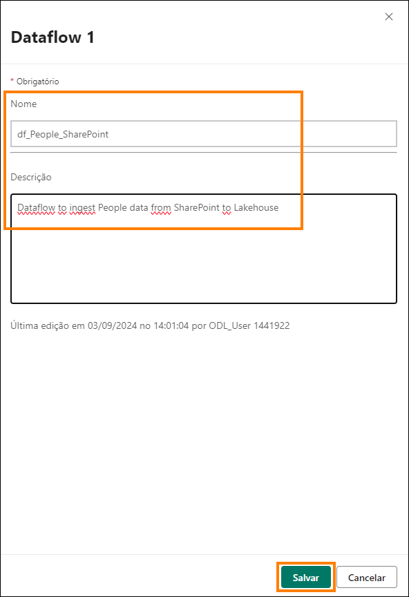

Você será direcionado de volta para o **workspace FAIAD_\<nome de usuário>**.

7. Selecione **lh_FAIAD** para acessar o lakehouse.

8. Verifique se você está na exibição Lakehouse (não no ponto de extremidade da análise SQL).

9. Veja que a tabela **People** está disponível no Lakehouse.

**Observação**: se você não vir as tabelas recém-criadas, selecione as reticências ao lado de Tabelas e selecione Atualizar para atualizar as tabelas. Agora ingerimos todos os dados no Lakehouse. No próximo laboratório, agendaremos a atualização do Fluxo de Dados.

## Tarefa 5: Copiar consultas do Snowflake para o Fluxo de Dados

1. Vamos voltar ao workspace do Fabric, **FAIAD_\<nome de usuário>**

2. No menu superior, selecione **Novo -> Fluxo de dados Gen2**.

    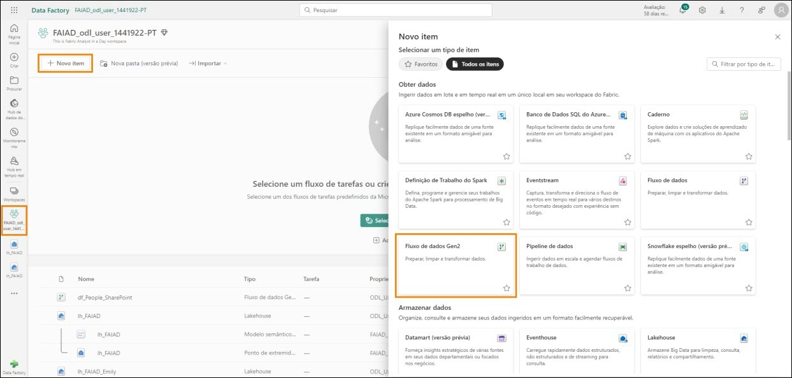

Você será direcionado para a **página do Fluxo de Dados**. Agora que estamos familiarizados com o Fluxo de Dados, vamos continuar e copiar as consultas do Power BI Desktop no Fluxo de Dados.

3. Se você ainda não tiver aberto, abra o arquivo **FAIAD.pbix** que está na pasta **Reports** na área de trabalho do seu ambiente de laboratório. 

4. Na faixa de opções, selecione **Página Inicial -> Transformar dados**. A janela do Power Query é aberta. Como você observou no laboratório anterior, as consultas no painel esquerdo são organizadas por fonte de dados.

5. No painel esquerdo, na pasta SnowflakeData, pressione **Ctrl+Select** ou Shift+Select para selecionar as seguintes consultas:
    
    a. SupplierCategories
    
    b. Suppliers
    
    c. Supplier
    
    d. PO
    
    e. PO Line Items

6. **Clique com o botão direito do mouse** e selecione **Copiar**.

    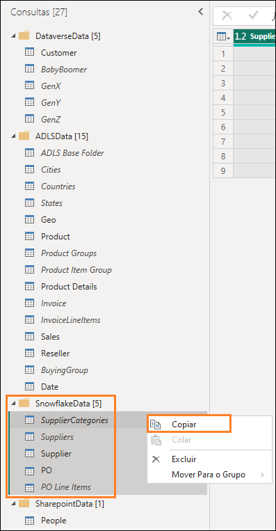

7. Volte para o **navegador**.

8. No **painel Dataflow**, selecione o **painel central** e pressione **Ctrl+V** (no momento, não é possível clicar com o botão direito do mouse em Colar). Se você estiver usando o dispositivo MAC, use Cmd+V para colar.

    **Observação**: se você estiver trabalhando no ambiente de laboratório, selecione as reticências no canto superior direito da tela. Use o controle deslizante para **habilitar VM Native Clipboard**. Selecione OK na caixa de diálogo. Depois que terminar de colar as consultas, você poderá desabilitar essa opção.

    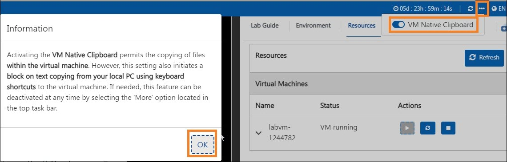

## Tarefa 6: Criar conexão com o Snowflake

Observe que as cinco consultas foram coladas e agora você tem o painel Consultas à esquerda. Como não temos uma conexão criada para o Snowflake, você verá uma mensagem de aviso solicitando que configure a conexão.

1. Selecione Configurar conexão.

    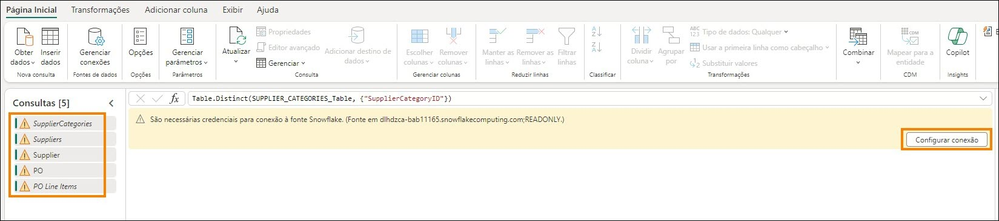

2. A caixa de diálogo Conectar-se à fonte de dados é aberta. Na lista suspensa **Conexão**, verifique se **Criar nova conexão** está selecionada.

3. O **Tipo de autenticação** deve ser **Snowflake**.

4. Insira o **Nome de usuário e a Senha do Snowflake** disponíveis na guia Variáveis de Ambiente (ao lado do Guia de Laboratório).

5. Selecione **Conectar**.

    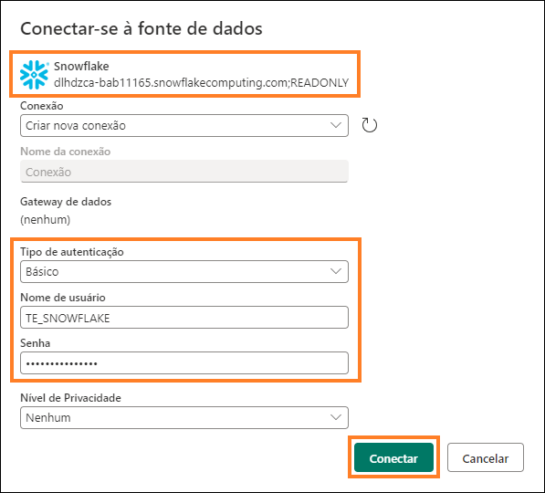

A conexão é estabelecida e você pode exibir os dados no painel de visualização. Fique à vontade para navegar pelas Etapas aplicadas das consultas. Basicamente, a consulta Suppliers tem os detalhes dos fornecedores e SupplierCategories, como o nome indica, tem categorias de fornecedores. Essas duas tabelas são unidas para criar a dimensão Supplier, com as colunas necessárias. Da mesma forma, temos a consulta PO Line Items mesclada com PO para criar o fato PO. Agora precisamos ingerir os dados de Supplier e PO no Lakehouse.

## Tarefa 7: Configurar destino de dados para as consultas Supplier e PO

1. Selecione a consulta **Supplier**.

2. Na faixa de opções, selecione **Página Inicial -> Adicionar destino de dados -> Lakehouse**.

    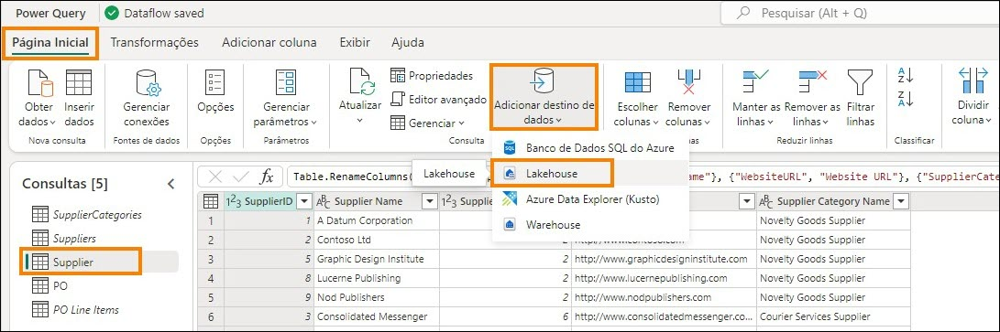

3. A caixa de diálogo Conectar ao destino de dados é aberta. Na lista suspensa **Conexão**, selecione **Lakehouse (nenhum)**.

4. Selecione **Próximo**.

    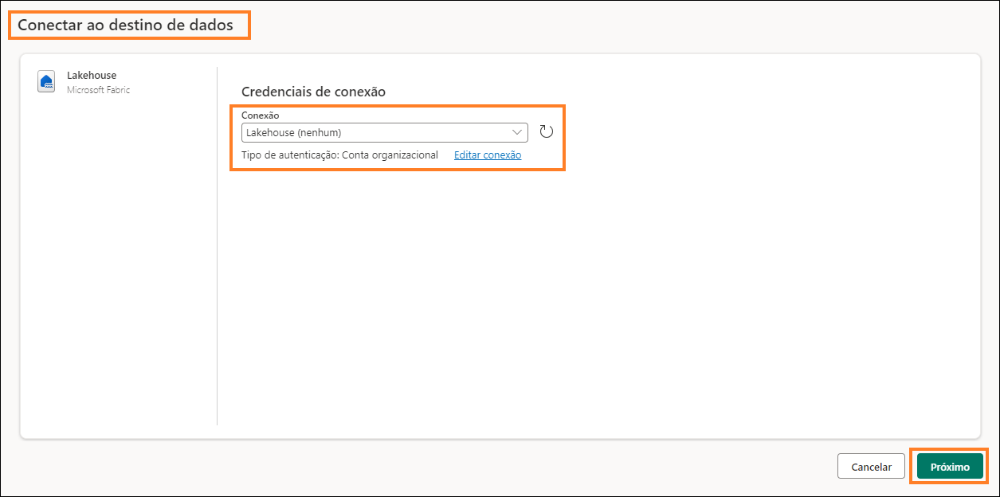

5. A caixa de diálogo Escolher alvo de destino é aberta. Verifique se o botão de opção **Nova tabela** está **selecionado**, pois estamos criando uma nova tabela.

6. Queremos criar a tabela no Lakehouse que criamos anteriormente. No painel esquerdo, navegue para **Lakehouse -> FAIAD_\<nome de usuário>**.

7. Selecione **lh_FAIAD**.

8. Deixe o nome da tabela como **Supplier**.

9. Selecione **Próximo**.

    

10. A caixa de diálogo Escolher configurações de destino é aberta. Usaremos as configurações automáticas, pois assim será feita uma atualização completa dos dados. Além disso, as colunas serão renomeadas conforme necessário. Selecione **Salvar configurações**

    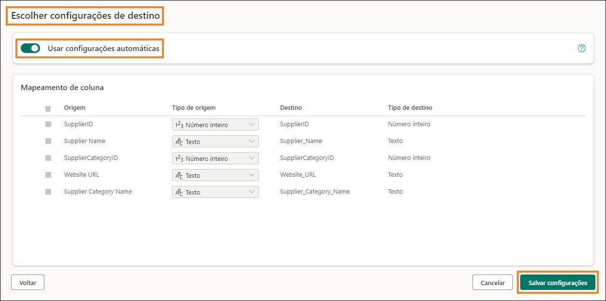

11. Você será direcionado de volta à **janela Power Query**. No **canto inferior direito, Destino de dados** está definido como **Lakehouse**. Da mesma forma, **configure o Destino de dados para a consulta PO**. Uma vez feito isso, sua consulta PO deverá ter **Destino de dados** definido como **Lakehouse** conforme mostrado na captura de tela abaixo.

    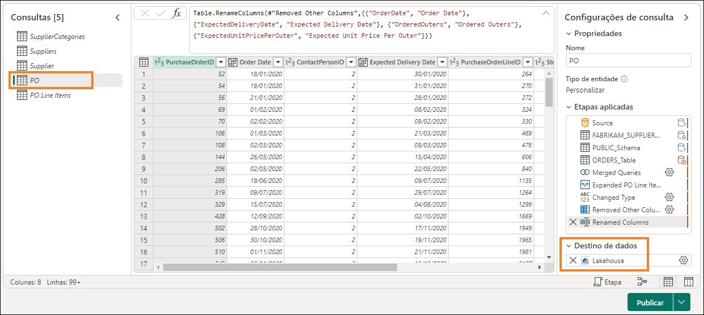

## Tarefa 8: Renomear e publicar o fluxo de dados do Snowflake

1. Na parte superior da tela, selecione a **seta ao lado do Dataflow 1** para renomear.

2. Na caixa de diálogo, altere o nome para **df_Supplier_Snowflake**.

3. Clique em **Enter** para salvar a alteração do nome.

    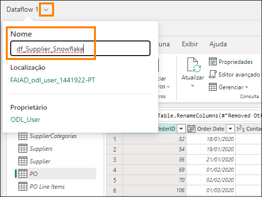

4. No canto inferior direito, selecione **Publicar**.

    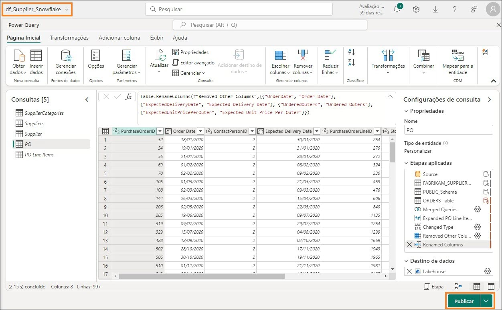

Você será direcionado de volta para o workspace **FAIAD_\<nome de usuário>**. Pode levar alguns instantes para que Fluxo de Dados seja publicado. 

5. Selecione **lh_FAIAD** para acessar o lakehouse.

6. Verifique se você está na exibição Lakehouse (não no ponto de extremidade da análise SQL).

7. Veja que a tabela **PO** e a tabela **Supplier** estão disponíveis no Lakehouse.

**Observação**: se você não vir as tabelas recém-criadas, selecione as reticências ao lado de Tabelas e selecione Atualizar para atualizar as tabelas.

Agora vamos criar um atalho para mostrar dados do Dataverse.

# Atalho para o ADLS Gen2

## Tarefa 9: Como criar um atalho para Dataverse

Você deve estar no Lakehouse **lh_FAIAD**. Verifique se você está na exibição Lakehouse (não no ponto de extremidade da análise SQL).
    

1. No painel **Explorer**, selecione as **reticências** ao lado de **Tabelas**.

2. Selecione **Novo atalho**.

    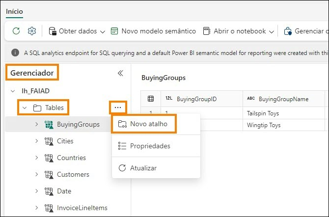

3. A caixa de diálogo Novo atalho é aberta. Em **Fontes externas**, selecione **Dataverse**.

    **Observação**: no laboratório anterior, seguimos etapas semelhantes para criar um atalho para Azure Data Lake Storage Gen2. 

    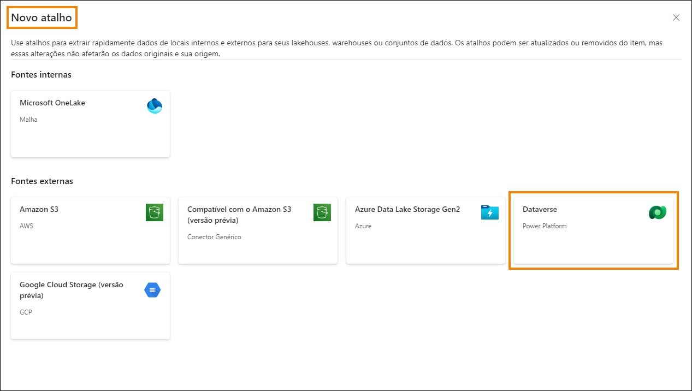

4. A caixa de diálogo Configurações de conexão é aberta. Insira **org6c18814a.crm.dynamics.com** como **Domínio de ambiente**.

5. Deixe **Tipo de autenticação** como **Conta organizacional**.

6. Selecione **Sign in**.

    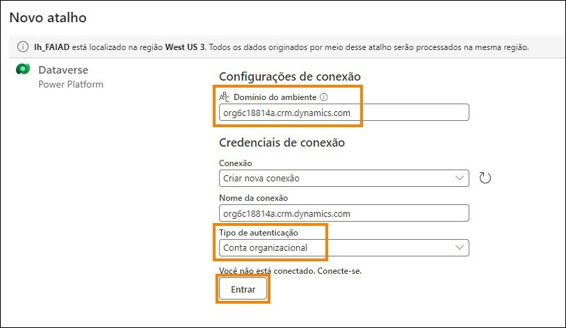

7. A caixa de diálogo Entrar na sua conta é aberta. **Escolha sua conta** para entrar.

    **Observação**: sua conta será diferente da captura de tela abaixo.

    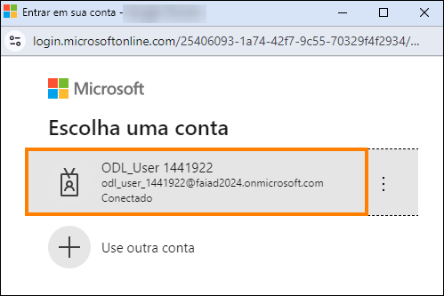

8. Selecione Próximo na caixa de diálogo Configurações de conexão.

Você irá para uma caixa de diálogo para escolher o bucket/diretório diferente do Dataverse. Observe que há muitas opções de buckets disponíveis. Podemos escolher os buckets que precisamos e seguir o processo como o Laboratório 3 (usar consulta visual para transformar dados e criar exibições). Também podemos usar o Fluxo de dados Gen2 como usamos anteriormente neste laboratório para nos conectarmos ao SharePoint. No entanto, queremos explicar a você outra opção que está disponível.

Em nosso cenário, a equipe de TI já estabeleceu um link para o Dataverse e aplicou as transformações de dados necessárias, espelhando-as no arquivo do Power BI Desktop. Eles ingeriram esses dados para Lakehouse no workspace Admin e nos deram acesso às tabelas. Como nossa equipe de TI fez todo o trabalho árduo, podemos criar um atalho para esse Lakehouse no workspace Admin.

9. Selecione **Cancelar** na caixa de diálogo Novo atalho para voltar ao Lakehouse.

    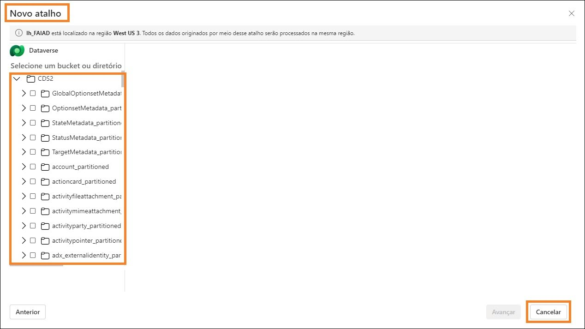

## Tarefa 6: Criar um atalho para o Lakehouse

1. No painel **Explorer**, selecione as **reticências** ao lado de **Tabelas**.

2. Selecione **Novo atalho**.

    

3. A caixa de diálogo Novo atalho é aberta. Selecione a opção **Microsoft OneLake** em Fontes internas.

    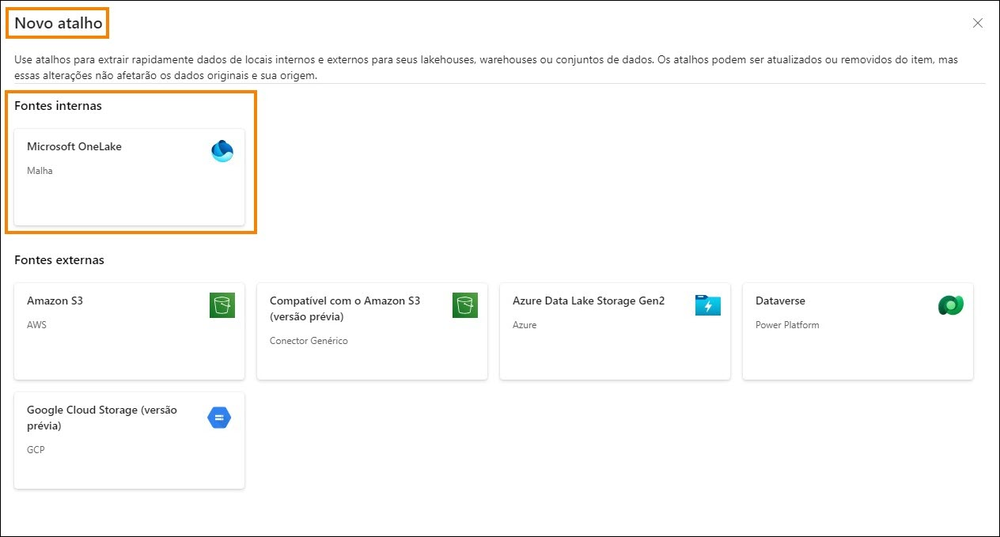

4. A caixa de diálogo Selecionar um tipo de fonte de dados é aberta.Observe que você tem duas fontes de dados.

    a. lh_FAIAD: é o lakehouse que você criou.

    b. lh_dataverse: é o lakehouse que o administrador criou.

5. Selecione **lh_dataverse**.

6. Selecione **Avançar**.

    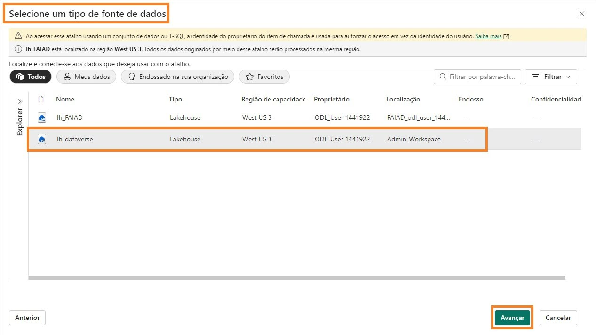

7. No painel esquerdo, expanda **lh_dataverse -> Tables**. Observe que o administrador de TI forneceu acesso à tabela Customer.

8. Selecione **Customer**.

9. Selecione **Avançar**.

    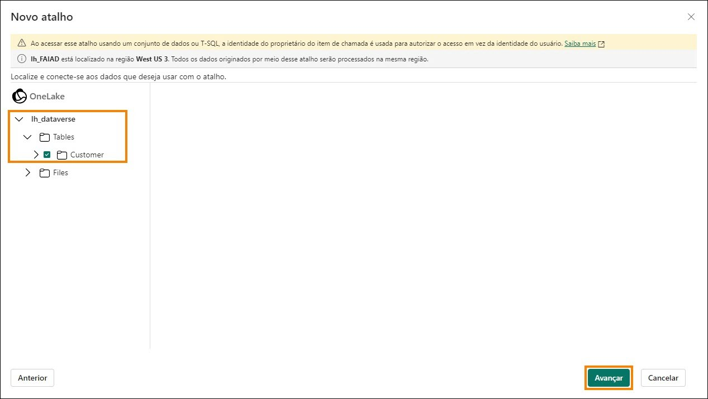

10. Na próxima caixa de diálogo, selecione **Criar**. Você será direcionado de volta ao lakehouse lh_FAIAD.

    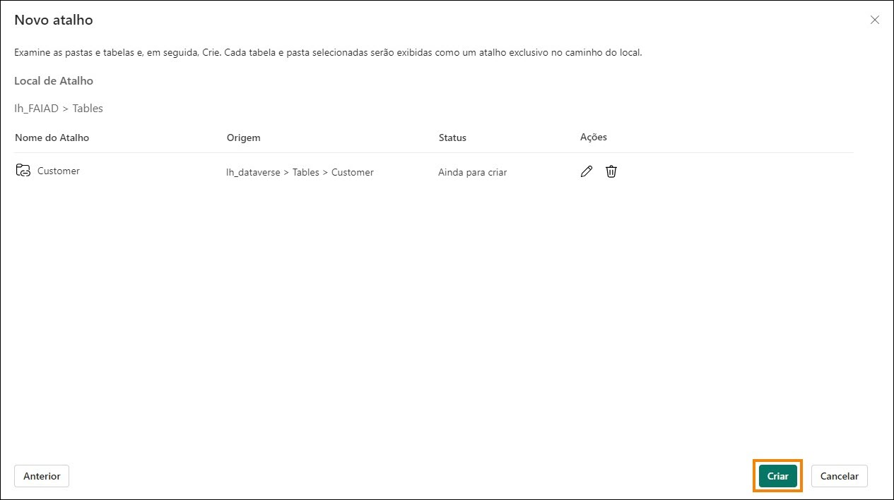

11. No painel **Explorer** à esquerda, observe que a nova tabela **Customer** foi criada.

12. Selecione a tabela **Customer** para exibir os dados no painel de visualização.

Criamos com sucesso um atalho para outro lakehouse.

No próximo laboratório, vamos configurar atualizações de agendamentos.

# Referências

O Fabric Analyst in a Day (FAIAD) apresenta algumas das principais funções disponíveis no Microsoft Fabric. No menu do serviço, a seção Ajuda (?) tem links para ótimos recursos.

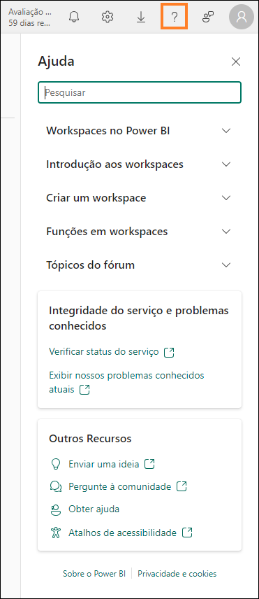

Veja aqui mais alguns recursos que ajudarão você com as próximas etapas do Microsoft Fabric.

- Veja a postagem do blog para ler o [anúncio completo de GA do Microsof t Fabric](https://aka.ms/Fabric-Hero-Blog-Ignite23)

- Explore o Fabric por meio do [Tour Guiado](https://aka.ms/Fabric-GuidedTour)

- Inscreva-se para a [avaliação gratuita do Microsof t Fabric](https://aka.ms/try-fabric)

- Visite o [site do Microsof t Fabric](https://aka.ms/microsoft-fabric)

- Aprenda novas habilidades explorando os [módulos de Aprendizagem do Fabric](https://aka.ms/learn-fabric)

- Explore a [documentação técnica do Fabric](https://aka.ms/fabric-docs)

- Leia o [livro eletrônico gratuito sobre como começar a usar o Fabric](https://aka.ms/fabric-get-started-ebook)

- Participe da [comunidade do Fabric](https://aka.ms/fabric-community) para postar suas perguntas, compartilhar seus comentários e aprender com outras pessoas

Leia os blogs de comunicados de experiências do Fabric em mais detalhes:

- [Experiência do Data Factory no blog do Fabric](https://aka.ms/Fabric-Data-Factory-Blog)
- [Experiência do Synapse Data Engineering no blog do Fabric](https://aka.ms/Fabric-DE-Blog)
- [Experiência do Synapse Data Science no blog do Fabric](https://aka.ms/Fabric-DS-Blog)
- [Experiência do Synapse Data Warehousing no blog do Fabric](https://aka.ms/Fabric-DW-Blog)
- [Experiência do Synapse Real-Time Analytics no blog do Fabric](https://aka.ms/Fabric-RTA-Blog)
- [Blog de comunicado do Power BI](https://aka.ms/Fabric-PBI-Blog)
- [Experiência do Data Activator no blog do Fabric](https://aka.ms/Fabric-DA-Blog)
- [Administração e governança no blog do Fabric](https://aka.ms/Fabric-Admin-Gov-Blog)
- [OneLake no blog do Fabric](https://aka.ms/Fabric-OneLake-Blog)
- [Blog de integração do Dataverse e Microsof t Fabric](https://aka.ms/Dataverse-Fabric-Blog)

© 2023 Microsoft Corporation. Todos os direitos reservados.

Ao usar esta demonstração/este laboratório, você concorda com os seguintes termos:

A tecnologia/funcionalidade descrita nesta demonstração/neste laboratório é fornecida pela Microsoft Corporation para obter seus comentários e oferecer uma experiência de aprendizado. Você pode usar a demonstração/o laboratório somente para avaliar tais funcionalidades e recursos de tecnologia e fornecer comentários à Microsoft. Você não pode usá-los para nenhuma outra finalidade. Você não pode modificar, copiar, distribuir, transmitir, exibir, executar, reproduzir, publicar, licenciar, criar obras derivadas, transferir nem vender esta demonstração/este laboratório ou qualquer parte deles.

A CÓPIA OU A REPRODUÇÃO DA DEMONSTRAÇÃO/DO LABORATÓRIO (OU DE QUALQUER PARTE DELES) EM QUALQUER OUTRO SERVIDOR OU LOCAL PARA REPRODUÇÃO OU REDISTRIBUIÇÃO ADICIONAL É EXPRESSAMENTE PROIBIDA.

ESTA DEMONSTRAÇÃO/ESTE LABORATÓRIO FORNECE DETERMINADOS RECURSOS E FUNCIONALIDADES DE PRODUTO/TECNOLOGIA DE SOFTWARE, INCLUINDO NOVOS RECURSOS E CONCEITOS POTENCIAIS, EM UM AMBIENTE SIMULADO SEM CONFIGURAÇÃO NEM INSTALAÇÃO COMPLEXA PARA A FINALIDADE DESCRITA ACIMA. A TECNOLOGIA/OS CONCEITOS REPRESENTADOS NESTA DEMONSTRAÇÃO/NESTE LABORATÓRIO PODEM NÃO REPRESENTAR A FUNCIONALIDADE COMPLETA DOS RECURSOS E PODEM NÃO FUNCIONAR DA MESMA MANEIRA QUE UMA VERSÃO FINAL. ALÉM DISSO, PODEMOS NÃO LANÇAR UMA VERSÃO FINAL DE TAIS RECURSOS OU CONCEITOS. SUA EXPERIÊNCIA COM O USO DE TAIS RECURSOS E FUNCIONALIDADES EM UM AMBIENTE FÍSICO TAMBÉM PODE SER DIFERENTE.

**COMENTÁRIOS**. Caso você forneça comentários sobre os recursos de tecnologia, as funcionalidades e/ou os conceitos descritos nesta demonstração/neste laboratório à Microsoft, você concederá à Microsoft, sem encargos, o direito de usar, compartilhar e comercializar seus comentários de qualquer forma e para qualquer finalidade. Você também concede a terceiros, sem encargos, quaisquer direitos de patente necessários para que seus produtos, suas tecnologias e seus serviços usem ou interajam com partes específicas de um software ou um serviço da Microsoft que inclua os comentários. Você não fornecerá comentários que estejam sujeitos a uma licença que exija que a Microsoft licencie seu software ou sua documentação para terceiros em virtude da inclusão de seus comentários neles. Esses direitos continuarão em vigor após o término do contrato.

POR MEIO DESTE, A MICROSOFT CORPORATION SE ISENTA DE TODAS AS GARANTIAS E CONDIÇÕES REFERENTES À DEMONSTRAÇÃO/AO LABORATÓRIO, INCLUINDO TODAS AS GARANTIAS E CONDIÇÕES DE COMERCIALIZAÇÃO, SEJAM ELAS EXPRESSAS, IMPLÍCITAS OU ESTATUTÁRIAS, E DE ADEQUAÇÃO A UMA FINALIDADE ESPECÍFICA, TÍTULO E NÃO VIOLAÇÃO. A MICROSOFT NÃO DECLARA NEM GARANTE A PRECISÃO DOS RESULTADOS DERIVADOS DO USO DA DEMONSTRAÇÃO/DO LABORATÓRIO NEM A ADEQUAÇÃO DAS INFORMAÇÕES CONTIDAS NA DEMONSTRAÇÃO/NO LABORATÓRIO A QUALQUER FINALIDADE.
 
**AVISO DE ISENÇÃO DE RESPONSABILIDADE**

Esta demonstração/este laboratório contém apenas uma parte dos novos recursos e aprimoramentos do Microsoft Power BI. Alguns dos recursos podem ser alterados em versões futuras do produto. Nesta demonstração/neste laboratório, você aprenderá sobre alguns dos novos recursos, mas não todos.
