# Microsoft Fabric - Fabric Analyst in a Day - Laboratório 5


# Sumário 

- Introdução

- Fluxo de dados Gen2

    - Tarefa 1: Configurar atualização agendada para o Fluxo de dados Supplier

- Pipeline de dados

    - Tarefa 2: Criar Pipeline de dados 

    - Tarefa 3: Criar Pipeline de dados simples 

    - Tarefa 4: Criar novo Pipeline de dados

    - Tarefa 5: Criar atividade Until

    - Tarefa 6: Criar variáveis

    - Tarefa 7: Configurar atividade Until 

    - Tarefa 8: Configurar atividade Dataflow 

    - Tarefa 9: Configurar 1ª atividade Set variable

    - Tarefa 10: Configurar 2ª atividade Set variable

    - Tarefa 11: Configurar 3ª atividade Set variable

    - Tarefa 12: Configurar atividade Wait 

    - Tarefa 13: Configurar atualização de agenda para o Pipeline de dados 

- Referências

# Introdução 

Temos ingerido dados de diversas fontes no Lakehouse. Neste laboratório,você configurará uma agenda de atualização para as fontes de dados. Apenas para recapitular o requisito:

- **Dados do Fornecedor**: o Snowflake é atualizado à meia-noite/24h todos os dias.

- **Dados do Funcionário**: no SharePoint, são atualizados às 9h todos os dias. No entanto, observamos que, às vezes, há um atraso de 5 a 15 minutos. Precisamos criar uma agenda de atualização para acomodar isso.

- **Dados do Cliente**: no Dataverse, são sempre atualizados. Anteriormente, atualizávamos esses dados quatro vezes ao dia: à meia-noite/24h, 6h, meio-dia/12h e 18h. Agora, a equipe de TI criou um link para o Dataverse ingerir esses dados em um Lakehouse administrativo. Eles também transformaram esses dados. Não precisamos configurar a atualização, pois estamos vinculando ao Lakehouse fornecido pela equipe de TI.

- **Dados de Venda**: no ADLS são atualizados ao meio-dia/12h todos os dias. Não precisamos configurar a atualização para isso, pois criamos um atalho. Os dados estarão disponíveis assim que forem atualizados no ADLS.

Ao final deste laboratório, você terá aprendido: 

- Como configurar uma atualização agendada do Fluxo de dados Gen2

- Como criar um Pipeline de dados

- Como configurar uma atualização agendada do Pipeline de dados

# Fluxo de dados Gen2

## Tarefa 1: Configurar atualização agendada para o Fluxo de dados Supplier

Vamos começar configurando uma atualização agendada do Fluxo de dados Supplier.

1. Voltamos ao workspace do Fabric, **FAIAD_\<nome de usuário>** selecionando-o no painel esquerdo.

2. Para maximizar o painel com a lista de artefatos, selecione a seta dupla no canto superior direito do painel.

    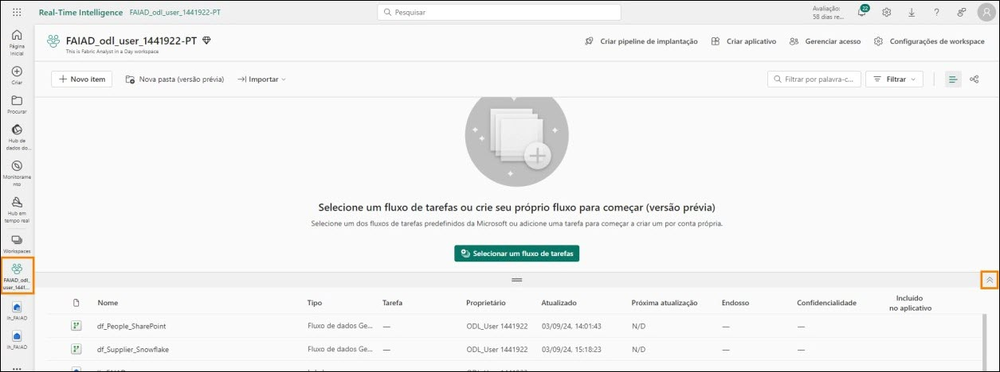

3. Todos os artefatos que você criou estão listados aqui. No lado direito da tela, na **Caixa de pesquisa**, insira **df**. Isso filtrará os artefatos para Fluxos de dados.

    

4. Passe o mouse sobre a linha **df_Supplier_Snowflake**. Observe que os conhecidos ícones **Atualizar** e **Agendar Atualização** estão disponíveis. Selecione as **reticências(…)**.

5. Observe que há opção para Excluir, Editar e Exportar o Fluxo de dados. Podemos usar Propriedades para atualizar o nome e a descrição do Fluxo de dados. Veremos o histórico de atualização em breve. Selecione **Configurações**.

    

    **Observação**: A página Configurações é aberta. No painel esquerdo, você encontrará todos os Fluxos de Dados listados.

6. No painel central, selecione o link **Histórico de atualização**

    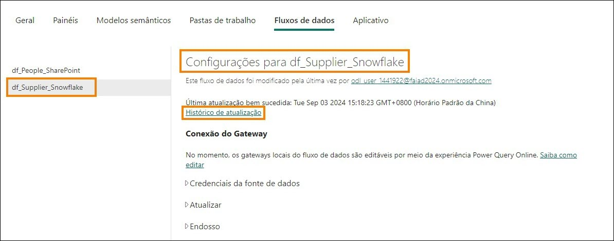

7. Você terá uma atualização listada. Esta é a atualização que ocorreu quando o fluxo de dados foi publicado. Selecione o link **Hora de início**.

    **Observação**: A hora de início será diferente para você.

    

    A tela Detalhes será aberta. Ela fornecerá detalhes da atualização, listando o horário de início, de término e a duração. Ela também lista as tabelas/atividades que foram atualizadas. Caso haja uma falha, você pode clicar no nome da tabela/atividade para investigar mais detalhadamente.

    

8. Vamos sair, clicando no **X** no canto superior direito. Você será direcionado de volta para a **página de configurações do fluxo de dados**.

9. Em Conexão do gateway, expanda **Credenciais da fonte de dados**. Uma lista de conexões usadas no fluxo de dados é exibida. Neste caso, Lakehouse e Snowflake.

    a. **Lakehouse**: esta é a conexão para ingerir dados do Fluxo de dados.
    
    b. **Snowflake**: esta é a conexão com os dados de origem do Snowflake.

    

10. Expanda **Atualizar**.

11. Defina o controle deslizante **Configurar um agendamento de atualização** como **Ativado**.

    

12. Defina a **lista suspensa Atualizar frequência** como **Diariamente**. Observe que há uma opção para defini-la como Semanalmente também.

13. Defina **Fuso horário** como o seu fuso horário preferencial. 

    **Observação**: Como este é um ambiente de laboratório, você pode definir o fuso horário de sua preferência. Em um cenário real, você definirá o fuso horário com base em sua localização ou na localização da fonte de dados.

14. Clique no link **Adicionar outra hora**. Observe que a opção **Hora** é exibida.

15. Defina **Hora** como **meia-noite/24h**. Observe que você pode definir a atualização no início da hora ou meia hora.

16. Selecione **Aplicar** para salvar essa configuração.

    **Observação**: Ao clicar no link Adicionar outra hora, você pode adicionar vários horários de atualização. Você também pode enviar notificações de falha para o proprietário do fluxo de dados e outros contatos.

    

Conforme mencionado anteriormente, precisamos criar uma lógica personalizada para lidar com o cenário em que o arquivo Employee no SharePoint não é entregue no prazo. Vamos usar o Pipeline de dados para resolver isso.

# Pipeline de dados

## Tarefa 2: Criar Pipeline de dados

1. Selecione o ícone **Fabric experience selector** na parte inferior esquerda da tela.

2. A caixa de diálogo do Microsoft Fabric será aberta. Selecione **Data Factory**. Você será direcionado à Página Inicial do Data Factory.

    

3. No painel superior, selecione **Pipeline de dados** para criar um novo pipeline.

4. A caixa de diálogo Novo pipeline é aberta. Nomeie o pipeline como 
**pl_Refresh_People_SharePoint**.

5. Selecione **Criar**.

    

    Você é direcionado para a **página Pipeline de dados**. Se você trabalhou com o Azure Data Factory, esta tela será familiar. Vamos obter uma visão geral rápida do layout.

    Você está na tela **Página Inicial**. Se você olhar o menu superior, encontrará opções para adicionar as atividades comumente usadas: validar e executar um pipeline e visualizar o histórico de execuções. Além disso, no painel central, você encontrará opções rápidas para começar a criar o pipeline.

    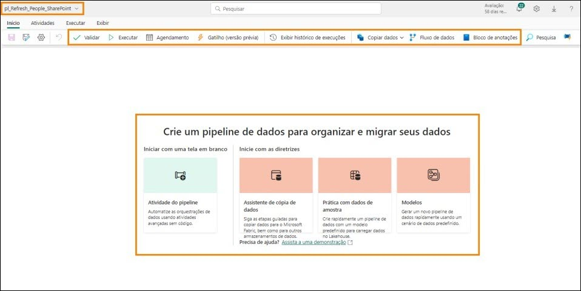

6. No menu superior, selecione **Atividades**. Agora, no menu, você encontrará uma lista de atividades comumente usadas. 

7. Selecione as **reticências (…)** à direita no menu para ver todas as outras atividades disponíveis. Usaremos algumas destas atividades no laboratório.

    

8. No menu superior, clique em **Executar**. Você encontrará opções para executar e agendar a execução do pipeline. Você também encontrará a opção de visualizar o histórico de execuções usando Exibir histórico de execuções.

9. No menu superior, selecione **Exibir**. Aqui você encontrará opções para visualizar o código no formato JSON. Você também encontrará opções para formatar as atividades.

    **Observação**: Se você tiver um histórico de JSON, no fim do laboratório, fique à vontade para selecionar Exibir código JSON. Aqui você observará que toda a orquestração que está fazendo usando a visualização de design também pode ser escrita em JSON. 

    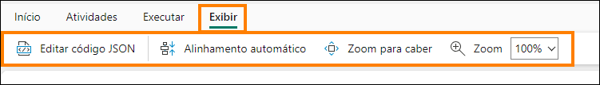

## Tarefa 3: Criar Pipeline de dados simples

Vamos começar a criar o pipeline. Precisamos de uma atividade para atualizar o Fluxo de dados. Vamos encontrar uma atividade que possamos usar.

1. No menu superior, selecione **Atividades -> Fluxo de dados**. A atividade Fluxo de dados é adicionada ao painel central de design. Observe que o painel inferior agora tem opções de configuração da atividade Fluxo de dados.

2. Vamos configurar a atividade para conectar-se à atividade df_People_SharePoint. No **painel inferior**, selecione **Configurações**.

3. Certifique-se de que o **Workspace** esteja definido como seu workspace do Fabric, **FAIAD\<nome de usuário>**.

4. Na lista suspensa **Fluxo de dados**, selecione **df_People_SharePoint**. Quando esta atividade Fluxo de dados for executada, ela atualizará **df_People_SharePoint**. Isso foi fácil, certo? 

    Em nosso cenário, os Dados de Employee não são atualizados na agenda. Às vezes, há um atraso. Vamos ver se podemos acomodar isso.

    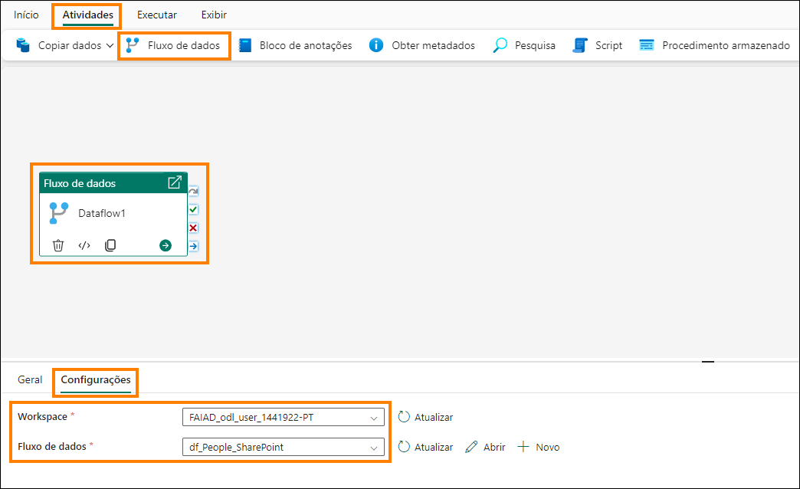

5. No **painel inferior**, selecione **Geral**. Vamos atribuir um nome e uma descrição à atividade.

6. No campo **Nome**, insira **dfactivity_People_SharePoint**.

7. No campo **Descrição**, insira **Dataflow activity to refresh df_People_Sharepoint dataflow**.

8. Observe que há uma opção para desativar uma atividade. Esse recurso é útil durante testes ou depuração. Deixe como **Ativado**.

9. Há uma opção para definir **Tempo limite**. Vamos deixar o **valor padrão** como está, o que deve dar tempo suficiente para a atualização do fluxo de dados.

    **Observação**: Se os dados não estiverem disponíveis na agenda, vamos definir a atividade para ser executada novamente a cada 10 minutos, três vezes. Se falhar também na terceira tentativa, será reportada uma falha.

10. Defina **Tentar novamente** como **3**. 

11. Expanda a seção **Avançado**.

12. Defina **Intervalo de repetição segundos** como **600**. 

13. No menu, selecione **Página Inicial -> Salvar** para salvar o pipeline.

    

Observe a vantagem de usar o pipeline de dados em comparação com a configuração do fluxo de dados na atualização agendada (como fizemos para os fluxos de dados anteriores):

- O pipeline oferece a opção de tentar novamente várias vezes antes de a atualização falhar.

- O pipeline oferece o recurso de atualizar em segundos, enquanto com o fluxo de dados, a atualização agendada ocorre a cada 30 minutos.

## Tarefa 4: Criar novo Pipeline de dados

Vamos adicionar um pouco mais de complexidade ao nosso cenário. Observamos que, se os dados não estiverem disponíveis às 9h, normalmente estarão disponíveis em cinco minutos. Se a janela de tempo for perdida, levará 15 minutos para que o arquivo fique disponível. Queremos agendar as novas tentativas para 5 e 15 minutos. Vamos ver como isso pode ser alcançado criando um novo Pipeline de dados.

1. No painel esquerdo, clique em **FAIAD_\<nome de usuário>** para navegar até a página inicial do workspace.

2. No menu superior, clique em **Novo** e na **lista suspensa**, clique em **Pipeline de dados**.

3. A caixa de diálogo Novo pipeline é aberta. **Nomeie** o pipeline como 
**pl_Refresh_People_SharePoint_Option2**.

4. Selecione **Criar**.

    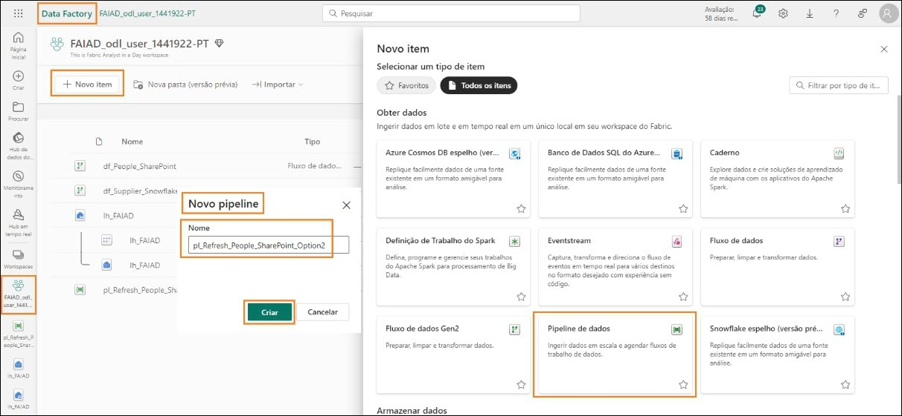

## Tarefa 5: Criar atividade Until

1. Você será direcionado de volta à tela Pipeline de dados. No menu, selecione **Atividades**.

2. Clique nas **reticências(…)** no lado direito.

3. Na lista de atividades, clique em **Until**. 

    **Until**: é uma atividade usada para iterar até que uma condição seja satisfeita. 

    Em nosso cenário, vamos iterar e atualizar o fluxo de dados até que seja bem-sucedido ou tentamos três vezes.

    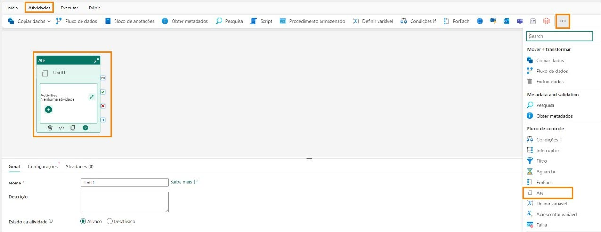

## Tarefa 6: Criar variáveis

1. Precisamos criar variáveis que serão usadas para iterar e definir status. Selecione a **área em branco** no painel de design do pipeline.

2. Observe que o menu no painel inferior muda. Selecione **Variáveis**.

3. Selecione **Novo** para adicionar uma nova variável.

4. Observe que uma linha é exibida. Insira **varCounter** na **caixa de texto Nome**. Usaremos essa variável para iterar três vezes.

5. Na **lista suspensa Tipo**, selecione **Integer**.

6. Insira **Valor padrão** igual a **0**.

    **Observação**: estamos acrescentando var aos nomes das variáveis, por isso é fácil encontrá-las e é uma boa prática.

    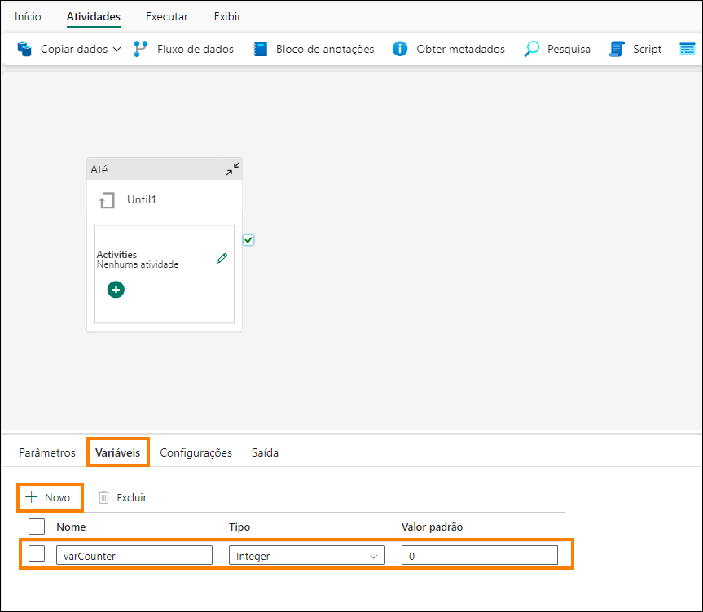

7. Selecione **Novo** para adicionar outra nova variável.

8. Observe que uma linha é exibida. Insira **varTempCounter** na **caixa de texto Nome**. Vamos usar esta variável varCounter de incremento de variável.

9. Na **lista suspensa Tipo**, selecione **Integer**.

10. Insira **Valor padrão** igual a **0**.

11. Siga etapas semelhantes para adicionar mais três variáveis:

    a. **varIsSuccess** do tipo **String** e valor padrão **Não**. Essa variável será usada para indicar se a atualização do fluxo de dados foi bem-sucedida.

    b. varSuccess do tipo String e valor padrão Sim. Essa variável será usada para definir o valor de varIsSuccess se a atualização do fluxo de dados for bem-sucedida.

    c. varWaitTime do tipo Integer e valor padrão 60. Essa variável será usada para definir o tempo de espera se o fluxo de dados falhar (5 minutos/300 segundos ou 15 minutos/900 segundos).

    **Observação**: certifique-se de que não haja espaço antes ou depois do nome da variável.

    

## Tarefa 7: Configurar atividade Until

1. Selecione a atividade **Until**. 

2. No **painel inferior**, selecione **Geral**.

3. Insira **Nome** como **Iterador**.

4. Insira **Descrição** como **Iterator to refresh dataflow. It will retry up to 3 times**. 

    

5. No painel inferior, selecione **Configurações**.

6. Selecione a **caixa de texto Expressão**. Precisamos inserir uma expressão nessa caixa de texto que será avaliada como verdadeira ou falsa. Iteradores da atividade Until enquanto esta expressão é avaliada como falsa. Depois que a expressão for avaliada como verdadeira, a iteração da 
atividade Until é interrompida.

7. Selecione o link **Adicionar conteúdo dinâmico** que aparece abaixo da caixa de texto.

    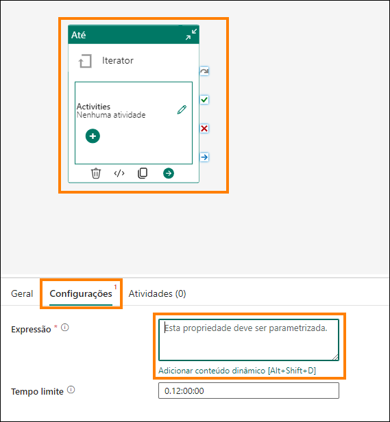

Precisamos escrever uma expressão que seja executada até que o valor de **varCounter seja 3** ou o valor **de varIsSuccess seja Sim**.(varCounter e varIsSuccess são as variáveis que acabamos de criar.)

8. A caixa de diálogo **Construtor de expressão de pipeline** é aberta. Na metade inferior da caixa de diálogo, você terá um menu:

    a. **Parâmetros**: são constantes em um data factory que podem ser consumidas por um pipeline em qualquer expressão.

    b. **Variáveis do sistema**: essas variáveis podem ser usadas em expressão ao definir entidades em qualquer serviço. Por exemplo, ID do pipeline, nome do pipeline, nome do gatilho, etc.

    c. **Parâmetros de gatilho**: parâmetros que acionaram o pipeline. Por exemplo, Nome do Arquivo ou Caminho da Pasta.

    d. **Funções**: você pode chamar funções dentro de expressão. As funções são categorizadas em Collection, Conversion, Date, Logical, Math e String. Por exemplo, concat é uma função String, add é uma função Math, etc.

    e. **Variáveis**: variáveis de pipeline são valores que podem ser definidos e modificados durante a execução de um pipeline. Ao contrário dos parâmetros do pipeline, que são definidos no nível do pipeline e não podem ser alterados durante a execução de pipeline, as variáveis do pipeline podem ser definidas e modificadas dentro de um pipeline usando uma atividade Definir Variável. Usaremos a atividade Definir Variável em breve.

    

9. Clique em **Funções** no menu inferior.

10. Na seção **Funções Lógicas**, selecione a **função or**. O aviso **@or()** é adicionado à caixa de texto da expressão dinâmica. A função "or" tem dois parâmetros. Estamos trabalhando no primeiro parâmetro.

    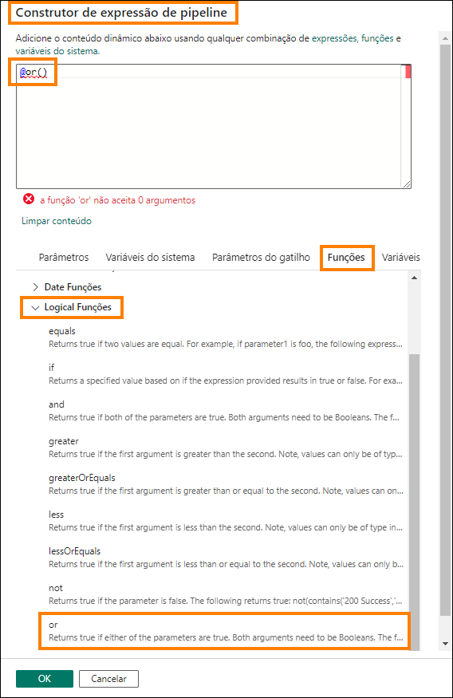

11. Coloque o cursor **entre os parênteses** da função **@or**.

12. Na seção **Funções Lógicas**, selecione a função **equals**. Observe que isso é adicionado à caixa de texto da expressão dinâmica. 

    **Observação**: Sua função deve ser semelhante a **@or(equals())**. A função equals também aceita dois parâmetros. Estaremos verificando se a variável varCounter é igual a 3.

    

13. Agora, coloque o cursor **entre os parênteses** da função **@equals** para adicionar os parâmetros.

14. No menu inferior, selecione **Variáveis**.

15. Selecione a variável **varCounter** que será o primeiro parâmetro.

16. Insira **3** como o segundo parâmetro da função equals. Como na captura de tela abaixo, sua expressão será **@or(equals(variables('varCounter'),3))**. 

    

17. Precisamos adicionar o segundo parâmetro à função "or". **Adicione uma vírgula** entre os dois parênteses finais. Desta vez, tentaremos digitar o nome da função. Comece a digitar **equ** e você verá uma lista suspensa das funções disponíveis (isso é chamado de IntelliSense). Selecione a função **equals**.

    

18. O primeiro parâmetro da função equals é uma variável. Coloque o **cursor antes da vírgula**.

19. Comece a digitar **variables(**

20. Com a ajuda do IntelliSense, selecione **variables('varIsSuccess')**.

21. Após a vírgula, vamos inserir o segundo parâmetro. Comece a digitar **variables(**

22. Com a ajuda do IntelliSense, selecione **variables('varSuccess')**. Aqui estamos comparando o valor de varIsSuccess com o valor de varSuccess (Sim é o valor por padrão de varSuccess).

    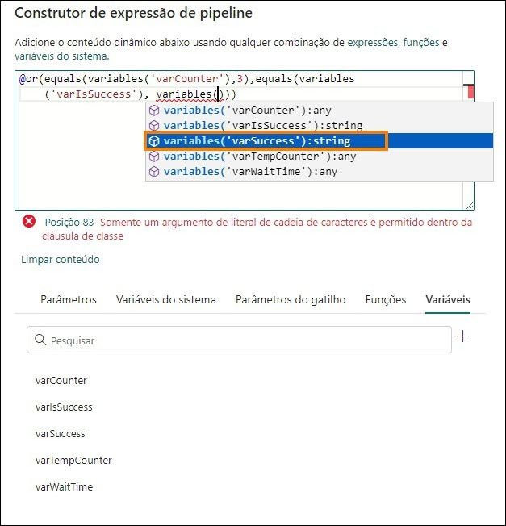

23. Sua expressão deve ser:

```
@or(equals(variables('varCounter'),3),equals(variables('varIsSuccess'), variables('varSuccess')))
```

24. Selecione OK.

    

## Tarefa 8: Configurar atividade Dataflow

1. Você será direcionado de volta à tela de design. Com a **atividade Until** selecionada, no **painel inferior**, selecione **Atividades**. Agora adicionaremos as atividades que precisam ser executadas.

2. Selecione o **ícone de Editar** na primeira linha. Você será direcionado para uma tela de design de iterador em branco.

    

3. No menu superior, selecione **Atividades -> Fluxo de dados**. A atividade Fluxo de dados é adicionada ao painel de design.

4. Com **atividade Fluxo de dados selecionada**, no painel inferior, selecione **Geral**. Vamos atribuir um nome e uma descrição à atividade.

5. No campo **Nome**, insira **dfactivity_People_SharePoint**.

6. No campo **Descrição**, insira **Dataflow activity to refresh df_People_Sharepoint dataflow**.

    

7. Selecione **Configurações** no painel inferior.

8. Certifique-se de que o **Workspace** esteja definido como seu workspace **FAIAD_\<nome de usuário>**.

9. Na lista suspensa **Fluxo de dados**, selecione **df_People_SharePoint**. Quando esta atividade Fluxo de dados for executada, ela atualizará **df_People_SharePoint**.

    

## Tarefa 9: Configurar 1ª atividade Set variable

Configuramos a atividade Fluxo de dados como fizemos anteriormente no laboratório. Agora, adicionaremos uma nova lógica. Se a atualização do fluxo de dados for bem-sucedida, precisaremos sair do iterador Until. Lembre-se de que uma das condições para a existência do iterador é definir 
o valor da variável varIsSuccess como Sim.

1. No menu superior, selecione **Atividades -> Definir variável**. A atividade Definir variável é adicionada à tela de design.

2. Com a **atividade Definir variável** selecionada, no painel inferior, selecione **Geral**. Vamos atribuir um nome e uma descrição à atividade.

3. No campo **Nome**, insira **set_varIsSuccess**.

4. No campo **Descrição**, insira **Definir variável varIsSuccess como Sim**.

    **Observação**: Passe o mouse sobre atividade Fluxo de dados. À direita da caixa de atividades existem quatro ícones. Eles podem ser usados para conectar-se à próxima atividade com base no resultado da atividade:

    a. O ícone de **seta curvada cinza** é usado para pular a atividade.
    
    b. O ícone de **marca de seleção verde** é usado no sucesso da atividade.
    
    c. O ícone de **marca x vermelho** é usado na falha da atividade.
    
    d. O ícone de **seta reta azul** é usado na conclusão da atividade.

5. Clique na **marca de seleção verde** da atividade de Fluxo de dados dfactivity_People_SharePoint e arraste para se conectar à nova **atividade Definir variável set_varIsSuccess**. Portanto, se a atualização do fluxo de dados for bem-sucedida, queremos executar a atividade Definir variável.

    

6. Com a **atividade Definir variável** selecionada, clique em **Configurações** no menu inferior.

7. No painel inferior, verifique se **Tipo de variável** é **Variável de pipeline**.

8. No campo **Nome**, selecione **varIsSucces**. Esta é a variável cujo valor vamos definir.

9. No campo **Valor**, selecione a **caixa de texto**. Selecione o link **Adicionar conteúdo dinâmico**.

    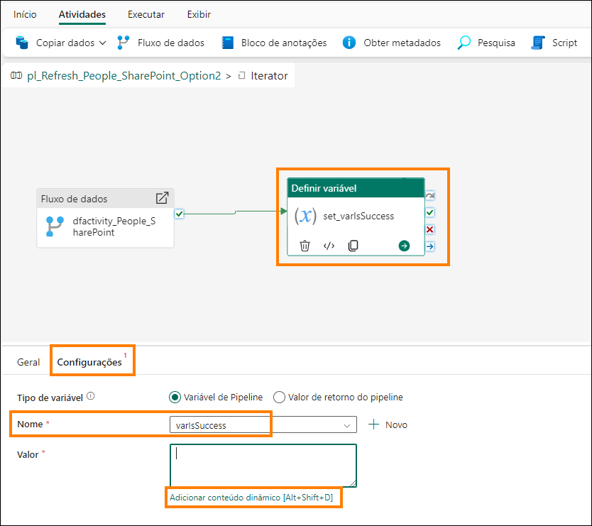

10. A caixa de diálogo Construtor de expressão de pipeline é aberta. Selecione a área de texto **Adicionar conteúdo dinâmico abaixo usando qualquer combinação de expressão, funções e variáveis do sistema**.

11. No menu inferior, selecione **Variáveis -> varSuccess**. Observe que @variables('varSuccess') é inserido na área de texto Adicionar conteúdo dinâmico abaixo. Lembre-se de que quando criamos variáveis, predefinimos o valor da variável varSuccess como Sim. Portanto, estamos atribuindo o valor Sim à variável varIsSuccess.

12. Selecione **OK**. Você será direcionado de volta ao **painel de design do iterador**.

    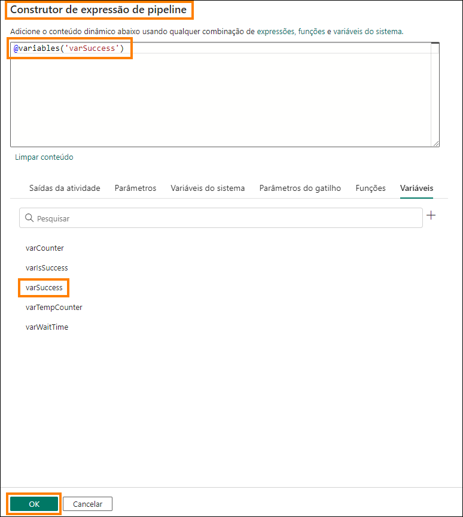

Agora, precisamos definir o contador se a atividade do fluxo de dados falhar. No Pipeline de dados, não podemos ter autorreferência de uma variável. O que significa que não podemos incrementar a variável do contador varCounter adicionando um ao seu valor (varCounter = varCounter + 1). Então, usamos a variável varTempCounter.

## Tarefa 10: Configurar 2ª atividade Set variable

1. No menu superior, selecione **Atividades -> Definir variável**. A atividade Definir variável é adicionada à tela de design.

2. Com a **atividade Definir variável** selecionada, no painel inferior, selecione **Geral**. Vamos atribuir um nome e uma descrição à atividade.

3. No campo **Nome**, insira **set_varTempCounter**.

4. No campo **Descrição**, insira **Incrementar variável varTempCounter**.

5. Clique na **marca x vermelha** da atividade Fluxo de dados para a nova atividade Definir variável. Portanto, se a atualização do fluxo de dados falhar, queremos executar a atividade Definir variável.

    

6. Com a **atividade Definir variável** selecionada, escolha **Configurações** no menu inferior.

7. No painel inferior, verifique se **Tipo de variável** é **Variável de pipeline**.

8. No campo **Nome**, selecione **varTempCounter**. Esta é a variável cujo valor vamos definir.

9. No campo **Valor**, selecione a **caixa de texto**. Selecione o link **Adicionar conteúdo dinâmico**.

10. A caixa de diálogo Construtor de expressões de pipeline é aberta. Insira **@add(variables('varCounter'),1)**.

    **Observação**: Sinta-se à vontade para digitar esta expressão, usar o menu para selecionar as funções ou copiá-la e colá-la. Esta função define o valor da variável varTempCounter como o valor da variável varCounter mais um, (varTempCounter = varCounter + 1).

    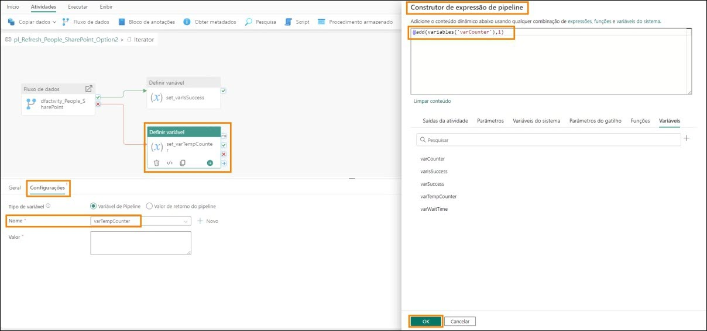

Agora, precisamos definir o valor da variável varCounter como o valor de varTempCounter. 

## Tarefa 11: Configurar 3ª atividade Set variable

1. No menu superior, selecione **Atividades -> Definir variável**. A atividade Definir variável 
é adicionada à tela de design.

2. Com a **atividade Definir variável** selecionada, no painel inferior, selecione **Geral**. Vamos atribuir um nome e uma descrição à atividade.

3. No campo **Nome**, insira **set_varCounter**.

4. No campo **Descrição**, insira **Incrementar variável varCounter**.

5. Clique na **marca de seleção verde** da atividade Definir variável set_varTempCounter e arraste para se conectar à nova **atividade Definir variável set_varCounter**. 

    

6. Com a **atividade Definir variável set_varCounter** selecionada, clique em **Configurações** no menu inferior.

7. No painel inferior, verifique se **Tipo de variável** é **Variável de pipeline**.

8. No campo **Nome**, selecione **varCounter**. Esta é a variável cujo valor vamos definir.

9. No campo **Valor**, selecione a **caixa de texto**. Selecione o link **Adicionar conteúdo dinâmico**.

10. A caixa de diálogo Construtor de expressões de pipeline é aberta. Insira **@variables('varTempCounter')**. Sinta-se à vontade para digitar esta expressão, usar o menu para selecionar as funções ou copiá-la e colá-la. 

    **Observação**: Esta função define o valor da variável varCounter como o valor da variável varTempCounter (varCounter = varTempCounter). No final de cada iteração, varCounter e varTempCounter têm o mesmo valor.

    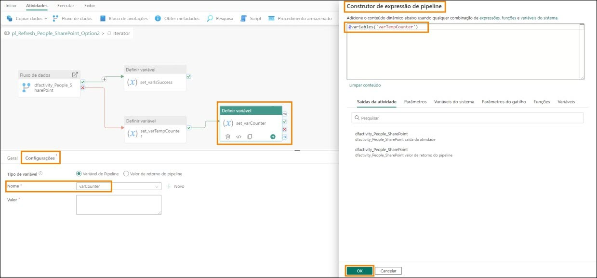

## Tarefa 12: Configurar atividade Wait

Em seguida, precisamos esperar 5 minutos/300 segundos se a atualização do fluxo de dados falhar na primeira vez antes de tentar novamente. SE a atualização do fluxo de dados falhar pela segunda vez, precisaremos esperar 15 minutos/900 segundos e tentar novamente. Usaremos a atividade Wait e a variável varWaitTime para definir o tempo de espera.

1. No menu superior, selecione **Atividades -> reticências (…) -> Wait**. A atividade Wait é adicionada à tela de design.

2. Com **atividade Wait** selecionada, no painel inferior, selecione **Geral**. Vamos atribuir um nome e uma descrição à atividade.

3. No campo **Nome**, insira **wait_onFailure**.

4. No campo **Descrição**, insira **Aguarde 300 segundos na 2ª tentativa e 900 segundos na 3ª**.

5. Clique na **marca de seleção verde** da atividade Definir variável set_varCounter e arraste para se conectar à nova **atividade Wait wait_onFailure**. 

    

6. Com a **atividade Wait** selecionada, clique em **Configurações** no menu inferior.

7. No campo **Tempo de espera em segundos**, selecione a **caixa de texto** e selecione o link Adicionar conteúdo dinâmico.

8. A caixa de diálogo Construtor de expressão de pipeline é aberta. Insira 

    ```
    @if(
     greater(variables(‘varCounter’), 1),
     if(equals(variables(‘varCounter’), 2),
     mul(variables(‘varWaitTime’),15 ), 
     mul(variables(‘varWaitTime’), 0)
     ),
     mul(variables(‘varWaitTime’),5 )
    )
    ```

    Sinta-se à vontade para digitar esta expressão, usar o menu para selecionar as funções ou copiá-la e colá-la.

    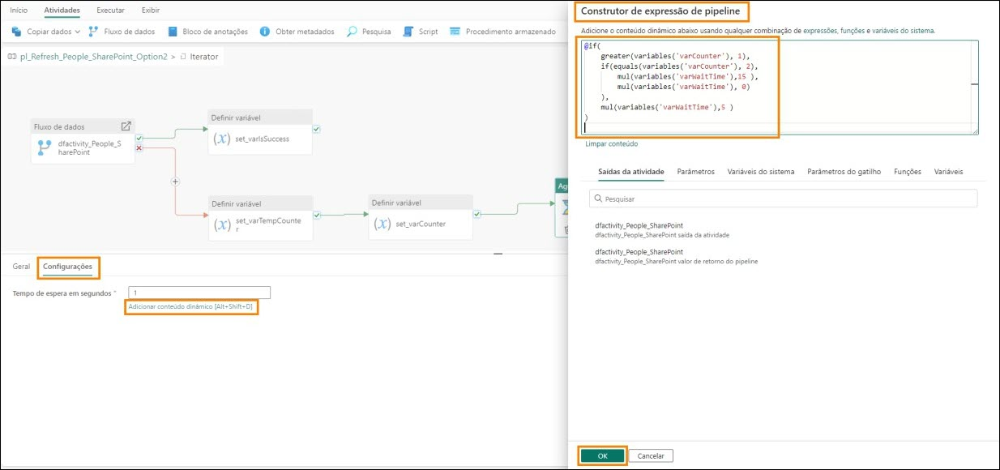

    Estamos usando duas novas funções aqui:

    - **greater**: usa dois números como parâmetros e compara qual deles é maior.
    
    - **mul**: esta é uma função de multiplicação; ela usa dois parâmetros para multiplicar. 

A expressão é uma instrução if aninhada. Ela está verificando se o valor da variável varCounter é maior que 1. Se for verdadeiro, ela verifica se o valor da variável varCounter é 2. Se for verdadeiro, ela define o tempo de espera para varWaitTime vezes 15. Lembre-se, definimos como padrão o valor de varWaitTime para 60. Isso seria 60\*15 = 900 segundos. Se o valor da variável varCounter não for 2 (for maior que 2, o que significa que a atualização do fluxo de dados falhou 3 vezes, terminamos a iteração. Não precisamos mais esperar), o tempo de espera é definido como varWaitTime * 0. Portanto, como 0. Se o valor da variável varCounter for 1,multiplicaremos varWaitTime * 5. Isso seria 60\*5 = 300 segundos.

9. Selecione **OK**. 

    **Ponto de verificação**: O iterador Until deve ser semelhante à captura de tela abaixo.

    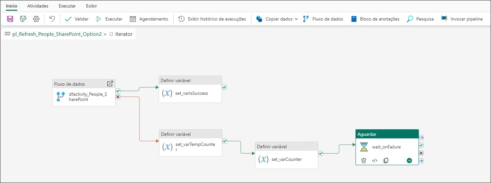

10. Na parte superior esquerda da tela de design, selecione
**pl_Refresh_People_Sharepoint_Option2** para sair do iterador Until. 

    

11. Terminamos de criar o pipeline de dados. No menu superior, selecione **Página Inicial -> ícone de Salvar** para salvar o pipeline de dados.

    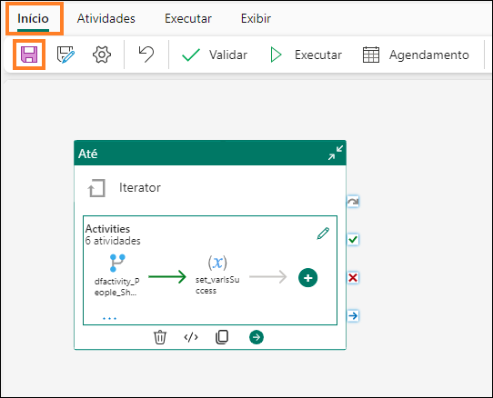

## Tarefa 13: Configurar atualização de agenda para o Pipeline de dados

1. Podemos testar o pipeline de dados selecionando **Página Inicial -> Executar**. 

    **Observação**: Pode levar alguns minutos para que o pipeline de dados seja atualizado. Este é um ambiente de treinamento, portanto o arquivo no SharePoint está sempre disponível. Consequentemente, o pipeline de dados nunca falhará.

2. Podemos definir o pipeline de dados para ser executado de acordo com uma agenda. No menu superior, selecione **Página Inicial > Agenda**. A caixa de diálogo Agenda é aberta.

3. Defina o botão de opção **Execução agendada** como **Ativado**.

4. Defina a **lista suspensa Repetir** como **Diariamente**.

5. Defina **Hora** como **9:00**.

6. Defina **Data e hora de início** como **Hoje**.

7. Defina **Data e hora de término** como uma **data futura**.

8. Defina seu **Fuso horário**.

    **Observação**: Como este é um ambiente de laboratório, você pode definir o fuso horário de sua preferência. Em um cenário real, você definirá o fuso horário com base em sua localização ou na localização da fonte de dados.

9. Selecione **Aplicar**.

10. Selecione a marca **X** na parte superior direita da caixa de diálogo para fechá-la.

    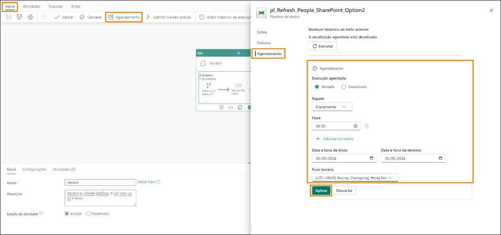

11. Selecione seu workspace do Fabric **FAIAD_\<nome de usuário>** no painel esquerdo para navegar até o workspace.

**Observação**: Na tela Agendamento, não há opção de notificação sobre sucesso ou falha (como Agendamento do Fluxo de dados). A notificação pode ser feita adicionando uma atividade no Pipeline de dados. Não estamos fazendo isso neste laboratório, pois é um ambiente de laboratório. 

Agendamos atualizações para as diversas fontes de dados. Criaremos um modelo semântico com relacionamentos, medidas e outras operações de modelagem no próximo laboratório.

# Referências

O Fabric Analyst in a Day (FAIAD) apresenta algumas das principais funções disponíveis no Microsoft Fabric. No menu do serviço, a seção Ajuda (?) tem links para ótimos recursos.

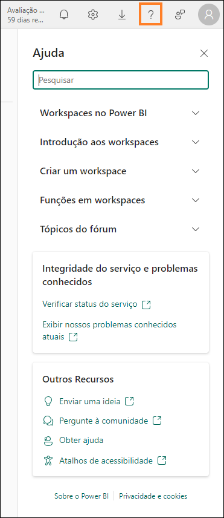

Veja aqui mais alguns recursos que ajudarão você com as próximas etapas do Microsoft Fabric.

- Veja a postagem do blog para ler o [anúncio completo de GA do Microsof t Fabric](https://aka.ms/Fabric-Hero-Blog-Ignite23)

- Explore o Fabric por meio do [Tour Guiado](https://aka.ms/Fabric-GuidedTour)

- Inscreva-se para a [avaliação gratuita do Microsof t Fabric](https://aka.ms/try-fabric)

- Visite o [site do Microsof t Fabric](https://aka.ms/microsoft-fabric)

- Aprenda novas habilidades explorando os [módulos de Aprendizagem do Fabric](https://aka.ms/learn-fabric)

- Explore a [documentação técnica do Fabric](https://aka.ms/fabric-docs)

- Leia o [livro eletrônico gratuito sobre como começar a usar o Fabric](https://aka.ms/fabric-get-started-ebook)

- Participe da [comunidade do Fabric](https://aka.ms/fabric-community) para postar suas perguntas, compartilhar seus comentários e aprender com outras pessoas

Leia os blogs de comunicados de experiências do Fabric em mais detalhes:

- [Experiência do Data Factory no blog do Fabric](https://aka.ms/Fabric-Data-Factory-Blog)
- [Experiência do Synapse Data Engineering no blog do Fabric](https://aka.ms/Fabric-DE-Blog)
- [Experiência do Synapse Data Science no blog do Fabric](https://aka.ms/Fabric-DS-Blog)
- [Experiência do Synapse Data Warehousing no blog do Fabric](https://aka.ms/Fabric-DW-Blog)
- [Experiência do Synapse Real-Time Analytics no blog do Fabric](https://aka.ms/Fabric-RTA-Blog)
- [Blog de comunicado do Power BI](https://aka.ms/Fabric-PBI-Blog)
- [Experiência do Data Activator no blog do Fabric](https://aka.ms/Fabric-DA-Blog)
- [Administração e governança no blog do Fabric](https://aka.ms/Fabric-Admin-Gov-Blog)
- [OneLake no blog do Fabric](https://aka.ms/Fabric-OneLake-Blog)
- [Blog de integração do Dataverse e Microsof t Fabric](https://aka.ms/Dataverse-Fabric-Blog)


© 2023 Microsoft Corporation. Todos os direitos reservados.

Ao usar esta demonstração/este laboratório, você concorda com os seguintes termos:

A tecnologia/funcionalidade descrita nesta demonstração/neste laboratório é fornecida pela Microsoft Corporation para obter seus comentários e oferecer uma experiência de aprendizado. Você pode usar a demonstração/o laboratório somente para avaliar tais funcionalidades e recursos de tecnologia e fornecer comentários à Microsoft. Você não pode usá-los para nenhuma outra finalidade. Você não pode modificar, copiar, distribuir, transmitir, exibir, executar, reproduzir, publicar, licenciar, criar obras derivadas, transferir nem vender esta demonstração/este laboratório ou qualquer parte deles.

A CÓPIA OU A REPRODUÇÃO DA DEMONSTRAÇÃO/DO LABORATÓRIO (OU DE QUALQUER PARTE DELES) EM QUALQUER OUTRO SERVIDOR OU LOCAL PARA REPRODUÇÃO OU REDISTRIBUIÇÃO ADICIONAL É EXPRESSAMENTE PROIBIDA.

ESTA DEMONSTRAÇÃO/ESTE LABORATÓRIO FORNECE DETERMINADOS RECURSOS E FUNCIONALIDADES DE PRODUTO/TECNOLOGIA DE SOFTWARE, INCLUINDO NOVOS RECURSOS E CONCEITOS POTENCIAIS, EM UM AMBIENTE SIMULADO SEM CONFIGURAÇÃO NEM INSTALAÇÃO COMPLEXA PARA A FINALIDADE DESCRITA ACIMA. A TECNOLOGIA/OS CONCEITOS REPRESENTADOS NESTA DEMONSTRAÇÃO/NESTE LABORATÓRIO PODEM NÃO REPRESENTAR A FUNCIONALIDADE COMPLETA DOS RECURSOS E PODEM NÃO FUNCIONAR DA MESMA MANEIRA QUE UMA VERSÃO FINAL. ALÉM DISSO, PODEMOS NÃO LANÇAR UMA VERSÃO FINAL DE TAIS RECURSOS OU CONCEITOS. SUA EXPERIÊNCIA COM O USO DE TAIS RECURSOS E FUNCIONALIDADES EM UM AMBIENTE FÍSICO TAMBÉM PODE SER DIFERENTE.

**COMENTÁRIOS**. Caso você forneça comentários sobre os recursos de tecnologia, as funcionalidades e/ou os conceitos descritos nesta demonstração/neste laboratório à Microsoft, você concederá à Microsoft, sem encargos, o direito de usar, compartilhar e comercializar seus comentários de qualquer forma e para qualquer finalidade. Você também concede a terceiros, sem encargos, quaisquer direitos de patente necessários para que seus produtos, suas tecnologias e seus serviços usem ou interajam com partes específicas de um software ou um serviço da Microsoft que inclua os comentários. Você não fornecerá comentários que estejam sujeitos a uma licença que exija que a Microsoft licencie seu software ou sua documentação para terceiros em virtude da inclusão de seus comentários neles. Esses direitos continuarão em vigor após o término do contrato.

POR MEIO DESTE, A MICROSOFT CORPORATION SE ISENTA DE TODAS AS GARANTIAS E CONDIÇÕES REFERENTES À DEMONSTRAÇÃO/AO LABORATÓRIO, INCLUINDO TODAS AS GARANTIAS E CONDIÇÕES DE COMERCIALIZAÇÃO, SEJAM ELAS EXPRESSAS, IMPLÍCITAS OU ESTATUTÁRIAS, E DE ADEQUAÇÃO A UMA FINALIDADE ESPECÍFICA, TÍTULO E NÃO VIOLAÇÃO. A MICROSOFT NÃO DECLARA NEM GARANTE A PRECISÃO DOS RESULTADOS DERIVADOS DO USO DA DEMONSTRAÇÃO/DO LABORATÓRIO NEM A ADEQUAÇÃO DAS INFORMAÇÕES CONTIDAS NA DEMONSTRAÇÃO/NO LABORATÓRIO A QUALQUER FINALIDADE.
 
**AVISO DE ISENÇÃO DE RESPONSABILIDADE**

Esta demonstração/este laboratório contém apenas uma parte dos novos recursos e aprimoramentos do Microsoft Power BI. Alguns dos recursos podem ser alterados em versões futuras do produto. Nesta demonstração/neste laboratório, você aprenderá sobre alguns dos novos recursos, mas não todos.

